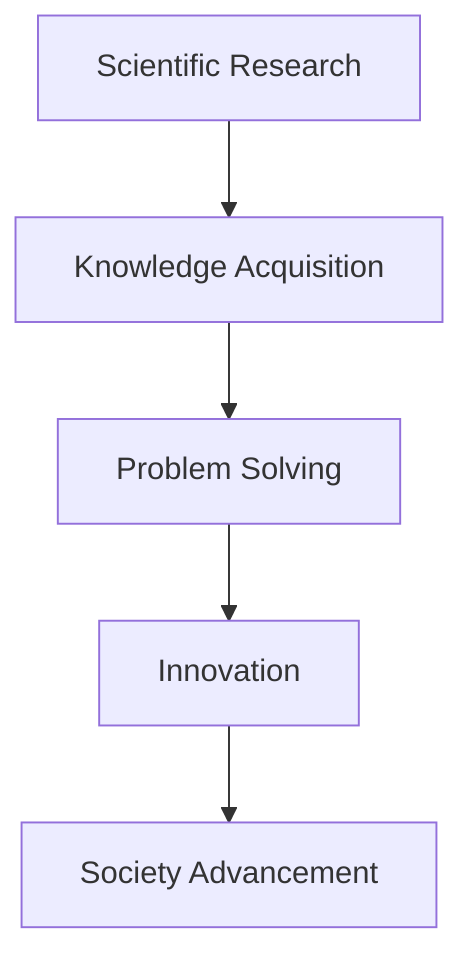
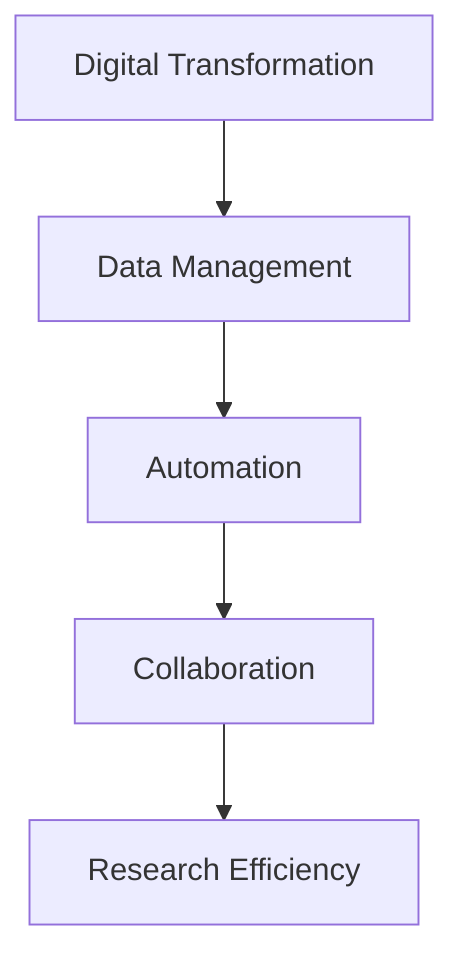
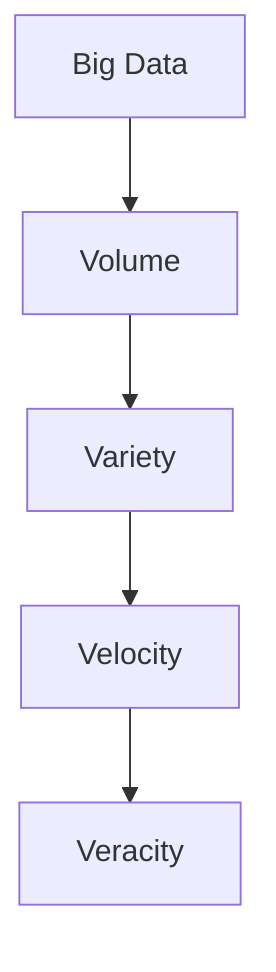
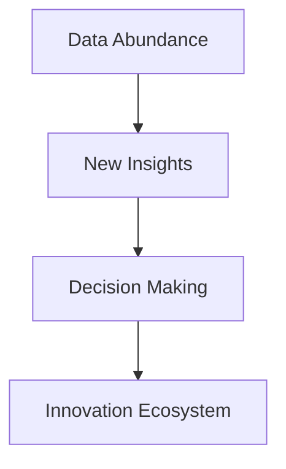
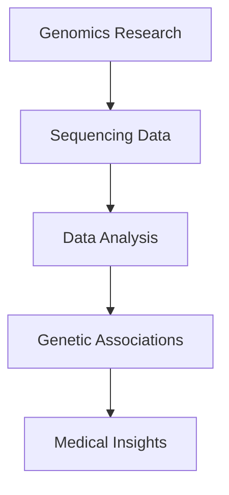
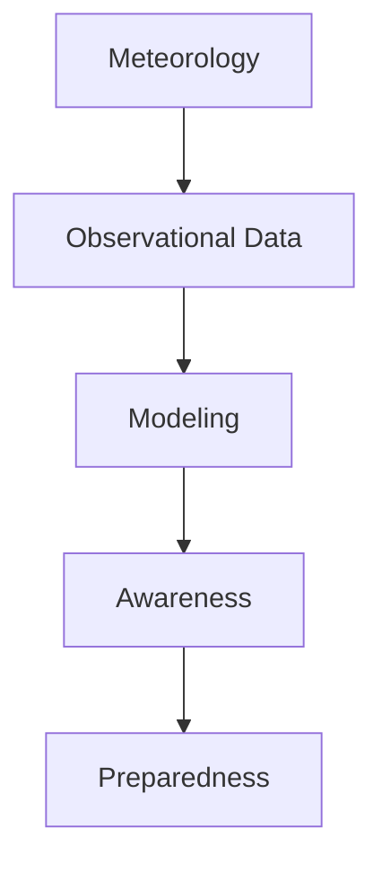
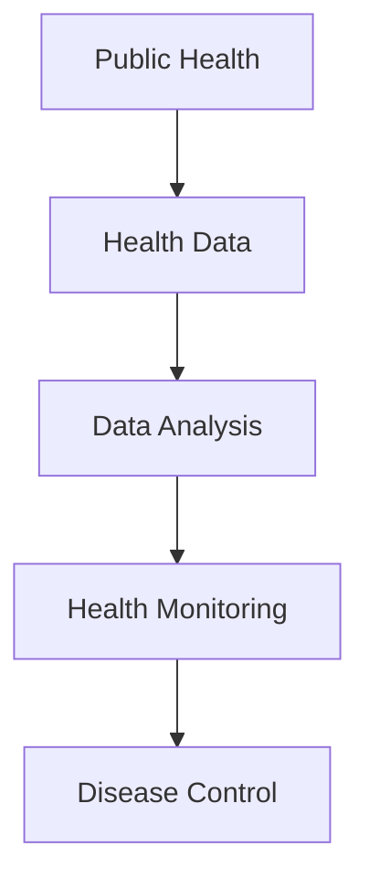
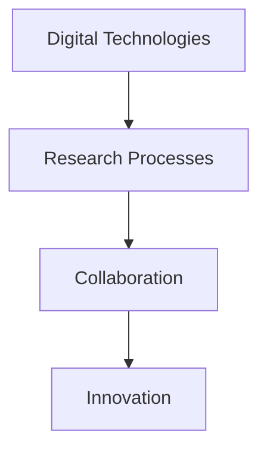

                 

Okay, let's break this down step by step to ensure we create a comprehensive and detailed article that meets all the specified requirements.

### Step 1: Introduction and Background
We will start with a captivating introduction that sets the stage for the article. This section will provide a brief overview of the importance of scientific research, the concept of digital transformation, and the impact of big data on the way we understand the world.

**Keywords:**
- Scientific Research
- Digital Transformation
- Big Data
- World Understanding
- Data-Driven Research

**Abstract:**
This article explores the transformative impact of digital technology on scientific research, focusing on the integration of big data and its implications for the way we understand and interpret the world. Through a series of detailed explanations, practical examples, and case studies, we will delve into the core concepts, algorithms, and mathematical models that underpin this digital revolution in science.

### Step 2: Overview of Scientific Research
In this section, we will delve deeper into the significance of scientific research, its methodologies, and the trends and challenges it faces in the modern era.

**1.1 Importance of Scientific Research**
- **Core Concepts and Connections:**
  - Scientific research: The systematic investigation and analysis of phenomena to gain knowledge and understanding.
  - Digital transformation: The process of utilizing digital technologies to improve research efficiency and outcomes.

**Mermaid Flowchart:**

**Core Algorithm Principle Explanation:**
- Research methodologies: Experimental design, data collection, data analysis, and conclusion validation.

**Mathematical Model and Formula Explanation:**
- Hypothesis testing: $$ H_0: \mu = \mu_0 $$ vs. $$ H_1: \mu \neq \mu_0 $$
- Confidence intervals: $$ \bar{x} \pm z_{\alpha/2} \sqrt{\frac{\sigma^2}{n}} $$

**Example:**
- Example of hypothesis testing in medical research.

### Step 3: Digital Transformation in Scientific Research
This section will cover the concept of digital transformation, its technological foundations, and its applications in scientific research.

**2.1 Concept and Significance of Digital Transformation**
- **Core Concepts and Connections:**
  - Digital transformation: The integration of digital technologies into all aspects of an organization to fundamentally change how it operates and delivers value to customers.
  - Scientific research: The application of digital technologies to enhance research processes and outcomes.

**Mermaid Flowchart:**

**Core Algorithm Principle Explanation:**
- Digital tools and platforms for research: Data management systems, cloud computing, and artificial intelligence.

**Mathematical Model and Formula Explanation:**
- Predictive modeling: Regression analysis, time series forecasting.

**Example:**
- Example of using cloud computing for data storage and analysis in astrophysics research.

### Step 4: Big Data Applications in Scientific Research
We will explore the definition and characteristics of big data, its collection, storage, and processing, and its value in scientific research.

**3.1 Definition and Characteristics of Big Data**
- **Core Concepts and Connections:**
  - Big data: Extremely large data sets that can be analyzed computationally to reveal patterns, trends, and associations, especially relating to human behavior and interactions.

**Mermaid Flowchart:**

**Core Algorithm Principle Explanation:**
- Data processing frameworks: Hadoop, Spark.

**Mathematical Model and Formula Explanation:**
- Data mining algorithms: Clustering, classification, association rule learning.

**Example:**
- Example of using data mining to identify patterns in social media data for public health monitoring.

### Step 5: Understanding the World in the Age of Big Data
This section will discuss the changes in worldview and methodology brought about by big data and their societal implications.

**4.1 Worldview Changes in the Age of Big Data**
- **Core Concepts and Connections:**
  - Big data: A paradigm shift from data scarcity to data abundance, leading to new ways of understanding the world.

**Mermaid Flowchart:**

**Core Algorithm Principle Explanation:**
- Data-driven decision-making processes.

**Mathematical Model and Formula Explanation:**
- Machine learning models: Supervised learning, unsupervised learning.

**Example:**
- Example of using machine learning to predict disease outbreaks.

### Step 6: Case Studies
We will present several case studies to illustrate the practical applications of digital transformation and big data in scientific research.

**5.1 Case Study: Digital Transformation in Genomic Research**
- **Core Concepts and Connections:**
  - Genomics: The study of genes, heredity, and genetic variation in organisms.
  - Digital transformation: The use of advanced computational tools for genetic data analysis.

**Mermaid Flowchart:**

**Core Algorithm Principle Explanation:**
- Next-generation sequencing: Bioinformatics analysis pipelines.

**Mathematical Model and Formula Explanation:**
- Genetic association tests: Likelihood ratio tests, genetic risk scores.

**Example:**
- Example of using genomic data to identify genetic factors associated with a particular disease.

**5.2 Case Study: Artificial Intelligence in Meteorology**
- **Core Concepts and Connections:**
  - Meteorology: The science of the atmosphere, especially as it relates to weather and climate.
  - AI: The application of machine learning algorithms for weather forecasting and climate modeling.

**Mermaid Flowchart:**

**Core Algorithm Principle Explanation:**
- Weather forecasting models: Numerical weather prediction, ensemble forecasting.

**Mathematical Model and Formula Explanation:**
- Atmospheric thermodynamics: equations of state, hydrostatic equilibrium.

**Example:**
- Example of using AI to improve weather forecasting accuracy.

**5.3 Case Study: Big Data in Public Health**
- **Core Concepts and Connections:**
  - Public health: The science and art of preventing disease, prolonging life, and promoting health through organized efforts and informed choices.
  - Big data: The use of large-scale data analytics to monitor and manage public health.

**Mermaid Flowchart:**

**Core Algorithm Principle Explanation:**
- Epidemiological modeling: Contact networks, transmission dynamics.

**Mathematical Model and Formula Explanation:**
- Statistical models for infectious disease spread: SEIR models, SIRS models.

**Example:**
- Example of using big data to track the spread of infectious diseases.

### Step 7: Future Prospects
This final section will look ahead to the future of scientific research in the age of digital transformation and big data.

**6.1 Trends in Scientific Research Transformation**
- **Core Concepts and Connections:**
  - Digital transformation: The ongoing integration of digital technology into scientific research practices.

**Mermaid Flowchart:**

**Core Algorithm Principle Explanation:**
- Future technologies: Quantum computing, advanced AI, blockchain.

**Mathematical Model and Formula Explanation:**
- Quantum algorithms: Quantum Fourier transform, quantum linear algebra.

**Example:**
- Example of how quantum computing might revolutionize scientific research.

### Conclusion and Future Directions
We will conclude the article with a summary of the key points discussed and insights gained. We will also highlight potential future directions for scientific research in the digital age.

### Author Information
**Author:** AI天才研究院/AI Genius Institute & 禅与计算机程序设计艺术 /Zen And The Art of Computer Programming

### Final Notes
- Ensure all sections are well-integrated and logically flow from one to another.
- Use markdown formatting consistently throughout the article.
- Include LaTeX for mathematical formulas and Python for code snippets.
- Ensure the article is within the specified word count range (10,000-12,000 words).

By following these steps, we will create a well-structured, informative, and engaging article that effectively communicates the transformative impact of digital technology on scientific research.

