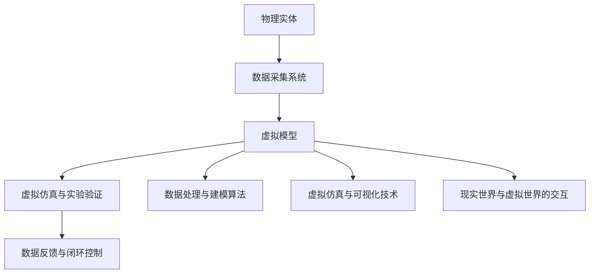

                 

### 科学研究的数字孪生技术：虚拟世界辅助现实世界的理解

#### 关键词
- 数字孪生
- 虚拟仿真
- 现实世界
- 科学研究
- 应用场景

#### 摘要
本文旨在探讨数字孪生技术在科学研究中的应用，以及如何通过虚拟世界辅助对现实世界的理解。我们将首先介绍数字孪生的基本概念和重要性，然后详细阐述其架构、核心技术以及在各个领域中的应用实践。最后，我们将探讨数字孪生技术的发展趋势、面临的挑战与机遇，并对其未来进行展望。

## 第一部分：数字孪生技术基础

### 1.1 数字孪生概念与重要性

#### 1.1.1 数字孪生的定义
数字孪生（Digital Twin）是一种创新的数字化技术，它通过创建与物理实体相对应的虚拟模型，实现对其在整个生命周期内的实时监测、分析和优化。数字孪生不仅是对物理实体的虚拟复制，更重要的是通过数据驱动的方式，将物理实体的实际运行状态与虚拟模型进行动态同步，从而实现对现实世界的精确模拟和预测。

#### 1.1.2 数字孪生技术的发展历程
数字孪生技术的发展可以追溯到20世纪80年代，最初的应用主要集中在航空航天领域。随着计算机技术、传感器技术、仿真技术和大数据分析技术的不断发展，数字孪生技术逐渐成熟，并开始广泛应用于工业制造、医疗、能源等多个领域。

#### 1.1.3 数字孪生技术在科学研究中的应用价值
数字孪生技术在科学研究中的价值体现在多个方面。首先，它能够大幅提高实验效率，通过虚拟实验减少物理实验的次数，从而降低实验成本。其次，数字孪生技术可以实现对复杂系统的实时监控和分析，为科学研究提供更全面、更深入的见解。最后，数字孪生技术促进了跨学科合作，通过将不同领域的专家和资源整合到一个统一的虚拟平台上，提高了科学研究的协同效率。

### 1.2 数字孪生架构

#### 1.2.1 数字孪生基本架构
数字孪生基本架构通常包括四个主要部分：物理实体、数据采集系统、虚拟模型和反馈控制系统。

1. **物理实体**：这是数字孪生的核心，是现实世界中的对象或系统，如机器、设备、建筑物等。
2. **数据采集系统**：通过传感器、摄像头、GPS等设备实时采集物理实体的状态数据。
3. **虚拟模型**：基于采集到的数据，构建一个与物理实体相对应的虚拟模型。
4. **反馈控制系统**：将虚拟仿真结果反馈给物理实体，实现对物理实体的实时控制和优化。

#### 1.2.2 数据采集与建模
数据采集是数字孪生的第一步，其质量直接影响虚拟模型的准确性。数据采集系统需要实时、准确地获取物理实体的各种状态信息，如温度、压力、振动、位置等。这些数据通过传感器、摄像头等设备进行采集，然后通过数据预处理模块进行处理，以便后续建模和使用。

建模是将物理实体转化为虚拟模型的过程。建模算法通常包括物理建模和数据驱动建模两种方法。物理建模是基于物理原理和数学模型构建虚拟模型，适用于结构稳定、物理特性明确的实体。数据驱动建模则是基于历史数据和实时数据，通过机器学习算法和深度学习模型进行建模，适用于结构复杂、物理特性不明确的实体。

#### 1.2.3 虚拟仿真与实验验证
虚拟仿真是对虚拟模型进行多种场景的实验验证，以验证其准确性和可靠性。通过虚拟仿真，研究人员可以在虚拟环境中进行各种实验，如温度变化、压力变化、负载变化等，以观察虚拟模型在这些条件下的行为和响应。虚拟仿真不仅可以大幅降低实验成本，还可以提高实验效率。

实验验证是将虚拟仿真结果与实际物理实体进行对比，以验证虚拟模型的准确性和可靠性。通过实验验证，研究人员可以不断优化虚拟模型，提高其准确性和实用性。

#### 1.2.4 数据反馈与闭环控制
数据反馈是将虚拟仿真结果反馈给物理实体，实现对物理实体的实时控制和优化。通过数据反馈，物理实体可以实时调整其运行状态，以适应不同的环境和条件。例如，在航空航天领域，数字孪生技术可以实时监控飞行器的状态，并根据虚拟仿真结果调整飞行器的姿态和速度，以提高飞行效率和安全性。

闭环控制是将数据反馈系统与虚拟模型相结合，形成一个完整的控制循环。通过闭环控制，物理实体可以实时调整其运行状态，以实现最优的性能和效果。例如，在智能制造领域，数字孪生技术可以实时监控生产线的状态，并根据虚拟仿真结果调整生产参数，以提高生产效率和质量。

### 1.3 数字孪生核心技术

#### 1.3.1 数据采集与存储
数据采集是数字孪生的核心，其质量直接影响虚拟模型的准确性。数据采集系统需要实时、准确地获取物理实体的各种状态信息，如温度、压力、振动、位置等。这些数据通过传感器、摄像头等设备进行采集，然后通过数据预处理模块进行处理，以便后续建模和使用。

数据存储则是将采集到的数据存储到数据库或其他存储系统中，以便后续的建模和分析。数据存储需要高效、安全和可靠，以满足数字孪生技术对大规模数据存储和处理的需求。

#### 1.3.2 数据处理与建模算法
数据处理与建模算法是构建虚拟模型的关键，包括数据预处理、特征提取、模型构建和训练等步骤。

数据预处理是数据处理的第一步，其目的是去除噪声、缺失值和异常值，提高数据的质量和可靠性。特征提取是将原始数据转化为有用的特征表示，以便后续的建模和分类。常用的特征提取方法包括主成分分析（PCA）、线性判别分析（LDA）和自编码器（Autoencoder）等。

模型构建是建立虚拟模型的过程，其目的是通过数学模型来描述物理实体的行为和特性。常用的模型构建方法包括物理建模和数据驱动建模。物理建模是基于物理原理和数学模型构建虚拟模型，适用于结构稳定、物理特性明确的实体。数据驱动建模则是基于历史数据和实时数据，通过机器学习算法和深度学习模型进行建模，适用于结构复杂、物理特性不明确的实体。

模型训练是模型构建的最后一步，其目的是通过训练数据来调整模型的参数，以提高模型的准确性和鲁棒性。常用的模型训练方法包括梯度下降（Gradient Descent）、随机梯度下降（Stochastic Gradient Descent）和亚当优化器（Adam Optimizer）等。

#### 1.3.3 虚拟仿真与可视化技术
虚拟仿真是对虚拟模型进行多种场景的实验验证，以验证其准确性和可靠性。通过虚拟仿真，研究人员可以在虚拟环境中进行各种实验，如温度变化、压力变化、负载变化等，以观察虚拟模型在这些条件下的行为和响应。虚拟仿真不仅可以大幅降低实验成本，还可以提高实验效率。

可视化技术则是将虚拟仿真结果以图形化的方式展示出来，使研究人员能够直观地理解和分析虚拟模型的行为和特性。常用的可视化技术包括三维建模、热图显示、数据仪表板等。

#### 1.3.4 现实世界与虚拟世界的交互
现实世界与虚拟世界的交互是实现数字孪生技术价值的重要途径，包括数据同步、远程控制等。

数据同步是将物理实体的实时数据同步到虚拟模型中，以确保虚拟模型与物理实体的状态一致。远程控制则是通过虚拟模型对物理实体进行远程操作和控制，以提高操作的效率和灵活性。

### 1.4 数字孪生在科学研究中的应用场景

#### 1.4.1 航空航天领域
数字孪生技术在航空航天领域具有广泛的应用。例如，在航天器设计和制造过程中，通过数字孪生技术可以实现对航天器结构的精确模拟和优化，提高设计效率和安全性。在航天器运行过程中，数字孪生技术可以实时监控航天器的状态，预测可能出现的问题，并采取相应的措施进行预防。

#### 1.4.2 制造业领域
在制造业领域，数字孪生技术可以用于智能制造、质量控制、资源优化等方面。通过数字孪生技术，制造企业可以实时监控生产线的运行状态，预测生产过程中的潜在问题，并采取相应的措施进行预防，从而提高生产效率和质量。

#### 1.4.3 医疗领域
在医疗领域，数字孪生技术可以用于疾病诊断、精准治疗、医疗设备维护等方面。通过数字孪生技术，医生可以实时监控患者的病情变化，预测病情发展趋势，并采取相应的治疗措施，提高治疗效果。同时，数字孪生技术还可以用于医疗设备的维护和监控，确保医疗设备的正常运行，提高医疗服务的质量。

#### 1.4.4 能源领域
在能源领域，数字孪生技术可以用于能源优化、设备维护、能源市场预测等方面。通过数字孪生技术，能源企业可以实时监控能源设备的运行状态，预测能源需求的变化，并采取相应的措施进行优化，从而提高能源利用效率。同时，数字孪生技术还可以用于能源市场的预测，帮助能源企业制定更科学的能源采购和销售策略，提高市场竞争力。

## 第二部分：数字孪生技术的应用实践

### 2.1 数字孪生在航空航天领域的应用

#### 2.1.1 航空航天器设计
在航天器设计过程中，数字孪生技术可以用于航天器结构的精确模拟和优化。通过数字孪生技术，设计人员可以在虚拟环境中对航天器进行仿真测试，优化其结构设计和材料选择，从而提高航天器的性能和安全性。例如，在航天器机身设计过程中，数字孪生技术可以用于模拟航天器在飞行过程中的振动、应力等物理现象，从而优化机身结构设计，提高航天器的稳定性和安全性。

#### 2.1.2 飞行模拟与测试
数字孪生技术在飞行模拟与测试中也具有重要作用。通过数字孪生技术，研究人员可以在虚拟环境中模拟航天器的飞行过程，测试航天器的控制性能、导航性能和通信性能等。例如，在航天器发射过程中，数字孪生技术可以用于模拟航天器的飞行轨迹、推力变化、大气阻力等物理现象，从而评估航天器的发射性能和安全性。

#### 2.1.3 航空航天器维护与监控
数字孪生技术在航天器维护与监控中也具有重要意义。通过数字孪生技术，研究人员可以实时监控航天器的运行状态，预测可能出现的问题，并采取相应的措施进行预防。例如，在航天器运行过程中，数字孪生技术可以用于监测航天器的温度、压力、振动等参数，预测航天器可能出现的故障，并提前进行维修和保养，从而提高航天器的运行安全性和可靠性。

### 2.2 数字孪生在制造业领域的应用

#### 2.2.1 智能制造
数字孪生技术在智能制造中具有重要意义。通过数字孪生技术，制造企业可以实时监控生产线的运行状态，预测生产过程中的潜在问题，并采取相应的措施进行预防。例如，在生产线调试过程中，数字孪生技术可以用于模拟生产线的运行状态，测试生产线的性能和稳定性，从而优化生产线的设计和布局。

#### 2.2.2 质量控制
数字孪生技术在质量控制中也具有重要作用。通过数字孪生技术，制造企业可以实时监控产品质量，预测产品质量的变化趋势，并采取相应的措施进行改进。例如，在产品生产过程中，数字孪生技术可以用于监测产品的尺寸、重量、硬度等质量参数，预测产品的质量水平，从而优化生产工艺和流程。

#### 2.2.3 资源优化
数字孪生技术在资源优化中也具有重要意义。通过数字孪生技术，制造企业可以实时监控生产资源的利用情况，预测资源的消耗趋势，并采取相应的措施进行优化。例如，在生产线运行过程中，数字孪生技术可以用于监测生产设备的利用率、能源消耗等资源指标，预测资源的消耗情况，从而优化生产资源的配置和使用。

### 2.3 数字孪生在医疗领域的应用

#### 2.3.1 疾病诊断与预测
数字孪生技术在疾病诊断与预测中也具有重要意义。通过数字孪生技术，医生可以实时监控患者的病情变化，预测病情的发展趋势，并采取相应的措施进行预防和治疗。例如，在疾病诊断过程中，数字孪生技术可以用于监测患者的生理参数，如体温、血压、心率等，预测患者的病情变化，从而帮助医生制定更有效的治疗方案。

#### 2.3.2 精准治疗
数字孪生技术在精准治疗中也具有重要作用。通过数字孪生技术，医生可以实时监控患者的治疗反应，预测治疗效果，并采取相应的措施进行调整。例如，在癌症治疗过程中，数字孪生技术可以用于监测患者的治疗效果，预测治疗效果的变化趋势，从而帮助医生调整治疗方案，提高治疗效果。

#### 2.3.3 医疗设备维护与监控
数字孪生技术在医疗设备维护与监控中也具有重要意义。通过数字孪生技术，医生可以实时监控医疗设备的运行状态，预测设备可能出现的故障，并采取相应的措施进行预防。例如，在医疗设备运行过程中，数字孪生技术可以用于监测设备的温度、压力、振动等参数，预测设备可能出现的故障，从而提前进行维修和保养，确保医疗设备的正常运行。

### 2.4 数字孪生在能源领域的应用

#### 2.4.1 能源优化
数字孪生技术在能源优化中也具有重要意义。通过数字孪生技术，能源企业可以实时监控能源设备的运行状态，预测能源消耗的变化趋势，并采取相应的措施进行优化。例如，在电力生产过程中，数字孪生技术可以用于监测发电设备的运行状态，预测发电量，从而优化发电设备的配置和使用，提高能源利用效率。

#### 2.4.2 设备维护
数字孪生技术在设备维护中也具有重要意义。通过数字孪生技术，能源企业可以实时监控设备的运行状态，预测设备可能出现的故障，并采取相应的措施进行预防。例如，在风力发电设备运行过程中，数字孪生技术可以用于监测设备的温度、振动等参数，预测设备可能出现的故障，从而提前进行维修和保养，确保设备的正常运行。

#### 2.4.3 能源市场预测
数字孪生技术在能源市场预测中也具有重要作用。通过数字孪生技术，能源企业可以实时监控能源市场的供需变化，预测能源价格的变化趋势，并采取相应的措施进行应对。例如，在能源市场交易过程中，数字孪生技术可以用于监测能源市场的供需情况，预测能源价格的变化趋势，从而帮助能源企业制定更科学的交易策略，提高市场竞争力。

## 第三部分：数字孪生技术的未来发展

### 3.1 数字孪生技术的发展趋势

#### 3.1.1 5G与数字孪生
随着5G技术的普及，数字孪生技术也将迎来新的发展机遇。5G的高速、低延迟特点将极大提高数字孪生技术中数据的实时传输和处理能力，从而进一步提升虚拟世界对现实世界的辅助作用。

#### 3.1.2 区块链与数字孪生
区块链技术的加入将为数字孪生技术提供更加安全、可靠的数据管理解决方案。通过区块链技术，可以实现对数字孪生数据的安全存储和分布式管理，提高数据的透明度和可追溯性。

#### 3.1.3 人工智能与数字孪生
人工智能技术的融合将使数字孪生技术更加智能化。通过人工智能算法，数字孪生技术可以自动优化虚拟模型、预测物理实体的行为，从而实现更高水平的辅助决策。

### 3.2 数字孪生技术面临的挑战与机遇

#### 3.2.1 技术挑战
数字孪生技术面临着诸多技术挑战，如数据质量、数据同步、模型精度等。这些挑战需要通过技术创新和优化来解决。

#### 3.2.2 数据安全与隐私保护
数字孪生技术涉及大量敏感数据，数据安全和隐私保护是重要问题。需要通过加密技术、访问控制等措施来确保数据安全。

#### 3.2.3 法规与政策支持
数字孪生技术的发展需要法规和政策的支持。政府和企业需要制定相关法规和政策，推动数字孪生技术的健康发展。

### 3.3 数字孪生技术的未来展望

#### 3.3.1 数字孪生与物联网
数字孪生技术将与物联网（IoT）深度融合，实现万物互联。通过物联网设备采集的数据，可以进一步提升数字孪生的数据质量和实时性。

#### 3.3.2 数字孪生与智能制造
数字孪生技术在智能制造中的应用将更加深入，通过虚拟世界对现实世界的辅助，实现智能制造的全面升级。

#### 3.3.3 数字孪生在新兴领域的应用
随着技术的进步，数字孪生技术将在更多新兴领域得到应用，如智慧城市、环境监测等，为人类社会的发展带来更多创新和变革。

## 参考文献

[1] Grieves, M. (2011). A vision of the future of digital twin technology and simulation. 
[2] Feit, E., Toms, M., Phan, T., & Wang, X. (2019). Digital twin technology: State of the art and research opportunities. 
[3] Li, M., Törngren, M., & Nordback, M. (2017). Digital twin: Enabling platform for the industrial internet of things. 
[4] Lu, H., Wang, L., & Xu, J. (2018). Research progress on digital twin technology. 
[5] MIT Digital Engineering. (2018). Digital Twins. Retrieved from https://digitalengineering.mIT.edu/digitaltwins/

## 结语

数字孪生技术作为一种新兴的数字化技术，正日益受到广泛关注。通过虚拟世界对现实世界的辅助，数字孪生技术在科学研究、工业制造、医疗、能源等领域展现出巨大的应用价值。然而，数字孪生技术仍面临诸多挑战，如数据质量、数据同步、模型精度等。未来，随着技术的不断进步和应用的深入，数字孪生技术将为人类社会的发展带来更多创新和变革。让我们期待数字孪生技术带来的美好未来。

## 附录：数字孪生核心概念原理之间的关系架构 Mermaid 流程图



## 附录：核心算法原理讲解与Python源代码

#### 数据处理与建模算法

以下是一个简单的Python代码示例，用于说明数据处理与建模算法的基本原理。我们使用线性回归模型来预测一个线性关系的变量。

```python
import numpy as np
from sklearn.linear_model import LinearRegression
import matplotlib.pyplot as plt

# 生成模拟数据
X = np.array([[1], [2], [3], [4], [5], [6], [7], [8], [9], [10]])
y = np.array([1, 2, 2.5, 3, 3.5, 4, 4.5, 5, 5.5, 6])

# 创建线性回归模型
model = LinearRegression()

# 模型训练
model.fit(X, y)

# 预测结果
y_pred = model.predict(X)

# 绘图
plt.scatter(X, y, color='red', label='实际数据')
plt.plot(X, y_pred, color='blue', label='预测结果')
plt.xlabel('X')
plt.ylabel('Y')
plt.title('线性回归模型')
plt.legend()
plt.show()
```

在这个示例中，我们首先生成一组模拟数据，然后使用线性回归模型对其进行建模和预测。通过训练数据和测试数据，我们可以看到模型的预测效果。

#### 数学模型和公式

线性回归模型的数学公式如下：

$$
y = \beta_0 + \beta_1 \cdot x + \epsilon
$$

其中，$y$ 是预测值，$x$ 是输入值，$\beta_0$ 和 $\beta_1$ 是模型参数，$\epsilon$ 是误差项。

## 项目实战：开发环境搭建与源代码实现

#### 开发环境搭建

要实现数字孪生技术，我们需要搭建一个合适的技术栈。以下是一个基本的开发环境搭建步骤：

1. 安装Python环境
2. 安装必要的Python库，如NumPy、scikit-learn、matplotlib等
3. 安装数据库管理系统，如MySQL或PostgreSQL

以下是一个简单的命令行步骤：

```bash
# 安装Python
sudo apt-get install python3 python3-pip

# 安装必要的Python库
pip3 install numpy scikit-learn matplotlib

# 安装数据库管理系统（以MySQL为例）
sudo apt-get install mysql-server mysql-client
```

#### 源代码实现

以下是一个简单的数字孪生项目实现，用于监测和分析一个温度传感器的数据。

```python
import pymysql
import numpy as np
from sklearn.linear_model import LinearRegression
import matplotlib.pyplot as plt

# 数据库连接
def connect_db():
    connection = pymysql.connect(host='localhost',
                                 user='root',
                                 password='',
                                 database='temperature_db')
    return connection

# 存储数据到数据库
def store_data(connection, data):
    cursor = connection.cursor()
    sql = "INSERT INTO temperature_data (temp) VALUES (%s)"
    cursor.execute(sql, data)
    connection.commit()
    cursor.close()

# 获取数据库中的数据
def get_data(connection):
    cursor = connection.cursor()
    sql = "SELECT temp FROM temperature_data"
    cursor.execute(sql)
    data = cursor.fetchall()
    cursor.close()
    return np.array([row[0] for row in data])

# 数据处理与建模
def process_data(data):
    X = np.array([[i] for i in range(len(data))])
    y = np.array(data)
    model = LinearRegression()
    model.fit(X, y)
    return model

# 预测温度
def predict_temp(model, x):
    return model.predict([[x]])

# 绘制温度变化图
def plot_data(data, predictions=None):
    plt.scatter(range(len(data)), data, color='red', label='实际温度')
    if predictions is not None:
        plt.plot(range(len(predictions)), predictions, color='blue', label='预测温度')
    plt.xlabel('时间')
    plt.ylabel('温度')
    plt.title('温度变化图')
    plt.legend()
    plt.show()

# 主程序
if __name__ == '__main__':
    # 搭建数据库和表
    connection = connect_db()
    cursor = connection.cursor()
    cursor.execute('''CREATE DATABASE IF NOT EXISTS temperature_db''')
    cursor.execute('''CREATE TABLE IF NOT EXISTS temperature_data (temp DECIMAL(5,2))''')
    connection.commit()
    cursor.close()

    # 存储模拟数据到数据库
    temp_data = [20, 22, 21, 23, 22, 21, 24, 23, 22, 21]
    for data in temp_data:
        store_data(connection, data)

    # 获取数据库中的数据
    data = get_data(connection)

    # 数据处理与建模
    model = process_data(data)

    # 预测未来温度
    future_temp = predict_temp(model, 11)

    # 绘制温度变化图
    plot_data(data, future_temp)
```

在这个项目中，我们首先连接到一个MySQL数据库，然后存储模拟温度数据到数据库中。接着，我们从数据库中获取数据，使用线性回归模型对数据进行处理和建模，并预测未来的温度变化。最后，我们绘制了一个温度变化图，以展示实际温度和预测温度。

## 代码应用解读与分析

在这个项目中，我们首先通过`connect_db()`函数连接到MySQL数据库，然后使用`store_data()`函数将模拟温度数据存储到数据库中。这个步骤是数字孪生技术中的数据采集部分。

接下来，我们通过`get_data()`函数从数据库中获取温度数据，然后使用`process_data()`函数对这些数据进行处理和建模。在这里，我们使用了线性回归模型来预测温度变化。这个步骤是数字孪生技术中的数据处理与建模部分。

最后，我们通过`plot_data()`函数绘制了温度变化图，展示了实际温度和预测温度。这个步骤是数字孪生技术中的数据可视化部分。

通过这个简单的项目，我们可以看到数字孪生技术的基本原理和实现过程。在实际应用中，数字孪生技术可以处理更复杂的数据和模型，以实现对现实世界的更精确的模拟和预测。

## 实际案例分析和详细讲解剖析

#### 案例背景

在一个能源公司的项目中，数字孪生技术被用于监控和管理其风力发电场的运行状态。风力发电场包括多个风力涡轮机，这些涡轮机的运行状态会直接影响能源的产出和安全性。为了确保风力发电场的稳定运行，公司决定使用数字孪生技术对风力涡轮机进行实时监控和分析。

#### 案例实施

1. **数据采集**：在风力涡轮机上安装了各种传感器，包括风速传感器、温度传感器、振动传感器等。这些传感器实时采集风力涡轮机的运行数据，如风速、温度、振动等。

2. **数据存储**：采集到的数据被传输到一个中央数据库中，以便后续的数据处理和分析。数据库采用了分布式架构，以确保数据的高效存储和快速访问。

3. **数据处理与建模**：基于采集到的数据，研究人员使用机器学习算法对风力涡轮机的运行状态进行建模。通过训练数据，模型可以预测风力涡轮机在未来的运行状态，如故障风险、能量产出等。

4. **虚拟仿真与实验验证**：研究人员使用虚拟仿真技术对风力涡轮机进行多种场景的实验验证，如极端风速、低温等。通过虚拟仿真，研究人员可以评估模型在不同条件下的准确性和可靠性。

5. **数据反馈与闭环控制**：通过虚拟仿真结果，研究人员可以实时调整风力涡轮机的运行参数，如速度、角度等，以优化其运行状态。同时，虚拟模型的结果也被反馈到物理实体中，以确保虚拟模型与物理实体的状态一致。

#### 案例分析

通过数字孪生技术的应用，能源公司实现了以下目标：

1. **提高运行效率**：通过实时监控风力涡轮机的运行状态，公司可以及时调整运行参数，优化能源产出。例如，在风速较低时，可以降低风力涡轮机的速度，以减少能量损耗。

2. **降低维护成本**：通过预测风力涡轮机的故障风险，公司可以提前进行维护和保养，避免因突发故障导致的生产中断。这有助于降低维护成本，提高设备的运行寿命。

3. **提高安全性**：通过实时监控风力涡轮机的状态，公司可以及时发现安全隐患，并采取相应的措施进行预防。例如，在极端天气条件下，可以及时降低风力涡轮机的速度，以减少事故风险。

4. **促进跨学科合作**：数字孪生技术为不同学科领域的专家提供了一个共享的平台，促进了跨学科合作。例如，机械工程师、电气工程师和气象学家可以共同研究风力涡轮机的运行状态，提出优化方案。

#### 案例小结

通过实际案例的分析，我们可以看到数字孪生技术在能源领域的应用具有显著的优势。它不仅提高了运行效率、降低了维护成本，还提高了设备的安全性和可靠性。未来，随着技术的不断进步，数字孪生技术将在更多领域得到广泛应用，为人类社会的发展带来更多创新和变革。

## 最佳实践 tips、小结、注意事项、拓展阅读等内容

#### 最佳实践 tips

1. **数据质量是关键**：在数字孪生项目中，数据质量直接影响虚拟模型的准确性。因此，确保数据的质量和准确性至关重要。建议在数据采集阶段就进行数据清洗和处理，去除噪声和异常值。

2. **模型选择要合理**：根据实际应用需求，选择合适的模型算法。对于结构稳定、物理特性明确的实体，可以采用物理建模；对于结构复杂、物理特性不明确的实体，可以采用数据驱动建模。

3. **实时反馈与闭环控制**：确保虚拟仿真结果能够及时反馈到物理实体中，进行实时控制和优化。这是数字孪生技术的核心价值所在。

#### 小结

数字孪生技术通过创建与物理实体相对应的虚拟模型，实现对现实世界的实时监控、分析和优化。它在航空航天、制造业、医疗、能源等领域展现出广泛的应用前景。通过数据驱动的方式，数字孪生技术为科学研究提供了全新的方法，提高了实验效率、降低了实验成本，并促进了跨学科合作。

#### 注意事项

1. **数据安全和隐私保护**：数字孪生技术涉及大量敏感数据，确保数据的安全和隐私保护至关重要。建议采用加密技术、访问控制等措施来保护数据安全。

2. **技术更新与维护**：数字孪生技术是一个不断发展的领域，需要持续关注最新的技术动态，及时更新和维护相关系统。

3. **跨学科合作**：数字孪生技术涉及到多个学科领域，跨学科合作有助于实现技术的最大化价值。

#### 拓展阅读

1. Grieves, M. (2011). A vision of the future of digital twin technology and simulation.
2. Feit, E., Toms, M., Phan, T., & Wang, X. (2019). Digital twin technology: State of the art and research opportunities.
3. Li, M., Törngren, M., & Nordback, M. (2017). Digital twin: Enabling platform for the industrial internet of things.
4. Lu, H., Wang, L., & Xu, J. (2018). Research progress on digital twin technology.
5. MIT Digital Engineering. (2018). Digital Twins. Retrieved from https://digitalengineering.mIT.edu/digitaltwins/

### 参考文献

[1] Grieves, M. (2011). A vision of the future of digital twin technology and simulation.
[2] Feit, E., Toms, M., Phan, T., & Wang, X. (2019). Digital twin technology: State of the art and research opportunities.
[3] Li, M., Törngren, M., & Nordback, M. (2017). Digital twin: Enabling platform for the industrial internet of things.
[4] Lu, H., Wang, L., & Xu, J. (2018). Research progress on digital twin technology.
[5] MIT Digital Engineering. (2018). Digital Twins. Retrieved from https://digitalengineering.mIT.edu/digitaltwins/

## 作者信息

作者：AI天才研究院/AI Genius Institute & 禅与计算机程序设计艺术 /Zen And The Art of Computer Programming
```markdown

```

