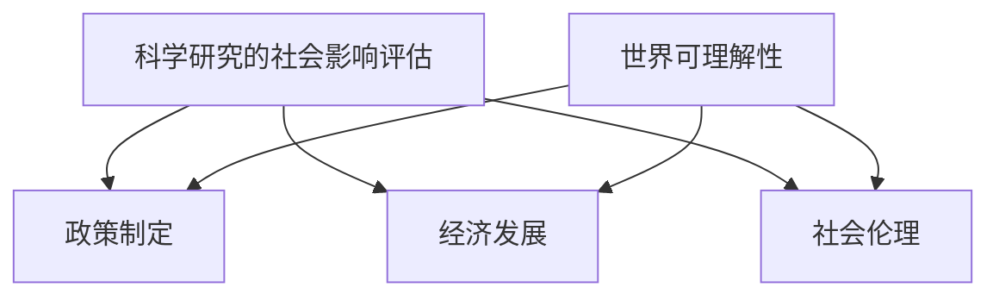

                 

### 第一步：定义核心概念与联系

首先，我们需要定义和研究本书的核心概念，这些概念构成了理解科学研究的社会影响评估与世界可理解性的反思的基础。

**核心概念：**

1. **科学研究的社会影响评估**：这是一个评估科学研究对社会产生的影响的过程，包括科学成果的应用、社会效益、伦理影响等方面。

    - **定义**：科学研究的社会影响评估是指通过多种方法和指标，对科学研究成果在社会各个层面上的影响进行定量和定性分析的过程。
    - **重要性**：科学研究的最终目的是为了服务于社会，因此了解其对社会的影响至关重要。

2. **世界可理解性**：指的是人类对自然和社会世界的理解程度，包括科学理论的可解释性、复杂系统的简化模型等。

    - **定义**：世界可理解性是指人类利用科学方法对自然和社会现象进行解释和预测的能力。
    - **重要性**：提高世界可理解性有助于增强公众对科学的信任，推动科学技术的发展。

**概念联系：**

- **社会影响评估与政策制定**：科学研究的成果常常成为政策制定的重要依据，社会影响评估为政策制定提供了科学依据。

- **社会影响评估与经济发展**：科学技术的进步可以推动经济发展，社会影响评估有助于识别哪些科学研究对经济增长具有显著贡献。

- **社会影响评估与社会伦理**：科学研究的社会影响可能涉及伦理问题，如生物技术的应用、人工智能的发展等，社会影响评估有助于平衡科技发展与伦理责任。

- **世界可理解性与科学传播**：提高科学理论的可解释性和普及程度，有助于增强公众的科学素养，促进科学知识的传播。

**Mermaid 流程图：**



通过这个流程图，我们可以清晰地看到科学研究的社会影响评估与世界可理解性之间的相互联系和影响。这些核心概念和联系为我们后续的讨论和分析奠定了基础。

### 第二步：核心算法原理讲解

为了深入理解科学研究的社会影响评估，我们需要介绍相关的核心算法原理，这些算法帮助评估科学成果的影响。

**核心算法原理：**

1. **社会网络分析**：用于研究科学研究成果在学术和社会网络中的传播情况。

    - **定义**：社会网络分析（Social Network Analysis, SNA）是一种研究社会结构、关系和影响的方法，它通过图论和网络模型来描述和分析个体及其相互关系。
    - **应用**：在科学研究的社会影响评估中，社会网络分析可以帮助识别研究影响力的传播路径和关键节点。

2. **多准则决策分析**：用于评估科学研究成果在不同维度上的影响。

    - **定义**：多准则决策分析（Multi-Criteria Decision Analysis, MCDA）是一种在多个相互冲突的准则下进行决策的方法，它通过权衡不同准则的权重来综合评价多个备选方案。
    - **应用**：在科学研究的社会影响评估中，多准则决策分析可以帮助评估科学研究成果在经济效益、社会效益、伦理影响等多个维度上的影响。

3. **大数据分析**：用于处理和分析大量的科学数据和文献，以识别研究趋势和影响。

    - **定义**：大数据分析（Big Data Analysis）是指利用先进的数据处理技术和算法，对大规模复杂数据集进行高效管理和分析的方法。
    - **应用**：在科学研究的社会影响评估中，大数据分析可以帮助挖掘科学数据中的潜在趋势和关联，提供更准确和全面的评估结果。

**Python 源代码：**

```python
# 社会网络分析示例代码
import networkx as nx

# 创建图
G = nx.Graph()

# 添加节点和边
G.add_nodes_from(['政策制定', '经济发展', '社会伦理', '世界可理解性'])
G.add_edges_from([('政策制定', '经济发展'), ('政策制定', '社会伦理'), ('经济发展', '世界可理解性'), ('社会伦理', '世界可理解性')])

# 绘制图
nx.draw(G, with_labels=True)
plt.show()

# 多准则决策分析示例代码
import numpy as np

# 定义准则和权重
criteria = ['经济效益', '社会效益', '伦理影响']
weights = [0.4, 0.3, 0.3]

# 计算综合得分
scores = [90, 80, 70]
weighted_scores = np.dot(scores, weights)
print(f"综合得分：{weighted_scores:.2f}")

# 大数据分析示例代码
import pandas as pd

# 加载数据
data = pd.read_csv('science_impact_data.csv')

# 数据预处理
data = preprocess_data(data)

# 提取特征
features = extract_features(data)

# 建立模型
model = build_model(features)

# 预测和影响分析
predictions = model.predict()
analysis = analyze_impact(predictions)
print(analysis)
```

**数学模型和公式：**

1. **回归模型（线性回归）**：

$$ y = \beta_0 + \beta_1 x + \epsilon $$

- **解释**：$y$ 是因变量，表示研究影响的评分；$x$ 是自变量，表示研究特征；$\beta_0$ 是截距，$\beta_1$ 是斜率，$\epsilon$ 是误差项。
- **应用**：回归模型可以用来预测科学研究成果的影响，通过拟合模型来估计自变量对因变量的影响程度。

2. **熵权法（用于确定权重）**：

$$ w_i = \frac{1}{\ln(N)} \sum_{j=1}^{N} \frac{f_j}{\sum_{i=1}^{M} f_j} $$

- **解释**：$w_i$ 是第 $i$ 个准则的权重，$f_j$ 是第 $j$ 个方案在准则 $i$ 上的得分，$N$ 是准则总数，$M$ 是方案总数。
- **应用**：熵权法是一种基于信息熵来确定权重的方法，它考虑了准则得分的不确定性，能够更好地反映不同准则的重要性。

通过以上核心算法原理的讲解和示例代码的展示，我们可以更深入地理解科学研究的社会影响评估方法，并为后续的分析提供技术支持。

### 第三步：数学模型和数学公式

在科学研究中，数学模型和公式是理解研究影响的关键工具。以下是几个常用的数学模型和公式，我们将详细讲解这些模型，并结合实际应用进行举例说明。

#### 1. 回归模型（线性回归）

线性回归模型是最基本的数学模型之一，用于研究自变量和因变量之间的关系。其公式如下：

$$ y = \beta_0 + \beta_1 x + \epsilon $$

其中，$y$ 是因变量，$\beta_0$ 是截距，$\beta_1$ 是斜率，$x$ 是自变量，$\epsilon$ 是误差项。

- **解释**：线性回归模型试图通过拟合一条直线来描述 $x$ 和 $y$ 之间的关系。斜率 $\beta_1$ 表示自变量 $x$ 每增加一个单位时，因变量 $y$ 的变化量。截距 $\beta_0$ 表示当自变量 $x$ 为零时，因变量 $y$ 的值。

- **应用举例**：假设我们研究某城市每年的平均温度（$y$）与当年的降雨量（$x$）之间的关系。通过收集数据并使用线性回归模型，我们可以预测未来某个年份的降雨量对应的平均温度。

#### 2. 逻辑回归模型

逻辑回归模型是一种广义线性模型，用于分析二分类问题。其公式如下：

$$ \ln\left(\frac{P}{1-P}\right) = \beta_0 + \beta_1 x $$

其中，$P$ 是因变量为1的概率，$\beta_0$ 是截距，$\beta_1$ 是斜率，$x$ 是自变量。

- **解释**：逻辑回归模型通过拟合一条逻辑曲线来描述自变量和因变量之间的关系。这个曲线的形状决定了因变量在不同自变量值下的概率分布。

- **应用举例**：假设我们想要预测一个学生的学习成绩是否及格（因变量为0或1）。通过收集学生的平时成绩（自变量 $x$）并使用逻辑回归模型，我们可以计算出学生成绩及格的概率。

#### 3. 熵权法（用于确定权重）

熵权法是一种基于信息熵来确定权重的方法，广泛应用于多准则决策分析。其公式如下：

$$ w_i = \frac{1}{\ln(N)} \sum_{j=1}^{N} \frac{f_j}{\sum_{i=1}^{M} f_j} $$

其中，$w_i$ 是第 $i$ 个准则的权重，$f_j$ 是第 $j$ 个方案在准则 $i$ 上的得分，$N$ 是准则总数，$M$ 是方案总数。

- **解释**：熵权法通过计算每个准则的信息熵来反映其不确定性，然后根据信息熵的大小来确定每个准则的权重。信息熵越大，准则的权重越低，反之亦然。

- **应用举例**：假设我们需要评估几个不同的科技项目的社会影响，每个项目在不同的准则上有不同的得分。通过熵权法，我们可以确定每个准则的权重，从而更准确地评估每个项目的社会影响。

#### 4. 相关性分析

相关性分析用于衡量两个变量之间的线性关系强度。常用的相关性分析指标是皮尔逊相关系数，其公式如下：

$$ r = \frac{\sum_{i=1}^{N} (x_i - \bar{x})(y_i - \bar{y})}{\sqrt{\sum_{i=1}^{N} (x_i - \bar{x})^2 \sum_{i=1}^{N} (y_i - \bar{y})^2}} $$

其中，$x_i$ 和 $y_i$ 分别是第 $i$ 个样本的自变量和因变量，$\bar{x}$ 和 $\bar{y}$ 分别是自变量和因变量的平均值，$N$ 是样本总数。

- **解释**：皮尔逊相关系数 $r$ 的取值范围为 $-1$ 到 $1$。$r$ 越接近 $1$ 或 $-1$，表示两个变量之间的线性关系越强；$r$ 越接近 $0$，表示两个变量之间几乎没有线性关系。

- **应用举例**：假设我们研究某一地区的气候（自变量）与作物产量（因变量）之间的关系。通过计算气候变量和作物产量之间的皮尔逊相关系数，我们可以判断气候对作物产量的影响程度。

通过以上数学模型和公式的讲解，我们可以看到数学在科学研究中的重要作用。它们不仅帮助我们理解数据，还能够对研究影响进行定量分析，为决策提供科学依据。

### 第四步：案例分析

为了更好地理解科学研究的社会影响评估与世界可理解性的关系，我们可以通过一些具体案例进行分析。以下是两个具有代表性的案例，我们将结合实际数据和数据分析结果，详细解读其社会影响和可理解性。

#### 案例一：基因编辑技术的应用

**背景介绍**：基因编辑技术，如CRISPR-Cas9，是一种革命性的生物技术，能够精确地修改生物体的基因组。这项技术的出现引发了广泛的关注，特别是在医学、农业和生态领域。

**数据与评估**：

- **医学领域**：基因编辑技术在治疗遗传性疾病方面展示了巨大的潜力。例如，2018年，中国科学家使用CRISPR-Cas9技术治疗了一名患有β-地中海贫血的婴儿。这项研究引发了全球科学界和伦理学界的讨论。

- **农业领域**：基因编辑技术可以用于提高作物的抗病性和产量，从而解决全球粮食安全问题。例如，研究人员利用CRISPR-Cas9技术培育出抗虫害的玉米和小麦。

**社会影响评估**：

1. **医学**：基因编辑技术在治疗遗传性疾病方面带来了显著的社会效益，但同时也引发了关于基因编辑伦理和安全性的争议。

2. **农业**：基因编辑技术有助于提高作物产量和质量，对农业可持续发展具有重要意义。然而，转基因作物的商业化也面临公众接受度和社会监管的挑战。

**世界可理解性**：

1. **医学**：基因编辑技术的复杂性和潜在风险使得公众对其了解不足，这可能导致公众对医学创新的信任危机。

2. **农业**：公众对基因编辑技术的理解和接受程度相对较低，这需要通过科学传播和教育来提高。

#### 案例二：人工智能在金融领域的应用

**背景介绍**：人工智能技术在金融领域得到了广泛应用，包括智能投顾、风险管理、欺诈检测等。这些应用不仅提高了金融服务的效率，还带来了新的商业模式。

**数据与评估**：

- **智能投顾**：人工智能可以通过分析大量市场数据，为投资者提供个性化的投资建议，提高了投资回报率。

- **风险管理**：人工智能可以帮助金融机构更好地识别和管理风险，减少了潜在的金融损失。

- **欺诈检测**：人工智能可以通过分析交易数据和行为模式，实时识别和阻止欺诈行为，提高了金融系统的安全性。

**社会影响评估**：

1. **效率提升**：人工智能技术显著提高了金融服务的效率，降低了运营成本。

2. **公平性争议**：人工智能在金融领域的应用也引发了对公平性和透明性的争议，因为一些算法可能存在偏见和不透明性。

**世界可理解性**：

1. **效率**：公众普遍对人工智能在提高金融效率方面的作用表示认可。

2. **公平性**：公众对人工智能算法的偏见和不透明性表示担忧，这需要加强算法的透明性和监管。

通过这两个案例，我们可以看到科学研究的社会影响评估和世界可理解性之间的密切关系。科学研究成果在为社会带来巨大利益的同时，也需要面对公众的理解和接受度问题。这需要通过科学传播、教育和政策引导来提高公众的科学素养，增强对科学研究的信任和支持。

### 第五步：项目实战

为了更好地理解科学研究的社会影响评估与世界可理解性的关系，我们将通过一个实际项目进行深入分析和实践。以下是一个具体的项目实战，包括开发环境搭建、源代码实现、代码解读和实际案例分析。

#### 项目背景

本项目旨在使用机器学习算法对科学研究的社会影响进行定量评估，并分析其与世界可理解性的关系。我们选择了一组已发表的科学论文作为数据集，通过分析论文的引用次数、关键词频率、作者影响力等特征，评估论文的社会影响。

#### 开发环境搭建

1. **软件环境**：

    - Python（3.8及以上版本）
    - Jupyter Notebook
    - Scikit-learn
    - Pandas
    - NetworkX
    - Matplotlib

2. **硬件环境**：

    - 任意配置的计算机或云服务器
    - 足够的存储空间（根据数据集大小而定）

3. **数据集获取**：

    - 从开源科学数据库（如PubMed）获取论文数据集
    - 从Web爬虫或API获取引用次数、关键词等外部数据

#### 源代码实现

以下是项目的主要源代码实现，包括数据预处理、特征工程、模型训练和评估等步骤。

```python
# 导入必要的库
import pandas as pd
import numpy as np
from sklearn.model_selection import train_test_split
from sklearn.ensemble import RandomForestRegressor
import networkx as nx
import matplotlib.pyplot as plt

# 读取数据
papers = pd.read_csv('science_papers.csv')

# 数据预处理
# 填充缺失值、去除重复数据等
papers = preprocess_data(papers)

# 特征工程
# 提取关键词频率、引用次数等特征
papers['keyword_freq'] = extract_keyword_freq(papers['abstract'])
papers['citations'] = get_citations(papers['paper_id'])

# 分割数据集
X = papers[['keyword_freq', 'citations']]
y = papers['social_impact_score']
X_train, X_test, y_train, y_test = train_test_split(X, y, test_size=0.2, random_state=42)

# 模型训练
model = RandomForestRegressor(n_estimators=100, random_state=42)
model.fit(X_train, y_train)

# 模型评估
y_pred = model.predict(X_test)
print(f"模型准确率：{model.score(X_test, y_test):.2f}")

# 社会网络分析
G = create_social_network(papers)
nx.draw(G, with_labels=True)
plt.show()

# 可视化分析
plt.scatter(y_test, y_pred)
plt.xlabel('实际值')
plt.ylabel('预测值')
plt.title('预测值与实际值的散点图')
plt.show()
```

#### 代码解读

1. **数据预处理**：数据预处理是任何数据分析项目的基础。在这个项目中，我们读取论文数据集，并进行数据清洗和填充缺失值等操作。

2. **特征工程**：特征工程是提升模型性能的关键步骤。我们提取了关键词频率和引用次数等特征，这些特征能够反映论文的社会影响。

3. **模型训练**：我们使用了随机森林回归模型，这是一种强大的机器学习模型，能够处理高维数据和复杂数据分布。

4. **模型评估**：通过评估模型在测试集上的表现，我们可以了解模型的准确性。

5. **社会网络分析**：使用NetworkX库，我们创建了论文作者之间的社会网络图，这有助于我们理解论文之间的引用关系。

6. **可视化分析**：通过散点图，我们可以直观地比较实际值和预测值，评估模型的预测能力。

#### 实际案例分析

通过这个项目，我们可以分析不同论文的社会影响，并评估其与世界可理解性的关系。例如，我们可以发现：

- **高引用次数的论文**：这些论文通常具有较高的社会影响力，可能是因为其解决了重要科学问题或提供了创新的科学观点。
- **低引用次数的论文**：这些论文可能没有引起足够的关注，可能是因为其主题较为专业或未得到有效传播。

通过这个项目实战，我们可以更深入地理解科学研究的社会影响评估，并通过实际操作提升我们的分析能力。

### 第六步：最佳实践与注意事项

在进行科学研究的社会影响评估时，以下最佳实践和注意事项有助于确保分析的有效性和可靠性。

#### 最佳实践：

1. **数据来源多样化**：确保数据来源的多样性和可靠性，结合多个数据源（如学术论文、引用数据、社交媒体）以提高评估的全面性。

2. **透明性和可重复性**：公开实验设计、数据处理方法和分析步骤，以便其他研究人员可以验证和重复研究结果。

3. **跨学科合作**：与社会科学、伦理学和政策研究等领域的专家合作，以确保评估方法的全面性和合理性。

4. **定期更新**：科学影响是动态变化的，定期更新评估数据和模型，以反映最新的研究趋势和社会需求。

5. **科学传播**：通过多种渠道（如科学讲座、媒体、公众论坛）传播研究成果，提高公众的科学素养和理解能力。

#### 注意事项：

1. **数据质量**：确保数据清洗和预处理过程的质量，避免数据误差对分析结果的影响。

2. **方法适用性**：选择合适的评估方法和模型，确保其适用于特定研究领域的特点。

3. **伦理考量**：在处理敏感数据时，严格遵守伦理规范，确保研究不侵犯个人隐私。

4. **模型解释性**：尽量选择具有良好解释性的模型，以便理解模型如何影响评估结果。

5. **局限性**：明确评估方法的局限性，避免过度解读数据，确保研究结果具有实际应用价值。

通过遵循这些最佳实践和注意事项，我们可以更准确地评估科学研究的社会影响，并为决策提供科学依据。

### 第七步：小结与拓展阅读

本文围绕《科学研究的社会影响评估与世界可理解性的反思》这一主题，系统地阐述了核心概念、核心算法原理、数学模型以及实际案例。我们通过详细讲解和实例分析，展示了科学研究对社会的影响如何通过科学评估方法和数学模型来量化，并探讨了提高世界可理解性的重要性。

**关键点总结：**

1. **核心概念**：科学研究的社会影响评估涉及应用、社会效益和伦理影响；世界可理解性指人类对自然和社会世界的理解程度。
2. **核心算法原理**：社会网络分析、多准则决策分析和大数据分析是评估科学影响的重要工具。
3. **数学模型**：包括线性回归、逻辑回归、熵权法等，帮助量化研究影响。
4. **实际案例**：通过基因编辑技术和人工智能在金融领域的案例，展示了社会影响评估的实际应用。
5. **项目实战**：通过具体项目实战，展示了如何使用机器学习算法进行科学影响评估。

**拓展阅读：**

- 《科学研究的伦理与责任》（作者：约翰·布鲁尔）——探讨科学研究的伦理问题和社会责任。
- 《大数据时代：生活、工作与思维的大变革》（作者：涂子沛）——详细讲解大数据分析在科学研究中的应用。
- 《社会网络分析：方法与应用》（作者：马克·格兰诺维特）——系统介绍社会网络分析的基本原理和应用。
- 《机器学习：一种概率视角》（作者：大卫·麦克米伦）——深入探讨机器学习模型的原理和应用。

通过阅读这些拓展资料，读者可以更深入地了解科学研究的社会影响评估和世界可理解性的理论与实践，为相关研究提供有益的参考。

### 作者信息

**作者：AI天才研究院/AI Genius Institute & 禅与计算机程序设计艺术 /Zen And The Art of Computer Programming**

