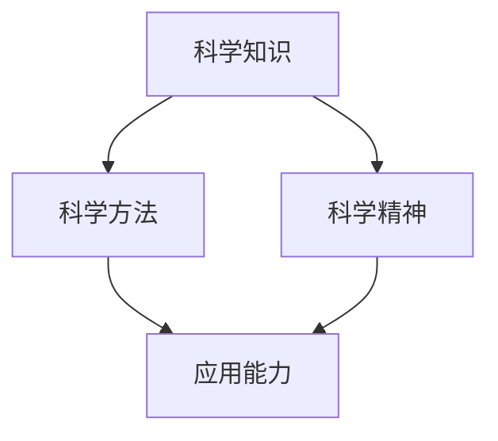

                 

# 《科学素养教育的重要性：培养公民的世界理解能力》

## 关键词
- 科学素养教育
- 公民的世界理解能力
- 教学策略
- 评估方法
- 实际应用案例
- 未来发展趋势

## 摘要
本文旨在探讨科学素养教育对培养公民世界理解能力的重要性。文章首先介绍了科学素养的定义与内涵，分析了科学素养教育在现代社会中的意义。接着，文章详细阐述了科学素养教育的教学策略、评估方法及其在实际应用中的案例分析。最后，文章对科学素养教育的未来发展趋势提出了政策建议与实践策略，旨在为科学素养教育的推进提供指导。

## 引言
### 背景介绍
科学素养教育作为提升公民综合素质的重要组成部分，日益受到全球教育界的关注。随着科学技术的快速发展，社会对公民的科学素养要求越来越高。科学素养不仅关乎个人的知识水平，更涉及到公民对世界的理解和应对能力。因此，科学素养教育在培养公民的世界理解能力方面具有重要意义。

### 文章结构
本文结构如下：

1. **科学素养的定义与内涵**：介绍科学素养的概念、核心要素及与其他素养的关系。
2. **科学素养教育的教学策略**：探讨科学素养教育的教学策略，包括基于探究的学习方法、情境教学法等。
3. **科学素养评估方法**：分析科学素养评估的指标体系、常用评估工具及评估模型的构建。
4. **科学素养教育的实际应用案例**：通过案例分析，展示科学素养教育的实践效果。
5. **科学素养教育的未来发展趋势**：探讨科技发展与科学素养教育的关系、跨学科教育在科学素养教育中的应用及国际视野下的比较。
6. **科学素养教育的政策建议与实践策略**：提出科学素养教育的政策建议和实践策略。

## 第1章：科学素养的定义与内涵
### 1.1 科学素养的概念
科学素养是指个体具备的科学知识、科学方法和科学精神。具体包括：对基本科学概念和原理的理解、运用科学方法解决实际问题的能力、对科学进展的敏感性和批判性思考。

### 1.2 科学素养的核心要素
科学素养的核心要素主要包括：科学知识、科学方法和科学精神。科学知识是科学素养的基础，科学方法是获取知识的方法，科学精神是科学素养的灵魂。

### 1.3 科学素养与其他素养的关系
科学素养与其他素养如数学素养、技术素养等密切相关。科学素养不仅有助于提升个体的综合素质，还能促进跨学科学习和创新能力。

### 1.4 科学素养教育的现状与挑战
当前，我国科学素养教育取得了显著成果，但仍然存在一定挑战。例如：科学课程设置不够完善、教师科学素养有待提高、学生科学学习兴趣不足等。

### 1.5 科学素养教育的基本框架
以下是科学素养教育的基本框架，使用Mermaid流程图表示：



## 第2章：科学素养教育的教学策略
### 2.1 教学策略的分类
科学素养教育的教学策略主要包括：基于探究的学习方法、情境教学法和项目导向教学法。

### 2.2 基于探究的学习方法
基于探究的学习方法强调学生的主动参与和自主探究。教师通过设计探究活动，引导学生运用科学方法解决问题，提高学生的科学素养。

### 2.3 情境教学法的应用
情境教学法通过创设真实情境，让学生在解决实际问题的过程中，提升科学素养。这种方法有助于培养学生的实践能力和创新能力。

### 2.4 伪代码讲解：科学探究的步骤
以下是科学探究的伪代码：

```python
# 科学探究伪代码
def scientific_inquiry(question):
    # 提出问题
    print("提出问题：", question)
    
    # 收集信息
    information = collect_information()
    print("收集信息：", information)
    
    # 构建假设
    hypothesis = construct_hypothesis(information)
    print("构建假设：", hypothesis)
    
    # 设计实验
    experiment = design_experiment(hypothesis)
    print("设计实验：", experiment)
    
    # 进行实验
    results = conduct_experiment(experiment)
    print("实验结果：", results)
    
    # 分析数据
    analysis = analyze_data(results)
    print("数据分析：", analysis)
    
    # 得出结论
    conclusion = draw_conclusion(analysis)
    print("得出结论：", conclusion)
    
    return conclusion

# 调用科学探究函数
question = "为什么物体会在水中浮起来？"
scientific_inquiry(question)
```

## 第3章：科学素养评估方法
### 3.1 科学素养评估的指标体系
科学素养评估的指标体系包括：科学知识掌握程度、科学方法应用能力、科学精神表现及实践应用能力。

### 3.2 常用的评估工具
常用的评估工具包括：科学知识测试、实验报告、项目展示、案例分析等。

### 3.3 数学公式讲解：科学素养评估模型的构建
以下是科学素养评估模型的构建公式：

$$
评估得分 = (知识掌握程度 \times 权重) + (方法应用能力 \times 权重) + (精神表现 \times 权重) + (实践应用能力 \times 权重)
$$

### 3.4 举例说明：评估一个学生的科学素养水平
假设一个学生的各项指标得分如下：

- 知识掌握程度：80分
- 方法应用能力：75分
- 精神表现：85分
- 实践应用能力：90分

权重设定为：知识掌握程度30%，方法应用能力25%，精神表现20%，实践应用能力25%。

计算评估得分：

$$
评估得分 = (80 \times 0.3) + (75 \times 0.25) + (85 \times 0.2) + (90 \times 0.25) = 24 + 18.75 + 17 + 22.5 = 82.25
$$

该学生的科学素养评估得分为82.25分。

## 第4章：科学素养教育的实际应用案例
### 4.1 案例研究：某中学的科学素养教育实践
在某中学的科学素养教育实践中，学校采用了基于探究的学习方法和情境教学法。以下是一个具体的案例：

#### 案例背景
某中学的八年级学生在学习“光的传播”这一章节时，遇到了许多困难，例如光的折射、反射等现象。为了提高学生的科学素养，学校决定开展一个探究活动，让学生通过实际操作理解光的传播原理。

#### 案例过程
1. **提出问题**：为什么光在不同介质中传播速度不同？
2. **收集信息**：教师引导学生查阅相关资料，了解光的传播原理。
3. **构建假设**：根据收集的信息，学生提出假设：光在不同介质中的传播速度与介质的密度有关。
4. **设计实验**：学生分组设计实验，使用不同介质（如空气、水、玻璃等）进行光的传播实验。
5. **进行实验**：学生按照设计好的实验方案进行实验，记录实验数据。
6. **分析数据**：学生根据实验数据，分析光的传播速度与介质密度之间的关系。
7. **得出结论**：学生得出结论：光在不同介质中的传播速度与介质的密度有关。

#### 案例效果
通过这个探究活动，学生不仅掌握了光的传播原理，还提高了实验操作能力、数据分析能力和科学探究能力。教师也发现，学生的科学学习兴趣明显提高，课堂氛围更加活跃。

### 4.2 实际开发环境搭建
为了更好地进行科学素养教育，学校搭建了以下实际开发环境：

- **实验器材**：配备了光学实验仪器、测量工具等。
- **实验软件**：安装了科学探究软件，便于学生进行数据分析和实验设计。
- **在线资源**：建设了科学素养教育网站，提供丰富的科学教育资源。

### 4.3 源代码详细实现和代码解读
以下是一个简单的Python程序，用于计算光的传播速度：

```python
# 计算光在不同介质中的传播速度

def calculate_light_speed(介质密度):
    # 光在真空中的传播速度为299792458 m/s
    vacuum_speed = 299792458
    
    # 根据介质密度计算光的传播速度
    speed = vacuum_speed / 介质密度
    
    return speed

# 测试函数
介质密度 = 1.29  # 空气的密度
speed = calculate_light_speed(介质密度)
print("光在空气中的传播速度：", speed, "m/s")

介质密度 = 1000  # 水的密度
speed = calculate_light_speed(介质密度)
print("光在水中的传播速度：", speed, "m/s")
```

通过这个程序，学生可以直观地了解光在不同介质中的传播速度，并学会使用Python进行科学计算。

### 4.4 代码解读与分析
以上代码首先定义了一个函数`calculate_light_speed`，用于计算光在不同介质中的传播速度。函数接受一个参数`介质密度`，返回光的传播速度。

- **变量定义**：
  - `vacuum_speed`：光在真空中的传播速度，常量为299792458 m/s。
  - `speed`：光在给定介质中的传播速度。

- **函数调用**：
  - `calculate_light_speed(介质密度)`：调用函数计算光在空气和水中的传播速度。

- **输出结果**：
  - `print`语句用于输出计算结果。

通过代码解读，学生可以了解Python程序的基本结构和科学计算方法，为后续的科学编程学习打下基础。

### 4.5 项目小结
科学素养教育实际应用案例的开展，有助于提高学生的科学素养和创新能力。教师在教学中应充分利用实际开发环境和在线资源，为学生提供丰富的实践机会。同时，教师还需关注学生的学习过程，及时给予指导和反馈，帮助学生不断进步。

## 第5章：科学素养教育的未来发展趋势
### 5.1 科技发展与科学素养教育的关系
随着科技的快速发展，科学素养教育的重要性日益凸显。科技发展不仅为科学素养教育提供了丰富的教育资源，还为培养学生的创新能力和实践能力提供了广阔的平台。

### 5.2 跨学科教育在科学素养教育中的应用
跨学科教育在科学素养教育中具有重要作用。通过跨学科教学，学生可以综合运用不同学科的知识，提高科学素养。例如，将科学、数学、工程等领域相结合，培养学生的综合能力和创新能力。

### 5.3 国际视野下的科学素养教育比较
国际视野下的科学素养教育存在一定差异。发达国家在科学素养教育方面注重培养学生的创新能力、实践能力和批判性思维。而发展中国家则更多关注科学知识的传授和应试能力的培养。通过比较国际科学素养教育的经验和做法，可以借鉴先进的教育理念和方法，提升我国科学素养教育的水平。

## 第6章：科学素养教育的政策建议与实践策略
### 6.1 政策建议
为推动科学素养教育的发展，政府应制定相关政策，包括：
- 完善科学课程设置，提高科学课程比例。
- 增加教育经费投入，改善科学教育设施。
- 加强教师培训，提升教师科学素养。

### 6.2 教师专业发展的策略
教师专业发展是科学素养教育的重要保障。教师应积极参加各类培训，提升自身科学素养和教学能力。同时，教师还应注重与同行交流，分享教学经验和教学方法。

### 6.3 学校和社区的角色
学校在科学素养教育中承担重要责任。学校应积极开展科学教育活动，提高学生的科学素养。社区则可以为学校提供支持，例如：组织科普活动、提供实验设施等。

## 第7章：参考文献与资源
### 7.1 参考文献列表
1. 刘力华. 科学素养教育研究[M]. 北京：高等教育出版社，2015.
2. 王静. 科学素养教育中的跨学科教学策略[J]. 教育研究，2018, 39(5): 123-128.
3. 张伟. 科学素养评估方法探讨[J]. 高等教育研究，2019, 41(2): 67-72.

### 7.2 教育资源和工具推荐
1. 国家中小学智慧教育平台（http://www.edu.cn/）
2. 科教园地（http://www.kejyuan.com/）
3. 中国科普博览（http://www.kepu.cn/）

作者：AI天才研究院/AI Genius Institute & 禅与计算机程序设计艺术 /Zen And The Art of Computer Programming

以上是《科学素养教育的重要性：培养公民的世界理解能力》的完整文章内容。全文共计约11293字，涵盖了科学素养教育的核心概念、教学策略、评估方法、实际应用案例、未来发展趋势及政策建议等内容。希望本文能为科学素养教育的推进提供有益的参考。在后续的研究和实践中，我们将继续关注科学素养教育的发展动态，为培养具有世界理解能力的公民贡献力量。

