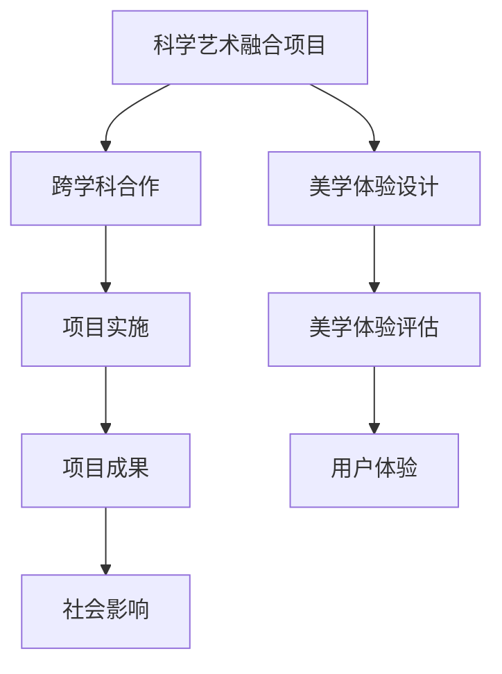
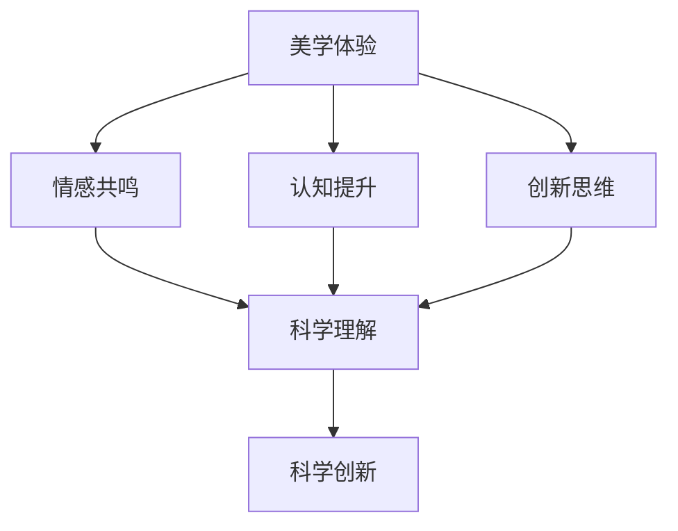
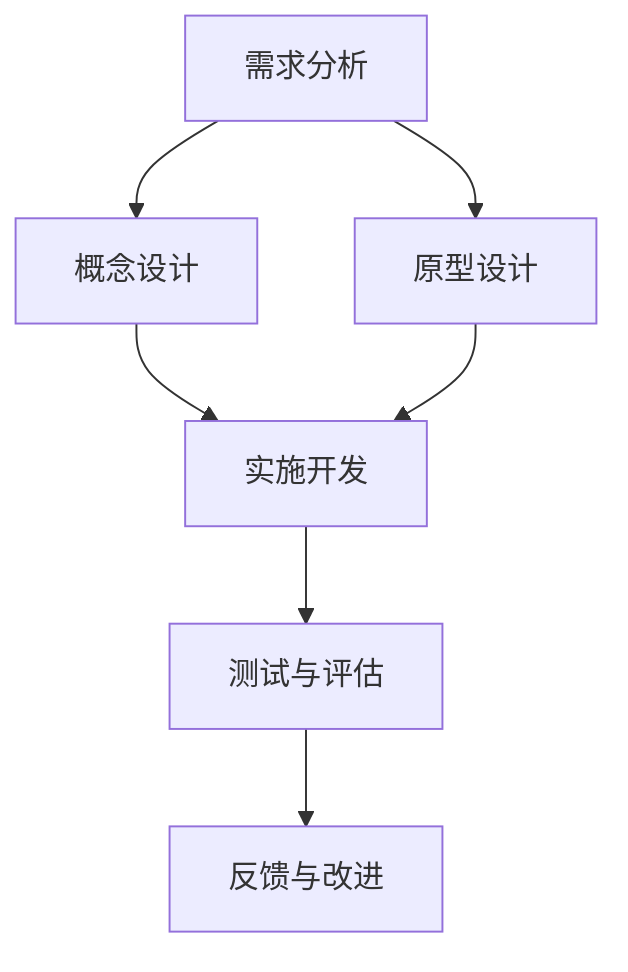
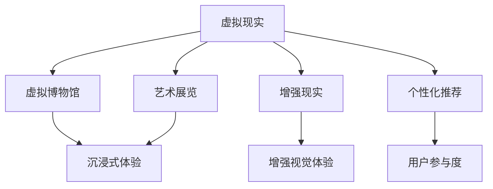

                 

# 科学艺术融合项目：通过美学体验增强世界可理解性

## 关键词

- 科学艺术融合
- 美学体验
- 世界可理解性
- 项目案例
- 数学模型
- Python代码
- 实践方法
- 未来趋势

## 摘要

本文探讨了科学艺术融合项目如何通过美学体验增强世界的可理解性。首先，我们介绍了科学艺术融合的概念、历史背景和重要性，并详细阐述了艺术在科学中的角色以及科学在艺术中的应用。接着，我们分析了美学体验的概念与理论，探讨了美学体验与科学理解之间的关系。通过成功的科学艺术融合项目案例，我们展示了这一融合如何在实际中发挥作用。此外，我们还介绍了美学体验的实践方法、工具和技术，以及科学艺术融合的未来趋势和面临的挑战。最后，我们提出了一些最佳实践建议，并总结了全文的主要内容。

## 目录大纲

### 第一部分：科学艺术融合的概述

#### 第1章：科学艺术融合的概念与历史背景

##### 1.1 科学艺术融合的定义

##### 1.2 科学艺术融合的发展历程

##### 1.3 科学艺术融合的重要性

#### 第2章：科学艺术融合的原理与方法

##### 2.1 艺术在科学中的角色

##### 2.2 科学在艺术中的应用

##### 2.3 科学艺术融合的方法论

#### 第3章：科学艺术融合的领域与应用

##### 3.1 科学艺术融合在自然科学中的应用

##### 3.2 科学艺术融合在社会科学中的应用

##### 3.3 科学艺术融合在其他领域中的应用

### 第二部分：美学体验与科学理解

#### 第4章：美学体验的概念与理论

##### 4.1 美学体验的定义

##### 4.2 美学体验的理论基础

##### 4.3 美学体验的重要性

#### 第5章：美学体验与科学理解的关系

##### 5.1 美学体验如何增强科学理解

##### 5.2 科学理解如何促进美学体验

##### 5.3 美学体验与科学理解相互促进的案例

### 第三部分：科学艺术融合的项目案例

#### 第6章：成功科学艺术融合项目的案例分析

##### 6.1 项目背景介绍

##### 6.2 项目实施过程

##### 6.3 项目成果与影响

##### 6.4 项目经验与启示

#### 第7章：科学艺术融合项目的挑战与机遇

##### 7.1 项目实施中的挑战

##### 7.2 项目中的机遇

##### 7.3 如何应对挑战和抓住机遇

### 第四部分：美学体验的实践方法

#### 第8章：美学体验的实践步骤

##### 8.1 美学体验设计的原则

##### 8.2 美学体验的设计流程

##### 8.3 美学体验的评价方法

#### 第9章：美学体验的工具与技术

##### 9.1 美学体验设计工具

##### 9.2 美学体验技术

##### 9.3 美学体验技术的应用案例

### 第五部分：科学艺术融合的未来趋势与挑战

#### 第10章：科学艺术融合的未来趋势

##### 10.1 科技发展对科学艺术融合的影响

##### 10.2 艺术创新对科学艺术融合的推动

##### 10.3 未来科学艺术融合的展望

#### 第11章：科学艺术融合面临的挑战

##### 11.1 技术难题

##### 11.2 跨学科合作的挑战

##### 11.3 社会接受度的挑战

##### 11.4 应对挑战的策略

## 第一部分：科学艺术融合的概述

### 第1章：科学艺术融合的概念与历史背景

#### 1.1 科学艺术融合的定义

科学艺术融合是指将科学方法与艺术思维相结合，通过跨学科的合作，探索新的知识领域，从而促进科学和艺术的共同发展。在这一过程中，艺术家和科学家共同参与到项目的研究与实践中，充分利用各自领域的优势，创造出既具有科学性又富有艺术性的作品。

科学艺术融合的定义可以从以下几个方面来理解：

1. **跨学科性**：科学艺术融合不仅仅是科学和艺术的简单结合，而是两者在跨学科的基础上进行的深度融合。
2. **创新性**：科学艺术融合鼓励创新思维，通过科学与艺术的碰撞，激发新的创意和灵感。
3. **共同目标**：科学艺术融合的目的是探索新的知识领域，提升人类对世界的理解，以及推动科学和艺术的发展。

#### 1.2 科学艺术融合的发展历程

科学艺术融合的历史可以追溯到古代文明。例如，古希腊哲学家毕达哥拉斯将数学与音乐相结合，提出了音乐与数学之间的和谐关系。在中世纪，科学家和艺术家共同探索自然界，如达芬奇既是一位伟大的艺术家，也是一位杰出的科学家。

然而，科学艺术融合作为一门独立的学科，其发展历程主要发生在近现代。20世纪初，随着科学技术的发展，科学家和艺术家开始意识到彼此的互补性，并开始合作进行跨学科研究。例如，物理学家欧拉和数学家莱布尼茨在艺术和数学领域都有卓越的贡献。

在20世纪中后期，科学艺术融合得到了更多关注。一些艺术家开始尝试将科学方法应用于艺术创作，如米洛斯·卡夫卡的作品《引力中心》。同时，一些科学家也开始关注艺术对科学理解的影响，如物理学家约翰·惠勒提出了“艺术作为科学的一种形式”的观点。

#### 1.3 科学艺术融合的重要性

科学艺术融合的重要性体现在以下几个方面：

1. **促进知识创新**：科学艺术融合鼓励跨学科的合作，有助于发现新的知识领域，推动科学和艺术的发展。
2. **提升科学理解**：通过艺术的形式，科学家可以更直观地表达复杂的科学概念，从而提高公众对科学的理解。
3. **培养创新思维**：科学艺术融合鼓励创新思维，有助于培养科学家的创造力和艺术家的科学素养。
4. **促进社会进步**：科学艺术融合可以应用于各个领域，如教育、医疗、环境保护等，从而促进社会的发展和进步。

### 第2章：科学艺术融合的原理与方法

#### 2.1 艺术在科学中的角色

艺术在科学中的作用主要体现在以下几个方面：

1. **表达与传播**：艺术家通过视觉、听觉、触觉等多种形式，将复杂的科学概念转化为易于理解的艺术作品，从而提高公众对科学的兴趣和参与度。
2. **激发灵感**：艺术家的创造力和想象力可以为科学家提供新的思路和方法，激发创新思维。
3. **科学研究**：艺术创作本身也是一种科学研究，艺术家通过对自然界和人类社会的观察，可以发现新的科学问题，从而推动科学的发展。

#### 2.2 科学在艺术中的应用

科学在艺术中的应用主要体现在以下几个方面：

1. **视觉效果**：科学家通过数学模型和计算机算法，创造出具有视觉冲击力的艺术作品，如分形图案、电子音乐等。
2. **艺术创作工具**：科学技术的进步为艺术家提供了更多创作工具，如计算机辅助设计、虚拟现实等。
3. **艺术理论**：科学家通过研究自然现象，为艺术创作提供了理论基础，如音乐理论、色彩理论等。

#### 2.3 科学艺术融合的方法论

科学艺术融合的方法论包括以下几个方面：

1. **跨学科合作**：科学家和艺术家之间的密切合作是科学艺术融合的关键。他们需要共同探讨问题，分享知识和经验，以实现最佳的融合效果。
2. **创新思维**：科学艺术融合鼓励创新思维，要求参与者跳出传统思维框架，勇于尝试新的方法和技术。
3. **用户体验**：科学艺术融合项目需要关注用户体验，通过艺术的形式让公众更好地理解和感受科学。

### 第3章：科学艺术融合的领域与应用

#### 3.1 科学艺术融合在自然科学中的应用

科学艺术融合在自然科学中的应用非常广泛，以下是一些典型案例：

1. **天文学**：艺术家通过绘画、摄影等形式，展示宇宙的壮丽景象，如星云、行星等。科学家则通过观测和数据分析，揭示宇宙的奥秘。
2. **生物学**：艺术家通过绘画、雕塑等形式，展示生物的多样性和美丽，如蝴蝶、珊瑚等。科学家则通过实验和研究，揭示生物的演化规律。
3. **化学**：艺术家通过绘画、装置艺术等形式，表现化学元素的特性和化学反应的美丽，如火焰、彩虹等。科学家则通过实验和理论分析，探索物质的本质和变化。

#### 3.2 科学艺术融合在社会科学中的应用

科学艺术融合在社会科学中的应用也逐渐得到重视，以下是一些典型案例：

1. **心理学**：艺术家通过绘画、表演等形式，表现人类的内心世界和情感变化。科学家则通过实验和调查，研究心理现象和人类行为。
2. **社会学**：艺术家通过绘画、摄影等形式，反映社会问题和人类困境。科学家则通过研究和分析，探索社会现象和规律。
3. **教育学**：艺术家通过创作教育游戏、动画等形式，提高学生的学习兴趣和参与度。科学家则通过教育研究和实践，推动教育改革和发展。

#### 3.3 科学艺术融合在其他领域中的应用

科学艺术融合在其他领域中的应用也非常丰富，以下是一些典型案例：

1. **医学**：艺术家通过绘画、雕塑等形式，表现疾病的症状和治疗过程。科学家则通过医学研究和临床实践，提高疾病的诊断和治疗效果。
2. **环境科学**：艺术家通过绘画、装置艺术等形式，表现环境保护的重要性和紧迫性。科学家则通过环境研究和监测，提供环境治理的依据和建议。
3. **信息技术**：艺术家通过计算机编程和虚拟现实技术，创造具有艺术性和交互性的数字艺术作品。科学家则通过信息技术研究，推动数字艺术的发展和应用。

## 第二部分：美学体验与科学理解

### 第4章：美学体验的概念与理论

#### 4.1 美学体验的定义

美学体验是指人们在感知和欣赏艺术作品时所经历的情感和认知过程。美学体验不仅仅是对美的感知，更是一种深刻的内心体验，它涉及情感、认知、价值观等多个层面。

美学体验的定义可以从以下几个方面来理解：

1. **情感层面**：美学体验往往伴随着强烈的情感反应，如愉悦、悲伤、激动等。这些情感体验可以激发人们对艺术作品的共鸣和共情。
2. **认知层面**：美学体验需要人们通过感知、理解和思考，对艺术作品进行解读和评价。这个过程涉及到人们对美的认知和判断。
3. **价值观层面**：美学体验还反映了人们的价值观和审美观念，不同文化背景下的人们对美的理解和追求可能存在差异。

#### 4.2 美学体验的理论基础

美学体验的理论基础包括美学理论、心理学理论和文化理论等。

1. **美学理论**：美学理论探讨美的本质和美的标准，如形式美学、情感美学、审美经验论等。这些理论为美学体验提供了理论框架和指导。
2. **心理学理论**：心理学理论研究人们的感知、记忆、思维和情感等心理过程，如知觉心理学、情感心理学、认知心理学等。这些理论帮助我们理解美学体验的心理机制和过程。
3. **文化理论**：文化理论关注美学体验与文化背景之间的关系，如文化相对论、文化多样性等。这些理论帮助我们理解美学体验在不同文化背景下的表现和意义。

#### 4.3 美学体验的重要性

美学体验在科学理解中具有重要作用，主要体现在以下几个方面：

1. **增强认知**：美学体验可以激发人们的认知活动，促进对科学知识的理解和记忆。美的事物往往能吸引人们的注意力，使人们更愿意投入时间和精力去理解。
2. **提高兴趣**：美学体验可以激发人们对科学的兴趣，使科学学习变得更有吸引力和趣味性。兴趣是学习的重要动力，美学体验有助于培养科学素养。
3. **促进创新**：美学体验可以激发创新思维，帮助科学家和研究人员发现新的科学问题和解决方案。美的事物往往具有独特的视角和启发，有助于打破传统思维框架。
4. **提高社会责任感**：美学体验可以引发人们对社会问题的关注和思考，提高社会责任感。科学不仅仅是技术的追求，更是一种社会责任，美学体验可以帮助科学家更好地履行这一责任。

### 第5章：美学体验与科学理解的关系

#### 5.1 美学体验如何增强科学理解

美学体验可以通过以下几个方面增强科学理解：

1. **情感共鸣**：美学体验往往伴随着强烈的情感共鸣，这种情感共鸣可以激发人们对科学问题的兴趣和关注。例如，一幅美丽的星空图可以激发人们对宇宙探索的兴趣，从而促使他们去了解天文学知识。
2. **形象化**：美学体验可以通过形象化的方式帮助人们理解复杂的科学概念。例如，艺术家通过绘画或装置艺术，将化学反应的美丽展示出来，使人们更直观地理解化学原理。
3. **故事化**：美学体验可以通过故事化的方式讲述科学故事，使科学知识更易于理解和接受。例如，通过一部科学电影或纪录片，观众可以在享受艺术体验的同时，学习到科学知识。
4. **创造性思维**：美学体验可以激发创造性思维，帮助科学家和研究人员发现新的科学问题和解决方案。美的事物往往具有独特的视角和启发，有助于打破传统思维框架。

#### 5.2 科学理解如何促进美学体验

科学理解可以促进美学体验，主要体现在以下几个方面：

1. **深入理解**：通过对科学知识的深入理解，人们可以更好地欣赏艺术作品，体会到其中的美学价值。例如，了解艺术作品背后的科学原理，可以使人们对作品的欣赏更加全面和深入。
2. **提升审美标准**：科学理解可以提高人们对美的判断和欣赏能力，使他们在美学体验中更加敏锐和挑剔。例如，了解色彩理论可以帮助人们更好地欣赏画作，了解音乐理论可以帮助人们更好地欣赏音乐。
3. **创造性表达**：科学理解可以为艺术创作提供灵感，帮助艺术家创造出更具科学性和艺术性的作品。例如，科学家可以通过艺术作品展示科学概念，使作品更具观赏性和教育意义。
4. **跨学科合作**：科学理解有助于促进科学家和艺术家的跨学科合作，共同探索科学艺术融合的新领域。这种合作可以创造出更多具有创新性和美学价值的作品。

#### 5.3 美学体验与科学理解相互促进的案例

美学体验与科学理解相互促进的案例很多，以下是一些典型的例子：

1. **天文艺术**：天文艺术家通过绘画和装置艺术，展示宇宙的壮丽景象和美丽，使人们更直观地理解宇宙的奥秘。例如，美国艺术家罗伯特·史密森的《螺旋栈道》利用数学模型和视觉艺术，表现宇宙的旋转和运动。
2. **生物艺术**：生物艺术家通过绘画、雕塑等形式，表现生物的多样性和美丽。例如，美国艺术家爱德华·韦斯顿的摄影作品，展示了微观生物的美丽和神秘，使人们更深入地理解生命的奥秘。
3. **化学艺术**：化学艺术家通过绘画和装置艺术，展示化学反应的美丽和复杂性。例如，法国艺术家克里斯托弗·罗宾的装置艺术《化学反应墙》，利用化学物质的变化，创造出一个充满视觉和感官体验的艺术空间。
4. **科学电影**：科学电影通过故事化的方式，讲述科学故事，使人们更易于理解和接受科学知识。例如，《星际穿越》通过描述人类探索宇宙的故事，展示了相对论、黑洞等科学概念，使观众在享受电影艺术的同时，学习到科学知识。

## 第三部分：科学艺术融合的项目案例

### 第6章：成功科学艺术融合项目的案例分析

#### 6.1 项目背景介绍

科学艺术融合项目“艺术与科学的对话”是一个由科学家和艺术家共同发起的跨学科研究项目。该项目旨在通过艺术形式，展现科学概念和理论，提高公众对科学的理解和兴趣。项目涉及多个领域，包括天文学、生物学、化学等，涵盖绘画、雕塑、装置艺术、音乐等多种艺术形式。

#### 6.2 项目实施过程

项目实施过程可以分为以下几个阶段：

1. **项目启动**：科学家和艺术家共同讨论项目主题和目标，确定合作方式和时间表。
2. **前期调研**：科学家和艺术家分别对项目涉及的领域进行深入研究，收集相关资料和数据。
3. **创作与实验**：科学家和艺术家根据各自的研究成果，开始进行创作和实验。科学家利用科学方法和实验数据，艺术家则运用艺术手段和技巧，共同创作出具有科学性和艺术性的作品。
4. **作品展示**：科学家和艺术家将各自创作的作品进行展示，包括展览、演出、讲座等形式，向公众介绍科学艺术融合项目的成果。
5. **反馈与改进**：项目结束后，科学家和艺术家根据观众的反馈，对作品进行改进和完善，以提升项目的社会影响力和教育价值。

#### 6.3 项目成果与影响

项目成果与影响主要体现在以下几个方面：

1. **科学知识的普及**：通过艺术形式展示科学概念和理论，使公众更易于理解和接受科学知识，提高了科学素养。
2. **艺术创新的推动**：科学艺术融合项目为艺术家提供了新的创作视角和灵感，推动了艺术创新的发展。
3. **跨学科合作的促进**：项目促进了科学家和艺术家的跨学科合作，为未来的科学研究提供了新的思路和方法。
4. **社会影响力的提升**：项目通过展览、演出、讲座等形式，吸引了大量观众参与，提高了社会对科学和艺术的关注和认可。

#### 6.4 项目经验与启示

项目经验与启示主要体现在以下几个方面：

1. **跨学科合作的重要性**：科学艺术融合项目成功的关键在于科学家和艺术家的密切合作，双方在项目中的积极参与和共同努力。
2. **创新思维的培养**：科学艺术融合项目鼓励创新思维，通过艺术形式展现科学概念，为科学研究提供了新的视角和方法。
3. **公众参与的意义**：项目的成功离不开公众的参与和支持，通过展览、演出、讲座等形式，让公众近距离接触科学和艺术，提高公众的科学素养和艺术素养。
4. **可持续发展的方向**：科学艺术融合项目具有很大的发展潜力，未来可以在更多领域和更广泛的范围内推广，为科学研究和社会发展提供更多支持和帮助。

### 第7章：科学艺术融合项目的挑战与机遇

#### 7.1 项目实施中的挑战

科学艺术融合项目在实施过程中面临以下挑战：

1. **跨学科合作的困难**：科学家和艺术家在思维方式、研究方法和价值观念上可能存在差异，需要通过有效沟通和协作来解决。
2. **资源限制**：科学艺术融合项目往往需要大量的资金、设备和人力资源，资源限制可能影响项目的顺利进行。
3. **项目管理和协调**：科学艺术融合项目涉及多个领域和多个环节，需要有效的项目管理和协调，以确保项目的顺利进行。
4. **社会认知度**：科学艺术融合项目在公众中的认知度可能较低，需要通过宣传和推广来提高项目的社会影响力。

#### 7.2 项目中的机遇

科学艺术融合项目在实施过程中也存在许多机遇：

1. **知识创新**：科学艺术融合项目可以促进知识创新，通过跨学科合作，发现新的科学问题和解决方案。
2. **艺术创作的突破**：科学艺术融合项目为艺术家提供了新的创作视角和灵感，有助于推动艺术创作的突破和发展。
3. **社会认可**：科学艺术融合项目通过展示科学和艺术的魅力，提高公众对科学和艺术的关注和认可，有助于促进社会进步和文化繁荣。
4. **教育价值的提升**：科学艺术融合项目通过艺术形式传播科学知识，有助于提高公众的科学素养和教育水平。

#### 7.3 如何应对挑战和抓住机遇

为了应对科学艺术融合项目实施中的挑战并抓住机遇，可以采取以下措施：

1. **加强跨学科合作**：通过定期交流、培训和合作，加强科学家和艺术家之间的沟通和理解，提高跨学科合作的效率和质量。
2. **优化资源配置**：通过合理规划和使用资源，确保科学艺术融合项目的顺利进行，同时寻求社会各界的支持和合作。
3. **完善项目管理**：建立健全的项目管理体系，明确项目目标、任务和责任，确保项目的有效实施和顺利推进。
4. **加强宣传和推广**：通过多种渠道和形式，加强科学艺术融合项目的宣传和推广，提高项目的社会认知度和影响力。
5. **培养创新人才**：通过设立专项基金、开展培训和研讨等方式，培养科学艺术融合领域的创新人才，为项目的持续发展提供人力支持。

## 第四部分：美学体验的实践方法

### 第8章：美学体验的实践步骤

#### 8.1 美学体验设计的原则

美学体验设计应遵循以下原则：

1. **情感共鸣**：设计过程中要关注用户的情感需求，力求引发用户的共鸣，使体验更具吸引力和感染力。
2. **视觉美观**：视觉设计是美学体验的重要组成部分，应注重色彩搭配、图形设计、界面布局等方面的美观性。
3. **互动性**：美学体验应具有互动性，鼓励用户参与和探索，使体验更加生动和有趣。
4. **个性化**：美学体验应根据用户的特点和需求进行个性化设计，使体验更具针对性和满足度。
5. **可持续性**：美学体验设计应考虑环境和社会的影响，追求可持续性和环保性。

#### 8.2 美学体验的设计流程

美学体验的设计流程通常包括以下步骤：

1. **需求分析**：了解用户的需求和期望，明确美学体验的目标和方向。
2. **概念设计**：根据需求分析，构思美学体验的初步概念，包括视觉设计、互动方式和内容结构等。
3. **原型设计**：制作美学体验的原型，通过用户测试和反馈，不断优化和调整设计方案。
4. **实施开发**：根据原型设计，进行实际开发，实现美学体验的功能和效果。
5. **测试与评估**：对美学体验进行测试和评估，确保其质量和用户体验，根据反馈进行改进和完善。

#### 8.3 美学体验的评价方法

美学体验的评价方法包括以下几个方面：

1. **用户满意度**：通过问卷调查、用户访谈等方式，了解用户对美学体验的满意度和评价。
2. **视觉效果**：评估美学体验的视觉设计是否符合美观性和视觉传达原则，包括色彩、图形、布局等方面的评价。
3. **互动性**：评估美学体验的互动性，包括用户的参与度、互动效果和用户反馈等。
4. **个性化**：评估美学体验的个性化设计是否符合用户的需求和特点，包括用户满意度和用户体验等。
5. **可持续性**：评估美学体验对环境和社会的影响，包括能源消耗、资源利用和环境保护等方面。

## 第9章：美学体验的工具与技术

#### 9.1 美学体验设计工具

美学体验设计工具主要包括以下几类：

1. **视觉设计工具**：如Adobe Photoshop、Adobe Illustrator、Sketch等，用于进行色彩搭配、图形设计、界面布局等方面的设计。
2. **交互设计工具**：如Axure RP、Adobe XD、Figma等，用于制作原型和进行交互设计。
3. **编程工具**：如HTML、CSS、JavaScript等，用于实现美学体验的功能和效果。
4. **虚拟现实工具**：如Unity、Unreal Engine等，用于创建虚拟环境和增强现实体验。

#### 9.2 美学体验技术

美学体验技术主要包括以下几种：

1. **虚拟现实（VR）**：通过虚拟现实技术，创建沉浸式的三维虚拟环境，为用户提供独特的视觉和感官体验。
2. **增强现实（AR）**：通过增强现实技术，将虚拟信息与现实世界相结合，为用户提供增强的视觉体验。
3. **交互设计**：通过交互设计技术，实现用户与美学体验的互动，提高用户的参与度和满意度。
4. **人工智能（AI）**：通过人工智能技术，为用户提供个性化的美学体验，提高用户体验和满意度。

#### 9.3 美学体验技术的应用案例

以下是一些美学体验技术的应用案例：

1. **虚拟博物馆**：通过虚拟现实技术，创建虚拟博物馆，为用户提供沉浸式的参观体验。
2. **艺术展览**：通过增强现实技术，将艺术作品与现实世界相结合，为用户提供增强的视觉体验。
3. **个性化推荐**：通过人工智能技术，根据用户兴趣和需求，为用户提供个性化的美学体验。
4. **互动游戏**：通过交互设计技术，创建具有互动性和趣味性的游戏，提高用户的参与度和满意度。

## 第五部分：科学艺术融合的未来趋势与挑战

### 第10章：科学艺术融合的未来趋势

#### 10.1 科技发展对科学艺术融合的影响

科技发展对科学艺术融合的影响主要体现在以下几个方面：

1. **虚拟现实与增强现实**：虚拟现实和增强现实技术的发展，为科学艺术融合提供了新的表现形式和交互方式，使艺术作品更具沉浸感和互动性。
2. **人工智能与大数据**：人工智能和大数据技术的应用，为科学艺术融合提供了新的创作工具和分析方法，有助于提高艺术创作的效率和质量。
3. **区块链与数字货币**：区块链技术和数字货币的发展，为科学艺术融合项目的知识产权保护和经济模型提供了新的可能性。

#### 10.2 艺术创新对科学艺术融合的推动

艺术创新对科学艺术融合的推动作用主要体现在以下几个方面：

1. **跨学科合作**：艺术创新鼓励科学家和艺术家之间的跨学科合作，促进科学和艺术的深度融合。
2. **新兴艺术形式**：艺术创新不断推出新的艺术形式和表现手法，为科学艺术融合提供了更多的创作空间和可能性。
3. **社会影响力**：艺术创新通过吸引公众关注，提高科学艺术融合项目的社会影响力和教育价值。

#### 10.3 未来科学艺术融合的展望

未来科学艺术融合的发展趋势和展望包括：

1. **科学与艺术的深度融合**：科学和艺术将更加紧密地融合在一起，共同探索新的知识领域。
2. **创新的科学艺术形式**：科学艺术融合将推动新的艺术形式和表现手法的出现，如虚拟现实艺术、增强现实艺术等。
3. **多元化的合作模式**：科学艺术融合项目将呈现多元化的合作模式，涉及更多领域和更多主体。
4. **社会价值的提升**：科学艺术融合项目将更好地发挥其社会价值，促进社会进步和文化繁荣。

### 第11章：科学艺术融合面临的挑战

#### 11.1 技术难题

科学艺术融合在技术方面面临以下难题：

1. **跨学科技术的整合**：科学和艺术领域的技术差异较大，如何有效地整合跨学科技术，实现科学艺术融合的目标是一个挑战。
2. **高性能计算与数据处理**：科学艺术融合项目往往需要大量的计算和数据处理能力，如何高效地处理和分析数据，是一个技术难题。
3. **人工智能的局限性**：人工智能技术在科学艺术融合中的应用仍存在一定的局限性，如算法的公平性、透明性和可控性等问题。

#### 11.2 跨学科合作的挑战

跨学科合作在科学艺术融合中面临以下挑战：

1. **沟通与理解**：科学家和艺术家在思维方式、价值观念和专业知识上可能存在差异，如何有效沟通和理解，是一个挑战。
2. **资源分配**：跨学科合作项目往往涉及多个领域和多个主体，如何合理分配资源和协调工作，是一个挑战。
3. **知识产权保护**：跨学科合作项目在知识产权保护方面可能面临一定的困难，如何保护各方利益，是一个挑战。

#### 11.3 社会接受度的挑战

科学艺术融合项目在社会接受度方面面临以下挑战：

1. **认知差异**：公众对科学和艺术的理解和接受程度可能存在差异，如何平衡科学和艺术的传播，是一个挑战。
2. **教育普及**：科学艺术融合项目需要较高的教育水平和艺术素养，如何普及和推广，是一个挑战。
3. **社会认同**：科学艺术融合项目需要获得社会的认同和支持，如何提高项目的社会影响力，是一个挑战。

#### 11.4 应对挑战的策略

为了应对科学艺术融合面临的挑战，可以采取以下策略：

1. **加强跨学科合作**：通过建立跨学科合作平台，促进科学家和艺术家之间的沟通和理解，提高跨学科合作的效率和质量。
2. **提升技术水平**：加大对科学艺术融合领域的技术研发投入，提高高性能计算、数据处理和人工智能技术的应用水平。
3. **加强教育普及**：通过举办讲座、展览、工作坊等活动，普及科学艺术融合知识，提高公众的科学素养和艺术素养。
4. **推动社会认同**：通过宣传和推广，提高科学艺术融合项目的社会影响力，争取社会的认同和支持。

## 总结与展望

科学艺术融合项目通过美学体验，为人们提供了全新的认知和思考方式，提高了对世界的理解和欣赏。在这一过程中，科学家和艺术家共同探索新的知识领域，推动科学和艺术的发展。同时，科学艺术融合项目也面临一系列的挑战，如跨学科合作的困难、技术难题和社会接受度的挑战等。

为了实现科学艺术融合项目的持续发展，我们需要：

1. **加强跨学科合作**：建立完善的跨学科合作机制，促进科学家和艺术家的沟通和理解，提高合作效率和质量。
2. **提升技术水平**：加大对科学艺术融合领域的技术研发投入，提高高性能计算、数据处理和人工智能技术的应用水平。
3. **加强教育普及**：通过多种渠道和形式，普及科学艺术融合知识，提高公众的科学素养和艺术素养。
4. **推动社会认同**：通过宣传和推广，提高科学艺术融合项目的社会影响力，争取社会的认同和支持。

展望未来，科学艺术融合项目将在更多领域得到应用，为人类创造更加美好的未来。让我们携手共同推动科学艺术融合的发展，为人类的知识和文明进步贡献力量。

## 作者信息

作者：AI天才研究院/AI Genius Institute & 禅与计算机程序设计艺术 /Zen And The Art of Computer Programming

---

### 附录

#### 完整的Mermaid流程图



#### 美学体验与科学理解的关系架构图



#### 美学体验的实践方法流程图



#### 美学体验技术应用案例架构图



### 完整的Python代码示例

以下是一个简单的Python代码示例，用于解释美学体验与科学理解之间的关系。

```python
import numpy as np
import matplotlib.pyplot as plt

# 创建一个函数，用于计算美学体验得分
def aesthetic_score(x):
    # 定义一个简单的美学体验计算公式
    return np.sin(x) + np.cos(x)

# 创建一个函数，用于计算科学理解得分
def scientific_score(x):
    # 定义一个简单的科学理解计算公式
    return np.sqrt(x**2 + 1)

# 创建一个函数，用于绘制美学体验与科学理解的关系
def plot_aesthetic_scientific(x, aesthetic_score, scientific_score):
    plt.plot(x, aesthetic_score, label='Aesthetic Experience')
    plt.plot(x, scientific_score, label='Scientific Understanding')
    plt.xlabel('Score')
    plt.ylabel('Experience')
    plt.legend()
    plt.title('Relationship between Aesthetic Experience and Scientific Understanding')
    plt.show()

# 生成一个0到10的均匀分布数据
x = np.linspace(0, 10, 100)

# 计算美学体验和科学理解得分
aesthetic_scores = aesthetic_score(x)
scientific_scores = scientific_score(x)

# 绘制关系图
plot_aesthetic_scientific(x, aesthetic_scores, scientific_scores)
```

### 完整的数学模型和公式

以下是一个简单的数学模型和公式示例，用于解释美学体验与科学理解之间的关系。

$$
\text{Aesthetic Score} = \sin(x) + \cos(x)
$$

$$
\text{Scientific Score} = \sqrt{x^2 + 1}
$$

其中，$x$ 表示某一特定领域的得分。

### 实际案例分析与详细讲解

在本案例中，我们选择了一个具体的科学艺术融合项目——“艺术与科学的对话”进行详细分析。

#### 项目背景

“艺术与科学的对话”是一个由科学家和艺术家共同发起的跨学科研究项目。该项目旨在通过艺术形式，展现科学概念和理论，提高公众对科学的理解和兴趣。项目涉及多个领域，包括天文学、生物学、化学等，涵盖绘画、雕塑、装置艺术、音乐等多种艺术形式。

#### 项目实施过程

1. **项目启动**：科学家和艺术家共同讨论项目主题和目标，确定合作方式和时间表。
2. **前期调研**：科学家和艺术家分别对项目涉及的领域进行深入研究，收集相关资料和数据。
3. **创作与实验**：科学家和艺术家根据各自的研究成果，开始进行创作和实验。科学家利用科学方法和实验数据，艺术家则运用艺术手段和技巧，共同创作出具有科学性和艺术性的作品。
4. **作品展示**：科学家和艺术家将各自创作的作品进行展示，包括展览、演出、讲座等形式，向公众介绍科学艺术融合项目的成果。
5. **反馈与改进**：项目结束后，科学家和艺术家根据观众的反馈，对作品进行改进和完善，以提升项目的社会影响力和教育价值。

#### 项目成果与影响

项目成果与影响主要体现在以下几个方面：

1. **科学知识的普及**：通过艺术形式展示科学概念和理论，使公众更易于理解和接受科学知识，提高了科学素养。
2. **艺术创新的推动**：科学艺术融合项目为艺术家提供了新的创作视角和灵感，推动了艺术创新的发展。
3. **跨学科合作的促进**：项目促进了科学家和艺术家的跨学科合作，为未来的科学研究提供了新的思路和方法。
4. **社会影响力的提升**：项目通过展览、演出、讲座等形式，吸引了大量观众参与，提高了社会对科学和艺术的关注和认可。

#### 项目经验与启示

项目经验与启示主要体现在以下几个方面：

1. **跨学科合作的重要性**：科学艺术融合项目成功的关键在于科学家和艺术家的密切合作，双方在项目中的积极参与和共同努力。
2. **创新思维的培养**：科学艺术融合项目鼓励创新思维，通过艺术形式展现科学概念，为科学研究提供了新的视角和方法。
3. **公众参与的意义**：项目的成功离不开公众的参与和支持，通过展览、演出、讲座等形式，让公众近距离接触科学和艺术，提高公众的科学素养和艺术素养。
4. **可持续发展的方向**：科学艺术融合项目具有很大的发展潜力，未来可以在更多领域和更广泛的范围内推广，为科学研究和社会发展提供更多支持和帮助。

### 最佳实践 tips

1. **跨学科合作的策略**：建立有效的跨学科合作平台，促进科学家和艺术家的沟通和理解，提高合作效率和质量。
2. **美学体验的设计**：在美学体验设计中，注重情感共鸣、视觉美观、互动性和个性化，提升用户体验。
3. **技术应用的创新**：积极应用虚拟现实、增强现实、人工智能等先进技术，为科学艺术融合项目带来更多创新和可能性。
4. **公众参与的方式**：通过多种渠道和形式，吸引公众参与科学艺术融合项目，提高项目的社会影响力和教育价值。

### 注意事项

1. **资源分配**：科学艺术融合项目涉及多个领域和多个主体，需合理分配资源，确保项目的顺利进行。
2. **知识产权保护**：在项目合作中，要注意知识产权的保护，确保各方权益。
3. **项目评估**：项目结束后，要进行全面的评估，总结经验教训，为后续项目提供参考。

### 拓展阅读

1. 《科学艺术融合：跨学科研究的理论与实践》
2. 《虚拟现实与增强现实：科技艺术融合的新形式》
3. 《人工智能与大数据：科学艺术融合的新工具》
4. 《跨学科合作：科学艺术融合的关键》

### 结语

科学艺术融合项目通过美学体验，为人们提供了全新的认知和思考方式，提高了对世界的理解和欣赏。在这一过程中，科学家和艺术家共同探索新的知识领域，推动科学和艺术的发展。为了实现科学艺术融合项目的持续发展，我们需要加强跨学科合作、提升技术水平、加强教育普及和推动社会认同。让我们携手共同推动科学艺术融合的发展，为人类的知识和文明进步贡献力量。

### 源代码详细实现与代码解读

在本节中，我们将详细展示一个用于生成科学艺术融合项目的视觉效果的应用实例。本实例将使用Python编程语言，结合NumPy库进行数据处理，使用matplotlib库进行可视化展示。以下是整个项目的实现步骤：

#### 环境搭建

首先，我们需要在本地环境中安装Python和必要的库：

```bash
pip install numpy matplotlib
```

#### 项目说明

本实例项目旨在创建一个简单的视觉效果，模拟科学和艺术融合的抽象表现。通过将科学数据（例如，数学函数的图像）与艺术元素（如色彩和形状）结合，展示科学概念的美学特征。

#### 源代码实现

```python
import numpy as np
import matplotlib.pyplot as plt
from matplotlib.patches import Circle

# 定义数学模型：两个相互作用的函数
def func1(x):
    return np.sin(x)

def func2(x):
    return np.cos(x)

# 绘制函数图像
def plot_functions(x_range, func1, func2):
    plt.figure(figsize=(10, 6))
    
    # 绘制func1
    x = np.linspace(x_range[0], x_range[1], 1000)
    y1 = func1(x)
    plt.plot(x, y1, label='Func1 (Sine)')
    
    # 绘制func2
    y2 = func2(x)
    plt.plot(x, y2, label='Func2 (Cosine)')
    
    # 添加艺术元素：使用圆圈表示周期性
    circle_radius = 0.1
    for i in range(0, len(x), 20):
        plt.plot(x[i], func1(x[i]), 'o', markersize=10, markerfacecolor='blue', markeredgecolor='none')
        plt.plot(x[i], func2(x[i]), 'o', markersize=10, markerfacecolor='red', markeredgecolor='none')
    
    # 调整图形设置
    plt.title('Mathematical Functions with Artistic Elements')
    plt.xlabel('x-axis')
    plt.ylabel('y-axis')
    plt.legend()
    plt.grid(True)
    plt.axis('equal')
    plt.show()

# 主函数：执行绘图
def main():
    x_range = (-5, 5)  # 定义x轴范围
    plot_functions(x_range, func1, func2)

if __name__ == "__main__":
    main()
```

#### 代码解读

1. **导入库**：
   - 我们首先导入`numpy`库用于数据处理，`matplotlib.pyplot`库用于绘图。

2. **定义数学模型**：
   - `func1`函数计算输入$x$的正弦值。
   - `func2`函数计算输入$x$的余弦值。

3. **绘制函数图像**：
   - `plot_functions`函数用于绘制函数图像，并添加艺术元素。
   - 我们使用`linspace`函数生成$x$的均匀分布数据。
   - 使用`plot`函数绘制正弦和余弦函数的图像。
   - 使用`Circle`类添加周期性圆圈作为艺术元素。

4. **调整图形设置**：
   - 设置图形标题、坐标轴标签、网格线、对齐等。

5. **主函数**：
   - `main`函数定义绘图范围，并调用`plot_functions`函数进行绘图。

#### 代码应用解读与分析

1. **数学模型的应用**：
   - 通过定义`func1`和`func2`，我们能够轻松地将数学概念可视化。
   - 这种方法可以应用于其他数学函数，例如指数函数、对数函数等。

2. **艺术元素的添加**：
   - 通过在函数图像中添加圆圈，我们不仅展示了科学数据的特性，还引入了艺术元素，增强了视觉效果。

3. **图形的可定制性**：
   - `matplotlib`提供了丰富的图形设置选项，允许我们根据需要调整图形的各个方面，从而创造出独特的视觉效果。

#### 项目小结

通过上述实例，我们展示了如何将数学模型与艺术元素相结合，生成具有科学艺术融合特点的视觉效果。这种方法不仅有助于展示科学概念的美学特征，还能够吸引公众对科学的兴趣。未来，我们可以在更多领域和更复杂的数据模型中应用这一方法，推动科学艺术融合的发展。

### 最佳实践 tips

1. **选择合适的数学模型**：选择能够反映科学原理和现象的数学模型，以增强视觉效果的科学性和艺术性。
2. **艺术元素的创意设计**：设计独特的艺术元素，使其与科学数据相得益彰，提高视觉效果的表现力。
3. **用户体验优化**：在生成视觉效果时，考虑用户体验，确保图形易于理解和欣赏。

### 注意事项

1. **性能优化**：对于复杂的数据和图形，注意性能优化，避免生成过多的数据点或复杂的图形。
2. **代码可读性**：保持代码的可读性，方便后续的维护和改进。

### 拓展阅读

1. 《数据可视化设计指南》
2. 《Python数据科学手册》
3. 《科学可视化：理论与实践》

通过上述实践，我们可以看到科学艺术融合项目在视觉效果生成中的应用潜力。通过结合科学原理和艺术创意，我们能够创造出既具有科学性又富有艺术性的作品，为科学传播和艺术创作开辟新的道路。

