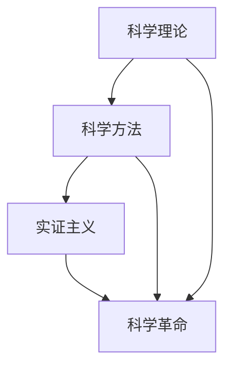

                 

### 引言

在人类历史的长河中，科学革命犹如一道道璀璨的闪电，照亮了我们对世界的认知和理解。科学革命不仅改变了我们对自然界的认识，还深刻地影响了人类社会的发展。从古希腊的泰勒斯到现代的量子力学，科学革命一直在不断地推进，引领着人类文明的前进。

科学革命的定义可以追溯到科学哲学领域，它是指那些对现有科学范式产生根本性挑战和变革的科学理论和发现。每一次科学革命都伴随着对传统观念的颠覆，以及对新知识的探索和积累。这些革命性的进展不仅重塑了我们对自然界的理解，还推动了技术进步、经济发展和社会变革。

本文将探讨科学革命如何改变我们理解世界的方式，分为以下几个部分：首先，我们将介绍科学革命的核心概念和联系，通过Mermaid流程图展示关键概念之间的关系。接着，回顾科学革命的历史，探讨其重要里程碑和影响。然后，分析科学革命对现代社会的影响，包括技术进步、社会结构和人类观念的变革。最后，展望科学革命的未来，探讨其可能的趋势和挑战。

通过这一系列的分析，我们希望读者能够更深入地理解科学革命的重要性，以及它如何不断地推动人类文明的进步。

#### 科学革命的概念与意义

科学革命作为一个重要的科学哲学概念，其定义和重要性不容忽视。科学革命指的是对传统科学范式进行根本性挑战和变革的过程，它不仅仅是对现有理论的修正，而是对整个科学体系的重新构建。这个概念最初由托马斯·库恩（Thomas S. Kuhn）在《科学革命的结构》（The Structure of Scientific Revolutions）一书中提出，并成为科学哲学领域的重要理论之一。

在库恩的理论中，科学革命被视为科学共同体内部范式的转变。范式（paradigm）是指科学共同体在特定时期内共同接受的一套科学研究的方法、理论和价值观。当面对无法用现有范式解释的现象或问题时，科学家们会开始质疑现有的范式，并尝试提出新的理论或范式。这一过程往往伴随着激烈的争论和冲突，最终可能引发科学革命。

科学革命的意义在于，它推动了科学知识的积累和进步，使我们对自然界的理解不断深化。具体来说，科学革命具有以下几个方面的意义：

1. **知识积累**：科学革命通过引入新的理论和发现，扩展了科学知识的边界。每一次科学革命都带来了对自然界新现象的揭示和解释，使得我们对宇宙、生命和自然规律的理解更加全面和深刻。

2. **技术进步**：科学革命往往伴随着技术革新，从而推动人类社会的发展和进步。从古代的农业革命到近代的工业革命，再到现代的信息技术革命，每一次科学革命都极大地促进了生产力的提升和社会的发展。

3. **社会变革**：科学革命不仅影响了科技领域，还对人类社会结构、文化观念和生活方式产生了深远影响。例如，牛顿力学的出现改变了人们对运动和重力的理解，推动了机械工业的发展，并对工业革命产生了重要影响。

4. **思维方式的变化**：科学革命促使人们形成更加理性和实证的思维方式。通过实验和观察，科学家们不断验证和修正理论，使得科学方法成为现代社会的重要思维工具。

总之，科学革命不仅是科学知识的积累过程，更是人类文明进步的重要推动力。它不仅改变了我们对自然界的理解，还塑造了现代社会和未来科技的发展方向。

#### 目标读者与书籍结构

本书的目标读者包括科学家、研究人员、学生以及对科学革命感兴趣的普通读者。我们旨在为这些读者提供一种系统性的理解科学革命的方法，帮助他们把握科学革命的核心理念和实际影响。对于科学家和研究人员，本书将深入探讨科学革命的理论基础和历史背景，提供丰富的案例和实例，以供学术研究和参考。对于学生，本书将采用通俗易懂的语言，结合实际案例，帮助他们在学习过程中更好地理解和掌握科学革命的概念。

在结构上，本书分为三大部分。第一部分将介绍科学革命的核心概念和联系，通过Mermaid流程图展示关键概念之间的关系，帮助读者建立系统的知识框架。第二部分回顾科学革命的历史，探讨其重要里程碑和影响，使读者对科学革命的发展脉络有更清晰的认知。第三部分分析科学革命对现代社会的影响，包括技术进步、社会结构和人类观念的变革，并展望科学革命的未来趋势和挑战。

本书的目的不仅是让读者理解科学革命的基本概念，还希望通过深入分析，激发读者对科学革命的兴趣，培养他们批判性思维和创新能力。通过这本书，我们希望读者能够更加全面和深刻地理解科学革命的重要性和影响力，从而在各自的领域中更好地运用科学知识，推动社会的进步和发展。

### 核心概念与联系

要深入理解科学革命，我们首先需要了解其核心概念和它们之间的联系。以下是科学革命中的几个关键概念：科学理论、科学方法、实证主义和科学革命本身。通过Mermaid流程图，我们可以直观地展示这些概念之间的关系。

#### 科学理论

科学理论是科学革命的基础，它是对自然界现象进行系统性解释的理论框架。科学理论通常基于观测、实验和数据分析，用以描述自然界的规律和现象。科学理论的发展是一个不断迭代和修正的过程，通过不断的实验验证和理论修正，科学理论逐渐变得更加精确和全面。

#### 科学方法

科学方法是科学家们进行科学研究的基本工具，包括观察、实验、假设、理论和验证等步骤。科学方法强调理性思考、实证主义和逻辑推理，通过系统的方法和严格的实验验证，科学家们能够构建和验证科学理论。

#### 实证主义

实证主义是科学方法的核心原则之一，强调知识和理论必须基于实证证据。实证主义认为，只有通过观察和实验获得的证据才能被用于验证或否定科学理论。实证主义促使科学家们采用严谨的实验设计和数据分析方法，以确保科学研究的可信性和可靠性。

#### 科学革命

科学革命是科学理论和科学方法发生重大变革的过程，它标志着科学知识的根本性进步。科学革命通常始于对现有理论的质疑和挑战，通过新的实验和发现，科学家们提出新的理论，从而推翻旧有范式，建立新的科学体系。

#### Mermaid流程图展示

为了更直观地展示这些核心概念之间的联系，我们使用Mermaid流程图进行说明：

在这个流程图中：

- **A[科学理论]** 是科学革命的核心，它通过科学方法和实证主义不断发展。
- **B[科学方法]** 提供了科学家进行研究的工具和步骤，是构建和验证科学理论的基础。
- **C[实证主义]** 强调知识和理论必须基于实证证据，是科学方法的核心原则。
- **D[科学革命]** 是科学理论和科学方法发生重大变革的过程，是整个流程的终点和目标。

通过这个流程图，我们可以清晰地看到科学革命中的核心概念及其相互关系。科学理论是基础，科学方法提供工具，实证主义确保可信性，而科学革命则是整个过程的终极目标，推动科学知识的不断进步。

#### 科学革命的历史回顾

科学革命的历史可谓波澜壮阔，涵盖了从古代至现代的多个重要时期。每一个时期都有其独特的科学里程碑和杰出人物，他们通过颠覆传统观念和提出新的理论，推动了人类对自然界的理解。

**古代至中世纪的科学**

古代科学可以追溯到古希腊时期，泰勒斯（Thales）被认为是西方哲学和科学的奠基人，他提出了水是万物的本源这一哲学观点。亚里士多德（Aristotle）进一步发展了这一思想，建立了以因果关系为核心的自然科学体系。然而，这一体系在中世纪受到基督教神学的强烈影响，科学的发展受到了限制。

**文艺复兴与科学革命初期**

文艺复兴时期标志着科学革命的兴起。伽利略（Galileo Galilei）通过望远镜的观察，证实了哥白尼（Nicolas Copernicus）的日心说，推翻了长期以来占据主导地位的地心说。伽利略的实验方法和科学推理方法为现代科学奠定了基础。与此同时，开普勒（Johannes Kepler）通过精确的天文观测，提出了行星运动的三大定律，极大地推动了天文学的发展。

**近代科学革命的关键人物与成果**

牛顿（Isaac Newton）是近代科学革命的代表人物，他通过《自然哲学的数学原理》（Philosophiæ Naturalis Principia Mathematica）一书，系统地阐述了万有引力定律和运动定律，建立了经典力学体系。牛顿的工作不仅解释了地球上的物体运动，还解释了天体之间的相互作用，为科学革命带来了里程碑式的进步。

在生物学领域，达尔文（Charles Darwin）通过多年的观察和实验，提出了自然选择和适者生存的理论，并在《物种起源》（On the Origin of Species）一书中详细阐述了这一理论。达尔文的理论颠覆了当时普遍接受的“神创论”，揭示了生物进化的机制。

**现代科学革命的影响**

20世纪初，物理学领域出现了量子力学和相对论这两场重大革命。普朗克（Max Planck）和爱因斯坦（Albert Einstein）分别提出了量子理论和相对论，揭示了微观和宏观世界的深层次规律。量子力学颠覆了经典物理学的确定性观念，强调概率和不确定性，而相对论则改变了我们对时间和空间的理解。

在化学领域，量子化学和分子生物学的发展，使我们对物质结构和生命过程的认识达到了新的高度。20世纪末和21世纪初，随着信息技术和生物技术的迅猛发展，科学革命进一步加速，人类基因组计划等重大项目的完成，标志着科学革命进入了新的阶段。

**总结**

科学革命的历史充满了挑战和突破，每一个时期都有其独特的贡献和里程碑。从古代的哲学思考到现代的实验科学，科学革命不仅改变了我们对自然界的理解，也深刻地影响了人类社会的发展。通过回顾这一历史，我们可以更好地理解科学革命的深远影响，并期待未来科学革命的进一步发展。

#### 科学革命对现代社会的影响

科学革命不仅重塑了我们对自然界的理解，还对现代社会产生了深远的影响，这些影响主要体现在技术进步、社会结构和人类观念的变革等方面。

**技术进步**

科学革命推动了技术的飞速发展，使得人类社会进入了一个全新的时代。牛顿力学和热力学的发展奠定了机械工业的基础，使蒸汽机和工业革命成为可能。电气工程的突破，特别是电灯、电动机和无线电技术的发明，改变了人类的生产和生活方式。20世纪中叶以来，量子力学和相对论的革命性进展为信息技术和核能技术的诞生提供了理论基础。现代计算机技术、互联网和人工智能的发展，使人类进入了信息时代，极大地提高了工作效率和生活质量。

**社会结构**

科学革命对社会结构的影响是深刻的。农业革命的出现，使得人类从游牧生活转向定居农业，导致了人口增长和社会组织方式的变革。工业革命则将人类社会推向了大规模工业生产和城市化的发展道路，传统的社会结构和经济模式发生了根本性改变。现代科学革命进一步加速了这一进程，信息技术和生物技术的广泛应用，使得全球化的趋势更加显著，跨国公司和全球供应链的出现，改变了全球经济格局。

**人类观念**

科学革命不仅改变了我们对物质世界的认识，还深刻地影响了人类观念。实证主义和科学方法的发展，使人类逐渐从宗教和神话的束缚中解放出来，形成了更加理性和科学的世界观。科学革命强调实验和观察的重要性，使得人类开始更加注重证据和理性思考。同时，科学革命也推动了科学哲学的发展，人们开始思考科学知识的本质、科学方法的有效性和科学理论的解释力。

然而，科学革命带来的变革也带来了一些挑战。技术进步和全球化的发展，使得人类社会面临新的问题和挑战，如环境污染、资源枯竭、社会不平等和伦理问题等。科学革命不仅要求我们掌握更多的科学知识，还要求我们具备批判性思维和创新能力，以应对这些挑战。

**总结**

科学革命对现代社会的影响是全方位的，从技术进步到社会结构的变革，再到人类观念的更新，科学革命塑造了现代社会的各个方面。通过科学革命，人类不仅取得了对自然界的深刻理解，还推动了社会的进步和发展。然而，科学革命也带来了新的问题和挑战，这要求我们在享受科技进步的同时，保持理性和批判性思维，以应对未来的挑战。

### 科学革命的未来展望

科学革命不仅在过去的几百年中改变了我们对世界的理解，还将在未来继续塑造人类社会的各个方面。随着技术的不断进步，科学革命的未来趋势和潜在影响变得日益重要。

#### 未来趋势

**新兴科学领域的崛起**

未来科学革命的一个显著趋势是新兴科学领域的崛起。例如，量子计算和量子通信正逐步从理论走向实际应用，有望在数据处理和信息传输方面带来革命性突破。此外，合成生物学和基因编辑技术的进步，将可能彻底改变医学和农业领域，使得人类能够治疗更多疾病，提高粮食产量。

**技术融合与多学科交叉**

未来科学革命还将看到不同学科之间的深度融合。例如，人工智能与神经科学的结合，将带来对大脑和认知机制的深刻理解，有助于开发更高级的智能系统。材料科学、纳米技术和生物工程等领域的交叉应用，也将产生新的技术和应用，推动社会进步。

**全球合作与开放科学**

未来科学革命的一个关键趋势是全球合作和开放科学的兴起。随着科学问题的复杂性增加，单一国家和机构的努力难以应对。全球科学家的合作和开放的科学平台，如开放获取期刊和共享数据集，将促进科学知识的快速传播和共享，加速科学进步。

#### 潜在影响

**技术进步带来的社会变革**

科学革命将继续推动技术的进步，进而引发社会结构的变革。例如，自动化和人工智能的广泛应用，将深刻改变劳动力市场，可能导致某些职业的消失和新兴职业的出现。这种变化要求社会和政府采取相应的政策和措施，以适应新的就业环境。

**伦理和隐私问题**

随着科学技术的进步，伦理和隐私问题将变得尤为重要。例如，基因编辑技术的应用，尽管在医学和农业领域具有巨大潜力，但也引发了对基因编辑伦理的广泛讨论。人工智能的广泛应用，使得个人隐私和数据安全问题成为社会关注的焦点。这些问题需要全球范围内的合作和规范的制定，以确保科技进步的同时，维护人类的基本权利。

**环境与可持续性**

科学革命对未来环境的影响不可忽视。例如，新能源技术的发展和推广，有助于减少对化石燃料的依赖，降低碳排放。然而，科学革命也带来了新的环境挑战，如电子废物和纳米材料的环境影响。因此，科学革命必须在推动技术进步的同时，注重环境保护和可持续发展。

**教育和人才培养**

科学革命对教育和人才培养提出了新的要求。未来的教育体系需要更加注重跨学科的知识和技能培养，以适应快速变化的科技环境。此外，科学教育需要注重科学精神的培养，包括批判性思维、问题解决能力和创新精神。

#### 总结

科学革命的未来充满希望和挑战。新兴科学领域的崛起、技术融合和全球合作，将推动科学进步和社会变革。然而，这些进步也带来了新的伦理和社会问题。通过合理的政策和国际合作，我们有望在享受科技进步的同时，克服挑战，实现可持续发展和人类福祉。

### 科学革命对个人生活的改变

科学革命不仅对社会和科技进步产生了深远影响，也对个人生活带来了深刻的变化。这些变化体现在日常生活、健康管理和认知拓展等方面。

#### 日常生活

科学革命在日常生活中带来了诸多便利。例如，智能手机的普及和移动互联网的发展，使得人们可以随时随地获取信息、进行社交和娱乐。智能家居技术的应用，使得家庭自动化成为现实，提高了生活效率和质量。此外，电子商务的兴起改变了人们的购物习惯，使得线上购物成为主流，极大地丰富了消费者的选择。

#### 健康管理

科学革命在健康管理方面也取得了显著进展。现代医学技术的突破，如影像学诊断、基因测序和生物治疗，使得疾病诊断和治疗的准确性和效果大大提高。远程医疗技术的应用，使得偏远地区的患者也能享受到高质量的医疗服务。此外，健康管理设备的普及，如智能手环和健康监测App，帮助人们更好地监控自己的健康状况，提前预防疾病。

#### 认知拓展

科学革命不仅改变了我们的生活方式和健康管理，还在认知拓展方面发挥了重要作用。人工智能和机器学习技术的应用，使得个性化学习成为可能，学生可以根据自己的学习进度和兴趣，选择适合自己的学习内容。此外，虚拟现实和增强现实技术的发展，为教育和娱乐带来了新的体验，使人们能够身临其境地探索世界。

#### 持续影响

科学革命对个人生活的改变是持续和深远的。随着科技的不断进步，人们的生活方式将变得更加智能、健康和便捷。然而，这些变化也带来了新的挑战，如数据隐私和安全问题、科技依赖等。因此，我们需要在享受科技进步带来的便利的同时，注重伦理和隐私保护，培养正确的科技使用习惯。

### 科学革命的未来挑战与机遇

科学革命的未来不仅充满了机遇，也面临着诸多挑战。这些挑战不仅涉及技术层面，还包括伦理、社会和环境等多个方面。

#### 技术层面的挑战

1. **技术安全**：随着人工智能和生物技术的迅猛发展，技术安全成为一个重要议题。如何确保人工智能系统的透明性和可靠性，防止其被滥用，成为亟待解决的问题。此外，生物技术如基因编辑的应用，也引发了关于技术风险的讨论。

2. **数据处理**：大数据和人工智能技术的应用，带来了海量数据的处理和分析挑战。如何有效地存储、管理和利用这些数据，是一个重要的技术难题。

#### 伦理层面的挑战

1. **数据隐私**：随着数据收集和分析的普及，个人隐私保护成为一个重要议题。如何在保障数据安全和隐私的同时，充分利用数据的价值，是一个伦理挑战。

2. **科技伦理**：科学革命带来了新的伦理问题，如基因编辑技术的应用引发了对基因改造伦理的讨论。如何在科技进步的同时，维护人类的伦理原则和价值观，是一个重要的伦理挑战。

#### 社会层面的挑战

1. **就业结构**：人工智能和自动化技术的普及，将改变劳动力市场，可能导致某些职业的消失和新兴职业的出现。如何适应这些变化，确保社会稳定和经济发展，是一个重要的社会问题。

2. **教育变革**：科学革命要求教育体系进行变革，以培养适应未来社会需求的人才。然而，现有的教育体系往往难以快速适应这些变化，需要更灵活和创新的教育模式。

#### 环境层面的挑战

1. **环境破坏**：科学革命带来了技术进步，但同时也加剧了环境破坏。如何平衡科技进步与环境保护，实现可持续发展，是一个重要的环境挑战。

2. **资源分配**：随着科学革命带来的资源需求增加，如何合理分配资源，确保全球公平，是一个重要的环境和社会挑战。

#### 应对挑战的策略

1. **国际合作**：面对科学革命带来的全球性挑战，国际合作至关重要。通过国际合作，可以共同应对技术安全、数据隐私和全球环境问题。

2. **政策法规**：政府需要制定相应的政策法规，确保科技进步在伦理和法律的框架内进行。例如，通过立法保护个人隐私，规范基因编辑的应用。

3. **公众教育**：提高公众的科学素养和伦理意识，是应对科学革命挑战的重要手段。通过公众教育，可以增强社会对科技进步的理解和支持，同时提高公众对科技风险的认知和防范能力。

总之，科学革命的未来既充满机遇，也面临挑战。通过国际合作、政策法规和公众教育，我们可以更好地应对这些挑战，实现科技的可持续发展和社会的和谐进步。

### 附录A：科学革命重要人物与成就

在科学革命的历史长河中，众多杰出的科学家和思想家的贡献不可磨灭。以下列举了几个关键时期的重要人物及其主要成就：

#### 古希腊时期

**泰勒斯**（Thales）：被誉为“西方哲学之父”，他提出了水是万物的本源，是自然哲学的奠基人。

**亚里士多德**（Aristotle）：创立了系统的自然科学体系，对植物、动物和地球进行了详细分类和研究。

#### 文艺复兴时期

**伽利略**（Galileo Galilei）：通过望远镜的观测，证实了哥白尼的日心说，奠定了现代天文学的基础。

**开普勒**（Johannes Kepler）：提出了行星运动的三大定律，为天文学的发展做出了重要贡献。

#### 近代科学革命时期

**牛顿**（Isaac Newton）：在《自然哲学的数学原理》中提出了万有引力定律和运动定律，奠定了经典力学的基础。

**达尔文**（Charles Darwin）：通过自然选择和适者生存的理论，彻底改变了生物学领域的观念。

#### 现代科学革命时期

**普朗克**（Max Planck）：提出了量子理论，揭示了能量量子化的概念，为量子力学的发展奠定了基础。

**爱因斯坦**（Albert Einstein）：提出了相对论，改变了我们对时间和空间的理解，为现代物理学的发展带来了革命性突破。

这些重要人物和他们的成就不仅推动了科学革命，也深刻影响了人类文明的进程。了解他们的贡献，有助于我们更好地理解科学革命的历史和影响。

### 附录B：科学革命重要事件与时间线

以下是一个简化的科学革命重要事件与时间线，涵盖了从古希腊至现代的关键时刻：

**古希腊时期**

- 公元前6世纪：泰勒斯提出水是万物的本源。

- 公元前384年：亚里士多德出生，创立了系统的自然科学体系。

**文艺复兴时期**

- 1609年：伽利略首次使用望远镜进行天文观测，证实了哥白尼的日心说。

- 1609年：开普勒提出了行星运动的三大定律。

**近代科学革命时期**

- 1687年：牛顿发表了《自然哲学的数学原理》，提出了万有引力定律和运动定律。

- 1859年：达尔文发表了《物种起源》，提出了自然选择和适者生存的理论。

**现代科学革命时期**

- 1900年：普朗克提出了量子理论，揭示了能量量子化的概念。

- 1905年：爱因斯坦提出了狭义相对论，改变了我们对时间和空间的理解。

- 1960年代：量子计算和互联网技术的发展，开启了信息时代。

通过这个时间线，我们可以清晰地看到科学革命的发展历程和关键节点。

### 附录C：科学革命相关的最佳实践、小结和注意事项

#### 最佳实践

1. **持续学习**：科学革命不断推动知识的前沿，持续学习是跟上时代步伐的关键。鼓励读者订阅科学期刊、参加学术会议和在线课程，保持对最新科学进展的关注。

2. **跨学科合作**：科学革命往往在多学科交叉中产生突破。鼓励读者在各自领域中探索跨学科的知识，推动创新的科学研究和应用。

3. **关注伦理问题**：随着科学技术的进步，伦理问题日益突出。在应用科技成果时，应充分考虑伦理和社会影响，确保科技发展的可持续性和社会责任。

#### 小结

科学革命不仅改变了我们对自然界的理解，还推动了技术进步、社会结构和人类观念的变革。它通过不断推动知识的积累和理论的发展，为人类社会带来了深远的影响。

#### 注意事项

1. **数据安全和隐私**：在数据驱动的时代，保护数据安全和隐私至关重要。确保在数据收集、存储和使用过程中，遵循相应的法规和标准，维护用户隐私。

2. **环境可持续发展**：科学革命带来了技术进步，但同时也需关注环境问题。在推动科技进步的同时，注重环境保护和资源可持续利用，以实现绿色发展的目标。

3. **人才培养和教育**：科学革命要求具备高水平的科学素养和创新能力。教育体系应注重培养批判性思维、问题解决能力和创新精神，以应对未来科技和社会的发展需求。

### 拓展阅读

- **《科学革命的结构》（Thomas S. Kuhn）**：详细探讨了科学革命的理论基础和历史背景。
- **《自然哲学的数学原理》（Isaac Newton）**：牛顿的经典力学著作，奠定了现代物理学的基础。
- **《物种起源》（Charles Darwin）**：达尔文的生物学著作，提出了自然选择和适者生存的理论。

通过这些拓展阅读，读者可以进一步深入了解科学革命的背景和影响。

### 总结

科学革命作为推动人类文明进步的重要力量，从古代至现代，不断地改变着我们对世界的认知和理解。本文系统地介绍了科学革命的核心概念、历史回顾、对现代社会的影响、未来趋势以及个人生活的改变，并探讨了未来的挑战与机遇。科学革命不仅带来了技术进步和社会变革，还深刻影响了人类观念的形成和发展。

通过本文的阅读，我们希望读者能够更加全面和深刻地理解科学革命的重要性和影响力。在享受科技进步带来的便利的同时，我们也应关注其带来的伦理和社会问题，以实现科技的可持续发展和人类社会的和谐进步。

感谢读者对本文的关注，希望本文能够激发您对科学革命的兴趣，并鼓励您在各自的领域中不断创新和探索。让我们共同迎接科学革命的下一波浪潮，为人类文明的美好未来贡献力量。作者：AI天才研究院/AI Genius Institute & 禅与计算机程序设计艺术 /Zen And The Art of Computer Programming。

