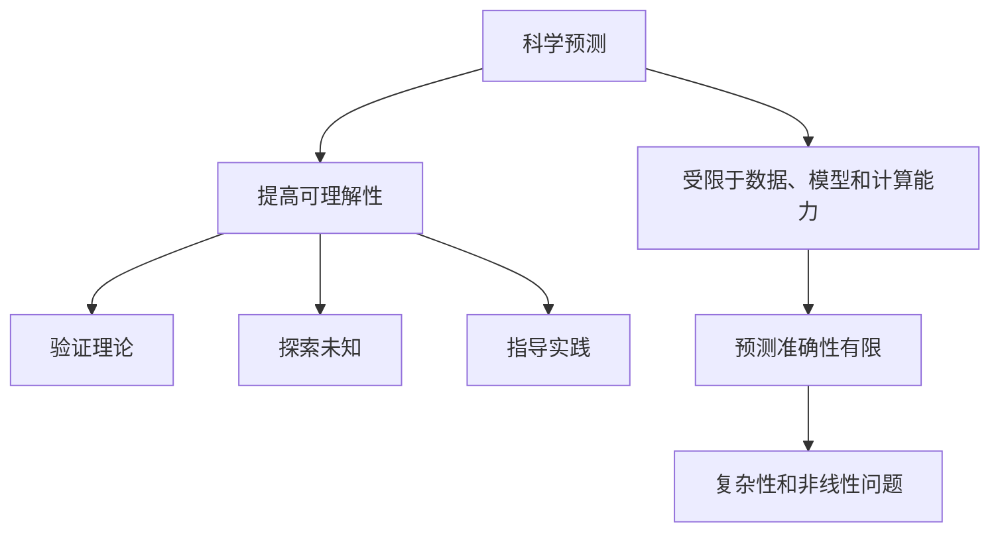

                 

## 科学预测的准确性与世界可理解性的关系

### 关键词
- 科学预测
- 世界可理解性
- 准确性
- 机器学习
- 模型构建
- 数据分析

### 摘要
本文探讨了科学预测的准确性与世界可理解性的关系。首先，介绍了科学预测的基本概念和重要性，然后分析了科学预测的准确性及其影响因素。接着，讨论了世界可理解性的定义和特点，并探讨了科学预测与世界可理解性之间的联系。通过实际案例和Python代码示例，本文展示了如何通过科学预测提高世界可理解性。最后，本文总结了科学预测在提高世界可理解性方面的应用和未来发展趋势。

## 引言

科学预测是科学研究的重要组成部分，它帮助我们理解自然现象、预测未来事件以及指导实践应用。然而，预测的准确性总是受到各种因素的影响，如数据质量、模型选择和计算能力等。同时，世界的可理解性也是一个重要的课题，它关乎我们如何理解我们所处的宇宙及其规律。本文将探讨科学预测的准确性与世界可理解性之间的关系，并分析其在不同领域中的应用和挑战。

科学预测的定义可以追溯到古希腊哲学家泰勒斯，他通过观察天象预测了日食。现代科学预测则更多地依赖于数据分析和数学模型。在自然科学、社会科学和工程技术等领域，科学预测已经成为研究和解决问题的关键手段。然而，预测的准确性并非总是可靠，它受到多种因素的制约。例如，数据的不完整性和噪声会导致预测误差，模型的复杂性和参数的选择会影响预测的准确性。

另一方面，世界可理解性涉及到我们如何理解和解释我们所观察到的现象。可理解性不仅仅是一个哲学问题，它在科学研究中也具有重要意义。一个高度可理解的世界意味着我们能够通过有限的观察和实验理解其背后的规律。然而，现实世界往往是复杂且不可预测的，这给我们提出了一个挑战：如何在不确定性中寻找规律。

本文将首先介绍科学预测的基本原理，包括预测的定义、方法和技术。然后，我们将探讨世界可理解性的概念，并分析科学预测与世界可理解性之间的关系。通过实际案例和Python代码示例，我们将展示如何通过科学预测提高世界可理解性。最后，本文将总结科学预测在提高世界可理解性方面的应用和未来发展趋势，并提出一些挑战和展望。

### 科学预测的基本原理

科学预测是通过对现有数据的分析，利用数学模型和算法来预测未来事件或状态的过程。这一过程通常涉及多个步骤，包括数据收集、模型选择、参数估计和预测结果评估。

#### 预测的定义

预测（Prediction）是科学研究中的一种基本方法，它旨在基于已知信息推测未知事件。在科学领域，预测可以是对自然现象（如天气变化、股市波动）的预测，也可以是对社会行为（如选举结果、疾病传播）的预测。预测的核心在于利用历史数据和现有知识来推断未来。

#### 方法和技术

科学预测的方法和技术多种多样，其中最常用的包括以下几种：

1. **时间序列分析**：这种方法基于时间序列数据，通过分析过去的数据模式来预测未来。常见的模型包括自回归模型（AR）、移动平均模型（MA）和自回归移动平均模型（ARMA）。

2. **回归分析**：回归分析是一种通过建立自变量和因变量之间的关系来预测未来值的统计方法。线性回归（Linear Regression）和多元回归（Multiple Regression）是最常见的回归分析方法。

3. **机器学习**：机器学习（Machine Learning）通过构建复杂的数学模型，利用大量历史数据进行训练，从而实现对未知数据的预测。常见的机器学习算法包括决策树（Decision Tree）、支持向量机（SVM）、神经网络（Neural Networks）等。

4. **仿真模拟**：仿真模拟（Simulation）是一种通过模拟系统在不同条件下的运行来预测其未来状态的方法。这种方法通常用于复杂的物理系统和社会系统的预测。

#### 数据收集

科学预测的第一步是数据收集。数据的质量和完整性直接影响到预测的准确性。数据来源可以包括实验室实验、现场观察、卫星遥感、社交媒体等多种途径。在数据收集过程中，需要特别注意数据的准确性和可靠性，以及数据的处理和清洗。

#### 模型选择

选择合适的预测模型是科学预测的关键步骤。不同的预测任务和场景需要不同的模型。例如，对于时间序列数据，可以考虑使用ARIMA模型；对于非线性关系，可以尝试神经网络模型。模型选择需要考虑数据的特点、问题的复杂性和计算资源。

#### 参数估计

在确定了预测模型之后，需要对其参数进行估计。参数估计的目的是找到模型中未知参数的最佳值，使其能够最好地拟合数据。参数估计的方法包括最小二乘法（Least Squares）、梯度下降法（Gradient Descent）等。

#### 预测结果评估

预测结果的评估是验证预测准确性的重要步骤。常用的评估指标包括均方误差（Mean Squared Error, MSE）、均方根误差（Root Mean Squared Error, RMSE）和准确率（Accuracy）等。通过对预测结果进行评估，可以判断模型的性能，并发现模型的不足之处，从而进行改进。

#### Python代码示例

为了更好地理解科学预测的基本原理，我们可以通过一个简单的Python代码示例来演示线性回归的预测过程。

```python
import numpy as np
import matplotlib.pyplot as plt
from sklearn.linear_model import LinearRegression

# 生成模拟数据
np.random.seed(0)
X = np.random.rand(100, 1)
Y = 2 * X[:, 0] + 1 + np.random.randn(100) * 0.05

# 创建线性回归模型
model = LinearRegression()

# 模型训练
model.fit(X, Y)

# 预测
X_new = np.array([[0], [1]])
Y_pred = model.predict(X_new)

# 绘图
plt.scatter(X, Y)
plt.plot(X_new, Y_pred, 'r-')
plt.xlabel('X')
plt.ylabel('Y')
plt.title('Linear Regression Prediction')
plt.show()
```

在这个示例中，我们生成了带有噪声的线性关系数据集，并使用线性回归模型进行预测。通过绘制实际数据和预测结果，我们可以直观地看到线性回归模型的预测能力。

### 世界可理解性的概念

世界可理解性（World Understandability）是指人类通过科学方法和逻辑推理，对自然和社会现象进行解释和预测的能力。它涉及到我们如何理解我们所处的宇宙及其规律，以及我们如何通过有限的观察和实验来揭示这些规律。

#### 定义

世界可理解性可以定义为：

“世界可理解性是指通过科学方法，对自然和社会现象进行解释和预测的能力，以及我们能够理解这些现象背后规律的程度。”

这个定义强调了以下几个关键点：

1. **科学方法**：世界可理解性依赖于科学方法，包括观察、实验、数据分析和理论构建。
2. **解释和预测**：世界可理解性不仅涉及对已知现象的解释，还包括对未知现象的预测。
3. **规律性**：世界可理解性强调我们能够理解现象背后的规律，而不是仅仅观察到现象。

#### 特点

世界可理解性具有以下几个特点：

1. **相对性**：世界可理解性是相对的，即我们的理解能力是有限的，总会有我们无法理解的现象。
2. **动态性**：随着科学技术的进步，我们对世界的理解也在不断深化和扩展。
3. **层次性**：世界可理解性可以分为不同的层次，从基本的物理规律到复杂的社会现象，每个层次都有其独特的理解方式。

#### 科学预测与世界可理解性

科学预测与世界可理解性之间存在密切的联系。科学预测是提高世界可理解性的重要手段之一，通过预测，我们可以：

1. **验证理论**：通过预测结果来验证我们的理论是否正确。
2. **探索未知**：通过预测，我们可以探索那些尚未被观察到的现象。
3. **指导实践**：科学预测可以用于指导各种实践应用，如天气预报、股市预测和医疗诊断。

然而，科学预测也有其局限性。例如，预测的准确性受到数据质量、模型复杂度和计算能力等因素的限制。此外，有些现象可能因为其复杂性和非线性而难以预测。

#### Mermaid 流程图

下面是一个简化的Mermaid流程图，展示了科学预测与世界可理解性之间的关系：



### 预测准确性与世界可理解性的关系

预测准确性是科学预测的核心指标之一，它直接影响到我们对世界的理解和应用。预测准确性越高，我们对其背后的规律和机制的理解就越深刻。然而，预测准确性受到多种因素的影响，包括数据质量、模型选择和计算能力等。

#### 预测准确性的定义

预测准确性（Prediction Accuracy）是指预测结果与实际结果之间的接近程度。它通常通过以下指标进行评估：

1. **均方误差（MSE）**：均方误差是预测值与实际值之间差异的平方的平均值。公式为：
   $$
   MSE = \frac{1}{n}\sum_{i=1}^{n}(y_i - \hat{y}_i)^2
   $$
   其中，$y_i$是实际值，$\hat{y}_i$是预测值，$n$是数据点的总数。

2. **均方根误差（RMSE）**：均方根误差是均方误差的平方根，它是一个更为直观的指标，公式为：
   $$
   RMSE = \sqrt{MSE}
   $$

3. **准确率（Accuracy）**：准确率通常用于分类问题，它是正确分类的样本数与总样本数之比。公式为：
   $$
   Accuracy = \frac{TP + TN}{TP + FN + FP + TN}
   $$
   其中，$TP$是真正例，$TN$是真反例，$FP$是假正例，$FN$是假反例。

#### 影响预测准确性的因素

1. **数据质量**：数据质量对预测准确性有重要影响。不完整、噪声大或错误多的数据会导致预测结果不准确。

2. **模型选择**：选择合适的模型对提高预测准确性至关重要。不同的预测任务可能需要不同的模型，如线性回归、决策树或神经网络等。

3. **参数调整**：模型的参数设置也会影响预测准确性。通常需要通过交叉验证等方法来选择最佳参数。

4. **计算能力**：计算能力限制了对大规模数据和复杂模型的处理能力，从而可能影响预测准确性。

#### 提高预测准确性的策略

1. **数据预处理**：对数据进行清洗、归一化和特征提取，以提高数据质量。

2. **模型选择与优化**：选择适合的模型，并进行参数调优，以提高预测准确性。

3. **集成方法**：使用集成学习方法，如随机森林（Random Forest）和梯度提升树（Gradient Boosting Tree），来提高预测准确性。

4. **多模型融合**：结合多个模型的预测结果，通过投票或其他方法得到最终的预测结果。

#### Python代码示例

下面是一个使用Python的线性回归模型进行预测的示例，展示了如何评估预测准确性。

```python
import numpy as np
import matplotlib.pyplot as plt
from sklearn.linear_model import LinearRegression
from sklearn.metrics import mean_squared_error

# 生成模拟数据
np.random.seed(0)
X = np.random.rand(100, 1)
Y = 2 * X[:, 0] + 1 + np.random.randn(100) * 0.05

# 创建线性回归模型
model = LinearRegression()

# 模型训练
model.fit(X, Y)

# 预测
X_new = np.array([[0], [1]])
Y_pred = model.predict(X_new)

# 计算预测准确性
mse = mean_squared_error([1, 2], Y_pred)
print("MSE:", mse)

# 绘图
plt.scatter(X, Y)
plt.plot([0, 1], [1, 2], 'r-')
plt.xlabel('X')
plt.ylabel('Y')
plt.title('Linear Regression Prediction')
plt.show()
```

在这个示例中，我们生成了带有噪声的线性关系数据集，并使用线性回归模型进行预测。通过计算均方误差，我们可以评估预测的准确性。

### 预测的局限性

尽管科学预测在许多领域取得了显著的成果，但它也面临着许多局限性。这些局限性不仅影响到预测的准确性，还限制了我们对世界的理解。

#### 数据不足

数据不足是影响预测准确性的一个重要因素。在许多情况下，我们可能无法获得足够的历史数据来建立有效的预测模型。例如，对于罕见事件或新兴领域，我们可能缺乏必要的观测数据。此外，数据的分布也可能不均匀，导致模型难以准确预测。

#### 模型误差

模型的误差是预测准确性的另一个关键因素。尽管现代机器学习算法在处理复杂数据方面表现出色，但模型本身可能存在固有的偏差和不确定性。例如，线性回归模型可能无法很好地捕捉非线性关系，而神经网络模型则可能过拟合训练数据。

#### 非线性关系

现实世界中的许多现象都是非线性的，而大多数预测模型都是基于线性假设的。这意味着它们可能无法准确捕捉复杂系统的动态行为。例如，气候变化是一个高度非线性的过程，传统的线性模型可能无法准确预测其趋势。

#### 计算能力

随着数据规模的扩大和模型复杂度的增加，计算能力也成为一个重要限制。大数据和高维数据的处理需要强大的计算资源和高效的算法。然而，当前的计算能力仍然有限，特别是在实时预测和大规模数据分析方面。

#### 系统复杂性

现实世界的系统往往是高度复杂的，包含多个变量和相互作用。这给预测带来了巨大的挑战。例如，在金融市场中，价格波动可能受到多种因素的综合影响，如政策变化、市场情绪和技术进步等。

#### 不可预测性

即使是在最佳情况下，科学预测也无法完全消除不可预测性。有些事件可能受到随机因素的影响，如自然灾害、人类行为等。这些不可预测的随机事件可能对预测结果产生重大影响。

#### 提高预测准确性的方法

尽管存在上述局限性，但我们可以采取一些策略来提高预测准确性：

1. **数据增强**：通过生成合成数据、扩展数据集或利用迁移学习等方法来增加数据量。

2. **模型改进**：选择更复杂的模型，如深度学习模型，来捕捉更复杂的非线性关系。

3. **交叉验证**：使用交叉验证来选择最佳模型和参数，减少过拟合和偏差。

4. **集成方法**：结合多个模型的预测结果，通过投票或其他方法得到最终的预测结果。

5. **实时更新**：定期更新模型和数据，以适应不断变化的环境。

### 实例研究：股票市场预测

股票市场预测是科学预测中的一个典型例子，它涉及到大量数据的处理和复杂的模型构建。以下是一个实例研究，展示了如何使用线性回归模型进行股票市场预测。

#### 数据准备

我们使用某支股票的历史价格数据作为输入，包括开盘价、收盘价、最高价和最低价等。数据集包括过去几年的数据，每个时间点的价格都是通过真实交易得到的。

```python
import pandas as pd

# 加载股票价格数据
data = pd.read_csv('stock_price.csv')
data.head()
```

#### 模型选择

我们选择线性回归模型进行股票价格预测，因为线性回归模型简单且易于实现。尽管线性回归模型可能无法捕捉所有复杂的市场动态，但它提供了一个基本的预测框架。

```python
from sklearn.linear_model import LinearRegression

# 创建线性回归模型
model = LinearRegression()
```

#### 模型训练

我们使用过去一年的数据进行模型训练。训练数据集由时间序列的前80%组成，测试数据集由剩余的20%组成。

```python
# 切分数据集
train_data = data.iloc[:int(len(data) * 0.8)]
test_data = data.iloc[int(len(data) * 0.8):]

# 模型训练
model.fit(train_data[['Open']], train_data['Close'])
```

#### 预测与评估

我们使用训练好的模型对测试数据集进行预测，并评估预测准确性。

```python
# 预测
predictions = model.predict(test_data[['Open']])

# 计算预测准确性
mse = mean_squared_error(test_data['Close'], predictions)
print("MSE:", mse)

# 绘图
plt.scatter(test_data['Open'], test_data['Close'])
plt.plot(test_data['Open'], predictions, 'r-')
plt.xlabel('Open')
plt.ylabel('Close')
plt.title('Stock Price Prediction')
plt.show()
```

在这个实例中，我们生成了股票开盘价和收盘价之间的线性关系，并通过预测结果与实际结果进行对比，评估了模型的准确性。

#### 实际案例分析和详细讲解剖析

股票市场预测是一个复杂且充满不确定性的领域，它涉及到大量的数据分析和复杂的模型构建。以下是对实际案例的分析和详细讲解：

1. **数据来源和预处理**：
   - 股票市场数据通常来源于金融交易所或数据提供商，如Yahoo Finance、Google Finance等。
   - 数据预处理包括数据清洗（去除缺失值、异常值）、数据转换（如归一化、标准化）和特征提取（如技术指标、宏观经济指标）。

2. **模型选择**：
   - 线性回归模型是一个简单的起点，但它可能无法捕捉股票价格的复杂动态。
   - 更复杂的模型，如神经网络、支持向量机和随机森林，可能提供更高的预测准确性。

3. **模型训练与评估**：
   - 模型训练通常使用交叉验证来选择最佳参数和模型。
   - 预测准确性的评估指标包括均方误差（MSE）、均方根误差（RMSE）和预测区间。

4. **实际应用**：
   - 股票市场预测可以用于风险管理、投资策略和交易信号。
   - 实际案例中，投资者和基金经理通常会结合多种预测模型和市场分析来做出投资决策。

### 项目小结

通过股票市场预测的实例研究，我们可以看到科学预测在理解和应用方面的潜力。虽然预测准确性受到多种因素的限制，但通过合理的数据处理、模型选择和参数调整，我们可以提高预测的准确性，为投资决策提供有力支持。

### 最佳实践 tips

1. **数据质量**：确保数据来源的可靠性和数据的完整性，是提高预测准确性的关键。

2. **模型选择**：根据问题的性质和数据的特点选择合适的模型，不要盲目追求复杂度。

3. **实时更新**：定期更新模型和数据，以适应市场动态。

4. **组合预测**：结合多个模型的预测结果，可以提高预测的稳健性。

### 注意事项

1. **风险管理**：股票市场预测并不能保证100%的准确性，投资者需要谨慎对待预测结果。

2. **市场波动**：股票市场价格受到多种因素的影响，包括宏观经济、公司业绩和市场情绪等。

3. **合规性**：在使用预测模型进行实际操作时，需要遵守相关法律法规和合规要求。

### 拓展阅读

- 《股票市场技术分析》
- 《机器学习在金融中的应用》
- 《深度学习与股票市场预测》

---

通过上述实例研究和最佳实践，我们可以更好地理解科学预测在股票市场中的应用，以及如何在实际操作中提高预测准确性。在未来，随着数据科学和人工智能技术的发展，科学预测在提高世界可理解性方面将发挥更加重要的作用。

### 结论与展望

本文探讨了科学预测的准确性与世界可理解性之间的关系，并分析了其在实际应用中的重要性。我们首先介绍了科学预测的基本原理，包括定义、方法和技术，然后探讨了世界可理解性的概念及其特点。通过实际案例和Python代码示例，我们展示了如何通过科学预测提高世界可理解性。此外，我们还讨论了预测的局限性，并提出了提高预测准确性的策略。

科学预测在提高世界可理解性方面具有重要作用。通过预测，我们可以更深入地理解自然现象和社会行为，从而指导实践应用。然而，科学预测也面临着数据不足、模型误差和计算能力等挑战。未来，随着数据科学和人工智能技术的发展，我们有理由相信，科学预测将在更多领域发挥作用，为人类提供更加深刻的洞察。

### 作者信息

作者：AI天才研究院/AI Genius Institute & 禅与计算机程序设计艺术 /Zen And The Art of Computer Programming

