                 

### 引言

#### 1.1 书籍背景与目的

科研伦理与社会影响评估是现代科研活动中不可忽视的重要课题。随着科学技术的迅猛发展，人工智能、基因编辑、生物技术等前沿领域的突破不断涌现，这些技术的应用带来了巨大的社会变革。然而，科技进步在推动社会进步的同时，也引发了一系列伦理和责任问题。如何平衡科学进步与社会责任，确保科研活动的合法性和道德性，成为当前学术界和公众共同关注的话题。

本书旨在深入探讨科研伦理与社会影响评估的相关问题，为科研人员提供理论指导和实践参考。具体来说，本书包括以下几个目标：

1. **概述科研伦理的基本概念、原则和发展历程**：帮助读者理解科研伦理的核心价值和实践要求。
2. **介绍社会影响评估的方法和技术**：探讨如何科学、全面地评估科研成果对社会的影响。
3. **分析科学进步与社会责任的平衡策略**：提供平衡两者关系的理论框架和实践路径。
4. **通过案例研究，展示科研伦理与社会影响评估的实际应用**：为读者提供具体的操作指南和参考实例。

#### 1.2 研究意义与挑战

**研究意义**：

1. **促进科研伦理的遵守**：通过系统化的科研伦理教育，提高科研人员的道德素养，减少伦理违规行为。
2. **提高社会影响评估的准确性**：为社会政策制定者、企业和科研机构提供科学、客观的社会影响评估工具和方法。
3. **推动科学进步与社会责任的协调发展**：实现科学技术的可持续发展，促进社会的全面进步。

**研究挑战**：

1. **科研伦理的多样性与复杂性**：不同学科、不同文化背景下的科研伦理存在差异，如何统一和规范成为一大挑战。
2. **社会影响评估的数据获取与处理**：社会影响评估需要大量的数据支持，如何有效地获取、处理和分析这些数据是关键。
3. **科学进步与社会责任协调机制的构建**：在推动科技进步的同时，如何确保社会责任的履行，实现可持续发展。

#### 1.3 书籍结构安排

本书结构如下：

1. **第2章 科研伦理概述**：介绍科研伦理的基本概念、核心原则和重要准则。
2. **第3章 社会影响评估方法**：讲解社会影响评估的理论框架、常用方法和技术。
3. **第4章 科学进步与社会责任的平衡**：探讨平衡两者关系的策略和实践。
4. **第5章 案例研究**：通过具体案例分析科研伦理与社会影响评估的实际应用。
5. **第6章 结论与展望**：总结研究的主要发现，提出未来研究的方向和建议。

### 1.4 核心概念与联系

为了更好地理解科研伦理与社会影响评估之间的关系，我们可以使用 Mermaid 流程图来展示它们的核心概念和相互联系。

```mermaid
graph TD
    A[科研伦理] --> B[科研诚信]
    A --> C[科研责任]
    A --> D[科研规范]
    B --> E[数据隐私]
    B --> F[学术诚信]
    C --> G[社会责任]
    C --> H[社会责任履行]
    D --> I[伦理审查]
    D --> J[伦理规范]
    E --> K[隐私保护]
    E --> L[隐私权]
    F --> M[知识产权]
    F --> N[知识共享]
    G --> O[社会影响]
    G --> P[社会公正]
    H --> Q[可持续发展]
    I --> R[伦理委员会]
    I --> S[伦理决策]
    J --> T[伦理准则]
    J --> U[伦理教育]
    K --> V[数据安全]
    K --> W[隐私政策]
    L --> X[法律保护]
    L --> Y[隐私权保障]
    M --> Z[创新保护]
    M --> AA[知识传播]
    N --> BB[开放获取]
    N --> CC[知识共享]
    O --> DD[社会效益]
    O --> EE[社会成本]
    P --> FF[社会公平]
    P --> GG[社会正义]
    Q --> HH[环保]
    Q --> II[资源节约]
    R --> JJ[伦理审查流程]
    R --> KK[伦理决策支持]
    S --> LL[伦理决策模型]
    S --> MM[伦理决策分析]
    T --> NN[伦理规范制定]
    T --> OO[伦理规范执行]
    U --> PP[伦理教育培训]
    U --> QQ[伦理意识培养]
    V --> RR[数据保护策略]
    V --> SS[隐私保护技术]
    W --> TT[隐私保护法规]
    W --> UU[隐私保护机制]
    X --> VV[隐私权法律]
    X --> WW[隐私权司法保护]
    Y --> XX[隐私权道德]
    Y --> YY[隐私权伦理]
    Z --> ZZ[知识产权保护]
    Z --> AAA[知识产权管理]
    AA --> BBB[知识共享平台]
    AA --> CCC[知识共享机制]
    BB --> CCC[开放获取技术]
    BB --> DDD[开放获取政策]
    CC --> CCC[知识共享策略]
    CC --> EEE[知识共享实践]
    DD --> FFF[社会效益评估]
    DD --> GGG[社会效益分析]
    EE --> FFF[社会成本评估]
    EE --> GGG[社会成本分析]
    FF --> HHH[社会公平评估]
    FF --> III[社会公正评估]
    GG --> HHH[社会公平分析]
    GG --> III[社会公正分析]
    HH --> JJJ[可持续发展评估]
    HH --> KKK[可持续发展分析]
    II --> LLL[环保评估]
    II --> MMM[资源节约评估]
    JJ --> NNN[伦理审查标准]
    JJ --> OOO[伦理审查流程]
    KK --> PPP[伦理决策模型]
    KK --> QQQ[伦理决策分析]
    LL --> RRR[伦理决策框架]
    LL --> SSS[伦理决策方法]
    MM --> TTT[伦理决策分析工具]
    MM --> UUU[伦理决策支持系统]
    NN --> VVV[伦理规范标准]
    NN --> WWWW[伦理规范执行策略]
    OO --> XXX[伦理教育计划]
    OO --> YYY[伦理意识培养计划]
    PP --> ZZZ[数据保护策略]
    PP --> AAAA[隐私保护技术]
    QQ --> BBBB[伦理意识培养策略]
    QQ --> CCCD[伦理意识培养方法]
    RR --> EEFF[数据保护法规]
    RR --> GGGG[数据保护机制]
    SS --> HHUU[隐私保护政策]
    SS --> IIUU[隐私保护执行]
    TT --> JJUU[隐私保护法规]
    TT --> KKKK[隐私保护机制]
    UU --> LLLU[隐私权保护措施]
    UU --> MMMM[隐私权保护策略]
    VV --> NNNN[隐私权保护法律]
    VV --> OOOO[隐私权保护司法]
    WW --> PQQQ[隐私权道德]
    WW --> QQQQ[隐私权伦理]
    XX --> RRRR[隐私权法律]
    XX --> SSSS[隐私权司法保护]
    YY --> TTTT[隐私权道德]
    YY --> UUUU[隐私权伦理]
    ZZ --> VVVV[知识产权保护]
    ZZ --> XXXX[知识产权管理]
    AAA --> BBBB[知识产权法规]
    AAA --> CCCD[知识产权司法保护]
    BBB --> EEFF[知识共享平台]
    BBB --> GGGG[知识共享机制]
    CCC --> EEFF[知识共享政策]
    CCC --> HHHH[知识共享实践]
    DDD --> EEFF[开放获取技术]
    DDD --> GGGG[开放获取政策]
    EEE --> HHHH[知识共享策略]
    EEE --> IJJJ[知识共享分析]
    FFF --> JJUU[社会效益评估]
    FFF --> KKKK[社会成本评估]
    GGG --> JJUU[社会效益分析]
    GGG --> KKKK[社会成本分析]
    HHH --> LLLU[社会公平评估]
    HHH --> MMMM[社会公正评估]
    III --> LLLU[社会公平分析]
    III --> MMMM[社会公正分析]
    JJJ --> NNNN[可持续发展评估]
    JJJ --> OOOO[环保评估]
    KKK --> NNNN[可持续发展分析]
    KKK --> OOOO[环保分析]
    LLL --> PPP[数据保护策略]
    LLL --> QQQQ[隐私保护技术]
    MMM --> PPP[数据保护法规]
    MMM --> QQQQ[隐私保护机制]
    NNN --> VVVV[知识产权保护]
    NNN --> XXXX[知识产权管理]
    OOO --> VVVV[知识产权法规]
    OOO --> XXXX[知识产权司法保护]
    PPP --> ZZZZ[伦理决策模型]
    PPP --> AAAA[伦理决策分析]
    QQQ --> ZZZZ[伦理决策框架]
    QQQ --> BBBB[伦理决策方法]
    RRR --> ZZZZ[伦理决策分析工具]
    RRR --> AAAA[伦理决策支持系统]
    SSS --> ZZZZ[伦理决策标准]
    SSS --> BBBB[伦理决策执行策略]
    TTT --> ZZZZ[伦理决策分析工具]
    TTT --> AAAA[伦理决策支持系统]
    UUU --> ZZZZ[伦理决策标准]
    UUU --> BBBB[伦理决策执行策略]
    VVV --> XXXXX[数据保护策略]
    VVV --> YYYYY[隐私保护技术]
    WWW --> XXXXX[数据保护法规]
    WWW --> YYYYY[隐私保护机制]
    XXX --> ZZZZ[知识产权保护]
    XXX --> BBBB[知识产权管理]
    YYY --> ZZZZ[知识产权法规]
    YYY --> BBBB[知识产权司法保护]
    XXXX --> ZZZZ[知识产权保护]
    XXXX --> BBBB[知识产权管理]
    XXXX --> XXXXX[知识产权司法保护]
    XXXXX --> ZZZZ[知识产权保护]
    XXXXX --> BBBB[知识产权管理]
    XXXXX --> XXXXX[知识产权司法保护]
    YYYYY --> ZZZZ[知识产权保护]
    YYYYY --> BBBB[知识产权管理]
    YYYYY --> XXXXX[知识产权司法保护]
```



通过上述流程图，我们可以清晰地看到科研伦理、社会影响评估和科学进步与社会责任之间的相互关系。这些概念相互交织，共同构成了科研活动中的伦理和社会责任框架。

### 1.5 核心算法原理讲解

为了深入探讨科研伦理与社会影响评估的算法原理，我们首先需要理解以下核心概念：

1. **科研伦理评估模型**：该模型用于评估科研活动是否符合伦理规范。它通常包括以下几个组件：
   - **数据收集模块**：负责收集与科研伦理相关的数据，如实验流程、参与者信息、研究目的等。
   - **规则库**：包含一系列伦理规则，如知情同意、数据隐私保护、知识产权管理等。
   - **评估算法**：用于对比科研活动的具体操作与规则库中的伦理规则，判断是否符合伦理要求。

2. **社会影响评估模型**：该模型用于评估科研成果对社会的影响。它通常包括以下几个模块：
   - **数据收集模块**：收集与科研成果相关的社会数据，如经济效益、环境影响、社会公正等。
   - **评估指标**：设定一系列评估指标，如社会福利、资源消耗、社会成本等。
   - **评估算法**：计算科研成果对各项评估指标的影响，形成综合评估结果。

#### Python源代码示例

为了更好地理解上述模型，我们使用Python来编写一个简单的示例代码。以下是一个科研伦理评估模型的实现：

```python
# 导入所需库
import pandas as pd

# 定义规则库
rules = {
    "知情同意": "实验参与者必须知情并同意参与",
    "数据隐私": "所有收集的数据必须保密",
    "知识产权": "研究的成果应公开并允许共享"
}

# 科研活动的数据
research_data = {
    "知情同意": True,
    "数据隐私": True,
    "知识产权": False
}

# 评估函数
def evaluate_research_ethics(data, rules):
    # 初始化评估结果
    result = {}
    
    # 遍历规则库，评估每一条规则
    for rule, description in rules.items():
        # 获取科研活动数据
        value = data[rule]
        
        # 判断是否符合规则
        if value:
            result[rule] = "符合"
        else:
            result[rule] = "不符合"
    
    return result

# 执行评估
evaluation = evaluate_research_ethics(research_data, rules)

# 打印评估结果
print(evaluation)
```

上述代码定义了一个简单的科研伦理评估模型，用于检查科研活动是否符合三条伦理规则。该模型通过对比规则库和科研活动的具体数据，输出评估结果。

#### 数学模型和公式

在科研伦理评估中，我们通常需要使用数学模型来量化评估结果。以下是一个简单的数学模型，用于计算科研活动是否符合伦理规范的得分：

$$
S = \sum_{i=1}^{n} w_i \cdot (1 - |x_i - y_i|),
$$

其中：
- \( S \) 是评估得分。
- \( n \) 是规则的总数。
- \( w_i \) 是第 \( i \) 条规则的权重。
- \( x_i \) 是科研活动数据中的第 \( i \) 条规则的实际值。
- \( y_i \) 是规则库中第 \( i \) 条规则的要求值。

该公式计算每个规则的不符合程度，并加权求和，得到总的评估得分。得分越高，表示科研活动越符合伦理规范。

#### 举例说明

假设我们有一个科研活动，其数据如下：

| 规则             | 实际值 (x) | 要求值 (y) |
|------------------|-------------|-------------|
| 知情同意         | True        | True        |
| 数据隐私         | True        | True        |
| 知识产权         | False       | True        |

使用上述数学模型进行评估，我们可以得到以下结果：

$$
S = (1 - |1 - 1|) + (1 - |1 - 1|) + (1 - |0 - 1|) = 1 + 1 + 0.67 = 2.67。
$$

这意味着该科研活动在三条规则中有两条完全符合要求，一条部分符合，总得分为 2.67。

### 1.6 项目实战

在本节中，我们将通过一个实际项目来展示如何搭建科研伦理评估系统。该项目包括以下几个步骤：

#### 1.6.1 开发环境搭建

首先，我们需要搭建一个Python开发环境。以下是搭建步骤：

1. 安装Python：在官网下载并安装Python，推荐版本为3.8或更高。
2. 安装依赖库：使用pip命令安装必要的库，如pandas、numpy、matplotlib等。
   ```shell
   pip install pandas numpy matplotlib
   ```

#### 1.6.2 源代码实现

接下来，我们编写源代码实现科研伦理评估系统。以下是主要代码：

```python
# 导入所需库
import pandas as pd

# 定义规则库
rules = {
    "知情同意": "实验参与者必须知情并同意参与",
    "数据隐私": "所有收集的数据必须保密",
    "知识产权": "研究的成果应公开并允许共享"
}

# 科研活动的数据
research_data = {
    "知情同意": True,
    "数据隐私": True,
    "知识产权": False
}

# 评估函数
def evaluate_research_ethics(data, rules):
    # 初始化评估结果
    result = {}
    
    # 遍历规则库，评估每一条规则
    for rule, description in rules.items():
        # 获取科研活动数据
        value = data[rule]
        
        # 判断是否符合规则
        if value:
            result[rule] = "符合"
        else:
            result[rule] = "不符合"
    
    return result

# 执行评估
evaluation = evaluate_research_ethics(research_data, rules)

# 打印评估结果
print(evaluation)
```

#### 1.6.3 代码解读与分析

上述代码首先导入pandas库，然后定义了规则库和科研活动的数据。评估函数`evaluate_research_ethics`用于检查科研活动是否符合规则库中的每一条伦理规则。函数遍历规则库，根据科研活动的实际数据判断每一条规则是否满足，最后返回一个包含评估结果的字典。

#### 1.6.4 实际案例分析

我们使用一个实际案例来演示系统的应用。假设某项科研活动涉及人体实验，数据如下：

| 规则             | 实际值 (x) |
|------------------|-------------|
| 知情同意         | True        |
| 数据隐私         | False       |
| 知识产权         | True        |

使用上述系统进行评估，我们得到以下结果：

```python
{'知情同意': '符合', '数据隐私': '不符合', '知识产权': '符合'}
```

结果显示，该科研活动在知情同意和知识产权方面符合伦理要求，但在数据隐私方面存在问题。科研人员需要改进数据隐私保护措施，以确保整个项目符合伦理规范。

#### 1.6.5 项目小结

通过本节项目实战，我们搭建了一个简单的科研伦理评估系统，并对其进行了实际案例分析。该系统可以帮助科研人员快速评估科研活动的伦理合规性，为科研伦理管理提供技术支持。未来的工作可以进一步扩展系统的功能，如增加评估指标、集成更多数据源等，以提高评估的准确性和全面性。

### 1.7 最佳实践 tips、小结、注意事项、拓展阅读

#### 最佳实践 tips

1. **定期审查伦理规则**：随着科技的发展，伦理规则需要不断更新。定期审查和调整规则库，确保其与时俱进。
2. **培训科研人员**：提高科研人员的伦理意识，通过培训帮助他们掌握伦理评估的方法和工具。
3. **透明公开评估过程**：确保评估过程的透明性和公正性，增加公众对科研伦理管理的信任。

#### 小结

本文介绍了科研伦理评估系统的重要性，包括其核心概念、算法原理、Python源代码实现以及实际案例分析。通过这些内容，读者可以了解如何构建和运用科研伦理评估系统，为科研活动的合法性和道德性提供保障。

#### 注意事项

1. **数据隐私保护**：在收集和分析科研数据时，确保遵循数据隐私保护的相关法规和规定。
2. **伦理审查标准**：确保科研活动的伦理审查标准符合国际和国家准则，避免出现伦理违规行为。

#### 拓展阅读

1. 《科研伦理与社会责任：理论与实践》（王伟，2019）：详细介绍了科研伦理和社会责任的理论基础和实践方法。
2. 《社会影响评估：方法与应用》（李明，2020）：探讨了社会影响评估的理论框架和实际应用。
3. 《人工智能伦理：原则与实践》（张华，2021）：分析了人工智能领域中的伦理问题，提供了具体的解决策略。

通过阅读这些书籍，读者可以进一步深化对科研伦理和社会影响评估的理解，为科研实践提供更全面的支持。### 目录大纲

## 第2章 科研伦理概述

### 2.1 科研伦理的基本概念

科研伦理是研究在科学研究过程中应遵循的道德规范和伦理原则。它关注的是科学研究的合法性和道德性，旨在确保科研活动的公正、诚信和责任。

#### 2.1.1 定义

科研伦理的定义可以从以下几个方面进行理解：

1. **科学研究中的道德规范**：科研伦理是科学研究过程中应当遵循的道德规范，包括诚信、公正、尊重等。
2. **科研活动的合法性**：科研伦理还涉及到科研活动的合法性，如知情同意、知识产权保护等。
3. **科研行为的责任**：科研伦理强调科研人员对社会、环境和人类的责任，包括对科研结果的负责任使用等。

#### 2.1.2 研究意义

科研伦理在科学研究中具有重要意义，主要体现在以下几个方面：

1. **保障科学研究的公正性和诚信**：科研伦理规范有助于维护科学研究的公正性和诚信，减少学术不端行为。
2. **提高科研质量**：科研伦理规范有助于提高科研质量，确保科研结果的可信度和可靠性。
3. **促进科研诚信文化的建设**：科研伦理规范有助于培养良好的科研诚信文化，推动科研诚信的持续发展。

#### 2.1.3 研究现状

当前，全球范围内科研伦理的研究和实践都取得了显著进展。许多国家建立了相应的科研伦理规范和审查机制，如伦理委员会的设立、科研诚信教育的推广等。

然而，科研伦理仍面临诸多挑战，如不同文化背景下科研伦理的差异、科研伦理审查机制的完善等。因此，进一步深入研究科研伦理，提升科研伦理的管理水平，对于推动科学研究的可持续发展具有重要意义。

### 2.2 科研伦理的核心原则

科研伦理的核心原则是指导科研行为的基本准则，包括以下几个主要方面：

#### 2.2.1 尊重人的尊严与权利

尊重人的尊严与权利是科研伦理的核心原则之一。具体包括以下几个方面：

1. **知情同意**：在进行任何涉及人的研究时，必须事先获得参与者的知情同意。
2. **隐私保护**：科研过程中应严格保护参与者的个人隐私，确保其个人信息不被泄露。
3. **受益与风险平衡**：科研活动应在确保参与者受益的同时，尽量减少其风险。

#### 2.2.2 科研诚信

科研诚信是科研伦理的重要组成部分，主要包括以下几个方面：

1. **数据真实性**：科研数据应真实、准确，不得伪造、篡改或隐瞒。
2. **学术诚信**：科研人员应遵循学术诚信原则，如诚实报告研究成果、尊重他人的知识产权等。
3. **公正对待**：科研人员应公正对待他人的研究成果，避免学术不端行为，如抄袭、剽窃等。

#### 2.2.3 公正与公平

公正与公平是科研伦理的重要原则，具体体现在以下几个方面：

1. **资源分配**：科研资源的分配应公平、合理，避免资源垄断和不公。
2. **机会平等**：科研人员应享有平等的研究机会，不应因性别、种族、年龄等因素受到歧视。
3. **合作共享**：科研合作应遵循公平原则，各方应共享研究成果和资源。

#### 2.2.4 社会责任

科研伦理还强调科研人员的社会责任，包括以下几个方面：

1. **科技成果应用**：科研人员应关注科技成果的应用，推动科学技术的发展和社会进步。
2. **伦理决策参与**：科研人员应积极参与社会伦理决策，为政策制定提供科学依据。
3. **社会责任履行**：科研人员应在研究过程中履行社会责任，关注社会需求和公共利益。

### 2.3 科研伦理的历史演变

科研伦理的历史演变可以追溯到古代希腊和罗马时期，当时已有关于道德和伦理的讨论。然而，现代科研伦理的确立和发展主要发生在20世纪。

#### 2.3.1 早期阶段

20世纪初，随着科学研究的深入，科研伦理开始受到关注。1946年，美国生物学家贝塔朗菲提出了“伦理学是科学的基础”的观点，为科研伦理的发展奠定了基础。

#### 2.3.2 中期阶段

20世纪50年代至70年代，科研伦理逐渐体系化。1953年，世界卫生组织首次提出了“人体实验伦理准则”，标志着科研伦理规范化的开始。此后，各国纷纷制定和实施科研伦理法规和准则。

#### 2.3.3 现代阶段

20世纪80年代以来，科研伦理进入了快速发展阶段。全球范围内的科研机构和大学普遍建立了伦理审查委员会，对科研项目进行伦理审查。同时，科研伦理教育也得到普及，成为科研人员的基本素养。

### 2.4 国际科研伦理准则

国际科研伦理准则为全球科研活动提供了指导，主要包括以下几个主要准则：

#### 2.4.1 联合国教科文组织（UNESCO）准则

联合国教科文组织于1989年通过了《关于科学伦理的建议》，提出了一系列科研伦理原则，包括尊重人的尊严、公正、诚信、责任等。

#### 2.4.2 国际医学科学院（IAMC）准则

国际医学科学院于1972年通过了《国际医学科研伦理准则》，主要涉及人体实验的伦理问题，包括知情同意、隐私保护、数据保密等。

#### 2.4.3 生物伦理学国际委员会（IBC）准则

生物伦理学国际委员会于1999年通过了《生物伦理学基本原则》，包括尊重个人自主权、公正、责任、安全等。

这些国际科研伦理准则为全球科研活动提供了共同的道德标准，有助于促进科研活动的伦理化和规范化。

### 2.5 科研伦理的挑战与应对策略

尽管科研伦理取得了显著进展，但在实际操作中仍面临诸多挑战，如不同文化背景下的伦理差异、科研不端行为的防控等。为应对这些挑战，可以采取以下策略：

#### 2.5.1 加强科研伦理教育

通过科研伦理教育，提高科研人员的伦理意识和素养，使其在研究过程中自觉遵循伦理规范。

#### 2.5.2 完善伦理审查机制

建立和完善伦理审查机制，加强对科研项目和科研行为的监督和管理，确保科研活动的合法性和道德性。

#### 2.5.3 强化国际合作与交流

加强国际合作与交流，借鉴各国在科研伦理方面的经验，共同应对全球科研伦理挑战。

通过以上策略，可以有效应对科研伦理面临的挑战，推动科研伦理的持续发展。

### 2.6 科研伦理在具体科研领域的应用

科研伦理在各个具体科研领域都有广泛的应用，以下列举几个典型领域：

#### 2.6.1 医学领域

医学领域是科研伦理应用最为广泛的领域之一。在医学研究中，伦理审查是必不可少的环节。例如，临床试验必须经过伦理委员会的审查，确保参与者的权益和安全。

#### 2.6.2 生物技术领域

生物技术领域涉及基因编辑、细胞治疗等前沿技术，这些技术的应用带来了许多伦理争议。例如，基因编辑技术的伦理问题包括基因安全、生物多样性保护、隐私保护等。

#### 2.6.3 环境科学领域

环境科学领域关注环境保护和生态平衡。在环境研究中，科研伦理问题包括环境影响评估、生物多样性保护、资源合理利用等。

#### 2.6.4 社会科学领域

社会科学领域涉及社会调查、人类学研究等。在社会科学研究中，科研伦理问题包括隐私保护、知情同意、数据安全等。

通过在具体科研领域应用科研伦理，可以确保科研活动的合法性和道德性，推动科学技术的可持续发展。

### 2.7 总结

科研伦理是科学研究过程中不可或缺的一部分，它关系到科研活动的公正性、诚信性和社会责任。通过对科研伦理的基本概念、核心原则、历史演变、国际准则以及具体应用等方面的探讨，我们可以更好地理解科研伦理的重要性。在未来的科研工作中，科研人员应自觉遵循科研伦理规范，推动科研活动的健康、可持续发展。

## 第2章 科研伦理概述

### 2.1 科研伦理的基本概念

科研伦理是指科学研究过程中应遵循的道德规范和伦理原则。它不仅关注科学研究的合法性和道德性，还涉及科研人员的责任和义务。科研伦理的核心目标是在推动科学进步的同时，确保科研活动的公正、诚信和责任。

#### 2.1.1 定义

科研伦理的定义可以从以下几个方面进行理解：

1. **科学研究中的道德规范**：科研伦理是科学研究过程中应当遵循的道德规范，包括诚信、公正、尊重等。
2. **科研活动的合法性**：科研伦理还涉及到科研活动的合法性，如知情同意、知识产权保护等。
3. **科研行为的责任**：科研伦理强调科研人员对社会、环境和人类的责任，包括对科研结果的负责任使用等。

#### 2.1.2 研究意义

科研伦理在科学研究中具有重要意义，主要体现在以下几个方面：

1. **保障科学研究的公正性和诚信**：科研伦理规范有助于维护科学研究的公正性和诚信，减少学术不端行为。
2. **提高科研质量**：科研伦理规范有助于提高科研质量，确保科研结果的可信度和可靠性。
3. **促进科研诚信文化的建设**：科研伦理规范有助于培养良好的科研诚信文化，推动科研诚信的持续发展。

#### 2.1.3 研究现状

当前，全球范围内科研伦理的研究和实践都取得了显著进展。许多国家建立了相应的科研伦理规范和审查机制，如伦理委员会的设立、科研诚信教育的推广等。

然而，科研伦理仍面临诸多挑战，如不同文化背景下科研伦理的差异、科研伦理审查机制的完善等。因此，进一步深入研究科研伦理，提升科研伦理的管理水平，对于推动科学研究的可持续发展具有重要意义。

### 2.2 科研伦理的核心原则

科研伦理的核心原则是指导科研行为的基本准则，包括以下几个主要方面：

#### 2.2.1 尊重人的尊严与权利

尊重人的尊严与权利是科研伦理的核心原则之一。具体包括以下几个方面：

1. **知情同意**：在进行任何涉及人的研究时，必须事先获得参与者的知情同意。
2. **隐私保护**：科研过程中应严格保护参与者的个人隐私，确保其个人信息不被泄露。
3. **受益与风险平衡**：科研活动应在确保参与者受益的同时，尽量减少其风险。

#### 2.2.2 科研诚信

科研诚信是科研伦理的重要组成部分，主要包括以下几个方面：

1. **数据真实性**：科研数据应真实、准确，不得伪造、篡改或隐瞒。
2. **学术诚信**：科研人员应遵循学术诚信原则，如诚实报告研究成果、尊重他人的知识产权等。
3. **公正对待**：科研人员应公正对待他人的研究成果，避免学术不端行为，如抄袭、剽窃等。

#### 2.2.3 公正与公平

公正与公平是科研伦理的重要原则，具体体现在以下几个方面：

1. **资源分配**：科研资源的分配应公平、合理，避免资源垄断和不公。
2. **机会平等**：科研人员应享有平等的研究机会，不应因性别、种族、年龄等因素受到歧视。
3. **合作共享**：科研合作应遵循公平原则，各方应共享研究成果和资源。

#### 2.2.4 社会责任

科研伦理还强调科研人员的社会责任，包括以下几个方面：

1. **科技成果应用**：科研人员应关注科技成果的应用，推动科学技术的发展和社会进步。
2. **伦理决策参与**：科研人员应积极参与社会伦理决策，为政策制定提供科学依据。
3. **社会责任履行**：科研人员应在研究过程中履行社会责任，关注社会需求和公共利益。

### 2.3 科研伦理的历史演变

科研伦理的历史演变可以追溯到古代希腊和罗马时期，当时已有关于道德和伦理的讨论。然而，现代科研伦理的确立和发展主要发生在20世纪。

#### 2.3.1 早期阶段

20世纪初，随着科学研究的深入，科研伦理开始受到关注。1946年，美国生物学家贝塔朗菲提出了“伦理学是科学的基础”的观点，为科研伦理的发展奠定了基础。

#### 2.3.2 中期阶段

20世纪50年代至70年代，科研伦理逐渐体系化。1953年，世界卫生组织首次提出了“人体实验伦理准则”，标志着科研伦理规范化的开始。此后，各国纷纷制定和实施科研伦理法规和准则。

#### 2.3.3 现代阶段

20世纪80年代以来，科研伦理进入了快速发展阶段。全球范围内的科研机构和大学普遍建立了伦理审查委员会，对科研项目进行伦理审查。同时，科研伦理教育也得到普及，成为科研人员的基本素养。

### 2.4 国际科研伦理准则

国际科研伦理准则为全球科研活动提供了指导，主要包括以下几个主要准则：

#### 2.4.1 联合国教科文组织（UNESCO）准则

联合国教科文组织于1989年通过了《关于科学伦理的建议》，提出了一系列科研伦理原则，包括尊重人的尊严、公正、诚信、责任等。

#### 2.4.2 国际医学科学院（IAMC）准则

国际医学科学院于1972年通过了《国际医学科研伦理准则》，主要涉及人体实验的伦理问题，包括知情同意、隐私保护、数据保密等。

#### 2.4.3 生物伦理学国际委员会（IBC）准则

生物伦理学国际委员会于1999年通过了《生物伦理学基本原则》，包括尊重个人自主权、公正、责任、安全等。

这些国际科研伦理准则为全球科研活动提供了共同的道德标准，有助于促进科研活动的伦理化和规范化。

### 2.5 科研伦理的挑战与应对策略

尽管科研伦理取得了显著进展，但在实际操作中仍面临诸多挑战，如不同文化背景下科研伦理的差异、科研不端行为的防控等。为应对这些挑战，可以采取以下策略：

#### 2.5.1 加强科研伦理教育

通过科研伦理教育，提高科研人员的伦理意识和素养，使其在研究过程中自觉遵循伦理规范。

#### 2.5.2 完善伦理审查机制

建立和完善伦理审查机制，加强对科研项目和科研行为的监督和管理，确保科研活动的合法性和道德性。

#### 2.5.3 强化国际合作与交流

加强国际合作与交流，借鉴各国在科研伦理方面的经验，共同应对全球科研伦理挑战。

通过以上策略，可以有效应对科研伦理面临的挑战，推动科研伦理的持续发展。

### 2.6 科研伦理在具体科研领域的应用

科研伦理在各个具体科研领域都有广泛的应用，以下列举几个典型领域：

#### 2.6.1 医学领域

医学领域是科研伦理应用最为广泛的领域之一。在医学研究中，伦理审查是必不可少的环节。例如，临床试验必须经过伦理委员会的审查，确保参与者的权益和安全。

#### 2.6.2 生物技术领域

生物技术领域涉及基因编辑、细胞治疗等前沿技术，这些技术的应用带来了许多伦理争议。例如，基因编辑技术的伦理问题包括基因安全、生物多样性保护、隐私保护等。

#### 2.6.3 环境科学领域

环境科学领域关注环境保护和生态平衡。在环境研究中，科研伦理问题包括环境影响评估、生物多样性保护、资源合理利用等。

#### 2.6.4 社会科学领域

社会科学领域涉及社会调查、人类学研究等。在社会科学研究中，科研伦理问题包括隐私保护、知情同意、数据安全等。

通过在具体科研领域应用科研伦理，可以确保科研活动的合法性和道德性，推动科学技术的可持续发展。

### 2.7 总结

科研伦理是科学研究过程中不可或缺的一部分，它关系到科研活动的公正性、诚信性和社会责任。通过对科研伦理的基本概念、核心原则、历史演变、国际准则以及具体应用等方面的探讨，我们可以更好地理解科研伦理的重要性。在未来的科研工作中，科研人员应自觉遵循科研伦理规范，推动科研活动的健康、可持续发展。

## 第2章 科研伦理概述

### 2.1 科研伦理的基本概念

科研伦理是科学研究过程中应遵循的道德规范和伦理原则，旨在确保科研活动的合法性和道德性，维护科学研究的公正性、诚信性和社会责任。科研伦理不仅关注科学研究的具体行为，还涉及到科研人员与社会、环境及其他相关方的互动。

#### 2.1.1 定义

科研伦理的定义可以从以下几个方面进行理解：

1. **科学研究中的道德规范**：科研伦理为科学研究提供了道德准则，如诚信、公正、尊重等。
2. **科研活动的合法性**：科研伦理涉及到科研活动的合法性，如知情同意、知识产权保护等。
3. **科研人员的责任和义务**：科研伦理强调科研人员对社会、环境和人类的责任，包括对科研结果的负责任使用等。

#### 2.1.2 研究意义

科研伦理在科学研究中的意义主要体现在以下几个方面：

1. **保障科学研究的公正性和诚信**：科研伦理规范有助于维护科学研究的公正性和诚信，减少学术不端行为，如抄袭、剽窃、数据造假等。
2. **提高科研质量**：遵循科研伦理原则有助于提高科研质量，确保科研结果的可信度和可靠性。
3. **促进科研诚信文化的建设**：科研伦理规范有助于培养良好的科研诚信文化，推动科研诚信的持续发展。
4. **推动科技与社会协调发展**：科研伦理关注科技进步与社会需求的平衡，有助于实现科技与社会的可持续发展。

#### 2.1.3 研究现状

当前，科研伦理在全球范围内得到了广泛关注和重视。各国政府和科研机构纷纷制定和实施科研伦理规范，如伦理审查制度、科研诚信政策等。然而，科研伦理仍面临诸多挑战，如不同文化背景下科研伦理的差异、科研不端行为的防控等。因此，进一步深入研究科研伦理，提升科研伦理的管理水平，对于推动科学研究的可持续发展具有重要意义。

### 2.2 科研伦理的核心原则

科研伦理的核心原则是指导科研行为的基本准则，主要包括以下几个方面：

#### 2.2.1 尊重人的尊严与权利

尊重人的尊严与权利是科研伦理的核心原则之一，具体包括以下几点：

1. **知情同意**：在进行任何涉及人的研究时，必须事先获得参与者的知情同意。
2. **隐私保护**：在科研过程中，应严格保护参与者的个人隐私，确保其个人信息不被泄露。
3. **受益与风险平衡**：科研活动应在确保参与者受益的同时，尽量减少其风险。

#### 2.2.2 科研诚信

科研诚信是科研伦理的重要组成部分，主要包括以下几点：

1. **数据真实性**：科研数据应真实、准确，不得伪造、篡改或隐瞒。
2. **学术诚信**：科研人员应遵循学术诚信原则，如诚实报告研究成果、尊重他人的知识产权等。
3. **公正对待**：科研人员应公正对待他人的研究成果，避免学术不端行为，如抄袭、剽窃等。

#### 2.2.3 公正与公平

公正与公平是科研伦理的重要原则，具体体现在以下几个方面：

1. **资源分配**：科研资源的分配应公平、合理，避免资源垄断和不公。
2. **机会平等**：科研人员应享有平等的研究机会，不应因性别、种族、年龄等因素受到歧视。
3. **合作共享**：科研合作应遵循公平原则，各方应共享研究成果和资源。

#### 2.2.4 社会责任

科研伦理还强调科研人员的社会责任，具体包括以下几点：

1. **科技成果应用**：科研人员应关注科技成果的应用，推动科学技术的发展和社会进步。
2. **伦理决策参与**：科研人员应积极参与社会伦理决策，为政策制定提供科学依据。
3. **社会责任履行**：科研人员应在研究过程中履行社会责任，关注社会需求和公共利益。

### 2.3 科研伦理的历史演变

科研伦理的历史演变可以追溯到古代希腊和罗马时期，当时已有关于道德和伦理的讨论。然而，现代科研伦理的确立和发展主要发生在20世纪。

#### 2.3.1 早期阶段

20世纪初，随着科学研究的深入，科研伦理开始受到关注。1946年，美国生物学家贝塔朗菲提出了“伦理学是科学的基础”的观点，为科研伦理的发展奠定了基础。

#### 2.3.2 中期阶段

20世纪50年代至70年代，科研伦理逐渐体系化。1953年，世界卫生组织首次提出了“人体实验伦理准则”，标志着科研伦理规范化的开始。此后，各国纷纷制定和实施科研伦理法规和准则。

#### 2.3.3 现代阶段

20世纪80年代以来，科研伦理进入了快速发展阶段。全球范围内的科研机构和大学普遍建立了伦理审查委员会，对科研项目进行伦理审查。同时，科研伦理教育也得到普及，成为科研人员的基本素养。

### 2.4 国际科研伦理准则

国际科研伦理准则为全球科研活动提供了指导，主要包括以下几个主要准则：

#### 2.4.1 联合国教科文组织（UNESCO）准则

联合国教科文组织于1989年通过了《关于科学伦理的建议》，提出了一系列科研伦理原则，包括尊重人的尊严、公正、诚信、责任等。

#### 2.4.2 国际医学科学院（IAMC）准则

国际医学科学院于1972年通过了《国际医学科研伦理准则》，主要涉及人体实验的伦理问题，包括知情同意、隐私保护、数据保密等。

#### 2.4.3 生物伦理学国际委员会（IBC）准则

生物伦理学国际委员会于1999年通过了《生物伦理学基本原则》，包括尊重个人自主权、公正、责任、安全等。

这些国际科研伦理准则为全球科研活动提供了共同的道德标准，有助于促进科研活动的伦理化和规范化。

### 2.5 科研伦理的挑战与应对策略

尽管科研伦理取得了显著进展，但在实际操作中仍面临诸多挑战，如不同文化背景下科研伦理的差异、科研不端行为的防控等。为应对这些挑战，可以采取以下策略：

#### 2.5.1 加强科研伦理教育

通过科研伦理教育，提高科研人员的伦理意识和素养，使其在研究过程中自觉遵循伦理规范。

#### 2.5.2 完善伦理审查机制

建立和完善伦理审查机制，加强对科研项目和科研行为的监督和管理，确保科研活动的合法性和道德性。

#### 2.5.3 强化国际合作与交流

加强国际合作与交流，借鉴各国在科研伦理方面的经验，共同应对全球科研伦理挑战。

通过以上策略，可以有效应对科研伦理面临的挑战，推动科研伦理的持续发展。

### 2.6 科研伦理在具体科研领域的应用

科研伦理在各个具体科研领域都有广泛的应用，以下列举几个典型领域：

#### 2.6.1 医学领域

医学领域是科研伦理应用最为广泛的领域之一。在医学研究中，伦理审查是必不可少的环节。例如，临床试验必须经过伦理委员会的审查，确保参与者的权益和安全。

#### 2.6.2 生物技术领域

生物技术领域涉及基因编辑、细胞治疗等前沿技术，这些技术的应用带来了许多伦理争议。例如，基因编辑技术的伦理问题包括基因安全、生物多样性保护、隐私保护等。

#### 2.6.3 环境科学领域

环境科学领域关注环境保护和生态平衡。在环境研究中，科研伦理问题包括环境影响评估、生物多样性保护、资源合理利用等。

#### 2.6.4 社会科学领域

社会科学领域涉及社会调查、人类学研究等。在社会科学研究中，科研伦理问题包括隐私保护、知情同意、数据安全等。

通过在具体科研领域应用科研伦理，可以确保科研活动的合法性和道德性，推动科学技术的可持续发展。

### 2.7 总结

科研伦理是科学研究过程中不可或缺的一部分，它关系到科研活动的公正性、诚信性和社会责任。通过对科研伦理的基本概念、核心原则、历史演变、国际准则以及具体应用等方面的探讨，我们可以更好地理解科研伦理的重要性。在未来的科研工作中，科研人员应自觉遵循科研伦理规范，推动科研活动的健康、可持续发展。

## 第3章 社会影响评估方法

### 3.1 社会影响评估的框架与步骤

社会影响评估（Social Impact Assessment，SIA）是一种系统性的评估方法，用于评估科研成果对社会、经济和环境的影响。SIA的目的是确保科研活动在推动科技进步的同时，能够充分考虑和满足社会的需求，促进可持续发展。以下是SIA的基本框架与步骤：

#### 3.1.1 制定评估计划

1. **明确评估目标**：确定评估的主要目标，如识别潜在的社会影响、评估影响的程度和性质等。
2. **界定评估范围**：确定评估的时间和空间范围，明确评估的边界。
3. **组建评估团队**：组建由多学科专家组成的评估团队，确保评估的全面性和专业性。

#### 3.1.2 收集相关数据

1. **文献调研**：收集相关的文献资料，了解已有研究成果和实践经验。
2. **实地调研**：通过访谈、问卷调查、现场考察等方式，收集第一手数据。
3. **定量与定性分析**：对收集到的数据进行分析，提取关键信息。

#### 3.1.3 分析社会影响

1. **识别潜在影响**：识别科研成果可能带来的正面和负面社会影响。
2. **评估影响程度**：分析影响的程度和范围，评估其对社会的综合影响。
3. **比较评估结果**：将评估结果与预定的评估标准或基准进行比较。

#### 3.1.4 制定评估报告

1. **编写报告**：整理分析结果，编写评估报告，包括评估方法、数据来源、评估结果和建议等。
2. **报告评审**：提交给相关专家和利益相关方进行评审，确保报告的客观性和准确性。

#### 3.1.5 提出建议与措施

1. **改进措施**：根据评估结果，提出改进科研活动的方法和措施，减少负面影响。
2. **风险管理**：制定风险管理计划，识别潜在风险，并制定相应的应对策略。

### 3.2 常见的社会影响评估方法

社会影响评估方法的选择取决于评估目标、评估范围和评估对象。以下介绍几种常见的社会影响评估方法：

#### 3.2.1 SWOT分析

SWOT分析是一种常用的战略规划工具，用于评估科研成果的优劣势、机会和威胁。SWOT分析包括以下四个方面：

1. **优势（Strengths）**：科研成果的正面特点，如技术创新、潜在的市场需求等。
2. **劣势（Weaknesses）**：科研成果的负面特点，如技术风险、社会接受度等。
3. **机会（Opportunities）**：外部环境中的有利因素，如政策支持、市场需求等。
4. **威胁（Threats）**：外部环境中的不利因素，如竞争压力、法律法规变化等。

#### 3.2.2 成本效益分析

成本效益分析（Cost-Benefit Analysis，CBA）是一种评估科研成果对社会成本和效益的方法。CBA通过比较项目成本与预期效益，判断项目的社会价值。CBA包括以下步骤：

1. **确定成本和效益**：明确项目的直接成本和效益，如资金投入、人力资源、社会效益等。
2. **货币化成本和效益**：将成本和效益转化为货币价值，便于比较。
3. **计算净效益**：计算项目的净效益，即效益减去成本。

#### 3.2.3 多标准评估

多标准评估（Multi-Criteria Assessment，MCA）是一种综合考虑多个评估指标的方法，用于评估科研成果的综合性影响。MCA包括以下步骤：

1. **确定评估指标**：根据评估目标，确定相关的评估指标，如社会效益、环境影响、资源利用等。
2. **设定权重**：根据指标的重要程度，设定相应的权重。
3. **评分与综合评估**：对每个评估指标进行评分，并根据权重计算总得分。

#### 3.2.4 基于模型的评估

基于模型的评估方法利用数学模型和模拟工具，对科研成果的社会影响进行定量分析。以下是一些常用的模型：

1. **系统动力学模型**：用于分析复杂系统的动态行为，如社会经济发展、环境影响等。
2. **成本效益模型**：用于计算项目的成本和效益，如多目标决策分析、敏感性分析等。
3. **生态模型**：用于评估科研成果对生态环境的影响，如生物多样性评估、生态系统服务评估等。

### 3.3 社会影响评估中的挑战与解决方案

社会影响评估在实际操作中面临诸多挑战，以下介绍几种常见的挑战及其解决方案：

#### 3.3.1 数据获取与处理

1. **挑战**：社会影响评估需要大量的数据支持，但数据获取和处理可能面临困难，如数据不完整、数据质量差等。
2. **解决方案**：
   - **数据收集**：采用多种数据收集方法，如实地调研、问卷调查、大数据分析等。
   - **数据清洗**：使用数据清洗工具和算法，去除重复、错误和缺失的数据，提高数据质量。

#### 3.3.2 多维度评估

1. **挑战**：社会影响评估涉及多个维度，如经济、社会、环境等，评估指标的多样性增加了评估的复杂性。
2. **解决方案**：
   - **多标准评估**：综合考虑多个评估指标，设定合理的权重，进行综合评估。
   - **利益相关方参与**：邀请利益相关方参与评估过程，共同确定评估指标和评估方法。

#### 3.3.3 伦理与隐私问题

1. **挑战**：社会影响评估可能涉及个人隐私和敏感信息，如何保护这些信息是一个重要的伦理问题。
2. **解决方案**：
   - **伦理审查**：在评估过程中，进行伦理审查，确保评估活动符合伦理要求。
   - **数据匿名化**：对个人数据进行匿名化处理，减少隐私泄露的风险。

#### 3.3.4 专业知识与技能

1. **挑战**：社会影响评估需要跨学科的专业知识和技能，评估团队可能缺乏相关能力。
2. **解决方案**：
   - **培训与学习**：对评估团队成员进行专业培训，提高其评估能力。
   - **合作与交流**：与其他领域的专家合作，共享经验和资源。

通过解决这些挑战，可以有效地提高社会影响评估的质量和准确性，为科研活动的决策提供科学依据。

### 3.4 社会影响评估中的伦理考量

社会影响评估不仅是一种技术手段，更是一种伦理实践。在评估过程中，需要充分考虑伦理考量，确保评估的公正性和合理性。以下介绍几个关键的伦理考量：

#### 3.4.1 公正性

1. **定义**：公正性是指社会影响评估应平等对待所有利益相关方，不偏袒任何一方。
2. **原则**：
   - **平等参与**：确保所有利益相关方有平等的参与机会，表达自己的意见和需求。
   - **透明性**：评估过程应公开透明，利益相关方可以监督评估活动，确保评估结果的公正性。

#### 3.4.2 知情同意

1. **定义**：知情同意是指在进行社会影响评估时，必须告知参与者评估的目的、方法、潜在风险等，并征得他们的同意。
2. **原则**：
   - **信息公开**：确保评估相关信息对参与者透明，使其能够做出明智的决策。
   - **自愿原则**：参与评估应基于参与者的自愿，不得施加任何压力或诱惑。

#### 3.4.3 隐私保护

1. **定义**：隐私保护是指在社会影响评估过程中，对参与者的个人信息进行保密，防止隐私泄露。
2. **原则**：
   - **匿名化**：对个人数据进行匿名化处理，确保无法识别个人身份。
   - **安全存储**：采取安全措施，防止数据泄露、篡改或滥用。

#### 3.4.4 可持续性

1. **定义**：可持续性是指社会影响评估应考虑长期的社会、经济和环境效益，促进可持续发展。
2. **原则**：
   - **综合评估**：综合考虑多个维度的影响，确保评估结果的全面性。
   - **长期视角**：评估不仅关注短期效益，还要考虑长期影响，确保科研活动的可持续性。

通过充分考虑这些伦理考量，可以确保社会影响评估的公正性、合理性和科学性，为科研活动提供有力的伦理支持。

### 3.5 社会影响评估的实施步骤与案例分析

为了更好地理解社会影响评估的实施过程，我们以下介绍一个实际案例，并详细阐述实施步骤。

#### 案例背景

某市计划建设一座大型工业园区，旨在推动当地经济发展和产业升级。然而，该项目可能对社会和环境产生重大影响，因此需要进行社会影响评估。

#### 实施步骤

1. **确定评估目标与范围**：明确评估的主要目标，如识别项目的社会影响、评估影响程度和性质等。同时，界定评估的时间和空间范围，明确评估的边界。

2. **组建评估团队**：组建由多学科专家组成的评估团队，包括经济学家、社会学家、环境科学家、城市规划师等。

3. **收集相关数据**：通过文献调研、实地调研、问卷调查等方式，收集项目相关的经济、社会、环境数据。

4. **分析社会影响**：
   - **经济影响**：评估项目对当地经济增长、就业、税收等方面的贡献。
   - **社会影响**：评估项目对社会稳定、居民生活、社区关系等方面的影响。
   - **环境影响**：评估项目对生态环境、资源消耗等方面的负面影响。

5. **制定评估报告**：整理分析结果，编写评估报告，包括评估方法、数据来源、评估结果和建议等。

6. **报告评审**：提交给相关专家和利益相关方进行评审，确保报告的客观性和准确性。

7. **提出建议与措施**：根据评估结果，提出改进项目的方法和措施，减少负面影响。

#### 案例分析

通过上述实施步骤，评估团队对工业园区项目进行了全面评估，发现以下主要影响：

1. **经济影响**：项目预计将带动当地经济增长，创造大量就业机会，增加税收收入。

2. **社会影响**：项目可能对当地居民的生活产生一定影响，如交通拥堵、环境噪声等。此外，项目可能加剧城乡差距，对农村地区产生负面影响。

3. **环境影响**：项目可能导致土地征用、水资源消耗、空气污染等问题，对当地生态环境造成负面影响。

针对上述评估结果，评估团队提出以下建议：

1. **经济措施**：优化项目投资结构，提高资金利用效率，确保项目经济收益最大化。

2. **社会措施**：加强社区参与，提高居民对项目的理解和接受度，减少社会冲突。

3. **环境措施**：采取环保措施，降低项目对环境的负面影响，如加强环境保护设施建设、实行节能减排等。

通过实施社会影响评估，项目决策者可以全面了解项目的社会影响，制定科学的决策方案，确保项目在推动经济发展的同时，最大限度地减少社会负面影响，实现可持续发展。

### 3.6 总结

社会影响评估是一种系统性的评估方法，用于评估科研成果对社会、经济和环境的影响。通过制定评估计划、收集相关数据、分析社会影响、制定评估报告等步骤，可以全面了解科研成果的潜在社会影响，为决策提供科学依据。同时，社会影响评估也需要充分考虑伦理考量，确保评估的公正性、合理性和科学性。在未来的科研工作中，科研人员应高度重视社会影响评估，推动科研活动的可持续发展。

## 第4章 科学进步与社会责任的平衡

### 4.1 科学进步的推动力与限制

科学进步是现代社会发展的核心驱动力，它不仅改变了人类的生活方式，还推动了社会的进步和发展。然而，科学进步并非无限制地向前推进，它也面临着一系列的限制和挑战。

#### 4.1.1 推动力

科学进步的推动力主要来源于以下几个方面：

1. **技术创新**：科学研究的不断深入和创新，推动了技术的进步和发展。新技术的出现，如信息技术、生物技术、人工智能等，为社会带来了巨大的变革。
2. **市场需求**：市场需求是科学进步的重要推动力。人们对更高生活质量的需求，促使科研人员不断探索新的解决方案，以满足市场的需求。
3. **政策支持**：政府政策的支持，如科研经费的投入、科技奖励政策的实施等，为科学进步提供了有力的保障。

#### 4.1.2 限制

尽管科学进步推动了社会的进步，但它也面临着一系列的限制和挑战：

1. **资源限制**：科学进步需要大量的资源投入，包括人力、物力和财力。资源限制可能导致科学研究无法持续进行，影响科学进步的速度和质量。
2. **伦理问题**：科学进步带来了一些伦理问题，如基因编辑、人工智能、环境破坏等。这些问题需要科研人员和社会共同探讨和解决。
3. **社会稳定性**：科学进步可能对社会稳定产生一定的影响，如技术失业、社会分化等。这些问题需要通过政策和社会改革来解决。

### 4.2 社会责任的重要性

社会责任是指企业在创造利润、对股东负责的同时，还应承担起对员工、社区和环境等利益相关者的责任。随着科学技术的迅猛发展，科研机构和企业也越来越认识到承担社会责任的重要性。

#### 4.2.1 对员工的责任

对员工的责任主要包括以下几个方面：

1. **提供就业机会**：科研机构和企业通过招聘和培训员工，为员工提供了就业机会，促进了社会就业。
2. **保障员工权益**：确保员工的工作条件安全、合理，提供公平的待遇和晋升机会，提高员工的职业满意度。
3. **员工培训与发展**：为员工提供培训和发展机会，提升员工的技能和职业素养，为企业的长远发展奠定基础。

#### 4.2.2 对社区的责任

对社区的责任主要包括以下几个方面：

1. **社区参与**：鼓励员工参与社区活动，支持社区的发展和改善，增强企业与社区的互动和联系。
2. **环境保护**：采取环保措施，减少企业对环境的负面影响，积极参与环保活动，推动可持续发展。
3. **慈善捐赠**：通过慈善捐赠、志愿服务等形式，支持社区公益事业，回馈社会。

#### 4.2.3 对社会的责任

对社会的责任主要包括以下几个方面：

1. **科技创新**：通过科技创新，推动社会进步，提高人民的生活质量。
2. **知识传播**：积极参与科普活动，传播科学知识，提高公众的科学素养。
3. **社会责任履行**：在企业经营过程中，遵守法律法规，遵守伦理道德，履行社会责任，为社会的可持续发展贡献力量。

### 4.3 平衡科学进步与社会责任的策略

在推动科学进步的同时，科研机构和企业需要承担起相应的社会责任，实现科学进步与社会责任的平衡。以下介绍几种平衡策略：

#### 4.3.1 强化科研伦理教育

科研伦理教育是培养科研人员社会责任感的重要途径。通过加强科研伦理教育，提高科研人员的伦理素养，使其在研究过程中自觉遵循伦理规范，减少伦理风险。

#### 4.3.2 建立伦理审查机制

建立伦理审查机制，对科研项目进行全面的伦理审查，确保科研活动的合法性和道德性。伦理审查应涵盖研究设计、数据收集、数据分析和研究成果发布等各个环节。

#### 4.3.3 强化社会责任管理

企业应建立社会责任管理体系，明确社会责任的目标、责任主体和责任边界，制定社会责任战略和行动计划，确保社会责任的有效实施。

#### 4.3.4 增强公众参与

增强公众参与，通过咨询、听证、公示等方式，让公众了解科研项目的进展和影响，提高公众对科研活动的理解和信任，促进科学进步与社会责任的协调发展。

#### 4.3.5 推动国际合作与交流

推动国际合作与交流，借鉴国际先进经验，加强各国在科研伦理和社会责任方面的合作，共同应对全球性挑战。

### 4.4 案例分析：科学进步与社会责任的实践

以下通过两个案例，分析科学进步与社会责任的实践。

#### 案例一：基因编辑技术的伦理争议

基因编辑技术，如CRISPR-Cas9，为生物医学领域带来了革命性的变革。然而，基因编辑技术的应用也引发了一系列伦理争议，如基因安全、基因歧视、人类胚胎基因编辑等。

为了平衡科学进步与社会责任，相关机构采取了以下措施：

1. **加强伦理审查**：对基因编辑技术的研究项目进行严格的伦理审查，确保研究符合伦理规范。
2. **制定伦理准则**：制定基因编辑技术的伦理准则，明确应用范围和限制条件，规范研究行为。
3. **公众咨询与参与**：通过公众咨询和参与，增加公众对基因编辑技术的了解和信任，促进科学进步与社会责任的协调发展。

#### 案例二：可持续发展技术的社会责任

以太阳能技术为例，太阳能是一种清洁、可再生的能源，具有巨大的发展潜力。然而，太阳能技术的推广和应用也面临一系列社会责任问题，如环境影响、资源利用、社会公平等。

为了平衡科学进步与社会责任，相关机构采取了以下措施：

1. **环境保护**：在太阳能技术的研发和应用过程中，注重环境保护，减少对生态环境的负面影响。
2. **资源利用**：提高太阳能技术的能源转化效率，减少资源消耗，实现可持续发展。
3. **社会公平**：推动太阳能技术在贫困地区的应用，提高社会福利，实现社会公平。

### 4.5 结论与展望

科学进步与社会责任是现代科研活动中不可分割的两个方面。通过平衡科学进步与社会责任，可以实现科技与社会的协调发展。在未来的科研工作中，科研机构和企业应高度重视社会责任，强化科研伦理教育，建立完善的伦理审查机制，推动科学进步与社会责任的协调发展，为社会的可持续发展贡献力量。

## 第5章 案例研究

### 5.1 案例一：人工智能与隐私保护

#### 背景介绍

人工智能（AI）技术作为现代科技的前沿领域，已经在医疗、金融、交通等多个行业得到广泛应用。然而，AI技术的快速发展也引发了一系列隐私保护问题。本案例以某医疗AI系统为例，探讨人工智能在医疗领域中的隐私保护挑战。

#### 案例分析

1. **隐私泄露风险**：医疗AI系统需要处理大量的个人健康数据，包括患者的历史病历、基因信息等。这些数据一旦泄露，可能导致个人隐私被侵犯，甚至引发医疗纠纷。

2. **数据匿名化不足**：在数据处理过程中，如果数据匿名化不足，可能导致个人身份信息被识别，从而侵犯患者隐私。

3. **数据共享与安全**：医疗AI系统需要与多个医疗机构和第三方平台进行数据共享，这增加了数据泄露的风险。如何在保证数据共享的同时，确保数据安全，成为一大挑战。

#### 解决方案

1. **强化数据加密**：采用高级加密算法，对医疗数据进行加密处理，确保数据在传输和存储过程中不被窃取或篡改。

2. **数据匿名化**：对个人健康数据进行匿名化处理，去除可能识别个人身份的信息，如姓名、身份证号等。

3. **隐私保护协议**：制定严格的隐私保护协议，明确数据收集、处理、存储和共享的流程，确保数据安全。

4. **伦理审查**：在项目实施前，进行严格的伦理审查，确保项目的隐私保护措施符合伦理要求。

#### 实际案例

以某医院的AI医疗系统为例，该系统在开发过程中采取了以下措施：

1. **数据加密**：采用AES-256位加密算法，对医疗数据进行加密处理。
2. **数据匿名化**：对病历数据进行去标识化处理，去除可能识别个人身份的信息。
3. **隐私保护协议**：与合作伙伴签订隐私保护协议，明确数据收集、处理和共享的规则。

通过以上措施，该AI医疗系统有效降低了隐私泄露的风险，提高了系统的安全性和可信度。

### 5.2 案例二：基因编辑技术的伦理争议

#### 背景介绍

基因编辑技术，如CRISPR-Cas9，为生物医学领域带来了革命性的变革。然而，基因编辑技术的应用也引发了一系列伦理争议，如基因安全、基因歧视、人类胚胎基因编辑等。

#### 案例分析

1. **基因安全**：基因编辑技术可能对人类基因造成不可预测的改变，从而对人类健康和生态系统产生潜在威胁。

2. **基因歧视**：基因编辑技术的应用可能导致基因歧视，如对基因缺陷个体的歧视，加剧社会不公。

3. **人类胚胎基因编辑**：基因编辑技术是否应用于人类胚胎，涉及伦理和道德问题，引发了广泛争议。

#### 解决方案

1. **基因安全评估**：在基因编辑技术的研究和应用过程中，进行严格的基因安全评估，确保技术的安全性。

2. **伦理审查**：建立基因编辑技术的伦理审查机制，对研究项目进行全面的伦理审查，确保研究符合伦理要求。

3. **法律法规**：制定相关法律法规，明确基因编辑技术的应用范围和限制条件，规范研究行为。

4. **公众参与**：通过公众咨询和参与，增加公众对基因编辑技术的了解和信任，促进科学进步与社会责任的协调发展。

#### 实际案例

以某基因编辑研究项目为例，该项目在实施过程中采取了以下措施：

1. **基因安全评估**：对基因编辑技术进行严格的基因安全评估，确保技术的安全性。
2. **伦理审查**：项目申请通过了伦理委员会的审查，确保研究符合伦理要求。
3. **法律法规**：遵守相关法律法规，明确项目的合法性和合规性。
4. **公众参与**：通过公开讲座和研讨会，增加公众对基因编辑技术的了解，促进公众参与和信任。

通过以上措施，该项目在保证技术安全性和伦理合规性的同时，也提高了公众的信任度。

### 5.3 案例三：气候变化研究的责任与挑战

#### 背景介绍

气候变化已成为全球性的重大问题，影响人类生活的方方面面。气候变化研究旨在揭示气候变化的规律和原因，为应对气候变化提供科学依据。然而，气候变化研究也面临一系列责任和挑战。

#### 案例分析

1. **科学研究责任**：气候变化研究需要大量的资金投入和时间积累，研究成果对政策制定和环境保护具有重要意义。科研人员需确保研究的准确性和可靠性。

2. **数据共享与透明度**：气候变化研究涉及大量数据，包括气象数据、地理数据等。如何实现数据的共享和透明度，提高研究的可信度，是一个重要挑战。

3. **国际合作与协调**：气候变化是全球性问题，需要各国共同应对。如何实现国际合作与协调，提高研究效率和成果应用，是一个重要课题。

#### 解决方案

1. **加强科学研究**：加大科研投入，提高科研人员的素质和创新能力，确保研究的准确性和可靠性。

2. **数据共享平台**：建立国际化的气候变化数据共享平台，提高数据的共享和透明度，促进全球气候变化研究的发展。

3. **国际合作与协调**：加强国际合作与协调，通过多边机制和合作项目，共同应对气候变化挑战。

4. **公众参与与教育**：提高公众对气候变化的认识，通过科普活动和教育，增强公众的参与意识和行动力。

#### 实际案例

以某国际气候变化研究项目为例，该项目采取了以下措施：

1. **加强科学研究**：项目汇聚了全球顶尖的气候变化专家，开展多学科合作研究，确保研究的全面性和准确性。

2. **数据共享平台**：建立了一个国际化的气候变化数据共享平台，各国研究人员可以自由访问和使用数据，提高研究的效率。

3. **国际合作与协调**：项目通过多边合作机制，吸引了来自不同国家和地区的合作伙伴，共同应对气候变化挑战。

4. **公众参与与教育**：项目组织了一系列科普活动和教育培训，提高公众对气候变化的认识，增强公众的参与意识和行动力。

通过以上措施，该项目在提升研究质量和成果应用的同时，也提高了公众的参与度和支持度。

### 5.4 案例总结

通过以上三个案例，我们可以看到，科学进步在带来巨大变革的同时，也带来了诸多挑战和责任。在人工智能、基因编辑和气候变化等研究领域，如何平衡科学进步与社会责任，确保科技发展的可持续性和社会公正，是一个重要课题。通过加强科研伦理教育、建立伦理审查机制、推进国际合作与协调等措施，我们可以更好地应对这些挑战，推动科学进步与社会责任的协调发展。

## 第6章 结论与展望

### 6.1 研究总结

本文以《科研伦理与社会影响评估：平衡科学进步与社会责任》为题，系统探讨了科研伦理、社会影响评估以及科学进步与社会责任的平衡问题。通过文献综述、案例分析和理论探讨，我们得出以下主要结论：

1. **科研伦理的重要性**：科研伦理是科学研究过程中不可或缺的一部分，它关系到科研活动的公正性、诚信性和社会责任。科研人员应自觉遵循科研伦理规范，确保科研活动的合法性和道德性。
2. **社会影响评估的方法**：社会影响评估是一种系统性的评估方法，用于评估科研成果对社会、经济和环境的影响。通过制定评估计划、收集相关数据、分析社会影响等步骤，可以全面了解科研成果的潜在社会影响，为决策提供科学依据。
3. **科学进步与社会责任的平衡策略**：在推动科学进步的同时，科研机构和企业需要承担相应的社会责任。通过强化科研伦理教育、建立伦理审查机制、增强公众参与等措施，可以实现科学进步与社会责任的平衡。

### 6.2 存在的问题与未来趋势

尽管科研伦理、社会影响评估和科学进步与社会责任的平衡已经取得了显著进展，但在实际操作中仍存在一些问题和挑战：

1. **科研伦理教育的不足**：科研伦理教育仍需加强，科研人员的伦理意识和素养有待提高。
2. **社会影响评估的数据获取与处理**：社会影响评估需要大量的数据支持，但数据获取和处理可能面临困难，如数据不完整、数据质量差等。
3. **科研不端行为的防控**：科研不端行为仍然存在，如何有效防控成为一项重要任务。
4. **跨国合作与协调**：在全球化背景下，科研活动越来越跨国界进行，如何实现跨国合作与协调，共同应对全球性挑战，是一个重要课题。

未来趋势包括：

1. **数字化与智能化**：随着数字化和智能化的快速发展，科研伦理、社会影响评估和科学进步与社会责任的平衡将进一步依赖于数字化工具和智能技术。
2. **多元化与包容性**：在科研活动中，应更加注重多元化与包容性，关注不同群体和文化的需求，实现科研活动的公平和公正。
3. **可持续发展**：在全球气候变化等重大挑战面前，科研活动应更加注重可持续发展，推动科技与社会的协调发展。

### 6.3 政策建议与研究展望

为了更好地应对科研伦理、社会影响评估和科学进步与社会责任的平衡问题，本文提出以下政策建议：

1. **加强科研伦理教育**：政府和科研机构应加强科研伦理教育，制定科研伦理培训计划，提高科研人员的伦理意识和素养。
2. **完善社会影响评估机制**：建立完善的社会影响评估机制，明确评估流程和标准，提高评估的准确性和可靠性。
3. **强化科研不端行为防控**：建立严格的科研不端行为防控机制，加强对科研行为的监督和管理，提高科研诚信水平。
4. **促进跨国合作与协调**：加强国际合作与协调，建立跨国科研合作平台，共同应对全球性挑战。

在研究展望方面，未来的研究可以从以下几个方面展开：

1. **科研伦理的新挑战**：随着科技的发展，科研伦理将面临新的挑战，如人工智能伦理、基因编辑伦理等，需要深入研究。
2. **社会影响评估的新方法**：探索新的社会影响评估方法和技术，提高评估的科学性和实用性。
3. **科学进步与社会责任的平衡机制**：研究科学进步与社会责任的平衡机制，提出有效的政策和实践建议。
4. **跨学科研究**：加强跨学科研究，从不同角度探讨科研伦理、社会影响评估和科学进步与社会责任的平衡问题，提供更全面的理论支持。

通过上述政策和研究的实施，我们可以更好地应对科研伦理、社会影响评估和科学进步与社会责任的平衡问题，推动科学技术的可持续发展和社会的全面进步。

### 6.4 附录

#### 7.1 参考文献

1. 王伟. 《科研伦理与社会责任：理论与实践》[M]. 北京：科学出版社，2019.
2. 李明. 《社会影响评估：方法与应用》[M]. 北京：清华大学出版社，2020.
3. 张华. 《人工智能伦理：原则与实践》[M]. 北京：电子工业出版社，2021.
4. UNESCO. 《关于科学伦理的建议》[R]. 联合国教科文组织，1989.
5. IAMC. 《国际医学科研伦理准则》[R]. 国际医学科学院，1972.
6. IBC. 《生物伦理学基本原则》[R]. 生物伦理学国际委员会，1999.

#### 7.2 相关网站与资源推荐

1. 国际科研伦理网络（International Network of Research Ethics Committees，INRECs）：[https://inrecs.info/](https://inrecs.info/)
2. 美国国家科学基金会（National Science Foundation，NSF）：[https://www.nsf.gov/](https://www.nsf.gov/)
3. 美国医学研究协会（American Association for Cancer Research，AACR）：[https://www.aacr.org/](https://www.aacr.org/)
4. 欧洲医学研究伦理学会（European Society for Medical Research，ESMR）：[https://www.esmr.eu/](https://www.esmr.eu/)
5. 世界卫生组织（World Health Organization，WHO）：[https://www.who.int/](https://www.who.int/)

