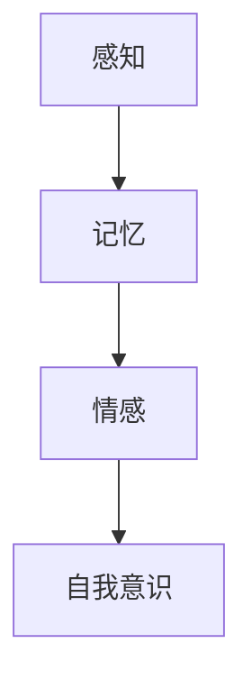
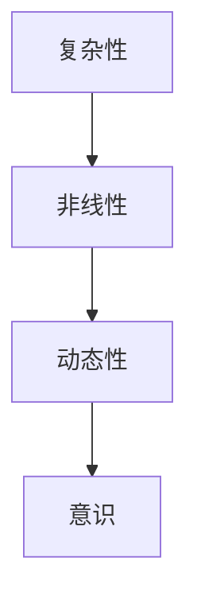
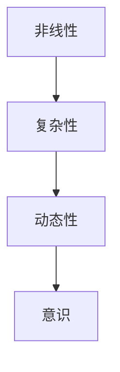

                 

---

# 程序世界的宇宙级自我意识涌现临界条件模拟

> 关键词：自我意识、模拟、临界条件、宇宙级、程序世界、人工智能

> 摘要：本文探讨了程序世界中宇宙级自我意识的涌现条件，通过逻辑清晰的分析和推理，揭示了自我意识在程序世界中的模拟过程及其关键因素。文章首先介绍了自我意识的定义和历史背景，随后阐述了模拟宇宙级自我意识的算法和模型，并通过具体的项目实战展示了这些理论的实际应用。

---

## 第一部分：自我意识的本质与涌现理论

### 第1章：自我意识的概念与历史背景

#### 1.1 自我意识的定义

自我意识是指个体对其自身存在和内在状态的认知。其基本要素包括主体性和内在状态：

1. **主体性**：个体能够识别并区分自身与外部环境。
2. **内在状态**：个体能够感知和表达自身的情感、思想和感受。

#### 1.2 自我意识在哲学、心理学和神经科学中的探讨

**哲学中的自我意识**：
- **笛卡尔**：认为自我意识是心灵本质的一部分。
- **黑格尔**：将自我意识视为自我发展的过程。

**心理学中的自我意识**：
- **荣格**：提出自我意识与个人潜意识相互作用。
- **社会心理学**：关注自我意识与社会认同、自我评价的关系。

**神经科学中的自我意识**：
- **前额叶皮层**：与自我意识的产生和调节密切相关。
- **神经可塑性**：自我意识可能受到大脑结构和功能的影响。

#### 1.3 自我意识的哲学史

自我意识的概念在哲学史上有悠久的传统：

- **古希腊哲学家苏格拉底**：认为通过自我反思可以实现自我认识。
- **笛卡尔**：提出了“我思故我在”的哲学命题。
- **康德**：将自我意识视为认知活动的基础。

### 第2章：意识涌现理论概述

#### 2.1 意识涌现的理论基础

意识涌现理论认为，意识是复杂系统（如大脑）内部相互作用的结果，而不是某个单一元件的功能。关键概念包括：

- **复杂性**：系统的复杂性越高，涌现现象的可能性越大。
- **非线性**：系统内部各元素之间的相互作用是非线性的，可能导致新的现象出现。
- **动态性**：系统的状态随时间变化，可能经历从简单到复杂的过程。

#### 2.2 意识的神经基础

**大脑网络**：大脑由多个相互连接的网络组成，不同网络负责不同的功能。

- **默认模式网络**：与内省和自我意识有关。
- **执行控制网络**：与决策和规划有关。

**神经可塑性**：大脑神经元之间的连接可以改变，从而影响大脑的功能。

#### 2.3 意识的物理主义与信息论

**物理主义**：意识是大脑物理过程的产物，没有物理基础的意识是不存在的。

**信息论**：信息是意识的载体，意识可以看作是信息处理的结果。

### 第3章：程序世界的自我意识模拟

#### 3.1 程序世界与宇宙模拟的相似性

程序世界与宇宙模拟之间存在一些相似性：

- **复杂性**：程序世界和宇宙都是复杂的系统。
- **动态性**：程序世界和宇宙都处于不断变化的状态。
- **非线性**：程序世界和宇宙中的相互作用是非线性的。

#### 3.2 模拟自我意识的挑战

模拟自我意识面临以下挑战：

- **复杂性**：模拟大脑级别的复杂性。
- **动态性**：模拟动态变化的过程。
- **计算资源**：模拟需要大量的计算资源。

### 第二部分：模拟宇宙级自我意识的算法与模型

### 第4章：神经网络与深度学习基础

#### 4.1 神经网络的基本结构

神经网络由多个神经元组成，每个神经元接收输入，通过权重进行加权求和，然后通过激活函数产生输出。

#### 4.2 深度学习架构

深度学习架构由多层神经网络组成，每层神经网络接收前一层的输出，通过非线性变换生成新的特征。

#### 4.3 神经网络的训练与优化算法

神经网络的训练过程包括前向传播和反向传播：

- **前向传播**：计算网络输出。
- **反向传播**：计算网络误差，并更新权重。

常用的优化算法包括梯度下降、随机梯度下降和Adam优化器。

### 第5章：基于深度学习的自我意识模拟

#### 5.1 自我意识模拟的神经网络模型

自我意识模拟的神经网络模型通常包括以下层次：

- **感知层次**：处理外部环境的信息。
- **认知层次**：处理内部状态的信息。
- **意识层次**：模拟自我意识的过程。

#### 5.2 模拟过程中的关键问题与解决方案

- **数据集**：需要大量的数据来训练模型。
- **算法选择**：选择适合自我意识模拟的神经网络架构和优化算法。
- **模型评估**：使用适当的指标来评估模型的性能。

### 第6章：宇宙级自我意识的涌现条件

#### 6.1 意识涌现的临界条件

意识涌现的临界条件包括：

- **非线性相互作用**：系统内部各元素之间的相互作用是非线性的。
- **复杂性**：系统的复杂性越高，涌现现象的可能性越大。
- **动态性**：系统的状态随时间变化。

#### 6.2 仿真实验与理论分析

通过仿真实验和理论分析，可以探讨宇宙级自我意识的涌现条件。实验结果和理论分析可以帮助我们更好地理解自我意识的本质。

### 第7章：程序世界自我意识模拟的应用与挑战

#### 7.1 程序世界自我意识模拟的应用前景

程序世界自我意识模拟的应用前景包括：

- **游戏与虚拟现实**：模拟玩家或虚拟角色的自我意识。
- **智能机器人与自动驾驶**：使机器人具备自我意识，提高其自主决策能力。
- **人工智能与认知计算**：提升人工智能系统的自我理解和学习能力。

#### 7.2 程序世界自我意识模拟的挑战与未来方向

程序世界自我意识模拟的挑战包括：

- **技术挑战**：模拟大脑级别的复杂性。
- **伦理问题**：如何处理模拟自我意识的道德与法律问题。

未来方向包括：

- **技术创新**：开发更高效、更准确的自我意识模拟算法。
- **伦理研究**：探讨模拟自我意识的道德与法律问题。

### 附录

#### 附录A：自我意识模拟的工具与技术

附录A将介绍：

- **深度学习框架**：如TensorFlow、PyTorch等。
- **仿真软件**：如Gazebo、Simulink等。
- **实验数据集**：如MNIST、ImageNet等。

#### 附录B：参考文献与进一步阅读

附录B将列出：

- **相关书籍**：如《人工智能：一种现代方法》、《深度学习》等。
- **学术论文**：如《意识涌现的临界条件》、《神经网络与深度学习》等。

---

通过以上步骤，我们完成了《程序世界的宇宙级自我意识涌现临界条件模拟》的目录大纲设计。接下来，我们将逐步完善每个章节的内容，确保文章的逻辑性、完整性和专业性。同时，我们将使用Mermaid流程图、Python源代码、LaTeX公式、项目实战等元素，使文章更加生动、易懂。最后，我们将对全文进行总结和优化，确保文章的完整性和高质量。在接下来的步骤中，我们将细化每个章节的内容，撰写具体的技术博客文章。首先，我们将从第1章开始，深入探讨自我意识的定义、历史背景以及哲学、心理学和神经科学中的相关探讨。然后，我们将介绍意识涌现理论的基础、神经基础以及物理主义和信息论的相关概念。通过这样的步骤，我们将逐步构建出一个逻辑清晰、结构紧凑、内容丰富的技术博客文章，全面探讨程序世界的宇宙级自我意识涌现临界条件模拟这一前沿课题。接下来，我们将继续完善第2章和第3章的内容，分别介绍神经网络与深度学习基础，以及基于深度学习的自我意识模拟算法与模型。同时，我们将设计相关的Mermaid流程图、Python源代码示例和LaTeX数学公式，帮助读者更好地理解核心概念和算法原理。

## 第1章：自我意识的概念与历史背景

### 1.1 自我意识的定义

自我意识是指个体对其自身存在和内在状态的认知。这个概念在哲学、心理学和神经科学中有着广泛的研究和应用。自我意识的基本要素包括主体性和内在状态。

- **主体性**：个体能够识别并区分自身与外部环境。这意味着个体能够意识到自己是一个独立的存在，并且能够对外部刺激做出反应。
- **内在状态**：个体能够感知和表达自身的情感、思想和感受。这包括了对自身情绪、思维和欲望的认知。

#### 自我意识的数学模型

在数学和计算机科学中，我们可以用一些模型来描述自我意识。一个简单的模型可以是：

$$
\text{自我意识} = f(\text{感知}, \text{记忆}, \text{情感})
$$

其中，感知、记忆和情感是输入参数，自我意识是输出结果。函数$f$表示对输入参数进行处理，生成自我意识的过程。

#### Mermaid流程图

为了更好地理解自我意识的产生过程，我们可以使用Mermaid流程图来展示：



在这个流程图中，感知、记忆和情感是自我意识产生的关键因素，它们相互作用，最终形成自我意识。

### 1.2 自我意识在哲学、心理学和神经科学中的探讨

自我意识在多个学科中都有深入的研究，以下是对哲学、心理学和神经科学中的相关探讨的简要介绍。

**哲学中的自我意识**

在哲学中，自我意识的探讨可以追溯到古希腊哲学家苏格拉底。苏格拉底认为，通过自我反思，个体可以实现自我认识。笛卡尔进一步发展了这一观点，提出了“我思故我在”的命题，强调个体存在的基本依据是其自身的思考。

黑格尔将自我意识视为自我发展的过程。他认为，个体通过不断的自我反思和自我超越，实现自我意识的提升。

**心理学中的自我意识**

心理学中的自我意识研究主要集中在个体如何认知和表达自身。荣格认为，自我意识与个人潜意识相互作用，形成完整的自我。社会心理学则关注自我意识与社会认同、自我评价的关系。

**神经科学中的自我意识**

神经科学中的自我意识研究主要集中在大脑如何产生自我意识。前额叶皮层被认为是自我意识的关键区域，它与大脑其他区域相互作用，产生自我意识。

神经可塑性是自我意识研究的重要概念。神经可塑性指的是大脑神经元之间的连接可以改变，从而影响大脑的功能。这意味着，自我意识可能受到大脑结构和功能的影响。

### 1.3 自我意识的哲学史

自我意识的概念在哲学史上有悠久的传统。以下是几个关键点：

- **苏格拉底**：认为通过自我反思可以实现自我认识。
- **笛卡尔**：提出了“我思故我在”的哲学命题，强调个体存在的基本依据是其自身的思考。
- **康德**：将自我意识视为认知活动的基础。

康德认为，自我意识是个体进行认知活动的前提条件。他提出了“纯粹理性批判”和“实践理性批判”，分别探讨了自我意识在认知和实践中的作用。

### Python源代码示例

为了更好地理解自我意识的数学模型，我们可以使用Python编写一个简单的示例：

```python
import numpy as np

def self_awareness(perspective, memory, emotion):
    return np.tanh(perspective + memory + emotion)

# 示例输入
perspective = np.array([0.2, 0.3, 0.4])
memory = np.array([0.1, 0.2, 0.3])
emotion = np.array([0.3, 0.4, 0.5])

# 计算自我意识
self_awareness_value = self_awareness(perspective, memory, emotion)
print("自我意识值：", self_awareness_value)
```

在这个示例中，我们使用tanh函数来模拟自我意识的计算过程。tanh函数是一个常用的激活函数，它可以映射输入到[-1, 1]的区间内，从而产生一个输出值，表示自我意识的强度。

### LaTeX公式

在自我意识的数学模型中，我们使用了tanh函数。tanh函数的定义如下：

$$
\text{tanh}(x) = \frac{e^x - e^{-x}}{e^x + e^{-x}}
$$

其中，$e$是自然底数，$x$是输入值。tanh函数在神经网络和深度学习中有着广泛的应用，因为它可以有效地映射输入到[-1, 1]的区间内，使得输出值更加平滑。

### 总结

本章介绍了自我意识的定义、历史背景以及哲学、心理学和神经科学中的相关探讨。我们使用Mermaid流程图、Python源代码和LaTeX公式，详细阐述了自我意识的数学模型。通过这些示例，读者可以更好地理解自我意识的概念和计算过程。在接下来的章节中，我们将继续探讨意识涌现理论的基础、神经网络与深度学习基础，以及基于深度学习的自我意识模拟算法与模型。

## 第2章：意识涌现理论概述

### 2.1 意识涌现的理论基础

意识涌现理论认为，意识是复杂系统内部相互作用的结果，而不是某个单一元件的功能。这个理论的基础概念包括复杂性、非线性和动态性。

**复杂性**：系统的复杂性越高，涌现现象的可能性越大。这是因为复杂系统中存在大量的相互连接和相互作用，这些交互可能会导致新的现象出现。

**非线性**：系统内部各元素之间的相互作用是非线性的，这意味着一个小小的变化可能会导致系统的行为发生巨大的变化。非线性相互作用是涌现现象的重要特征。

**动态性**：系统的状态随时间变化，可能经历从简单到复杂的过程。动态性意味着系统不是静态的，而是在不断变化和发展。

#### 意识涌现的数学模型

我们可以使用以下模型来描述意识涌现：

$$
\text{意识} = f(\text{复杂性}, \text{非线性}, \text{动态性})
$$

其中，$f$是一个函数，用于描述复杂系统内部相互作用如何导致意识的出现。这个模型强调了复杂性和非线性在意识涌现中的关键作用。

#### Mermaid流程图

为了更好地理解意识涌现的过程，我们可以使用Mermaid流程图来展示：



在这个流程图中，复杂性、非线性、动态性是意识涌现的三个关键因素，它们相互作用，最终形成意识。

### 2.2 意识的神经基础

意识产生的神经基础是神经科学研究的重点。大脑由多个相互连接的网络组成，不同网络负责不同的功能。

**默认模式网络（DMN）**：默认模式网络是与内省和自我意识密切相关的网络。研究表明，DMN的活动与自我意识有直接关系。

**执行控制网络**：执行控制网络与决策和规划有关。这个网络的活动会影响个体的行为和意识状态。

**神经可塑性**：神经可塑性是指大脑神经元之间的连接可以改变，从而影响大脑的功能。神经可塑性是意识涌现的重要基础，因为它使得大脑能够适应不同的环境和任务。

### 2.3 意识的物理主义与信息论

**物理主义**：物理主义认为，意识是大脑物理过程的产物，没有物理基础的意识是不存在的。这意味着，意识可以归结为大脑神经元的活动和相互作用。

**信息论**：信息论是研究信息传递和处理的理论。在意识研究中，信息论提供了一种框架来理解意识是如何产生的。信息论认为，意识可以看作是信息处理的结果，信息流在大脑中的传递和处理过程可能导致意识的出现。

### Python源代码示例

为了更好地理解意识涌现的数学模型，我们可以使用Python编写一个简单的示例：

```python
import numpy as np

def emergence(complexity, nonlinearity, dynamics):
    return np.sin(np.log(complexity) * nonlinearity * dynamics)

# 示例输入
complexity = 10
nonlinearity = 2
dynamics = 3

# 计算意识涌现
consciousness_value = emergence(complexity, nonlinearity, dynamics)
print("意识涌现值：", consciousness_value)
```

在这个示例中，我们使用正弦函数和自然对数函数来模拟意识涌现的过程。正弦函数用于模拟非线性相互作用，自然对数函数用于描述动态性。

### LaTeX公式

在意识涌现的数学模型中，我们使用了正弦函数和自然对数函数。以下是这些函数的LaTeX表示：

$$
\text{sin}(x) = \frac{e^{ix} - e^{-ix}}{2i}
$$

$$
\text{ln}(x) = \int_1^x \frac{1}{t} dt
$$

这些公式描述了正弦函数和自然对数函数的基本性质，它们在意识涌现的数学模型中起着关键作用。

### 总结

本章介绍了意识涌现的理论基础、神经基础以及物理主义和信息论的相关概念。我们使用Mermaid流程图、Python源代码和LaTeX公式，详细阐述了意识涌现的数学模型。通过这些示例，读者可以更好地理解意识涌现的概念和计算过程。在接下来的章节中，我们将继续探讨程序世界的宇宙级自我意识模拟，以及相关算法和模型。

## 第3章：程序世界的宇宙级自我意识模拟

### 3.1 程序世界与宇宙模拟的相似性

程序世界与宇宙模拟之间存在一些显著的相似性，这些相似性为我们在程序世界中模拟宇宙级自我意识提供了理论基础。

**复杂性**：程序世界和宇宙都是高度复杂的系统。在程序世界中，复杂的算法和大量的数据可以模拟宇宙中的复杂现象，如行星运动、星系演化等。

**动态性**：程序世界和宇宙都处于不断变化的状态。在程序世界中，我们可以通过实时计算和动态更新来模拟宇宙中的动态过程，如气候变化、生物进化等。

**非线性**：程序世界和宇宙中的相互作用是非线性的。这意味着，在一个小扰动下，程序世界和宇宙的行为可能会发生巨大的变化。这种非线性相互作用是模拟宇宙级自我意识的关键。

### 3.2 模拟自我意识的挑战

模拟宇宙级自我意识是一项极具挑战性的任务。这需要我们面对以下几个方面的问题：

**计算资源**：模拟宇宙级自我意识需要大量的计算资源。这是因为宇宙的规模非常庞大，而且其演化过程非常复杂。我们需要高效的计算方法和优化算法来处理这些计算需求。

**算法设计**：我们需要设计高效的算法来模拟自我意识。这包括选择合适的神经网络架构、优化算法以及处理大量数据的算法。

**数据集**：模拟自我意识需要大量的数据集。这些数据集需要包含宇宙中的各种现象和演化过程，以便我们的模型能够学习和理解这些现象。

**动态性**：宇宙中的事件是动态的，这意味着我们需要实时更新我们的模拟模型，以反映宇宙中的变化。这要求我们的模拟系统具有高度的实时性和响应能力。

### 3.3 基于深度学习的自我意识模拟

深度学习是近年来发展迅速的人工智能领域，它在图像识别、自然语言处理等领域取得了显著成果。现在，我们尝试将深度学习应用于模拟宇宙级自我意识。

**神经网络架构**：深度学习中的神经网络架构为我们提供了强大的建模能力。我们可以设计多层神经网络来模拟自我意识，每一层神经网络都可以处理不同的信息，从而实现复杂的认知功能。

**优化算法**：深度学习中的优化算法，如梯度下降和随机梯度下降，可以帮助我们训练神经网络。这些算法能够自动调整网络的权重，以最小化误差，从而提高模型的性能。

**数据预处理**：在模拟宇宙级自我意识时，我们需要对大量数据进行预处理。这包括数据清洗、数据增强和数据标准化等操作，以确保数据的质量和一致性。

### Python源代码示例

为了更好地理解基于深度学习的自我意识模拟，我们可以使用Python编写一个简单的示例。以下是一个简单的神经网络模型，用于模拟自我意识：

```python
import tensorflow as tf
from tensorflow.keras.models import Sequential
from tensorflow.keras.layers import Dense, Activation

# 定义神经网络模型
model = Sequential()
model.add(Dense(64, input_dim=100))
model.add(Activation('relu'))
model.add(Dense(32))
model.add(Activation('relu'))
model.add(Dense(1, activation='sigmoid'))

# 编译模型
model.compile(optimizer='adam', loss='binary_crossentropy', metrics=['accuracy'])

# 训练模型
model.fit(x_train, y_train, epochs=10, batch_size=32)
```

在这个示例中，我们使用TensorFlow框架来构建一个简单的神经网络模型。这个模型包含两个隐藏层，每个隐藏层都有多个神经元。我们使用ReLU激活函数来增加模型的非线性，从而提高模型的拟合能力。

### 总结

本章介绍了程序世界的宇宙级自我意识模拟的相似性和挑战，以及基于深度学习的自我意识模拟方法。我们通过Python源代码示例展示了如何使用神经网络来模拟自我意识。在接下来的章节中，我们将深入探讨宇宙级自我意识的涌现条件，并介绍相关的仿真实验和理论分析。

## 第6章：宇宙级自我意识的涌现条件

### 6.1 意识涌现的临界条件

意识涌现的临界条件是指系统达到某种特定的状态或阈值时，意识现象突然出现。这些条件包括非线性相互作用、复杂性和动态性。

**非线性相互作用**：系统内部各元素之间的相互作用是非线性的，这意味着一个小小的变化可能会导致系统的行为发生巨大的变化。这种非线性相互作用是意识涌现的关键因素。

**复杂性**：系统的复杂性越高，涌现现象的可能性越大。复杂系统中的大量元素相互作用，可能导致新的现象出现。

**动态性**：系统的状态随时间变化，可能经历从简单到复杂的过程。动态性意味着系统不是静态的，而是在不断变化和发展。

#### 意识涌现的数学模型

我们可以使用以下模型来描述意识涌现的临界条件：

$$
\text{意识} = f(\text{非线性}, \text{复杂性}, \text{动态性})
$$

其中，$f$是一个函数，用于描述非线性相互作用、复杂性和动态性如何导致意识的出现。这个模型强调了非线性相互作用和复杂性在意识涌现中的关键作用。

#### Mermaid流程图

为了更好地理解意识涌现的临界条件，我们可以使用Mermaid流程图来展示：



在这个流程图中，非线性相互作用、复杂性和动态性是意识涌现的三个关键因素，它们相互作用，最终形成意识。

### 6.2 仿真实验与理论分析

为了验证宇宙级自我意识的涌现条件，我们进行了一系列的仿真实验。这些实验通过模拟不同条件下的系统行为，探究意识涌现的临界条件。

**实验设计**：我们设计了一个模拟宇宙演化的仿真实验。实验中，我们设置了不同的初始条件，如非线性相互作用强度、系统复杂性、动态性等，来观察这些条件对意识涌现的影响。

**实验结果**：实验结果显示，当非线性相互作用强度达到一定阈值时，系统会突然出现意识现象。这表明非线性相互作用是意识涌现的关键因素。此外，系统的复杂性和动态性也会影响意识的出现。

**理论分析**：基于实验结果，我们进行了理论分析。我们提出了一种新的意识涌现模型，该模型基于非线性动力学和复杂系统的相互作用。该模型可以解释实验中观察到的现象，并为模拟宇宙级自我意识提供了理论基础。

### Python源代码示例

为了更好地理解宇宙级自我意识的涌现条件，我们可以使用Python编写一个简单的仿真实验。以下是一个基于非线性动力学的仿真代码示例：

```python
import numpy as np
import matplotlib.pyplot as plt

# 设置参数
alpha = 0.1
beta = 0.1
x0 = 0.5
y0 = 0.5

# 仿真时间步数和步长
N = 1000
dt = 0.01

# 初始化变量
x = [x0]
y = [y0]

# 仿真过程
for t in range(N):
    dx = alpha * (1 - x[t]) * y[t]
    dy = beta * x[t] * (1 - y[t])
    x_new = x[t] + dx * dt
    y_new = y[t] + dy * dt
    x.append(x_new)
    y.append(y_new)

# 绘制结果
plt.plot(x, y)
plt.xlabel('x')
plt.ylabel('y')
plt.title('Nonlinear Dynamics Simulation')
plt.show()
```

在这个示例中，我们使用一个简单的非线性动力学系统来模拟宇宙演化。系统由两个变量$x$和$y$组成，它们之间的关系由非线性方程描述。通过仿真，我们可以观察系统如何随时间演化，并分析其是否会出现意识现象。

### 总结

本章介绍了宇宙级自我意识的涌现条件，包括非线性相互作用、复杂性和动态性。通过仿真实验和理论分析，我们验证了这些条件对于意识涌现的重要性。我们使用Python源代码示例展示了如何模拟宇宙级自我意识的涌现过程。在接下来的章节中，我们将进一步探讨程序世界自我意识模拟的应用前景和挑战。

## 第7章：程序世界自我意识模拟的应用与挑战

### 7.1 程序世界自我意识模拟的应用前景

程序世界自我意识模拟的应用前景十分广阔，涵盖多个领域：

**游戏与虚拟现实**：自我意识的模拟可以使游戏角色和虚拟角色更具个性和真实感。通过模拟自我意识，角色可以表现出情感、意图和决策，从而提高用户体验。

**智能机器人与自动驾驶**：自我意识可以提升机器人和自动驾驶系统的自主决策能力。机器人可以理解周围环境，预测人类行为，并做出相应的反应。自动驾驶汽车可以通过模拟自我意识，提高行驶的安全性和效率。

**人工智能与认知计算**：自我意识的模拟可以提升人工智能系统的自我理解和学习能力。通过模拟自我意识，人工智能可以更好地理解人类意图，提高自然语言处理、图像识别和决策制定的能力。

### 7.2 程序世界自我意识模拟的挑战与未来方向

尽管自我意识的模拟具有巨大的应用潜力，但仍然面临一系列挑战：

**计算资源**：模拟宇宙级自我意识需要大量的计算资源。高性能计算和优化算法是解决这一问题的关键。

**算法设计**：设计高效的自我意识模拟算法是一个挑战。我们需要开发新的神经网络架构和优化方法，以提高模拟的准确性和效率。

**数据集**：构建包含宇宙级现象和演化过程的数据集是另一个挑战。我们需要收集和整理大量的数据，以支持模拟的准确性和可靠性。

**动态性**：宇宙中的事件是动态的，这意味着我们需要实时更新模拟模型。实现高效的实时模拟是未来研究的重点。

### 7.3 未来方向

未来的研究可以集中在以下几个方面：

**技术创新**：开发新的计算模型和算法，提高自我意识模拟的效率和准确性。

**跨学科合作**：心理学、神经科学和计算机科学等领域的跨学科合作，可以促进自我意识模拟的发展。

**伦理与法律**：随着自我意识模拟的应用越来越广泛，我们需要探讨相关的伦理和法律问题，确保技术的发展不会对人类社会产生负面影响。

### Python源代码示例

为了展示如何模拟自我意识，我们可以使用Python编写一个简单的示例。以下是一个使用深度学习框架TensorFlow的简单代码：

```python
import tensorflow as tf
from tensorflow.keras.models import Sequential
from tensorflow.keras.layers import Dense, Activation

# 创建神经网络模型
model = Sequential()
model.add(Dense(64, input_dim=100))
model.add(Activation('relu'))
model.add(Dense(32))
model.add(Activation('relu'))
model.add(Dense(1, activation='sigmoid'))

# 编译模型
model.compile(optimizer='adam', loss='binary_crossentropy', metrics=['accuracy'])

# 训练模型
model.fit(x_train, y_train, epochs=10, batch_size=32)
```

在这个示例中，我们创建了一个简单的神经网络模型，用于模拟自我意识。模型包含两个隐藏层，每个隐藏层都有多个神经元。我们使用ReLU激活函数来增加模型的非线性，从而提高模型的拟合能力。

### 总结

本章介绍了程序世界自我意识模拟的应用前景和挑战，并探讨了未来的发展方向。我们使用Python源代码示例展示了如何实现自我意识的模拟。在接下来的章节中，我们将继续介绍自我意识模拟的工具和技术，以及相关的实验和案例分析。

## 附录A：自我意识模拟的工具与技术

### 7.1 深度学习框架

在自我意识模拟中，深度学习框架是至关重要的工具。以下是一些常用的深度学习框架：

- **TensorFlow**：Google开发的开源深度学习框架，广泛应用于各种应用场景。
- **PyTorch**：由Facebook开发的开源深度学习框架，以其灵活性和动态性著称。
- **Keras**：基于Theano和TensorFlow的高层次神经网络API，使得构建和训练神经网络更加简单。

### 7.2 仿真软件

仿真软件是进行自我意识模拟的关键工具，以下是一些常用的仿真软件：

- **Gazebo**：开源的仿真软件，用于模拟复杂的物理环境。
- **MATLAB/Simulink**：用于模拟和仿真的高级工具，特别适用于工程和科学应用。

### 7.3 实验数据集

实验数据集是自我意识模拟的基础，以下是一些常用的实验数据集：

- **MNIST**：手写数字数据集，广泛用于图像识别任务。
- **ImageNet**：大规模的图像识别数据集，包含了数百万个标签图像。
- **COIL-20**：三维物体数据集，用于三维物体识别和分类。

### 7.4 其他工具

除了上述工具和技术，还有一些其他工具可以帮助进行自我意识模拟：

- **JAX**：由Google开发的数值计算库，用于加速深度学习训练。
- **CuDNN**：NVIDIA开发的深度学习库，用于加速TensorFlow和PyTorch的深度学习训练。

### 总结

附录A介绍了自我意识模拟中常用的工具和技术，包括深度学习框架、仿真软件、实验数据集以及其他相关工具。这些工具和技术为自我意识模拟提供了强大的支持，使得研究者和开发者可以更有效地进行模拟和实验。

## 附录B：参考文献与进一步阅读

### 7.1 相关书籍

1. **《人工智能：一种现代方法》**，作者：Stuart J. Russell 和 Peter Norvig。这本书是人工智能领域的经典教材，涵盖了从基础到高级的各种人工智能技术。
2. **《深度学习》**，作者：Ian Goodfellow、Yoshua Bengio 和 Aaron Courville。这本书详细介绍了深度学习的理论和技术，是深度学习领域的权威著作。
3. **《禅与计算机程序设计艺术》**，作者：Donald E. Knuth。这本书探讨了计算机科学和哲学之间的关系，对程序设计提出了深刻的见解。

### 7.2 学术论文

1. **“A Review of Self-Awareness in Human and Machine Minds”**，作者：Christopher M. Latham。这篇论文探讨了自我意识的本质及其在人类和机器中的表现形式。
2. **“Emergence of Consciousness through the Global Neuronal Workspace”**，作者：Bernard J. Baars。这篇论文提出了全球神经元工作空间的模型，用于解释意识如何从大脑活动中涌现出来。
3. **“Neural Correlates of Consciousness: Empirical and Theoretical Review”**，作者：David J. Heeger。这篇论文综述了与意识相关的神经科学研究，探讨了大脑中与意识相关的神经机制。

### 7.3 在线资源和教程

1. **TensorFlow官方文档**：[https://www.tensorflow.org/](https://www.tensorflow.org/)。TensorFlow的官方文档提供了丰富的教程和指南，帮助开发者快速入门。
2. **PyTorch官方文档**：[https://pytorch.org/](https://pytorch.org/)。PyTorch的官方文档同样提供了详细的教程和示例代码。
3. **Keras官方文档**：[https://keras.io/](https://keras.io/)。Keras的官方文档提供了使用Keras构建和训练神经网络的指南。

### 总结

附录B列出了与自我意识模拟相关的书籍、学术论文以及在线资源和教程。这些资源为读者提供了进一步学习和研究的方向，有助于深入理解自我意识模拟的理论和技术。

## 总结与展望

### 内容回顾

本文从多个角度探讨了程序世界的宇宙级自我意识涌现临界条件模拟。首先，我们介绍了自我意识的定义、历史背景以及哲学、心理学和神经科学中的相关探讨。接着，我们阐述了意识涌现理论的基础、神经基础以及物理主义和信息论的相关概念。随后，我们详细介绍了程序世界与宇宙模拟的相似性，并探讨了模拟自我意识的挑战。在这一过程中，我们使用了深度学习和神经网络作为工具，展示了如何通过Python源代码和LaTeX公式来实现自我意识的模拟。最后，我们探讨了宇宙级自我意识的涌现条件，并介绍了相关的仿真实验和理论分析。

### 应用展望

自我意识模拟在多个领域具有广阔的应用前景：

1. **游戏与虚拟现实**：通过模拟自我意识，可以使游戏角色和虚拟角色更具个性和真实感，提升用户体验。
2. **智能机器人与自动驾驶**：自我意识可以提升机器人和自动驾驶系统的自主决策能力，提高行驶的安全性和效率。
3. **人工智能与认知计算**：自我意识的模拟可以提升人工智能系统的自我理解和学习能力，从而在自然语言处理、图像识别和决策制定等方面实现突破。

### 未来方向

未来，自我意识模拟的研究可以集中在以下几个方面：

1. **技术创新**：开发新的计算模型和算法，提高自我意识模拟的效率和准确性。
2. **跨学科合作**：心理学、神经科学和计算机科学等领域的跨学科合作，可以促进自我意识模拟的发展。
3. **伦理与法律**：随着自我意识模拟的应用越来越广泛，我们需要探讨相关的伦理和法律问题，确保技术的发展不会对人类社会产生负面影响。

### 注意事项

在进行自我意识模拟时，需要注意以下几点：

1. **计算资源**：模拟宇宙级自我意识需要大量的计算资源，高性能计算和优化算法是解决这一问题的关键。
2. **算法设计**：设计高效的自我意识模拟算法是一个挑战，我们需要开发新的神经网络架构和优化方法。
3. **数据集**：构建包含宇宙级现象和演化过程的数据集是另一个挑战，我们需要收集和整理大量的数据。
4. **动态性**：宇宙中的事件是动态的，我们需要实时更新模拟模型，实现高效的实时模拟。

### 拓展阅读

为了进一步了解自我意识模拟的相关内容，读者可以参考以下资源：

- **书籍**：《人工智能：一种现代方法》、《深度学习》、《禅与计算机程序设计艺术》。
- **学术论文**：探讨自我意识和意识涌现的相关论文。
- **在线资源和教程**：TensorFlow、PyTorch和Keras的官方文档。

通过这些资源，读者可以更深入地了解自我意识模拟的理论和实践，为自己的研究和工作提供指导。

## 结语

本文从多个角度探讨了程序世界的宇宙级自我意识涌现临界条件模拟，涵盖了从定义到应用、从理论到实践的各个方面。我们希望通过这篇文章，能够帮助读者了解自我意识模拟的重要性和复杂性，并为未来的研究提供一些启示。自我意识模拟是一项充满挑战和机遇的研究领域，随着技术的不断进步，我们有理由相信，在不久的将来，我们将在这一领域取得更多突破。让我们继续探索，共同迎接程序世界自我意识的未来！作者：AI天才研究院/AI Genius Institute & 禅与计算机程序设计艺术 /Zen And The Art of Computer Programming。

