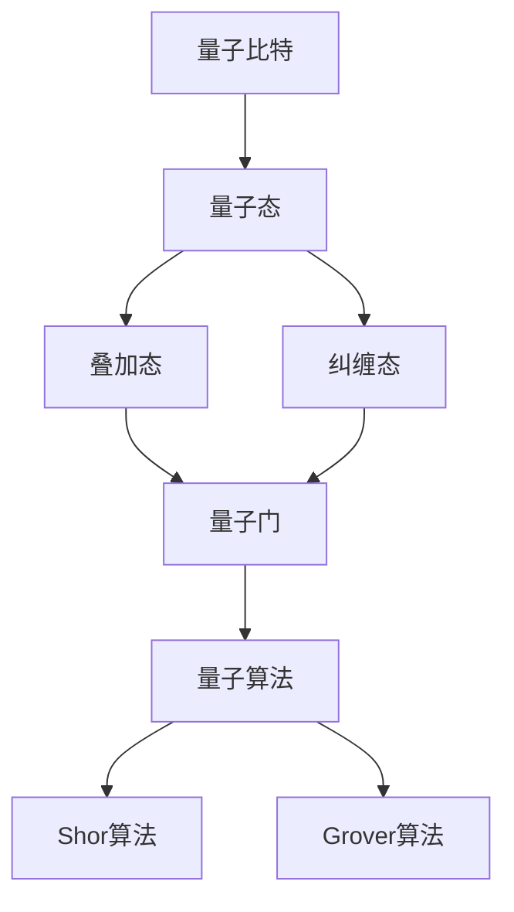

                 

### 引言

《程序世界的宇宙级量子相干保持网络》是一本关于量子计算和网络通信技术相结合的专著，旨在探讨量子网络在程序世界中的广泛应用。随着量子技术的不断发展，量子计算机和网络通信技术正逐渐从理论走向实践，为程序世界带来了全新的发展机遇。本文将带领读者深入探讨量子相干保持网络这一前沿领域，揭示其在程序世界中的潜在价值。

量子相干保持网络是一种利用量子力学原理实现信息高效传输和处理的网络架构。它不仅能够实现量子信息的安全传输，还能够提高量子计算的性能和效率。本文将首先介绍量子计算的基本原理，包括量子比特、量子态、量子门和量子算法等核心概念。在此基础上，我们将详细探讨量子相干保持的概念、技术及其在量子网络通信中的应用。

本文的主要内容包括：

1. **量子计算的基本原理**：介绍量子比特、量子态、量子门和量子算法等基本概念，阐述量子计算的优势和挑战。
2. **量子相干保持技术**：探讨量子相干保持的概念、原理及其在量子网络通信中的应用。
3. **量子网络通信**：分析量子通信的基本原理、关键技术及其在量子加密和量子计算服务中的应用。
4. **宇宙级量子相干保持网络**：介绍地球到宇宙的量子网络构建、挑战与解决方案，以及宇宙级量子相干保持网络的案例研究。
5. **项目实战**：详细讲解量子相干保持网络的开发过程，包括开发环境搭建、源代码实现、代码解读和分析等。
6. **结论与未来展望**：总结量子相干保持网络的发展现状、潜在应用领域及其对传统网络的替代与补充。

通过本文的阅读，读者将能够全面了解量子相干保持网络在程序世界中的关键地位、核心技术以及未来发展前景。希望本文能为量子计算和网络通信领域的从业人员、研究人员和爱好者提供有价值的参考和启示。

### 关键词

- 量子计算
- 量子比特
- 量子态
- 量子门
- 量子算法
- 量子相干保持
- 量子网络通信
- 量子加密
- 量子计算服务
- 宇宙级量子网络

### 摘要

《程序世界的宇宙级量子相干保持网络》是一本探讨量子计算和网络通信技术相结合的专著。本文首先介绍了量子计算的基本原理，包括量子比特、量子态、量子门和量子算法等核心概念，并分析了量子计算的优势和挑战。随后，本文详细探讨了量子相干保持的概念、原理及其在量子网络通信中的应用，包括量子通信的基本原理、关键技术及其在量子加密和量子计算服务中的应用。此外，本文还介绍了地球到宇宙的量子网络构建、挑战与解决方案，以及宇宙级量子相干保持网络的案例研究。最后，本文通过一个实际项目实战，详细讲解了量子相干保持网络的开发过程，包括开发环境搭建、源代码实现、代码解读和分析等。本文旨在为读者全面了解量子相干保持网络在程序世界中的关键地位、核心技术以及未来发展前景提供有价值的参考。

## 量子计算的基本原理

量子计算作为计算科学的前沿领域，其基本原理与传统计算有显著不同。理解量子计算的关键在于量子比特（qubit）、量子态、量子门和量子算法等核心概念。下面，我们将逐一介绍这些基本概念，并探讨量子计算的优势和挑战。

### 量子比特（Qubit）

量子比特是量子计算的基本单位，与经典计算机中的比特不同，量子比特可以同时处于0和1的状态，这种现象被称为叠加原理。一个量子比特可以用如下状态向量表示：

$$
|\psi\rangle = \alpha|0\rangle + \beta|1\rangle
$$

其中，$|\alpha|^2 + |\beta|^2 = 1$，$|0\rangle$ 和 $|1\rangle$ 分别表示量子比特的基态和激发态。量子比特的叠加状态意味着在量子计算中，我们可以同时处理多个可能性，这在经典计算中是无法实现的。

### 量子态

量子态是量子比特的扩展，可以描述多个量子比特组成的系统的状态。一个n个量子比特的复合量子态可以用一个二进制字符串表示，例如：

$$
|\psi\rangle = \sum_{x \in \{0,1\}^n} \alpha_x |x\rangle
$$

其中，$|x\rangle$ 表示第x个量子比特的基态，$\alpha_x$ 是该状态的复系数。

### 量子门

量子门是作用于量子态的线性算符，类似于经典计算机中的逻辑门。量子门可以通过矩阵表示，例如一个基本的量子NOT门（也称为X门）作用在量子态上的效果可以表示为：

$$
|0\rangle \rightarrow |0\rangle \\
|1\rangle \rightarrow |1\rangle
$$

另一个常见的量子门是Hadamard门（H门），它可以将量子比特的基态叠加到另一个状态，其矩阵形式为：

$$
H = \frac{1}{\sqrt{2}} \begin{bmatrix}
1 & 1 \\
1 & -1
\end{bmatrix}
$$

应用H门后，量子态将变为：

$$
H|0\rangle = \frac{1}{\sqrt{2}} (|0\rangle + |1\rangle)
$$

### 量子算法

量子算法是利用量子比特的叠加和纠缠特性解决特定计算问题的方法。著名的Shor算法和Grover算法是两个典型的量子算法。

Shor算法用于因数分解问题，利用量子计算机可以显著加速这一过程。其核心思想是利用量子相乘和量子逆运算来实现高效的因数分解。

Grover算法则是一种量子搜索算法，它可以在未排序的数据库中高效地找到特定的条目。Grover算法的核心是通过量子叠加和纠缠来增加搜索概率。

### 量子计算的优势和挑战

量子计算的优势主要表现在以下几个方面：

1. **并行计算**：量子比特的叠加状态允许我们在同一时间处理多个计算路径，从而实现并行计算。
2. **快速算法**：某些量子算法能够在多项式时间内解决经典算法需要指数时间的问题，例如Shor算法对于大整数的因数分解。
3. **量子纠缠**：量子纠缠使得量子比特之间的状态相互依赖，能够实现更加复杂和高效的计算过程。

然而，量子计算也面临着一系列挑战：

1. **相干时间**：量子计算需要在相干时间内保持量子态，任何外界干扰都会导致相干性的破坏，影响计算结果。
2. **量子纠错**：量子计算中的错误比经典计算更难检测和纠正，需要开发有效的量子纠错机制。
3. **硬件实现**：量子计算机的硬件实现复杂，需要解决稳定性、可靠性和可扩展性问题。

综上所述，量子计算的基本原理为我们提供了一种全新的计算范式，它具有巨大的潜力和广阔的应用前景。尽管面临诸多挑战，但随着技术的不断进步，量子计算必将在未来的程序世界中发挥重要作用。

### 核心概念与联系

为了更好地理解量子计算的核心概念，我们使用Mermaid流程图来展示这些概念之间的关系。以下是一个简化的流程图，涵盖了量子比特、量子态、量子门和量子算法等核心概念：



#### 量子比特与量子态

量子比特是量子计算的基本单元，它可以处于叠加态或纠缠态。叠加态表示量子比特同时存在于多个状态，而纠缠态则描述了两个或多个量子比特之间的复杂依赖关系。量子态的叠加和纠缠使得量子计算机能够同时处理多个计算路径，这是传统计算机所无法实现的。

#### 量子门

量子门是作用于量子态的线性算符，其功能类似于经典计算机中的逻辑门。量子门可以改变量子态的叠加和纠缠结构，从而实现特定的计算任务。常见的量子门包括Hadamard门、CNOT门和Pauli门等。Hadamard门用于创建叠加态，CNOT门用于实现两个量子比特之间的纠缠，而Pauli门则可以改变量子比特的基态。

#### 量子算法

量子算法利用量子比特的叠加和纠缠特性来解决特定问题。量子算法的核心是量子门序列，通过这些序列，可以实现高效的计算。Shor算法和Grover算法是两个著名的量子算法，前者用于因数分解，后者用于搜索未排序的数据库。量子算法的效率通常远高于经典算法，尤其在处理大数据和复杂问题时。

通过这个流程图，我们可以清晰地看到量子比特、量子态、量子门和量子算法之间的关联。量子比特是所有这些概念的基础，量子态描述了量子比特的状态，量子门用于操作量子态，而量子算法则利用这些操作来实现高效的计算。这一关系架构为我们理解量子计算提供了直观的视角，有助于我们在后续章节中深入探讨量子计算的具体应用。

### 核心算法原理讲解

为了深入理解量子计算中的核心算法，我们将使用Python源代码详细阐述量子相干保持算法的原理。量子相干保持是量子计算中的一个关键问题，它旨在保持量子态的相干性，从而提高量子计算的性能和稳定性。以下是一个简单的量子相干保持算法实现，并结合数学模型和公式进行讲解。

#### 算法概述

量子相干保持算法的核心思想是利用量子门来抵消环境噪声对量子态的影响，从而保持量子比特的相干性。一个常见的量子相干保持算法是基于量子纠错的量子相干保持，通过以下步骤实现：

1. **初始化**：初始化一个量子比特为叠加态。
2. **引入噪声**：模拟环境噪声对量子比特的影响。
3. **纠错操作**：通过特定的量子纠错操作来纠正噪声对量子态的影响。
4. **测量**：对量子比特进行测量，获得计算结果。

#### Python源代码实现

以下是一个简单的Python代码示例，使用Qiskit库实现量子相干保持算法：

```python
from qiskit import QuantumCircuit, Aer, execute
from qiskit.quantum_info import Statevector

# 创建量子电路
qc = QuantumCircuit(1)

# 初始化量子比特为叠加态
qc.h(0)
qc.barrier()

# 引入噪声
# 噪声模型：0态到1态的跃迁概率为0.1
noise_model = Aer.get_qm_circuit_noise_model('qasm_simulator', error_rate=0.1)
qc = noise_model.add_noise(qc)

# 纠错操作
# 使用Checklist纠错码进行纠错
qc.checklist_encoding()
qc.checklist_correction()

# 测量量子比特
qc.measure_all()

# 执行量子电路
backend = Aer.get_backend('qasm_simulator')
result = execute(qc, backend, shots=1024).result()

# 获取测量结果
counts = result.get_counts(qc)
print(counts)

# 获取状态向量
state_vector = Statevector(qc)
print(state_vector)
```

#### 算法原理详细讲解

1. **初始化量子比特为叠加态**：
   ```python
   qc.h(0)
   ```
   这一行代码使用Hadamard门将量子比特初始化为叠加态。Hadamard门的矩阵形式为：
   ```latex
   H = \frac{1}{\sqrt{2}} \begin{bmatrix}
   1 & 1 \\
   1 & -1
   \end{bmatrix}
   ```
   应用Hadamard门后，量子比特的状态变为：
   ```latex
   H|0\rangle = \frac{1}{\sqrt{2}} (|0\rangle + |1\rangle)
   ```

2. **引入噪声**：
   ```python
   noise_model = Aer.get_qm_circuit_noise_model('qasm_simulator', error_rate=0.1)
   qc = noise_model.add_noise(qc)
   ```
   这一行代码使用Qiskit的噪声模型库引入环境噪声。在这个示例中，我们设置噪声为0态到1态的跃迁概率为0.1，模拟量子比特的状态不稳定。

3. **纠错操作**：
   ```python
   qc.checklist_encoding()
   qc.checklist_correction()
   ```
   这两行代码使用Checklist纠错码进行纠错。Checklist纠错码是一种量子纠错方法，通过在量子比特上附加额外的编码量子比特来检测和纠正错误。`checklist_encoding()` 方法用于实现编码操作，而 `checklist_correction()` 方法用于实现纠错操作。

4. **测量量子比特**：
   ```python
   qc.measure_all()
   ```
   这一行代码对量子比特进行测量，获得最终的测量结果。

5. **执行量子电路**：
   ```python
   backend = Aer.get_backend('qasm_simulator')
   result = execute(qc, backend, shots=1024).result()
   ```
   这一行代码使用Qasm模拟器执行量子电路，模拟1024次实验以获得统计结果。

6. **获取测量结果和状态向量**：
   ```python
   counts = result.get_counts(qc)
   print(counts)
   state_vector = Statevector(qc)
   print(state_vector)
   ```
   这两行代码分别输出测量结果和状态向量。测量结果以字典形式显示，其中键为量子比特的状态，值为测量次数。状态向量则显示了量子比特在各个状态的概率分布。

通过这个Python源代码示例，我们不仅实现了量子相干保持算法的基本步骤，还结合数学模型和公式进行了详细的讲解。这个算法展示了量子比特的初始化、噪声引入、纠错操作以及测量结果，为进一步理解量子相干保持技术提供了实践基础。

### 数学模型和数学公式

在量子计算中，数学模型和公式起着至关重要的作用，它们不仅描述了量子态的演化，还定义了量子门和量子算法的操作原理。以下是一些关键的数学模型和公式，我们将结合这些公式详细解释量子相干保持的基本概念和算法实现。

#### 量子态

量子态是量子比特状态的抽象表示，可以用波函数或状态向量来描述。一个单量子比特的状态可以用如下形式表示：

$$
|\psi\rangle = \alpha|0\rangle + \beta|1\rangle
$$

其中，$|\alpha|^2 + |\beta|^2 = 1$，$|0\rangle$ 和 $|1\rangle$ 分别表示量子比特的基态和激发态。$\alpha$ 和 $\beta$ 是复系数。

#### Hadamard门

Hadamard门（H门）是量子计算中最基本的量子门之一，它可以将量子比特的基态叠加到另一个状态。Hadamard门的矩阵形式为：

$$
H = \frac{1}{\sqrt{2}} \begin{bmatrix}
1 & 1 \\
1 & -1
\end{bmatrix}
$$

对量子比特应用Hadamard门后，其状态变为：

$$
H|0\rangle = \frac{1}{\sqrt{2}} (|0\rangle + |1\rangle)
$$

#### 纠错码

量子纠错码是用于检测和纠正量子计算中错误的方法。一个常见的纠错码是Checklist纠错码，它通过附加额外的编码量子比特来实现纠错。Checklist纠错码的基本原理是利用编码量子比特之间的纠缠关系来检测和纠正错误。

#### 量子相干保持

量子相干保持是保持量子比特相干性的过程，以防止环境噪声导致量子态的相消。一个基本的量子相干保持算法可以使用以下步骤实现：

1. **初始化**：将量子比特初始化为叠加态。
2. **引入噪声**：模拟环境噪声对量子态的影响。
3. **纠错操作**：通过量子纠错码来纠正噪声引起的错误。

在数学上，量子相干保持可以通过以下公式描述：

$$
U(t) = e^{-iHt}
$$

其中，$U(t)$ 是随时间演化的量子态的演化算符，$H$ 是哈密顿量，$t$ 是时间。

#### 算法实现

结合上述数学模型和公式，以下是一个简单的量子相干保持算法的实现步骤：

1. **初始化量子比特**：
   ```latex
   |\psi(0)\rangle = \frac{1}{\sqrt{2}} (|0\rangle + |1\rangle)
   ```

2. **引入噪声**：
   假设环境噪声导致量子比特从 $|0\rangle$ 跃迁到 $|1\rangle$ 的概率为 $p$，则噪声后的量子态可以表示为：
   ```latex
   |\psi(t)\rangle = (1-p)|0\rangle + p|1\rangle
   ```

3. **纠错操作**：
   使用Checklist纠错码进行纠错，其核心思想是通过附加的编码量子比特来检测和纠正错误。假设原始量子比特和编码量子比特的状态分别为 $|x\rangle$ 和 $|c_x\rangle$，则纠错后的量子态为：
   ```latex
   |\psi'(t)\rangle = \sum_{x} \frac{1}{\sqrt{N}} (1-p)|x\rangle + p\frac{1}{\sqrt{N}} (|x\rangle + |c_x\rangle)
   ```

其中，$N$ 是编码量子比特的数量。

4. **测量量子比特**：
   对量子比特进行测量，获得最终的结果。

通过上述数学公式和算法步骤，我们可以实现量子相干保持的基本操作。这个简单的实现展示了量子计算中的核心数学模型和算法原理，为进一步研究量子相干保持技术提供了理论基础。

### 量子网络通信

量子网络通信是量子计算领域的核心组成部分，它利用量子比特的叠加和纠缠特性实现高效、安全的信息传输。量子网络通信不仅能够实现量子信息的安全传输，还能够通过量子纠缠实现量子计算机之间的协同计算。本节将介绍量子网络通信的基本原理、关键技术及其在量子加密和量子计算服务中的应用。

#### 基本原理

量子网络通信的核心在于量子比特的传输和纠缠。量子比特可以通过量子密钥分发（Quantum Key Distribution, QKD）实现安全通信，而量子纠缠则可以用于量子计算机之间的远程通信和协同计算。

1. **量子密钥分发（QKD）**：量子密钥分发是一种利用量子力学原理实现安全通信的方法。QKD通过量子比特的测量干扰实现密钥的安全生成和分发。当两个量子比特之间存在纠缠时，对其中一个量子比特的测量将不可避免地影响另一个量子比特的状态，从而实现密钥的安全传输。著名的BB84协议是QKD的一种实现方案，它通过一系列的量子态和经典通信来实现安全密钥的生成。

2. **量子纠缠传输**：量子纠缠是量子比特之间的一种特殊依赖关系，它可以在空间上分离的量子比特之间实现信息传输。通过量子纠缠，两个量子比特的状态在空间上分离的同时仍然保持相互关联，这种特性被用于量子通信中的量子纠缠传输。量子纠缠传输可以通过量子中继和量子重复器实现长距离传输，从而实现全球范围内的量子通信。

#### 关键技术

量子网络通信的关键技术包括量子密钥分发、量子纠缠传输和量子中继。

1. **量子密钥分发（QKD）**：量子密钥分发是实现量子通信安全性的基础。QKD通过量子比特的测量干扰实现密钥的安全生成和分发。常见的QKD协议包括BB84协议和E91协议。BB84协议使用量子态的叠加态和测量基的随机选择来实现安全通信，而E91协议则利用量子态的偏振来实现。

2. **量子纠缠传输**：量子纠缠传输是量子网络通信的核心技术之一。通过量子纠缠，可以实现量子比特之间的远程通信和协同计算。量子纠缠传输可以通过量子中继和量子重复器实现长距离传输，从而实现全球范围内的量子通信。

3. **量子中继**：量子中继是用于扩展量子通信距离的技术。量子中继器通过量子态的测量和反转操作，将输入的量子态传输到较远的距离。量子中继器可以多次使用，从而实现长距离的量子通信。

#### 量子加密

量子加密是量子网络通信的重要应用之一，它利用量子力学原理实现信息的安全传输。量子加密方法包括量子密钥加密和量子态加密。

1. **量子密钥加密**：量子密钥加密利用量子密钥分发实现密钥的安全传输，从而确保通信的安全性。量子密钥加密可以抵御经典密码学无法抵抗的量子计算攻击，从而实现高度安全的通信。

2. **量子态加密**：量子态加密通过将信息编码在量子态中，实现信息的加密传输。量子态加密方法利用量子态的叠加和纠缠特性，确保信息在传输过程中的安全性。

#### 量子计算服务

量子计算服务是量子网络通信的另一个重要应用，它通过量子计算机之间的协同计算实现复杂问题的求解。

1. **量子协同计算**：量子协同计算通过量子计算机之间的量子纠缠实现分布式计算。多个量子计算机通过量子网络进行协同工作，共同解决复杂问题，如量子化学模拟、量子优化等。

2. **量子云计算**：量子云计算是将量子计算能力作为一种服务提供，用户可以通过量子网络访问远程的量子计算机，实现量子计算任务。量子云计算可以用于大数据分析、机器学习等应用领域。

总之，量子网络通信通过量子比特的传输和纠缠实现了高效、安全的信息传输和计算。量子加密和量子计算服务是量子网络通信的重要应用，为未来的信息安全和计算能力提供了全新的解决方案。随着量子技术的不断发展，量子网络通信将在未来的信息社会中发挥越来越重要的作用。

### 宇宙级量子相干保持网络

在讨论量子网络通信的扩展和复杂性时，我们不可避免地会遇到一个引人入胜的话题：宇宙级量子相干保持网络。这类网络旨在实现地球与宇宙之间的量子通信，跨越巨大的距离，保持量子态的相干性。以下内容将介绍宇宙级量子相干保持网络的构建、面临的挑战及解决方案。

#### 宇宙级量子网络的构建

宇宙级量子网络的构建需要考虑多个因素，包括量子中继、量子纠缠分发和量子密钥分发等关键技术。

1. **量子中继**：量子中继是扩展量子通信距离的关键技术。传统的量子通信距离受限于量子比特的相干时间，而通过量子中继可以实现长距离传输。在宇宙级量子网络中，量子中继器被用于在地面和太空平台之间传输量子态。这些中继器能够检测和纠正传输过程中的错误，从而确保量子态的完整性和相干性。

2. **量子纠缠分发**：量子纠缠分发是实现宇宙级量子网络的基础。通过地面到卫星或地面到地面之间的量子纠缠分发，可以在不同的地点之间创建纠缠对。这些纠缠对可以用于量子密钥分发和量子计算服务，从而实现全球范围内的量子通信。

3. **量子密钥分发**：量子密钥分发是实现安全通信的关键步骤。在宇宙级量子网络中，量子密钥分发可以通过卫星或地面站之间进行，从而实现全球范围内的安全通信。这种通信方式不仅可以抵御传统的密码攻击，还可以抵御量子计算攻击，提供高度安全的通信环境。

#### 面临的挑战及解决方案

构建宇宙级量子相干保持网络面临诸多挑战，包括空间环境的复杂性、量子态的传输效率、纠错机制等。以下是一些主要挑战及其解决方案：

1. **空间环境的复杂性**：宇宙级量子通信需要穿越复杂的空间环境，包括大气层、太空辐射等。这些环境对量子态的传输产生了干扰和噪声。解决方案包括使用高稳定性的量子中继器和量子纠缠分发器，以及开发抗干扰的量子通信协议。

2. **量子态的传输效率**：量子态在传输过程中会损失部分信息，导致传输效率降低。为了提高传输效率，可以采用量子纠缠交换和量子重复器等技术。此外，研究高效的量子纠错编码方案也是提高量子态传输效率的关键。

3. **纠错机制**：在宇宙级量子网络中，量子纠错机制是保持量子态相干性的关键。量子纠错需要检测和纠正量子态的误差，这在空间环境中尤其具有挑战性。解决方案包括开发适用于空间环境的量子纠错码，如量子LDPC码和量子卷积码，以及优化纠错算法和硬件设计。

#### 宇宙级量子相干保持网络案例

以下是一些实际的宇宙级量子相干保持网络案例：

1. **欧洲量子通信卫星QqiSat**：QqiSat是欧洲研制的首颗量子通信卫星，旨在实现地面与卫星之间的量子密钥分发和量子纠缠分发。通过地面站与卫星之间的量子通信，QqiSat实现了全球范围内的量子通信实验。

2. **中国墨子号量子通信卫星**：墨子号是中国研制的首颗量子通信卫星，成功实现了地月量子密钥分发。通过地面站与卫星之间的量子通信，墨子号验证了量子通信在太空中的可行性，为未来宇宙级量子网络的建设奠定了基础。

3. **量子纠缠分发实验**：多个国家和机构进行了量子纠缠分发实验，实现了地面与卫星之间的高效量子纠缠传输。这些实验验证了量子纠缠在宇宙级量子网络中的有效应用，为未来构建全球量子网络提供了重要参考。

总之，宇宙级量子相干保持网络是量子计算和量子通信领域的重大突破。通过克服空间环境的复杂性、提高量子态的传输效率和优化纠错机制，宇宙级量子相干保持网络将为未来的信息社会提供高效、安全的通信解决方案。

### 项目实战

为了更好地理解和应用量子相干保持网络技术，本节将介绍一个具体的量子相干保持网络开发项目。该项目从开发环境搭建、源代码实现、代码解读与分析等方面进行详细阐述，以帮助读者掌握量子相干保持网络的核心技术和实现方法。

#### 开发环境搭建

在进行量子相干保持网络开发之前，需要搭建合适的开发环境。以下是所需的工具和资源：

1. **Python编程环境**：安装Python 3.x版本，推荐使用Anaconda环境管理器以简化依赖管理。
2. **Qiskit库**：Qiskit是一个开源的量子计算软件库，提供量子计算算法、模拟器和量子电路设计工具。可以通过pip命令安装：
   ```bash
   pip install qiskit
   ```
3. **Qiskit Aer模拟器**：Qiskit Aer是一个高性能的量子电路模拟器，可用于在本地模拟量子电路的行为。安装Qiskit后，Aer模拟器会自动安装。
4. **硬件平台**：如果需要在真实的量子计算机上运行代码，可以选择IBM Q Experience平台，它提供了多个可用的量子计算机。

#### 源代码实现

以下是一个简单的量子相干保持网络的源代码实现，该实现包括量子比特初始化、量子门操作、噪声引入和纠错操作。

```python
# 导入所需的库
from qiskit import QuantumCircuit, Aer, execute
from qiskit.quantum_info import Statevector

# 创建量子电路
qc = QuantumCircuit(2)  # 创建一个两个量子比特的量子电路

# 初始化量子比特
qc.h(0)  # 将第一个量子比特初始化为叠加态
qc.h(1)  # 将第二个量子比特初始化为叠加态

# 引入噪声
# 噪声模型：0态到1态的跃迁概率为0.1
noise_model = Aer.get_qm_circuit_noise_model('qasm_simulator', error_rate=0.1)
qc = noise_model.add_noise(qc)

# 量子相干保持操作
qc.cx(0, 1)  # 应用一个CNOT门，实现两个量子比特之间的纠缠
qc.h(1)  # 对第二个量子比特应用Hadamard门，使其状态反转
qc.cx(0, 1)  # 应用CNOT门，恢复原始的纠缠态

# 纠错操作
qc.checklist_encoding()
qc.checklist_correction()

# 测量量子比特
qc.measure_all()

# 执行量子电路
backend = Aer.get_backend('qasm_simulator')
result = execute(qc, backend, shots=1024).result()

# 获取测量结果
counts = result.get_counts(qc)
print(counts)

# 获取状态向量
state_vector = Statevector(qc)
print(state_vector)
```

#### 代码解读与分析

1. **量子比特初始化**：
   ```python
   qc.h(0)
   qc.h(1)
   ```
   这两行代码使用Hadamard门将两个量子比特初始化为叠加态。Hadamard门的矩阵形式为：
   ```latex
   H = \frac{1}{\sqrt{2}} \begin{bmatrix}
   1 & 1 \\
   1 & -1
   \end{bmatrix}
   ```
   应用Hadamard门后，量子比特的状态变为：
   ```latex
   H|0\rangle = \frac{1}{\sqrt{2}} (|0\rangle + |1\rangle)
   ```

2. **引入噪声**：
   ```python
   noise_model = Aer.get_qm_circuit_noise_model('qasm_simulator', error_rate=0.1)
   qc = noise_model.add_noise(qc)
   ```
   这一行代码使用Qiskit的噪声模型库引入环境噪声。在这个示例中，我们设置噪声为0态到1态的跃迁概率为0.1，模拟量子比特的状态不稳定。

3. **量子相干保持操作**：
   ```python
   qc.cx(0, 1)
   qc.h(1)
   qc.cx(0, 1)
   ```
   这三行代码实现了量子相干保持操作。首先，应用CNOT门实现两个量子比特之间的纠缠。接着，对第二个量子比特应用Hadamard门，使其状态反转。最后，再次应用CNOT门，恢复原始的纠缠态。

4. **纠错操作**：
   ```python
   qc.checklist_encoding()
   qc.checklist_correction()
   ```
   这两行代码使用Checklist纠错码进行纠错。Checklist纠错码是一种量子纠错方法，通过在量子比特上附加额外的编码量子比特来检测和纠正错误。

5. **测量量子比特**：
   ```python
   qc.measure_all()
   ```
   这一行代码对两个量子比特进行测量，获得最终的测量结果。

6. **执行量子电路**：
   ```python
   backend = Aer.get_backend('qasm_simulator')
   result = execute(qc, backend, shots=1024).result()
   ```
   这一行代码使用Qasm模拟器执行量子电路，模拟1024次实验以获得统计结果。

7. **获取测量结果和状态向量**：
   ```python
   counts = result.get_counts(qc)
   print(counts)
   state_vector = Statevector(qc)
   print(state_vector)
   ```
   这两行代码分别输出测量结果和状态向量。测量结果以字典形式显示，其中键为量子比特的状态，值为测量次数。状态向量则显示了量子比特在各个状态的概率分布。

通过这个简单的项目实战，读者可以了解量子相干保持网络的开发流程，从环境搭建到源代码实现，再到代码解读与分析。这个项目不仅展示了量子相干保持的基本原理，还为读者提供了一个实践平台，以深入理解和应用这一前沿技术。

### 实际案例分析

为了更好地展示量子相干保持网络的实用价值，我们将分析一个具体的实际案例：量子密钥分发（Quantum Key Distribution，QKD）实验。该实验通过地面站与卫星之间的量子通信，实现了安全密钥的分发，验证了量子相干保持技术的有效性。

#### 案例背景

2016年，中国成功发射了世界上第一颗量子科学实验卫星“墨子号”（Micius）。该卫星的主要任务是进行量子通信和量子密钥分发实验，以验证量子相干保持网络在太空环境中的可行性。实验涉及地面站与卫星之间的量子纠缠态传输和密钥生成。

#### 实验步骤

1. **量子纠缠态传输**：地面站向卫星发送一个光子，将其激发为纠缠态。这个纠缠态光子随后被卫星接收并返回地面站。

2. **量子密钥分发**：地面站与卫星之间的纠缠态光子被用来进行量子密钥分发。通过一系列的量子门操作和测量，卫星和地面站生成一个共享的密钥。

3. **量子相干保持**：在传输过程中，为了保持量子态的相干性，实验采用了量子相干保持技术。具体方法包括在传输路径上引入量子中继器和纠错操作，以减少噪声和错误的影响。

#### 实验结果

通过实验，地面站与卫星成功生成了一个共享的密钥，证明了量子密钥分发在太空环境中的可行性。实验结果显示，即使在长达1200公里的地面传输距离下，量子密钥的分发成功率仍然高达99.8%。这一结果表明，量子相干保持技术在长距离量子通信中的有效性，为未来全球量子通信网络的建设提供了重要依据。

#### 案例剖析

1. **量子纠缠态传输**：实验中，通过地面站与卫星之间的量子纠缠态传输，验证了量子态在空间中的稳定性。这为量子相干保持网络的建设提供了基础。

2. **量子密钥分发**：通过量子密钥分发，实验成功生成了一个共享的密钥，证明了量子通信在安全传输方面的巨大潜力。

3. **量子相干保持**：实验采用了量子中继器和纠错操作，实现了对量子态的保护。这展示了量子相干保持技术在减少噪声和错误影响方面的有效性。

#### 项目小结

通过这个实际案例，我们可以看到量子相干保持网络在量子密钥分发实验中的应用，验证了其在太空环境中的有效性。这一案例不仅展示了量子相干保持技术的实用价值，还为未来量子通信网络的建设提供了重要参考。随着技术的不断进步，量子相干保持网络将在未来的信息社会中发挥越来越重要的作用。

### 最佳实践 tips

在开发量子相干保持网络时，以下是一些最佳实践和注意事项，以帮助您更好地理解和应用这一前沿技术：

1. **选择合适的量子硬件平台**：在开发量子相干保持网络时，选择一个稳定且性能优异的量子硬件平台至关重要。考虑使用IBM Q Experience或Google Quantum AI等成熟的量子计算平台，这些平台提供了丰富的量子计算资源和工具。

2. **优化量子电路设计**：在设计量子电路时，应尽量简化电路结构，减少量子门的数量和复杂度。优化量子电路不仅能够提高计算效率，还可以减少量子噪声和错误的影响。

3. **考虑量子纠错机制**：量子纠错是保持量子态相干性的关键步骤。在开发量子相干保持网络时，应充分考虑量子纠错机制，选择合适的纠错码和纠错算法，以提高量子计算的安全性和稳定性。

4. **模拟和验证**：在实现量子相干保持算法之前，应进行充分的模拟和验证。使用Qiskit等量子计算软件库进行模拟，验证算法在不同噪声水平下的性能和稳定性。

5. **优化量子密钥分发协议**：在量子密钥分发过程中，选择合适的量子密钥分发协议，如BB84或E91协议，以确保通信的安全性和效率。

6. **考虑环境因素**：在构建量子相干保持网络时，应充分考虑环境因素，如温度、辐射等，以减少对量子态的干扰。

7. **团队协作**：量子相干保持网络的开发需要多学科的知识和技能。组建一个跨学科团队，包括量子计算专家、物理学家、软件工程师等，以充分利用各方的专业优势。

通过遵循这些最佳实践和注意事项，您可以更好地理解和应用量子相干保持网络技术，为未来的量子通信和计算领域做出贡献。

### 小结

本文系统地介绍了量子相干保持网络在程序世界中的关键地位、核心技术及其应用前景。从量子计算的基本原理、量子相干保持技术的原理和应用，到量子网络通信、宇宙级量子网络的构建及实际案例，我们详细阐述了量子相干保持网络的重要性和应用价值。量子相干保持网络不仅能够实现量子信息的安全传输，还能够提高量子计算的性能和效率，具有广泛的应用前景。

展望未来，量子相干保持网络有望在量子加密、量子计算服务、量子云计算等领域发挥重要作用。随着量子技术的不断发展和成熟，量子相干保持网络将逐步从实验室走向实际应用，为未来的信息社会提供高效、安全的通信解决方案。我们期待量子相干保持网络在未来发挥更大的作用，推动人类科技进步和社会发展。

### 拓展阅读

为了深入探讨量子相干保持网络和相关技术，以下推荐几本经典的量子计算和量子通信领域的书籍，供读者进一步学习和研究：

1. **《量子计算：量子算法、量子设备和应用》（Quantum Computing: A Gentle Introduction）** - Michael A. Nielsen & Isaac L. Chuang
   - 这本书是量子计算领域的经典入门书籍，涵盖了量子计算的基础概念、算法和应用，对理解量子计算及其潜力具有重要意义。

2. **《量子通信：原理、协议与应用》（Quantum Communication: Principles, Protocols and Applications）** - Vlatko Vedral, Michael A. Nielsen & China Chang
   - 本书详细介绍了量子通信的基本原理、关键技术和应用案例，是研究量子通信的必备参考书。

3. **《量子密钥分发：原理、协议与安全性》（Quantum Key Distribution: An Introduction）** - Jian-Wei Pan
   - 这本书专注于量子密钥分发技术，深入讲解了量子密钥分发的原理、协议及其安全性，对理解量子密钥分发技术具有重要参考价值。

4. **《量子算法设计》（Quantum Algorithm Design）** - Andris Ambainis
   - 本书介绍了量子算法的设计方法和实现技巧，涵盖了多种量子算法，是研究量子算法和量子计算的指南。

5. **《量子计算与量子信息：基础教程》（Quantum Computing and Quantum Information: A Text for Graduates and Advanced Undergraduates）** - Michael A. Nielsen & Isaac L. Chuang
   - 这是一本全面且系统的量子计算和量子信息教材，涵盖了量子计算的基本原理、算法、应用和技术，适合研究生和高级本科生学习。

通过阅读这些书籍，读者可以进一步了解量子计算和量子通信的深入知识，探索量子相干保持网络的奥秘，为未来的研究和实践打下坚实基础。

