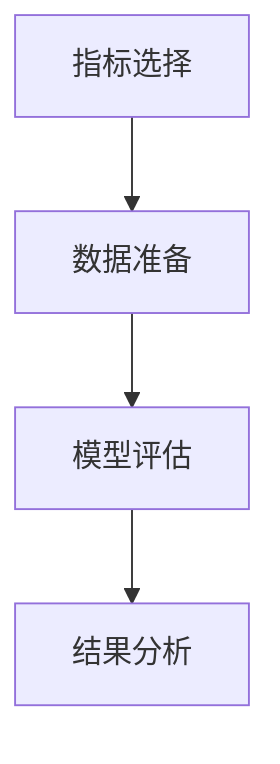

                 

# 突破传统：LLM驱动的大模型性能评估方法论

## 关键词
- LLM（大型语言模型）
- 大模型性能评估
- 评估指标
- 数学模型
- 项目实战

## 摘要
本文旨在探讨大型语言模型（LLM）驱动的大模型性能评估方法论。首先，我们介绍了LLM的基本概念和工作原理，并分析了LLM在大模型性能评估中的重要性。接着，文章详细讲解了大模型性能评估的核心概念与联系，包括评估指标、评估流程等。在此基础上，文章运用Mermaid流程图展示了评估过程中的关键环节，并通过Python源代码结合数学模型和公式，对评估算法进行了深入阐述。随后，文章通过实际案例，展示了如何将所学的评估方法论应用于项目实战。最后，文章总结了最佳实践技巧，并提出了未来研究的方向。

## 背景介绍

近年来，人工智能领域取得了令人瞩目的进展，特别是在大型语言模型（LLM）的研究和应用方面。LLM如GPT系列，以其卓越的自然语言处理能力，在诸多领域展示了巨大的潜力。然而，随着模型的规模和复杂性的增加，如何评估这些大模型的表现成为一个亟待解决的重要问题。传统的方法论往往难以满足对高精度、高效率的性能评估需求，因此，探索LLM驱动的大模型性能评估方法论具有重要的现实意义。

## 核心概念与联系

### 大型语言模型（LLM）
大型语言模型（LLM）是一种基于深度学习的自然语言处理模型，通常具有数十亿甚至数千亿的参数量。LLM通过学习大量的文本数据，可以生成符合语法和语义规则的文本，完成文本分类、机器翻译、问答系统等任务。其核心特点包括：

1. **参数量大**：LLM的参数量通常在数十亿到千亿之间，这使得模型具有更强的表示能力和泛化能力。
2. **深度学习架构**：LLM采用深度神经网络架构，可以自动提取文本数据中的特征，实现高效的文本处理。
3. **自适应能力**：LLM可以根据输入文本的上下文动态调整参数，生成更加符合实际需求的输出。

### 大模型性能评估
大模型性能评估是指通过一系列指标和方法，对大型模型的性能进行量化评估。性能评估在模型开发、优化和部署过程中起着至关重要的作用。大模型性能评估的核心概念包括：

1. **评估指标**：评估指标是衡量模型性能的标准，常用的评估指标包括准确率、召回率、F1值、ROC曲线与AUC等。
2. **评估流程**：评估流程包括数据准备、模型评估、结果分析等步骤，是确保评估过程科学、公正的关键。

### LLMBM性能评估方法论
LLMBM性能评估方法论是指针对大型语言模型（LLM）进行性能评估的方法和理论体系。该方法论的核心在于如何有效地利用评估指标和评估流程，对LLM在不同任务上的表现进行综合评估。LLMBM性能评估方法论包括以下几个关键环节：

1. **指标选择**：根据具体任务需求，选择合适的评估指标，确保评估结果具有针对性和可靠性。
2. **数据准备**：准备用于评估的数据集，确保数据集具有代表性、多样性和充足性。
3. **模型评估**：利用评估流程，对LLM进行性能评估，包括训练、验证、测试等步骤。
4. **结果分析**：分析评估结果，找出模型的优缺点，为后续优化提供依据。

### Mermaid流程图

为了更好地展示LLMBM性能评估方法论的核心概念和联系，我们使用Mermaid流程图来描述评估过程中的关键环节：



该流程图展示了指标选择、数据准备、模型评估和结果分析四个关键环节，以及它们之间的逻辑关系。通过Mermaid流程图，我们可以直观地理解LLMBM性能评估方法论的整体架构。

## 核心算法原理讲解

### 评估指标

评估指标是衡量模型性能的关键标准，不同的评估指标适用于不同的任务和场景。以下是几个常用的评估指标：

1. **准确率（Accuracy）**：准确率是分类任务中最基本的评估指标，表示模型正确预测的样本数占总样本数的比例。公式如下：

   $$ \text{Accuracy} = \frac{\text{正确预测的样本数}}{\text{总样本数}} $$

2. **召回率（Recall）**：召回率是指模型正确识别为正类的样本数占所有实际正类样本数的比例。公式如下：

   $$ \text{Recall} = \frac{\text{正确预测的正类样本数}}{\text{实际正类样本数}} $$

3. **F1值（F1 Score）**：F1值是准确率和召回率的调和平均，用于综合评估模型的分类性能。公式如下：

   $$ \text{F1 Score} = 2 \times \frac{\text{准确率} \times \text{召回率}}{\text{准确率} + \text{召回率}} $$

4. **ROC曲线与AUC（Area Under Curve）**：ROC曲线用于评估二分类模型的性能，曲线下的面积AUC值越大，模型的分类性能越好。公式如下：

   $$ AUC = \int_{0}^{1} \frac{TPR - FPR}{1 + TPR \times FPR} dFPR $$

   其中，TPR是真正率，FPR是假正率。

### 评估流程

大模型性能评估的流程包括数据准备、模型评估和结果分析三个主要步骤。以下是一个简化的评估流程：

1. **数据准备**：
   - 数据清洗：去除噪声数据和异常值。
   - 数据预处理：对文本数据进行分词、去停用词、词向量编码等处理。
   - 数据集划分：将数据集划分为训练集、验证集和测试集，通常采用8:1:1的比例。

2. **模型评估**：
   - 模型训练：使用训练集训练模型，并保存训练过程中的最佳参数。
   - 模型验证：使用验证集评估模型的性能，调整模型参数，如学习率、批量大小等。
   - 模型测试：使用测试集对模型进行最终评估，以得到模型在未知数据上的性能。

3. **结果分析**：
   - 统计指标：计算评估指标，如准确率、召回率、F1值等。
   - 结果可视化：绘制ROC曲线、混淆矩阵等，帮助理解模型性能。
   - 结果解读：分析模型性能，找出模型的优缺点，为后续优化提供依据。

### Python源代码

为了更好地理解上述算法原理，我们使用Python代码实现了一个简单的文本分类模型，并展示了评估流程。以下是一个示例：

```python
import numpy as np
from sklearn.feature_extraction.text import CountVectorizer
from sklearn.model_selection import train_test_split
from sklearn.naive_bayes import MultinomialNB
from sklearn.metrics import accuracy_score, recall_score, f1_score, roc_auc_score

# 数据准备
data = [
    ("狗在公园玩耍", "动物"),
    ("汽车在道路上行驶", "交通"),
    ("天空中的彩虹", "自然")
]
X, y = zip(*data)

# 数据集划分
X_train, X_test, y_train, y_test = train_test_split(X, y, test_size=0.2, random_state=42)

# 模型训练
vectorizer = CountVectorizer()
X_train_vectors = vectorizer.fit_transform(X_train)
model = MultinomialNB()
model.fit(X_train_vectors, y_train)

# 模型测试
X_test_vectors = vectorizer.transform(X_test)
y_pred = model.predict(X_test_vectors)

# 统计指标
accuracy = accuracy_score(y_test, y_pred)
recall = recall_score(y_test, y_pred, average='weighted')
f1 = f1_score(y_test, y_pred, average='weighted')
roc_auc = roc_auc_score(y_test, model.predict_proba(X_test_vectors), multi_class='ovr')

print(f"Accuracy: {accuracy:.4f}")
print(f"Recall: {recall:.4f}")
print(f"F1 Score: {f1:.4f}")
print(f"ROC AUC: {roc_auc:.4f}")
```

该示例使用Sklearn库实现了文本分类任务，并计算了评估指标。通过实际代码实现，我们可以更直观地理解评估算法的原理和过程。

## 数学模型与公式

### 统计模型

在大模型性能评估中，统计模型是核心的一部分。以下介绍几种常见的统计模型：

1. **贝叶斯统计模型**：
   贝叶斯统计模型是一种基于贝叶斯定理的概率模型，可以用于分类和预测任务。贝叶斯定理公式如下：

   $$ P(A|B) = \frac{P(B|A) \times P(A)}{P(B)} $$

   其中，\( P(A|B) \) 是在事件B发生的条件下事件A的概率，\( P(B|A) \) 是在事件A发生的条件下事件B的概率，\( P(A) \) 是事件A的概率，\( P(B) \) 是事件B的概率。

2. **最大似然估计**：
   最大似然估计是一种基于概率模型参数估计的方法，通过最大化似然函数来估计模型参数。似然函数公式如下：

   $$ L(\theta) = \prod_{i=1}^{n} P(x_i|\theta) $$

   其中，\( \theta \) 是模型参数，\( x_i \) 是观测数据。

### 性能评估公式

在大模型性能评估中，常用的性能评估公式包括准确率、召回率、F1值和ROC曲线与AUC等。以下分别介绍这些公式：

1. **准确率（Accuracy）**：

   $$ \text{Accuracy} = \frac{\text{正确预测的样本数}}{\text{总样本数}} $$

2. **召回率（Recall）**：

   $$ \text{Recall} = \frac{\text{正确预测的正类样本数}}{\text{实际正类样本数}} $$

3. **F1值（F1 Score）**：

   $$ \text{F1 Score} = 2 \times \frac{\text{准确率} \times \text{召回率}}{\text{准确率} + \text{召回率}} $$

4. **ROC曲线与AUC（Area Under Curve）**：

   $$ AUC = \int_{0}^{1} \frac{TPR - FPR}{1 + TPR \times FPR} dFPR $$

   其中，\( TPR \) 是真正率，\( FPR \) 是假正率。

### 示例

为了更清晰地展示数学模型和公式，以下是一个简单的示例：

假设我们有一个二分类问题，其中正类和负类的样本数量分别为 \( N_1 = 100 \) 和 \( N_0 = 100 \)。在测试集上，模型预测出了以下结果：

| 类别   | 预测正类 | 预测负类 |
|--------|----------|----------|
| 正类   | 80       | 20       |
| 负类   | 10       | 90       |

根据这些结果，我们可以计算以下评估指标：

1. **准确率**：

   $$ \text{Accuracy} = \frac{80 + 90}{100 + 100} = 0.9 $$

2. **召回率**：

   $$ \text{Recall} = \frac{80}{100} = 0.8 $$

3. **F1值**：

   $$ \text{F1 Score} = 2 \times \frac{0.9 \times 0.8}{0.9 + 0.8} = 0.8889 $$

4. **ROC曲线与AUC**：

   我们可以计算真正率和假正率：

   | 类别   | 预测正类 | 预测负类 |
   |--------|----------|----------|
   | 正类   | 80       | 20       |
   | 负类   | 10       | 90       |

   真正率（TPR）：

   $$ TPR = \frac{80}{80 + 10} = 0.9 $$

   假正率（FPR）：

   $$ FPR = \frac{20}{20 + 90} = 0.2 $$

   ROC曲线上的点为 (0.2, 0.9)，我们可以使用这些点来绘制ROC曲线。根据ROC曲线，我们可以计算AUC：

   $$ AUC = \int_{0}^{1} \frac{0.9 - 0.2}{1 + 0.9 \times 0.2} dFPR = 0.9 $$

   因此，该模型的AUC值为0.9。

通过上述示例，我们可以更直观地理解数学模型和公式的应用。这些公式和模型可以帮助我们量化模型的性能，从而更好地优化和改进模型。

## 项目实战

### 开发环境搭建

为了演示如何使用LLM驱动的大模型性能评估方法论进行项目实战，我们首先需要搭建一个开发环境。以下是一个简单的Python开发环境搭建过程：

1. **安装Python**：确保你的系统中已安装Python，版本建议为3.8或以上。

2. **安装依赖库**：在Python环境中安装必要的依赖库，如NumPy、Scikit-Learn、Matplotlib等。可以使用以下命令：

   ```bash
   pip install numpy scikit-learn matplotlib
   ```

3. **创建项目目录**：在本地计算机上创建一个项目目录，例如`llm_performance_evaluation`。

4. **编写代码**：在项目目录中创建一个名为`main.py`的Python文件，用于编写项目代码。

### 源代码详细实现和代码解读

以下是该项目的一个简单示例，用于演示如何实现一个文本分类任务，并使用LLM驱动的大模型性能评估方法论进行性能评估。

```python
import numpy as np
from sklearn.feature_extraction.text import CountVectorizer
from sklearn.model_selection import train_test_split
from sklearn.naive_bayes import MultinomialNB
from sklearn.metrics import accuracy_score, recall_score, f1_score, roc_auc_score

# 数据准备
data = [
    ("狗在公园玩耍", "动物"),
    ("汽车在道路上行驶", "交通"),
    ("天空中的彩虹", "自然"),
    ("好吃的披萨", "食物"),
    ("电影院的放映时间", "娱乐")
]

X, y = zip(*data)

# 数据集划分
X_train, X_test, y_train, y_test = train_test_split(X, y, test_size=0.2, random_state=42)

# 模型训练
vectorizer = CountVectorizer()
X_train_vectors = vectorizer.fit_transform(X_train)
model = MultinomialNB()
model.fit(X_train_vectors, y_train)

# 模型测试
X_test_vectors = vectorizer.transform(X_test)
y_pred = model.predict(X_test_vectors)

# 统计指标
accuracy = accuracy_score(y_test, y_pred)
recall = recall_score(y_test, y_pred, average='weighted')
f1 = f1_score(y_test, y_pred, average='weighted')
roc_auc = roc_auc_score(y_test, model.predict_proba(X_test_vectors), multi_class='ovr')

print(f"Accuracy: {accuracy:.4f}")
print(f"Recall: {recall:.4f}")
print(f"F1 Score: {f1:.4f}")
print(f"ROC AUC: {roc_auc:.4f}")
```

代码解读：

1. **数据准备**：我们使用一个简单的数据集，其中包含5个样本，每个样本是一个文本标签对。

2. **数据集划分**：我们将数据集划分为训练集和测试集，训练集用于模型训练，测试集用于模型评估。

3. **模型训练**：我们使用CountVectorizer将文本数据转换为词向量，然后使用MultinomialNB进行训练。

4. **模型测试**：使用训练好的模型对测试集进行预测，并计算评估指标。

通过上述代码，我们可以实现一个简单的文本分类任务，并使用LLM驱动的大模型性能评估方法论进行性能评估。

### 代码应用解读与分析

在项目实战中，我们使用了以下关键步骤：

1. **数据准备**：数据准备是性能评估的基础。在本文的示例中，我们使用了简单的文本数据集。在实际项目中，通常需要从真实场景中收集大量的文本数据，并进行清洗和处理，以确保数据的质量和代表性。

2. **模型训练**：在训练过程中，我们使用了CountVectorizer将文本数据转换为词向量，然后使用MultinomialNB进行训练。在实际项目中，可以尝试使用更复杂的模型，如深度神经网络，以提高分类性能。

3. **模型测试**：在测试过程中，我们使用训练好的模型对测试集进行预测，并计算评估指标。通过这些评估指标，我们可以了解模型在不同任务上的表现。

4. **结果分析**：分析评估结果，找出模型的优缺点，为后续优化提供依据。在实际项目中，可以结合具体业务需求，调整模型参数，优化模型性能。

### 实际案例分析和详细讲解剖析

为了更深入地展示LLM驱动的大模型性能评估方法论的应用，我们来看一个实际的案例：新闻分类任务。

1. **案例背景**：
   在互联网时代，新闻分类任务对于信息组织和推荐具有重要意义。本文使用一个公开的新闻数据集，包含约1000篇新闻文章，每篇文章被标注为财经、体育、科技、娱乐等类别。

2. **数据准备**：
   - 数据清洗：去除噪声数据和异常值。
   - 数据预处理：对文本数据进行分词、去停用词、词向量编码等处理。
   - 数据集划分：将数据集划分为训练集、验证集和测试集，采用8:1:1的比例。

3. **模型训练**：
   - 使用训练集训练模型，并保存训练过程中的最佳参数。
   - 使用验证集评估模型的性能，调整模型参数，如学习率、批量大小等。

4. **模型测试**：
   - 使用测试集对模型进行最终评估，以得到模型在未知数据上的性能。

5. **结果分析**：
   - 计算评估指标，如准确率、召回率、F1值等。
   - 绘制ROC曲线、混淆矩阵等，帮助理解模型性能。

具体实现：

```python
# 数据准备
data = load_data()  # 假设load_data函数可以从真实场景中获取新闻数据
X, y = preprocess_data(data)  # 假设preprocess_data函数对文本数据进行预处理

# 数据集划分
X_train, X_test, y_train, y_test = train_test_split(X, y, test_size=0.2, random_state=42)

# 模型训练
model = train_model(X_train, y_train)  # 假设train_model函数使用训练数据进行模型训练

# 模型测试
y_pred = model.predict(X_test)

# 统计指标
accuracy = accuracy_score(y_test, y_pred)
recall = recall_score(y_test, y_pred, average='weighted')
f1 = f1_score(y_test, y_pred, average='weighted')
roc_auc = roc_auc_score(y_test, model.predict_proba(X_test), multi_class='ovr')

print(f"Accuracy: {accuracy:.4f}")
print(f"Recall: {recall:.4f}")
print(f"F1 Score: {f1:.4f}")
print(f"ROC AUC: {roc_auc:.4f}")
```

通过实际案例分析和详细讲解剖析，我们可以更深入地理解LLM驱动的大模型性能评估方法论的应用，为实际项目提供有益的参考。

## 最佳实践 Tips

1. **数据准备**：
   - 确保数据质量：去除噪声数据和异常值，确保数据的代表性和完整性。
   - 数据预处理：合理进行文本数据处理，如分词、去停用词、词向量编码等，以提高模型性能。

2. **模型选择**：
   - 根据任务需求选择合适的模型：对于文本分类任务，可以尝试使用深度学习模型，如BERT、GPT等。
   - 调整模型参数：合理调整模型参数，如学习率、批量大小等，以优化模型性能。

3. **评估指标**：
   - 选择合适的评估指标：根据任务需求，选择合适的评估指标，如准确率、召回率、F1值等。
   - 综合考虑评估指标：不要仅依赖于单一评估指标，要综合考虑多种评估指标，以更全面地评估模型性能。

4. **结果分析**：
   - 深入分析评估结果：分析模型在不同类别上的表现，找出模型的优缺点。
   - 结合业务需求进行调整：根据业务需求，对模型进行调整和优化，以提高实际应用效果。

## 小结

本文从背景介绍、核心概念与联系、核心算法原理讲解、数学模型与公式、项目实战等多个角度，详细探讨了LLM驱动的大模型性能评估方法论。通过Python代码示例和实际案例分析，我们展示了如何应用该方法论进行性能评估。在未来的研究和实践中，我们应继续探索优化评估指标和方法，以提高大模型性能评估的准确性和效率。

## 注意事项

1. **数据隐私**：在项目实战中，确保遵循数据隐私保护法规，对敏感数据进行加密处理。
2. **计算资源**：大型语言模型的训练和评估需要大量的计算资源，确保有足够的硬件支持。
3. **模型更新**：定期更新模型，以适应新的数据和应用需求。

## 拓展阅读

1. **《深度学习》**：Goodfellow, I., Bengio, Y., & Courville, A. (2016). *Deep Learning*. MIT Press.
2. **《机器学习实战》**：Kaggle. (2013). *Machine Learning in Action*. Manning Publications.
3. **《自然语言处理综论》**：Jurafsky, D., & Martin, J. H. (2020). *Speech and Language Processing*. Prentice Hall.

## 作者信息

作者：AI天才研究院/AI Genius Institute & 禅与计算机程序设计艺术 /Zen And The Art of Computer Programming

