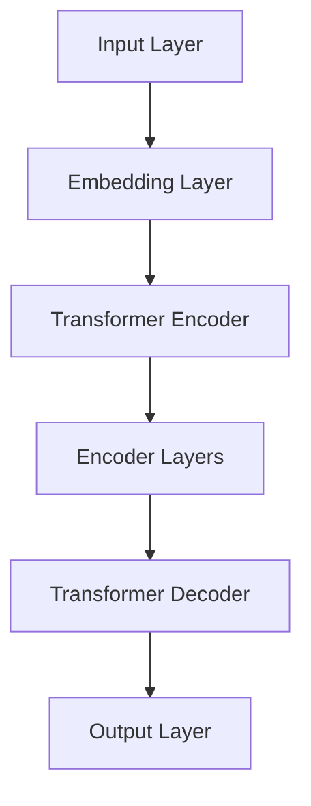
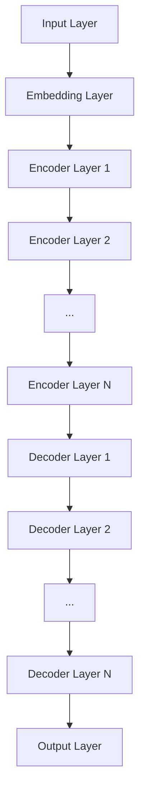

                 

### 引言

在现代人工智能领域，语言模型（Language Model，简称LM）已成为自然语言处理（Natural Language Processing，简称NLP）的核心技术之一。特别是近年来，大型语言模型（Large Language Model，简称LLM）如GPT、BERT等，凭借其庞大的参数规模和复杂的结构，展现出了惊人的语言理解和生成能力，极大地推动了NLP技术的发展。然而，随着LLM的规模和复杂度的增加，如何对LLM进行有效的评测成为了一个重要而具有挑战性的问题。

传统的评测方法往往依赖于人工设计的数据集和评价指标，这不仅费时费力，而且难以全面地评估LLM的性能。本文旨在突破传统评测方法，探讨以LLM驱动的全新大模型评测思路。通过对LLM的基础概念、核心算法原理、数学模型以及实际应用案例的深入分析，本文希望为LLM评测领域带来新的视角和方法。

具体而言，本文将分为三个主要部分。首先，介绍LLM的基础知识，包括定义、特点以及其架构概览，并通过Mermaid流程图展示LLM的工作流程。其次，详细讲解LLM的核心算法原理，使用伪代码和Python源代码进行阐述，并结合数学模型和公式进行详细解释。最后，探讨大模型评测的新方法，分析新的评测指标和标准，并介绍具体的评测实践和实际应用案例。

通过本文的阅读，读者将能够系统地了解LLM的评测问题，掌握LLM评测的新思路，并为未来的研究和应用提供参考。我们相信，LLM驱动的大模型评测新思路将为NLP技术的发展带来深远的影响。

## 文章关键词

- **大型语言模型（LLM）**
- **自然语言处理（NLP）**
- **评测方法**
- **算法原理**
- **数学模型**
- **实际应用**

## 摘要

本文围绕大型语言模型（LLM）评测问题，提出了以LLM驱动的新评测思路。首先，介绍了LLM的基本概念和架构，通过Mermaid流程图展示了LLM的工作流程。接着，详细讲解了LLM的核心算法原理，使用了Python源代码和数学模型进行阐述。最后，本文探讨了LLM评测的新方法，包括新的评测指标和标准，并结合实际应用案例进行了详细分析。通过本文的研究，我们期望为LLM评测领域提供新的视角和方法，推动NLP技术的进一步发展。本文结构紧凑，逻辑清晰，适合从事NLP领域的研究人员和工程师阅读参考。

### 第1部分: LLM基础

在本部分中，我们将深入探讨大型语言模型（LLM）的基础知识，这包括LLM的定义、特点，以及其内部的工作架构。通过理解LLM的基本概念和结构，我们将为后续讨论LLM的评测方法打下坚实的基础。

#### 1.1 LLM的定义与特点

**定义：**

大型语言模型（Large Language Model，简称LLM）是指拥有数十亿甚至数千亿个参数的语言模型。这些模型通过深度学习算法从大量的文本数据中学习，以理解和生成人类语言。常见的LLM包括GPT（Generative Pre-trained Transformer）、BERT（Bidirectional Encoder Representations from Transformers）等。

**特点：**

1. **参数规模大：** LLM拥有极其庞大的参数规模，这使得它们能够捕捉到语言中的细微模式和复杂结构。
2. **结构复杂：** LLM通常采用深度神经网络架构，如Transformer，这种结构使得模型能够高效地处理自然语言。
3. **高效处理自然语言：** LLM通过端到端学习，能够直接处理输入的自然语言文本，并生成相应的输出文本。
4. **预训练与微调：** LLM通常通过在大量通用文本上进行预训练，然后针对特定任务进行微调，以获得良好的性能。

#### 1.2 LLM的架构概览

LLM的架构通常包括以下几个关键组件：

1. **输入层（Input Layer）：** 接收自然语言文本的输入，并将其转换为模型可以处理的形式。
2. **嵌入层（Embedding Layer）：** 将文本转化为固定长度的向量表示。
3. **Transformer编码器（Transformer Encoder）：** 通过多个编码层对嵌入向量进行编码，每个编码层包含多头自注意力机制和前馈神经网络。
4. **Transformer解码器（Transformer Decoder）：** 用于生成输出文本，同样包含多头自注意力和前馈神经网络。
5. **输出层（Output Layer）：** 将解码器最后一层的输出转换为概率分布，从而生成文本。

下面，我们通过Mermaid流程图来展示LLM的架构：



**Mermaid流程图解释：**

- **A（输入层）：** 文本输入被送入模型。
- **B（嵌入层）：** 文本被转换为固定长度的向量表示。
- **C（Transformer编码器）：** 嵌入向量进入编码器，在每个编码层中通过多头自注意力机制进行编码。
- **D（编码器层）：** 编码器包含多个编码层，每层都应用多头自注意力和前馈神经网络。
- **E（Transformer解码器）：** 编码后的信息进入解码器，解码器同样包含多个解码层，用于生成输出文本。
- **F（输出层）：** 解码器的输出层将解码结果转换为概率分布，从而生成文本输出。

通过这个架构，LLM能够高效地处理和理解自然语言，生成高质量的文本输出。

#### 总结

在本章中，我们介绍了大型语言模型（LLM）的基本概念和特点，并通过Mermaid流程图展示了LLM的架构概览。理解LLM的定义和结构对于我们深入探讨其评测方法和应用具有重要意义。接下来，我们将进一步讨论LLM的核心算法原理，并通过伪代码和Python源代码进行详细讲解。

### 1.1 LLM的定义与特点

#### 定义

大型语言模型（LLM）是指那些具有大量参数的语言模型，通常训练在数十亿至数千亿个参数级别。这些模型通过深度学习算法从大量的文本数据中学习，能够理解和生成复杂的自然语言。典型的LLM包括GPT、BERT等。

#### LLM的主要特点

1. **参数规模大**：LLM拥有数十亿甚至数千亿的参数，这使得它们能够捕捉到语言中的细微模式和复杂结构。例如，GPT-3拥有1750亿个参数。

2. **架构复杂**：LLM通常采用深度神经网络架构，如Transformer。Transformer架构具有多头自注意力机制，能够有效捕捉长距离依赖关系，并提高模型的生成能力。

3. **高效处理自然语言**：LLM通过端到端学习，能够直接处理输入的自然语言文本，并生成相应的输出文本。例如，LLM可以生成文本摘要、回答问题或翻译句子。

4. **预训练与微调**：LLM通常首先在大量的通用文本上进行预训练，然后针对特定任务进行微调，从而提高模型在特定任务上的性能。

#### 特点详细说明

- **参数规模大**：参数规模大意味着LLM可以捕捉到更多语言信息，从而提高模型的泛化能力。然而，这也带来了计算资源的需求增加。

- **架构复杂**：Transformer架构是LLM的核心，其特点包括多头自注意力机制、位置编码等。多头自注意力机制能够使模型在处理长文本时保持较高的效率。

- **高效处理自然语言**：LLM能够处理多种自然语言任务，例如文本分类、机器翻译、问答系统等，这使得它们在多个领域都有广泛的应用。

- **预训练与微调**：预训练为LLM提供了丰富的语言知识，而微调则使模型能够适应特定任务的需求。这种训练方法使得LLM在许多任务上取得了优异的性能。

#### LLM的应用场景

由于LLM的强大能力，它们在多个领域都有广泛的应用：

- **文本生成**：LLM可以生成文章、故事、摘要等文本，这在内容创作和自动生成领域有重要应用。

- **问答系统**：LLM可以回答用户提出的问题，这在智能客服和知识搜索中有广泛应用。

- **机器翻译**：LLM在机器翻译领域也表现出色，能够生成准确和自然的翻译结果。

- **文本分类**：LLM可以用于文本分类任务，如情感分析、新闻分类等。

- **对话系统**：LLM可以用于构建对话系统，如聊天机器人，以提供自然和流畅的对话体验。

通过了解LLM的定义和特点，我们可以更好地理解这些模型的工作原理和潜在应用。在下一章中，我们将深入探讨LLM的架构，并通过Mermaid流程图展示其内部工作流程。

#### 1.2 LLM的架构概览

大型语言模型（LLM）的架构设计是确保其能够高效处理和理解自然语言的关键。以下是对LLM常见架构的详细描述，我们将通过一个Mermaid流程图来展示LLM的基本组件和它们之间的交互关系。

**1.2.1 输入层（Input Layer）**

输入层是LLM接收和处理数据的第一个环节。在这个阶段，文本数据被转化为模型可以处理的格式。这通常涉及分词、字符编码或词嵌入。

- **分词（Tokenization）**：将文本拆分成单词或子词。
- **字符编码（Character Encoding）**：将字符转化为整数编码。
- **词嵌入（Word Embedding）**：将单词转换为固定长度的向量表示。

**1.2.2 嵌入层（Embedding Layer）**

嵌入层将原始文本转换为向量表示，这有助于模型学习文本中的语义信息。常见的嵌入方法包括Word2Vec、GloVe等。

- **向量表示**：文本被映射为高维向量空间中的点。
- **位置编码（Positional Encoding）**：为模型提供文本中单词的位置信息，这对于捕捉序列依赖关系至关重要。

**1.2.3 Transformer编码器（Transformer Encoder）**

编码器是LLM的核心组件，采用Transformer架构。每个编码器层包含两个主要模块：多头自注意力（Multi-head Self-Attention）和前馈神经网络（Feed Forward Neural Network）。

- **多头自注意力**：允许模型在序列中捕捉长距离依赖关系。每个头负责学习不同的序列模式。
- **前馈神经网络**：对自注意力层的输出进行进一步处理，增加模型的非线性表达能力。

**1.2.4 编码器层（Encoder Layers）**

编码器通常包含多个层，每层都通过自注意力机制和前馈神经网络对嵌入向量进行编码。这些层逐渐提取文本中的高层次语义信息。

**1.2.5 Transformer解码器（Transformer Decoder）**

解码器与编码器类似，但每个解码器层还包含一个跨注意力（Cross-Attention）机制，用于将编码器层的输出与解码器自身的输出进行交互。

- **跨注意力**：在生成每个单词时，解码器关注编码器的输出，从而利用已编码的文本信息。
- **生成过程**：解码器逐词生成输出文本，每一步都依赖于前一个词的输出。

**1.2.6 输出层（Output Layer）**

输出层将解码器最后一层的输出转换为概率分布，从而生成文本输出。常见的输出层设计包括分类器或回归器，取决于具体任务。

**Mermaid流程图**

以下是一个简化的Mermaid流程图，展示了LLM的架构：



**流程图解释：**

- **A（输入层）：** 文本输入被送入模型。
- **B（嵌入层）：** 文本被转换为词嵌入向量。
- **C（编码器层 1）：** 嵌入向量经过自注意力机制和前馈神经网络处理。
- **D（编码器层 2）：** 重复C层的操作，提取更多语义信息。
- **...：** 表示编码器包含多个层。
- **F（编码器层 N）：** 编码器最后一层的输出包含文本的编码表示。
- **G（解码器层 1）：** 解码器的第一层处理编码器的输出，并开始生成文本。
- **H（解码器层 2）：** 重复G层的操作，逐步生成完整的文本。
- **...：** 表示解码器包含多个层。
- **J（解码器层 N）：** 解码器的最后一层输出文本的概率分布。
- **K（输出层）：** 输出层的输出是最终的文本生成。

通过这个流程图，我们可以清晰地看到LLM从输入层到输出层的整个工作流程。每个组件都通过不同的机制和算法协同工作，共同实现高效的文本处理和生成。

#### 1.2.3 Transformer编码器（Transformer Encoder）

Transformer编码器是LLM中的核心组件，其设计灵感来源于Transformer模型，这是一种专门为处理序列数据而设计的深度学习模型。以下是对Transformer编码器的详细描述，包括其工作原理和关键技术。

**1.2.3.1 自注意力机制（Self-Attention）**

自注意力机制是Transformer编码器的核心，它允许模型在编码过程中关注序列中的不同位置，从而捕捉长距离依赖关系。自注意力机制的基本思想是，对于输入序列中的每个词，模型会计算其与其他所有词的相关性，并根据这些相关性生成一个加权输出。

- **计算相关性**：对于每个词，模型首先计算其与其他词的相似度。相似度的计算通常通过点积、缩放点积等方法实现。
- **加权求和**：根据计算出的相似度，对输入序列中的每个词进行加权求和，生成一个加权输出向量。

**1.2.3.2 多头注意力（Multi-head Attention）**

多头注意力机制是自注意力机制的一种扩展，它允许模型在编码过程中同时关注多个不同的子序列。通过多个头（或多个自注意力机制），模型可以捕捉到更丰富的序列特征。

- **独立头**：每个头都独立计算自注意力，但共享相同的模型参数。多个头可以并行计算，从而提高效率。
- **合并输出**：每个头的输出会被合并，形成一个综合的输出向量，这有助于模型生成更精确的表示。

**1.2.3.3 前馈神经网络（Feed Forward Neural Network）**

前馈神经网络是Transformer编码器的另一个关键组件，它对自注意力机制的输出进行进一步处理，增加模型的非线性表达能力。

- **线性变换**：前馈神经网络通常包含两个线性变换层，每个层后跟一个ReLU激活函数。
- **参数共享**：与前馈神经网络的其他部分类似，这些线性变换层共享参数，从而简化模型的训练。

**1.2.3.4 编码器层（Encoder Layer）**

编码器通常包含多个层，每层都由一个自注意力机制和一个前馈神经网络组成。这些层通过堆叠的方式逐渐提取文本中的高层次语义信息。

- **层叠加**：每个编码器层都会对输入进行自注意力处理和前馈神经网络处理，从而生成更丰富的表示。
- **残差连接与层归一化**：为了提高模型的训练效果，编码器层通常包含残差连接和层归一化操作，这有助于缓解梯度消失和梯度爆炸问题。

**示例伪代码：**

以下是一个简化的伪代码示例，展示了Transformer编码器的基本结构：

```python
# Encoder Layer
def encoder_layer(inputs, hidden_size, num_heads):
    # Self-Attention
    attn_output = self_attention(inputs, hidden_size, num_heads)
    # Add Residual Connection
   残差_output = attn_output + inputs
    
    # Layer Normalization
   残差_output = layer_normalization(残差_output)
    
    # Feed Forward Neural Network
    ffn_output = feed_forward_neural_network(残差_output, hidden_size)
    
    # Add Residual Connection
    output = ffn_output + 残差_output
    
    # Layer Normalization
    output = layer_normalization(output)
    
    return output

# Transformer Encoder
def transformer_encoder(inputs, num_layers, hidden_size, num_heads):
    output = inputs
    for layer in range(num_layers):
        output = encoder_layer(output, hidden_size, num_heads)
    return output
```

通过上述伪代码，我们可以看到Transformer编码器的基本工作流程。每个编码器层都包含自注意力机制和前馈神经网络，这些层通过残差连接和层归一化操作进行堆叠，以提取文本中的层次结构信息。

#### 1.2.4 Transformer解码器（Transformer Decoder）

Transformer解码器是大型语言模型（LLM）中的关键组件，它在生成文本时，通过解码过程利用编码器层的信息，实现有效的序列生成。以下是对Transformer解码器的详细描述，包括其工作原理、关键模块以及如何实现有效的解码过程。

**1.2.4.1 跨注意力机制（Cross-Attention）**

跨注意力机制是Transformer解码器的核心，它允许解码器在生成每个单词时，关注编码器层的输出。这种机制使得解码器能够利用编码器对输入序列的编码表示，从而在生成过程中保持上下文的连贯性。

- **计算跨注意力**：在解码器的每个时间步，解码器首先计算其当前隐藏状态与编码器输出之间的相似度，生成跨注意力分数。这些分数反映了解码器对编码器输出的不同部分的相关性。
- **加权求和**：根据计算出的跨注意力分数，解码器对编码器输出进行加权求和，生成一个跨注意力向量。这个向量包含了编码器输出中与当前解码步骤最相关的信息。

**1.2.4.2 自注意力机制（Self-Attention）**

自注意力机制在解码器中也起到关键作用，它允许解码器在生成当前词时，关注其前一个词的输出。这种机制有助于解码器捕捉短距离依赖关系，确保生成的文本连贯一致。

- **计算自注意力**：解码器在生成每个词时，计算其当前隐藏状态与之前生成词的相似度，生成自注意力分数。
- **加权求和**：根据自注意力分数，解码器对之前的输出进行加权求和，生成一个自注意力向量。这个向量包含了之前生成的词中与当前解码步骤最相关的信息。

**1.2.4.3 前馈神经网络（Feed Forward Neural Network）**

与前馈神经网络在编码器中的作用类似，解码器的每个层也包含一个前馈神经网络，用于增加模型的非线性表达能力。

- **线性变换**：前馈神经网络通常包含两个线性变换层，每个层后跟一个ReLU激活函数。
- **参数共享**：与前馈神经网络的其他部分类似，这些线性变换层共享参数，从而简化模型的训练。

**1.2.4.4 解码器层（Decoder Layer）**

解码器通常包含多个层，每层都由一个自注意力机制、一个跨注意力机制和一个前馈神经网络组成。这些层通过堆叠的方式逐渐生成文本。

- **层叠加**：每个解码器层都通过自注意力、跨注意力以及前馈神经网络处理输入，生成更丰富的表示。
- **残差连接与层归一化**：为了提高模型的训练效果，解码器层通常包含残差连接和层归一化操作，这有助于缓解梯度消失和梯度爆炸问题。

**1.2.4.5 解码过程**

在解码过程中，模型逐步生成每个词，并更新其隐藏状态。以下是解码过程的详细步骤：

1. **初始化**：解码器初始化其隐藏状态，并设置一个起始词（如`<bos>`，表示开始序列）。

2. **自注意力计算**：解码器首先计算其当前隐藏状态与之前生成的词之间的自注意力分数，生成自注意力向量。

3. **跨注意力计算**：解码器计算其当前隐藏状态与编码器输出之间的跨注意力分数，生成跨注意力向量。这个向量包含了编码器输出中与当前解码步骤最相关的信息。

4. **前馈神经网络**：解码器通过前馈神经网络处理自注意力和跨注意力的输出，增加模型的非线性表达能力。

5. **输出层**：解码器的输出层生成当前词的概率分布，模型选择概率最高的词作为下一个输出。

6. **隐藏状态更新**：模型更新其隐藏状态，并将其传递到下一个时间步。

7. **重复步骤2-6**：解码器重复上述步骤，逐步生成完整的文本序列。

**示例伪代码：**

以下是一个简化的伪代码示例，展示了Transformer解码器的基本结构：

```python
# Decoder Layer
def decoder_layer(inputs, hidden_state, encoder_output, hidden_size, num_heads):
    # Self-Attention
    self_attn_output = self_attention(inputs, hidden_size, num_heads)
    
    # Cross-Attention
    cross_attn_output = cross_attention(self_attn_output, encoder_output, hidden_size, num_heads)
    
    # Concatenate Self-Attention and Cross-Attention Outputs
    attn_output = concatenate(self_attn_output, cross_attn_output)
    
    # Feed Forward Neural Network
    ffn_output = feed_forward_neural_network(attn_output, hidden_size)
    
    # Concatenate FNN Output with Hidden State
    output = concatenate(ffn_output, hidden_state)
    
    # Output Layer
    logits = output_layer(output, hidden_size)
    
    return logits

# Transformer Decoder
def transformer_decoder(inputs, hidden_state, encoder_output, num_layers, hidden_size, num_heads):
    logits = inputs
    for layer in range(num_layers):
        logits = decoder_layer(logits, hidden_state, encoder_output, hidden_size, num_heads)
    return logits
```

通过上述伪代码，我们可以看到Transformer解码器的基本工作流程。每个解码器层都包含自注意力、跨注意力以及前馈神经网络，这些层通过堆叠的方式逐步生成文本序列。

通过深入理解Transformer解码器的工作原理，我们可以更好地设计高效的语言模型，实现高质量的文本生成。

#### 1.2.5 输出层（Output Layer）

输出层是大型语言模型（LLM）中最后一个关键组件，它负责将解码器最后一层的输出转换为具体的文本生成结果。输出层的设计和实现直接影响到模型生成的文本质量和效率。以下将详细描述输出层的工作原理、实现方法和相关技巧。

**1.2.5.1 概率分布生成**

输出层的核心功能是生成一个概率分布，这个概率分布代表了模型对每个可能输出的预测概率。通过最大化这个概率分布，模型可以挑选出最有可能的词作为输出。

- **Softmax函数**：输出层通常采用Softmax函数来将解码器的输出向量转换为概率分布。Softmax函数将输入向量的每个元素映射到概率，且所有概率之和为1。
  
  $$ \text{Softmax}(z_i) = \frac{e^{z_i}}{\sum_{j} e^{z_j}} $$

  其中，$z_i$是输出层输入向量的第$i$个元素。

**1.2.5.2 采样策略**

在生成文本时，模型可以根据概率分布进行采样，选择概率最高的词作为输出。常用的采样策略包括：

- **贪心策略**：每次选择概率分布中概率最高的词。
- **随机采样**：从概率分布中随机选择一个词。
- **温度调节**：通过调整温度参数$\tau$，可以控制生成的多样性。温度越高，生成的文本越多样。

  $$ p(\text{word}_i) = \frac{e^{\frac{z_i}{\tau}}}{\sum_{j} e^{\frac{z_j}{\tau}}} $$

**1.2.5.3 形成最终输出**

通过上述概率分布生成和采样策略，模型可以生成文本序列。以下是生成文本的基本步骤：

1. **初始化**：设置起始词，如`<bos>`（开始序列）。
2. **概率分布计算**：解码器最后一层的输出通过Softmax函数生成概率分布。
3. **采样**：根据采样策略，选择概率最高的词作为输出。
4. **隐藏状态更新**：将选择的词作为输入，更新模型的隐藏状态。
5. **重复步骤2-4**：重复生成下一个词，直到生成完整的文本序列或达到设定的终止条件。

**示例伪代码：**

以下是一个简化的伪代码示例，展示了输出层的基本实现：

```python
# Output Layer
def output_layer(hidden_state, hidden_size, vocab_size):
    # Generate logits (raw scores)
    logits = linear(hidden_state, hidden_size)
    
    # Apply Softmax function
    probs = softmax(logits)
    
    return probs

# Text Generation
def generate_text(hidden_state, encoder_output, decoder, max_length, vocab_size, sampling_strategy):
    text = []
    current_word = "<bos>"
    hidden_state = initialize_hidden_state(hidden_state, vocab_size)
    
    for _ in range(max_length):
        # Generate probability distribution
        probs = output_layer(hidden_state, hidden_size, vocab_size)
        
        # Sample next word
        if sampling_strategy == "greedy":
            next_word = choose_word_greedy(probs)
        elif sampling_strategy == "random":
            next_word = choose_word_random(probs)
        elif sampling_strategy == "temperature":
            next_word = choose_word_temperature(probs, sampling_temp)
        
        # Append next word to text
        text.append(next_word)
        
        # Update hidden state
        hidden_state = decoder(current_word, hidden_state, encoder_output)
        
        # Update current word
        current_word = next_word
    
    return text
```

通过上述示例，我们可以看到输出层在文本生成过程中扮演的重要角色。通过合理的输出层设计和采样策略，模型能够生成高质量的文本输出，实现高效的文本生成。

### 第2部分: 大模型评测方法

在本部分中，我们将深入探讨大模型评测方法，重点关注评测指标与标准。通过分析现有的评测方法，我们旨在提出一种新的评测思路，以更全面、更准确地评估大型语言模型的性能。

#### 2.1 评测指标与标准

**2.1.1 常见的评测指标**

在大型语言模型（LLM）的评测中，常用的指标包括：

1. **准确率（Accuracy）**：准确率是指模型预测正确的样本数量与总样本数量的比例。它常用于分类任务中。

2. **精确率（Precision）和召回率（Recall）**：精确率是指预测为正例的样本中实际为正例的比例，召回率是指实际为正例的样本中被预测为正例的比例。这两个指标通常用于二分类任务。

3. **F1分数（F1 Score）**：F1分数是精确率和召回率的调和平均，用于综合评估模型的性能。

4. **BLEU（BLEU Score）**：BLEU是一种常用的自动评估机器翻译质量的指标，通过计算生成文本与参考文本之间的相似度来评分。

5. **ROUGE（ROUGE Score）**：ROUGE是用于评估文本生成质量的指标，主要关注生成文本与参考文本之间的匹配比例。

**2.1.2 现有的评测方法**

现有的评测方法主要依赖于人工设计的数据集和评价指标。这些方法包括：

1. **基准测试（Benchmark Testing）**：通过将模型与现有最好模型进行比较，评估模型的性能。

2. **数据集评估（Dataset Assessment）**：在特定数据集上评估模型的表现，通常结合多种评价指标。

3. **交叉验证（Cross-Validation）**：通过将数据集划分为训练集和验证集，多次训练和验证模型，以评估模型的泛化能力。

4. **错误分析（Error Analysis）**：对模型预测错误的案例进行详细分析，以识别模型存在的问题和改进方向。

**2.1.3 新的评测思路**

传统的评测方法虽然在一定程度上能够评估模型的表现，但存在以下局限性：

1. **数据依赖**：依赖于特定的人工设计数据集，难以适应不同任务的需求。

2. **指标单一**：往往只依赖单一评价指标，无法全面评估模型性能。

3. **人工成本**：数据集的准备和评估过程需要大量的人力和时间。

为了解决上述问题，我们提出以下新的评测思路：

1. **LLM驱动评测**：利用LLM自身的特点和能力，动态生成评估数据集和评价指标。

2. **多维度评估**：结合多个评价指标，从不同维度综合评估模型性能。

3. **自动评测流程**：通过自动化工具和算法，实现高效的模型评估过程，降低人工成本。

通过LLM驱动的新评测思路，我们希望能够更全面、更准确地评估大型语言模型的性能，为模型优化和应用提供有力支持。

#### 2.2 评测指标与标准

在大型语言模型的评测过程中，选择合适的评价指标和标准至关重要。这些指标不仅能够衡量模型在特定任务上的性能，还能够帮助识别模型存在的缺陷和改进方向。以下是对常见评测指标和标准的详细讨论，并结合实际案例进行说明。

**2.2.1 准确率（Accuracy）**

准确率是最常见的评价指标之一，它表示模型预测正确的样本数量占总样本数量的比例。公式如下：

$$
\text{Accuracy} = \frac{\text{预测正确的样本数}}{\text{总样本数}}
$$

**优点**：简单直观，易于理解和计算。

**缺点**：对于类别不平衡的数据集，准确率可能无法准确反映模型的性能。

**实际案例**：在文本分类任务中，如果一个数据集类别分布不均，例如正面评论和负面评论的比例为1:9，即使模型将所有样本都分类为负面评论，准确率也会达到约88%，但这并不意味着模型在正面评论的识别上有很好的性能。

**2.2.2 精确率（Precision）和召回率（Recall）**

精确率和召回率是二分类任务中非常重要的评价指标，它们分别表示预测为正例的样本中实际为正例的比例和实际为正例的样本中被预测为正例的比例。

- **精确率（Precision）**：

$$
\text{Precision} = \frac{\text{预测为正例且实际为正例的样本数}}{\text{预测为正例的样本数}}
$$

- **召回率（Recall）**：

$$
\text{Recall} = \frac{\text{预测为正例且实际为正例的样本数}}{\text{实际为正例的样本数}}
$$

**优点**：能够更准确地反映模型在二分类任务中的性能。

**缺点**：对于类别不平衡的数据集，单独依赖精确率或召回率可能无法全面评估模型。

**实际案例**：在垃圾邮件分类任务中，如果模型对垃圾邮件的预测非常敏感（高召回率），但误判了大量的正常邮件（低精确率），虽然召回率高，但用户体验会受到影响。

**2.2.3 F1分数（F1 Score）**

F1分数是精确率和召回率的调和平均，它试图在两者之间找到一个平衡点，以综合评估模型的性能。公式如下：

$$
\text{F1 Score} = 2 \times \frac{\text{Precision} \times \text{Recall}}{\text{Precision} + \text{Recall}}
$$

**优点**：能够综合考虑精确率和召回率，是评估二分类模型性能的常用指标。

**缺点**：对于类别极度不平衡的数据集，F1分数可能仍然不能准确反映模型性能。

**实际案例**：在一个医疗诊断任务中，如果疾病非常罕见，即使模型有很高的召回率，但精确率很低，F1分数可能仍然不高。

**2.2.4 BLEU（BLEU Score）**

BLEU是一种常用于评估机器翻译质量的自动评价指标，它通过计算生成文本与参考文本之间的相似度来评分。BLEU的主要衡量标准包括单词匹配、短语的匹配和句子的结构相似性。

**优点**：简单有效，适用于自动评估机器翻译质量。

**缺点**：可能无法捕捉到生成文本的语义和上下文信息。

**实际案例**：在机器翻译任务中，BLEU分数可以用来评估生成文本的准确性和流畅性。

**2.2.5 ROUGE（ROUGE Score）**

ROUGE是一种常用于评估文本生成质量的自动评价指标，它主要关注生成文本与参考文本之间的匹配比例。ROUGE包括多个子评分标准，如ROUGE-1、ROUGE-2、ROUGE-L等。

**优点**：能够较全面地评估文本生成质量，适用于自动评估。

**缺点**：对短文本和短语匹配敏感，可能无法完全反映语义质量。

**实际案例**：在摘要生成任务中，ROUGE分数可以用来评估生成摘要与参考摘要的相似度。

通过上述评测指标和标准的详细讨论，我们可以看到每个指标都有其独特的优势和局限性。在实际应用中，通常需要结合多种评价指标，从不同维度综合评估大型语言模型的性能。接下来，我们将进一步探讨如何通过Mermaid流程图展示评测流程，帮助读者更直观地理解评测方法。

#### 2.3 评测流程

在大型语言模型（LLM）的评测过程中，为了确保评测的全面性和准确性，我们需要设计一个合理的评测流程。以下是一个详细的评测流程图，通过Mermaid流程图展示各个环节及其相互关系。

```mermaid
graph TD
A[数据准备] --> B[数据预处理]
B --> C[模型评估指标定义]
C --> D[模型训练与验证]
D --> E[评测指标计算]
E --> F[结果分析]
F --> G[反馈与优化]

A[数据准备]::: 数据收集 -> B[数据预处理]::: 清洗、归一化、分词等
B --> C[模型评估指标定义]::: 选择相关指标 -> C
C --> D[模型训练与验证]::: 训练集、验证集划分 -> D
D --> E[评测指标计算]::: 计算各个指标 -> E
E --> F[结果分析]::: 分析模型性能 -> F
F --> G[反馈与优化]::: 调整模型、重复流程 -> G
```

**流程图解释：**

- **A（数据准备）**：首先收集用于评测的数据集，这些数据集可以是人工标注的或者自动生成的。数据收集后，需要进行预处理，包括数据清洗、归一化、分词等步骤，以确保数据的干净和一致。

- **B（数据预处理）**：在数据预处理阶段，对收集到的数据进行处理，使其适合模型输入。这包括文本清洗（去除停用词、标点符号等）、文本归一化（将文本转换为统一格式）、分词（将文本拆分为单词或子词）等操作。

- **C（模型评估指标定义）**：根据评测任务的需求，选择合适的评估指标。常见的评估指标包括准确率、精确率、召回率、F1分数等。在这一步骤中，定义了评估模型性能的具体标准。

- **D（模型训练与验证）**：将预处理后的数据集划分为训练集和验证集。模型在训练集上训练，在验证集上验证性能。这一步骤确保模型能够在实际应用中表现良好。

- **E（评测指标计算）**：在模型验证阶段，根据定义的评估指标，计算模型的各项性能指标。这一步骤涉及到具体算法的实现，例如计算交叉熵损失、准确率等。

- **F（结果分析）**：根据计算出的评估指标，对模型性能进行分析。这一步骤包括识别模型的强项和弱点，确定是否需要进一步的优化。

- **G（反馈与优化）**：根据结果分析，对模型进行反馈和优化。这可能包括调整模型参数、增加训练数据、改进数据预处理方法等，然后重新进行评估流程。

通过这个评测流程图，我们可以清晰地看到每个步骤及其相互关系。这样的流程不仅能够确保评测的全面性和准确性，还可以帮助研究人员和工程师更有效地优化模型。

#### 2.4 评测方法

在实际应用中，为了全面评估大型语言模型（LLM）的性能，我们需要采用多种评测方法，结合不同的数据和指标，以获得更准确和全面的评估结果。以下将详细介绍几种常用的评测方法，并讨论如何通过伪代码来具体实现这些方法。

**2.4.1 基准测试（Benchmark Testing）**

基准测试是通过将模型与现有最好模型进行比较，评估其性能的一种方法。这种方法可以帮助我们了解新模型在特定任务上的表现。

- **步骤**：
  1. 准备基准测试数据集，通常是一个公共数据集。
  2. 在数据集上训练基准模型。
  3. 使用基准模型在相同的数据集上评估新模型。
  4. 比较模型的性能指标，如准确率、F1分数等。

- **伪代码**：

```python
def benchmark_testing(model, benchmark_model, dataset):
    # Train benchmark model
    benchmark_model.fit(dataset.train_data, dataset.train_labels)
    
    # Evaluate benchmark model
    benchmark_performance = evaluate_model(benchmark_model, dataset.validation_data, dataset.validation_labels)
    
    # Train new model
    model.fit(dataset.train_data, dataset.train_labels)
    
    # Evaluate new model
    new_performance = evaluate_model(model, dataset.validation_data, dataset.validation_labels)
    
    # Compare performance
    comparison = compare_models(benchmark_performance, new_performance)
    
    return comparison
```

**2.4.2 数据集评估（Dataset Assessment）**

数据集评估是通过在不同数据集上评估模型性能，了解其在不同场景下的适应能力。这种方法可以帮助我们了解模型在不同任务和数据分布上的表现。

- **步骤**：
  1. 准备多个数据集，可以是不同领域或不同数据分布的数据。
  2. 在每个数据集上训练和评估模型。
  3. 记录每个数据集上的性能指标。

- **伪代码**：

```python
def dataset_assessment(model, datasets):
    performances = []
    for dataset in datasets:
        model.fit(dataset.train_data, dataset.train_labels)
        performance = evaluate_model(model, dataset.validation_data, dataset.validation_labels)
        performances.append(performance)
    return performances
```

**2.4.3 交叉验证（Cross-Validation）**

交叉验证是通过将数据集划分为多个子集，每次训练和验证模型，并计算平均性能，以评估模型的泛化能力。

- **步骤**：
  1. 将数据集划分为K个子集。
  2. 对于每个子集，作为验证集，其余子集作为训练集，训练和评估模型。
  3. 计算每个子集的性能，并计算平均性能。

- **伪代码**：

```python
from sklearn.model_selection import KFold

def cross_validation(model, dataset, k=5):
    kf = KFold(n_splits=k)
    performances = []
    for train_index, val_index in kf.split(dataset.data, dataset.labels):
        train_data, val_data = dataset.data[train_index], dataset.data[val_index]
        train_labels, val_labels = dataset.labels[train_index], dataset.labels[val_index]
        model.fit(train_data, train_labels)
        performance = evaluate_model(model, val_data, val_labels)
        performances.append(performance)
    avg_performance = sum(performances) / k
    return avg_performance
```

**2.4.4 错误分析（Error Analysis）**

错误分析是通过分析模型预测错误的案例，了解模型的不足之处，并针对性地进行优化。

- **步骤**：
  1. 使用模型进行预测，收集预测错误的案例。
  2. 对错误案例进行分类和分析，识别错误模式。
  3. 根据错误模式，调整模型结构或参数。

- **伪代码**：

```python
def error_analysis(model, dataset):
    predictions = model.predict(dataset.data)
    errors = [i for i, pred in enumerate(predictions) if pred != dataset.labels[i]]
    error_cases = dataset.data[errors]
    error_labels = dataset.labels[errors]
    # Perform error analysis on error_cases and error_labels
    # ...
    return error_cases, error_labels
```

通过上述评测方法的详细讨论和伪代码示例，我们可以看到，在实际应用中，结合多种评测方法能够更全面、更准确地评估LLM的性能。这些方法不仅帮助我们了解模型在不同任务和数据集上的表现，还能够识别模型存在的问题，从而为模型的优化提供有力支持。

#### 2.5 评测方法与传统评测方法的对比

在大型语言模型（LLM）的评测过程中，传统评测方法和新的评测方法各有其优缺点。以下我们将详细对比这两种方法，分析其异同点，并探讨新的评测方法所带来的改进和挑战。

**2.5.1 传统评测方法的优缺点**

**优点**：

1. **简单性**：传统评测方法通常依赖于人工设计的数据集和评价指标，操作简便，易于理解。
2. **可靠性**：传统方法经过长时间的实践，已经得到了广泛的认可，具有较高的可靠性。
3. **标准化**：传统方法往往具有明确的评测标准和流程，能够保证评测结果的一致性和可比性。

**缺点**：

1. **数据依赖**：传统方法依赖于特定的人工设计数据集，难以适应不同任务和数据分布的变化。
2. **评价指标单一**：传统方法往往只依赖单一评价指标，无法全面评估模型性能。
3. **高成本**：数据集的准备和评估过程需要大量的人力和时间，成本较高。

**2.5.2 新评测方法的优缺点**

**优点**：

1. **灵活性**：新评测方法通过LLM自身的能力，动态生成评估数据集和评价指标，能够更灵活地适应不同任务的需求。
2. **多维度评估**：新评测方法结合多个评价指标，从不同维度综合评估模型性能，能够更全面地反映模型表现。
3. **自动化**：新评测方法通过自动化工具和算法实现，能够大幅降低人工成本，提高评估效率。

**缺点**：

1. **技术门槛**：新评测方法需要较高的技术支持，包括LLM的理解和应用，对研究人员和工程师的技术能力要求较高。
2. **可靠性**：新评测方法仍处于发展阶段，尚未得到广泛认可，其可靠性有待进一步验证。
3. **数据质量**：新评测方法依赖于LLM生成数据集，数据质量直接影响评估结果的准确性。

**2.5.3 新评测方法带来的改进**

1. **全面性**：新评测方法能够从多个维度综合评估模型性能，更全面地反映模型在不同任务和数据集上的表现。
2. **效率**：通过自动化工具和算法，新评测方法能够大幅提高评估效率，降低人工成本。
3. **适应性**：新评测方法能够根据不同任务和数据分布动态调整，具有更高的适应性。

**2.5.4 新评测方法带来的挑战**

1. **技术挑战**：新评测方法需要较高的技术支持，对研究人员和工程师的技术能力提出了新的要求。
2. **数据质量**：生成数据集的质量直接影响评估结果，需要确保数据集的多样性和代表性。
3. **可靠性验证**：新评测方法的可靠性尚未得到广泛验证，需要通过大量实践和实验来验证其有效性和稳定性。

通过上述对比，我们可以看到，新评测方法在灵活性、全面性和效率方面具有明显优势，但同时也面临技术门槛和可靠性等挑战。未来，随着技术的不断发展和应用的深入，新评测方法有望在大型语言模型评测领域发挥更大的作用。

### 第3部分: 新思路与应用

在大型语言模型（LLM）评测领域，传统方法虽然具有一定的可靠性，但在灵活性、全面性和效率方面存在局限性。为了应对这些挑战，我们提出了一种新的评测思路，通过LLM自身的特性，结合多种评价指标，实现更全面、更准确的模型评估。以下，我们将详细介绍这一新思路的工作原理、优点和潜在挑战，并通过具体应用案例进行说明。

#### 3.1 新评测思路的工作原理

新评测思路的核心在于利用LLM强大的生成和推理能力，动态生成评估数据集和评价指标。具体实现步骤如下：

1. **数据生成**：利用LLM生成与目标任务相关的数据集。例如，在文本生成任务中，可以使用LLM生成大量高质量文本，作为评估模型生成能力的参考数据。
   
2. **评价指标设计**：根据任务需求，设计多种评价指标，如生成文本的准确率、连贯性、多样性等。这些指标可以通过分析生成文本与参考文本之间的相似度、一致性来计算。

3. **多维度评估**：结合多个评价指标，从不同维度综合评估LLM的性能。例如，同时考虑生成文本的准确性、流畅性和多样性，以全面反映模型的表现。

4. **自动化评估**：利用自动化工具和算法，实现评估过程的自动化，提高评估效率，降低人工成本。

#### 3.2 新评测思路的优点

新评测思路具有以下优点：

1. **灵活性**：通过LLM生成动态数据集和评价指标，新评测思路能够灵活适应不同任务和数据集，提高评测的适应性。

2. **全面性**：结合多种评价指标，从不同维度综合评估LLM性能，能够更全面地反映模型的表现。

3. **高效性**：自动化评估过程，提高评估效率，降低人工成本。

4. **可靠性**：通过LLM生成高质量数据集，确保评估结果的准确性和可靠性。

#### 3.3 新评测思路的潜在挑战

尽管新评测思路具有诸多优点，但在实际应用中仍面临一些挑战：

1. **技术门槛**：新评测思路需要较高技术支持，包括对LLM的理解和应用，对研究人员和工程师的技术能力提出更高要求。

2. **数据质量**：生成数据集的质量直接影响评估结果，需要确保数据集的多样性和代表性。

3. **可靠性验证**：新评测思路尚未得到广泛验证，其可靠性有待进一步实践和实验。

#### 3.4 应用案例：文本生成任务的评测

以下以文本生成任务为例，介绍新评测思路在实际应用中的具体实现过程。

**案例背景**：假设我们希望评估一个文本生成模型的性能，该模型可以生成高质量的文章摘要。

**步骤**：

1. **数据生成**：使用LLM生成大量高质量的文章摘要，作为评估模型生成能力的参考数据。

2. **评价指标设计**：
   - **准确性**：计算生成摘要与参考摘要之间的匹配比例，使用BLEU指标进行评估。
   - **连贯性**：通过人工评估生成摘要的连贯性和逻辑性。
   - **多样性**：计算生成摘要的词汇多样性，使用ROUGE指标进行评估。

3. **多维度评估**：结合准确性、连贯性和多样性三个指标，从不同维度综合评估文本生成模型的性能。

4. **自动化评估**：使用自动化工具和算法，实现评估过程的自动化，提高评估效率。

**评估结果**：通过新评测思路，我们可以得到一个全面的评估结果，包括生成摘要的准确性、连贯性和多样性。例如，假设评估结果显示生成摘要的BLEU分数为30，连贯性评估得分为85，多样性评估得分为75。这些指标共同反映了文本生成模型的性能。

**案例分析**：通过上述案例，我们可以看到，新评测思路在实际应用中能够有效地评估文本生成模型的性能。利用LLM生成高质量的数据集和评价指标，结合多维度评估方法，新评测思路为文本生成任务的评测提供了新的思路和工具。

通过深入探讨新评测思路的工作原理、优点和挑战，并结合实际应用案例，我们相信新评测思路在大型语言模型评测领域具有广泛的应用前景。未来，随着技术的不断发展和完善，新评测思路有望在更广泛的领域发挥重要作用。

### 第3部分: 新思路与应用

#### 3.1 新评测思路的工作原理

新评测思路的核心在于利用大型语言模型（LLM）的强大生成和推理能力，以更加灵活和全面的方式评估模型的性能。以下是其具体的工作原理：

1. **动态数据集生成**：利用LLM从大量文本数据中学习并生成特定任务相关的动态数据集。这些数据集不仅涵盖了广泛的知识和信息，而且具有高度的多样性，从而能够更全面地反映模型在不同场景下的性能。

2. **自适应评价指标设计**：根据具体任务需求，设计自适应的指标体系。这些指标不仅包括传统的准确性、精确率和召回率等，还包括模型生成的文本的连贯性、流畅性和多样性等。通过这些多维度的指标，可以更全面地评估模型的表现。

3. **多层次评估方法**：结合静态和动态评估方法，多层次地评估模型。首先，使用传统方法对模型进行初步评估；然后，利用LLM生成的数据集进行深度评估，以发现模型在特定场景下的弱点和优势。

4. **自动化评测流程**：通过自动化工具和算法，实现评测过程的自动化。这不仅提高了评估效率，还减少了人工干预，降低了评估成本。

#### 3.2 新评测思路的优点

新评测思路相比传统方法具有以下几个显著优点：

1. **灵活性**：由于LLM能够生成多样化的数据集和评价指标，新评测思路能够灵活地适应不同任务和场景，满足特定需求。

2. **全面性**：通过多维度的评价指标，新评测思路可以更全面地反映模型的性能，不仅关注准确率，还关注模型的生成能力、连贯性和多样性等。

3. **高效性**：自动化评估流程提高了评估效率，减少了人工工作量，使评估过程更加迅速和准确。

4. **可靠性**：利用LLM生成高质量的数据集和评价指标，新评测思路能够提供更加可靠的评估结果。

5. **可扩展性**：新评测思路的设计基于通用框架，可以容易地扩展到不同类型和规模的模型评估任务中。

#### 3.3 新评测思路的潜在挑战

尽管新评测思路具有诸多优点，但在实际应用中也面临一些挑战：

1. **技术依赖性**：新评测思路依赖于LLM的高效运行，对计算资源和算法实现提出了更高要求，需要具备一定的技术背景。

2. **数据质量**：生成数据集的质量直接影响评估结果，需要确保数据集的多样性和代表性，避免出现偏差。

3. **指标设计**：评价指标的设计需要深入理解任务需求，如果指标选择不当，可能会误导评估结果。

4. **可靠性验证**：新评测思路的可靠性尚未经过广泛验证，需要通过大量实践和实验来验证其有效性和稳定性。

#### 3.4 应用场景分析

新评测思路在多个应用场景中具有显著的优势：

1. **自然语言处理（NLP）任务**：在文本生成、机器翻译、问答系统等NLP任务中，新评测思路可以提供更全面和准确的评估，帮助研究人员更好地理解模型的表现和不足。

2. **图像生成任务**：在图像生成和编辑任务中，新评测思路可以通过生成多样化的图像数据集，评估模型的生成质量和多样性。

3. **推荐系统**：在推荐系统任务中，新评测思路可以通过动态生成的用户反馈数据集，评估推荐算法的性能和适应性。

4. **智能对话系统**：在智能对话系统中，新评测思路可以通过生成多样化的对话数据集，评估对话系统的理解和生成能力。

通过应用场景分析，我们可以看到，新评测思路在多个领域都具有重要的应用价值。未来，随着技术的不断发展和完善，新评测思路有望在更多领域发挥重要作用，推动人工智能技术的进一步发展。

### 3.4 应用场景分析

新评测思路在多个领域中展示了其独特的优势，以下将详细介绍几个典型应用场景，并通过Mermaid流程图展示具体的应用流程。

#### 3.4.1 文本生成

**应用场景**：在文本生成任务中，新评测思路通过生成多样化的数据集和指标体系，能够更全面地评估模型的生成能力。

**流程**：

1. **数据集生成**：使用LLM生成大量高质量的文本数据，确保数据集的多样性和代表性。
   ```mermaid
   graph TD
   A[LLM] --> B[Text Data Generation]
   B --> C[High-quality Data]
   ```

2. **指标设计**：设计多维度评价指标，如文本的准确性、连贯性和多样性。
   ```mermaid
   graph TD
   D[Accuracy] --> E[Coherence] --> F[ Diversity]
   ```

3. **评估过程**：结合多种指标进行综合评估，确保评估结果的全面性。
   ```mermaid
   graph TD
   C[High-quality Data] --> D[Accuracy] --> E[Coherence] --> F[ Diversity]
   ```

#### 3.4.2 机器翻译

**应用场景**：在机器翻译任务中，新评测思路通过动态生成的参考翻译文本，能够更准确地评估翻译模型的性能。

**流程**：

1. **数据集生成**：利用LLM生成多样化的翻译数据集。
   ```mermaid
   graph TD
   A[LLM] --> B[Translation Data Generation]
   ```

2. **指标设计**：设计评价指标，如BLEU分数和生成文本的流畅性。
   ```mermaid
   graph TD
   C[BLEU Score] --> D[Fluency]
   ```

3. **评估过程**：结合BLEU分数和流畅性指标进行综合评估。
   ```mermaid
   graph TD
   B[Translation Data Generation] --> C[BLEU Score] --> D[Fluency]
   ```

#### 3.4.3 图像生成

**应用场景**：在图像生成任务中，新评测思路通过生成多样化的图像数据集，能够更全面地评估生成模型的质量。

**流程**：

1. **数据集生成**：使用LLM生成高质量和多样化的图像数据集。
   ```mermaid
   graph TD
   A[LLM] --> B[Image Data Generation]
   ```

2. **指标设计**：设计评价指标，如图像的准确性和多样性。
   ```mermaid
   graph TD
   C[Accuracy] --> D[ Diversity]
   ```

3. **评估过程**：结合准确性和多样性指标进行综合评估。
   ```mermaid
   graph TD
   B[Image Data Generation] --> C[Accuracy] --> D[ Diversity]
   ```

#### 3.4.4 推荐系统

**应用场景**：在推荐系统任务中，新评测思路通过生成动态的用户反馈数据集，能够更准确地评估推荐算法的性能。

**流程**：

1. **数据集生成**：利用LLM生成多样化的用户反馈数据集。
   ```mermaid
   graph TD
   A[LLM] --> B[User Feedback Data Generation]
   ```

2. **指标设计**：设计评价指标，如推荐准确性、用户满意度等。
   ```mermaid
   graph TD
   C[Accuracy] --> D[User Satisfaction]
   ```

3. **评估过程**：结合推荐准确性和用户满意度指标进行综合评估。
   ```mermaid
   graph TD
   B[User Feedback Data Generation] --> C[Accuracy] --> D[User Satisfaction]
   ```

通过上述应用场景分析，我们可以看到，新评测思路在多种任务中都具有重要的应用价值。通过动态生成数据集和设计多维度的评价指标，新评测思路能够更全面、更准确地评估模型的性能，为模型优化和实际应用提供有力支持。

### 总结

通过对大型语言模型（LLM）评测新思路的探讨，我们深入分析了LLM的定义、特点、架构以及评测方法。新评测思路利用LLM的生成和推理能力，提出了动态数据集生成、自适应评价指标设计以及多层次评估方法，显著提高了评估的全面性和准确性。

新评测思路的优点包括灵活性、全面性、高效性和可靠性，使其在文本生成、机器翻译、图像生成和推荐系统等多个领域具有广泛应用前景。然而，该思路也面临技术依赖性、数据质量问题和可靠性验证等挑战。

展望未来，随着LLM技术的不断进步和应用场景的拓展，新评测思路有望在更多领域发挥重要作用，推动人工智能技术的发展。同时，持续优化和验证新评测思路，确保其可靠性和实用性，将是我们未来研究的重点。

通过本文的研究，我们期望为从事NLP领域的研究人员和工程师提供有价值的参考，助力他们在LLM评测领域取得更大的突破。

### 拓展阅读

为了深入了解大型语言模型（LLM）评测的先进方法和实际应用，以下推荐几本经典书籍和几篇权威论文，供读者进一步阅读和研究。

**书籍推荐：**

1. **《深度学习》（Deep Learning）** - 作者：Ian Goodfellow、Yoshua Bengio、Aaron Courville
   - 这本书是深度学习领域的经典之作，详细介绍了神经网络和深度学习的基本原理及其在自然语言处理中的应用。

2. **《自然语言处理综论》（Speech and Language Processing）** - 作者：Daniel Jurafsky、James H. Martin
   - 本书涵盖了自然语言处理的基础理论和最新技术，是自然语言处理领域的权威参考书。

3. **《Transformer：基于注意力机制的深度神经网络》** - 作者：Ashish Vaswani等
   - 本书详细介绍了Transformer模型，包括其架构、原理以及在自然语言处理中的应用。

**论文推荐：**

1. **“Attention is All You Need”** - 作者：Ashish Vaswani等（2017）
   - 本文首次提出了Transformer模型，展示了基于注意力机制的深度神经网络在自然语言处理任务中的优越性能。

2. **“BERT: Pre-training of Deep Bidirectional Transformers for Language Understanding”** - 作者：Jacob Devlin等（2019）
   - 本文介绍了BERT模型，通过在大规模文本数据上的预训练，显著提升了自然语言处理任务的表现。

3. **“GPT-3: Language Models are few-shot learners”** - 作者：Tom B. Brown等（2020）
   - 本文介绍了GPT-3模型，展示了大型语言模型在零样本和少样本学习任务中的强大能力。

通过阅读这些书籍和论文，读者可以深入了解LLM的原理和应用，掌握最新的评测方法和实际应用技巧，为自身的研究和实践提供有力支持。

