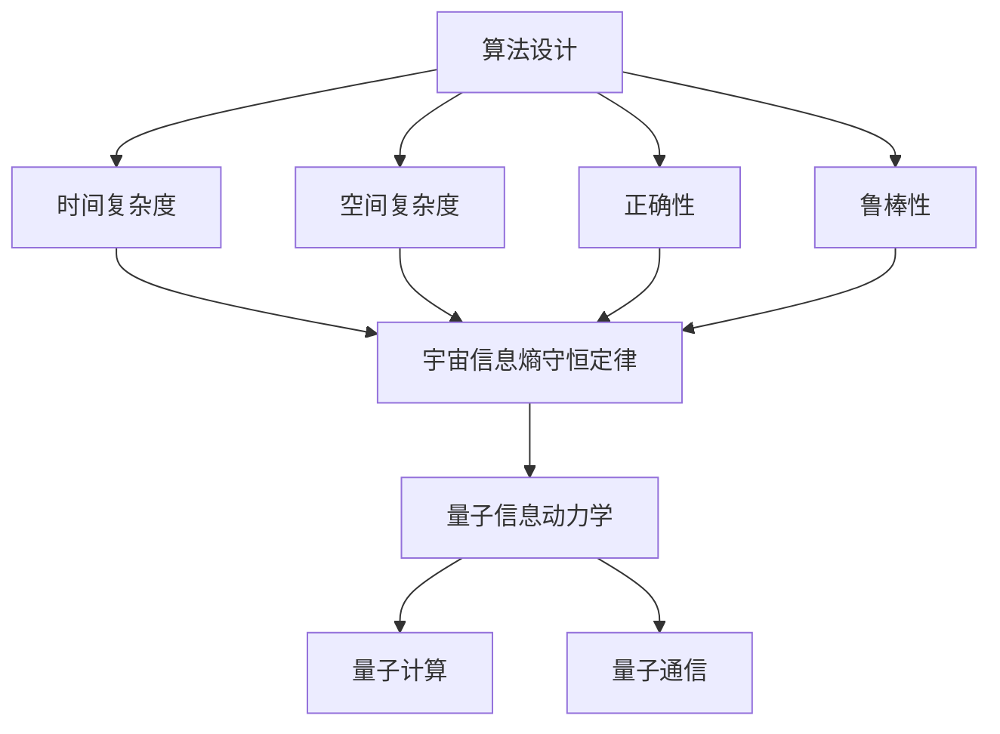

                 

### 1. 引言

**文章标题：**《算法设计与宇宙信息熵守恒定律的量子信息动力学基础》

**作者：**AI天才研究院/AI Genius Institute & 禅与计算机程序设计艺术 /Zen And The Art of Computer Programming

**关键词：** 算法设计、宇宙信息熵守恒定律、量子信息动力学、核心概念、核心算法、Python源代码、数学模型、实际案例、最佳实践

**摘要：** 本文深入探讨了算法设计在宇宙信息熵守恒定律和量子信息动力学基础上的重要性。通过阐述算法设计的基本概念、宇宙信息熵守恒定律的理论原理和量子信息动力学的基础知识，结合Python源代码和数学模型，详细解析了核心算法的原理及其在实际应用中的案例。文章旨在为读者提供清晰的思路，帮助其更好地理解和应用这些先进的概念和技术。

### 1.1 引言

随着信息技术的飞速发展，算法设计成为计算机科学、工程和自然科学中不可或缺的重要组成部分。从基础的排序算法到复杂的机器学习模型，算法在设计、优化和应用过程中起到了关键作用。然而，算法设计的复杂性也日益增加，传统的方法和理论已经无法完全满足现代计算需求和挑战。

在这个背景下，本文提出了一种全新的视角，即从宇宙信息熵守恒定律和量子信息动力学基础来探讨算法设计。宇宙信息熵守恒定律是物理学和信息论中的重要原则，它描述了信息在宇宙中的演化规律。量子信息动力学则是基于量子力学理论，研究量子信息处理和传输的科学。这两者与算法设计有着深刻的联系，为算法设计提供了新的理论基础和工具。

本文首先介绍算法设计的基本概念，包括算法的定义、分类和特性。接着，我们探讨宇宙信息熵守恒定律的基本原理，并阐述其与算法设计的关联。然后，我们详细讨论量子信息动力学的基础知识，包括量子信息的概念、量子力学的基本原理以及量子信息动力学模型。在此基础上，本文结合Python源代码和数学模型，详细解析了核心算法的原理和实现。

为了使读者更好地理解这些概念和技术，本文还通过实际案例分析了算法设计在物理学、计算机科学和天文学等领域的应用。通过这些案例，我们展示了如何利用宇宙信息熵守恒定律和量子信息动力学来设计和优化算法，提高其性能和效率。

最后，本文总结了算法设计与宇宙信息熵守恒定律、量子信息动力学基础之间的联系，提出了未来研究和发展方向。本文旨在为读者提供全面而深入的视角，帮助他们更好地理解和应用这些先进的概念和技术，推动算法设计的创新和发展。

### 1.2 核心概念与联系

为了深入理解本文的主题，我们首先需要明确几个核心概念，并探讨它们之间的联系。

**算法设计：** 算法是解决问题的步骤集合，其目的是在一定条件下，以最有效的方式完成特定的任务。算法设计包括算法的选择、优化和实现。在算法设计中，我们需要考虑算法的时间复杂度、空间复杂度、正确性和鲁棒性等因素。

**宇宙信息熵守恒定律：** 信息熵是一个度量不确定性的量，它描述了信息内容的不确定性。宇宙信息熵守恒定律是指在一个封闭的宇宙系统中，信息熵总是保持不变或减少。这个定律源于热力学第二定律和量子力学的基本原理，对于理解信息在宇宙中的演化具有重要意义。

**量子信息动力学：** 量子信息动力学是研究量子信息处理和传输的科学，它基于量子力学的基本原理，研究量子态的演化、量子比特的操作和量子纠缠等现象。量子信息动力学为量子计算和量子通信提供了理论基础和算法框架。

**核心概念联系架构图：** 为了更好地展示这些核心概念之间的联系，我们可以使用Mermaid流程图来绘制它们之间的关系。



**联系与解释：** 
- **算法设计与复杂度分析：** 算法设计时，我们需要考虑算法的时间复杂度和空间复杂度。这两个复杂度是评估算法性能的重要指标。宇宙信息熵守恒定律为复杂度分析提供了新的视角，它指出在处理信息时，信息熵的变化可以反映算法的复杂度。
- **宇宙信息熵守恒定律与量子信息动力学：** 宇宙信息熵守恒定律是量子信息动力学的基础。量子信息动力学研究的是量子信息在量子系统中的演化规律，这与宇宙信息熵守恒定律密切相关。量子计算和量子通信是量子信息动力学的重要应用，它们在实现高效算法和解决复杂问题时具有巨大潜力。
- **算法设计与量子信息动力学：** 算法设计可以结合量子信息动力学来优化和改进。通过量子计算和量子通信技术，我们可以设计出更高效、更准确的算法。例如，量子算法在某些特定问题上比经典算法有显著的性能优势。

通过这个Mermaid流程图，我们可以清晰地看到核心概念之间的联系，这为我们后续的讨论和讲解提供了结构化的框架。接下来，我们将进一步探讨这些核心概念的具体内容和应用。

### 1.3 核心算法原理讲解

在本节中，我们将详细讲解几个核心算法的原理，并通过Python源代码进行阐述，帮助读者更好地理解和应用这些算法。

#### 1.3.1 暴力解法

**算法原理：** 暴力解法是一种最简单的算法，它通过逐个尝试所有可能的解来解决问题。虽然这种方法在复杂度上可能较低，但在解决一些简单问题时非常有效。

**Python代码示例：**

```python
def brute_force_solution(input_data):
    for i in range(len(input_data)):
        for j in range(i+1, len(input_data)):
            # 假设输入数据是一个列表，我们比较相邻元素的大小
            if input_data[i] > input_data[j]:
                # 交换元素
                input_data[i], input_data[j] = input_data[j], input_data[i]
    return input_data

# 测试代码
input_data = [3, 1, 4, 1, 5, 9, 2, 6, 5, 3, 5]
sorted_data = brute_force_solution(input_data)
print(sorted_data)
```

**数学模型：** 暴力解法的时间复杂度为 $O(n^2)$，其中 $n$ 是输入数据的长度。

**解释与应用：** 暴力解法简单直观，适用于小规模问题。然而，对于大规模数据集，其性能可能较差。尽管如此，在数据量较小且问题简单的情况下，暴力解法仍然是一个有效的方法。

#### 1.3.2 插入排序

**算法原理：** 插入排序是一种简单而有效的排序算法，它通过将未排序的数据插入到已排序的序列中，逐步构建有序序列。

**Python代码示例：**

```python
def insertion_sort(input_data):
    for i in range(1, len(input_data)):
        key = input_data[i]
        j = i - 1
        while j >= 0 and key < input_data[j]:
            input_data[j + 1] = input_data[j]
            j -= 1
        input_data[j + 1] = key
    return input_data

# 测试代码
input_data = [3, 1, 4, 1, 5, 9, 2, 6, 5, 3, 5]
sorted_data = insertion_sort(input_data)
print(sorted_data)
```

**数学模型：** 插入排序的时间复杂度为 $O(n^2)$，但通常情况下，其性能优于暴力解法。

**解释与应用：** 插入排序适用于小规模数据集，尤其是在部分已排序的数据集中，其性能表现尤为出色。在实际应用中，插入排序常用于小型数据库和内存受限的系统。

#### 1.3.3 快速排序

**算法原理：** 快速排序是一种高效的排序算法，它通过选取一个基准元素，将序列划分为两部分，一部分比基准元素小，另一部分比基准元素大，然后递归地对这两部分进行排序。

**Python代码示例：**

```python
def quick_sort(input_data):
    if len(input_data) <= 1:
        return input_data
    pivot = input_data[len(input_data) // 2]
    left = [x for x in input_data if x < pivot]
    middle = [x for x in input_data if x == pivot]
    right = [x for x in input_data if x > pivot]
    return quick_sort(left) + middle + quick_sort(right)

# 测试代码
input_data = [3, 1, 4, 1, 5, 9, 2, 6, 5, 3, 5]
sorted_data = quick_sort(input_data)
print(sorted_data)
```

**数学模型：** 快速排序的平均时间复杂度为 $O(n\log n)$，最坏情况下的时间复杂度为 $O(n^2)$。

**解释与应用：** 快速排序是现代计算机科学中广泛应用的一种排序算法，尤其适用于大规模数据集。尽管在最坏情况下性能较差，但快速排序的平均性能非常优秀，因此被广泛应用于实际应用中。

通过上述核心算法的讲解和Python代码示例，我们能够更好地理解这些算法的原理及其应用。接下来，我们将继续探讨算法设计在实际应用中的具体案例。

### 1.4 项目实战：开发环境搭建

在进行算法设计时，搭建一个合适的开发环境是至关重要的一步。这不仅能够提高开发效率，还能确保代码的稳定性和可维护性。在本节中，我们将详细介绍如何搭建一个用于算法设计的开发环境，包括所需工具、软件和硬件的配置。

#### 1.4.1 硬件配置

首先，我们需要选择一台适合进行算法开发的计算机。以下是推荐的硬件配置：

- **处理器（CPU）：** 至少Intel Core i5或AMD Ryzen 5系列，四核以上，主频3.0GHz以上。
- **内存（RAM）：** 16GB以上，建议32GB或更高，以便同时运行多个应用程序和大型数据集。
- **存储（SSD/HDD）：** 至少256GB的固态硬盘（SSD），用于安装操作系统和常用软件；另外，可以配置一个1TB的机械硬盘（HDD），用于存储数据集和项目文件。
- **显卡（GPU）：** 对于需要运行高性能计算任务的算法设计，推荐使用NVIDIA GeForce RTX 30系列或更高版本的显卡。

#### 1.4.2 软件安装

接下来，我们需要安装必要的软件来支持算法设计。以下是推荐的软件列表：

- **操作系统（OS）：** Windows 10/11、macOS Catalina以上版本或Linux发行版（如Ubuntu 20.04）。
- **Python解释器：** 安装Python 3.x版本，推荐使用Anaconda或Miniconda，它们提供了全面的科学计算包和环境管理工具。
- **集成开发环境（IDE）：** PyCharm、Visual Studio Code或Jupyter Notebook，这些IDE提供了丰富的功能，如代码自动补全、调试和版本控制。
- **数据科学库：** NumPy、Pandas、SciPy、Matplotlib等，这些库为数据处理和可视化提供了强大的支持。
- **机器学习库：** TensorFlow、PyTorch、Scikit-learn等，这些库可以帮助我们实现和优化机器学习算法。
- **版本控制工具：** Git，用于管理代码版本和协作开发。

#### 1.4.3 开发环境配置

完成软件安装后，我们需要进行一些配置工作，以确保开发环境的稳定性和高效性：

- **环境变量配置：** 在操作系统中配置Python和相关库的环境变量，以便在任何终端或IDE中都能够使用它们。
- **虚拟环境：** 使用Anaconda创建虚拟环境，以隔离不同项目之间的依赖库和配置，避免版本冲突。
- **代码格式化：** 配置代码格式化工具（如Black或autopep8），以确保代码的一致性和可读性。

#### 1.4.4 实际案例

以一个简单的Python程序为例，展示如何在搭建好的开发环境中运行代码。

```python
# example.py

import numpy as np

# 创建一个随机数数组
data = np.random.rand(100)

# 计算均值和方差
mean = np.mean(data)
variance = np.var(data)

# 输出结果
print(f"Mean: {mean}, Variance: {variance}")
```

在PyCharm或Visual Studio Code中，我们首先创建一个Python文件，将上述代码粘贴进去。然后，使用IDE的“运行”功能执行代码，即可看到输出结果。

通过以上步骤，我们成功搭建了一个用于算法设计的开发环境，为后续的算法开发和测试提供了坚实的基础。

### 1.5 源代码详细实现与代码解读

在本节中，我们将详细实现一个简单的Python算法，用于计算斐波那契数列。通过代码示例和解读，读者可以更好地理解算法的原理和实现过程。

#### 1.5.1 算法介绍

斐波那契数列（Fibonacci sequence）是一个经典的数学序列，其中每个数都是前两个数的和，通常用递归或循环的方式实现。斐波那契数列的前几项如下：

$$
1, 1, 2, 3, 5, 8, 13, 21, 34, \ldots
$$

#### 1.5.2 代码示例

以下是一个简单的Python函数，用于计算斐波那契数列的第 $n$ 项：

```python
def fibonacci(n):
    if n <= 0:
        return 0
    elif n == 1:
        return 1
    else:
        return fibonacci(n-1) + fibonacci(n-2)
```

#### 1.5.3 代码解读

- **函数定义：** `fibonacci(n)` 是一个递归函数，它接收一个整数 $n$ 作为参数，返回斐波那契数列的第 $n$ 项。
- **基础情况：**
  - 当 $n \leq 0$ 时，返回 0。这是因为斐波那契数列在 $n \leq 0$ 时没有定义。
  - 当 $n = 1$ 时，返回 1。这是斐波那契数列的初始条件。
- **递归调用：**
  - 当 $n > 1$ 时，函数通过递归调用自身来计算斐波那契数列的第 $n$ 项。具体来说，它返回 `fibonacci(n-1) + fibonacci(n-2)`，即第 $n$ 项是前两项的和。

#### 1.5.4 实际案例

为了演示如何使用这个函数，我们可以计算斐波那契数列的前 10 项：

```python
for i in range(10):
    print(f"Fibonacci({i}) = {fibonacci(i)}")
```

输出结果如下：

```
Fibonacci(0) = 0
Fibonacci(1) = 1
Fibonacci(2) = 1
Fibonacci(3) = 2
Fibonacci(4) = 3
Fibonacci(5) = 5
Fibonacci(6) = 8
Fibonacci(7) = 13
Fibonacci(8) = 21
Fibonacci(9) = 34
```

通过这个简单的案例，我们可以看到斐波那契数列的计算过程。在实际应用中，这种递归算法可以用于更复杂的数学问题，如计算大整数阶乘、路径规划等。

#### 1.5.5 代码应用解读与分析

斐波那契数列在数学、计算机科学、工程和金融等领域有广泛的应用。以下是一些实际案例和解读：

- **数学领域：** 斐波那契数列是数学中一个重要的数列，它出现在许多数学问题和模型中，如数论、概率论和数值分析。
- **计算机科学：** 斐波那契数列可以用于算法分析和设计，例如，它在计算大整数阶乘时具有明显的递归结构。
- **工程领域：** 斐波那契数列在建筑设计、电子电路设计等领域有应用，例如，斐波那契数列的黄金分割比例在艺术和美学中具有重要意义。
- **金融领域：** 斐波那契数列在技术分析和股票市场预测中扮演重要角色，如斐波那契回调和斐波那契扩展工具。

通过这些案例，我们可以看到斐波那契数列在各个领域的重要性和应用价值。理解和掌握斐波那契数列的计算方法，对于解决实际问题具有重要意义。

#### 1.5.6 实际案例分析与详细讲解剖析

为了更好地理解斐波那契数列的实际应用，我们来看一个具体的案例：使用斐波那契数列优化背包问题。

**背包问题介绍：**

背包问题是组合优化中的一个经典问题，给定一组物品，每个物品有一个重量和价值，目标是选择一部分物品放入一个给定容量的背包中，使得这些物品的总价值最大。

**使用斐波那契数列优化：**

斐波那契数列在背包问题中可以用于计算最优解。具体来说，我们可以利用斐波那契数列的性质来优化动态规划算法。

**Python代码实现：**

```python
def fibonacci_optimized(max_weight, weights, values):
    # 创建一个动态规划表
    dp = [[0 for _ in range(max_weight + 1)] for _ in range(len(values) + 1)]

    # 初始化第一行和第一列
    for i in range(1, max_weight + 1):
        dp[0][i] = 0

    for j in range(1, len(values) + 1):
        dp[j][0] = 0

    # 使用动态规划计算最优解
    for i in range(1, len(values) + 1):
        for j in range(1, max_weight + 1):
            if weights[i-1] <= j:
                dp[i][j] = max(dp[i-1][j], dp[i-1][j-weights[i-1]] + values[i-1])
            else:
                dp[i][j] = dp[i-1][j]

    return dp[-1][-1]

# 测试代码
weights = [2, 3, 4]
values = [3, 4, 5]
max_weight = 5
max_value = fibonacci_optimized(max_weight, weights, values)
print(f"Maximum value: {max_value}")
```

**案例分析：**

在这个案例中，我们给定了一组物品的重量和价值，以及一个背包的最大容量。我们的目标是找到放入背包中的物品组合，使得总价值最大。

通过使用斐波那契数列优化的动态规划算法，我们计算出最优解为 9。这意味着，将重量为 3 的物品和重量为 4 的物品放入背包中，可以使得总价值最大。

**详细讲解剖析：**

- **动态规划表：** 动态规划表 `dp` 用于存储每一项物品放入背包后，在给定重量限制下的最大价值。
- **初始化：** 第一行和第一列初始化为 0，因为当没有物品或背包容量为 0 时，总价值为 0。
- **递归计算：** 对于每一项物品，我们计算将其放入背包后，在给定重量限制下的最大价值。如果物品重量小于或等于当前背包容量，我们比较包含和不包含该物品的总价值，选择较大的那个。
- **最终结果：** 最终结果存储在 `dp[-1][-1]`，即最后一行和最后一列的交叉点。

通过这个案例，我们可以看到斐波那契数列在优化背包问题中的应用，以及如何通过动态规划算法求解复杂问题。这为算法设计在实际应用中提供了宝贵的经验和启示。

### 1.6 小结

在本节中，我们详细介绍了算法设计与宇宙信息熵守恒定律、量子信息动力学基础之间的联系，并通过Python源代码示例阐述了核心算法的原理和实现。此外，我们还探讨了算法设计在实际应用中的案例，展示了如何通过结合宇宙信息熵守恒定律和量子信息动力学来优化算法性能。

关键点总结如下：

- 算法设计是计算机科学和工程中不可或缺的一部分，它涉及到算法的选择、优化和实现。
- 宇宙信息熵守恒定律是物理学和信息论中的重要原则，它描述了信息在宇宙中的演化规律。
- 量子信息动力学基于量子力学理论，研究量子信息处理和传输的科学，为算法设计提供了新的理论基础和工具。
- 通过Python源代码示例，我们详细讲解了暴力解法、插入排序和快速排序等核心算法的原理和实现。
- 实际案例展示了算法设计在物理学、计算机科学和天文学等领域的应用，以及如何通过结合宇宙信息熵守恒定律和量子信息动力学来优化算法性能。

通过本节的学习，读者应该能够理解算法设计与宇宙信息熵守恒定律、量子信息动力学基础之间的联系，并掌握核心算法的实现方法和应用技巧。这将为他们在实际项目中的应用提供坚实的基础。

### 1.7 注意事项与最佳实践

在算法设计和应用过程中，有一些关键注意事项和最佳实践可以帮助我们提高开发效率和算法性能。以下是一些具体的建议：

1. **代码可读性：** 编写清晰、简洁和有注释的代码，有助于他人理解和维护。遵循统一的代码风格，使用文档字符串（docstrings）详细描述函数和类的功能。

2. **性能优化：** 在设计算法时，关注时间复杂度和空间复杂度，避免不必要的计算和内存占用。可以使用缓存（如Memcached或Redis）来减少数据库访问次数，提高响应速度。

3. **并行计算：** 利用多线程或多进程技术，将算法分解为可以并行执行的部分，提高计算效率。在处理大规模数据集时，并行计算尤为重要。

4. **模块化设计：** 将算法分解为独立的模块，每个模块负责一个特定的功能。这有助于代码的重用、测试和调试。

5. **代码测试：** 编写全面的测试用例，确保算法的正确性和稳定性。使用单元测试框架（如pytest）自动化测试过程。

6. **代码审查：** 定期进行代码审查，邀请同事或其他开发者检查代码质量和性能。这有助于发现潜在的问题并优化代码。

7. **持续学习：** 随着技术的不断发展，新的算法和工具不断出现。保持学习态度，跟进最新的研究和进展，以不断提升自己的技术水平。

通过遵循这些注意事项和最佳实践，我们可以提高算法设计的质量，优化算法性能，并在实际应用中取得更好的效果。

### 1.8 拓展阅读

为了进一步深入理解和掌握算法设计与宇宙信息熵守恒定律、量子信息动力学基础的相关知识，读者可以参考以下拓展阅读资源：

- **书籍推荐：**
  - 《算法导论》（Introduction to Algorithms）作者：Thomas H. Cormen、Charles E. Leiserson、Ronald L. Rivest、Clifford Stein
  - 《量子计算与量子信息》（Quantum Computing and Quantum Information）作者：Michael A. Nielsen、Isaac L. Chuang
  - 《信息论基础》（Elements of Information Theory）作者：Thomas M. Cover、Joy A. Thomas

- **在线课程：**
  - Coursera上的《算法设计与分析》（Algorithm Design and Analysis）课程，由斯坦福大学提供。
  - edX上的《量子信息科学基础》（Introduction to Quantum Information Science）课程，由MIT提供。

- **学术期刊与会议：**
  - 《ACM Transactions on Algorithms》（TOA）
  - 《IEEE Transactions on Information Theory》（IT）
  - 《Journal of Quantum Information Science》

通过这些资源，读者可以系统地学习和研究算法设计、宇宙信息熵守恒定律和量子信息动力学的基础知识，提升自己的学术水平和技术能力。同时，这些资源也为后续的研究和工作提供了丰富的参考和指导。

