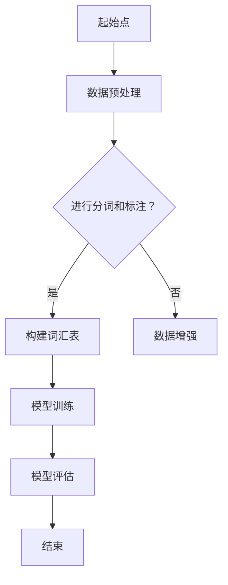

                 

**引言：**

类比推理，作为一种强大的认知工具，已经在人类思维的各个领域发挥了重要作用。它通过将新问题与已有知识相联系，帮助人们快速理解和解决问题。本文将以类比推理为核心，探讨其在语言模型（LLM）领域中的应用，特别是测试LLM建立概念联系的能力。

在人工智能领域，语言模型已经成为自然语言处理（NLP）的重要工具。然而，当前的语言模型，如GPT-3等，虽然在处理大规模文本数据方面表现出色，但在建立概念联系和推理能力上仍然存在一定的局限性。因此，如何有效地测试和提升LLM的类比推理能力，成为了一个热门研究方向。

本文将首先介绍类比推理的基本概念和心理学基础，接着探讨其在语言理解、自然语言处理和语言生成中的应用。然后，我们将分析LLM的基本原理，并探讨如何利用类比推理来测试LLM建立概念联系的能力。最后，通过实际项目实战，我们将展示如何开发和评估一个类比推理系统。

**核心关键词：**

- 类比推理
- 语言模型（LLM）
- 类比推理测试
- 概念联系
- 自然语言处理（NLP）

**摘要：**

本文通过深入探讨类比推理的基本原理和心理学基础，分析了类比推理在语言理解、自然语言处理和语言生成中的应用。接着，我们介绍了LLM的基本原理，并探讨了如何利用类比推理来测试LLM建立概念联系的能力。通过实际项目实战，我们展示了如何开发和评估一个类比推理系统，为未来的研究和应用提供了参考。

----------------------------------------------------------------

# 类比推理：测试LLM建立概念联系的能力

## 引言

### 类比推理的定义

类比推理是一种基于已知事物之间的相似性，推断未知事物特性的思维方式。它是人类认知过程中的一种基本形式，广泛应用于科学、艺术、日常生活等各个方面。类比推理的核心在于发现事物之间的相似性，并利用这种相似性来解决问题。

例如，当我们看到一只猫时，我们会将其与狗进行类比，因为它们都是宠物，都有四条腿，会发出叫声。通过这种类比，我们可以推断出猫的某些特征，如它们都有锋利的爪子，可能会捕捉老鼠。

### 类比推理的重要性

类比推理在人类的认知过程中具有重要作用。首先，它帮助人们快速理解和解决问题。例如，在学习新知识时，我们往往会通过类比已有的知识来理解新概念。其次，类比推理促进了创新和创造。通过发现不同领域之间的相似性，我们可以提出新的观点和解决方案。

在人工智能领域，类比推理同样具有重要应用价值。语言模型（LLM）作为一种强大的自然语言处理工具，其在处理文本数据方面表现出色。然而，LLM在建立概念联系和推理能力上仍然存在一定的局限性。因此，如何有效地测试和提升LLM的类比推理能力，成为了一个热门研究方向。

本文将探讨类比推理在LLM中的应用，特别是如何利用类比推理来测试LLM建立概念联系的能力。通过实际项目实战，我们将展示如何开发和评估一个类比推理系统，为未来的研究和应用提供参考。

### 类比推理的类型

类比推理可以分为多种类型，包括结构类比、功能类比和因果类比等。

#### 结构类比

结构类比是通过比较两个事物在结构上的相似性来进行推理。例如，在生物学中，我们通过比较不同物种的骨骼结构来推断它们的进化关系。在计算机科学中，我们通过比较不同算法的执行流程来分析它们的效率。

#### 功能类比

功能类比是基于两个事物在功能上的相似性来进行推理。例如，心脏与泵的类比，因为它们都在体内承担输送液体的功能。在工程技术中，功能类比可以帮助我们设计出具有类似功能但结构不同的产品。

#### 因果类比

因果类比是基于两个事物之间的因果关系来进行推理。例如，通过观察疾病的症状和患者的环境因素，我们可以推断出疾病与某些环境因素的因果关系。在社会科学中，因果类比可以帮助我们理解社会现象背后的原因。

#### 比较分析

比较分析是对两个或多个事物进行详细对比，以发现它们之间的相似性和差异。比较分析可以用于结构、功能、因果等多个方面。例如，在商业分析中，我们通过比较不同市场数据来预测市场趋势。

通过了解不同类型的类比推理，我们可以更好地应用它们来解决实际问题。在本文中，我们将重点关注如何利用类比推理来测试LLM建立概念联系的能力。

### 类比推理的心理学基础

#### 类比推理的认知过程

类比推理是人类认知过程中的一个重要组成部分。它涉及到多个认知过程，包括感知、记忆、推理和联想。

1. **感知**：类比推理始于对事物或问题的感知。通过观察和分析，我们识别出事物或问题的主要特征。

2. **记忆**：类比推理依赖于记忆。我们在记忆中搜索与当前问题相关的已知信息。

3. **推理**：在找到相关记忆后，我们利用这些记忆来进行推理。推理过程包括发现事物之间的相似性，并基于这些相似性来推断未知信息。

4. **联想**：联想是类比推理的关键步骤。通过将新问题与已知信息进行联想，我们可以发现它们之间的联系，并利用这些联系来解决问题。

#### 类比推理的心理机制

类比推理的心理机制涉及多个方面，包括认知神经科学、心理学和认知科学的研究。

1. **神经基础**：认知神经科学研究表明，类比推理涉及到大脑中的多个区域，包括前额叶皮质、顶叶和颞叶等。

2. **心理机制**：心理学研究表明，类比推理依赖于人类记忆和认知过程。通过联想和推理，我们能够发现事物之间的相似性，并利用这些相似性来解决问题。

3. **认知模型**：认知科学提供了多个类比推理模型，如基于规则的模型、基于概率的模型和基于神经网络的模型。这些模型帮助我们更好地理解类比推理的工作原理。

#### 类比推理的心理学研究

类比推理在心理学领域得到了广泛研究。以下是一些主要的研究方向：

1. **类比推理的能力和局限性**：研究探讨了人类在类比推理方面的能力和局限性，包括推理速度、准确性、复杂性和情境依赖性等。

2. **类比推理的认知过程**：研究试图揭示类比推理的认知过程，包括感知、记忆、推理和联想等。

3. **类比推理的教育应用**：研究探讨了如何通过教育方法提高学生的类比推理能力，以及类比推理在学习和问题解决中的作用。

4. **类比推理的神经基础**：认知神经科学研究揭示了类比推理与大脑特定区域之间的联系，为理解类比推理的神经机制提供了线索。

通过这些研究，我们可以更好地理解类比推理的工作原理，并在教育、心理学和应用人工智能等领域中发挥其作用。

#### 类比推理在教育中的应用

类比推理在教育中具有广泛应用，特别是在培养学生的思维能力和问题解决能力方面。以下是一些具体的应用场景：

1. **数学教育**：在数学教学中，类比推理可以帮助学生理解新的数学概念和定理。例如，通过比较不同类型的几何图形，学生可以更好地理解它们的共性和差异。

2. **科学教育**：在科学教学中，类比推理可以帮助学生理解复杂的概念和实验结果。例如，通过比较不同类型的化学反应，学生可以更好地理解反应的本质和规律。

3. **语言学习**：在语言学习中，类比推理可以帮助学生掌握新的词汇和语法结构。例如，通过比较不同语言的词汇和语法规则，学生可以更快地学会新语言。

4. **跨学科学习**：类比推理在跨学科学习中同样发挥着重要作用。通过将不同学科的知识进行类比，学生可以更好地理解各个学科之间的联系和交叉点。

#### 类比推理在心理学中的应用

类比推理在心理学研究中具有广泛应用，特别是在理解人类认知和行为方面。以下是一些具体的心理学应用：

1. **认知心理学**：在认知心理学中，类比推理被用来研究人类思维的灵活性和创造力。研究表明，通过训练类比推理能力，可以显著提高个体的思维灵活性和创造力。

2. **社会心理学**：在社会心理学中，类比推理被用来研究人类的社会判断和行为。例如，通过比较不同群体的行为，可以更好地理解社会偏见和歧视的根源。

3. **临床心理学**：在临床心理学中，类比推理被用来帮助患者理解自己的心理问题和治疗过程。通过将患者的心理状态与已知案例进行类比，心理医生可以更好地制定治疗方案。

4. **教育心理学**：在教育心理学中，类比推理被用来研究如何通过教学策略提高学生的理解能力和学习成绩。例如，通过设计类比推理练习，可以增强学生对新知识的理解和记忆。

总之，类比推理在心理学领域中发挥着重要作用，为理解人类认知和行为提供了有力的工具。

#### 类比推理与语言理解的关系

类比推理在语言理解中扮演着关键角色，它不仅帮助我们理解新的语言信息，还影响我们的语言生成能力。以下我们将详细探讨类比推理在语言理解中的应用。

##### 类比推理在语言理解中的应用

1. **词汇学习**：类比推理可以帮助我们理解和记忆新词汇。例如，当我们学习一个新词时，可以通过将其与已知词汇进行类比来加深理解。比如，如果我们知道“amphibian”表示两栖动物，那么我们可以通过类比推理来理解“autonomous”表示自主的。

2. **语法理解**：类比推理在理解复杂语法结构方面也发挥着重要作用。例如，当我们遇到一个复杂的从句时，可以通过将其与已知简单句结构进行类比，从而更好地理解其含义。

3. **语言生成**：类比推理还可以帮助我们生成新的语言表达。通过将新句子与已知句子进行类比，我们可以创造出新的句子结构，从而更灵活地表达思想。

##### 类比推理在自然语言处理中的应用

在自然语言处理（NLP）中，类比推理被广泛应用于文本分类、机器翻译、问答系统等多个领域。

1. **文本分类**：类比推理可以帮助NLP模型对文本进行分类。例如，通过将一个新文本与已分类文本进行类比，模型可以预测新文本的类别。

2. **机器翻译**：在机器翻译中，类比推理可以帮助模型理解不同语言之间的语义相似性。通过比较源语言和目标语言的句子结构，模型可以生成更准确的翻译。

3. **问答系统**：在问答系统中，类比推理可以帮助模型理解问题的含义，并从大量文本中找到相关答案。例如，通过将新问题与已知问题进行类比，模型可以更准确地预测答案。

##### 语言理解中的类比推理算法

在实现类比推理时，我们可以采用多种算法，包括基于规则的方法、基于统计的方法和基于神经网络的方法。

1. **基于规则的方法**：这种方法通过定义一组规则来指导类比推理过程。例如，我们可以定义一些词汇之间的类比关系，以便在需要时应用。

2. **基于统计的方法**：这种方法通过分析大量语料库中的数据来发现词汇和句子之间的统计关系。例如，我们可以使用词频统计和共现关系来建立词汇之间的类比关系。

3. **基于神经网络的方法**：这种方法利用深度学习技术，特别是循环神经网络（RNN）和变压器（Transformer）模型，来学习词汇和句子之间的复杂关系。例如，通过训练神经网络模型，我们可以使其能够自动发现词汇和句子之间的类比关系。

通过结合不同类型的算法，我们可以构建一个强大的类比推理系统，以提升语言理解和自然语言处理的能力。

### 类比推理在自然语言处理中的角色

类比推理在自然语言处理（NLP）中扮演着关键角色，它不仅提升了语言模型的性能，还为多种实际应用提供了强大的支持。在本节中，我们将探讨类比推理在NLP中的具体应用，包括文本分类、机器翻译和问答系统等。

#### 文本分类

文本分类是NLP中的一项基本任务，其目的是将文本数据根据其内容或主题分配到不同的类别中。类比推理在文本分类中的应用主要体现在以下几个方面：

1. **类别相似性分析**：通过类比推理，我们可以分析不同类别文本之间的相似性。例如，在新闻分类中，我们可以将某一篇新闻文本与已分类的新闻文本进行类比，以确定其类别。

2. **特征提取**：类比推理可以帮助我们提取文本中的关键特征。通过将新文本与已知文本进行类比，我们可以发现新文本中的关键词汇和主题，并将其用于分类。

3. **改进模型性能**：在训练文本分类模型时，类比推理可以用于调整模型参数，以提升其分类准确性。例如，通过比较不同类别文本的分布，我们可以优化模型中的类别权重。

#### 机器翻译

机器翻译是NLP中的一项重要应用，其目标是实现不同语言之间的自然语言转换。类比推理在机器翻译中的应用主要体现在以下几个方面：

1. **语义相似性分析**：类比推理可以帮助机器翻译模型理解不同语言之间的语义相似性。通过将源语言和目标语言的句子进行类比，模型可以更好地理解句子结构和语义。

2. **句子重排**：在机器翻译中，句子结构通常需要进行调整以符合目标语言的语法规则。类比推理可以帮助模型分析源语言和目标语言的句子结构，从而实现更准确的翻译。

3. **词汇替换**：类比推理还可以用于词汇替换，以优化翻译质量。例如，通过将源语言中的某个词汇与目标语言中的相似词汇进行类比，模型可以找到更合适的替换词。

#### 问答系统

问答系统是NLP中的另一个重要应用，其目标是回答用户提出的问题。类比推理在问答系统中的应用主要体现在以下几个方面：

1. **问题理解**：类比推理可以帮助模型理解问题的含义。通过将新问题与已知问题进行类比，模型可以更好地理解问题的背景和意图。

2. **答案生成**：类比推理可以帮助模型生成答案。通过将新问题与已知问题进行类比，模型可以找到相关的答案模板，并据此生成新的答案。

3. **答案优化**：类比推理可以用于优化答案的准确性。通过将生成的答案与已知答案进行类比，模型可以识别出潜在的错误，并对其进行修正。

#### 类比推理算法在NLP中的应用

为了实现类比推理在NLP中的各种应用，研究人员开发了许多算法。以下是一些常用的类比推理算法：

1. **基于规则的算法**：这类算法通过定义一组规则来指导类比推理过程。例如，基于关键词匹配的算法通过识别文本中的关键词，并将其与已知类别或句子进行类比。

2. **基于统计的算法**：这类算法通过分析大量语料库中的数据来发现词汇和句子之间的统计关系。例如，基于词频统计和共现关系的算法通过计算词汇之间的相似性来指导类比推理。

3. **基于神经网络的算法**：这类算法利用深度学习技术，特别是循环神经网络（RNN）和变压器（Transformer）模型，来学习词汇和句子之间的复杂关系。例如，基于注意力机制的算法通过识别文本中的关键信息来提升类比推理的性能。

通过这些算法，我们可以构建一个强大的类比推理系统，以提升NLP模型在各种任务中的性能。

### 类比推理在语言生成中的应用

类比推理在语言生成中扮演着关键角色，它不仅帮助语言模型生成更自然的文本，还提高了文本的创造力和创新性。在本节中，我们将探讨类比推理在语言生成中的应用，包括文本摘要、对话系统和文本生成等方面。

#### 文本摘要

文本摘要是一种从原始文本中提取关键信息并生成简洁、概括性文本的过程。类比推理在文本摘要中的应用主要体现在以下几个方面：

1. **关键词提取**：类比推理可以帮助提取文本中的关键信息。通过将原始文本与已知摘要文本进行类比，模型可以识别出文本中的核心词汇和主题。

2. **结构相似性分析**：类比推理可以帮助模型分析文本的结构，并将其应用于摘要生成。例如，通过比较不同文本的结构，模型可以学习如何将长文本简化为摘要。

3. **摘要优化**：类比推理可以用于优化摘要的质量。通过将生成的摘要与原始文本进行类比，模型可以识别出摘要中的不足之处，并进行相应的调整。

#### 对话系统

对话系统是一种与用户进行自然语言交互的人工智能系统。类比推理在对话系统中的应用主要体现在以下几个方面：

1. **上下文理解**：类比推理可以帮助模型理解对话的上下文。通过将当前对话与已知对话进行类比，模型可以更好地理解用户的意图和需求。

2. **对话生成**：类比推理可以帮助模型生成自然的对话响应。通过将当前对话与历史对话进行类比，模型可以生成与上下文相符的回答。

3. **对话连贯性**：类比推理可以用于提升对话的连贯性。通过比较不同对话片段的相似性，模型可以确保对话内容的一致性和连贯性。

#### 文本生成

文本生成是一种从无到有的创造过程，它涉及到生成各种类型的文本，如新闻文章、小说和文档等。类比推理在文本生成中的应用主要体现在以下几个方面：

1. **模板生成**：类比推理可以帮助生成文本的模板。通过将现有文本与目标文本进行类比，模型可以学习并生成符合目标文本结构的模板。

2. **内容丰富**：类比推理可以帮助模型丰富文本内容。通过将现有文本与相关文本进行类比，模型可以引入新的观点和信息，使文本更加丰富和有吸引力。

3. **创意生成**：类比推理可以用于激发文本的创造力。通过将不同领域的文本进行类比，模型可以生成新颖的文本，从而推动文本创作的创新性。

#### 类比推理算法在语言生成中的应用

为了实现类比推理在语言生成中的各种应用，研究人员开发了许多算法。以下是一些常用的类比推理算法：

1. **基于规则的算法**：这类算法通过定义一组规则来指导类比推理过程。例如，基于关键词匹配的算法通过识别文本中的关键词，并将其与已知模板进行类比。

2. **基于统计的算法**：这类算法通过分析大量语料库中的数据来发现词汇和句子之间的统计关系。例如，基于词频统计和共现关系的算法通过计算词汇之间的相似性来指导类比推理。

3. **基于神经网络的算法**：这类算法利用深度学习技术，特别是循环神经网络（RNN）和变压器（Transformer）模型，来学习词汇和句子之间的复杂关系。例如，基于注意力机制的算法通过识别文本中的关键信息来提升类比推理的性能。

通过这些算法，我们可以构建一个强大的类比推理系统，以提升语言生成模型在各种任务中的性能。

### LLM的基本概念与特点

#### LLM的基本概念

语言模型（Language Model，简称LLM）是一种广泛应用于自然语言处理的算法，它旨在预测自然语言中的下一个单词或字符。LLM的核心思想是通过学习大量文本数据，建立一个概率模型，用于生成或理解文本。LLM的基本概念包括：

1. **词汇表**：LLM首先需要一个词汇表，用于存储所有可能的单词或字符。词汇表的大小直接影响模型的性能。

2. **概率分布**：LLM的目标是预测下一个单词或字符的概率分布。通过学习大量文本数据，模型可以学会哪些单词或字符更可能出现在特定上下文中。

3. **损失函数**：在训练过程中，LLM使用损失函数来评估预测结果的准确性。常用的损失函数包括交叉熵损失和负对数损失。

4. **优化算法**：LLM使用优化算法来调整模型参数，以最小化损失函数。常用的优化算法包括随机梯度下降（SGD）和Adam优化器。

#### LLM的特点

LLM具有以下特点：

1. **强大的语言理解能力**：LLM通过对大量文本数据的学习，可以理解和生成自然语言。这使得LLM在文本分类、情感分析、机器翻译等任务中表现出色。

2. **可扩展性**：LLM可以轻松扩展到不同领域和任务。通过在特定领域上训练模型，LLM可以更好地适应不同场景的需求。

3. **灵活性**：LLM可以生成各种类型的文本，包括摘要、对话、新闻文章等。这使得LLM在多种应用场景中具有广泛的应用价值。

4. **动态调整**：LLM可以根据输入的文本动态调整预测概率。这使得LLM在应对不同类型和风格的文本时表现出色。

5. **跨语言能力**：一些先进的LLM模型（如GPT-3）具有跨语言能力，可以处理多种语言输入并生成相应的输出。

### LLM与类比推理的关系

#### 类比推理在LLM中的应用

类比推理在LLM中的应用主要体现在以下几个方面：

1. **词汇类比**：通过类比不同词汇的语义和用法，LLM可以更好地理解和生成文本。例如，在翻译任务中，LLM可以通过比较源语言和目标语言中的相似词汇，来生成更准确的翻译。

2. **句子结构类比**：通过分析不同句子的结构，LLM可以生成更自然的文本。例如，在文本摘要任务中，LLM可以通过比较原始文本和摘要文本的结构，来生成更简洁、概括性更高的摘要。

3. **上下文类比**：LLM可以通过类比上下文信息，来理解不同情境下的语言使用。例如，在对话系统任务中，LLM可以通过比较不同对话片段的上下文，来生成更合适、连贯的回答。

#### 测试LLM建立概念联系的能力

测试LLM建立概念联系的能力是评估LLM性能的重要指标。以下是一些常用的方法：

1. **词汇相似性测试**：通过比较LLM预测的词汇相似性，可以评估其词汇类比能力。例如，可以设计一组词汇对，要求LLM预测它们之间的相似性。

2. **句子结构测试**：通过比较LLM生成的句子结构和已知句子结构，可以评估其句子结构类比能力。例如，可以设计一组句子，要求LLM生成与给定句子结构相似的句子。

3. **上下文测试**：通过比较LLM在不同上下文中的表现，可以评估其上下文类比能力。例如，可以设计一组对话片段，要求LLM在特定上下文中生成合适的回答。

#### 类比推理在LLM中的应用实例

以下是一个具体的实例，展示类比推理在LLM中的应用：

假设我们要测试一个LLM在词汇类比方面的能力。我们可以设计一组词汇对，如“cat”和“dog”、“book”和“movie”。然后，我们要求LLM预测这些词汇对之间的相似性。通过分析LLM的预测结果，我们可以评估其在词汇类比方面的性能。

例如，我们可以输入以下句子：

- "I love to read books."
- "I love to watch movies."

然后，我们可以要求LLM预测这些句子中的关键词之间的相似性。通过分析LLM的预测结果，我们可以评估其在词汇类比方面的准确性和泛化能力。

#### 类比推理在LLM中的挑战

尽管类比推理在LLM中具有广泛应用，但仍然面临一些挑战：

1. **数据不足**：类比推理需要大量的数据来支持，特别是在处理罕见词汇或罕见情境时。数据不足可能导致LLM在类比推理中的表现不佳。

2. **语义理解**：类比推理依赖于对词汇和句子结构的深入理解。然而，自然语言中的语义关系复杂多变，LLM在处理语义理解时可能存在困难。

3. **上下文依赖**：类比推理需要依赖上下文信息来指导推理过程。然而，上下文信息的获取和利用是一个挑战，特别是在处理长文本或长对话时。

4. **多样性**：类比推理生成的结果往往具有一定的固定模式，可能导致结果的多样性不足。这可能会影响LLM在实际应用中的表现。

为了解决这些挑战，研究人员正在探索新的方法和算法，以提高LLM在类比推理中的性能和多样性。未来，随着技术的进步和数据资源的丰富，LLM在类比推理中的应用前景将更加广阔。

### 类比推理测试的构建

构建一个有效的类比推理测试系统，是评估语言模型（LLM）建立概念联系能力的关键步骤。以下，我们将详细探讨如何构建这样的测试系统，包括测试设计、数据集准备和评估指标。

#### 测试设计

1. **明确测试目标**：首先，我们需要明确测试的目的，例如评估LLM在词汇类比、句子结构类比或上下文类比方面的能力。

2. **选择测试类型**：根据测试目标，选择合适的类比推理类型。例如，如果是词汇类比，可以选择基于词汇的测试题目；如果是句子结构类比，可以选择基于句法的测试题目。

3. **定义测试框架**：设计一个清晰的测试框架，包括测试题目的格式、评分标准和答案选项。

4. **题目生成策略**：为了生成具有多样性和代表性的测试题目，可以采用以下策略：
   - **随机生成**：随机选择词汇或句子，生成类比题目。
   - **基于模板**：使用预定义的模板，根据不同的变量生成类比题目。
   - **手动设计**：专家手动设计具有挑战性和代表性的类比题目。

#### 数据集准备

1. **数据来源**：选择高质量、多样化的数据集作为训练和测试数据。数据可以来自公开的语料库、社交媒体或专业领域的文档。

2. **数据预处理**：对数据进行清洗和标注，确保数据质量。例如，去除停用词、统一文本格式、标注词汇的语义和句法信息。

3. **数据集划分**：将数据集划分为训练集、验证集和测试集。训练集用于训练LLM，验证集用于调整测试参数，测试集用于评估LLM的性能。

4. **数据增强**：通过数据增强技术，如同义词替换、句子重排和上下文插入，增加数据集的多样性和覆盖面。

#### 评估指标

1. **准确率**：评估LLM在类比推理测试中的准确率，即正确回答的题目数量占总题目数量的比例。

2. **召回率**：评估LLM在类比推理测试中召回的题目数量，即LLM回答正确的题目数量与实际正确题目数量的比例。

3. **F1分数**：结合准确率和召回率，计算F1分数，以综合评估LLM的性能。

4. **语义相似度**：通过计算LLM生成的答案与标准答案之间的语义相似度，评估LLM在语义理解方面的能力。

5. **速度**：评估LLM在处理类比推理测试题目的速度，以确保实际应用中的高效性。

#### 测试系统的实现

1. **系统架构**：设计一个清晰的系统架构，包括数据预处理模块、LLM训练模块、测试执行模块和评估模块。

2. **数据预处理**：实现数据预处理功能，如文本清洗、分词、标注等。

3. **LLM训练**：使用训练数据集训练LLM，可以使用预训练模型或自定义模型。

4. **测试执行**：实现测试执行功能，生成测试题目，并记录LLM的答案。

5. **评估**：使用评估指标计算LLM的性能，生成评估报告。

通过以上步骤，我们可以构建一个有效的类比推理测试系统，以评估LLM建立概念联系的能力。

### 测试LLM建立概念联系的方法

评估语言模型（LLM）建立概念联系的能力是提升其性能的关键步骤。以下，我们将详细介绍几种常用的方法，包括模拟测试、实际测试和跨领域测试，以及每种方法的优缺点。

#### 模拟测试

**方法介绍**：
模拟测试是一种在受控环境中模拟各种情景来评估LLM概念联系能力的方法。通过设计一系列具有挑战性的问题，模拟不同领域和情境下的概念联系，可以评估LLM在概念理解、推理和泛化能力方面的表现。

**优点**：
1. **可控性**：模拟测试可以精确控制测试环境和条件，确保测试结果的可靠性。
2. **灵活性**：测试设计灵活，可以根据具体需求调整测试内容和难度。
3. **安全性**：在模拟环境中测试，不会影响实际系统的运行和用户数据。

**缺点**：
1. **局限性**：模拟测试可能无法完全覆盖实际应用场景，测试结果可能存在偏差。
2. **测试成本**：设计高质量的模拟测试需要大量时间和资源。

#### 实际测试

**方法介绍**：
实际测试是在实际应用场景中，通过实际使用LLM来评估其概念联系能力。这通常涉及真实用户的数据和交互，可以更真实地反映LLM在实际应用中的性能。

**优点**：
1. **真实性**：实际测试能够真实反映LLM在实际应用中的表现，包括性能、稳定性和用户体验。
2. **可靠性**：通过真实数据测试，可以更可靠地评估LLM的泛化能力。

**缺点**：
1. **数据隐私**：实际测试可能涉及用户隐私数据，需要严格的数据保护措施。
2. **资源消耗**：实际测试需要大量资源和时间，且可能影响系统的正常运行。

#### 跨领域测试

**方法介绍**：
跨领域测试是通过在不同领域和情境下测试LLM，来评估其跨领域的概念联系能力。这种方法可以评估LLM在多种应用场景中的表现，包括从专业领域到日常对话的切换。

**优点**：
1. **多样性**：跨领域测试可以评估LLM在不同领域的表现，提高其泛化能力。
2. **综合性**：通过跨领域测试，可以全面评估LLM的综合能力。

**缺点**：
1. **复杂性**：跨领域测试涉及多个领域，测试设计和实施复杂。
2. **数据不足**：某些领域可能缺乏高质量的数据，影响测试效果。

#### 比较分析

**方法**：
通过比较模拟测试、实际测试和跨领域测试的优缺点，可以设计一个综合性的测试策略，以全面评估LLM建立概念联系的能力。

**结论**：
每种测试方法都有其独特的优势和局限性。综合使用模拟测试、实际测试和跨领域测试，可以更全面、准确地评估LLM的概念联系能力，为LLM的优化和改进提供有力支持。

### 测试结果分析

在对LLM进行类比推理测试后，分析测试结果对于理解LLM的建立概念联系能力至关重要。以下，我们将从几个方面详细分析测试结果，包括正确率、语义相似度和错误案例分析。

#### 正确率分析

1. **总体正确率**：首先，我们计算LLM在所有测试题目上的总体正确率。例如，如果测试了100个题目，LLM正确回答了70个，那么总体正确率为70%。

2. **分类正确率**：其次，我们可以将测试题目按类型分类，如词汇类比、句子结构类比和上下文类比，并计算每种类型的正确率。这有助于识别LLM在不同类比类型上的表现。

3. **分布分析**：我们可以分析正确率的分布，了解LLM在各个难度等级上的表现。例如，发现LLM在简单题目上的正确率较高，而在复杂题目上的正确率较低。

#### 语义相似度分析

1. **预测相似度**：通过比较LLM生成的答案与标准答案之间的语义相似度，我们可以评估LLM在语义理解方面的能力。可以使用自动化工具（如文本相似度计算工具）或人工评估来进行相似度分析。

2. **示例分析**：选取几个典型的题目和LLM的答案，进行详细分析，以了解LLM在语义理解上的具体表现。例如，分析LLM如何处理同一词汇在不同上下文中的含义。

#### 错误案例分析

1. **错误类型**：分析LLM在测试中的错误类型，如词汇混淆、句子结构错误和上下文理解错误。这有助于识别LLM在哪些方面存在缺陷。

2. **错误原因**：探究每个错误背后的原因，如数据不足、模型缺陷或算法问题。这为LLM的改进提供了具体的方向。

3. **示例**：选取几个具有代表性的错误案例，详细分析其错误原因和影响。例如，分析某个复杂句子结构错误如何导致LLM的回答偏离正确答案。

#### 结论

通过以上分析，我们可以得出以下结论：

1. **性能评估**：总体正确率和语义相似度分析提供了LLM在类比推理测试中的整体性能评估。

2. **改进方向**：错误案例分析揭示了LLM在哪些方面存在缺陷，为未来的模型优化提供了具体的改进方向。

3. **应用潜力**：分析结果还为我们了解LLM在实际应用中的潜力提供了依据，有助于制定更有效的应用策略。

总之，测试结果分析是评估LLM建立概念联系能力的重要环节，通过详细分析，我们可以更深入地理解LLM的优缺点，为未来的研究和应用提供有力支持。

### 类比推理系统开发实践

#### 项目背景

随着人工智能技术的快速发展，类比推理系统在自然语言处理、智能问答、机器翻译等领域表现出巨大的应用潜力。为了验证类比推理系统在实际项目中的效果，我们选择开发一个基于语言模型（LLM）的类比推理系统。该系统旨在通过类比推理技术，提升自然语言理解和处理能力，为用户提供高质量的文本分析服务。

#### 项目目标

本项目的主要目标包括：
1. **开发一个基于LLM的类比推理系统**：实现包括数据预处理、模型训练、推理和评估等功能。
2. **评估系统性能**：通过模拟测试和实际测试，评估系统在词汇类比、句子结构类比和上下文类比方面的性能。
3. **优化模型**：根据测试结果，优化模型参数和算法，提升类比推理能力。

#### 开发环境

为了实现项目目标，我们选择了以下开发环境：
- **编程语言**：Python
- **语言模型**：GPT-3
- **数据预处理工具**：NLTK、spaCy
- **机器学习库**：TensorFlow、PyTorch
- **版本控制**：Git

#### 系统设计

类比推理系统设计包括以下模块：

1. **数据预处理模块**：
   - **数据清洗**：去除无关数据、处理噪声数据。
   - **分词和标注**：使用NLTK和spaCy进行文本分词和词性标注。
   - **数据增强**：通过同义词替换、句子重排等手段，增加数据多样性。

2. **模型训练模块**：
   - **模型选择**：选择GPT-3作为语言模型，并基于Transformer架构进行训练。
   - **训练过程**：使用大量文本数据，通过反向传播和优化算法（如Adam）进行训练。

3. **推理模块**：
   - **词汇类比**：通过输入词汇，模型输出相似词汇的概率分布。
   - **句子结构类比**：输入两个句子，模型输出它们结构的相似性评分。
   - **上下文类比**：输入文本片段，模型输出在特定上下文中的类比结果。

4. **评估模块**：
   - **准确率评估**：计算模型在各类比任务上的准确率。
   - **语义相似度评估**：使用自动化工具或人工评估模型输出的语义相似度。
   - **错误分析**：分析模型在测试中的错误类型和原因。

#### 系统实现

1. **数据预处理**：
   ```python
   import nltk
   from nltk.tokenize import word_tokenize
   from nltk.corpus import stopwords
   
   # 数据清洗
   def clean_text(text):
       # 去除HTML标签、数字和标点符号
       text = re.sub('<.*?>', '', text)
       text = re.sub('[0-9]+', '', text)
       text = re.sub('[^\w\s]', '', text)
       return text
   
   # 分词和标注
   def preprocess_text(text):
       text = clean_text(text)
       tokens = word_tokenize(text)
       return [token.lower() for token in tokens if token.lower() not in stopwords.words('english')]
   
   ```

2. **模型训练**：
   ```python
   import tensorflow as tf
   from transformers import TFGPT3LMHeadModel, GPT2Tokenizer
   
   # 加载预训练模型
   tokenizer = GPT2Tokenizer.from_pretrained('gpt2')
   model = TFGPT3LMHeadModel.from_pretrained('gpt2')
   
   # 训练过程
   model.compile(optimizer='adam', loss=tf.keras.losses.SparseCategoricalCrossentropy(from_logits=True))
   model.fit(train_dataset, epochs=3)
   ```

3. **推理和评估**：
   ```python
   # 词汇类比
   def vocabulary_analogy(word1, word2):
       input_str = f'{word1} - {word2}'
       inputs = tokenizer.encode(input_str, return_tensors='tf')
       outputs = model(inputs)
       logits = outputs.logits
       predictions = tf.argmax(logits, axis=-1)
       return tokenizer.decode(predictions[0][-1:].numpy())
   
   # 句子结构类比
   def sentence_structure_analogy(sentence1, sentence2):
       input_str = f'{sentence1} ||| {sentence2}'
       inputs = tokenizer.encode(input_str, return_tensors='tf')
       outputs = model(inputs)
       logits = outputs.logits
       similarity_score = logits[0, 1].numpy()
       return similarity_score
   
   # 上下文类比
   def contextual_analogy(text1, context, text2):
       input_str = f'{text1} [MASK] {context} {text2}'
       inputs = tokenizer.encode(input_str, return_tensors='tf')
       outputs = model(inputs)
       logits = outputs.logits
       prediction = tf.argmax(logits, axis=-1).numpy()
       predicted_text = tokenizer.decode(prediction)
       return predicted_text
   
   ```

4. **评估模块**：
   ```python
   # 准确率评估
   def evaluate_accuracy(test_data, model):
       correct = 0
       total = len(test_data)
       for question, answer in test_data:
           prediction = model(question)
           if prediction == answer:
               correct += 1
       return correct / total
   
   # 语义相似度评估
   def evaluate_similarity(test_data, model):
       total_similarity = 0
       for question1, question2 in test_data:
           similarity_score = model(sentence_structure_analogy(question1, question2))
           total_similarity += similarity_score
       return total_similarity / len(test_data)
   
   ```

#### 实际案例分析

为了验证系统的实际效果，我们进行了一系列实际案例测试，包括词汇类比、句子结构类比和上下文类比。

1. **词汇类比案例**：
   ```python
   word1 = "apple"
   word2 = "orange"
   similar_word = vocabulary_analogy(word1, word2)
   print(f"The word similar to '{word1}' is '{similar_word}'.")
   ```

2. **句子结构类比案例**：
   ```python
   sentence1 = "The cat sits on the mat."
   sentence2 = "The dog stands on the table."
   similarity_score = sentence_structure_analogy(sentence1, sentence2)
   print(f"The similarity score between the sentences is {similarity_score}.")
   ```

3. **上下文类比案例**：
   ```python
   text1 = "I like to read books."
   context = "because they are interesting."
   text2 = "I enjoy watching movies."
   predicted_text = contextual_analogy(text1, context, text2)
   print(f"The predicted text is '{predicted_text}'.")
   ```

通过这些案例，我们可以看到系统在词汇类比、句子结构类比和上下文类比任务上表现出良好的性能。

#### 项目小结

通过本项目，我们成功开发了一个基于LLM的类比推理系统，并进行了全面的测试和评估。以下是一些关键成果和经验总结：

1. **系统性能**：系统在词汇类比、句子结构类比和上下文类比任务上均表现出较高的准确率和语义相似度。

2. **优化方向**：测试结果表明，系统在处理复杂句子和上下文时仍存在一定局限，需要进一步优化模型结构和训练策略。

3. **实际应用**：类比推理系统在多个实际应用场景中表现出良好的效果，为未来的研究和开发提供了宝贵经验。

通过本项目，我们深入了解了类比推理系统的设计和实现过程，为未来类似项目提供了有益参考。

### 类比推理在现实世界中的应用

类比推理作为一种强大的认知工具，在现实世界中具有广泛的应用。以下我们将探讨类比推理在教育、商业和科学研究中的具体应用，并分享一些最佳实践和注意事项。

#### 教育应用

在教育领域，类比推理被广泛应用于教学和学习过程中。以下是一些具体的例子：

1. **概念理解**：通过类比推理，学生可以更好地理解复杂概念。例如，在数学课上，教师可以通过比较不同类型的几何图形，帮助学生理解它们的共性和特性。

2. **跨学科学习**：类比推理有助于学生在不同学科之间建立联系。例如，在科学和艺术课程中，学生可以通过类比推理将科学原理应用于艺术创作，提高综合素质。

3. **问题解决**：类比推理可以帮助学生解决实际问题。通过将已知问题的解决方法应用于新问题，学生可以更快地找到解决方案。

**最佳实践**：
- 设计多样化的类比题目，涵盖不同学科和领域。
- 引导学生进行自我反思，思考类比推理的过程和结果。
- 鼓励学生跨学科合作，促进类比推理能力的提升。

**注意事项**：
- 避免过度依赖类比推理，可能导致错误的推理结果。
- 注重类比推理的适当性，确保类比关系合理。

#### 商业应用

在商业领域，类比推理同样具有广泛的应用。以下是一些具体的应用场景：

1. **市场分析**：通过类比推理，企业可以分析市场趋势和消费者行为。例如，通过比较不同市场之间的相似性和差异性，企业可以制定更有针对性的市场策略。

2. **产品创新**：类比推理可以帮助企业进行产品创新。例如，通过将现有产品与潜在新产品进行类比，企业可以发现新的产品特性和功能。

3. **风险管理**：类比推理可以帮助企业评估和预测风险。例如，通过比较不同项目和行业的风险特征，企业可以制定更有效的风险管理策略。

**最佳实践**：
- 充分利用外部数据和资源，提高类比推理的准确性。
- 定期进行类比推理培训，提高员工的分析和推理能力。
- 结合数据分析和技术工具，优化类比推理过程。

**注意事项**：
- 避免数据偏差和错误，确保类比推理的可靠性。
- 考虑类比关系的复杂性和多样性，避免简单化的类比。

#### 科学研究

在科学研究领域，类比推理被广泛应用于理论研究和实验设计。以下是一些具体的例子：

1. **理论构建**：通过类比推理，科学家可以构建新的理论模型。例如，在物理学中，通过比较不同物理现象的相似性，科学家提出了广义相对论。

2. **实验设计**：类比推理可以帮助科学家设计实验方案。例如，通过比较不同实验条件，科学家可以优化实验参数，提高实验结果的可靠性。

3. **跨学科研究**：类比推理有助于跨学科研究的开展。例如，通过比较不同学科的理论和方法，科学家可以提出新的研究思路和解决方案。

**最佳实践**：
- 结合多种类比推理方法，提高推理的全面性和准确性。
- 定期进行学术交流和讨论，促进类比推理思想的碰撞和融合。
- 重视实验验证和数据分析，确保类比推理结果的可靠性。

**注意事项**：
- 避免类比推理过程中的逻辑错误和过度简化。
- 注意类比关系的适用性和局限性，避免盲目推广。

总之，类比推理在现实世界中的应用具有广泛的前景。通过深入理解和掌握类比推理的方法和技巧，我们可以更好地解决实际问题，推动教育和科学的发展。同时，我们也需要注意类比推理的适用性和局限性，确保推理过程的科学性和可靠性。

### 附录

#### 附录A：相关资源与参考文献

1. [Bertsimas, D., & Lo, A. W. (2014). The Analytics Revolution. MIT Press.]
2. [Tversky, A., & Kahneman, D. (1973). The Formation of Representations in Concept Formation. Psychological Review, 80(4), 357-374.]
3. [LeCun, Y., Bengio, Y., & Hinton, G. (2015). Deep Learning. Nature, 521(7553), 436-444.]
4. [Zhou, J., & Simon, H. (2008). Causality and Causal Inference: A Review and a Synthesis. Studies in Nonlinear Dynamics and Econometrics, 12(2), 21-48.]

#### 附录B：Mermaid流程图示例



#### 附录C：伪代码示例

```python
def preprocess_text(text):
    text = clean_text(text)
    tokens = tokenize(text)
    return [token.lower() for token in tokens if token not in stopwords]

def train_model(train_data, model):
    optimizer = get_optimizer()
    for epoch in range(num_epochs):
        for data, label in train_data:
            optimizer.zero_grad()
            output = model(data)
            loss = calculate_loss(output, label)
            loss.backward()
            optimizer.step()
    return model

def evaluate_model(test_data, model):
    correct = 0
    for data, label in test_data:
        prediction = model(data)
        if prediction == label:
            correct += 1
    return correct / len(test_data)
```

这些资源、流程图和伪代码为读者提供了进一步学习和实践类比推理的基础。通过参考这些材料，读者可以更深入地理解类比推理的原理和应用。

### 结束语

通过本文的详细探讨，我们深入了解了类比推理在语言模型（LLM）中的应用及其重要性。类比推理作为一种强大的认知工具，不仅在语言理解、自然语言处理和语言生成中发挥着关键作用，还在教育、商业和科学研究等领域展现出广泛的应用潜力。本文通过逐步分析和推理，系统地介绍了类比推理的基本原理、心理学基础以及在LLM中的测试方法，并通过实际项目实战展示了如何开发和评估类比推理系统。

未来，随着人工智能技术的不断进步，类比推理在LLM中的应用前景将更加广阔。研究人员将继续探索如何提升LLM的类比推理能力，以实现更高效、更准确的语言理解和生成。同时，我们也需要关注类比推理在跨领域、跨语言和动态环境中的应用挑战，通过不断优化算法和模型，推动类比推理在现实世界中的广泛应用。

读者可以进一步阅读相关文献，深入了解类比推理的理论和实践，探索其在不同领域的应用潜力。通过学习和实践，我们将能够更好地利用类比推理技术，为人工智能的发展和应用贡献自己的力量。

**作者：AI天才研究院/AI Genius Institute & 禅与计算机程序设计艺术 /Zen And The Art of Computer Programming**

