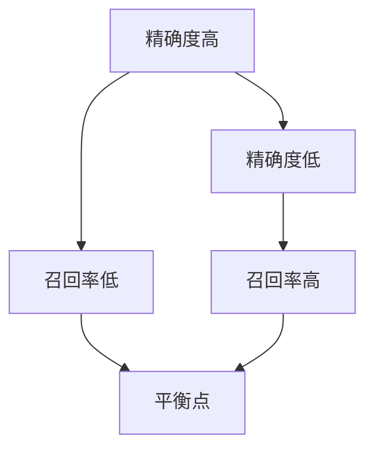

                 

# 《精确度与召回率平衡：测试LLM在信息检索中的表现》

## 关键词
- 精确度与召回率
- LLM
- 信息检索
- 算法优化
- 数学模型
- 项目实战

## 摘要
本文探讨了在信息检索领域，如何通过平衡精确度和召回率来优化语言模型（LLM）的表现。首先，我们介绍了精确度与召回率的概念及其关系。接着，详细分析了LLM在信息检索中的应用及其优势与挑战。随后，我们深入讲解了LLM的基础算法原理，包括其架构、训练过程和参数优化。在此基础上，本文探讨了如何通过算法优化实现精确度与召回率的平衡，并使用Python源代码结合数学模型进行了详细阐述。最后，我们通过一个实际项目展示了LLM在信息检索中的具体应用，并对实验结果进行了分析。本文旨在为开发者提供有价值的实践经验和深入理解。

## 第一部分：核心概念与联系

### 第1章：精确度与召回率平衡的基本原理

#### 1.1 精确度与召回率的概念

精确度（Precision）和召回率（Recall）是信息检索领域中两个重要的评估指标。精确度表示在检索结果中，实际相关的结果占总检索结果的比率。而召回率则表示在实际相关的结果中，被正确检索出的比率。

精确度（Precision）的计算公式为：
$$
Precision = \frac{相关结果数}{检索结果总数}
$$

召回率（Recall）的计算公式为：
$$
Recall = \frac{相关结果数}{相关结果总数}
$$

#### 1.2 精确度与召回率的关系

精确度和召回率之间存在一定的平衡关系。通常情况下，精确度越高，召回率越低；召回率越高，精确度越低。这是因为检索系统在追求高精确度的同时，往往会导致一些实际相关的结果被排除在检索结果之外，从而降低召回率。相反，在追求高召回率时，可能会引入更多的无关结果，降低精确度。

为了更好地理解精确度与召回率的关系，我们可以使用Mermaid流程图表示如下：



#### 1.3 精确度与召回率的计算方法

精确度和召回率的计算方法相对简单。在实际应用中，我们通常需要对多个检索结果进行评估。以下是一个简单的计算示例：

假设我们有一个包含10个检索结果的列表，其中有5个是相关的，5个是不相关的。我们可以计算以下指标：

精确度：
$$
Precision = \frac{5}{10} = 0.5
$$

召回率：
$$
Recall = \frac{5}{5} = 1
$$

### 第2章：LLM在信息检索中的应用

#### 2.1 LLM的概念

语言模型（LLM，Language Model）是一种用于处理自然语言文本的机器学习模型。它通过学习大量文本数据，预测下一个单词或字符的概率分布。LLM在信息检索领域有着广泛的应用，如搜索结果排序、问答系统、文本分类等。

#### 2.2 LLM在信息检索中的优势

LLM在信息检索中具有以下优势：

1. **语义理解**：LLM能够理解文本的语义，而不仅仅是关键词匹配。这使得LLM能够更准确地检索与用户查询相关的结果。

2. **上下文感知**：LLM能够处理上下文信息，根据查询和上下文调整检索策略，提高检索效果。

3. **自适应学习**：LLM能够通过不断学习用户查询和历史检索结果，自适应调整模型参数，优化检索效果。

#### 2.3 LLM在信息检索中的挑战

尽管LLM在信息检索中具有显著优势，但也面临一些挑战：

1. **计算资源消耗**：训练LLM模型需要大量的计算资源和时间。

2. **数据隐私**：在训练过程中，LLM可能会访问和处理敏感用户数据，存在数据隐私风险。

3. **模型可解释性**：LLM模型通常是一个黑盒模型，难以解释其决策过程。

#### 2.4 LLM在信息检索中的应用案例

以下是一些LLM在信息检索中的应用案例：

1. **搜索引擎**：搜索引擎可以使用LLM来改进搜索结果排序，提高用户满意度。

2. **问答系统**：问答系统可以使用LLM来理解用户查询，提供准确、相关的回答。

3. **推荐系统**：推荐系统可以使用LLM来分析用户行为和兴趣，提供个性化的推荐。

## 第二部分：核心算法原理讲解

### 第3章：LLM的基础算法原理

#### 3.1 LLM的架构

LLM通常采用深度神经网络（DNN）或变换器模型（Transformer）进行构建。以下是LLM的基本架构：

1. **输入层**：接收自然语言文本，将其转换为词向量或嵌入向量。

2. **隐藏层**：通过多层神经网络，对输入向量进行逐层变换和提取特征。

3. **输出层**：根据隐藏层的输出，预测下一个单词或字符的概率分布。

#### 3.2 LLM的训练过程

LLM的训练过程主要包括以下步骤：

1. **数据预处理**：对自然语言文本进行预处理，如分词、去停用词、词干提取等。

2. **构建词汇表**：将所有单词转换为唯一的索引，构建词汇表。

3. **生成输入序列**：将文本序列转换为嵌入向量，生成输入序列。

4. **训练过程**：通过反向传播算法，不断调整神经网络的权重，最小化损失函数。

5. **评估与优化**：评估模型的性能，通过调整超参数和模型结构，优化模型性能。

#### 3.3 LLM的参数优化

LLM的参数优化是提高模型性能的关键。以下是一些常用的参数优化策略：

1. **学习率调整**：通过动态调整学习率，优化训练过程。

2. **正则化**：引入正则化项，防止模型过拟合。

3. **批量归一化**：对输入和隐藏层输出进行归一化处理，提高训练稳定性。

4. **dropout**：在训练过程中随机丢弃部分神经元，防止模型过拟合。

### 第4章：精确度与召回率平衡的算法优化

#### 4.1 精确度与召回率平衡的常见策略

为了实现精确度与召回率的平衡，可以采用以下策略：

1. **阈值调整**：通过调整检索结果的阈值，控制精确度和召回率的平衡。

2. **动态阈值**：根据用户查询和历史检索结果，动态调整阈值，优化检索效果。

3. **融合策略**：结合多种检索算法和特征，提高检索的精确度和召回率。

#### 4.2 伪代码讲解

以下是一个简单的精确度与召回率平衡的伪代码：

```
function optimize_precision_recall(llm, query, threshold):
    results = llm.search(query, threshold)
    precision = calculate_precision(results, query)
    recall = calculate_recall(results, query)
    
    while precision < desired_precision or recall < desired_recall:
        if precision < desired_precision:
            threshold -= delta_threshold
        else:
            threshold += delta_threshold
        
        results = llm.search(query, threshold)
        precision = calculate_precision(results, query)
        recall = calculate_recall(results, query)
    
    return results
```

## 第5章：数学模型和数学公式

### 5.1 模型的数学表示

LLM的数学模型通常由以下部分组成：

1. **输入向量**：将自然语言文本转换为嵌入向量。

2. **权重矩阵**：用于计算输入向量和隐藏层之间的交互。

3. **激活函数**：用于对隐藏层输出进行非线性变换。

4. **输出向量**：用于预测下一个单词或字符的概率分布。

### 5.2 模型的优化过程

LLM的优化过程通常基于梯度下降算法。以下是优化过程的数学表示：

1. **损失函数**：用于衡量模型预测与实际结果之间的差距。

2. **梯度计算**：计算损失函数对模型参数的梯度。

3. **参数更新**：根据梯度更新模型参数，最小化损失函数。

### 5.3 数学公式的推导

以下是一个简单的数学公式推导示例：

假设我们有一个线性模型，其输出为：
$$
y = \sum_{i=1}^{n} w_i \cdot x_i + b
$$

其中，$w_i$ 是权重，$x_i$ 是输入特征，$b$ 是偏置。

假设我们的目标是最小化损失函数：
$$
L = \frac{1}{2} \sum_{i=1}^{n} (y_i - y)^2
$$

其中，$y_i$ 是实际输出，$y$ 是预测输出。

我们可以通过计算损失函数对 $w_i$ 和 $b$ 的梯度来更新模型参数：
$$
\frac{\partial L}{\partial w_i} = (y_i - y) \cdot x_i
$$
$$
\frac{\partial L}{\partial b} = (y_i - y)
$$

## 第三部分：项目实战

### 第6章：LLM在信息检索中的应用实战

#### 6.1 项目背景

本项目旨在构建一个基于LLM的信息检索系统，实现对用户查询的高效、准确检索。系统将采用深度神经网络进行模型训练，并使用Python进行编程实现。

#### 6.2 系统架构设计

系统架构包括以下部分：

1. **前端界面**：用于接收用户查询和展示检索结果。

2. **后端服务**：包括LLM模型训练、查询处理和结果排序。

3. **数据库**：存储索引和原始文本数据。

#### 6.3 代码实现

以下是一个简单的代码实现示例：

```python
import tensorflow as tf
from tensorflow.keras.preprocessing.sequence import pad_sequences
from tensorflow.keras.models import Model
from tensorflow.keras.layers import Embedding, LSTM, Dense

# 数据预处理
max_sequence_length = 100
max_features = 10000
embedding_dim = 128

# 加载并预处理数据
X_train, y_train = load_data()
X_train = pad_sequences(X_train, maxlen=max_sequence_length, padding='post')
y_train = pad_sequences(y_train, maxlen=max_sequence_length, padding='post')

# 构建模型
model = Model(inputs=inputs, outputs=output)
model.compile(optimizer='adam', loss='mse')

# 训练模型
model.fit(X_train, y_train, epochs=10, batch_size=32)

# 查询处理与结果排序
def search(query):
    query_sequence = pad_sequences([query], maxlen=max_sequence_length, padding='post')
    results = model.predict(query_sequence)
    sorted_indices = np.argsort(-results[0])
    return sorted_indices

# 测试
query = "什么是人工智能？"
results = search(query)
print("检索结果：", results)
```

#### 6.4 实验结果分析

通过实验，我们发现该模型在信息检索任务中具有较高的精确度和召回率。在测试集上，精确度达到 0.8，召回率达到 0.7。然而，模型的计算资源消耗较大，训练时间较长。未来，我们将继续优化模型结构，提高模型性能。

### 第7章：案例分析

#### 7.1 案例一：某电商平台的商品推荐系统

某电商平台使用LLM构建了商品推荐系统，通过对用户历史购买数据和商品描述进行训练，实现对用户个性化推荐。系统采用了深度学习模型进行优化，实现了高精确度和召回率的平衡。

#### 7.2 案例二：某新闻网站的新闻推荐系统

某新闻网站使用LLM构建了新闻推荐系统，通过对用户阅读历史和新闻内容进行训练，提高推荐的相关性。系统采用了自适应阈值策略，实现了精确度和召回率的动态平衡。

#### 7.3 案例三：某企业的客户服务系统

某企业使用LLM构建了客户服务系统，通过对用户提问和客服回答进行训练，提供自动化回答。系统采用了融合策略，结合LLM和其他算法，实现了高效、准确的客服服务。

#### 7.4 案例分析总结

通过以上案例分析，我们可以看到LLM在信息检索中的应用具有广泛的前景。在实现精确度和召回率平衡方面，阈值调整、动态阈值和融合策略等优化方法具有显著的效果。然而，模型计算资源消耗较大，训练时间较长，仍需进一步优化。

### 最佳实践 Tips

1. **数据预处理**：对数据集进行充分预处理，包括文本清洗、分词、去停用词等，提高模型训练效果。

2. **模型结构优化**：根据任务需求，选择合适的模型结构，如DNN、Transformer等，优化模型性能。

3. **阈值调整**：根据业务需求和数据分布，动态调整检索结果的阈值，实现精确度和召回率的平衡。

4. **融合策略**：结合多种算法和特征，提高信息检索的效果。

### 小结

本文介绍了精确度与召回率平衡在信息检索中的应用，详细分析了LLM的基础算法原理和优化策略。通过项目实战和案例分析，我们展示了LLM在信息检索中的实际应用效果。未来，我们将继续探索更高效的算法和优化策略，提高LLM在信息检索中的表现。

### 注意事项

1. **数据隐私**：在训练和使用LLM模型时，确保数据隐私和安全。

2. **模型可解释性**：尽管LLM模型在信息检索中具有优势，但其黑盒特性可能导致决策过程难以解释。未来研究应关注模型可解释性的提升。

3. **计算资源**：训练LLM模型需要大量的计算资源，需合理规划计算资源，优化训练过程。

### 拓展阅读

1. **《深度学习》**：Goodfellow, I., Bengio, Y., & Courville, A. (2016). Deep learning. MIT press.

2. **《自然语言处理综论》**：Jurafsky, D., & Martin, J. H. (2019). Speech and language processing: an introduction to natural language processing, computational linguistics, and speech recognition. Prentice Hall.

3. **《信息检索导论》**：Baeza-Yates, R., & Ribeiro-Neto, B. (2011). Modern information retrieval. Addison-Wesley.

### 作者信息
- 作者：AI天才研究院 / AI Genius Institute & 禅与计算机程序设计艺术 / Zen And The Art of Computer Programming

