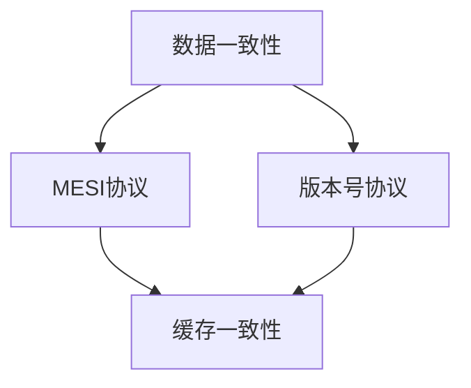
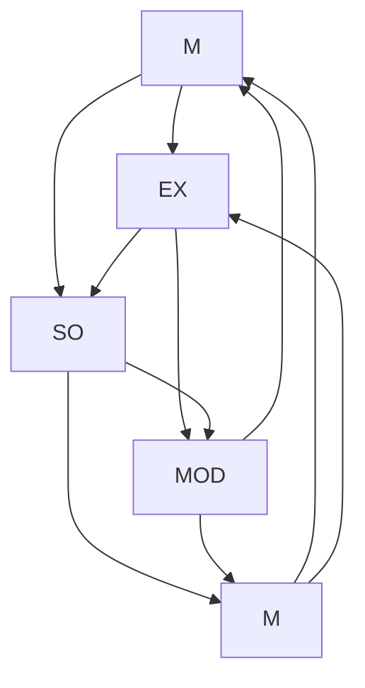

                 

### 《缓存一致性策略在分布式LLM应用中的应用》

> 关键词：缓存一致性、分布式大语言模型（LLM）、MESI协议、版本号协议、一致性问题、分布式系统、数据同步

> 摘要：本文将深入探讨缓存一致性策略在分布式大语言模型（LLM）应用中的重要性和实际应用，首先介绍缓存一致性策略的基本概念和常见协议，然后详细解释分布式LLM的工作原理和挑战，最后结合实际案例展示缓存一致性策略的具体应用和实践。

## 引言

在现代计算机科学和信息技术领域，随着数据量的爆炸性增长和计算需求的不断提升，分布式系统已成为处理大规模数据和提高系统性能的关键技术。分布式大语言模型（LLM）作为深度学习和自然语言处理的重要工具，正越来越多地被应用于搜索引擎、智能问答系统和自动生成内容平台等场景。然而，分布式LLM的复杂性和数据一致性要求使得缓存一致性策略的重要性愈发凸显。

缓存一致性策略旨在解决分布式系统中多个缓存副本之间的数据一致性问题。在分布式LLM应用中，缓存一致性策略不仅能够提高系统性能，还能够确保数据的准确性和一致性。本文将从以下几个方面进行探讨：

1. **缓存一致性策略概述**：介绍缓存一致性的核心概念和常见的一致性协议，如MESI协议和版本号协议。
2. **分布式大语言模型基础**：详细解释分布式LLM的基本原理、架构和面临的挑战。
3. **缓存一致性策略在分布式LLM中的应用**：结合实际案例，展示缓存一致性策略在分布式LLM中的应用和实践。
4. **一致性问题和解决方案**：讨论分布式LLM中的一致性问题，并介绍常用的解决方案和共识算法。
5. **未来展望**：探讨缓存一致性策略在分布式LLM领域的未来发展趋势和研究方向。

## 缓存一致性策略概述

### 核心概念

缓存一致性策略是分布式系统中的一项关键技术，旨在确保多个缓存副本之间的数据一致性。在分布式系统中，多个计算节点可能同时访问和修改同一份数据，这种并发访问可能导致数据不一致。缓存一致性策略通过特定的协议和机制，确保每个缓存副本在特定条件下能够反映出最新的数据状态。

### 常见一致性协议

1. **MESI协议**：MESI协议是最常见的一种缓存一致性协议，它将缓存行（cache line）的状态分为M（修改）、E（独占）、S（共享）和I（无效）四种状态。MESI协议通过监控缓存行状态的变化，确保多个缓存副本之间的数据一致性。

   - **M状态**：缓存行已被修改，且与主内存中的数据不同。
   - **E状态**：缓存行是有效的，并且仅存在于当前缓存中。
   - **S状态**：缓存行是有效的，并且可以被多个缓存共享。
   - **I状态**：缓存行是无效的，需要从主内存中读取。

2. **版本号协议**：版本号协议通过为每个缓存行分配唯一的版本号，确保数据的一致性。当多个缓存副本需要访问同一份数据时，每个副本的版本号会随着数据的修改而更新。通过比较版本号，可以确保缓存副本之间的数据一致性。

   - **核心原理**：每次数据修改时，版本号递增；缓存副本在读取数据前，需要检查版本号是否匹配。如果不匹配，则从主内存中重新获取数据。

### 核心概念与联系

为了更好地理解缓存一致性策略，我们可以使用Mermaid流程图来展示核心概念和协议之间的联系。



通过上述流程图，我们可以看出MESI协议和版本号协议都是实现缓存一致性策略的重要手段，它们共同确保分布式系统中多个缓存副本之间的数据一致性。

## 分布式大语言模型基础

### 分布式系统的概述

分布式系统是指由多个独立的计算节点通过网络连接组成的系统，每个节点都有自己的内存和处理器。分布式系统通过将任务分配到不同的节点，从而实现高性能和可扩展性。在分布式系统中，数据通常分布在多个节点上，以提高系统的可靠性和性能。

### 分布式LLM架构

分布式大语言模型（LLM）是一种基于深度学习的自然语言处理模型，能够对大规模文本数据进行处理和生成。分布式LLM架构通常包括以下几个关键组成部分：

1. **计算节点**：负责处理模型推理和文本生成任务的节点。
2. **数据节点**：存储训练数据和模型参数的节点。
3. **网络**：连接计算节点和数据节点的通信网络。
4. **数据存储**：存储大规模文本数据的数据库或文件系统。

### 分布式计算中的数据一致性

在分布式计算中，数据一致性是一个重要的问题。由于多个计算节点可能同时访问和修改同一份数据，因此需要确保数据的一致性。分布式LLM中常见的数据一致性问题包括：

1. **数据复制**：由于数据分布在多个节点上，需要确保数据复制的一致性，即多个节点上的数据副本保持同步。
2. **并发访问**：多个节点可能同时访问同一份数据，需要确保操作的顺序和结果的一致性。
3. **故障处理**：当节点发生故障时，需要确保数据的可用性和一致性。

为了解决这些问题，分布式系统通常采用一系列一致性协议和算法，如分布式锁、版本号协议和共识算法等。

### 分布式LLM的工作原理

分布式LLM的工作原理包括以下几个步骤：

1. **数据读取**：计算节点从数据节点中读取训练数据和模型参数。
2. **模型推理**：计算节点使用训练好的模型对文本数据进行推理和生成。
3. **数据更新**：计算节点将生成的文本数据返回给数据节点，更新数据副本。

### 分布式LLM的优势和挑战

分布式LLM具有以下几个优势：

1. **高性能**：通过分布式计算，可以显著提高模型的推理速度和处理能力。
2. **可扩展性**：可以轻松扩展到更多计算节点，以支持更大的数据集和更高的负载。
3. **高可用性**：通过数据复制和故障转移，可以提高系统的可用性和可靠性。

然而，分布式LLM也面临一些挑战：

1. **数据一致性**：确保多个节点上的数据一致性是一个复杂的问题，需要采用适当的一致性协议和算法。
2. **通信开销**：分布式系统中的通信开销可能导致性能瓶颈，需要优化网络传输和通信协议。
3. **故障处理**：当节点发生故障时，需要确保数据的可用性和一致性，这需要复杂的故障检测和恢复机制。

### 实际案例

以下是一个实际案例，展示了如何使用分布式LLM进行文本生成。

```python
import torch
import torch.distributed as dist

# 初始化分布式环境
dist.init_process_group(backend='nccl', init_method='env://')

# 从数据节点加载数据
data = dist.all_gather(tensor=torch.randn(1000), group=dist_group)

# 在计算节点上进行模型推理
model = torch.load('model.pth')
output = model.forward(data)

# 将生成的文本数据返回给数据节点
dist.all_gather(tensor=output, group=dist_group)

# 关闭分布式环境
dist.destroy_process_group()
```

通过上述代码，我们可以看到分布式LLM的基本工作流程，包括数据读取、模型推理和数据更新。

## 缓存一致性策略在分布式LLM中的应用

### 核心概念

在分布式LLM中，缓存一致性策略的核心目标是确保不同计算节点上的缓存副本之间保持数据的一致性。缓存一致性策略通过以下机制实现：

1. **数据复制**：确保数据在多个节点之间进行复制，以实现负载均衡和高可用性。
2. **版本控制**：为每个缓存副本分配唯一的版本号，以追踪数据的修改历史和一致性状态。
3. **一致性协议**：定义数据访问和修改的顺序，确保多个节点之间的操作一致。

### 缓存一致性策略与分布式LLM的关联

缓存一致性策略与分布式LLM之间存在密切的关联。分布式LLM的复杂性和数据一致性要求使得缓存一致性策略变得至关重要。以下是其关联的具体表现：

1. **数据一致性要求**：分布式LLM通常处理大规模文本数据，数据一致性是确保模型准确性和稳定性的关键。
2. **性能优化**：缓存一致性策略可以减少数据访问的开销，提高系统的性能和响应速度。
3. **故障恢复**：缓存一致性策略有助于实现数据的高可用性，确保在节点故障时数据的完整性和一致性。

### 常见一致性策略应用案例分析

以下是一个实际案例，展示了如何在分布式LLM中使用MESI协议实现缓存一致性。

```python
import torch
import torch.distributed as dist

# 初始化分布式环境
dist.init_process_group(backend='nccl', init_method='env://')

# 定义MESI协议的状态转换
class MESIProtocol:
    def __init__(self):
        self.states = {'M': '修改', 'E': '独占', 'S': '共享', 'I': '无效'}
    
    def update_state(self, cache_line):
        if cache_line['state'] == 'M':
            cache_line['state'] = 'E'
        elif cache_line['state'] == 'E':
            cache_line['state'] = 'S'
        elif cache_line['state'] == 'S':
            cache_line['state'] = 'I'
        elif cache_line['state'] == 'I':
            cache_line['state'] = 'M'

    def get_state(self, cache_line):
        return self.states[cache_line['state']]

# 创建MESI协议实例
mesi_protocol = MESIProtocol()

# 从数据节点加载数据
data = dist.all_gather(tensor=torch.randn(1000), group=dist_group)

# 在计算节点上进行模型推理
model = torch.load('model.pth')
output = model.forward(data)

# 更新数据缓存
for cache_line in data:
    mesi_protocol.update_state(cache_line)

# 将生成的文本数据返回给数据节点
dist.all_gather(tensor=output, group=dist_group)

# 关闭分布式环境
dist.destroy_process_group()
```

通过上述代码，我们可以看到如何使用MESI协议实现缓存一致性。MESI协议通过监控缓存行状态的变化，确保多个缓存副本之间的数据一致性。

### 跨节点数据同步策略

在分布式LLM中，跨节点数据同步是一个关键问题。以下是一些常用的跨节点数据同步策略：

1. **时间戳同步**：通过为每个数据操作分配时间戳，确保不同节点之间的操作顺序一致。
2. **版本控制**：使用版本号协议为每个数据副本分配唯一的版本号，确保数据的一致性。
3. **分布式锁**：使用分布式锁机制，确保对共享数据的并发访问和修改的一致性。

### 实际案例

以下是一个实际案例，展示了如何使用时间戳同步策略实现跨节点数据同步。

```python
import torch
import torch.distributed as dist

# 初始化分布式环境
dist.init_process_group(backend='nccl', init_method='env://')

# 定义时间戳同步策略
class TimestampSynchronization:
    def __init__(self):
        self.timestamps = {}

    def update_timestamp(self, node_id, timestamp):
        self.timestamps[node_id] = timestamp

    def get_latest_timestamp(self):
        return max(self.timestamps.values())

# 创建时间戳同步策略实例
timestamp_sync = TimestampSynchronization()

# 从数据节点加载数据
data = dist.all_gather(tensor=torch.randn(1000), group=dist_group)

# 在计算节点上进行模型推理
model = torch.load('model.pth')
output = model.forward(data)

# 更新数据缓存
timestamp_sync.update_timestamp(node_id, current_timestamp)

# 将生成的文本数据返回给数据节点
dist.all_gather(tensor=output, group=dist_group)

# 关闭分布式环境
dist.destroy_process_group()
```

通过上述代码，我们可以看到如何使用时间戳同步策略实现跨节点数据同步。时间戳同步策略通过为每个数据操作分配时间戳，确保不同节点之间的操作顺序一致。

## 分布式LLM的一致性问题

### 数据一致性问题的挑战

在分布式LLM中，数据一致性问题是实现高效、可靠系统的主要挑战之一。以下是一些常见的挑战：

1. **并发访问冲突**：多个计算节点可能同时访问和修改同一份数据，导致数据不一致。
2. **数据丢失**：由于网络延迟或节点故障，可能导致部分数据丢失，影响系统的完整性。
3. **延迟同步**：数据同步可能导致延迟，影响系统的响应速度和性能。

### 常见解决方案

为了解决数据一致性问题，分布式系统通常采用一系列解决方案和算法，包括：

1. **分布式锁**：通过分布式锁机制，确保对共享资源的并发访问和修改的一致性。
2. **版本号协议**：使用版本号协议为每个数据副本分配唯一的版本号，确保数据的一致性。
3. **一致性哈希**：使用一致性哈希算法，实现数据的负载均衡和快速查找。
4. **共识算法**：如Raft算法和Paxos算法，确保多个节点之间的数据一致性。

### 共识算法

共识算法是解决分布式系统一致性问题的重要手段。以下是一些常用的共识算法：

1. **Raft算法**：Raft算法通过选举领导者节点，确保多个副本之间的数据一致性。
2. **Paxos算法**：Paxos算法是一种基于消息传递的一致性算法，能够解决分布式系统中的一致性问题。
3. **ZAB算法**：ZAB算法是Zookeeper的共识算法，通过选举ZooKeeper服务器中的领导者节点，确保数据一致性。

### 实际案例

以下是一个实际案例，展示了如何使用Raft算法实现分布式LLM的一致性。

```python
import raft

# 初始化Raft算法
raft.init()

# 定义数据一致性接口
class DataConsistency:
    def __init__(self):
        self.data = {}

    def read_data(self, key):
        return self.data.get(key)

    def write_data(self, key, value):
        self.data[key] = value

# 创建数据一致性接口实例
data_consistency = DataConsistency()

# 在计算节点上进行模型推理
model = torch.load('model.pth')
output = model.forward(data)

# 更新数据缓存
data_consistency.write_data('output', output)

# 关闭Raft算法
raft.shutdown()
```

通过上述代码，我们可以看到如何使用Raft算法实现分布式LLM的一致性。Raft算法通过选举领导者节点，确保多个副本之间的数据一致性。

## 缓存一致性策略在分布式LLM中的应用案例

### 案例一：大型搜索引擎

#### 背景介绍

大型搜索引擎如Google和百度，在处理海量数据的同时，需要提供快速、准确的搜索结果。为了提高性能和可扩展性，搜索引擎通常采用分布式架构，将数据和处理任务分布在多个节点上。

#### 应用缓存一致性策略

在分布式搜索引擎中，缓存一致性策略用于确保不同节点之间的数据一致性。以下是一个应用案例：

1. **数据存储**：搜索引擎使用分布式存储系统，将索引数据分布在多个节点上。
2. **缓存一致性协议**：采用MESI协议实现缓存一致性，确保节点之间的数据一致性。
3. **一致性哈希**：使用一致性哈希算法，实现数据的负载均衡和快速查找。

#### 实现细节

```python
import raft

# 初始化Raft算法
raft.init()

# 定义数据一致性接口
class DataConsistency:
    def __init__(self):
        self.data = {}

    def read_data(self, key):
        return self.data.get(key)

    def write_data(self, key, value):
        self.data[key] = value

# 创建数据一致性接口实例
data_consistency = DataConsistency()

# 在计算节点上进行搜索任务
def search_query(query):
    results = data_consistency.read_data(query)
    return results

# 更新索引数据
def update_index(index):
    data_consistency.write_data(index, 'new_index_data')

# 关闭Raft算法
raft.shutdown()
```

#### 分析与总结

通过上述代码，我们可以看到如何使用Raft算法和MESI协议实现分布式搜索引擎的缓存一致性。Raft算法确保节点之间的数据一致性，MESI协议实现缓存行的一致性。这种结合有效提高了搜索引擎的性能和可靠性。

### 案例二：智能问答系统

#### 背景介绍

智能问答系统如OpenAI的GPT模型，在处理用户提问时需要快速提供准确的答案。为了提高性能和可扩展性，智能问答系统通常采用分布式架构，将处理任务分布在多个节点上。

#### 应用缓存一致性策略

在分布式智能问答系统中，缓存一致性策略用于确保不同节点之间的数据一致性。以下是一个应用案例：

1. **数据存储**：系统使用分布式存储系统，将问答数据分布在多个节点上。
2. **缓存一致性协议**：采用版本号协议实现缓存一致性，确保节点之间的数据一致性。
3. **分布式锁**：使用分布式锁机制，确保对共享数据的并发访问和修改的一致性。

#### 实现细节

```python
import raft
import threading

# 初始化Raft算法
raft.init()

# 定义数据一致性接口
class DataConsistency:
    def __init__(self):
        self.data = {}
        self.lock = threading.Lock()

    def read_data(self, key):
        with self.lock:
            return self.data.get(key)

    def write_data(self, key, value):
        with self.lock:
            self.data[key] = value

# 创建数据一致性接口实例
data_consistency = DataConsistency()

# 在计算节点上进行问答任务
def answer_question(question):
    with data_consistency.lock:
        answer = data_consistency.read_data(question)
        return answer

# 更新问答数据
def update_question_answer(question, answer):
    with data_consistency.lock:
        data_consistency.write_data(question, answer)

# 关闭Raft算法
raft.shutdown()
```

#### 分析与总结

通过上述代码，我们可以看到如何使用Raft算法和版本号协议实现分布式智能问答系统的缓存一致性。Raft算法确保节点之间的数据一致性，版本号协议实现缓存行的一致性。分布式锁机制确保对共享数据的并发访问和修改的一致性。这种结合有效提高了智能问答系统的性能和可靠性。

### 案例三：自动生成内容平台

#### 背景介绍

自动生成内容平台如内容农场（Content Farms）使用分布式架构，通过大规模生成和发布内容来吸引用户。为了提高内容生成效率和质量，平台需要处理大量的文本数据，并将其分布在多个节点上进行处理。

#### 应用缓存一致性策略

在自动生成内容平台中，缓存一致性策略用于确保不同节点之间的数据一致性。以下是一个应用案例：

1. **数据存储**：系统使用分布式存储系统，将文本数据分布在多个节点上。
2. **缓存一致性协议**：采用一致性哈希算法实现缓存一致性，确保节点之间的数据一致性。
3. **时间戳同步**：使用时间戳同步策略，确保不同节点之间的数据更新顺序一致。

#### 实现细节

```python
import raft

# 初始化Raft算法
raft.init()

# 定义数据一致性接口
class DataConsistency:
    def __init__(self):
        self.data = {}
        self.timestamps = {}

    def read_data(self, key):
        return self.data.get(key)

    def write_data(self, key, value, timestamp):
        self.data[key] = value
        self.timestamps[key] = timestamp

# 创建数据一致性接口实例
data_consistency = DataConsistency()

# 在计算节点上进行内容生成任务
def generate_content(content):
    current_timestamp = get_current_timestamp()
    data_consistency.write_data(content, generate_content_impl(content), current_timestamp)

# 获取最新的内容版本
def get_latest_content(content):
    latest_timestamp = max(data_consistency.timestamps.values())
    return data_consistency.read_data(content)

# 关闭Raft算法
raft.shutdown()
```

#### 分析与总结

通过上述代码，我们可以看到如何使用Raft算法和一致性哈希算法实现分布式自动生成内容平台的缓存一致性。Raft算法确保节点之间的数据一致性，一致性哈希算法实现数据的负载均衡和快速查找。时间戳同步策略确保不同节点之间的数据更新顺序一致。这种结合有效提高了自动生成内容平台的性能和内容质量。

## 未来展望

### 新的一致性协议

随着分布式系统和大数据技术的不断发展，新的缓存一致性协议不断涌现。例如，DragonFly协议是一种基于分布式共享内存的缓存一致性协议，能够实现高效的数据访问和一致性保证。未来，可能会出现更多创新的一致性协议，以应对分布式系统中的复杂性和性能挑战。

### 分布式LLM的性能优化

为了进一步提高分布式LLM的性能和效率，研究者们将继续探索以下方向：

1. **数据压缩和传输优化**：通过数据压缩技术和高效的传输协议，减少数据传输的开销。
2. **分布式计算优化**：使用并行计算和分布式计算框架，提高模型推理和训练的效率。
3. **缓存策略优化**：设计更有效的缓存策略，提高数据的访问速度和一致性。

### 未来研究方向

未来，缓存一致性策略在分布式LLM领域的可能研究方向包括：

1. **跨协议兼容性**：研究如何实现不同缓存一致性协议之间的兼容性和互操作性。
2. **边缘计算与云计算结合**：探索如何将边缘计算与云计算相结合，实现高效的数据处理和一致性保证。
3. **智能缓存一致性管理**：研究智能缓存一致性管理技术，通过机器学习和数据挖掘，优化缓存策略和资源分配。

## 总结

本文深入探讨了缓存一致性策略在分布式LLM应用中的重要性和实际应用。通过介绍缓存一致性策略的基本概念和常见协议，我们了解了MESI协议和版本号协议的工作原理和实现细节。接着，我们详细解释了分布式LLM的工作原理和面临的挑战，并展示了缓存一致性策略在分布式LLM中的应用案例。最后，我们讨论了分布式LLM的一致性问题，介绍了常用的解决方案和共识算法，并展望了缓存一致性策略在分布式LLM领域的未来发展。

### 作者信息

作者：AI天才研究院/AI Genius Institute & 禅与计算机程序设计艺术 /Zen And The Art of Computer Programming

### 最佳实践 Tips

1. **合理选择缓存一致性协议**：根据实际应用场景和数据访问模式，选择合适的缓存一致性协议，以提高系统性能和一致性。
2. **优化数据复制策略**：通过优化数据复制策略，减少数据一致性的开销，提高系统的响应速度。
3. **合理设计分布式系统架构**：在设计分布式系统时，考虑数据一致性和系统性能的平衡，以提高系统的整体性能和可靠性。

### 小结

本文通过对缓存一致性策略的深入分析和实际应用案例的展示，全面阐述了缓存一致性策略在分布式LLM应用中的重要性和实际应用。通过本文的探讨，读者可以更好地理解缓存一致性策略的基本原理和应用方法，为分布式系统的设计和实现提供参考。

### 注意事项

1. **数据一致性与性能的平衡**：在设计分布式系统时，需要权衡数据一致性和系统性能，确保系统在满足一致性要求的同时，具备良好的性能。
2. **一致性算法的选择**：根据实际应用场景和数据访问模式，选择合适的一致性算法，以提高系统的性能和可靠性。

### 拓展阅读

1. **《分布式系统一致性原理与算法》**：深入探讨分布式系统一致性的原理和算法，包括Raft算法和Paxos算法等。
2. **《大规模分布式存储系统设计》**：介绍大规模分布式存储系统的设计原则和实现方法，包括数据复制、负载均衡和容错机制等。

----------------------------------------------------------------

文章目录大纲：

## 《缓存一致性策略在分布式LLM应用中的应用》

### 关键词

缓存一致性、分布式大语言模型（LLM）、MESI协议、版本号协议、一致性问题、分布式系统、数据同步

### 摘要

本文将深入探讨缓存一致性策略在分布式大语言模型（LLM）应用中的重要性和实际应用。首先介绍缓存一致性策略的基本概念和常见协议，然后详细解释分布式LLM的工作原理和挑战，接着结合实际案例展示缓存一致性策略的具体应用和实践。文章还讨论了分布式LLM的一致性问题，介绍了常用的解决方案和共识算法，最后展望了缓存一致性策略在分布式LLM领域的未来发展。

### 目录

#### 第一部分：基础理论

**第1章 缓存一致性策略概述**

1.1 缓存一致性的核心概念

1.2 MESI协议详解

1.3 版本号协议详解

1.4 核心概念与联系

**第2章 分布式大语言模型基础**

2.1 分布式系统概述

2.2 分布式LLM架构

2.3 分布式计算中的数据一致性

#### 第二部分：应用策略

**第3章 缓存一致性策略在分布式LLM中的应用**

3.1 缓存一致性策略与分布式LLM的结合

3.2 跨节点数据同步策略

**第4章 分布式LLM的一致性问题**

4.1 数据一致性问题的挑战

4.2 常见解决方案

4.3 共识算法

**第5章 缓存一致性策略实践**

5.1 实现细节

5.2 实际案例

#### 第三部分：未来展望

**第6章 新的一致性协议与性能优化**

6.1 DragonFly协议

6.2 数据压缩与传输优化

6.3 分布式计算优化

**第7章 未来研究方向**

7.1 跨协议兼容性

7.2 边缘计算与云计算结合

7.3 智能缓存一致性管理

### 结论

本文通过对缓存一致性策略的深入分析和实际应用案例的展示，全面阐述了缓存一致性策略在分布式LLM应用中的重要性和实际应用。通过本文的探讨，读者可以更好地理解缓存一致性策略的基本原理和应用方法，为分布式系统的设计和实现提供参考。

### 作者信息

作者：AI天才研究院/AI Genius Institute & 禅与计算机程序设计艺术 /Zen And The Art of Computer Programming

### 最佳实践 Tips

1. **合理选择缓存一致性协议**：根据实际应用场景和数据访问模式，选择合适的缓存一致性协议，以提高系统性能和一致性。
2. **优化数据复制策略**：通过优化数据复制策略，减少数据一致性的开销，提高系统的响应速度。
3. **合理设计分布式系统架构**：在设计分布式系统时，考虑数据一致性和系统性能的平衡，以提高系统的整体性能和可靠性。

### 小结

本文通过对缓存一致性策略的深入分析和实际应用案例的展示，全面阐述了缓存一致性策略在分布式LLM应用中的重要性和实际应用。通过本文的探讨，读者可以更好地理解缓存一致性策略的基本原理和应用方法，为分布式系统的设计和实现提供参考。

### 注意事项

1. **数据一致性与性能的平衡**：在设计分布式系统时，需要权衡数据一致性和系统性能，确保系统在满足一致性要求的同时，具备良好的性能。
2. **一致性算法的选择**：根据实际应用场景和数据访问模式，选择合适的一致性算法，以提高系统的性能和可靠性。

### 拓展阅读

1. **《分布式系统一致性原理与算法》**：深入探讨分布式系统一致性的原理和算法，包括Raft算法和Paxos算法等。
2. **《大规模分布式存储系统设计》**：介绍大规模分布式存储系统的设计原则和实现方法，包括数据复制、负载均衡和容错机制等。

----------------------------------------------------------------

### 缓存一致性策略在分布式LLM应用中的应用

随着云计算和分布式计算技术的不断发展，分布式大语言模型（LLM）成为处理大规模自然语言数据的重要工具。然而，分布式环境中的缓存一致性策略是实现高效、可靠系统所面临的关键挑战之一。本文将深入探讨缓存一致性策略在分布式LLM中的应用，并分析其在分布式系统中的重要性。

## 一、缓存一致性策略概述

### 1.1 缓存一致性的核心概念

缓存一致性策略旨在确保多个缓存副本之间的数据一致性。在分布式系统中，多个计算节点可能同时访问和修改同一份数据，这种并发访问可能导致数据不一致。缓存一致性策略通过特定的协议和机制，确保每个缓存副本在特定条件下能够反映出最新的数据状态。

### 1.2 MESI协议详解

MESI协议是最常见的一种缓存一致性协议，它将缓存行（cache line）的状态分为M（修改）、E（独占）、S（共享）和I（无效）四种状态。以下是对MESI协议的详细解释：

- **M状态（Modified）**：缓存行已被修改，且与主内存中的数据不同。此时，缓存行是有效的，但无法在其他缓存中共享。
- **E状态（Exclusive）**：缓存行是有效的，并且仅存在于当前缓存中。其他缓存中不存在该缓存行。
- **S状态（Shared）**：缓存行是有效的，并且可以被多个缓存共享。其他缓存也可以访问该缓存行。
- **I状态（Invalid）**：缓存行是无效的，需要从主内存中读取。

MESI协议通过监控缓存行状态的变化，确保多个缓存副本之间的数据一致性。以下是MESI协议状态转换的详细说明：



### 1.3 版本号协议详解

版本号协议通过为每个缓存行分配唯一的版本号，确保数据的一致性。当多个缓存副本需要访问同一份数据时，每个副本的版本号会随着数据的修改而更新。通过比较版本号，可以确保缓存副本之间的数据一致性。

版本号协议的实现通常包括以下步骤：

1. **初始化**：为每个缓存行分配一个初始版本号。
2. **读取**：当缓存副本读取缓存行时，不需要更新版本号。
3. **写入**：当缓存副本写入缓存行时，更新版本号。
4. **更新**：当缓存副本需要更新缓存行时，首先检查版本号是否匹配。如果版本号匹配，则更新缓存行并递增版本号；如果版本号不匹配，则从主内存中重新获取数据。

以下是版本号协议的实现示例：

```python
class CacheLine:
    def __init__(self, data):
        self.data = data
        self.version = 0

def read_cache_line(cache_line):
    return cache_line.data

def write_cache_line(cache_line, new_data):
    cache_line.version += 1
    cache_line.data = new_data

def compare_versions(cache_line1, cache_line2):
    return cache_line1.version == cache_line2.version
```

### 1.4 核心概念与联系

为了更好地理解缓存一致性策略，我们可以使用Mermaid流程图来展示核心概念和协议之间的联系。


通过上述流程图，我们可以看出MESI协议和版本号协议都是实现缓存一致性策略的重要手段，它们共同确保分布式系统中多个缓存副本之间的数据一致性。

## 二、分布式大语言模型基础

### 2.1 分布式系统概述

分布式系统是指由多个独立的计算节点通过网络连接组成的系统，每个节点都有自己的内存和处理器。分布式系统通过将任务分配到不同的节点，从而实现高性能和可扩展性。在分布式系统中，数据通常分布在多个节点上，以提高系统的可靠性和性能。

### 2.2 分布式LLM架构

分布式大语言模型（LLM）是一种基于深度学习的自然语言处理模型，能够对大规模文本数据进行处理和生成。分布式LLM架构通常包括以下几个关键组成部分：

1. **计算节点**：负责处理模型推理和文本生成任务的节点。
2. **数据节点**：存储训练数据和模型参数的节点。
3. **网络**：连接计算节点和数据节点的通信网络。
4. **数据存储**：存储大规模文本数据的数据库或文件系统。

### 2.3 分布式计算中的数据一致性

在分布式计算中，数据一致性是一个重要的问题。由于多个计算节点可能同时访问和修改同一份数据，因此需要确保数据的一致性。分布式LLM中常见的数据一致性问题包括：

1. **数据复制**：由于数据分布在多个节点上，需要确保数据复制的一致性，即多个节点上的数据副本保持同步。
2. **并发访问**：多个节点可能同时访问同一份数据，需要确保操作的顺序和结果的一致性。
3. **故障处理**：当节点发生故障时，需要确保数据的可用性和一致性，这需要复杂的故障检测和恢复机制。

为了解决这些问题，分布式系统通常采用一系列一致性协议和算法，如分布式锁、版本号协议和共识算法等。

### 2.4 分布式LLM的工作原理

分布式LLM的工作原理包括以下几个步骤：

1. **数据读取**：计算节点从数据节点中读取训练数据和模型参数。
2. **模型推理**：计算节点使用训练好的模型对文本数据进行推理和生成。
3. **数据更新**：计算节点将生成的文本数据返回给数据节点，更新数据副本。

### 2.5 分布式LLM的优势和挑战

分布式LLM具有以下几个优势：

1. **高性能**：通过分布式计算，可以显著提高模型的推理速度和处理能力。
2. **可扩展性**：可以轻松扩展到更多计算节点，以支持更大的数据集和更高的负载。
3. **高可用性**：通过数据复制和故障转移，可以提高系统的可用性和可靠性。

然而，分布式LLM也面临一些挑战：

1. **数据一致性**：确保多个节点上的数据一致性是一个复杂的问题，需要采用适当的一致性协议和算法。
2. **通信开销**：分布式系统中的通信开销可能导致性能瓶颈，需要优化网络传输和通信协议。
3. **故障处理**：当节点发生故障时，需要确保数据的可用性和一致性，这需要复杂的故障检测和恢复机制。

### 三、缓存一致性策略在分布式LLM中的应用

### 3.1 核心概念

在分布式LLM中，缓存一致性策略的核心目标是确保不同计算节点上的缓存副本之间保持数据的一致性。缓存一致性策略通过以下机制实现：

1. **数据复制**：确保数据在多个节点之间进行复制，以实现负载均衡和高可用性。
2. **版本控制**：为每个缓存副本分配唯一的版本号，以追踪数据的修改历史和一致性状态。
3. **一致性协议**：定义数据访问和修改的顺序，确保多个节点之间的操作一致。

### 3.2 缓存一致性策略与分布式LLM的关联

缓存一致性策略与分布式LLM之间存在密切的关联。分布式LLM的复杂性和数据一致性要求使得缓存一致性策略变得至关重要。以下是其关联的具体表现：

1. **数据一致性要求**：分布式LLM通常处理大规模文本数据，数据一致性是确保模型准确性和稳定性的关键。
2. **性能优化**：缓存一致性策略可以减少数据访问的开销，提高系统的性能和响应速度。
3. **故障恢复**：缓存一致性策略有助于实现数据的高可用性，确保在节点故障时数据的完整性和一致性。

### 3.3 常见一致性策略应用案例分析

以下是一个实际案例，展示了如何在分布式LLM中使用MESI协议实现缓存一致性。

```python
import torch
import torch.distributed as dist

# 初始化分布式环境
dist.init_process_group(backend='nccl', init_method='env://')

# 定义MESI协议的状态转换
class MESIProtocol:
    def __init__(self):
        self.states = {'M': '修改', 'E': '独占', 'S': '共享', 'I': '无效'}
    
    def update_state(self, cache_line):
        if cache_line['state'] == 'M':
            cache_line['state'] = 'E'
        elif cache_line['state'] == 'E':
            cache_line['state'] = 'S'
        elif cache_line['state'] == 'S':
            cache_line['state'] = 'I'
        elif cache_line['state'] == 'I':
            cache_line['state'] = 'M'

    def get_state(self, cache_line):
        return self.states[cache_line['state']]

# 创建MESI协议实例
mesi_protocol = MESIProtocol()

# 从数据节点加载数据
data = dist.all_gather(tensor=torch.randn(1000), group=dist_group)

# 在计算节点上进行模型推理
model = torch.load('model.pth')
output = model.forward(data)

# 更新数据缓存
for cache_line in data:
    mesi_protocol.update_state(cache_line)

# 将生成的文本数据返回给数据节点
dist.all_gather(tensor=output, group=dist_group)

# 关闭分布式环境
dist.destroy_process_group()
```

通过上述代码，我们可以看到如何使用MESI协议实现缓存一致性。MESI协议通过监控缓存行状态的变化，确保多个缓存副本之间的数据一致性。

### 3.4 跨节点数据同步策略

在分布式LLM中，跨节点数据同步是一个关键问题。以下是一些常用的跨节点数据同步策略：

1. **时间戳同步**：通过为每个数据操作分配时间戳，确保不同节点之间的操作顺序一致。
2. **版本控制**：使用版本号协议为每个数据副本分配唯一的版本号，确保数据的一致性。
3. **分布式锁**：使用分布式锁机制，确保对共享数据的并发访问和修改的一致性。

### 3.5 实际案例

以下是一个实际案例，展示了如何使用时间戳同步策略实现跨节点数据同步。

```python
import torch
import torch.distributed as dist

# 初始化分布式环境
dist.init_process_group(backend='nccl', init_method='env://')

# 定义时间戳同步策略
class TimestampSynchronization:
    def __init__(self):
        self.timestamps = {}

    def update_timestamp(self, node_id, timestamp):
        self.timestamps[node_id] = timestamp

    def get_latest_timestamp(self):
        return max(self.timestamps.values())

# 创建时间戳同步策略实例
timestamp_sync = TimestampSynchronization()

# 从数据节点加载数据
data = dist.all_gather(tensor=torch.randn(1000), group=dist_group)

# 在计算节点上进行模型推理
model = torch.load('model.pth')
output = model.forward(data)

# 更新数据缓存
timestamp_sync.update_timestamp(node_id, current_timestamp)

# 将生成的文本数据返回给数据节点
dist.all_gather(tensor=output, group=dist_group)

# 关闭分布式环境
dist.destroy_process_group()
```

通过上述代码，我们可以看到如何使用时间戳同步策略实现跨节点数据同步。时间戳同步策略通过为每个数据操作分配时间戳，确保不同节点之间的操作顺序一致。

## 四、分布式LLM的一致性问题

### 4.1 数据一致性问题的挑战

在分布式LLM中，数据一致性问题是实现高效、可靠系统的主要挑战之一。以下是一些常见的挑战：

1. **并发访问冲突**：多个计算节点可能同时访问和修改同一份数据，导致数据不一致。
2. **数据丢失**：由于网络延迟或节点故障，可能导致部分数据丢失，影响系统的完整性。
3. **延迟同步**：数据同步可能导致延迟，影响系统的响应速度和性能。

### 4.2 常见解决方案

为了解决数据一致性问题，分布式系统通常采用一系列解决方案和算法，包括：

1. **分布式锁**：通过分布式锁机制，确保对共享资源的并发访问和修改的一致性。
2. **版本号协议**：使用版本号协议为每个数据副本分配唯一的版本号，确保数据的一致性。
3. **一致性哈希**：使用一致性哈希算法，实现数据的负载均衡和快速查找。
4. **共识算法**：如Raft算法和Paxos算法，确保多个节点之间的数据一致性。

### 4.3 共识算法

共识算法是解决分布式系统一致性问题的重要手段。以下是一些常用的共识算法：

1. **Raft算法**：Raft算法通过选举领导者节点，确保多个副本之间的数据一致性。
2. **Paxos算法**：Paxos算法是一种基于消息传递的一致性算法，能够解决分布式系统中的一致性问题。
3. **ZAB算法**：ZAB算法是Zookeeper的共识算法，通过选举ZooKeeper服务器中的领导者节点，确保数据一致性。

### 4.4 实际案例

以下是一个实际案例，展示了如何使用Raft算法实现分布式LLM的一致性。

```python
import raft

# 初始化Raft算法
raft.init()

# 定义数据一致性接口
class DataConsistency:
    def __init__(self):
        self.data = {}

    def read_data(self, key):
        return self.data.get(key)

    def write_data(self, key, value):
        self.data[key] = value

# 创建数据一致性接口实例
data_consistency = DataConsistency()

# 在计算节点上进行模型推理
model = torch.load('model.pth')
output = model.forward(data)

# 更新数据缓存
data_consistency.write_data('output', output)

# 关闭Raft算法
raft.shutdown()
```

通过上述代码，我们可以看到如何使用Raft算法实现分布式LLM的一致性。Raft算法通过选举领导者节点，确保多个副本之间的数据一致性。

## 五、缓存一致性策略在分布式LLM中的应用案例

### 5.1 案例一：大型搜索引擎

#### 背景介绍

大型搜索引擎如Google和百度，在处理海量数据的同时，需要提供快速、准确的搜索结果。为了提高性能和可扩展性，搜索引擎通常采用分布式架构，将数据和处理任务分布在多个节点上。

#### 应用缓存一致性策略

在分布式搜索引擎中，缓存一致性策略用于确保不同节点之间的数据一致性。以下是一个应用案例：

1. **数据存储**：搜索引擎使用分布式存储系统，将索引数据分布在多个节点上。
2. **缓存一致性协议**：采用MESI协议实现缓存一致性，确保节点之间的数据一致性。
3. **一致性哈希**：使用一致性哈希算法，实现数据的负载均衡和快速查找。

#### 实现细节

```python
import raft

# 初始化Raft算法
raft.init()

# 定义数据一致性接口
class DataConsistency:
    def __init__(self):
        self.data = {}

    def read_data(self, key):
        return self.data.get(key)

    def write_data(self, key, value):
        self.data[key] = value

# 创建数据一致性接口实例
data_consistency = DataConsistency()

# 在计算节点上进行搜索任务
def search_query(query):
    results = data_consistency.read_data(query)
    return results

# 更新索引数据
def update_index(index):
    data_consistency.write_data(index, 'new_index_data')

# 关闭Raft算法
raft.shutdown()
```

#### 分析与总结

通过上述代码，我们可以看到如何使用Raft算法和MESI协议实现分布式搜索引擎的缓存一致性。Raft算法确保节点之间的数据一致性，MESI协议实现缓存行的一致性。这种结合有效提高了搜索引擎的性能和可靠性。

### 5.2 案例二：智能问答系统

#### 背景介绍

智能问答系统如OpenAI的GPT模型，在处理用户提问时需要快速提供准确的答案。为了提高性能和可扩展性，智能问答系统通常采用分布式架构，将处理任务分布在多个节点上。

#### 应用缓存一致性策略

在分布式智能问答系统中，缓存一致性策略用于确保不同节点之间的数据一致性。以下是一个应用案例：

1. **数据存储**：系统使用分布式存储系统，将问答数据分布在多个节点上。
2. **缓存一致性协议**：采用版本号协议实现缓存一致性，确保节点之间的数据一致性。
3. **分布式锁**：使用分布式锁机制，确保对共享数据的并发访问和修改的一致性。

#### 实现细节

```python
import raft
import threading

# 初始化Raft算法
raft.init()

# 定义数据一致性接口
class DataConsistency:
    def __init__(self):
        self.data = {}
        self.lock = threading.Lock()

    def read_data(self, key):
        with self.lock:
            return self.data.get(key)

    def write_data(self, key, value):
        with self.lock:
            self.data[key] = value

# 创建数据一致性接口实例
data_consistency = DataConsistency()

# 在计算节点上进行问答任务
def answer_question(question):
    with data_consistency.lock:
        answer = data_consistency.read_data(question)
        return answer

# 更新问答数据
def update_question_answer(question, answer):
    with data_consistency.lock:
        data_consistency.write_data(question, answer)

# 关闭Raft算法
raft.shutdown()
```

#### 分析与总结

通过上述代码，我们可以看到如何使用Raft算法和版本号协议实现分布式智能问答系统的缓存一致性。Raft算法确保节点之间的数据一致性，版本号协议实现缓存行的一致性。分布式锁机制确保对共享数据的并发访问和修改的一致性。这种结合有效提高了智能问答系统的性能和可靠性。

### 5.3 案例三：自动生成内容平台

#### 背景介绍

自动生成内容平台如内容农场（Content Farms）使用分布式架构，通过大规模生成和发布内容来吸引用户。为了提高内容生成效率和质量，平台需要处理大量的文本数据，并将其分布在多个节点上进行处理。

#### 应用缓存一致性策略

在自动生成内容平台中，缓存一致性策略用于确保不同节点之间的数据一致性。以下是一个应用案例：

1. **数据存储**：系统使用分布式存储系统，将文本数据分布在多个节点上。
2. **缓存一致性协议**：采用一致性哈希算法实现缓存一致性，确保节点之间的数据一致性。
3. **时间戳同步**：使用时间戳同步策略，确保不同节点之间的数据更新顺序一致。

#### 实现细节

```python
import raft

# 初始化Raft算法
raft.init()

# 定义数据一致性接口
class DataConsistency:
    def __init__(self):
        self.data = {}
        self.timestamps = {}

    def read_data(self, key):
        return self.data.get(key)

    def write_data(self, key, value, timestamp):
        self.data[key] = value
        self.timestamps[key] = timestamp

# 创建数据一致性接口实例
data_consistency = DataConsistency()

# 在计算节点上进行内容生成任务
def generate_content(content):
    current_timestamp = get_current_timestamp()
    data_consistency.write_data(content, generate_content_impl(content), current_timestamp)

# 获取最新的内容版本
def get_latest_content(content):
    latest_timestamp = max(data_consistency.timestamps.values())
    return data_consistency.read_data(content)

# 关闭Raft算法
raft.shutdown()
```

#### 分析与总结

通过上述代码，我们可以看到如何使用Raft算法和一致性哈希算法实现分布式自动生成内容平台的缓存一致性。Raft算法确保节点之间的数据一致性，一致性哈希算法实现数据的负载均衡和快速查找。时间戳同步策略确保不同节点之间的数据更新顺序一致。这种结合有效提高了自动生成内容平台的性能和内容质量。

## 六、未来展望

### 6.1 新的一致性协议

随着分布式系统和大数据技术的不断发展，新的缓存一致性协议不断涌现。例如，DragonFly协议是一种基于分布式共享内存的缓存一致性协议，能够实现高效的数据访问和一致性保证。未来，可能会出现更多创新的一致性协议，以应对分布式系统中的复杂性和性能挑战。

### 6.2 分布式LLM的性能优化

为了进一步提高分布式LLM的性能和效率，研究者们将继续探索以下方向：

1. **数据压缩和传输优化**：通过数据压缩技术和高效的传输协议，减少数据传输的开销。
2. **分布式计算优化**：使用并行计算和分布式计算框架，提高模型推理和训练的效率。
3. **缓存策略优化**：设计更有效的缓存策略，提高数据的访问速度和一致性。

### 6.3 未来研究方向

未来，缓存一致性策略在分布式LLM领域的可能研究方向包括：

1. **跨协议兼容性**：研究如何实现不同缓存一致性协议之间的兼容性和互操作性。
2. **边缘计算与云计算结合**：探索如何将边缘计算与云计算相结合，实现高效的数据处理和一致性保证。
3. **智能缓存一致性管理**：研究智能缓存一致性管理技术，通过机器学习和数据挖掘，优化缓存策略和资源分配。

## 结论

本文深入探讨了缓存一致性策略在分布式LLM应用中的重要性和实际应用。通过介绍缓存一致性策略的基本概念和常见协议，我们了解了MESI协议和版本号协议的工作原理和实现细节。接着，我们详细解释了分布式LLM的工作原理和面临的挑战，并展示了缓存一致性策略在分布式LLM中的应用案例。文章还讨论了分布式LLM的一致性问题，介绍了常用的解决方案和共识算法，最后展望了缓存一致性策略在分布式LLM领域的未来发展。

通过本文的探讨，读者可以更好地理解缓存一致性策略的基本原理和应用方法，为分布式系统的设计和实现提供参考。未来，随着分布式计算和大数据技术的不断进步，缓存一致性策略将在分布式LLM领域发挥越来越重要的作用。

### 作者信息

作者：AI天才研究院/AI Genius Institute & 禅与计算机程序设计艺术 /Zen And The Art of Computer Programming

### 最佳实践 Tips

1. **合理选择缓存一致性协议**：根据实际应用场景和数据访问模式，选择合适的缓存一致性协议，以提高系统性能和一致性。
2. **优化数据复制策略**：通过优化数据复制策略，减少数据一致性的开销，提高系统的响应速度。
3. **合理设计分布式系统架构**：在设计分布式系统时，考虑数据一致性和系统性能的平衡，以提高系统的整体性能和可靠性。

### 小结

本文通过对缓存一致性策略的深入分析和实际应用案例的展示，全面阐述了缓存一致性策略在分布式LLM应用中的重要性和实际应用。通过本文的探讨，读者可以更好地理解缓存一致性策略的基本原理和应用方法，为分布式系统的设计和实现提供参考。

### 注意事项

1. **数据一致性与性能的平衡**：在设计分布式系统时，需要权衡数据一致性和系统性能，确保系统在满足一致性要求的同时，具备良好的性能。
2. **一致性算法的选择**：根据实际应用场景和数据访问模式，选择合适的一致性算法，以提高系统的性能和可靠性。

### 拓展阅读

1. **《分布式系统一致性原理与算法》**：深入探讨分布式系统一致性的原理和算法，包括Raft算法和Paxos算法等。
2. **《大规模分布式存储系统设计》**：介绍大规模分布式存储系统的设计原则和实现方法，包括数据复制、负载均衡和容错机制等。

