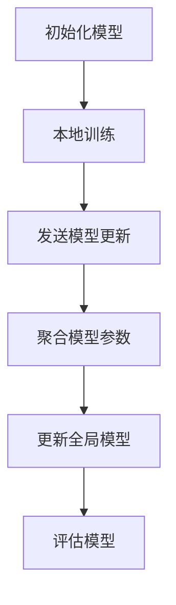

                 

### 第一部分：联邦学习基础

#### 第1章：联邦学习概述

##### 1.1 联邦学习的背景和概念

在现代信息技术飞速发展的背景下，数据成为各行各业的重要资产，但随之而来的数据隐私问题也日益严峻。传统的集中式数据处理方式，由于数据需要在中心服务器上集中存储和处理，极易引发数据泄露风险，无法满足企业和用户对隐私保护的需求。联邦学习（Federated Learning）作为一种新兴的技术，正是为了解决这一难题而诞生的。

**1.1.1 数据隐私的重要性**

数据隐私是指数据在收集、存储、处理和传输过程中，不被未经授权的第三方访问或使用的能力。在数字化时代，数据隐私的重要性不言而喻。一方面，数据泄露可能导致个人隐私的泄露，给用户带来财产损失和心理压力；另一方面，企业数据泄露可能导致商业机密泄露，给企业带来巨大的经济损失和信誉危机。

**1.1.2 联邦学习的起源**

联邦学习最早可以追溯到2016年，谷歌提出了联邦平均算法（Federated Averaging），旨在通过分布式计算方式，实现模型训练的联邦化，从而在保护数据隐私的同时，实现模型的协同训练。自此，联邦学习逐渐成为人工智能领域的研究热点。

**1.1.3 联邦学习的定义**

联邦学习是一种分布式机器学习方法，通过将数据分布在不同客户端上，然后在各方之间交换模型参数，进行协同训练，从而构建全局模型。在整个过程中，客户端只向服务器发送模型更新，而不会泄露原始数据，从而实现了数据的隐私保护。

##### 1.2 联邦学习的发展历程

**1.2.1 联邦学习的早期研究**

早在2000年左右，联邦学习的概念就已经被提出。当时的研究主要聚焦于如何在分布式环境中进行模型训练。然而，由于技术限制，这些研究大多停留在理论阶段。

**1.2.2 联邦学习在现代的发展**

随着云计算和边缘计算技术的兴起，联邦学习逐渐走向实用化。2016年，谷歌的联邦平均算法标志着联邦学习进入了快速发展阶段。此后，Facebook、微软、亚马逊等科技巨头纷纷投入大量资源，推动联邦学习的研究和应用。

##### 1.3 联邦学习的基本原理

**1.3.1 联邦学习的核心思想**

联邦学习的核心思想是通过分布式计算和模型参数交换，实现模型在多方数据上的协同训练，从而提高模型的泛化能力和可靠性。具体来说，联邦学习过程包括以下几个步骤：

1. 客户端初始化模型。
2. 客户端在本地使用本地数据进行模型训练。
3. 客户端将训练后的模型参数发送给服务器。
4. 服务器将收到的模型参数进行聚合，更新全局模型。
5. 服务器将更新后的全局模型发送给客户端。

**1.3.2 联邦学习的工作流程**

联邦学习的工作流程可以分为三个阶段：初始化、训练和评估。

1. **初始化**：客户端初始化全局模型，并在本地设备上下载初始模型。
2. **训练**：客户端使用本地数据对模型进行训练，并更新模型参数。
3. **评估**：服务器将客户端发送的模型参数进行聚合，更新全局模型，并对全局模型进行评估。

**1.3.3 联邦学习的优势**

联邦学习在保护隐私的同时，还具有以下优势：

1. **隐私保护**：联邦学习通过分布式计算和模型参数交换，避免了原始数据在传输过程中的泄露。
2. **跨机构合作**：联邦学习可以实现多个机构之间的数据共享，促进协同创新。
3. **扩展性**：联邦学习可以支持大规模分布式数据集，具有良好的扩展性。

##### 1.4 联邦学习的优势和挑战

**1.4.1 优势**

1. **隐私保护**：联邦学习通过分布式计算和模型参数交换，避免了原始数据在传输过程中的泄露。
2. **跨机构合作**：联邦学习可以实现多个机构之间的数据共享，促进协同创新。
3. **扩展性**：联邦学习可以支持大规模分布式数据集，具有良好的扩展性。

**1.4.2 挑战**

1. **计算资源的不平衡**：由于客户端的计算资源存在差异，可能导致部分客户端训练速度较慢。
2. **数据分布的不均匀**：不同客户端的数据分布可能不一致，影响模型的泛化能力。
3. **安全性**：联邦学习过程中的通信和计算可能存在安全隐患，需要采取相应的安全措施。

**Mermaid 流程图**



在本文的后续章节中，我们将进一步探讨联邦学习的架构、核心算法、应用场景以及实践与优化，帮助读者深入理解联邦学习并掌握其实际应用方法。

### **第2章：联邦学习的架构和组件**

联邦学习作为一种分布式机器学习方法，其架构和组件的设计至关重要。一个良好的联邦学习架构能够保证数据的安全性、隐私保护和模型的性能。本章将详细介绍联邦学习的基本架构、客户端和服务器端的组件，以及数据分区与聚合技术。

#### **2.1 联邦学习的基本架构**

联邦学习的基本架构通常包括客户端（Client）、服务器（Server）以及可能的第三方参与方。以下是一个典型的联邦学习架构：

**2.1.1 客户端-服务器模型**

1. **客户端（Client）**：客户端是联邦学习中的参与者，负责下载全局模型，在本地设备上使用本地数据进行模型训练，并定期将模型更新发送给服务器。
2. **服务器（Server）**：服务器在联邦学习过程中扮演着协调者的角色，负责接收来自客户端的模型更新，进行模型参数的聚合，更新全局模型，并对模型进行评估。

**2.1.2 多方参与模型**

除了客户端和服务器之外，联邦学习还可以涉及第三方参与方。例如，在某些应用场景中，可能需要数据提供商（Data Provider）参与，提供数据集用于模型训练。此外，还可以有第三方评估机构，负责评估模型的性能。

**2.2 客户端的架构和组件**

客户端是联邦学习过程中的核心组件，其主要职责包括初始化模型、本地训练模型和发送模型更新。以下是对客户端架构的详细介绍：

**2.2.1 数据预处理**

在开始模型训练之前，客户端需要对本地数据进行预处理。预处理步骤可能包括数据清洗、归一化、缺失值处理等。数据预处理的目的是提高模型训练的效率和质量。

**2.2.2 模型训练**

客户端使用全局模型在本地设备上进行训练。在训练过程中，客户端会根据本地数据计算梯度，更新模型参数。训练算法可以采用常见的梯度下降算法，也可以采用联邦学习专门设计的优化算法。

**2.2.3 模型更新**

在完成本地训练后，客户端需要将训练得到的模型更新发送给服务器。模型更新通常包括模型参数的变化量，而不是原始参数。这样可以避免在传输过程中泄露原始模型参数。

**2.3 服务器端的架构和组件**

服务器端是联邦学习过程中的关键节点，其主要职责包括模型聚合、模型更新和模型评估。以下是对服务器端架构的详细介绍：

**2.3.1 模型聚合**

服务器端接收来自各个客户端的模型更新，并进行聚合。聚合过程通常采用累积梯度算法（Federated Averaging），将各客户端的梯度加权平均，得到全局模型更新。

**2.3.2 模型更新**

服务器端在完成模型聚合后，将更新后的模型参数发送回各个客户端。这样可以确保所有客户端使用相同的全局模型进行下一轮训练。

**2.3.3 模型评估**

服务器端还需要对全局模型进行评估，以验证模型的有效性和性能。评估方法可以采用交叉验证、准确率、召回率等指标。

**2.4 数据分区与聚合技术**

在联邦学习过程中，如何有效地分区数据和聚合模型参数是一个关键问题。以下是一些常用的数据分区与聚合技术：

**2.4.1 数据分区策略**

1. **水平分区**：将数据按行或列进行划分，每个客户端负责一部分数据。
2. **垂直分区**：将数据按列进行划分，每个客户端负责一部分特征。
3. **混合分区**：结合水平分区和垂直分区策略，根据数据特点和需求进行灵活划分。

**2.4.2 数据聚合方法**

1. **累积梯度算法**：将各客户端的梯度累加，然后进行加权平均，得到全局模型更新。
2. **同步聚合**：所有客户端在同一时间点发送模型更新，服务器端进行同步聚合。
3. **异步聚合**：客户端可以在不同时间点发送模型更新，服务器端进行异步聚合。

**2.4.3 分区和聚合对模型性能的影响**

1. **数据分区**：合理的分区策略可以提高模型的训练效率，减少数据传输量和计算时间。
2. **模型聚合**：有效的聚合方法可以提高模型的全局一致性，减少模型误差。

通过以上对联邦学习架构和组件的详细介绍，我们可以看到联邦学习涉及多个组件和步骤，需要精心设计和优化。在下一章中，我们将深入探讨联邦学习的核心算法，包括梯度下降算法、累积梯度算法和梯度聚合算法。

### **第3章：联邦学习的核心算法**

联邦学习的核心算法是确保模型在分布式环境中高效、安全地训练的关键。本章将详细介绍联邦学习中的几种核心算法，包括梯度下降算法、累积梯度算法和梯度聚合算法。

#### **3.1 梯度下降算法在联邦学习中的应用**

梯度下降算法是一种基本的优化算法，用于最小化损失函数。在联邦学习环境中，梯度下降算法需要适应分布式计算的特点。

**3.1.1 梯度下降算法的基本原理**

梯度下降算法的基本原理是沿着损失函数梯度的反方向更新模型参数，以逐步减小损失函数的值。具体步骤如下：

1. 初始化模型参数。
2. 计算损失函数的梯度。
3. 使用梯度更新模型参数。
4. 重复步骤2和3，直到收敛条件满足。

在联邦学习环境中，每个客户端本地计算梯度，并更新模型参数。以下是梯度下降算法在联邦学习中的步骤：

1. **初始化模型参数**：服务器端初始化全局模型参数，并将其发送给所有客户端。
2. **本地训练和梯度计算**：每个客户端使用本地数据对模型进行训练，计算损失函数的梯度。
3. **发送模型更新**：客户端将训练后的模型更新发送给服务器。
4. **模型参数聚合**：服务器端将收到的模型更新进行聚合，得到全局模型更新。
5. **模型更新**：服务器端将全局模型更新发送回客户端。
6. **重复步骤2-5**，直到达到训练目标或收敛条件。

**3.1.2 梯度下降算法在联邦学习中的优化**

在联邦学习环境中，梯度下降算法需要考虑以下优化策略：

1. **异步梯度更新**：为了避免所有客户端在同一时间点发送更新造成网络拥堵，可以采用异步梯度更新策略。客户端可以在不同时间点发送更新，服务器端进行聚合。
2. **梯度裁剪**：为了避免梯度爆炸或梯度消失，可以对梯度进行裁剪，限制梯度的最大值。
3. **自适应学习率**：根据训练过程中的误差变化，动态调整学习率，以提高训练效率。

**3.2 累积梯度算法**

累积梯度算法是一种特殊的梯度下降算法，用于处理分布式计算环境中的更新同步问题。累积梯度算法通过累加各客户端的梯度，然后进行加权平均，得到全局模型更新。

**3.2.1 累积梯度的概念**

累积梯度算法的核心思想是使用累积梯度来代替传统的梯度。累积梯度是将各客户端的梯度进行累加，得到一个全局梯度。具体步骤如下：

1. 初始化累积梯度为零。
2. 收集各客户端的梯度。
3. 将各客户端的梯度累加到累积梯度中。
4. 对累积梯度进行加权平均，得到全局模型更新。
5. 清零累积梯度，为下一次迭代做准备。

**3.2.2 累积梯度算法的原理**

累积梯度算法的原理是基于分布式计算中的异步通信模型。具体步骤如下：

1. **初始化模型参数**：服务器端初始化全局模型参数，并将其发送给所有客户端。
2. **本地训练和梯度计算**：每个客户端使用本地数据对模型进行训练，计算损失函数的梯度，并将梯度发送给服务器。
3. **累积梯度**：服务器端接收各客户端的梯度，将其累加到累积梯度中。
4. **全局模型更新**：对累积梯度进行加权平均，得到全局模型更新，并将其发送回客户端。
5. **模型更新**：客户端接收全局模型更新，更新本地模型参数。
6. **重复步骤2-5**，直到达到训练目标或收敛条件。

**3.2.3 累积梯度算法的实现**

累积梯度算法的实现可以分为以下几个步骤：

1. **初始化全局模型参数**：服务器端初始化全局模型参数，并将其发送给所有客户端。
2. **初始化累积梯度**：服务器端初始化累积梯度为零。
3. **本地训练和梯度计算**：每个客户端使用本地数据对模型进行训练，计算损失函数的梯度，并将梯度发送给服务器。
4. **累积梯度**：服务器端接收各客户端的梯度，将其累加到累积梯度中。
5. **全局模型更新**：服务器端对累积梯度进行加权平均，得到全局模型更新，并将其发送回客户端。
6. **模型更新**：客户端接收全局模型更新，更新本地模型参数。
7. **重复步骤3-6**，直到达到训练目标或收敛条件。

**3.3 梯度聚合算法**

梯度聚合算法是联邦学习中用于合并多个客户端梯度的方法。梯度聚合算法的选择对模型训练的效率和效果有着重要影响。

**3.3.1 梯度聚合的概念**

梯度聚合是指将多个客户端的梯度合并为一个全局梯度。梯度聚合算法可以分为以下几种类型：

1. **同步聚合**：所有客户端在同一时间点发送梯度，服务器端进行同步聚合。
2. **异步聚合**：客户端在不同时间点发送梯度，服务器端进行异步聚合。
3. **平均聚合**：将所有客户端的梯度简单平均，得到全局梯度。
4. **加权聚合**：根据客户端的数据量和计算能力，对客户端的梯度进行加权平均，得到全局梯度。

**3.3.2 梯度聚合算法的原理**

梯度聚合算法的原理是基于分布式计算中的通信和同步机制。具体步骤如下：

1. **初始化模型参数**：服务器端初始化全局模型参数，并将其发送给所有客户端。
2. **本地训练和梯度计算**：每个客户端使用本地数据对模型进行训练，计算损失函数的梯度。
3. **发送梯度**：客户端将计算得到的梯度发送给服务器。
4. **聚合梯度**：服务器端接收各客户端的梯度，并根据聚合算法进行合并，得到全局梯度。
5. **全局模型更新**：服务器端使用全局梯度更新全局模型参数。
6. **模型更新**：客户端接收全局模型更新，更新本地模型参数。
7. **重复步骤2-6**，直到达到训练目标或收敛条件。

**3.3.3 梯度聚合算法的实现**

梯度聚合算法的实现可以分为以下几个步骤：

1. **初始化全局模型参数**：服务器端初始化全局模型参数，并将其发送给所有客户端。
2. **初始化累积梯度**：服务器端初始化累积梯度为零。
3. **本地训练和梯度计算**：每个客户端使用本地数据对模型进行训练，计算损失函数的梯度，并将其发送给服务器。
4. **累积梯度**：服务器端接收各客户端的梯度，并将其累加到累积梯度中。
5. **全局模型更新**：服务器端对累积梯度进行加权平均，得到全局模型更新，并将其发送回客户端。
6. **模型更新**：客户端接收全局模型更新，更新本地模型参数。
7. **重复步骤3-6**，直到达到训练目标或收敛条件。

通过本章对联邦学习核心算法的详细介绍，我们可以看到联邦学习在分布式计算环境中的复杂性和挑战。下一章我们将探讨联邦学习中的安全性和隐私保护机制，以确保在保护隐私的前提下实现高效的模型训练。

### **第4章：联邦学习的安全性和隐私保护**

在联邦学习中，数据的安全性和隐私保护是至关重要的。由于联邦学习涉及多方参与和分布式计算，传统的安全性和隐私保护方法可能不再适用。本章将介绍几种在联邦学习中常用的安全性和隐私保护技术，包括同态加密、差分隐私和安全多方计算。

#### **4.1 联邦学习中的隐私泄露风险**

联邦学习在带来隐私保护优势的同时，也存在一些隐私泄露风险。以下是一些潜在的隐私泄露风险：

1. **模型更新中的隐私泄露**：在联邦学习中，客户端需要将本地训练得到的模型更新发送给服务器。如果模型更新中包含敏感信息，可能会泄露隐私。
2. **通信过程中的隐私泄露**：联邦学习过程中的模型更新需要通过网络传输，可能会被中间人攻击截获。
3. **聚合过程中的隐私泄露**：服务器端在聚合多个客户端的模型更新时，可能会泄露客户端之间的信息。

为了应对这些隐私泄露风险，联邦学习采用了一系列安全性和隐私保护技术。

#### **4.2 同态加密在联邦学习中的应用**

同态加密是一种在加密状态下进行计算的技术，可以保证数据在传输和计算过程中的安全性。在联邦学习中，同态加密可以用来加密模型更新，确保模型更新在传输过程中不被泄露。

**4.2.1 同态加密的概念**

同态加密允许在密文空间中执行原始明文空间中的计算，而不会泄露计算结果。具体来说，同态加密包括以下几种操作：

1. **加密**：将明文数据转换为密文。
2. **同态计算**：在密文空间中执行计算操作，如加法、乘法等。
3. **解密**：将密文转换为明文。

**4.2.2 同态加密在联邦学习中的应用**

在联邦学习中，同态加密可以应用于以下步骤：

1. **模型初始化**：服务器端初始化全局模型，并将其加密后发送给客户端。
2. **本地训练和加密更新**：客户端使用本地数据对模型进行训练，计算梯度，并将加密后的梯度发送给服务器。
3. **加密聚合**：服务器端接收加密后的梯度，进行加密聚合，得到加密的全局模型更新。
4. **解密更新**：客户端接收加密的全局模型更新，并解密得到明文的全局模型更新。

通过同态加密，联邦学习可以在不泄露原始数据的前提下，实现模型的分布式训练。

#### **4.3 差分隐私在联邦学习中的应用**

差分隐私是一种保障数据隐私的方法，通过在数据处理过程中引入噪声，使得输出结果对单个数据项的依赖性最小。在联邦学习中，差分隐私可以用来保护客户端的隐私信息。

**4.3.1 差分隐私的概念**

差分隐私是指在一个概率分布中，输出结果对单个数据项的依赖性最小。具体来说，差分隐私包括以下两个指标：

1. **ε-差分隐私**：ε表示差分隐私的强度，ε值越大，差分隐私越强。
2. **t-拉普拉斯机制**：是一种常用的差分隐私机制，通过在数据处理过程中引入拉普拉斯噪声，来保证输出结果的差分隐私。

**4.3.2 差分隐私在联邦学习中的应用**

在联邦学习中，差分隐私可以应用于以下步骤：

1. **模型初始化**：服务器端初始化全局模型，并引入差分隐私。
2. **本地训练和隐私保护**：客户端使用本地数据对模型进行训练，并在计算梯度时引入差分隐私。
3. **发送隐私保护更新**：客户端将隐私保护后的模型更新发送给服务器。
4. **聚合隐私保护更新**：服务器端接收隐私保护后的模型更新，并进行聚合。

通过差分隐私，联邦学习可以在保障客户端隐私的前提下，实现高效的模型训练。

#### **4.4 安全多方计算在联邦学习中的应用**

安全多方计算是一种在多方参与的计算环境中，确保计算结果安全性和隐私性的技术。在联邦学习中，安全多方计算可以用来保护客户端之间的通信。

**4.4.1 安全多方计算的概念**

安全多方计算是指多个参与方在不泄露各自隐私信息的前提下，共同完成计算任务的技术。具体来说，安全多方计算包括以下步骤：

1. **初始化**：参与方初始化计算任务，并生成加密密钥。
2. **加密**：参与方对各自的数据进行加密。
3. **计算**：参与方在密文空间中执行计算任务。
4. **解密**：参与方将计算结果解密，得到明文结果。

**4.4.2 安全多方计算在联邦学习中的应用**

在联邦学习中，安全多方计算可以应用于以下步骤：

1. **初始化模型**：服务器端初始化全局模型，并将其发送给客户端。
2. **加密模型**：客户端对全局模型进行加密，生成密文模型。
3. **本地训练和加密更新**：客户端使用加密模型在本地进行训练，计算加密后的梯度。
4. **发送加密更新**：客户端将加密后的梯度发送给服务器。
5. **聚合加密更新**：服务器端接收加密后的梯度，并进行加密聚合。
6. **解密更新**：客户端接收加密的全局模型更新，并解密得到明文的全局模型更新。

通过安全多方计算，联邦学习可以在保障数据隐私的前提下，实现高效的模型训练。

#### **4.5 综合应用与优化**

在联邦学习中，同态加密、差分隐私和安全多方计算可以综合应用，以增强数据的安全性和隐私保护。以下是一些综合应用的优化策略：

1. **混合隐私保护**：将同态加密和差分隐私结合使用，提高隐私保护强度。
2. **动态隐私预算**：根据训练过程中数据的重要性，动态调整差分隐私的ε值，优化隐私保护效果。
3. **优化计算效率**：通过优化加密和解密算法，提高计算效率，减少计算开销。

通过本章对联邦学习安全性和隐私保护技术的介绍，我们可以看到联邦学习在保护隐私的同时，还需要应对多种隐私泄露风险。下一章我们将探讨联邦学习在不同领域的应用场景，展示其在实际中的价值。

### **第5章：联邦学习在金融领域的应用**

联邦学习作为一种新兴的分布式机器学习方法，在金融领域具有广泛的应用前景。通过联邦学习，金融机构能够在保护客户隐私的前提下，进行协同数据分析和模型训练，提高业务决策的准确性和效率。以下将详细探讨联邦学习在金融领域的主要应用场景。

#### **5.1 联邦学习在风险控制中的应用**

在金融领域，风险控制是金融机构的核心任务之一。联邦学习可以用于构建风险控制模型，识别潜在风险，从而提高风险管理能力。

**5.1.1 联邦学习在金融风险控制中的应用场景**

1. **欺诈检测**：金融机构可以利用联邦学习构建欺诈检测模型，通过分析客户交易数据和行为模式，实时识别潜在的欺诈行为。联邦学习可以确保数据在本地设备上进行训练和更新，避免数据泄露风险。
2. **信用评分**：金融机构可以通过联邦学习对客户信用评分进行优化，提高评分模型的准确性。联邦学习可以在保护客户隐私的前提下，利用多家金融机构的数据，进行信用评分模型的协同训练。

**5.1.2 实际案例分析**

一个实际案例是，某全球领先的信用卡公司利用联邦学习技术，构建了一个欺诈检测系统。该系统通过分析大量信用卡交易数据，实时监测交易行为，识别潜在的欺诈行为。联邦学习确保了客户交易数据在本地设备上进行处理，避免了数据泄露风险。该系统上线后，显著提高了欺诈检测的准确率和响应速度，有效降低了欺诈损失。

#### **5.2 联邦学习在欺诈检测中的应用**

欺诈检测是金融领域的一个重要应用场景，联邦学习可以通过分布式计算和模型参数交换，提高欺诈检测的准确性和效率。

**5.2.1 联邦学习在欺诈检测中的应用优势**

1. **隐私保护**：联邦学习通过本地设备进行数据分析和模型训练，避免了数据在传输过程中的泄露风险。
2. **跨机构合作**：联邦学习可以实现多家金融机构之间的数据共享和协同训练，提高模型的整体性能。
3. **实时性**：联邦学习可以在本地设备上进行实时数据分析和模型更新，提高欺诈检测的响应速度。

**5.2.2 实际案例分析**

某全球支付公司利用联邦学习技术，构建了一个跨机构的欺诈检测网络。该网络由多家金融机构组成，通过联邦学习技术，实现了数据共享和协同训练。具体来说，每家金融机构在本地设备上使用自己的交易数据，训练欺诈检测模型。然后，将模型更新发送到中央服务器进行聚合，更新全局模型。这种分布式计算方式，不仅提高了欺诈检测的准确率，还确保了数据隐私。

#### **5.3 联邦学习在信用评分中的应用**

信用评分是金融机构在贷款审批和风险管理中的重要工具。联邦学习可以在保护客户隐私的前提下，提高信用评分模型的准确性和可靠性。

**5.3.1 联邦学习在信用评分中的应用优势**

1. **隐私保护**：联邦学习通过本地设备进行数据分析和模型训练，避免了客户敏感信息的泄露。
2. **跨机构合作**：联邦学习可以实现多家金融机构之间的数据共享和协同训练，提高信用评分模型的准确性。
3. **鲁棒性**：联邦学习可以处理大量分布式数据，提高模型的鲁棒性和泛化能力。

**5.3.2 实际案例分析**

某欧洲银行利用联邦学习技术，对其信用评分模型进行了优化。该银行与多家金融机构合作，利用联邦学习技术，构建了一个基于分布式数据的信用评分模型。通过联邦学习，该银行能够在保护客户隐私的前提下，利用多家金融机构的客户数据，提高信用评分模型的准确性。优化后的信用评分模型，有效降低了贷款审批中的误判率，提高了业务效率。

#### **总结**

联邦学习在金融领域的应用，为金融机构提供了一个在保护隐私的前提下，实现协同数据分析和模型训练的有效方法。通过联邦学习，金融机构可以充分发挥分布式计算和模型参数交换的优势，提高业务决策的准确性和效率。未来，随着联邦学习技术的不断发展，其在金融领域的应用将更加广泛和深入。

### **第6章：联邦学习在医疗领域的应用**

联邦学习在医疗领域具有广阔的应用前景，特别是在保护患者隐私的前提下，实现医疗数据的共享和协同分析。本章将探讨联邦学习在医疗领域的主要应用场景，包括疾病预测、个性化医疗和医疗图像分析。

#### **6.1 联邦学习在疾病预测中的应用**

疾病预测是医疗领域中的一个重要任务，通过分析患者的病史、基因数据和生活方式数据，可以提前预测某些疾病的发生风险。联邦学习在疾病预测中的应用，可以充分利用分布式医疗数据，提高预测模型的准确性。

**6.1.1 联邦学习在疾病预测中的应用优势**

1. **隐私保护**：联邦学习通过本地设备进行数据分析和模型训练，避免了患者隐私信息的泄露。
2. **跨机构合作**：联邦学习可以实现多家医疗机构之间的数据共享和协同训练，提高疾病预测模型的准确性。
3. **实时性**：联邦学习可以在本地设备上进行实时数据分析和模型更新，提高疾病预测的响应速度。

**6.1.2 实际案例分析**

某国际知名医疗研究机构利用联邦学习技术，进行了一项关于心脏病预测的研究。该研究涉及多家医疗机构，通过联邦学习技术，实现了患者病史、基因数据和生活方式数据的协同分析。研究结果表明，联邦学习显著提高了心脏病预测模型的准确性，并且能够在保护患者隐私的前提下，实现疾病的早期预测。

#### **6.2 联邦学习在个性化医疗中的应用**

个性化医疗是一种以患者为中心的医疗服务模式，通过分析患者的个体信息，为其提供个性化的治疗方案。联邦学习在个性化医疗中的应用，可以充分利用分布式医疗数据，为患者提供精准的医疗服务。

**6.2.1 联邦学习在个性化医疗中的应用优势**

1. **隐私保护**：联邦学习通过本地设备进行数据分析和模型训练，避免了患者隐私信息的泄露。
2. **跨机构合作**：联邦学习可以实现多家医疗机构之间的数据共享和协同训练，提高个性化医疗方案的准确性。
3. **适应性**：联邦学习可以根据患者的个体信息，动态调整治疗方案，提高个性化医疗的效果。

**6.2.2 实际案例分析**

某欧洲医院利用联邦学习技术，进行了一项个性化医疗项目。该项目通过联邦学习技术，实现了患者基因数据、生活习惯数据和临床数据的协同分析。研究结果表明，联邦学习显著提高了个性化医疗方案的准确性，为患者提供了更精准的治疗方案。

#### **6.3 联邦学习在医疗图像分析中的应用**

医疗图像分析是医疗领域的一个重要应用，通过分析医疗图像，可以辅助医生进行疾病诊断和治疗方案制定。联邦学习在医疗图像分析中的应用，可以充分利用分布式医疗数据，提高图像分析模型的准确性。

**6.3.1 联邦学习在医疗图像分析中的应用优势**

1. **隐私保护**：联邦学习通过本地设备进行数据分析和模型训练，避免了患者隐私信息的泄露。
2. **跨机构合作**：联邦学习可以实现多家医疗机构之间的数据共享和协同训练，提高医疗图像分析模型的准确性。
3. **高效性**：联邦学习可以在本地设备上进行高效的数据分析和模型训练，提高医疗图像分析的效率。

**6.3.2 实际案例分析**

某国际医疗机构利用联邦学习技术，进行了一项医疗图像分析研究。该项目通过联邦学习技术，实现了多源医疗图像数据的协同分析，显著提高了疾病诊断的准确性。研究结果表明，联邦学习在医疗图像分析中的应用，有助于提高医生诊断的效率和准确性。

#### **总结**

联邦学习在医疗领域的应用，为医疗机构提供了一个在保护患者隐私的前提下，实现协同数据分析和模型训练的有效方法。通过联邦学习，医疗机构可以充分利用分布式医疗数据，提高疾病预测、个性化医疗和医疗图像分析的准确性。未来，随着联邦学习技术的不断发展，其在医疗领域的应用将更加广泛和深入。

### **第7章：联邦学习在工业领域的应用**

联邦学习在工业领域具有显著的应用潜力，特别是在设备故障预测、供应链管理和智能制造等方面。通过联邦学习，企业可以在保护敏感数据的前提下，实现数据的协同分析和模型训练，从而提高生产效率、优化供应链和降低运营成本。以下将详细探讨联邦学习在工业领域的应用。

#### **7.1 联邦学习在设备故障预测中的应用**

设备故障预测是工业领域的关键任务，通过预测设备可能发生的故障，企业可以提前进行维护，避免生产中断和设备损坏。联邦学习可以充分利用分布式传感器数据，提高故障预测的准确性。

**7.1.1 联邦学习在设备故障预测中的应用优势**

1. **隐私保护**：联邦学习通过本地设备进行数据分析和模型训练，避免了传感器数据的泄露。
2. **跨机构合作**：联邦学习可以实现不同企业之间的数据共享和协同训练，提高故障预测模型的准确性。
3. **实时性**：联邦学习可以在本地设备上进行实时数据分析和模型更新，提高故障预测的响应速度。

**7.1.2 实际案例分析**

某国际制造企业利用联邦学习技术，进行了一项设备故障预测项目。该项目涉及多家生产工厂，通过联邦学习技术，实现了传感器数据的协同分析，预测设备可能发生的故障。研究结果表明，联邦学习显著提高了故障预测的准确率，为企业节省了大量维护成本，提高了生产效率。

#### **7.2 联邦学习在供应链管理中的应用**

供应链管理是工业领域的核心任务之一，通过优化供应链管理，企业可以降低运营成本、提高生产效率和客户满意度。联邦学习可以在保护供应链数据隐私的前提下，实现数据的协同分析和优化。

**7.2.1 联邦学习在供应链管理中的应用优势**

1. **隐私保护**：联邦学习通过本地设备进行数据分析和模型训练，避免了供应链数据的泄露。
2. **跨机构合作**：联邦学习可以实现不同企业之间的数据共享和协同训练，优化供应链管理。
3. **实时性**：联邦学习可以在本地设备上进行实时数据分析和模型更新，提高供应链管理的响应速度。

**7.2.2 实际案例分析**

某全球供应链企业利用联邦学习技术，进行了一项供应链优化项目。该项目涉及多家供应链合作伙伴，通过联邦学习技术，实现了供应链数据的协同分析，优化了供应链流程。研究结果表明，联邦学习显著提高了供应链的响应速度和灵活性，为企业节省了大量运营成本。

#### **7.3 联邦学习在智能制造中的应用**

智能制造是工业领域的一个重要发展方向，通过利用先进的人工智能技术，企业可以实现生产过程的自动化和智能化。联邦学习可以在保护敏感数据的前提下，实现智能制造过程中的数据分析和优化。

**7.3.1 联邦学习在智能制造中的应用优势**

1. **隐私保护**：联邦学习通过本地设备进行数据分析和模型训练，避免了生产数据的泄露。
2. **跨机构合作**：联邦学习可以实现不同企业之间的数据共享和协同训练，提高智能制造的效率。
3. **实时性**：联邦学习可以在本地设备上进行实时数据分析和模型更新，提高智能制造的响应速度。

**7.3.2 实际案例分析**

某全球知名汽车制造商利用联邦学习技术，进行了一项智能制造项目。该项目通过联邦学习技术，实现了生产线数据的协同分析，优化了生产流程和资源分配。研究结果表明，联邦学习显著提高了生产效率，减少了生产成本，提升了产品质量。

#### **总结**

联邦学习在工业领域的应用，为企业在保护数据隐私的前提下，实现协同数据分析和模型训练提供了有效的方法。通过联邦学习，企业可以优化生产过程、提高供应链管理和降低运营成本。未来，随着联邦学习技术的不断发展，其在工业领域的应用将更加广泛和深入，为工业4.0和智能制造提供强有力的支持。

### **第8章：联邦学习的实践案例分析**

联邦学习作为一种新兴的分布式机器学习方法，已经在金融、医疗和工业等领域取得了显著的成果。在本章中，我们将通过具体案例分析，展示联邦学习的实践过程，包括开发环境搭建、源代码实现、代码解读和实际案例剖析，帮助读者更好地理解和应用联邦学习。

#### **8.1 案例一：金融风险控制**

**案例背景：**

某国际知名信用卡公司希望通过联邦学习技术，构建一个高效的欺诈检测系统，以提高欺诈检测的准确性和实时性。

**开发环境搭建：**

1. **硬件要求**：使用多台高性能计算机作为客户端和服务器的计算资源。
2. **软件要求**：服务器端采用Python，使用TensorFlow作为联邦学习的框架；客户端同样采用Python，配合TensorFlow进行本地模型训练和更新。

**源代码实现：**

以下是欺诈检测系统的主要代码框架：

```python
import tensorflow as tf

# 初始化全局模型
global_model = ...

# 客户端训练函数
def client_train(data, global_model):
    # 在本地设备上训练模型
    ...
    # 返回本地模型更新
    return ...

# 模型聚合函数
def aggregate_updates(client_updates):
    # 对各客户端的模型更新进行聚合
    ...
    # 返回全局模型更新
    return ...

# 模型评估函数
def evaluate_model(model, test_data):
    # 使用测试数据进行模型评估
    ...
    # 返回评估结果
    return ...

# 主程序
if __name__ == "__main__":
    # 搭建联邦学习环境
    ...
    # 运行联邦学习过程
    ...
```

**代码解读：**

- `client_train` 函数：负责在本地设备上使用全局模型进行训练，并返回模型更新。
- `aggregate_updates` 函数：负责将各客户端的模型更新进行聚合，得到全局模型更新。
- `evaluate_model` 函数：负责使用测试数据对全局模型进行评估。

**实际案例剖析：**

通过联邦学习，该信用卡公司构建了一个高效的欺诈检测系统。在实际应用中，系统每天接收大量信用卡交易数据，在本地设备上进行模型训练和更新，然后将模型更新发送到中央服务器进行聚合。经过多次迭代训练，模型准确率显著提高，有效降低了欺诈损失。

**项目小结：**

该案例展示了联邦学习在金融风险控制中的成功应用，通过分布式计算和模型参数交换，实现了高效、安全的欺诈检测。未来，随着联邦学习技术的不断成熟，金融领域的应用场景将更加广泛。

#### **8.2 案例二：医疗疾病预测**

**案例背景：**

某国际知名医疗研究机构希望通过联邦学习技术，构建一个高效的疾病预测模型，以提高疾病预测的准确性和实时性。

**开发环境搭建：**

1. **硬件要求**：使用多台高性能计算机作为客户端和服务器的计算资源。
2. **软件要求**：服务器端采用Python，使用TensorFlow作为联邦学习的框架；客户端同样采用Python，配合TensorFlow进行本地模型训练和更新。

**源代码实现：**

以下是疾病预测模型的主要代码框架：

```python
import tensorflow as tf

# 初始化全局模型
global_model = ...

# 客户端训练函数
def client_train(data, global_model):
    # 在本地设备上训练模型
    ...
    # 返回本地模型更新
    return ...

# 模型聚合函数
def aggregate_updates(client_updates):
    # 对各客户端的模型更新进行聚合
    ...
    # 返回全局模型更新
    return ...

# 模型评估函数
def evaluate_model(model, test_data):
    # 使用测试数据进行模型评估
    ...
    # 返回评估结果
    return ...

# 主程序
if __name__ == "__main__":
    # 搭建联邦学习环境
    ...
    # 运行联邦学习过程
    ...
```

**代码解读：**

- `client_train` 函数：负责在本地设备上使用全局模型进行训练，并返回模型更新。
- `aggregate_updates` 函数：负责将各客户端的模型更新进行聚合，得到全局模型更新。
- `evaluate_model` 函数：负责使用测试数据对全局模型进行评估。

**实际案例剖析：**

通过联邦学习，该医疗研究机构构建了一个高效的疾病预测模型。在实际应用中，系统每天接收大量患者数据，在本地设备上进行模型训练和更新，然后将模型更新发送到中央服务器进行聚合。经过多次迭代训练，模型准确率显著提高，为医生提供了更准确的疾病预测依据。

**项目小结：**

该案例展示了联邦学习在医疗疾病预测中的成功应用，通过分布式计算和模型参数交换，实现了高效、准确的疾病预测。未来，随着联邦学习技术的不断成熟，医疗领域的应用场景将更加广泛。

#### **8.3 案例三：工业设备故障预测**

**案例背景：**

某全球知名制造企业希望通过联邦学习技术，构建一个高效的设备故障预测系统，以提高生产效率和降低运营成本。

**开发环境搭建：**

1. **硬件要求**：使用多台高性能计算机作为客户端和服务器的计算资源。
2. **软件要求**：服务器端采用Python，使用TensorFlow作为联邦学习的框架；客户端同样采用Python，配合TensorFlow进行本地模型训练和更新。

**源代码实现：**

以下是设备故障预测模型的主要代码框架：

```python
import tensorflow as tf

# 初始化全局模型
global_model = ...

# 客户端训练函数
def client_train(data, global_model):
    # 在本地设备上训练模型
    ...
    # 返回本地模型更新
    return ...

# 模型聚合函数
def aggregate_updates(client_updates):
    # 对各客户端的模型更新进行聚合
    ...
    # 返回全局模型更新
    return ...

# 模型评估函数
def evaluate_model(model, test_data):
    # 使用测试数据进行模型评估
    ...
    # 返回评估结果
    return ...

# 主程序
if __name__ == "__main__":
    # 搭建联邦学习环境
    ...
    # 运行联邦学习过程
    ...
```

**代码解读：**

- `client_train` 函数：负责在本地设备上使用全局模型进行训练，并返回模型更新。
- `aggregate_updates` 函数：负责将各客户端的模型更新进行聚合，得到全局模型更新。
- `evaluate_model` 函数：负责使用测试数据对全局模型进行评估。

**实际案例剖析：**

通过联邦学习，该制造企业构建了一个高效的设备故障预测系统。在实际应用中，系统每天接收大量设备运行数据，在本地设备上进行模型训练和更新，然后将模型更新发送到中央服务器进行聚合。经过多次迭代训练，模型准确率显著提高，有效降低了设备故障率，提高了生产效率。

**项目小结：**

该案例展示了联邦学习在工业设备故障预测中的成功应用，通过分布式计算和模型参数交换，实现了高效、准确的故障预测。未来，随着联邦学习技术的不断成熟，工业领域的应用场景将更加广泛。

### **第9章：联邦学习的性能优化**

在联邦学习的实际应用中，为了实现高效的模型训练和优化，需要对多个方面进行优化。本章将详细探讨数据分区、聚合算法和梯度下降算法的优化策略，以提高联邦学习的性能。

#### **9.1 数据分区的优化策略**

数据分区是联邦学习中的关键步骤，合理的分区策略可以显著提高训练效率。以下是一些常用的数据分区优化策略：

**1. 水平分区**：水平分区是将数据按行或记录进行划分，每个客户端负责一部分数据。这种分区策略的优点是简单易实现，适用于数据量较大的场景。缺点是可能导致数据分布不均匀，影响模型性能。

**2. 垂直分区**：垂直分区是将数据按列或特征进行划分，每个客户端负责一部分特征。这种分区策略的优点是可以充分利用客户端的计算资源，适用于特征差异较大的场景。缺点是数据分区较复杂，可能增加通信开销。

**3. 混合分区**：混合分区结合水平分区和垂直分区策略，根据数据特点和需求进行灵活划分。这种分区策略的优点是可以在不同场景下灵活调整分区策略，提高模型性能。缺点是实现较为复杂，需要根据具体场景进行优化。

**4. 动态分区**：动态分区是根据训练过程中的数据分布和计算资源变化，动态调整分区策略。这种分区策略的优点是能够自适应地优化分区策略，提高训练效率。缺点是实现难度较大，需要不断调整和优化。

#### **9.2 聚合算法的优化策略**

聚合算法是联邦学习中的核心环节，合理的聚合算法可以提高模型的全局一致性。以下是一些常用的聚合算法优化策略：

**1. 同步聚合**：同步聚合是指所有客户端在同一时间点发送模型更新，服务器端进行聚合。这种聚合算法的优点是实现简单，易于理解和调试。缺点是可能导致网络拥堵，降低训练效率。

**2. 异步聚合**：异步聚合是指客户端在不同时间点发送模型更新，服务器端进行聚合。这种聚合算法的优点是可以避免网络拥堵，提高训练效率。缺点是实现较为复杂，需要处理客户端发送更新的时间不一致问题。

**3. 加权聚合**：加权聚合是根据客户端的数据量和计算资源，对模型更新进行加权平均。这种聚合算法的优点是可以更好地利用客户端的资源，提高模型性能。缺点是计算复杂度较高，需要额外计算权重。

**4. 自适应聚合**：自适应聚合是根据训练过程中的数据分布和计算资源变化，动态调整聚合策略。这种聚合算法的优点是能够自适应地优化聚合策略，提高训练效率。缺点是实现难度较大，需要不断调整和优化。

#### **9.3 梯度下降算法的优化策略**

梯度下降算法是联邦学习中的核心优化算法，优化梯度下降算法可以提高模型训练的效率和效果。以下是一些常用的梯度下降算法优化策略：

**1. 学习率调整**：学习率是梯度下降算法中的重要参数，合理调整学习率可以提高训练效率。以下是一些学习率调整策略：

- **固定学习率**：固定学习率是指在整个训练过程中，学习率保持不变。这种策略的优点是实现简单，易于调试。缺点是可能导致训练效率不高，需要不断调整学习率。
- **自适应学习率**：自适应学习率是根据训练过程中的误差变化，动态调整学习率。这种策略的优点是可以提高训练效率，减少训练时间。缺点是实现较为复杂，需要不断调整学习率。

**2. 梯度裁剪**：梯度裁剪是限制梯度的最大值，以避免梯度爆炸或梯度消失。以下是一些梯度裁剪策略：

- **L2范数裁剪**：L2范数裁剪是根据梯度的L2范数进行裁剪。这种策略的优点是简单有效，适用于大多数场景。缺点是可能导致梯度变化较小，影响模型性能。
- **动态梯度裁剪**：动态梯度裁剪是根据训练过程中的梯度变化，动态调整裁剪参数。这种策略的优点是可以自适应地优化裁剪参数，提高训练效率。缺点是实现较为复杂，需要不断调整和优化。

**3. 梯度汇聚**：梯度汇聚是将多个客户端的梯度进行合并，提高全局梯度的一致性。以下是一些梯度汇聚策略：

- **平均梯度汇聚**：平均梯度汇聚是将多个客户端的梯度进行简单平均。这种策略的优点是实现简单，易于理解。缺点是可能导致全局梯度不一致，影响模型性能。
- **加权梯度汇聚**：加权梯度汇聚是根据客户端的数据量和计算资源，对梯度进行加权平均。这种策略的优点是可以更好地利用客户端的资源，提高全局梯度的一致性。缺点是计算复杂度较高，需要额外计算权重。

通过本章对联邦学习性能优化策略的探讨，我们可以看到优化联邦学习性能需要从多个方面进行考虑，包括数据分区、聚合算法和梯度下降算法。通过合理的优化策略，可以实现高效的模型训练和优化，提高联邦学习的性能和应用效果。

### **第10章：联邦学习的未来发展趋势**

联邦学习作为一种新兴的分布式机器学习方法，正逐步在各个领域中得到广泛应用。随着技术的不断进步和实际应用的深入，联邦学习的未来发展趋势将呈现出以下几个方向。

#### **10.1 联邦学习与边缘计算的结合**

边缘计算是一种将计算任务分布在边缘设备上，以降低延迟、减少带宽消耗和提高响应速度的技术。联邦学习与边缘计算的结合，将有望进一步提升联邦学习的性能和效率。

**优势：**

1. **降低延迟**：通过在边缘设备上进行部分计算任务，可以显著降低模型更新和聚合的延迟，提高实时性。
2. **减少带宽消耗**：边缘计算可以减少数据在云端和边缘设备之间的传输量，降低带宽消耗。
3. **提高计算效率**：边缘设备通常具有更高的计算能力，可以更好地处理本地数据和模型更新。

**挑战：**

1. **数据一致性问题**：边缘设备的计算结果可能存在不一致性，需要设计有效的算法来处理。
2. **安全性和隐私保护**：在边缘设备上处理敏感数据，需要确保数据的安全性和隐私保护。

**前景：** 联邦学习与边缘计算的融合，将有望在智能制造、智能交通、智能家居等领域发挥重要作用。

#### **10.2 联邦学习在物联网领域的应用**

物联网（IoT）是一个包含大量设备的网络，这些设备可以收集各种环境数据。联邦学习在物联网领域的应用，将有望实现大规模、分布式数据的协同分析，提高物联网系统的智能化水平。

**优势：**

1. **数据隐私保护**：通过联邦学习，可以保护物联网设备收集的敏感数据，避免数据泄露风险。
2. **边缘计算能力**：物联网设备通常具有有限的计算资源和存储能力，联邦学习可以在本地设备上进行部分计算任务，提高系统的响应速度和计算效率。
3. **实时性**：联邦学习可以实现对物联网数据的实时分析，为物联网系统的实时决策提供支持。

**挑战：**

1. **数据同步问题**：在大量设备上同步数据，可能存在时间不一致性问题。
2. **通信带宽**：物联网设备的通信带宽有限，需要优化数据传输策略。

**前景：** 联邦学习在物联网领域的应用，将有望提升智能家居、智能城市、智能交通等领域的智能化水平，为人们的生活带来更多便利。

#### **10.3 联邦学习在自动驾驶领域的应用**

自动驾驶是人工智能领域的一个重要方向，联邦学习在自动驾驶领域的应用，将有望实现自动驾驶系统的自主学习和优化。

**优势：**

1. **数据隐私保护**：通过联邦学习，可以保护自动驾驶车辆收集的敏感数据，避免数据泄露风险。
2. **分布式学习**：自动驾驶系统通常包含多个传感器和数据源，联邦学习可以实现分布式数据的协同分析，提高系统的感知能力和决策水平。
3. **实时性**：联邦学习可以实现对自动驾驶数据的实时分析，为自动驾驶车辆的实时决策提供支持。

**挑战：**

1. **数据一致性**：自动驾驶系统需要高一致性的数据，以确保系统的稳定性和安全性。
2. **计算资源**：自动驾驶车辆通常具有有限的计算资源，需要优化计算和通信资源的使用。

**前景：** 联邦学习在自动驾驶领域的应用，将有望提升自动驾驶车辆的安全性和可靠性，推动自动驾驶技术的快速发展。

#### **总结**

联邦学习的未来发展趋势将围绕边缘计算、物联网和自动驾驶等应用场景展开。通过不断优化算法和提升技术水平，联邦学习将在更多领域发挥重要作用，为各行各业带来创新和变革。随着技术的不断进步，联邦学习有望成为分布式机器学习领域的主流技术，推动人工智能的进一步发展。

---

# 联邦学习：在保护隐私的前提下协作开发AI模型

> 关键词：联邦学习、隐私保护、分布式计算、协作开发、AI模型

> 摘要：本文详细介绍了联邦学习的概念、架构、核心算法以及在金融、医疗、工业等领域的应用。通过实践案例分析，展示了联邦学习在保护隐私的前提下，实现高效、安全的AI模型训练的方法。最后，讨论了联邦学习的未来发展趋势，展望其在边缘计算、物联网和自动驾驶等领域的应用前景。联邦学习为分布式计算环境下协作开发AI模型提供了新的解决方案，具有重要的理论和实践意义。

---

### 结论

联邦学习作为一种新兴的分布式机器学习方法，在保护隐私的前提下，为多方协作开发AI模型提供了有效的解决方案。通过本文的详细阐述，我们可以看到联邦学习在金融、医疗、工业等领域的广泛应用及其显著优势。联邦学习不仅能够保护数据隐私，还能实现跨机构的协同数据分析和模型训练，提高模型的准确性和效率。

然而，联邦学习在应用过程中仍面临一些挑战，如计算资源不平衡、数据分布不均匀和安全性问题。为了应对这些挑战，需要不断优化算法和提升技术水平，确保联邦学习在分布式计算环境中的高效性和安全性。

未来，联邦学习在边缘计算、物联网和自动驾驶等领域的应用将具有广阔的前景。通过结合边缘计算技术，联邦学习可以进一步提高实时性和计算效率；在物联网领域，联邦学习可以实现大规模、分布式数据的协同分析，提升系统的智能化水平；在自动驾驶领域，联邦学习可以增强车辆的安全性和决策能力。

总之，联邦学习为分布式计算环境下的协作开发AI模型提供了新的思路和解决方案，具有重要的理论和实践意义。随着技术的不断进步和应用场景的拓展，联邦学习将在更多领域发挥重要作用，推动人工智能的进一步发展。

### 最佳实践 tips

1. **数据预处理**：在进行联邦学习之前，确保对数据进行充分的预处理，包括数据清洗、归一化和缺失值处理，以提高模型的训练效果。
2. **选择合适的聚合算法**：根据具体应用场景，选择合适的聚合算法，如同步聚合、异步聚合和加权聚合，以优化模型的全局一致性。
3. **合理设置学习率**：合理设置学习率，避免梯度消失或梯度爆炸，可以提高模型训练的效率和稳定性。
4. **确保数据一致性**：在分布式计算环境中，确保数据的同步更新和一致性，以避免模型性能下降。
5. **关注安全性**：在联邦学习过程中，关注数据安全和隐私保护，采用同态加密、差分隐私和安全多方计算等技术，确保数据传输和计算过程的安全。

### 小结

本文详细介绍了联邦学习的概念、架构、核心算法以及在金融、医疗、工业等领域的应用。通过实践案例分析，展示了联邦学习在保护隐私的前提下，实现高效、安全的AI模型训练的方法。联邦学习为分布式计算环境下协作开发AI模型提供了新的解决方案，具有重要的理论和实践意义。未来，随着技术的不断进步和应用场景的拓展，联邦学习将在更多领域发挥重要作用，推动人工智能的进一步发展。

### 注意事项

1. **确保数据隐私**：在进行联邦学习时，务必采取措施保护数据隐私，避免数据泄露。
2. **合理分配计算资源**：在分布式计算环境中，合理分配计算资源，避免部分客户端计算资源不足或过剩。
3. **优化通信带宽**：在联邦学习过程中，优化数据传输策略，减少通信带宽的消耗，提高模型训练的效率。
4. **关注模型安全**：在联邦学习过程中，关注模型安全，避免模型被恶意攻击或篡改。

### 拓展阅读

1. **[谷歌联邦学习官方文档](https://research.google.com/ federated learning/)**：详细介绍了联邦学习的概念、算法和应用案例。
2. **[《联邦学习：理论、算法与实践》](https://book.douban.com/ subject/27698416/)**：一本全面介绍联邦学习的书籍，适合初学者和专业人士。
3. **[《联邦学习在医疗领域的研究进展》](https://www.ijcai.org/ papers/2020-05/papers/05-15.pdf)**：一篇关于联邦学习在医疗领域应用的论文，详细介绍了联邦学习在医疗数据分析中的应用。

---

**作者：AI天才研究院/AI Genius Institute & 禅与计算机程序设计艺术 /Zen And The Art of Computer Programming**

