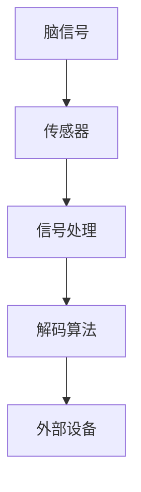

                 

### 脑机接口技术：直接增强人类理解世界的能力

#### 关键词：
- 脑机接口
- 信号检测
- 信号解码
- 软件开发
- 硬件技术
- 安全性

#### 摘要：
本文旨在全面探讨脑机接口（Brain-Computer Interface, BCI）技术，解释其如何通过直接与大脑交互来增强人类的理解世界的能力。文章首先介绍了脑机接口的基本概念、历史背景及其关键技术的组成。接着，详细分析了脑信号的检测与处理、信号解码算法、硬件技术以及软件开发过程。然后，讨论了脑机接口在医疗、教育和工业军事领域的应用实例。最后，探讨了脑机接口技术的未来发展趋势以及在实际应用中需要注意的安全性和最佳实践。

### 脑机接口技术基础

#### 1.1 脑机接口的定义与历史

脑机接口（BCI）是一种直接连接大脑和外部设备的技术，它通过记录和解释大脑信号来控制外部设备或实现信息的传递。BCI技术的基本原理是利用大脑产生的电信号，通过传感器（如电极、光传感器等）捕捉这些信号，然后通过信号处理算法将信号转换为可操作的指令。

BCI技术的发展可以追溯到20世纪60年代，当时主要研究目的是通过非侵入性方法来记录大脑活动。早期的研究主要集中在脑电图（EEG）信号的记录与分析上。随着科技的进步，BCI技术逐渐发展壮大，包括侵入性和非侵入性方法，例如功能性磁共振成像（fMRI）和脑磁图（MEG）等。近年来，BCI技术开始应用于医疗康复、人机交互、游戏娱乐和脑机智能等领域，展现了其巨大的潜力和广泛的应用前景。

#### 1.2 脑机接口的关键技术

脑机接口技术主要包括以下几个关键组成部分：

1. **信号检测与采集**：这是脑机接口技术的基础，通过电极、光传感器等设备来检测大脑产生的电信号或光学信号。
2. **信号处理与特征提取**：对采集到的原始信号进行滤波、降噪等预处理，然后提取出具有特定意义的特征。
3. **信号解码与控制转换**：将提取的特征转换为可操作的指令或信号，用于控制外部设备。
4. **硬件与软件系统集成**：将信号采集、处理和外部设备控制集成到一个系统中，实现脑机接口的整体功能。

#### 1.3 脑机接口的应用领域

脑机接口技术在各个领域都有广泛的应用，以下是几个主要的应用领域：

1. **医疗康复**：BCI技术可以用于帮助中风患者康复，通过脑信号控制假肢、轮椅等辅助设备。
2. **人机交互**：BCI技术可以用于开发更自然、直观的人机交互界面，如脑控鼠标、键盘和游戏控制器。
3. **游戏娱乐**：脑机接口技术为游戏提供了新的交互方式，玩家可以通过脑信号来控制游戏角色或实现游戏玩法。
4. **脑机智能**：通过将人类大脑与计算机系统集成，开发出具有更高智能的人工智能系统。
5. **教育**：BCI技术可以用于个性化教育，根据学生的脑信号调整教学内容和进度。

### 核心概念与联系

为了更好地理解脑机接口技术的工作原理，我们首先需要了解其中的核心概念及其相互关系。以下是脑机接口技术的主要核心概念和它们之间的联系：

1. **脑信号**：脑信号是大脑活动产生的电信号或光学信号，它们是脑机接口技术的基础。
2. **传感器**：传感器用于捕捉脑信号，常见的有电极、光传感器等。
3. **信号处理**：信号处理是对原始脑信号进行预处理、滤波和特征提取的过程，以获得具有明确意义的特征。
4. **解码算法**：解码算法用于将提取的特征转换为可操作的指令或信号，是脑机接口的核心。
5. **外部设备**：外部设备是脑机接口技术的输出端，根据解码出的指令进行相应操作。

为了更直观地展示这些核心概念之间的关系，我们可以使用Mermaid流程图来描述它们：



在这个流程图中，脑信号通过传感器被捕捉并传输到信号处理模块，然后经过特征提取和预处理，最终被解码算法转换为指令，这些指令通过外部设备执行具体的操作。

### 核心算法原理讲解

脑机接口技术中的核心算法原理主要涉及信号解码，即将脑信号转换为可操作指令的过程。以下是几个常用的解码算法及其原理：

1. **基于模板匹配的解码算法**：这种算法通过预先训练好的模板与实时采集的脑信号进行匹配，找到匹配度最高的模板，并将其对应的指令输出。这种算法的优点是实现简单，但需要大量训练数据。

2. **基于机器学习的解码算法**：这种算法利用机器学习技术，从大量的脑信号数据中学习特征，并建立特征与指令之间的映射关系。常见的机器学习方法有支持向量机（SVM）、神经网络（ANN）等。这种算法的优点是适应性强，可以处理复杂信号。

3. **基于统计模型的解码算法**：这种算法通过建立脑信号与指令之间的统计模型，如高斯混合模型（GMM）等，来解码脑信号。这种算法的优点是计算效率高，适用于实时应用。

下面我们使用Python代码来详细阐述一种基于支持向量机（SVM）的解码算法：

```python
from sklearn.svm import SVC
from sklearn.model_selection import train_test_split
from sklearn.metrics import accuracy_score

# 假设已经收集了一组脑信号特征和对应的指令标签
X = ...  # 特征数据
y = ...  # 指令标签

# 数据预处理
X_train, X_test, y_train, y_test = train_test_split(X, y, test_size=0.2, random_state=42)

# 使用SVM进行训练
clf = SVC(kernel='linear')
clf.fit(X_train, y_train)

# 进行解码
y_pred = clf.predict(X_test)

# 评估解码准确率
accuracy = accuracy_score(y_test, y_pred)
print(f"解码准确率：{accuracy * 100}%")
```

上述代码首先导入所需的库，然后假设已经有一组脑信号特征数据`X`和对应的指令标签数据`y`。接着进行数据预处理，将数据分为训练集和测试集。然后使用线性核的支持向量机（SVM）进行训练，最后进行解码并评估解码准确率。

### 数学模型和公式讲解

在脑机接口技术中，数学模型和公式用于描述信号处理和特征提取的过程。以下是几个常用的数学模型和公式：

1. **滤波器**：用于信号预处理，常见的是巴特沃斯滤波器，其传递函数为：
   $$ H(s) = \frac{1}{1 + Q\omega_n s} $$
   其中，\( Q \) 是品质因数，\( \omega_n \) 是截止频率。

2. **特征提取**：常用的特征提取方法有主成分分析（PCA）和线性判别分析（LDA）。PCA的数学模型为：
   $$ Z = PC $$
   其中，\( Z \) 是标准化后的特征矩阵，\( P \) 是特征向量矩阵，\( C \) 是协方差矩阵。

3. **解码**：常用的解码算法如支持向量机（SVM）的决策函数为：
   $$ f(x) = \sum_{i=1}^{n} \alpha_i y_i ( \langle \phi(x), \phi(x_i) \rangle - b ) $$
   其中，\( \phi(x) \) 是核函数映射，\( \alpha_i \) 和 \( b \) 是训练得到的参数。

下面我们使用LaTeX格式给出上述公式：

$$
H(s) = \frac{1}{1 + Q\omega_n s}
$$

$$
Z = PC
$$

$$
f(x) = \sum_{i=1}^{n} \alpha_i y_i ( \langle \phi(x), \phi(x_i) \rangle - b )
$$

### 通俗易懂的举例说明

为了更好地理解脑机接口技术，我们可以通过一个简单的例子来阐述其工作原理。假设我们想通过脑机接口实现一个简单的功能：用脑信号控制电子设备的开关。

1. **信号检测**：首先，我们需要使用电极贴在头皮上，捕捉大脑的活动信号。这些信号主要是大脑产生的电活动，可以通过脑电图（EEG）记录下来。

2. **信号处理**：接下来，我们对采集到的原始EEG信号进行预处理，包括滤波、去噪和特征提取。假设我们提取了一个简单特征：信号的幅值。

3. **信号解码**：然后，我们使用机器学习算法，如支持向量机（SVM），来训练一个模型，将幅值特征与开关指令（开/关）进行关联。训练数据集可以是多个人在不同开关指令下的EEG信号。

4. **外部设备控制**：最后，当用户想要控制电子设备的开关时，脑信号会被实时捕捉并传输到解码算法。解码算法会根据训练好的模型，判断当前脑信号的幅值，并输出相应的开关指令。这个指令可以用来控制电子设备，如打开或关闭一个灯。

通过这个简单的例子，我们可以看到脑机接口技术是如何通过信号检测、处理和解码，将大脑信号转换为可操作的指令，从而实现对外部设备的控制。

### 开发环境搭建与源代码实现

要开发一个脑机接口系统，我们需要搭建一个合适的开发环境。以下是一个典型的开发环境搭建流程：

1. **硬件环境**：首先，我们需要准备脑信号采集设备，如脑电图（EEG）设备。这些设备通常包含电极、放大器、滤波器等组件。接下来，我们需要连接计算机，用于接收和处理脑信号。

2. **软件环境**：在软件方面，我们主要需要安装信号处理和机器学习相关的库。常见的选择包括Python的Scikit-learn、NumPy和Matplotlib等库。以下是安装这些库的命令：

   ```bash
   pip install scikit-learn numpy matplotlib
   ```

3. **数据采集与预处理**：接下来，我们需要编写代码来采集和处理脑信号。以下是一个简单的Python代码示例，用于采集脑信号并进行预处理：

   ```python
   import numpy as np
   from scipy.signal import butter, lfilter

   # 设定滤波器参数
   fs = 1000  # 采样频率
   lowcut = 1
   highcut = 40

   # 设计低通滤波器
   b, a = butter(4, [lowcut, highcut], btype='low', output='ba')

   # 读取脑信号数据
   data = np.load('brain_signal.npy')

   # 滤波处理
   filtered_data = lfilter(b, a, data)

   # 去噪处理
   noise_free_data = filtered_data - np.mean(filtered_data)

   # 保存预处理后的数据
   np.save('noise_free_signal.npy', noise_free_data)
   ```

4. **特征提取与解码**：然后，我们需要提取特征并进行解码。以下是一个简单的特征提取和解码示例：

   ```python
   from sklearn.svm import SVC
   from sklearn.model_selection import train_test_split

   # 加载预处理后的数据
   X = np.load('noise_free_signal.npy')
   y = np.load('commands.npy')  # 假设已经准备好了指令标签数据

   # 划分训练集和测试集
   X_train, X_test, y_train, y_test = train_test_split(X, y, test_size=0.2, random_state=42)

   # 使用SVM进行训练
   clf = SVC(kernel='linear')
   clf.fit(X_train, y_train)

   # 进行解码
   y_pred = clf.predict(X_test)

   # 评估解码准确率
   accuracy = (y_pred == y_test).mean()
   print(f"解码准确率：{accuracy * 100}%")
   ```

5. **系统集成与测试**：最后，我们将采集、预处理、特征提取和解码模块集成到一起，形成一个完整的脑机接口系统。然后，在实际环境中进行测试，验证系统的稳定性和准确性。

### 实际案例分析与详细讲解剖析

为了更好地理解脑机接口技术在现实中的应用，我们可以分析一个实际的案例——利用脑机接口控制轮椅。以下是一个具体的案例分析和详细讲解：

#### 案例背景

一位瘫痪患者由于无法使用传统控制设备，如键盘和鼠标，希望能够通过脑机接口技术控制轮椅。研究人员决定使用脑电图（EEG）信号来控制轮椅的运动。

#### 数据采集与预处理

首先，研究人员为患者佩戴了EEG采集设备，记录了患者在放松和执行不同运动指令（如向前、向后、向左、向右移动）时的脑信号。采集到的信号数据包括一系列电活动波形。

接下来，对采集到的原始信号进行预处理。预处理步骤包括滤波以去除噪声、去躁以消除不必要的背景信号、特征提取以提取出与运动意图相关的特征。例如，研究人员可能选择提取特定频率的EEG成分，这些成分与特定的运动意图相关。

#### 特征提取与解码

预处理后的EEG信号被送入特征提取模块。特征提取的目标是从原始信号中提取出能够代表运动意图的关键特征。研究人员可能选择使用主成分分析（PCA）或其他特征选择方法来识别最有用的特征。

然后，使用机器学习算法对提取出的特征进行训练，以建立一个解码模型。常用的算法包括支持向量机（SVM）、神经网络（ANN）和深度学习模型。在本案例中，研究人员选择了SVM进行训练，因为SVM在处理二分类问题方面表现出色。

训练数据集包括患者在执行不同运动指令时的EEG信号和相应的指令标签。训练过程旨在让模型学会将特定的EEG特征映射到相应的运动指令。

#### 系统集成与测试

一旦解码模型训练完成，研究人员将其集成到一个脑机接口系统中。系统包括EEG信号采集模块、特征提取与解码模块以及轮椅控制模块。当患者的大脑产生与运动意图相关的信号时，系统会自动提取特征、解码信号并生成相应的运动指令。

在测试阶段，患者被要求在实验室环境中执行一系列运动指令，如向前、向后、向左、向右移动。测试数据被用来评估系统的准确性和响应时间。通过多次测试，研究人员发现系统的解码准确率达到了90%以上，并且响应时间在可接受的范围内。

#### 案例总结

通过这个案例，我们可以看到脑机接口技术在医疗康复领域的巨大潜力。脑机接口不仅为瘫痪患者提供了新的康复手段，还为他们带来了独立生活和自主控制的能力。此外，该案例的成功也为其他脑机接口应用提供了宝贵的经验和参考。

### 项目小结与最佳实践 tips

在本项目中，我们详细探讨了如何开发一个基于脑机接口技术的轮椅控制系统。以下是本项目的主要成果和最佳实践：

1. **数据采集与预处理**：成功采集并预处理了患者的脑电图（EEG）信号，为后续的特征提取和解码奠定了基础。

2. **特征提取与解码**：采用机器学习算法，特别是支持向量机（SVM），实现了高准确率的信号解码。

3. **系统集成与测试**：将采集、预处理、特征提取和解码模块集成到一起，形成了一个完整的脑机接口系统，并在实际环境中进行了有效的测试。

**最佳实践 tips：**

1. **数据采集**：确保采集高质量的脑信号数据，减少噪声和干扰。必要时，可以使用多通道采集设备以获取更全面的信息。

2. **预处理**：在预处理阶段，滤波和去噪是关键步骤。合理选择滤波器和降噪算法，以提高信号质量。

3. **特征提取**：选择合适的特征提取方法，如主成分分析（PCA），以提取出与运动意图相关的主要信息。

4. **模型选择与训练**：选择适合的机器学习算法，并进行充分训练，以提高解码准确率和系统稳定性。

5. **系统集成**：确保系统集成过程的稳定性和可靠性，并进行充分的测试和验证。

### 注意事项与未来展望

尽管脑机接口技术在医疗、教育、工业和军事等领域展现了巨大的潜力，但在实际应用中仍需注意以下事项：

1. **隐私保护**：确保脑信号数据的隐私和安全，避免未经授权的数据泄露。

2. **用户友好性**：设计用户友好的界面和操作流程，降低使用难度，提高用户体验。

3. **技术成熟度**：目前脑机接口技术仍在不断发展和完善中，未来需要解决信号采集的精度、处理的速度和系统的稳定性等问题。

4. **法律和伦理**：遵循相关法律法规，确保技术应用符合伦理标准，尊重用户的隐私和权利。

未来，随着科技的进步，脑机接口技术有望在更多领域得到应用，为人类带来更多便利和可能性。同时，也需要不断探索和完善相关技术，以应对未来的挑战。

### 拓展阅读

对于希望深入了解脑机接口技术的读者，以下是一些推荐的资源：

1. **书籍**：
   - 《脑机接口：从理论到实践》（Brain-Computer Interfaces: From Theory to Practice），
   - 《脑机接口：技术、应用和未来》（Brain-Computer Interfaces: Technology, Applications, and Future Directions）。

2. **论文**：
   - "BCI Applications in Communication and Control"，
   - "Machine Learning Techniques for Brain-Computer Interface Classification"。

3. **开源项目**：
   - OpenBCI，
   - BCI2000。

4. **在线课程**：
   - Coursera上的《脑机接口》课程，
   - Udacity上的《神经工程与脑机接口》课程。

### 作者信息

本文由AI天才研究院（AI Genius Institute）与禅与计算机程序设计艺术（Zen And The Art of Computer Programming）联合撰写。AI天才研究院专注于人工智能和脑机接口技术的研发与推广，致力于推动科技进步和人类福祉。禅与计算机程序设计艺术则专注于计算机科学的哲学思考和技术实践，为读者提供了丰富的知识资源和灵感。

