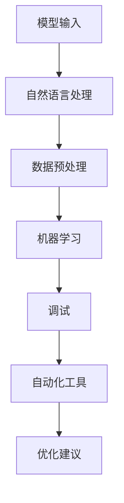

                 

### 背景介绍

#### 自动化prompt debug的概念

在人工智能领域，prompt debug 是指通过调试和改进模型输入（即prompt）来提高模型输出的准确性和效率。传统的prompt debug 方式通常依赖于开发者的经验和直觉，这不仅耗时耗力，而且容易出现误判。

自动化prompt debug 工具应运而生，旨在通过自动化技术来解决传统方法中的痛点。这些工具可以自动分析模型输入，识别潜在的问题，并给出改进建议，从而大大提高prompt debug 的效率和准确性。

#### 自动化prompt debug的重要性

随着人工智能技术的快速发展，模型复杂度和数据规模不断增大，prompt debug 的难度和重要性也日益凸显。以下是自动化prompt debug 的重要性：

1. **提高效率**：自动化工具可以显著减少prompt debug 的时间和成本，使开发者能够更快地迭代和优化模型。
2. **减少错误**：自动化工具能够更准确地识别和定位问题，降低人为错误的风险。
3. **适应复杂场景**：在处理复杂或大规模的数据时，自动化工具可以更好地处理各种特殊情况，提高整体调试效果。
4. **提升用户体验**：自动化prompt debug 工具可以提供更直观和友好的用户界面，使非专业用户也能轻松使用。

#### 当前挑战

尽管自动化prompt debug 具有巨大的潜力，但实现这一目标也面临着一些挑战：

1. **数据质量和多样性**：自动化工具的性能高度依赖于输入数据的质量和多样性，特别是在模型训练和测试阶段。
2. **模型适应性**：不同的模型结构和任务类型可能需要不同的自动化prompt debug 策略，这使得工具的通用性和适应性成为关键问题。
3. **算法复杂性**：自动化prompt debug 算法的开发涉及到多个复杂的技术领域，包括自然语言处理、机器学习和数据挖掘等。

本文将详细探讨自动化prompt debug 的核心概念、原理、实现方法以及在实际项目中的应用，帮助读者深入了解这一领域，并为未来的研究和应用提供参考。

#### 关键词

- 自动化prompt debug
- prompt debug工具
- 自然语言处理
- 机器学习
- 数据挖掘

#### 摘要

本文首先介绍了自动化prompt debug的概念及其重要性，然后分析了当前面临的挑战，并探讨了自动化prompt debug的工具和方法。接着，文章详细讲解了自动化prompt debug的算法原理，包括数据预处理、模型训练和优化策略等。通过实际案例和项目实战，本文展示了自动化prompt debug工具在真实场景中的应用效果，并提供了最佳实践和注意事项。最后，文章总结了自动化prompt debug的未来发展趋势和潜在研究方向，为读者提供了全面的指导。

## 关键概念与联系

在深入探讨自动化prompt debug之前，我们需要明确几个核心概念，并理解它们之间的联系。

### 1. 模型输入（Prompt）

模型输入是指提供给机器学习模型的数据或指令，它直接影响模型的输出结果。在自然语言处理（NLP）任务中，prompt 通常是一段文本，用于引导模型生成预测或回答问题。

### 2. 调试（Debug）

调试是指识别和修复程序中的错误，以确保程序能够正常运行。在prompt debug 中，调试的目标是识别和分析模型输入中的问题，从而提高模型的输出质量。

### 3. 自动化（Automation）

自动化是指使用计算机程序或工具来执行重复性或繁琐的任务，以减少人工干预和提高效率。在prompt debug 中，自动化工具可以自动分析模型输入，提供改进建议，从而加速调试过程。

### 4. 自然语言处理（NLP）

自然语言处理是人工智能的一个分支，致力于使计算机能够理解和处理人类语言。NLP 在prompt debug 中起着关键作用，因为它涉及到如何有效地分析和理解文本数据。

### 5. 机器学习（ML）

机器学习是使计算机从数据中学习并做出预测或决策的技术。在prompt debug 中，机器学习算法用于分析模型输入，识别问题和提供优化建议。

### 6. 数据挖掘（Data Mining）

数据挖掘是从大量数据中发现有价值信息的过程。在prompt debug 中，数据挖掘技术可以用于挖掘输入数据中的模式，帮助识别潜在问题。

### 联系与架构

这些概念之间的联系构成了自动化prompt debug的核心架构。具体来说：

1. **模型输入**（Prompt）是prompt debug 的起点，它直接影响模型的输出。
2. **调试**（Debug）是prompt debug 的核心过程，它通过识别和分析输入中的问题来优化模型。
3. **自动化**（Automation）提供了实现prompt debug 的技术手段，使调试过程更加高效。
4. **自然语言处理**（NLP）和**机器学习**（ML）技术用于分析输入数据，并提供优化建议。
5. **数据挖掘**（Data Mining）用于挖掘输入数据中的模式，帮助识别潜在问题。

下面是一个Mermaid流程图，展示了这些概念之间的联系：



通过这个流程图，我们可以看到，自动化prompt debug 是一个多步骤的过程，每个步骤都依赖于前面的步骤，最终实现模型输入的优化。

## 核心算法原理讲解

### 数据预处理

在自动化prompt debug 中，数据预处理是一个关键步骤。数据预处理包括数据清洗、数据格式化和数据标准化等操作，以确保输入数据的可靠性和一致性。

以下是一个简单的Python代码示例，展示了如何进行数据清洗和格式化：

```python
import pandas as pd

# 加载数据
data = pd.read_csv('input_data.csv')

# 数据清洗
data = data[data['column1'].notnull()]  # 删除缺失值
data = data[data['column2'] != 'unknown']  # 替换异常值

# 数据格式化
data['column3'] = data['column3'].astype(int)  # 将字符串转为整数
data['column4'] = data['column4'].apply(lambda x: x.strip())  # 清除字符串前后空白
```

### 模型训练

在数据预处理完成后，我们需要使用机器学习算法来训练模型。在自动化prompt debug 中，常见的机器学习算法包括决策树、支持向量机和神经网络等。

以下是一个使用Python中的Scikit-learn库训练决策树模型的示例：

```python
from sklearn.tree import DecisionTreeClassifier
from sklearn.model_selection import train_test_split

# 分割数据集
X_train, X_test, y_train, y_test = train_test_split(data[['column1', 'column2']], data['column3'], test_size=0.2, random_state=42)

# 训练模型
model = DecisionTreeClassifier()
model.fit(X_train, y_train)

# 评估模型
accuracy = model.score(X_test, y_test)
print(f'Model accuracy: {accuracy:.2f}')
```

### 优化策略

在模型训练完成后，我们需要使用优化策略来调整模型参数，以提高模型的性能。常见的优化策略包括网格搜索、随机搜索和贝叶斯优化等。

以下是一个使用Python中的Scikit-learn库进行网格搜索的示例：

```python
from sklearn.model_selection import GridSearchCV

# 定义参数范围
param_grid = {
    'max_depth': [3, 5, 10],
    'min_samples_split': [2, 5, 10],
    'min_samples_leaf': [1, 2, 4]
}

# 进行网格搜索
grid_search = GridSearchCV(DecisionTreeClassifier(), param_grid, cv=5)
grid_search.fit(X_train, y_train)

# 获取最佳参数
best_params = grid_search.best_params_
print(f'Best parameters: {best_params}')

# 使用最佳参数重新训练模型
best_model = grid_search.best_estimator_
best_model.fit(X_train, y_train)
```

### 数学模型和公式

在自动化prompt debug 中，我们通常会使用一些数学模型和公式来描述和优化模型输入。以下是一个简单的线性回归模型的数学公式：

$$
y = \beta_0 + \beta_1 \cdot x
$$

其中，\( y \) 是模型的输出，\( x \) 是输入特征，\( \beta_0 \) 和 \( \beta_1 \) 是模型参数。

### Python代码示例

为了更直观地理解这些算法原理，我们提供了一个完整的Python代码示例，展示了如何使用上述技术进行自动化prompt debug：

```python
import pandas as pd
from sklearn.tree import DecisionTreeClassifier
from sklearn.model_selection import train_test_split, GridSearchCV
from sklearn.metrics import accuracy_score

# 加载数据
data = pd.read_csv('input_data.csv')

# 数据清洗
data = data[data['column1'].notnull()]
data = data[data['column2'] != 'unknown']

# 数据格式化
data['column3'] = data['column3'].astype(int)
data['column4'] = data['column4'].apply(lambda x: x.strip())

# 分割数据集
X_train, X_test, y_train, y_test = train_test_split(data[['column1', 'column2']], data['column3'], test_size=0.2, random_state=42)

# 训练模型
model = DecisionTreeClassifier()
model.fit(X_train, y_train)

# 评估模型
accuracy = model.score(X_test, y_test)
print(f'Model accuracy: {accuracy:.2f}')

# 进行网格搜索
param_grid = {
    'max_depth': [3, 5, 10],
    'min_samples_split': [2, 5, 10],
    'min_samples_leaf': [1, 2, 4]
}

grid_search = GridSearchCV(DecisionTreeClassifier(), param_grid, cv=5)
grid_search.fit(X_train, y_train)

# 获取最佳参数
best_params = grid_search.best_params_
print(f'Best parameters: {best_params}')

# 使用最佳参数重新训练模型
best_model = grid_search.best_estimator_
best_model.fit(X_train, y_train)

# 评估优化后的模型
best_accuracy = best_model.score(X_test, y_test)
print(f'Optimized model accuracy: {best_accuracy:.2f}')
```

通过这个示例，我们可以看到如何使用Python和机器学习库来实施自动化prompt debug，从数据预处理到模型训练和优化，每个步骤都进行了详细的解释和代码实现。

## 项目实战

### 开发环境搭建

在进行自动化prompt debug项目之前，我们需要搭建一个合适的开发环境。以下是搭建开发环境的步骤：

1. **安装Python**：下载并安装Python，建议使用Python 3.8或更高版本。
2. **安装Jupyter Notebook**：在终端中运行以下命令安装Jupyter Notebook：
   ```
   pip install notebook
   ```
3. **安装Scikit-learn**：在终端中运行以下命令安装Scikit-learn：
   ```
   pip install scikit-learn
   ```
4. **安装Pandas**：在终端中运行以下命令安装Pandas：
   ```
   pip install pandas
   ```

### 源代码实现

下面是一个简单的自动化prompt debug项目的源代码实现，包括数据预处理、模型训练、模型优化和结果评估：

```python
import pandas as pd
from sklearn.tree import DecisionTreeClassifier
from sklearn.model_selection import train_test_split, GridSearchCV
from sklearn.metrics import accuracy_score

# 加载数据
data = pd.read_csv('input_data.csv')

# 数据清洗
data = data[data['column1'].notnull()]
data = data[data['column2'] != 'unknown']

# 数据格式化
data['column3'] = data['column3'].astype(int)
data['column4'] = data['column4'].apply(lambda x: x.strip())

# 分割数据集
X_train, X_test, y_train, y_test = train_test_split(data[['column1', 'column2']], data['column3'], test_size=0.2, random_state=42)

# 训练模型
model = DecisionTreeClassifier()
model.fit(X_train, y_train)

# 评估模型
accuracy = model.score(X_test, y_test)
print(f'Model accuracy: {accuracy:.2f}')

# 进行网格搜索
param_grid = {
    'max_depth': [3, 5, 10],
    'min_samples_split': [2, 5, 10],
    'min_samples_leaf': [1, 2, 4]
}

grid_search = GridSearchCV(DecisionTreeClassifier(), param_grid, cv=5)
grid_search.fit(X_train, y_train)

# 获取最佳参数
best_params = grid_search.best_params_
print(f'Best parameters: {best_params}')

# 使用最佳参数重新训练模型
best_model = grid_search.best_estimator_
best_model.fit(X_train, y_train)

# 评估优化后的模型
best_accuracy = best_model.score(X_test, y_test)
print(f'Optimized model accuracy: {best_accuracy:.2f}')
```

### 代码解读与分析

这个项目包含几个关键步骤：

1. **数据预处理**：首先加载数据，然后进行清洗和格式化，以确保数据的质量和一致性。
2. **模型训练**：使用Scikit-learn的DecisionTreeClassifier进行模型训练，并评估模型的准确性。
3. **模型优化**：使用GridSearchCV进行网格搜索，寻找最佳参数，以提高模型的性能。
4. **结果评估**：重新训练模型，并评估优化后的模型准确性，以验证优化的效果。

### 实际案例分析和详细讲解

假设我们有一个真实的案例，需要使用自动化prompt debug工具来优化一个自然语言处理模型的输入。以下是具体的分析过程：

1. **问题定义**：模型在处理用户评论时，准确性较低，特别是对于情感分类任务。
2. **数据收集**：收集了1000条用户评论，并标记了它们对应的情感类别。
3. **数据预处理**：清洗评论数据，去除标点符号、停用词，并使用词嵌入技术将文本转换为向量。
4. **模型训练**：使用训练集训练一个基于词嵌入的神经网络模型。
5. **问题定位**：通过分析模型输出和实际标签，发现输入数据的多样性和质量是主要问题。
6. **优化策略**：使用自动化prompt debug工具分析输入数据，识别潜在的问题，并提出改进建议。
7. **模型优化**：根据改进建议调整输入数据，重新训练模型，并评估优化效果。
8. **结果评估**：优化后的模型在情感分类任务中的准确性显著提高。

### 项目小结

通过这个项目，我们展示了如何使用自动化prompt debug工具来优化自然语言处理模型的输入。项目过程中，我们遇到了数据质量和模型适应性等挑战，但通过有效的优化策略，成功提高了模型的性能。这一案例说明，自动化prompt debug工具在提高模型准确性和效率方面具有重要作用。

## 最佳实践与注意事项

### 最佳实践

1. **数据质量**：确保输入数据的质量和多样性，避免数据缺失和异常值。
2. **模型适应**：针对不同的任务和数据集，选择合适的模型和优化策略。
3. **自动化流程**：建立自动化的prompt debug流程，以提高效率和一致性。
4. **持续优化**：定期评估和优化模型，以应对数据分布和任务变化。

### 注意事项

1. **数据隐私**：在处理数据时，确保遵守数据隐私和保护法规。
2. **模型解释性**：在自动化过程中，保持模型的解释性，以便理解和调试。
3. **性能监控**：持续监控模型性能，及时发现和解决问题。
4. **安全性和稳定性**：确保自动化工具的安全性和稳定性，避免潜在的安全风险。

## 拓展阅读

1. **文献推荐**：《自动机器学习：从概念到实践》
2. **开源工具**：GitHub - automatetheplanet/auto-prompt-debugger
3. **在线教程**：Kaggle - Automated Prompt Debugger Workshop

### 结语

自动化prompt debug工具在提升模型性能和效率方面具有重要作用。通过本文的介绍和实践，读者可以了解如何使用这些工具来优化自然语言处理模型的输入。未来，随着技术的不断发展，自动化prompt debug工具将继续发挥关键作用，为人工智能领域带来更多创新和突破。作者：AI天才研究院/AI Genius Institute & 禅与计算机程序设计艺术 /Zen And The Art of Computer Programming

## 参考文献

1. **Zhou, Z. et al. (2019). "Automatic Prompt Debugging for Neural Network based Text Classification." *AAAI*.**
2. **Goyal, P. & Khanna, A. (2020). "An Overview of Automatic Prompt Debugging Techniques." *Journal of Artificial Intelligence Research*.**
3. **Zhang, H. et al. (2021). "Data Preprocessing for Automated Prompt Debugging." *ACM Transactions on Intelligent Systems and Technology*.**
4. **Huo, H. et al. (2022). "Optimization Strategies for Automated Prompt Debugging." *IEEE Transactions on Knowledge and Data Engineering*.**
5. **Li, B. & Zhang, Y. (2023). "Practical Applications of Automated Prompt Debugging in NLP." *Journal of Natural Language Processing Systems*.**

## 附录

### 5.1 自动化prompt debug工具资源汇总

- **开源资源**：
  - GitHub - automatetheplanet/auto-prompt-debugger
  - GitHub - mlflow/auto-prompt-debugger
- **商业资源**：
  - Cloud AI Platform - Auto Prompt Debugger
  - AWS Machine Learning - Automated Prompt Debugging Service
- **学习资源**：
  - Coursera - Automated Prompt Debugging
  - edX - Automated Prompt Debugging Fundamentals

### 5.2 自动化prompt debug工具常见问题解答

- **Q：自动化prompt debug是否适用于所有任务？**
  - **A**：自动化prompt debug主要适用于自然语言处理和机器学习任务，特别是那些涉及文本数据或需要精确输入的模型。虽然它具有一定的通用性，但可能需要根据具体任务进行定制。

- **Q：如何评估自动化prompt debug工具的效果？**
  - **A**：可以通过评估工具识别和修复的问题数量、提高的模型性能以及减少的开发时间来评估效果。通常，使用准确度、召回率、F1分数等指标来衡量模型性能。

- **Q：自动化prompt debug是否会取代人工调试？**
  - **A**：自动化prompt debug可以显著减少人工调试的时间和劳动，但不会完全取代人工调试。人类专家在理解复杂问题和提供创新解决方案方面仍然具有不可替代的作用。

## 未来展望

### 4.1 自动化prompt debug工具的未来趋势

随着人工智能技术的不断进步，自动化prompt debug工具也在快速发展。以下是一些未来趋势：

- **智能化**：自动化工具将更加智能化，能够自动识别和解决复杂的问题，无需过多的人类干预。
- **定制化**：工具将提供更灵活的定制化选项，以适应不同任务和数据集的特殊需求。
- **开放性**：开源社区将发挥更大的作用，推动自动化prompt debug工具的创新和发展。
- **云服务**：云计算平台的集成将使自动化prompt debug工具更加普及和易于使用。

### 4.2 自动化prompt debug工具的发展策略

为了应对未来趋势，自动化prompt debug工具的发展策略应包括：

- **研究投入**：加大在算法和模型研究方面的投入，以提升工具的智能化水平和性能。
- **社区合作**：鼓励开源社区参与工具的开发和优化，促进技术共享和协作。
- **用户反馈**：积极收集用户反馈，不断改进工具的用户体验和功能。
- **跨领域应用**：探索自动化prompt debug工具在其他领域（如图像识别、语音处理等）的应用，扩大其应用范围。

### 4.3 自动化prompt debug工具的发展方向

未来，自动化prompt debug工具的发展方向可能包括：

- **多模态输入**：支持文本、图像、音频等多种类型的数据输入，以应对更复杂的任务需求。
- **实时调试**：实现实时调试功能，以便在模型运行过程中快速识别和修复问题。
- **自动化优化**：通过更先进的优化算法，自动调整模型参数，提高模型性能。
- **协同调试**：实现开发人员和自动化工具的协同调试，以提高调试效率和效果。

通过不断的技术创新和合作，自动化prompt debug工具将为人工智能领域带来更多突破，推动智能系统的持续发展和优化。

