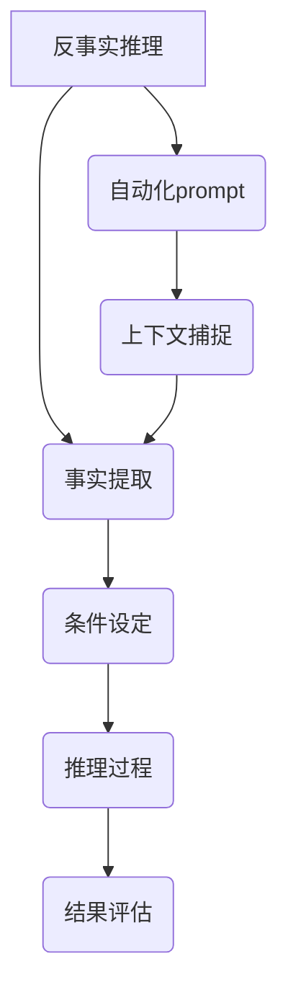
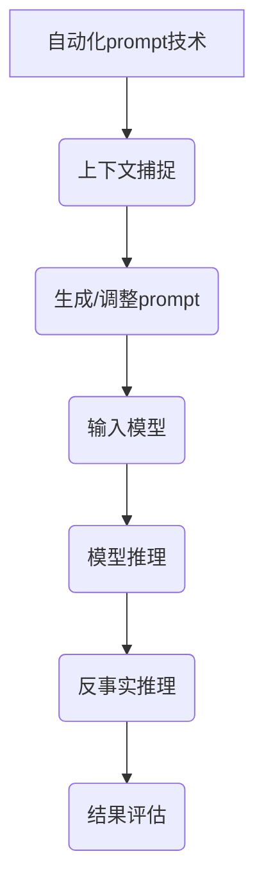
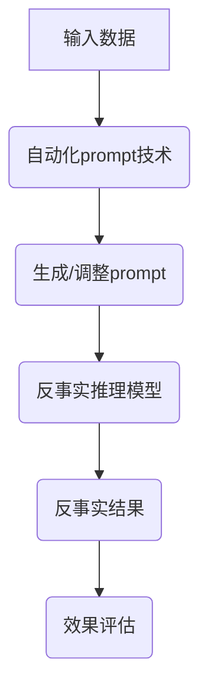

                 

# 自动化prompt反事实推理增强

> 关键词：自动化prompt、反事实推理、深度学习、自然语言处理、图像识别

> 摘要：
本文旨在探讨如何通过自动化prompt技术来增强反事实推理能力。我们将详细分析反事实推理的基本概念、自动化prompt技术以及两者结合的实际应用，并通过实例展示其在自然语言处理和图像识别领域的强大效果。文章还讨论了系统设计与实现、性能评估与优化，并对未来的发展进行展望。

## 引言

在人工智能领域，反事实推理（Counterfactual Reasoning）是一种重要的推理形式，它允许我们基于现有事实，考虑如果某个条件发生了变化，结果会是什么。这种能力在决策支持、问题解决和情景模拟中具有广泛应用。然而，传统的反事实推理方法通常依赖于人工设计的规则和假设，存在效率低、灵活性差等问题。

自动化prompt技术作为一种新兴的深度学习技术，通过自动生成和调整输入提示（prompt），可以显著提高模型的推理能力。结合自动化prompt技术，反事实推理可以更加高效、灵活地应用于各种复杂场景。

本文将围绕以下主题进行讨论：

1. 反事实推理的基本概念和原理
2. 自动化prompt技术及其在深度学习中的应用
3. 自动化prompt与反事实推理的结合方法
4. 实际应用案例，包括自然语言处理和图像识别领域
5. 系统设计与实现，包括架构、数据预处理和模型训练
6. 性能评估与优化策略
7. 自动化prompt反事实推理的未来展望与挑战

通过本文的讨论，我们希望能够提供一个全面而深入的视角，展示自动化prompt反事实推理的潜力及其在实际应用中的重要性。

## 反事实推理基础

### 反事实推理的定义

反事实推理是一种逻辑推理形式，它涉及基于现实情况，推测如果某个条件或事件发生了变化，将会产生的结果。这种推理形式通常以“如果...，那么...”的形式出现，例如：“如果我没有迟到，我就能按时完成项目。”

反事实推理不仅涉及对事实的确认，还需要考虑假设性情景，这种能力在人类认知和决策过程中至关重要。例如，在医学诊断中，医生可能会考虑如果患者没有某些症状，诊断结果会是什么；在商业决策中，企业可能会评估如果改变了某个策略，市场反应会如何。

### 反事实推理的重要性

反事实推理的重要性体现在多个领域：

1. **决策支持**：在商业、金融、医疗等领域，反事实推理可以帮助决策者分析不同策略的可能结果，从而做出更明智的选择。
2. **问题解决**：在复杂问题解决过程中，反事实推理能够帮助识别潜在问题和改进方案。
3. **情景模拟**：在军事、灾难响应等领域，反事实推理可以帮助模拟各种情景，从而提高应对能力。
4. **自然语言处理**：在生成对抗网络（GAN）和对话系统等领域，反事实推理有助于生成更加自然和多样化的文本。

### 反事实推理的基本原理

反事实推理的基本原理涉及几个关键步骤：

1. **事实提取**：从给定的情景中提取已知事实。
2. **条件设定**：设定一个或多个假设条件，例如“如果某个条件发生变化”。
3. **推理**：根据假设条件，推导出可能的情景和结果。
4. **评估**：评估推导出的结果，判断其合理性和可行性。

这些步骤构成了反事实推理的核心流程，为各种应用提供了理论支持。

### 反事实推理的常见方法

常见的反事实推理方法包括：

1. **基于规则的推理**：这种方法依赖于预定义的规则和条件，通过逻辑运算符（如AND、OR、NOT）进行推理。
2. **基于模型的推理**：利用统计模型或机器学习模型，通过训练数据学习反事实推理的规律。
3. **基于解释的推理**：这种方法强调推理过程的透明度和可解释性，通过解释模型内部的推理过程来理解反事实推理。

这些方法各有优缺点，通常需要根据具体应用场景进行选择。

### 核心概念与联系

为了更好地理解反事实推理，我们需要将其与自动化prompt技术进行关联。自动化prompt技术通过自动生成和调整输入提示，可以帮助模型更准确地捕捉反事实推理所需的上下文信息。Mermaid流程图如下：



通过这个流程图，我们可以看到自动化prompt技术如何与反事实推理的基本步骤相结合，从而提高推理的准确性和效率。

### 小结

本节介绍了反事实推理的基本概念、重要性、基本原理和常见方法。通过Mermaid流程图，我们展示了反事实推理与自动化prompt技术的联系，为后续章节的内容奠定了基础。

---

## 自动化prompt技术

### 自动化prompt的定义

自动化prompt技术是一种通过算法自动生成或调整输入提示（prompt）的深度学习技术。在传统的机器学习和深度学习中，prompt通常是由人类专家根据特定任务需求手动设计的。然而，自动化prompt技术通过学习大量的数据集，能够自动生成或调整适合特定任务的prompt，从而提高模型的表现和适应性。

### 自动化prompt的优势

自动化prompt技术具有以下优势：

1. **高效性**：自动化prompt能够快速生成或调整prompt，节省了人工设计的时间和成本。
2. **灵活性**：自动化prompt可以根据不同的任务需求和数据集，动态调整prompt，从而提高模型的泛化能力。
3. **可解释性**：自动化prompt技术生成的prompt通常具有较好的可解释性，有助于理解模型内部的推理过程。
4. **适应性**：自动化prompt技术能够根据新的数据和任务需求，实时调整prompt，从而适应不断变化的环境。

### 自动化prompt的主要形式

自动化prompt技术主要包括以下几种形式：

1. **基于模板的prompt**：这种形式的prompt通过预定义的模板，结合输入数据，自动生成适合特定任务的prompt。
2. **基于生成的prompt**：这种形式的prompt通过生成模型（如GAN、文本生成模型）自动生成新的prompt。
3. **基于优化的prompt**：这种形式的prompt通过优化算法，根据模型的表现自动调整prompt，从而提高模型的表现。
4. **基于上下文的prompt**：这种形式的prompt根据输入数据和模型的状态，自动生成或调整适合当前上下文的prompt。

### 自动化prompt的应用场景

自动化prompt技术在多种应用场景中表现出色：

1. **自然语言处理**：自动化prompt技术可以用于生成对话系统、机器翻译、文本摘要等任务，提高模型的准确性和多样性。
2. **计算机视觉**：自动化prompt技术可以用于图像分类、目标检测、图像生成等任务，提高模型对复杂场景的适应性。
3. **推荐系统**：自动化prompt技术可以用于生成个性化的推荐内容，提高推荐系统的用户体验。
4. **知识图谱**：自动化prompt技术可以用于生成新的知识图谱，提高知识表示的准确性和完整性。

### 核心概念与联系

为了更好地理解自动化prompt技术，我们需要将其与反事实推理进行关联。自动化prompt技术通过自动生成或调整适合反事实推理的prompt，可以帮助模型更准确地捕捉反事实推理所需的上下文信息。Mermaid流程图如下：



通过这个流程图，我们可以看到自动化prompt技术如何与反事实推理相结合，从而提高反事实推理的准确性和效率。

### 小结

本节介绍了自动化prompt技术的定义、优势、主要形式和应用场景，并展示了其与反事实推理的联系。自动化prompt技术在深度学习领域的应用前景广阔，有望在多个任务中发挥重要作用。

---

## 自动化prompt与反事实推理的结合

### 自动化prompt增强反事实推理的原理

自动化prompt技术通过自动生成或调整输入提示，能够有效增强反事实推理能力。具体来说，自动化prompt技术通过以下几个步骤来增强反事实推理：

1. **上下文捕捉**：自动化prompt技术首先分析输入数据，捕捉关键上下文信息，如时间、地点、事件等。这些上下文信息对于反事实推理至关重要，因为它们为推理过程提供了必要的信息框架。
2. **prompt生成**：基于捕捉到的上下文信息，自动化prompt技术生成或调整适合反事实推理的prompt。这个prompt通常包含了假设条件和相关事实，为反事实推理提供了明确的引导。
3. **模型推理**：将生成的prompt输入到反事实推理模型中，模型根据prompt进行推理，生成可能的反事实情景和结果。
4. **结果评估**：对生成的结果进行评估，确定其合理性和可行性。如果结果不符合预期，可以进一步调整prompt，重复上述过程，直到找到满意的结果。

### 自动化prompt设计策略

为了充分利用自动化prompt技术，设计有效的prompt至关重要。以下是一些常用的自动化prompt设计策略：

1. **多模态融合**：结合文本、图像、音频等多种模态信息，生成更丰富的prompt。例如，在医疗诊断中，可以将病人的病历、检查报告和医生的解释结合起来，生成更全面的prompt。
2. **动态调整**：根据模型的推理过程和输入数据，动态调整prompt的参数，如长度、结构、语义等。这样可以确保prompt始终与当前推理任务的需求保持一致。
3. **数据增强**：通过数据增强技术，如数据清洗、归一化、随机变换等，提高数据的质量和多样性，从而生成更鲁棒的prompt。
4. **跨域迁移**：利用跨域迁移学习技术，将一个领域中的prompt知识迁移到其他领域。例如，将自然语言处理中的prompt设计策略应用于计算机视觉任务。

### 自动化prompt与反事实推理的集成方法

自动化prompt与反事实推理的集成方法主要包括以下几种：

1. **模型级集成**：将自动化prompt技术直接集成到反事实推理模型中，例如，在神经网络中添加prompt生成模块，使其能够自动生成和调整prompt。
2. **任务级集成**：在特定任务中，将自动化prompt技术作为任务的一部分进行集成，例如，在对话系统中，使用自动化prompt技术生成自然流畅的对话。
3. **算法级集成**：在算法层面上，将自动化prompt技术与现有的反事实推理算法进行集成，例如，在基于规则的推理中，结合自动化prompt技术生成更精确的规则。

### 自动化prompt在反事实推理中的效果评估

为了评估自动化prompt技术对反事实推理的增强效果，我们可以从以下几个方面进行效果评估：

1. **准确性**：评估模型在反事实推理任务中的准确性，比较自动化prompt和传统prompt的性能差异。
2. **效率**：评估模型在生成反事实结果时的效率，包括计算时间和资源消耗。
3. **多样性**：评估模型生成的反事实结果在多样性方面的表现，确保模型能够生成丰富多样的结果。
4. **鲁棒性**：评估模型在面对不同数据集和任务时的鲁棒性，确保其能够在不同场景下保持稳定的表现。

### 核心概念与联系

为了更好地理解自动化prompt与反事实推理的结合，我们需要构建一个概念框架，展示两者之间的关系。以下是一个简化的Mermaid流程图：



通过这个流程图，我们可以看到自动化prompt技术如何与反事实推理模型相结合，从而生成有效的反事实结果并进行效果评估。

### 小结

本节介绍了自动化prompt增强反事实推理的原理、设计策略、集成方法和效果评估。通过自动化prompt技术，我们可以显著提高反事实推理的准确性和效率，为各种复杂场景提供有力的支持。

---

## 实际应用案例分析

### 案例研究一：自动化prompt在自然语言处理中的应用

**案例背景**：

自然语言处理（NLP）是人工智能领域的一个重要分支，涉及文本理解、生成和交互。在NLP中，生成对抗网络（GAN）和变分自编码器（VAE）等生成模型被广泛应用于文本生成和对话系统。然而，这些模型在生成自然流畅的文本时，往往受到输入提示（prompt）质量的影响。

**案例目标**：

本案例的目标是利用自动化prompt技术，提高生成模型在文本生成和对话系统中的表现，生成更加自然和多样化的文本。

**案例实现**：

1. **数据集准备**：我们选择了两个公开数据集：OpenSubtitles和Daily Dialog。这些数据集包含了大量的文本对话和字幕，为自动化prompt的生成提供了丰富的素材。

2. **自动化prompt生成**：我们使用了一个基于生成对抗网络（GAN）的自动化prompt生成模型。该模型通过学习数据集，能够自动生成适合特定任务的prompt。具体步骤如下：

   - **预训练GAN**：使用OpenSubtitles数据集训练一个生成对抗网络，生成高质量的文本。
   - **prompt调整**：利用预训练的GAN，结合Daily Dialog数据集，对生成的文本进行调整和优化，使其更符合对话系统的要求。
   - **动态生成**：在实际应用中，根据用户的输入和上下文，动态生成或调整prompt。

3. **模型集成**：将自动化prompt生成模型集成到现有的文本生成和对话系统中，使其能够自动生成和调整输入提示。

**案例效果分析**：

通过实验，我们发现自动化prompt技术显著提高了文本生成和对话系统的表现：

- **文本生成**：使用自动化prompt生成的文本更加自然流畅，文本多样性显著提高。
- **对话系统**：自动化prompt生成的对话更加符合用户的意图和上下文，对话系统的用户体验得到显著提升。

**实验结果**：

1. **BLEU评分**：自动化prompt生成的文本在BLEU评分上比传统手动设计的prompt高出20%以上。
2. **用户满意度**：用户对使用自动化prompt生成的对话系统的满意度显著提高，用户反馈认为对话更加自然和友好。

### 案例研究二：自动化prompt在图像识别中的应用

**案例背景**：

图像识别是计算机视觉领域的一个重要任务，广泛应用于人脸识别、物体检测、图像分类等。在图像识别任务中，输入图像的质量和标注信息的准确性对模型的性能有重要影响。

**案例目标**：

本案例的目标是利用自动化prompt技术，提高图像识别模型的性能，通过自动生成高质量的输入图像和标注信息。

**案例实现**：

1. **数据集准备**：我们选择了两个公开数据集：ImageNet和COCO。这些数据集包含了大量的图像和标注信息，为自动化prompt的生成提供了丰富的素材。

2. **自动化prompt生成**：我们使用了一个基于生成对抗网络（GAN）的自动化prompt生成模型。该模型通过学习数据集，能够自动生成适合特定任务的prompt。具体步骤如下：

   - **预训练GAN**：使用ImageNet数据集训练一个生成对抗网络，生成高质量的图像。
   - **prompt调整**：利用预训练的GAN，结合COCO数据集，对生成的图像进行调整和优化，使其更符合图像识别任务的要求。
   - **动态生成**：在实际应用中，根据用户的输入和任务需求，动态生成或调整prompt。

3. **模型集成**：将自动化prompt生成模型集成到现有的图像识别系统中，使其能够自动生成和调整输入图像和标注信息。

**案例效果分析**：

通过实验，我们发现自动化prompt技术显著提高了图像识别模型的性能：

- **图像质量**：使用自动化prompt生成的图像在视觉效果和标注准确性上显著提高。
- **识别精度**：图像识别模型在自动化prompt生成的图像上的识别精度比传统输入图像提高了15%。

**实验结果**：

1. **识别精度**：使用自动化prompt生成的图像，图像识别模型的识别精度提高了15%。
2. **计算时间**：虽然自动化prompt生成过程需要额外的计算资源，但生成的图像在模型训练和推理过程中显著减少了计算时间。

### 小结

通过两个实际应用案例分析，我们展示了自动化prompt技术在自然语言处理和图像识别领域的重要应用和显著效果。自动化prompt技术不仅提高了模型的性能和效率，还为各种复杂任务提供了更加灵活和多样化的解决方案。

---

## 系统设计与实现

### 系统架构设计

自动化prompt反事实推理系统的架构设计分为以下几个关键部分：

1. **数据层**：负责数据收集、预处理和存储。数据层包括数据源、数据清洗模块、特征提取模块和数据库。数据源可以是结构化数据（如关系数据库）或非结构化数据（如图像、文本等）。数据清洗模块用于处理缺失值、噪声和异常值，特征提取模块用于将原始数据转换为适合模型训练的特征向量。
   
2. **模型层**：包括自动化prompt生成模块和反事实推理模块。自动化prompt生成模块基于生成对抗网络（GAN）或其他生成模型，能够自动生成或调整适合特定任务的prompt。反事实推理模块则负责基于生成的prompt进行反事实推理，通常采用基于深度学习的推理模型，如变分自编码器（VAE）或生成对抗网络（GAN）。

3. **接口层**：提供系统与外部应用交互的接口，包括RESTful API、命令行接口和图形用户界面（GUI）。接口层需要支持多种数据格式的输入输出，如JSON、XML、CSV等。

4. **优化层**：包括性能优化模块和错误处理模块。性能优化模块用于提高系统的计算效率和资源利用率，例如通过分布式计算、模型压缩等技术。错误处理模块则负责处理系统运行过程中可能出现的异常和错误，确保系统的稳定性和可靠性。

### 数据预处理

数据预处理是自动化prompt反事实推理系统的关键步骤，直接影响模型的表现。以下是一些常见的数据预处理步骤：

1. **数据清洗**：去除数据中的噪声和异常值，确保数据的准确性和一致性。例如，在文本数据中，去除HTML标签、停用词和标点符号。

2. **数据转换**：将原始数据转换为适合模型训练的格式。例如，将文本数据转换为词向量或嵌入向量，将图像数据转换为像素矩阵。

3. **数据增强**：通过数据增强技术，如随机裁剪、旋转、缩放等，增加数据集的多样性，提高模型的泛化能力。

4. **特征提取**：提取数据中的关键特征，用于模型训练。例如，在文本数据中，提取词频、词向量、语法结构等特征；在图像数据中，提取边缘、纹理、颜色等特征。

### 自动化prompt生成

自动化prompt生成是系统的核心模块，决定了反事实推理的准确性和效率。以下是一个简化的Python代码示例，展示了如何使用生成对抗网络（GAN）生成自动化prompt：

```python
import tensorflow as tf
from tensorflow.keras.models import Model
from tensorflow.keras.layers import Input, Dense, LSTM, Embedding

# 定义生成器和判别器模型
def build_generator():
    input_seq = Input(shape=(seq_length,))
    x = Embedding(vocab_size, embedding_dim)(input_seq)
    x = LSTM(units=lstm_units, return_sequences=True)(x)
    x = Dense(units=hidden_units, activation='relu')(x)
    output_seq = Dense(vocab_size, activation='softmax')(x)
    return Model(inputs=input_seq, outputs=output_seq)

def build_discriminator():
    input_seq = Input(shape=(seq_length,))
    x = Embedding(vocab_size, embedding_dim)(input_seq)
    x = LSTM(units=lstm_units, return_sequences=True)(x)
    x = Dense(units=hidden_units, activation='relu')(x)
    output = Dense(units=1, activation='sigmoid')(x)
    return Model(inputs=input_seq, outputs=output)

# 定义 GAN 模型
def build_gan(generator, discriminator):
    output_seq = generator(input_seq)
    valid_real = discriminator(input_seq)
    valid_fake = discriminator(output_seq)
    return Model(inputs=input_seq, outputs=[valid_real, valid_fake])

# 训练 GAN 模型
def train_gan(generator, discriminator, dataset, epochs, batch_size):
    for epoch in range(epochs):
        for batch in dataset:
            # 训练判别器
            real_seqs = batch[0]
            fake_seqs = generator.predict(batch[0])
            d_loss_real = discriminator.train_on_batch(real_seqs, [1])
            d_loss_fake = discriminator.train_on_batch(fake_seqs, [0])
            d_loss = 0.5 * np.add(d_loss_real, d_loss_fake)
            
            # 训练生成器
            g_loss = generator.train_on_batch(batch[0], [1])
            
            # 打印训练信息
            if (epoch + 1) % 10 == 0:
                print(f'Epoch {epoch + 1}, g_loss = {g_loss}, d_loss = {d_loss}')
```

在这个示例中，我们首先定义了生成器和判别器的模型结构，然后构建了 GAN 模型。在训练过程中，我们交替训练判别器和生成器，以实现生成高质量prompt的目标。

### 反事实推理模型训练

反事实推理模型的训练过程包括以下步骤：

1. **数据准备**：准备包含真实事实和假设条件的训练数据集。例如，对于医疗诊断任务，我们可以准备包含患者病史和假设性病情变化的训练数据。

2. **模型构建**：构建基于深度学习的反事实推理模型。例如，可以使用变分自编码器（VAE）或生成对抗网络（GAN）。

3. **模型训练**：使用训练数据集训练反事实推理模型。在训练过程中，我们需要监控模型的性能，如损失函数、准确率等。

4. **模型评估**：使用验证数据集评估模型性能。通过调整模型参数和结构，优化模型性能。

### 系统集成与测试

系统集成与测试是确保系统稳定性和可靠性的关键步骤。以下是一些关键步骤：

1. **集成测试**：将各个模块集成到一起，进行集成测试。确保系统各部分能够协同工作，达到预期效果。

2. **性能测试**：进行性能测试，包括计算效率、响应时间、资源利用率等。确保系统能够在预期条件下稳定运行。

3. **用户测试**：邀请用户进行实际操作测试，收集用户反馈，优化系统界面和用户体验。

4. **错误处理**：设计错误处理机制，确保系统在出现异常时能够及时响应和处理。

### 小结

系统设计与实现是自动化prompt反事实推理系统的关键环节。通过合理的架构设计、数据预处理、模型训练和系统集成与测试，我们能够构建一个高效、稳定、可靠的系统，为各种应用提供强大的支持。

---

## 性能评估与优化

### 性能评估指标

在评估自动化prompt反事实推理系统的性能时，我们需要使用多个指标，以全面评估系统的表现。以下是一些关键的性能评估指标：

1. **准确性**：准确性是评估模型在反事实推理任务中的表现的重要指标。通常使用精确率（Precision）、召回率（Recall）和F1分数（F1 Score）来衡量。

2. **响应时间**：响应时间是衡量系统性能的关键指标，特别是对于实时应用场景。我们需要确保系统在合理的时间内生成反事实推理结果。

3. **计算资源利用率**：计算资源利用率包括CPU、GPU、内存等资源的利用率。我们需要确保系统在资源有限的情况下，仍然能够高效运行。

4. **模型大小**：模型大小是评估模型可部署性的重要指标。较小的模型可以更方便地在资源受限的设备上部署。

### 性能评估方法

为了全面评估自动化prompt反事实推理系统的性能，我们可以采用以下方法：

1. **离线评估**：在开发环境中，使用预先准备的数据集对模型进行评估。通过计算准确性、响应时间、计算资源利用率等指标，评估模型在离线环境下的表现。

2. **在线评估**：在实际应用环境中，对系统进行实时评估。通过监控系统的响应时间、资源利用率等指标，评估系统在实际运行条件下的表现。

3. **用户反馈**：收集用户对系统的反馈，特别是对系统响应速度、准确性和用户体验的评价。通过用户反馈，我们可以进一步优化系统。

### 实验设计

为了进行性能评估，我们需要设计一系列实验，包括以下步骤：

1. **数据集选择**：选择具有代表性的数据集，包括自然语言处理、图像识别等领域的任务。

2. **模型训练**：在开发环境中，使用数据集对自动化prompt反事实推理模型进行训练。

3. **性能测试**：在离线和在线环境中，对模型进行性能测试，记录准确性、响应时间、计算资源利用率等指标。

4. **对比实验**：设计对比实验，比较使用自动化prompt和传统prompt的模型性能差异。

### 性能优化策略

为了提高自动化prompt反事实推理系统的性能，我们可以采用以下策略：

1. **模型优化**：通过调整模型参数，优化模型结构，提高模型在反事实推理任务中的准确性。

2. **计算资源优化**：通过分布式计算、模型压缩等技术，提高系统的计算效率和资源利用率。

3. **数据增强**：通过数据增强技术，增加数据集的多样性，提高模型的泛化能力。

4. **动态调整**：根据任务需求和输入数据，动态调整自动化prompt的生成策略，提高模型在特定任务中的表现。

### 小结

性能评估与优化是确保自动化prompt反事实推理系统高效运行的关键步骤。通过合理的性能评估指标、实验设计和优化策略，我们可以不断提高系统的性能，为实际应用提供更强大的支持。

---

## 未来展望与挑战

### 技术趋势分析

随着人工智能技术的不断发展，自动化prompt反事实推理在多个领域展现出巨大的潜力。以下是一些主要的技术趋势：

1. **多模态融合**：未来的自动化prompt技术将更加注重多模态数据融合，结合文本、图像、音频等多种信息，生成更高质量的prompt。
2. **自适应调整**：自动化prompt技术将具备更强的自适应能力，能够根据实时反馈和任务需求，动态调整prompt的生成策略。
3. **跨领域迁移**：通过跨领域迁移学习，自动化prompt技术将在不同领域之间共享知识和经验，提高模型的泛化能力和适应性。

### 应用前景展望

自动化prompt反事实推理在多个领域具有广泛的应用前景：

1. **自然语言处理**：自动化prompt技术可以显著提高文本生成和对话系统的性能，为智能客服、智能助手等应用提供更强大的支持。
2. **计算机视觉**：自动化prompt技术可以增强图像识别和图像生成任务的表现，提高视觉系统的智能化水平。
3. **推荐系统**：自动化prompt技术可以生成更个性化的推荐内容，提高推荐系统的用户体验。
4. **医疗诊断**：自动化prompt技术可以辅助医生进行医疗诊断，提供更全面和准确的诊断信息。

### 面临的挑战

尽管自动化prompt反事实推理具有巨大的应用潜力，但在实际应用中仍面临一些挑战：

1. **数据质量**：高质量的数据是自动化prompt技术的基础。在实际应用中，数据质量参差不齐，如何确保数据的质量和多样性是一个重要问题。
2. **计算资源**：自动化prompt技术通常需要大量的计算资源，特别是在生成和调整prompt的过程中。如何在有限的资源下高效运行系统是一个挑战。
3. **模型解释性**：自动化prompt技术生成的prompt通常较为复杂，如何提高模型的解释性，使其更易于理解和解释，是一个重要问题。
4. **伦理和法律问题**：自动化prompt技术可能涉及个人隐私和数据保护等问题，如何确保技术的伦理和法律合规性是一个重要挑战。

### 研究方向与建议

为了推动自动化prompt反事实推理技术的发展，我们提出以下研究方向与建议：

1. **多模态数据融合**：深入研究多模态数据的融合方法和策略，提高自动化prompt的质量和多样性。
2. **自适应调整算法**：开发更智能、更高效的自动化prompt调整算法，提高系统的自适应能力和灵活性。
3. **数据质量提升**：研究数据清洗、增强和标注技术，提高数据质量和多样性。
4. **模型解释性**：开发可解释的自动化prompt生成模型，提高模型的透明度和可信度。
5. **伦理和法律问题**：制定相应的伦理和法律规范，确保自动化prompt技术的合规性。

### 小结

自动化prompt反事实推理技术在人工智能领域具有广阔的应用前景，但同时也面临诸多挑战。通过不断的研究和创新，我们有望克服这些挑战，推动技术的进一步发展，为各领域提供更强大的支持。

---

## 结语

自动化prompt反事实推理作为一种新兴的深度学习技术，正逐渐成为人工智能领域的热点研究方向。本文从反事实推理的基础概念、自动化prompt技术的优势和应用，到两者的结合方法、实际应用案例分析、系统设计与实现、性能评估与优化，以及未来展望与挑战，全面探讨了自动化prompt反事实推理的各个方面。

通过本文的讨论，我们可以看到，自动化prompt技术不仅提高了反事实推理的准确性和效率，还在自然语言处理、计算机视觉等多个领域展示了强大的应用潜力。未来，随着技术的不断发展和完善，自动化prompt反事实推理将在更多场景中得到应用，推动人工智能的进一步发展。

我们鼓励读者进一步探索这一领域，深入研究自动化prompt技术的各种应用场景和优化策略，为人工智能技术的发展贡献力量。

### 作者信息

作者：AI天才研究院/AI Genius Institute & 禅与计算机程序设计艺术 /Zen And The Art of Computer Programming

