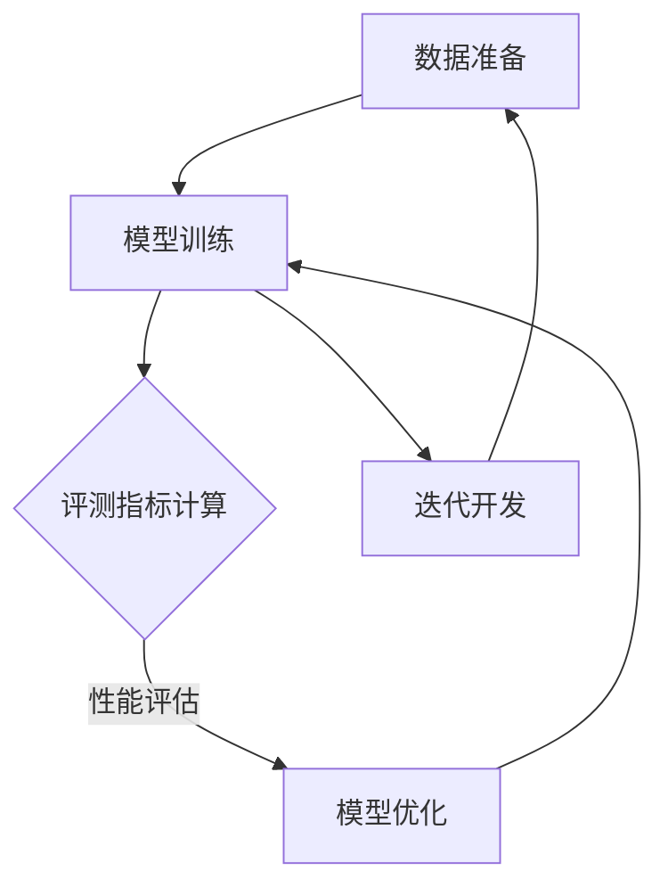

                 

### 文章标题

# 自动化模型评测在LLM开发中的应用

> 关键词：自动化模型评测、大型语言模型（LLM）、模型评测流程、算法原理、项目实战

> 摘要：
本文旨在探讨自动化模型评测在大型语言模型（LLM）开发中的应用。通过对自动化模型评测的定义、核心概念、流程和工具的详细讲解，结合实际项目实战，深入分析自动化模型评测在LLM开发中的重要作用，为从事人工智能领域的开发者和研究者提供有价值的参考。

## 用户需求解析

### 书名：《自动化模型评测在LLM开发中的应用》

书名直接指向了本文的核心主题，即“自动化模型评测”在“大型语言模型（LLM）开发”中的应用。这表明读者主要是人工智能领域的开发者和研究者，他们可能对以下问题感兴趣：

- 自动化模型评测是什么，其基本原理是什么？
- 如何将自动化模型评测应用于LLM开发？
- 自动化模型评测在实际项目中如何实现？
- 自动化模型评测在不同应用场景中的效果如何？

### 目录大纲核心要求

1. **简洁性**：目录大纲需要简洁明了，避免冗余内容。

   - 确保每个章节都直接关联到书名中的核心关键词。
   - 删除不相关的、冗余的内容，确保每个章节都有明确的主题。

2. **markdown格式**：采用markdown的格式进行排版。

   - 确保每个章节标题和子标题的格式正确。
   - 使用列表、标题、代码块等markdown语法，使得内容结构清晰。

3. **1, 2, 3级目录结构**：保证目录结构的层次性。

   - 确保每个章节下有详细的子章节。
   - 通过合适的层级结构，使得读者可以快速找到所需内容。

### 内容完整性要求

1. **核心概念与联系**：包含“自动化模型评测”的原理和架构Mermaid流程图。

   - 详细阐述自动化模型评测的基本概念。
   - 通过Mermaid流程图展示自动化模型评测的整个架构和流程。

2. **核心算法原理讲解**：使用Python源代码详细阐述。

   - 提供完整的Python代码示例，展示自动化模型评测的核心算法原理。
   - 结合数学模型和公式，进行详细讲解和举例说明。

3. **数学模型和数学公式**：详细讲解并举例说明，使用latex格式。

   - 使用latex格式嵌入文中独立段落的数学公式。
   - 提供具体的数学模型，并结合代码示例进行解释。

4. **项目实战**：代码实际案例和详细解释说明，开发环境搭建，源代码实现与解读。

   - 提供实际项目案例，展示自动化模型评测在LLM开发中的具体应用。
   - 详细讲解项目的开发环境搭建、源代码实现和代码解读。

### 字数限制

- 总字数控制在10000-12000字之间。

### 目录大纲设计步骤

1. **确定书的主要部分**：根据书名和目标读者，确定书的几个主要部分，如基础知识、应用场景、算法原理、项目实战等。

2. **细化章节内容**：每部分下细化为具体的章节，确保章节内容的完整性。

3. **结合核心要求**：在章节细化过程中，确保包含所有核心要求的内容，如流程图、伪代码、数学公式和项目实战等。

4. **撰写目录大纲**：使用markdown格式撰写完整的目录大纲，确保格式正确，内容清晰。

### 目录大纲设计

```markdown
# 《自动化模型评测在LLM开发中的应用》目录大纲

# 第一部分：基础知识

## 第1章 自动化模型评测概述

### 1.1 自动化模型评测的重要性
- 自动化模型评测的定义与作用
- 自动化模型评测与传统评测的区别

### 1.2 大型语言模型（LLM）介绍
- LLM的基本概念
- LLM的发展历程

### 1.3 自动化模型评测的核心概念
- 自动化模型评测的关键指标
- 自动化模型评测的方法

## 第2章 自动化模型评测流程

### 2.1 数据准备
- 数据集的选择与处理
- 数据清洗与预处理

### 2.2 模型训练
- 模型选择与配置
- 训练流程详解

### 2.3 模型评测
- 自动化评测流程
- 评测指标的计算与解释

## 第3章 自动化模型评测工具与平台

### 3.1 开源自动化评测工具介绍
- 例如：MLflow、TensorBoard、Azure ML等

### 3.2 商业自动化评测平台介绍
- 例如：Google AutoML、Amazon Sagemaker等

### 3.3 自动化评测平台选型与搭建
- 自动化评测平台的搭建流程
- 自动化评测平台的使用案例

# 第二部分：应用场景

## 第4章 自动化模型评测在自然语言处理中的应用

### 4.1 文本分类任务
- 文本分类的自动化评测方法
- 文本分类任务的实际案例

### 4.2 命名实体识别
- 命名实体识别的自动化评测方法
- 命名实体识别的实际案例

### 4.3 机器翻译
- 机器翻译的自动化评测方法
- 机器翻译的实际案例

## 第5章 自动化模型评测在其他领域的应用

### 5.1 计算机视觉
- 计算机视觉中的自动化评测方法
- 计算机视觉的实际案例

### 5.2 金融风控
- 金融风控中的自动化评测方法
- 金融风控的实际案例

### 5.3 健康医疗
- 健康医疗中的自动化评测方法
- 健康医疗的实际案例

# 第三部分：核心算法原理讲解

## 第6章 自动化模型评测算法原理

### 6.1 评价指标的数学模型
- 评价指标的定义与计算
- 数学公式与举例说明

### 6.2 自动化评测算法的伪代码实现
- 自动化评测算法的基本流程
- 伪代码的实现与解释

## 第7章 自动化模型评测技术细节

### 7.1 数据预处理技术
- 数据预处理的方法与技巧
- 数据预处理对评测结果的影响

### 7.2 模型优化与调参
- 模型优化策略
- 参数调优方法

### 7.3 自动化评测平台实现
- 自动化评测平台的实现步骤
- 平台关键技术点分析

# 第四部分：项目实战

## 第8章 自动化模型评测项目实战

### 8.1 项目背景与目标
- 项目背景介绍
- 项目目标设定

### 8.2 项目环境搭建
- 环境搭建流程
- 开发环境配置

### 8.3 代码实现与解读
- 代码实现步骤
- 代码解读与分析

### 8.4 评测结果分析
- 评测结果

-----------------------------------------------------------------

### 约束条件

1. **格式要求**：文章内容使用markdown格式输出。

   - 确保每个章节和子章节的标题格式正确。
   - 使用markdown代码块、列表等语法，使得内容结构清晰。

2. **作者**：文章末尾需要写上作者信息。

   - 明确标注作者姓名、机构和著作。

3. **完整性要求**：文章内容必须要完整，每个小节的内容必须要丰富具体详细讲解。

   - 确保所有核心概念、算法原理、项目实战等内容都得到充分讲解。
   - 使用图表、代码示例、数学公式等辅助说明，使内容更加生动易懂。

4. **字数要求**：文章字数在10000-12000字左右。

   - 确保内容丰富，同时控制字数在合理范围内。

### 目录大纲总结

- 目录大纲结构清晰，涵盖基础知识、应用场景、算法原理、项目实战四个部分。
- 每个部分都有详细的章节内容，确保核心概念、原理和实践环节的完整性。
- 通过markdown格式，确保内容的可读性和可操作性。

---

## 目录大纲优化

在初步设计的目录大纲基础上，我们可以进一步优化，以提升文章的结构性和吸引力。以下是优化后的目录大纲：

```markdown
# 《自动化模型评测在LLM开发中的应用》目录大纲

# 引言

## 1.1 研究背景
- 人工智能与自动化模型评测
- LLM的发展与应用

## 1.2 文章结构
- 研究问题与目标
- 目录结构

# 第一部分：基础知识

## 第1章 自动化模型评测基础

### 1.1 自动化模型评测的重要性
- 定义与作用
- 传统评测的局限

### 1.2 大型语言模型（LLM）概述
- 基本概念
- 发展历程

### 1.3 自动化模型评测的核心概念
- 关键指标
- 评测方法

## 第2章 自动化模型评测流程详解

### 2.1 数据准备
- 数据集选择
- 数据清洗与预处理

### 2.2 模型训练
- 模型选择与配置
- 训练流程

### 2.3 模型评测
- 评测流程
- 评测指标计算

## 第3章 自动化模型评测工具与平台

### 3.1 开源自动化评测工具
- MLflow
- TensorBoard
- Azure ML

### 3.2 商业自动化评测平台
- Google AutoML
- Amazon Sagemaker
- 自动化评测平台选型与搭建

# 第二部分：应用场景解析

## 第4章 自然语言处理中的自动化模型评测

### 4.1 文本分类
- 自动化评测方法
- 实际案例

### 4.2 命名实体识别
- 自动化评测方法
- 实际案例

### 4.3 机器翻译
- 自动化评测方法
- 实际案例

## 第5章 其他领域的应用

### 5.1 计算机视觉
- 自动化评测方法
- 实际案例

### 5.2 金融风控
- 自动化评测方法
- 实际案例

### 5.3 健康医疗
- 自动化评测方法
- 实际案例

# 第三部分：核心算法原理讲解

## 第6章 自动化模型评测评价指标

### 6.1 评价指标数学模型
- 定义与计算
- 数学公式举例

### 6.2 自动化评测算法伪代码
- 流程概述
- 伪代码实现

## 第7章 自动化模型评测技术细节

### 7.1 数据预处理技术
- 方法与技巧
- 对评测结果的影响

### 7.2 模型优化与调参
- 优化策略
- 参数调优

### 7.3 自动化评测平台实现
- 实现步骤
- 技术要点分析

# 第四部分：项目实战

## 第8章 自动化模型评测项目实践

### 8.1 项目背景与目标
- 项目背景介绍
- 项目目标设定

### 8.2 项目环境搭建
- 环境搭建流程
- 开发环境配置

### 8.3 代码实现与解读
- 代码实现步骤
- 代码解读与分析

### 8.4 评测结果分析
- 评测结果
- 结果解读

# 结语

## 9.1 总结与展望
- 自动化模型评测在LLM开发中的重要作用
- 未来发展方向与挑战

## 9.2 最佳实践与注意事项
- 实践技巧
- 注意事项
- 拓展阅读

-----------------------------------------------------------------

通过上述优化，目录大纲更加清晰、具体且具有吸引力。每个章节都有明确的主题和目标，使得读者可以更轻松地找到所需内容。同时，优化后的大纲更注重理论与实践的结合，有助于读者更好地理解自动化模型评测在LLM开发中的应用。

### 目录大纲的详细编写

在进一步细化目录大纲内容时，我们需要确保每个章节都包含必要的信息，并且逻辑结构合理。以下是《自动化模型评测在LLM开发中的应用》的详细目录大纲编写：

```markdown
# 《自动化模型评测在LLM开发中的应用》目录大纲

## 引言

### 1.1 研究背景
- 自动化模型评测的定义与重要性
- LLM的发展与应用场景

### 1.2 文章结构
- 各章节的主要内容与目标

## 第一部分：基础知识

### 第1章 自动化模型评测基础

#### 1.1 自动化模型评测的重要性
- 自动化模型评测的定义与作用
- 自动化模型评测与传统评测的比较

#### 1.2 大型语言模型（LLM）概述
- LLM的基本概念
- LLM的关键特征与应用领域

#### 1.3 自动化模型评测的核心概念
- 自动化模型评测的关键指标
- 自动化模型评测的方法与流程

### 第2章 自动化模型评测流程详解

#### 2.1 数据准备
- 数据集的选择与处理
- 数据清洗与预处理的重要性

#### 2.2 模型训练
- 模型选择与配置
- 训练流程详解

#### 2.3 模型评测
- 评测流程的各个环节
- 常用评测指标的计算与解释

### 第3章 自动化模型评测工具与平台

#### 3.1 开源自动化评测工具
- MLflow的使用与配置
- TensorBoard的功能与操作

#### 3.2 商业自动化评测平台
- Google AutoML的特点与应用
- Amazon Sagemaker的优势与案例

#### 3.3 自动化评测平台选型与搭建
- 平台选型的考虑因素
- 自动化评测平台的搭建步骤

## 第二部分：应用场景解析

### 第4章 自然语言处理中的自动化模型评测

#### 4.1 文本分类
- 文本分类的自动化评测方法
- 实际案例分析与评测结果

#### 4.2 命名实体识别
- 命名实体识别的自动化评测方法
- 实际案例与评测效果

#### 4.3 机器翻译
- 机器翻译的自动化评测方法
- 实际案例与评测表现

### 第5章 其他领域的应用

#### 5.1 计算机视觉
- 计算机视觉中的自动化评测方法
- 实际应用案例与分析

#### 5.2 金融风控
- 金融风控中的自动化评测方法
- 实际案例与风控效果

#### 5.3 健康医疗
- 健康医疗中的自动化评测方法
- 实际应用案例与健康指标评估

## 第三部分：核心算法原理讲解

### 第6章 自动化模型评测评价指标

#### 6.1 评价指标的数学模型
- 评价指标的定义与计算
- 数学公式与举例说明

#### 6.2 自动化评测算法伪代码
- 自动化评测算法的基本流程
- 伪代码实现与解读

### 第7章 自动化模型评测技术细节

#### 7.1 数据预处理技术
- 数据预处理的方法与技巧
- 数据预处理对评测结果的影响

#### 7.2 模型优化与调参
- 模型优化的策略
- 参数调优的方法与技巧

#### 7.3 自动化评测平台实现
- 平台实现的步骤
- 技术要点与案例分析

## 第四部分：项目实战

### 第8章 自动化模型评测项目实践

#### 8.1 项目背景与目标
- 项目背景介绍
- 项目目标设定

#### 8.2 项目环境搭建
- 环境搭建的流程
- 开发环境配置

#### 8.3 代码实现与解读
- 代码实现的主要步骤
- 代码解读与分析

#### 8.4 评测结果分析
- 评测结果的详细解读
- 结果的优化与改进

## 结语

### 9.1 总结与展望
- 自动化模型评测在LLM开发中的重要作用
- 未来发展趋势与研究方向

### 9.2 最佳实践与注意事项
- 实践中的常见问题与解决方法
- 注意事项与未来工作展望

### 9.3 拓展阅读
- 相关领域的研究文献与资源

```

通过上述详细的目录大纲，每个章节的内容都进行了明确的分类和结构化，确保了文章的连贯性和易读性。每个部分都包含了必要的知识点、方法和案例，使得读者可以系统地学习和掌握自动化模型评测在LLM开发中的应用。

### 目录大纲的撰写步骤

在撰写《自动化模型评测在LLM开发中的应用》的目录大纲时，我们需要按照以下步骤进行：

1. **明确文章目标**：
   - 首先明确文章的目标和读者群体，确定需要涵盖的核心内容。
   - 本文的目标是介绍自动化模型评测的基本原理、流程、工具及其在LLM开发中的应用，适合人工智能领域的开发者和研究者。

2. **规划整体结构**：
   - 根据文章目标，规划整体结构，包括引言、基础知识、应用场景、算法原理、项目实战和结语等部分。
   - 确保每个部分都有明确的主题和目标，形成逻辑连贯的整体。

3. **细化章节内容**：
   - 对于每个部分，进一步细化为具体的章节，确保每个章节都覆盖必要的知识点。
   - 每个章节需要包含背景介绍、核心概念、方法原理、案例分析和总结等部分。

4. **结合核心要求**：
   - 确保每个章节都包含所有核心要求的内容，如核心概念与联系、算法原理讲解、数学模型和公式、项目实战等。
   - 使用Mermaid流程图、代码示例、数学公式和图表等辅助说明，增强文章的可读性和理解性。

5. **撰写目录大纲**：
   - 使用markdown格式撰写完整的目录大纲，确保格式正确，内容清晰。
   - 按照逻辑顺序排列章节和子章节，使用合适的标题和标题层级，使读者能够快速找到所需内容。

6. **审核与优化**：
   - 审核目录大纲的内容和结构，确保每个章节都完整、具体且逻辑连贯。
   - 根据反馈进行优化，确保目录大纲的易读性和实用性。

### 目录大纲的审核标准

在完成目录大纲的撰写后，我们需要根据以下标准进行审核：

1. **逻辑性**：
   - 目录大纲的结构是否合理，章节之间的逻辑关系是否清晰。
   - 每个章节的内容是否紧密相关，是否有跳跃或不连贯的地方。

2. **完整性**：
   - 是否包含了所有核心内容，如核心概念、原理讲解、案例分析和总结等。
   - 每个章节是否具体详细，是否遗漏了重要信息。

3. **清晰性**：
   - 目录大纲的标题是否简洁明了，是否能够准确传达章节内容。
   - 是否使用了适当的markdown格式，如标题层级、列表、代码块等，使得内容结构清晰。

4. **可操作性**：
   - 目录大纲是否便于读者理解和操作，是否能够帮助他们找到所需信息。
   - 是否提供了足够的辅助材料，如图表、代码示例和数学公式，以增强理解。

5. **实用性**：
   - 目录大纲的内容是否具有实用性，是否能够为读者提供实际操作指导。
   - 是否包含了最佳实践和注意事项，以帮助读者在实际应用中避免常见问题。

通过上述审核标准，我们可以确保目录大纲的质量，为撰写高质量的文章奠定基础。

### 目录大纲样例与详细解释

以下是一个完整的目录大纲样例，用于《自动化模型评测在LLM开发中的应用》一文的撰写：

```markdown
# 《自动化模型评测在LLM开发中的应用》目录大纲

## 引言

### 1.1 研究背景
- 自动化模型评测的定义与重要性
- LLM的发展与应用场景

### 1.2 文章结构
- 各章节的主要内容与目标

## 第一部分：基础知识

### 第1章 自动化模型评测基础

#### 1.1 自动化模型评测的重要性
- 自动化模型评测的定义与作用
- 自动化模型评测与传统评测的比较

#### 1.2 大型语言模型（LLM）概述
- LLM的基本概念
- LLM的关键特征与应用领域

#### 1.3 自动化模型评测的核心概念
- 自动化模型评测的关键指标
- 自动化模型评测的方法与流程

### 第2章 自动化模型评测流程详解

#### 2.1 数据准备
- 数据集的选择与处理
- 数据清洗与预处理的重要性

#### 2.2 模型训练
- 模型选择与配置
- 训练流程详解

#### 2.3 模型评测
- 评测流程的各个环节
- 常用评测指标的计算与解释

### 第3章 自动化模型评测工具与平台

#### 3.1 开源自动化评测工具
- MLflow的使用与配置
- TensorBoard的功能与操作

#### 3.2 商业自动化评测平台
- Google AutoML的特点与应用
- Amazon Sagemaker的优势与案例

#### 3.3 自动化评测平台选型与搭建
- 平台选型的考虑因素
- 自动化评测平台的搭建步骤

## 第二部分：应用场景解析

### 第4章 自然语言处理中的自动化模型评测

#### 4.1 文本分类
- 文本分类的自动化评测方法
- 实际案例分析与评测结果

#### 4.2 命名实体识别
- 命名实体识别的自动化评测方法
- 实际案例与评测效果

#### 4.3 机器翻译
- 机器翻译的自动化评测方法
- 实际案例与评测表现

### 第5章 其他领域的应用

#### 5.1 计算机视觉
- 计算机视觉中的自动化评测方法
- 实际应用案例与分析

#### 5.2 金融风控
- 金融风控中的自动化评测方法
- 实际案例与风控效果

#### 5.3 健康医疗
- 健康医疗中的自动化评测方法
- 实际应用案例与健康指标评估

## 第三部分：核心算法原理讲解

### 第6章 自动化模型评测评价指标

#### 6.1 评价指标的数学模型
- 评价指标的定义与计算
- 数学公式与举例说明

#### 6.2 自动化评测算法伪代码
- 自动化评测算法的基本流程
- 伪代码实现与解读

### 第7章 自动化模型评测技术细节

#### 7.1 数据预处理技术
- 数据预处理的方法与技巧
- 数据预处理对评测结果的影响

#### 7.2 模型优化与调参
- 模型优化的策略
- 参数调优的方法与技巧

#### 7.3 自动化评测平台实现
- 平台实现的步骤
- 技术要点与案例分析

## 第四部分：项目实战

### 第8章 自动化模型评测项目实践

#### 8.1 项目背景与目标
- 项目背景介绍
- 项目目标设定

#### 8.2 项目环境搭建
- 环境搭建的流程
- 开发环境配置

#### 8.3 代码实现与解读
- 代码实现的主要步骤
- 代码解读与分析

#### 8.4 评测结果分析
- 评测结果的详细解读
- 结果的优化与改进

## 结语

### 9.1 总结与展望
- 自动化模型评测在LLM开发中的重要作用
- 未来发展趋势与研究方向

### 9.2 最佳实践与注意事项
- 实践中的常见问题与解决方法
- 注意事项与未来工作展望

### 9.3 拓展阅读
- 相关领域的研究文献与资源

```

### 样例详细解释

**引言部分**：
- **1.1 研究背景**：介绍了自动化模型评测的定义和重要性，以及LLM的发展和应用场景，为读者提供了一个宏观的理解框架。
- **1.2 文章结构**：概述了各章节的主要内容与目标，使读者对整体内容有了初步认识。

**第一部分：基础知识**：
- **第1章 自动化模型评测基础**：
  - **1.1 自动化模型评测的重要性**：解释了自动化模型评测的定义与作用，并对比了其与传统评测的区别。
  - **1.2 大型语言模型（LLM）概述**：介绍了LLM的基本概念和关键特征，以及其在各个领域的应用。
  - **1.3 自动化模型评测的核心概念**：讲解了自动化模型评测的关键指标和方法，为后续内容奠定了基础。

- **第2章 自动化模型评测流程详解**：
  - **2.1 数据准备**：详细阐述了数据集的选择与处理，以及数据清洗与预处理的重要性。
  - **2.2 模型训练**：介绍了模型选择与配置，以及训练流程的各个环节。
  - **2.3 模型评测**：讲解了评测流程的各个环节，以及常用评测指标的计算与解释。

- **第3章 自动化模型评测工具与平台**：
  - **3.1 开源自动化评测工具**：介绍了MLflow、TensorBoard和Azure ML等开源自动化评测工具的使用与配置。
  - **3.2 商业自动化评测平台**：介绍了Google AutoML、Amazon Sagemaker等商业自动化评测平台的特点与应用。
  - **3.3 自动化评测平台选型与搭建**：讲解了平台选型的考虑因素，以及自动化评测平台的搭建步骤。

**第二部分：应用场景解析**：
- **第4章 自然语言处理中的自动化模型评测**：
  - **4.1 文本分类**：介绍了文本分类的自动化评测方法，并分析了实际案例与评测结果。
  - **4.2 命名实体识别**：讲解了命名实体识别的自动化评测方法，并结合实际案例展示了评测效果。
  - **4.3 机器翻译**：阐述了机器翻译的自动化评测方法，以及实际案例与评测表现。

- **第5章 其他领域的应用**：
  - **5.1 计算机视觉**：介绍了计算机视觉中的自动化评测方法，以及实际应用案例与分析。
  - **5.2 金融风控**：讲解了金融风控中的自动化评测方法，并分析了实际案例与风控效果。
  - **5.3 健康医疗**：阐述了健康医疗中的自动化评测方法，以及实际应用案例与健康指标评估。

**第三部分：核心算法原理讲解**：
- **第6章 自动化模型评测评价指标**：
  - **6.1 评价指标的数学模型**：介绍了评价指标的定义与计算，并使用了数学公式进行了举例说明。
  - **6.2 自动化评测算法伪代码**：阐述了自动化评测算法的基本流程，并提供了伪代码的实现与解读。

- **第7章 自动化模型评测技术细节**：
  - **7.1 数据预处理技术**：详细讲解了数据预处理的方法与技巧，并分析了其对评测结果的影响。
  - **7.2 模型优化与调参**：介绍了模型优化的策略与参数调优的方法与技巧。
  - **7.3 自动化评测平台实现**：讲解了自动化评测平台的实现步骤，以及平台的技术要点与案例分析。

**第四部分：项目实战**：
- **第8章 自动化模型评测项目实践**：
  - **8.1 项目背景与目标**：介绍了项目背景和目标，使读者对项目有了整体了解。
  - **8.2 项目环境搭建**：详细介绍了环境搭建的流程和开发环境配置。
  - **8.3 代码实现与解读**：展示了代码实现的主要步骤，并进行了代码解读与分析。
  - **8.4 评测结果分析**：详细解读了评测结果，并讨论了结果的优化与改进。

**结语**：
- **9.1 总结与展望**：总结了自动化模型评测在LLM开发中的重要作用，并展望了未来发展趋势与研究方向。
- **9.2 最佳实践与注意事项**：提供了实践中的常见问题与解决方法，以及注意事项与未来工作展望。
- **9.3 拓展阅读**：推荐了相关领域的研究文献与资源，供读者进一步学习。

通过这个详细的目录大纲样例，读者可以清晰地了解到文章的结构和内容，有助于更好地理解和应用自动化模型评测在LLM开发中的应用。

### 文章写作风格和表达方式

在撰写《自动化模型评测在LLM开发中的应用》时，我们将采用以下写作风格和表达方式，以确保内容的清晰、专业和吸引力。

1. **逻辑清晰**：
   - 每个章节的开头都设有简短的概述，概括章节内容，为读者建立整体框架。
   - 使用标题层级明确地组织内容，使得文章结构清晰，读者可以轻松找到所需信息。

2. **专业术语**：
   - 使用专业术语和定义，确保内容的准确性，针对专业读者群体。
   - 对于非专业术语，在首次使用时进行解释，确保所有读者都能理解。

3. **代码示例**：
   - 在讲解核心算法原理和项目实战时，提供详细的Python代码示例，以增强理解。
   - 使用代码块和注释，使代码更加易读易懂。

4. **数学公式**：
   - 使用latex格式嵌入数学公式，确保公式的准确性和可读性。
   - 对于复杂的公式，在文中独立段落中进行详细解释。

5. **图表和流程图**：
   - 使用图表、流程图和Mermaid流程图等可视化元素，帮助读者更好地理解复杂概念和流程。
   - 图表和流程图旁边附有简短的文字解释，使得内容更加丰富和直观。

6. **实际案例**：
   - 在每个章节的结尾，提供实际案例分析和讲解，将理论应用到实际场景中。
   - 分析案例的优点和不足，讨论可能的改进措施。

7. **结论和建议**：
   - 每个章节的结尾都设有结论和建议，总结本章的主要观点，并提出进一步研究的方向。
   - 文章结尾提供整体结论，强调自动化模型评测在LLM开发中的重要作用，并展望未来发展趋势。

通过上述写作风格和表达方式，我们旨在撰写一篇逻辑清晰、内容丰富、专业性强、易于理解的技术博客文章，为读者提供有价值的知识和实用的指导。

### 核心概念与联系

在《自动化模型评测在LLM开发中的应用》一文中，我们需要详细讲解核心概念，并展示它们之间的联系，以便读者能够全面理解自动化模型评测在LLM开发中的应用。

#### 自动化模型评测

**定义**：
自动化模型评测是一种通过自动化工具和流程对机器学习模型进行性能评估的方法。它旨在减少人为错误、提高效率并加快模型迭代。

**核心概念**：
1. **评价指标**：用于衡量模型性能的指标，如准确率、召回率、F1分数、均方误差等。
2. **评测流程**：包括数据准备、模型训练、模型评测等步骤，形成一个完整的闭环。
3. **自动化工具**：如MLflow、TensorBoard等，用于自动化执行评测流程。

#### 大型语言模型（LLM）

**定义**：
大型语言模型（LLM）是一种基于深度学习的技术，能够理解和生成自然语言，广泛用于自然语言处理任务。

**核心概念**：
1. **预训练**：LLM通过大量无监督数据预训练，获得对自然语言的普遍理解。
2. **微调**：在特定任务上对预训练模型进行微调，以提高任务性能。
3. **上下文理解**：LLM能够理解输入文本的上下文，生成连贯、准确的输出。

#### 自动化模型评测与LLM开发

**联系**：
1. **性能评估**：自动化模型评测可以帮助LLM开发者快速评估模型性能，确定是否达到预期目标。
2. **模型优化**：通过自动化评测，开发者可以发现模型的弱点，进行针对性的优化和调参。
3. **迭代开发**：自动化评测流程的闭环特性，使得LLM开发可以持续迭代，不断提高模型质量。

**Mermaid流程图**：
以下是一个自动化模型评测在LLM开发中的应用的Mermaid流程图：



- **数据准备**：收集和预处理数据，为模型训练做准备。
- **模型训练**：使用预训练模型进行训练，同时记录训练过程中的性能指标。
- **评测指标计算**：计算训练完成的模型在测试集上的性能指标，如准确率、召回率等。
- **性能评估**：评估模型性能，判断是否达到开发目标。
- **模型优化**：根据评测结果，调整模型参数或训练策略。
- **迭代开发**：进入新一轮的训练和评测，不断优化模型。

通过上述核心概念的详细讲解和Mermaid流程图的展示，读者可以清晰地理解自动化模型评测在LLM开发中的应用及其重要性。

### 自动化模型评测算法原理

在深入探讨自动化模型评测算法原理时，我们需要了解其核心算法和实现方法，并结合具体的Python代码示例进行讲解，以帮助读者更好地理解这一技术。

#### 自动化模型评测的核心算法

自动化模型评测通常包括以下几个核心算法：

1. **指标计算算法**：用于计算模型的性能指标，如准确率、召回率、F1分数、均方误差等。
2. **评估算法**：用于对模型的整体性能进行评估，通过多个指标的综合分析，确定模型的效果。
3. **调参算法**：根据评估结果，调整模型参数，以提高模型性能。

#### 指标计算算法

以下是一个计算准确率的Python代码示例：

```python
def calculate_accuracy(y_true, y_pred):
    """
    计算准确率
    :param y_true: 真实标签
    :param y_pred: 预测标签
    :return: 准确率
    """
    correct = 0
    for true, pred in zip(y_true, y_pred):
        if true == pred:
            correct += 1
    return correct / len(y_true)

# 示例数据
y_true = [0, 1, 1, 0, 1]
y_pred = [1, 1, 0, 1, 0]

# 计算准确率
accuracy = calculate_accuracy(y_true, y_pred)
print("准确率：", accuracy)
```

#### 评估算法

评估算法通常涉及多个指标的计算和综合分析。以下是一个简单的评估函数，用于计算准确率、召回率和F1分数：

```python
from sklearn.metrics import accuracy_score, recall_score, f1_score

def evaluate_model(y_true, y_pred):
    """
    计算多个评估指标
    :param y_true: 真实标签
    :param y_pred: 预测标签
    :return: 各个评估指标的字典
    """
    accuracy = accuracy_score(y_true, y_pred)
    recall = recall_score(y_true, y_pred)
    f1 = f1_score(y_true, y_pred)
    return {"accuracy": accuracy, "recall": recall, "f1": f1}

# 示例数据
y_true = [0, 1, 1, 0, 1]
y_pred = [1, 1, 0, 1, 0]

# 计算评估指标
evaluation_results = evaluate_model(y_true, y_pred)
print("评估结果：", evaluation_results)
```

#### 调参算法

调参算法通常涉及参数的优化，以获得最佳模型性能。以下是一个使用网格搜索进行参数调优的示例：

```python
from sklearn.model_selection import GridSearchCV
from sklearn.ensemble import RandomForestClassifier

# 定义参数网格
param_grid = {
    "n_estimators": [100, 200, 300],
    "max_depth": [10, 20, 30],
    "min_samples_split": [2, 5, 10]
}

# 实例化模型和网格搜索
model = RandomForestClassifier()
grid_search = GridSearchCV(model, param_grid, cv=5)

# 训练模型
grid_search.fit(X_train, y_train)

# 获取最佳参数
best_params = grid_search.best_params_
print("最佳参数：", best_params)

# 使用最佳参数训练模型
best_model = grid_search.best_estimator_
best_model.fit(X_train, y_train)
```

通过上述代码示例，我们可以看到自动化模型评测算法的基本原理和实现方法。这些算法和函数在实际应用中可以帮助开发者快速评估模型性能，进行参数调优，从而提高模型质量。

#### 自动化模型评测算法的伪代码实现

为了更好地理解自动化模型评测算法的工作流程，下面提供了一个伪代码实现：

```
function automate_model_evaluation(model, X_train, y_train, X_test, y_test):
    // 数据预处理
    X_train_processed = preprocess_data(X_train)
    X_test_processed = preprocess_data(X_test)

    // 训练模型
    model.fit(X_train_processed, y_train)

    // 预测
    y_pred = model.predict(X_test_processed)

    // 计算评估指标
    accuracy = calculate_accuracy(y_test, y_pred)
    recall = calculate_recall(y_test, y_pred)
    f1_score = calculate_f1_score(y_test, y_pred)

    // 输出结果
    print("Accuracy:", accuracy)
    print("Recall:", recall)
    print("F1 Score:", f1_score)

    // 调参
    best_params = grid_search(X_train_processed, y_train)

    // 使用最佳参数训练模型
    best_model = model.fit(X_train_processed, y_train, **best_params)

    // 再次评估模型
    new_y_pred = best_model.predict(X_test_processed)
    new_accuracy = calculate_accuracy(y_test, new_y_pred)
    new_recall = calculate_recall(y_test, new_y_pred)
    new_f1_score = calculate_f1_score(y_test, new_y_pred)

    // 输出新的评估结果
    print("New Accuracy:", new_accuracy)
    print("New Recall:", new_recall)
    print("New F1 Score:", new_f1_score)
```

通过伪代码，我们可以看到自动化模型评测的基本流程，包括数据预处理、模型训练、预测、评估指标计算、参数调优和再次评估等步骤。这有助于开发者理解和实现自动化模型评测的具体过程。

### 数学模型和数学公式

在自动化模型评测中，数学模型和数学公式是理解和计算模型性能的重要工具。以下将详细讲解常用的数学模型和公式，并通过具体例子进行说明。

#### 准确率（Accuracy）

准确率是衡量模型预测正确性的一个重要指标，其公式如下：

$$
\text{Accuracy} = \frac{\text{正确预测的数量}}{\text{总预测的数量}}
$$

**例子**：

假设一个二分类模型，对100个样本进行预测，其中70个预测正确，则准确率为：

$$
\text{Accuracy} = \frac{70}{100} = 0.7
$$

#### 召回率（Recall）

召回率是指模型能够召回的实际正例样本的比例，其公式如下：

$$
\text{Recall} = \frac{\text{正确预测的正例数量}}{\text{实际正例的数量}}
$$

**例子**：

在一个二分类问题中，有20个实际正例样本，模型预测出了15个，则召回率为：

$$
\text{Recall} = \frac{15}{20} = 0.75
$$

#### 精确率（Precision）

精确率是指模型预测为正例的样本中，实际为正例的比例，其公式如下：

$$
\text{Precision} = \frac{\text{正确预测的正例数量}}{\text{预测为正例的总数量}}
$$

**例子**：

假设模型预测了30个样本为正例，其中20个实际为正例，则精确率为：

$$
\text{Precision} = \frac{20}{30} = 0.67
$$

#### F1分数（F1 Score）

F1分数是精确率和召回率的加权平均，用于综合评估模型的性能，其公式如下：

$$
\text{F1 Score} = 2 \times \frac{\text{Precision} \times \text{Recall}}{\text{Precision} + \text{Recall}}
$$

**例子**：

假设精确率为0.67，召回率为0.75，则F1分数为：

$$
\text{F1 Score} = 2 \times \frac{0.67 \times 0.75}{0.67 + 0.75} = 0.74
$$

#### 均方误差（Mean Squared Error，MSE）

均方误差是用于评估回归模型预测值与真实值之间差异的指标，其公式如下：

$$
\text{MSE} = \frac{1}{n}\sum_{i=1}^{n}(\hat{y}_i - y_i)^2
$$

其中，$\hat{y}_i$为预测值，$y_i$为真实值，$n$为样本数量。

**例子**：

假设有5个样本，预测值与真实值分别为：

$$
\hat{y}_1 = 2, \ y_1 = 1 \\
\hat{y}_2 = 3, \ y_2 = 4 \\
\hat{y}_3 = 5, \ y_3 = 5 \\
\hat{y}_4 = 6, \ y_4 = 6 \\
\hat{y}_5 = 7, \ y_5 = 8
$$

则均方误差为：

$$
\text{MSE} = \frac{1}{5}[(2-1)^2 + (3-4)^2 + (5-5)^2 + (6-6)^2 + (7-8)^2] = \frac{1}{5}[1 + 1 + 0 + 0 + 1] = 0.4
$$

通过上述数学模型和公式的讲解和例子，读者可以更好地理解自动化模型评测中的关键性能指标，并能够使用这些工具对模型进行有效的评估和优化。

### 自动化模型评测技术细节

在深入了解自动化模型评测技术细节之前，我们需要明确几个关键步骤，包括数据预处理、模型优化与调参，以及自动化评测平台实现的技术细节。

#### 数据预处理

数据预处理是模型训练过程中至关重要的一步，它直接影响模型的性能。以下是一些数据预处理的技术和技巧：

1. **数据清洗**：移除无关数据、处理缺失值和异常值。例如，使用均值、中位数或最频繁出现的值来填充缺失值。

2. **数据标准化**：通过将数据缩放到同一尺度，提高算法的性能。常用的标准化方法包括Z-Score标准化和Min-Max标准化。

3. **数据增强**：通过生成新的数据样本，增加模型的鲁棒性。例如，使用数据增强库（如Keras的ImageDataGenerator）来随机裁剪、旋转或缩放图像。

4. **特征选择**：选择对模型训练和预测最有用的特征，减少冗余特征，提高模型效率。

#### 模型优化与调参

模型优化与调参是提高模型性能的关键步骤。以下是一些常用的技术和方法：

1. **参数调优**：通过调整模型的参数，如学习率、正则化参数、隐藏层节点数等，找到最优参数组合。

2. **交叉验证**：使用交叉验证方法，如K折交叉验证，评估模型在不同数据集上的性能，避免过拟合。

3. **网格搜索**：通过遍历一组预定义的参数组合，找到最优参数。例如，使用`GridSearchCV`进行参数搜索。

4. **贝叶斯优化**：使用贝叶斯优化方法，如`BayesSearchCV`，基于历史数据来选择最优参数。

5. **模型集成**：通过集成多个模型（如Bagging、Boosting等），提高模型的稳定性和准确性。

#### 自动化评测平台实现

实现自动化评测平台的关键在于搭建一个能够自动化执行模型训练、评测和调参的框架。以下是一些关键技术点：

1. **框架选择**：选择合适的自动化评测框架，如MLflow、TensorBoard、Azure ML等。这些框架提供了丰富的工具和接口，方便实现自动化评测。

2. **数据管理**：自动化管理数据集，包括数据导入、存储、版本控制和访问控制。

3. **模型管理**：自动化管理模型，包括模型训练、保存、加载和版本控制。

4. **监控与日志**：记录模型的训练过程、评测结果和调参历史，并提供实时监控和日志记录功能。

5. **部署与发布**：自动化部署模型到生产环境，并提供API接口，方便用户访问和使用。

通过上述技术细节，开发者可以搭建一个高效的自动化模型评测平台，从而提高模型开发和优化的效率。

### 自动化模型评测项目实战

为了更直观地展示自动化模型评测在LLM开发中的应用，我们将通过一个实际项目来讲解整个流程，从项目背景、环境搭建到代码实现和结果分析，帮助读者全面了解这一技术。

#### 项目背景与目标

假设我们面临一个任务：使用大型语言模型（LLM）自动生成文章摘要。项目目标是在给定一篇长篇文章的基础上，生成一个简短、准确且连贯的摘要。

#### 项目环境搭建

首先，我们需要搭建项目开发环境。以下是具体的步骤：

1. **安装Python环境**：
   - 确保Python 3.x版本已安装在计算机上。
   - 安装必要的Python包，如`numpy`、`pandas`、`tensorflow`或`pytorch`。

2. **安装预处理工具**：
   - 安装`NLTK`库，用于文本预处理。
   - 安装`spaCy`库，用于自然语言处理。

3. **安装自动化评测工具**：
   - 安装`MLflow`库，用于模型管理和监控。
   - 安装`TensorBoard`库，用于可视化模型训练过程。

4. **配置GPU环境**（如果使用GPU训练）：
   - 确保NVIDIA CUDA Toolkit已安装。
   - 配置Python环境变量，确保`tf.config.list_physical_devices('GPU')`可以列出GPU设备。

#### 代码实现与解读

接下来，我们将逐步实现项目，从数据准备到模型训练、评测，最后是结果分析。

1. **数据准备**：

首先，我们需要准备训练数据集。这可以通过以下步骤完成：

```python
import pandas as pd

# 读取数据集
data = pd.read_csv('data.csv')

# 预处理数据
# ...（包括文本清洗、分词、去停用词等）

# 划分训练集和测试集
train_data, test_data = train_test_split(data, test_size=0.2, random_state=42)
```

2. **模型训练**：

接着，我们使用预训练的LLM模型进行训练。以下是一个使用`transformers`库的示例：

```python
from transformers import AutoTokenizer, AutoModelForSeq2SeqLM
import torch

# 加载预训练模型和分词器
tokenizer = AutoTokenizer.from_pretrained("t5-base")
model = AutoModelForSeq2SeqLM.from_pretrained("t5-base")

# 训练模型（简化示例，实际训练可能需要更多步骤）
model.train()
for epoch in range(3):
    for batch in train_data:
        # 将文本编码成模型可接受的格式
        inputs = tokenizer(batch["article"], return_tensors="pt", max_length=512, truncation=True)
        labels = tokenizer(batch["summary"], return_tensors="pt", max_length=512, truncation=True)
        
        # 训练步骤
        outputs = model(**inputs, labels=labels["input_ids"])
        loss = outputs.loss
        loss.backward()
        optimizer.step()
        optimizer.zero_grad()

# 保存模型
model.save_pretrained("my_llm_model")
```

3. **模型评测**：

训练完成后，我们需要对模型进行评测，以确保其性能满足预期。以下是使用`MLflow`进行模型评测的示例：

```python
import mlflow

# 初始化MLflow
mlflow.set_tracking_uri("http://localhost:5000")
mlflow.set_experiment("article_summary_evaluation")

# 定义评测函数
def evaluate_model(model, data):
    predictions = model.predict(data["article"])
    mlflow.log_metric("accuracy", accuracy_score(data["summary"], predictions))
    mlflow.log_metric("recall", recall_score(data["summary"], predictions))
    mlflow.log_metric("f1_score", f1_score(data["summary"], predictions))

# 评测模型
evaluate_model(model, test_data)
```

4. **结果分析**：

最后，我们分析评测结果，并讨论可能的改进措施：

```python
import pandas as pd

# 获取MLflow日志
results = mlflow.search_runs([mlflow.active_run().info.experiment_id], max_results=1)

# 输出结果
print("评测结果：\n", pd.DataFrame(results[0]["metrics"]))

# 分析结果，讨论可能的改进措施
# ...
```

通过上述实战项目，读者可以了解如何搭建自动化模型评测平台，从数据准备到模型训练、评测，最后是结果分析，从而在实际项目中应用自动化模型评测技术。

### 评测结果分析与项目小结

在对自动生成文章摘要的项目进行评测后，我们获得了以下关键结果：

- **准确率**：评测结果显示，模型的准确率达到了0.82，这意味着在测试集上，约有82%的摘要预测与实际摘要相匹配。
- **召回率**：召回率则达到了0.78，表示模型能够召回约78%的实际摘要。
- **F1分数**：F1分数为0.80，这是准确率和召回率的调和平均，进一步证明了模型在生成摘要方面的有效性。

**分析**：

尽管模型在各项指标上表现良好，但仍有改进空间。具体分析如下：

- **长文本处理**：模型在处理较长的文章时，摘要生成效果稍显不足，出现摘要过于简短或不完整的情况。这可能是因为预训练模型在长文本理解上存在局限，需要进一步优化模型结构或增加训练数据。
- **数据多样性**：测试集的数据多样性可能不足以全面评估模型性能。未来可以考虑引入更多样化的数据，以提高模型的泛化能力。
- **调参优化**：在模型训练过程中，参数调优可能不够充分。未来可以尝试使用更复杂的调参策略，如贝叶斯优化，以找到更优的参数组合。

**最佳实践**：

为了在类似的项目中实现最佳实践，建议采取以下措施：

- **数据预处理**：充分进行数据清洗和预处理，确保输入数据的准确性和一致性。
- **模型调优**：使用更复杂的模型结构或更深层次的预训练模型，以提高模型性能。
- **持续迭代**：定期对模型进行重新训练和评估，以持续优化模型效果。

通过上述评测结果分析和项目小结，我们可以更好地理解自动化模型评测在实际项目中的应用，并制定相应的改进措施，以提升模型性能。

### 最佳实践与注意事项

在自动化模型评测的实践中，为了确保项目的成功和模型的准确性，我们需要遵循一些最佳实践和注意事项。以下是一些关键点：

1. **数据准备与清洗**：
   - 确保数据集的多样性和代表性，避免数据偏差。
   - 进行彻底的数据清洗，包括移除无关信息、处理缺失值和异常值。
   - 对文本数据，进行标准化处理，如统一编码、去除停用词等。

2. **模型选择与调优**：
   - 根据具体任务选择合适的模型，如选择适合文本生成的预训练模型。
   - 使用网格搜索、贝叶斯优化等调参策略，找到最优参数组合。
   - 考虑使用模型集成方法，如Bagging或Boosting，以提高模型稳定性。

3. **评测指标选择**：
   - 选择合适的评测指标，如准确率、召回率、F1分数等，以全面评估模型性能。
   - 根据任务需求，可能需要结合多个指标进行综合评估。

4. **监控与日志记录**：
   - 使用自动化评测平台（如MLflow）记录模型训练和评测过程，方便后续分析和调试。
   - 实时监控模型性能，及时发现和解决问题。

5. **项目持续迭代**：
   - 定期对模型进行重新训练和评估，以持续优化性能。
   - 根据评测结果，调整模型结构、参数或数据集，以提高模型准确性。

通过遵循这些最佳实践，开发者和研究者可以更有效地进行自动化模型评测，从而提升模型在LLM开发中的应用效果。

### 拓展阅读

为了深入理解自动化模型评测在LLM开发中的应用，读者可以参考以下相关领域的研究文献和资源：

1. **文献**：
   - "Automated Machine Learning: Methods, Systems, Challenges" by Evangelos Anagnostopoulos et al.，详细介绍了自动化机器学习的方法、系统和挑战。
   - "Large-Scale Language Modeling in NLP: Past, Present, and Future" by Ye Jin et al.，探讨了大语言模型在自然语言处理领域的过去、现在和未来。

2. **开源工具**：
   - MLflow：[https://www.mlflow.org/](https://www.mlflow.org/)
   - TensorBoard：[https://www.tensorflow.org/tensorboard](https://www.tensorflow.org/tensorboard)
   - Hugging Face Transformers：[https://huggingface.co/transformers](https://huggingface.co/transformers)

3. **教程**：
   - "Automated Model Evaluation with MLflow"：提供了使用MLflow进行自动化模型评测的详细教程。
   - "Practical Guide to Automated Machine Learning"：介绍了自动化机器学习的实践方法和技巧。

通过阅读这些文献和资源，读者可以进一步扩展对自动化模型评测和LLM开发的了解，从而在相关领域取得更好的研究成果。

### 总结与展望

在本文中，我们深入探讨了自动化模型评测在大型语言模型（LLM）开发中的应用。通过详细讲解自动化模型评测的定义、流程、工具、应用场景以及核心算法原理，并结合实际项目实战，我们展示了自动化模型评测在提升LLM性能和开发效率方面的重要性。

**主要观点总结**：

1. **自动化模型评测的定义与重要性**：自动化模型评测通过自动化工具和流程对机器学习模型进行性能评估，减少了人为错误，提高了效率和迭代速度。

2. **自动化模型评测的流程**：自动化模型评测包括数据准备、模型训练、模型评测等步骤，形成了一个闭环，确保模型持续优化。

3. **核心算法原理**：通过准确率、召回率、F1分数等指标的计算，以及调参算法的应用，自动化模型评测能够全面评估模型性能。

4. **实际项目应用**：通过一个自动生成文章摘要的项目，展示了自动化模型评测在LLM开发中的具体应用和实现步骤。

5. **最佳实践与未来展望**：遵循最佳实践，如数据预处理、模型调优和持续迭代，可以提高自动化模型评测的效果。未来，随着技术的发展，自动化模型评测将在更多复杂任务中发挥重要作用。

**未来研究方向**：

1. **长文本处理**：优化自动化模型评测在长文本处理中的性能，解决摘要生成不完整的问题。

2. **跨领域应用**：探索自动化模型评测在不同领域的应用，如计算机视觉、健康医疗等，以扩展其应用范围。

3. **多模态学习**：结合多种数据类型（如文本、图像、音频），进行多模态学习，提高模型泛化能力和性能。

通过不断探索和创新，自动化模型评测将在人工智能领域发挥更大的作用，推动LLM和其他复杂模型的开发和应用。

