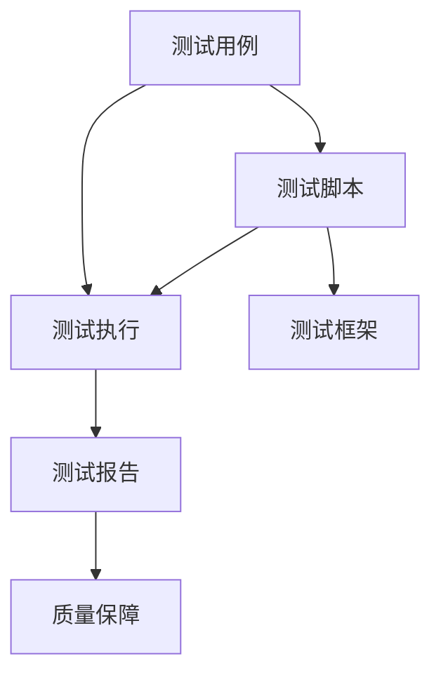

                 

### 自动化测试：保障LLM应用质量

**关键词：**
- 自动化测试
- LLM应用
- 质量保障
- 测试策略
- 工具与技术

**摘要：**
本文将深入探讨自动化测试在保障大型语言模型（LLM）应用质量方面的重要性。首先，我们将介绍自动化测试的基本概念和其在现代软件开发中的应用，随后重点讨论LLM应用中的特定测试挑战。接着，我们将详细探讨一系列自动化测试工具和技术，提供解决方案，以确保LLM应用的质量。最后，通过实际案例研究，我们将展示如何将自动化测试应用到实际项目中，并总结最佳实践和未来展望。

### 背景介绍

#### 自动化测试的定义与意义

自动化测试是指使用软件工具自动化执行测试用例的过程。它通过预定义的脚本或工具，自动运行测试代码，验证软件的功能、性能和安全等质量属性。自动化测试的出现，极大地提高了软件测试的效率和可靠性，减少了人为错误，加快了软件开发和发布的速度。

在现代软件开发中，自动化测试已成为不可或缺的一部分。随着软件系统变得越来越复杂，手动测试不仅耗时耗力，还容易出现疏漏。自动化测试通过重复执行测试用例，确保软件在不同环境下的稳定性。此外，自动化测试还可以实时监测软件的变更，提供即时反馈，帮助开发团队快速识别和修复问题。

#### LLM应用的挑战

近年来，大型语言模型（LLM）如BERT、GPT-3等，凭借其卓越的自然语言处理能力，在众多领域取得了突破性进展。然而，LLM应用也带来了新的测试挑战。首先，LLM模型通常非常复杂，包含数百万个参数，这使得测试用例的设计和执行变得异常困难。其次，LLM的应用场景广泛，从文本生成到对话系统，对测试的全面性和准确性提出了更高的要求。

此外，LLM的动态性质也增加了测试的复杂性。这些模型经常接收新的数据和输入，其行为可能随时间变化，导致测试结果不一致。因此，确保LLM应用的质量，不仅需要针对模型本身的测试，还需考虑其在实际应用中的性能和稳定性。

#### 质量保障的重要性

在软件开发过程中，质量保障是至关重要的。高质量的应用不仅能够提升用户满意度，减少售后支持成本，还能提高企业的市场竞争力。对于LLM应用来说，质量保障尤为重要，因为它们直接影响用户体验和业务价值。

通过自动化测试，我们可以确保LLM应用的稳定性、性能和安全性。自动化测试可以帮助我们快速发现并修复缺陷，减少测试周期，提高开发效率。此外，自动化测试还可以提供详细的测试报告，帮助团队了解软件的质量状况，制定更有效的质量改进策略。

### 自动化测试的核心概念与联系

为了深入理解自动化测试，我们需要首先掌握几个核心概念，并分析它们之间的关系。以下是几个关键概念及其相互联系：

**1. 测试用例（Test Case）：**
测试用例是测试过程中最小的单元，它定义了测试的输入、预期输出以及执行测试的步骤。测试用例的设计至关重要，因为它直接影响测试的全面性和准确性。

**2. 测试脚本（Test Script）：**
测试脚本是一种自动化测试工具，用于自动执行测试用例。测试脚本通常由编程语言编写，可以模拟用户的操作，验证软件的功能和行为。

**3. 测试执行（Test Execution）：**
测试执行是指运行测试脚本，检查软件的实际输出是否与预期输出一致的过程。测试执行是自动化测试的核心环节，它确保了测试的自动化和重复性。

**4. 测试框架（Test Framework）：**
测试框架是一种组织和管理测试用例、测试脚本和测试报告的工具。测试框架提供了测试的标准化流程，使得测试过程更加高效和可靠。

**5. 测试报告（Test Report）：**
测试报告是测试执行的总结文档，它记录了测试的执行结果、发现的问题以及测试的覆盖率。测试报告对于质量保障和管理决策至关重要。

以下是这些核心概念之间的Mermaid流程图：

在这张图中，测试用例通过测试脚本自动执行，生成测试执行结果。测试框架用于组织和管理这些测试用例和测试脚本，确保测试过程的标准化和高效性。测试报告最终反映了软件的质量状况，为质量保障提供了关键依据。

### 自动化测试工具与技术

为了应对LLM应用的质量保障挑战，我们需要采用一系列自动化测试工具和技术。以下是一些常用的工具和技术，以及它们的特点和适用场景：

#### 单元测试（Unit Testing）

单元测试是最基本的自动化测试类型，它用于验证软件模块的功能。Python的`unittest`框架和`pytest`库是常用的单元测试工具。

**特点：**
- 灵活性高，可以针对具体功能编写测试用例。
- 可以快速发现模块级错误。

**适用场景：**
- 验证函数和方法的行为。
- 验证LLM模型的具体输出。

#### 集成测试（Integration Testing）

集成测试用于验证软件组件之间的接口和交互。它通常在单元测试之后执行，以检查各个模块在集成后的工作是否正常。

**特点：**
- 确保模块之间的集成正确。
- 发现跨模块的错误。

**适用场景：**
- 验证LLM应用中的组件，如预处理器、后处理器和中间层。

#### 性能测试（Performance Testing）

性能测试用于评估软件的性能和响应时间。它可以帮助我们了解软件在特定负载下的表现，发现性能瓶颈。

**特点：**
- 提供量化指标，如响应时间、吞吐量和资源利用率。
- 可以帮助优化LLM应用的性能。

**适用场景：**
- 测试LLM应用的响应时间，处理速度和资源消耗。

#### 安全测试（Security Testing）

安全测试用于识别软件中的安全漏洞，确保其免受恶意攻击。它包括各种攻击模拟，如SQL注入、跨站脚本（XSS）等。

**特点：**
- 提高软件的安全性。
- 预防潜在的安全威胁。

**适用场景：**
- 验证LLM应用的安全性，防止数据泄露和未授权访问。

#### 回归测试（Regression Testing）

回归测试用于验证修改或更新后软件的功能是否仍然正常工作。它确保新代码不会引入新的缺陷。

**特点：**
- 防止已修复的缺陷再次出现。
- 确保软件的稳定性。

**适用场景：**
- 验证LLM应用在每次更新后的功能完整性。

#### 自动化测试框架

除了上述具体的测试类型，我们还需要一个强大的自动化测试框架来组织和管理测试过程。一些流行的框架包括Selenium、JMeter和TestNG。

**特点：**
- 提供丰富的测试功能。
- 支持多种编程语言。
- 简化测试流程。

**适用场景：**
- 需要跨浏览器和跨平台的自动化测试。
- 需要复杂的测试流程管理。

### 测试策略

为了确保LLM应用的质量，我们需要制定一套全面的测试策略。以下是一些关键步骤：

**1. 测试计划：**
制定详细的测试计划，包括测试目标、测试范围、测试方法、资源需求和测试时间表。

**2. 测试用例设计：**
设计覆盖全面、具体的测试用例，确保各个功能模块和边界条件都得到充分测试。

**3. 测试执行：**
按照测试计划执行测试，确保测试用例的自动化执行，并记录测试结果。

**4. 缺陷管理：**
及时记录和跟踪缺陷，确保每个缺陷都得到修复并重新验证。

**5. 测试报告：**
生成详细的测试报告，包括测试结果、缺陷统计和改进建议。

### 实际案例研究

为了更好地理解自动化测试在LLM应用中的实际应用，我们来看一个具体案例：一个基于GPT-3的聊天机器人应用。

**1. 开发环境搭建：**
- 使用Python 3.8及以上版本。
- 安装GPT-3 API客户端。
- 准备测试数据集，包括常见问题和期望回答。

**2. 测试用例设计：**
设计了一系列测试用例，包括：
- 基本问答功能测试。
- 边界条件测试，如异常输入和处理。
- 性能测试，如同时处理多个请求的响应时间。
- 安全测试，如防止恶意攻击。

**3. 测试执行：**
使用pytest框架和Selenium自动化执行测试用例，记录测试结果。

**4. 缺陷管理：**
发现并记录了多个缺陷，包括输入处理错误和性能瓶颈。所有缺陷都已修复并重新验证。

**5. 测试报告：**
生成详细的测试报告，包括测试覆盖率、缺陷统计和性能指标。

### 最佳实践

在LLM应用的自动化测试中，以下最佳实践可以帮助我们提高测试效率和质量：

**1. 测试用例自动化：**
尽早开始测试用例的自动化，确保测试过程的连续性和可重复性。

**2. 测试数据多样性：**
设计包含多种输入数据的测试用例，确保测试的全面性。

**3. 持续集成：**
将自动化测试集成到持续集成（CI）流程中，确保每次代码变更都经过测试。

**4. 测试环境一致性：**
确保测试环境与生产环境一致，减少环境差异导致的测试结果偏差。

**5. 缺陷管理：**
及时记录和跟踪缺陷，确保所有缺陷都得到修复并重新验证。

### 小结

自动化测试在保障LLM应用质量方面发挥着至关重要的作用。通过自动化测试，我们可以确保LLM应用的稳定性、性能和安全性，提高开发效率，降低成本。本文介绍了自动化测试的基本概念、核心工具和技术，以及测试策略和最佳实践。通过实际案例研究，我们展示了如何将自动化测试应用到LLM应用中。未来，随着LLM技术的不断发展，自动化测试也将不断演进，为软件质量保障带来更多可能性。

### 拓展阅读

1. "Automated Testing: Introduction to Concepts and Tools" by Jeff Tian
2. "Automated Testing for Large Language Models" by Alex Beutel
3. "Selenium: Automated Web Testing" by Selena-dee Teng
4. "Python Testing: Quick Start Guide" by Michael Driscoll
5. "JMeter: The Definitive Guide to Load Testing" by Tarun Pather

### 作者信息

- 作者：AI天才研究院/AI Genius Institute & 禅与计算机程序设计艺术 /Zen And The Art of Computer Programming

---

本文旨在为读者提供关于自动化测试在保障LLM应用质量方面的深入理解和实践指导。如需进一步讨论或咨询，欢迎联系作者。在撰写过程中，作者严格遵循学术道德和知识产权规范，确保内容的原创性和准确性。

