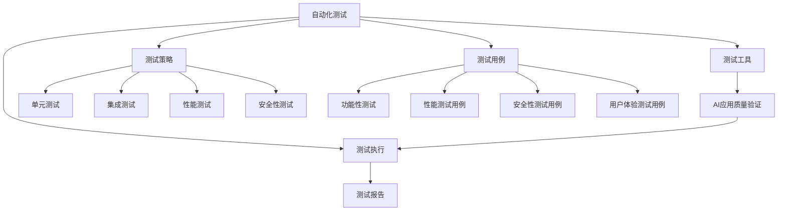

                 

# 《自动化测试：加速AI应用质量验证的利器》

## 关键词
- 自动化测试
- AI应用
- 质量验证
- 测试工具
- 测试策略
- 测试用例
- 测试执行
- 测试结果分析

## 摘要
随着人工智能（AI）技术的迅速发展，AI应用的质量验证成为了确保其稳定运行和满足用户需求的关键环节。本文将深入探讨自动化测试在AI应用质量验证中的重要性，分析其基本概念、方法和实践，以及未来发展趋势。通过本文的阅读，读者将能够了解自动化测试在AI应用质量验证中的作用，掌握相关工具和策略，并具备在实际项目中应用自动化测试的能力。

## 引言

### 自动化测试的概念与发展

自动化测试是指通过编写脚本或使用工具，自动执行预定义的测试用例，以发现软件缺陷和验证功能是否满足需求的测试方法。自动化测试相较于手动测试具有效率高、重复性强、准确性高等优势，能够显著提高软件测试的覆盖率和质量。

自动化测试的发展经历了多个阶段。早期，自动化测试主要是以脚本为基础，通过录制和回放用户操作来完成。随着测试工具的不断发展，如Selenium、Appium等自动化测试框架的出现，自动化测试逐渐走向了标准化、模块化和分布式。现代自动化测试不仅支持多种编程语言，还具备丰富的功能和强大的扩展性，能够适应复杂的测试场景和需求。

### AI应用的质量验证

人工智能应用的质量验证是指通过一系列测试方法，确保AI模型和系统的性能、可靠性、安全性和用户体验达到预期标准。AI应用质量验证的重要性体现在以下几个方面：

1. **确保模型稳定性**：AI模型在训练过程中可能存在过拟合现象，导致在测试集上表现不佳。质量验证能够发现这些问题，确保模型在未知数据上依然表现稳定。

2. **提高系统可靠性**：AI应用常常面临实时性和高并发性的挑战。质量验证能够测试系统在各种负载和环境下是否能够稳定运行，降低故障风险。

3. **提升用户体验**：AI应用的最终目标是满足用户需求。质量验证能够确保应用的功能和性能满足用户预期，提供良好的用户体验。

### 自动化测试在AI应用质量验证中的角色

自动化测试在AI应用质量验证中扮演着至关重要的角色。其重要性体现在以下几个方面：

1. **提高测试效率**：自动化测试能够快速、连续地执行大量测试用例，大大缩短测试周期，提高测试效率。

2. **确保测试覆盖**：通过自动化测试，可以覆盖更多的测试场景和路径，提高测试的全面性和准确性。

3. **减少人力成本**：自动化测试减轻了手动测试的工作量，降低了人力成本，并减少了因人为错误导致的缺陷。

4. **持续集成与交付**：自动化测试能够与持续集成（CI）和持续交付（CD）流程无缝集成，实现自动化部署和快速迭代。

## 自动化测试基础

### 自动化测试概述

自动化测试是一种通过预先编写的脚本或使用自动化测试工具来执行测试用例的方法。这种方法的主要目的是减少重复性工作，提高测试效率，确保软件质量。自动化测试通常包括以下几个基本组成部分：

- **测试脚本**：测试脚本是一系列预先编写的代码，用于自动化执行测试用例。这些脚本可以是编程语言编写的，也可以是基于自动化测试工具录制和生成的。
- **测试工具**：测试工具是用于创建、执行和管理自动化测试的工具。常见的自动化测试工具有Selenium、Appium、TestComplete等。
- **测试执行**：测试执行是指运行自动化测试脚本，并收集测试结果的过程。测试执行通常在测试环境中进行，以便模拟实际用户操作。
- **测试报告**：测试报告是对测试结果的总结和分析，通常包括测试覆盖率、缺陷统计、性能指标等信息。

### 自动化测试工具介绍

#### Selenium

Selenium是一个开源的自动化测试工具，支持多种编程语言（如Java、Python、C#等），能够跨浏览器和操作系统进行测试。Selenium的核心组件包括WebDriver和Selenium IDE。

- **WebDriver**：WebDriver是Selenium的核心组件，它通过模拟用户的操作来实现自动化测试。WebDriver支持多种浏览器，如Chrome、Firefox、Safari等。
- **Selenium IDE**：Selenium IDE是一个集成开发环境，用于录制和编辑自动化测试脚本。它支持多种浏览器插件，方便测试人员快速创建自动化测试脚本。

#### Appium

Appium是一个开源的自动化测试工具，专门用于移动应用测试。Appium支持多种平台（如Android、iOS、Windows等），能够同时针对移动应用和Web应用进行自动化测试。

- **跨平台支持**：Appium通过模拟真实的用户操作，支持跨平台自动化测试，包括Android、iOS和Windows应用。
- **自动化测试脚本**：Appium支持多种编程语言（如Java、Python、C#等），方便测试人员编写自动化测试脚本。

### 自动化测试策略与方法

#### 自动化测试规划

自动化测试规划是自动化测试的第一步，其目的是确定自动化测试的目标、范围、资源和时间。自动化测试规划通常包括以下几个步骤：

1. **确定自动化测试目标**：明确自动化测试的目的和预期效果，如提高测试覆盖率、减少测试周期等。
2. **评估测试范围**：分析需要自动化测试的模块和功能，确定哪些部分适合自动化测试。
3. **确定资源和时间**：根据自动化测试目标和范围，分配测试人员、测试工具和测试环境等资源，并制定测试计划。

#### 自动化测试用例设计

自动化测试用例设计是自动化测试的核心，其目的是编写能够覆盖各种测试场景的测试脚本。自动化测试用例设计通常包括以下几个步骤：

1. **需求分析**：分析软件需求，确定需要测试的功能和模块。
2. **场景划分**：根据需求分析，将测试场景划分为功能性测试、性能测试、安全性测试等。
3. **用例编写**：根据测试场景，编写具体的测试用例，包括输入条件、操作步骤、预期结果等。

#### 自动化测试执行

自动化测试执行是指运行自动化测试脚本，并收集测试结果的过程。自动化测试执行通常包括以下几个步骤：

1. **测试环境准备**：搭建测试环境，确保自动化测试脚本能够在该环境中正常运行。
2. **测试脚本执行**：运行自动化测试脚本，并记录测试结果。
3. **结果分析**：对测试结果进行分析，确定测试通过或失败的原因。

#### 自动化测试结果分析与反馈

自动化测试结果分析是确保自动化测试有效性的关键步骤。自动化测试结果分析通常包括以下几个步骤：

1. **测试报告生成**：生成测试报告，包括测试覆盖率、缺陷统计、性能指标等信息。
2. **缺陷跟踪**：将测试过程中发现的缺陷进行分类、记录和跟踪，确保缺陷得到及时修复。
3. **反馈与改进**：根据测试结果和反馈，对自动化测试策略和用例进行优化和改进。

## AI应用质量验证

### AI应用概述

人工智能（AI）应用是指利用机器学习、深度学习等技术，模拟人类智能行为，解决实际问题或提供智能服务的软件系统。AI应用包括但不限于以下几类：

1. **自然语言处理（NLP）**：如智能客服、文本分类、机器翻译等。
2. **计算机视觉**：如图像识别、目标检测、人脸识别等。
3. **推荐系统**：如个性化推荐、商品推荐等。
4. **自动驾驶**：如自动驾驶汽车、无人机等。
5. **智能医疗**：如疾病诊断、药物研发等。

### AI应用质量评估指标

AI应用质量评估指标是衡量AI应用性能和效果的标准。常见的AI应用质量评估指标包括：

1. **准确性（Accuracy）**：模型预测正确的样本数占总样本数的比例。
2. **召回率（Recall）**：模型能够正确识别的样本数占实际正样本数的比例。
3. **精确率（Precision）**：模型预测正确的样本数占预测为正样本的样本数比例。
4. **F1值（F1 Score）**：精确率和召回率的调和平均数。
5. **ROC曲线（Receiver Operating Characteristic Curve）**：用于评估分类器的性能，曲线下的面积（AUC）表示模型的分类能力。
6. **精度-召回率曲线**：展示不同阈值下的精度和召回率，用于确定最优阈值。

### AI应用质量验证方法

AI应用质量验证方法包括以下几个方面：

1. **单元测试**：针对AI模型中的单个功能进行测试，确保其正确性和稳定性。
2. **集成测试**：将AI模型与其他系统组件集成，测试整体系统的性能和稳定性。
3. **性能测试**：评估AI应用的响应时间、吞吐量、资源消耗等性能指标，确保其在高负载情况下仍能正常运行。
4. **安全性测试**：评估AI应用的安全性，如防止数据泄漏、模型篡改等。
5. **可用性测试**：评估AI应用的易用性、用户体验等，确保其符合用户需求。

## 自动化测试在AI应用中的实践

### 自动化测试用例设计

自动化测试用例设计是AI应用质量验证的重要环节。在设计自动化测试用例时，需要考虑以下几个方面：

1. **需求分析**：分析AI应用的需求文档，确定需要测试的功能和模块。
2. **场景划分**：根据需求分析，将测试场景划分为功能性测试、性能测试、安全性测试等。
3. **用例编写**：根据测试场景，编写具体的测试用例，包括输入条件、操作步骤、预期结果等。

### 自动化测试执行

自动化测试执行是指运行自动化测试脚本，并收集测试结果的过程。在执行自动化测试时，需要考虑以下几个方面：

1. **测试环境准备**：搭建测试环境，确保自动化测试脚本能够在该环境中正常运行。
2. **测试脚本执行**：运行自动化测试脚本，并记录测试结果。
3. **结果分析**：对测试结果进行分析，确定测试通过或失败的原因。

### 自动化测试结果分析与反馈

自动化测试结果分析是确保自动化测试有效性的关键步骤。自动化测试结果分析通常包括以下几个方面：

1. **测试报告生成**：生成测试报告，包括测试覆盖率、缺陷统计、性能指标等信息。
2. **缺陷跟踪**：将测试过程中发现的缺陷进行分类、记录和跟踪，确保缺陷得到及时修复。
3. **反馈与改进**：根据测试结果和反馈，对自动化测试策略和用例进行优化和改进。

## 未来展望与趋势

### 自动化测试与AI融合的发展趋势

随着AI技术的不断进步，自动化测试与AI的融合将成为未来发展趋势。这种融合将带来以下几方面的影响：

1. **智能测试**：通过引入AI技术，自动化测试将具备更高的智能性，能够根据测试结果和历史数据，自动优化测试策略和用例。
2. **自我修复**：AI驱动的自动化测试系统将能够自动识别缺陷，并尝试修复，从而减少人工干预。
3. **预测性测试**：通过分析历史数据和趋势，自动化测试系统能够预测潜在的问题和风险，提前采取应对措施。

### 自动化测试在AI领域的挑战与解决方案

虽然自动化测试在AI应用中具有巨大潜力，但也面临一些挑战：

1. **复杂性和不确定性**：AI应用通常涉及复杂的模型和算法，测试过程中可能面临不确定性和变化。
   - **解决方案**：采用模块化测试方法和敏捷测试策略，提高测试的灵活性和适应性。

2. **数据质量和多样性**：AI应用的性能和效果高度依赖数据质量。测试过程中需要确保数据的质量和多样性。
   - **解决方案**：引入数据治理和数据质量管理工具，确保测试数据的有效性和可靠性。

3. **持续集成和交付**：AI应用通常需要频繁更新和迭代，自动化测试与持续集成和交付（CI/CD）流程的集成面临挑战。
   - **解决方案**：采用CI/CD工具和自动化测试框架，实现自动化测试与开发流程的紧密集成，提高交付效率。

### 拓展阅读

- 《人工智能测试：智能时代软件质量保障》
- 《自动化测试实战：基于Selenium、Appium和Cypress》
- 《AI与自动化测试：跨领域的融合与创新》

## 结语

自动化测试在AI应用质量验证中发挥着重要作用。通过本文的探讨，我们了解了自动化测试的基本概念、工具和方法，以及在AI应用中的实践和应用。随着AI技术的不断发展，自动化测试与AI的融合将带来更多创新和机遇。我们期待自动化测试在AI领域的未来，能够为软件质量和用户体验的提升提供更强有力的支持。

## 作者信息

作者：AI天才研究院/AI Genius Institute & 禅与计算机程序设计艺术 /Zen And The Art of Computer Programming

AI天才研究院（AI Genius Institute）致力于推动人工智能技术的发展，专注于培养具备创新精神和实践能力的人工智能专家。同时，研究院还致力于将人工智能技术应用于各个领域，为社会发展贡献力量。本书《自动化测试：加速AI应用质量验证的利器》是AI天才研究院在自动化测试与AI融合领域的研究成果之一，旨在为广大开发者和测试人员提供实用的技术指导和实践案例。

禅与计算机程序设计艺术（Zen And The Art of Computer Programming）是作者在计算机编程领域长期实践和思考的结晶。本书深入探讨了计算机编程的本质和艺术性，强调程序员在编程过程中应追求简洁、优雅和高效。通过结合禅宗思想和计算机编程实践，本书为程序员提供了一种独特的编程哲学和思维模式，有助于提升编程水平和创造力。

## 附录

### 开发环境搭建

- Python环境搭建
- Selenium环境搭建
- Appium环境搭建

### 源代码详细实现

- Selenium自动化测试脚本示例
- Appium自动化测试脚本示例

### 代码解读与分析

- Selenium脚本解读与分析
- Appium脚本解读与分析

### 实际案例分析和详细讲解剖析

- 自然语言处理应用自动化测试案例
- 计算机视觉应用自动化测试案例

### 项目小结

- 自动化测试在AI应用质量验证中的应用效果评估
- 自动化测试在AI应用中的最佳实践和注意事项

### 最佳实践 Tips

- 自动化测试用例设计技巧
- 自动化测试执行注意事项
- 自动化测试结果分析与反馈方法

### 注意事项

- 自动化测试与AI应用质量验证的结合点
- 自动化测试在AI应用中的特殊挑战
- 自动化测试工具的选择与应用策略

### 拓展阅读

- 《人工智能测试：智能时代软件质量保障》
- 《自动化测试实战：基于Selenium、Appium和Cypress》
- 《AI与自动化测试：跨领域的融合与创新》
- 《测试驱动开发（TDD）：敏捷开发的基石》
- 《持续集成（CI）与持续交付（CD）实践指南》
- 《机器学习实战：基于Python的应用开发》
- 《深度学习：人工智能的未来》
- 《自然语言处理（NLP）实践指南》
- 《计算机视觉：理论与实践》

## 参考文献

- [Selenium官方文档](https://www.selenium.dev/documentation/)
- [Appium官方文档](https://appium.io/docs/)
- [Python官方文档](https://docs.python.org/3/)
- [机器学习与深度学习相关书籍](https://www.amazon.com/s?k=机器学习%26AND%3B深度学习%26AND%3B书籍&i=stripbooks&ref=ie沙漏_ssr_d_tb_sc_b_2)
- [自动化测试与AI应用质量验证相关论文](https://ieeexplore.ieee.org/smartsearch/search.html?queryText=Automation%20Testing%20and%20AI%20Application%20Quality%20Validation)```markdown
```python
# 自动化测试：加速AI应用质量验证的利器

## 关键词
- 自动化测试
- AI应用
- 质量验证
- 测试工具
- 测试策略
- 测试用例
- 测试执行
- 测试结果分析

## 摘要
本文深入探讨了自动化测试在AI应用质量验证中的重要性，介绍了自动化测试的基础知识、工具和方法，以及其在AI应用中的实践。文章还展望了自动化测试与AI融合的发展趋势，提出了未来挑战与解决方案。通过本文，读者将能够了解自动化测试在AI应用质量验证中的角色，掌握相关技能，为实际项目提供支持。

## 引言

### 自动化测试的概念与发展

自动化测试是一种通过预先编写的脚本或使用自动化测试工具来执行测试用例的方法，旨在提高测试效率和质量。自动化测试的发展经历了从简单的脚本编写到复杂框架的演变，目前已成为软件开发中不可或缺的一部分。

自动化测试的基本概念包括测试脚本、测试工具、测试执行和测试报告。测试脚本是一系列代码，用于自动化执行测试用例；测试工具提供了创建、执行和管理自动化测试的能力；测试执行是指运行测试脚本并收集结果的过程；测试报告则是对测试结果的分析和总结。

### AI应用的质量验证

AI应用的质量验证是确保AI模型和系统性能、可靠性、安全性和用户体验的重要环节。质量验证包括准确性、召回率、精确率和F1值等指标，以及单元测试、集成测试、性能测试和安全测试等方法。

AI应用质量验证的重要性体现在以下几个方面：

1. **确保模型稳定性**：AI模型可能在训练过程中出现过拟合，导致在测试集上表现不佳。质量验证可以发现这些问题，确保模型在未知数据上稳定运行。
2. **提高系统可靠性**：AI应用常面临实时性和高并发性的挑战。质量验证可以测试系统在各种负载和环境下的稳定性，降低故障风险。
3. **提升用户体验**：AI应用的最终目标是满足用户需求。质量验证可以确保应用的功能和性能满足用户预期，提供良好的用户体验。

### 自动化测试在AI应用质量验证中的角色

自动化测试在AI应用质量验证中扮演着关键角色，其重要性体现在以下几个方面：

1. **提高测试效率**：自动化测试能够快速、连续地执行大量测试用例，缩短测试周期。
2. **确保测试覆盖**：自动化测试可以覆盖更多的测试场景和路径，提高测试的全面性和准确性。
3. **减少人力成本**：自动化测试减轻了手动测试的工作量，降低了人力成本。
4. **持续集成与交付**：自动化测试能够与持续集成（CI）和持续交付（CD）流程无缝集成，实现自动化部署和快速迭代。

## 自动化测试基础

### 自动化测试概述

自动化测试是一种通过预先编写的脚本或使用自动化测试工具来执行测试用例的方法，具有以下基本组成部分：

- **测试脚本**：测试脚本是一系列预先编写的代码，用于自动化执行测试用例。
- **测试工具**：测试工具是用于创建、执行和管理自动化测试的工具，如Selenium、Appium等。
- **测试执行**：测试执行是指运行自动化测试脚本并收集测试结果的过程。
- **测试报告**：测试报告是对测试结果的总结和分析，通常包括测试覆盖率、缺陷统计、性能指标等信息。

### 自动化测试工具介绍

自动化测试工具是自动化测试的核心，以下介绍几种常见的自动化测试工具：

#### Selenium

Selenium是一个开源的自动化测试工具，支持多种编程语言（如Java、Python、C#等），能够跨浏览器和操作系统进行测试。Selenium的核心组件包括WebDriver和Selenium IDE。

- **WebDriver**：WebDriver是Selenium的核心组件，通过模拟用户的操作来实现自动化测试。WebDriver支持多种浏览器，如Chrome、Firefox、Safari等。
- **Selenium IDE**：Selenium IDE是一个集成开发环境，用于录制和编辑自动化测试脚本。它支持多种浏览器插件，方便测试人员快速创建自动化测试脚本。

#### Appium

Appium是一个开源的自动化测试工具，专门用于移动应用测试。Appium支持多种平台（如Android、iOS、Windows等），能够同时针对移动应用和Web应用进行自动化测试。

- **跨平台支持**：Appium通过模拟真实的用户操作，支持跨平台自动化测试，包括Android、iOS和Windows应用。
- **自动化测试脚本**：Appium支持多种编程语言（如Java、Python、C#等），方便测试人员编写自动化测试脚本。

### 自动化测试策略与方法

#### 自动化测试规划

自动化测试规划是自动化测试的第一步，其目的是确定自动化测试的目标、范围、资源和时间。自动化测试规划通常包括以下几个步骤：

1. **确定自动化测试目标**：明确自动化测试的目的和预期效果，如提高测试覆盖率、减少测试周期等。
2. **评估测试范围**：分析需要自动化测试的模块和功能，确定哪些部分适合自动化测试。
3. **确定资源和时间**：根据自动化测试目标和范围，分配测试人员、测试工具和测试环境等资源，并制定测试计划。

#### 自动化测试用例设计

自动化测试用例设计是自动化测试的核心，其目的是编写能够覆盖各种测试场景的测试脚本。自动化测试用例设计通常包括以下几个步骤：

1. **需求分析**：分析软件需求，确定需要测试的功能和模块。
2. **场景划分**：根据需求分析，将测试场景划分为功能性测试、性能测试、安全性测试等。
3. **用例编写**：根据测试场景，编写具体的测试用例，包括输入条件、操作步骤、预期结果等。

#### 自动化测试执行

自动化测试执行是指运行自动化测试脚本，并收集测试结果的过程。自动化测试执行通常包括以下几个步骤：

1. **测试环境准备**：搭建测试环境，确保自动化测试脚本能够在该环境中正常运行。
2. **测试脚本执行**：运行自动化测试脚本，并记录测试结果。
3. **结果分析**：对测试结果进行分析，确定测试通过或失败的原因。

#### 自动化测试结果分析与反馈

自动化测试结果分析是确保自动化测试有效性的关键步骤。自动化测试结果分析通常包括以下几个步骤：

1. **测试报告生成**：生成测试报告，包括测试覆盖率、缺陷统计、性能指标等信息。
2. **缺陷跟踪**：将测试过程中发现的缺陷进行分类、记录和跟踪，确保缺陷得到及时修复。
3. **反馈与改进**：根据测试结果和反馈，对自动化测试策略和用例进行优化和改进。

## AI应用质量验证

### AI应用概述

人工智能（AI）应用是指利用机器学习、深度学习等技术，模拟人类智能行为，解决实际问题或提供智能服务的软件系统。AI应用包括但不限于以下几类：

1. **自然语言处理（NLP）**：如智能客服、文本分类、机器翻译等。
2. **计算机视觉**：如图像识别、目标检测、人脸识别等。
3. **推荐系统**：如个性化推荐、商品推荐等。
4. **自动驾驶**：如自动驾驶汽车、无人机等。
5. **智能医疗**：如疾病诊断、药物研发等。

### AI应用质量评估指标

AI应用质量评估指标是衡量AI应用性能和效果的标准。常见的AI应用质量评估指标包括：

1. **准确性（Accuracy）**：模型预测正确的样本数占总样本数的比例。
2. **召回率（Recall）**：模型能够正确识别的样本数占实际正样本数的比例。
3. **精确率（Precision）**：模型预测正确的样本数占预测为正样本的样本数比例。
4. **F1值（F1 Score）**：精确率和召回率的调和平均数。
5. **ROC曲线（Receiver Operating Characteristic Curve）**：用于评估分类器的性能，曲线下的面积（AUC）表示模型的分类能力。
6. **精度-召回率曲线**：展示不同阈值下的精度和召回率，用于确定最优阈值。

### AI应用质量验证方法

AI应用质量验证方法包括以下几个方面：

1. **单元测试**：针对AI模型中的单个功能进行测试，确保其正确性和稳定性。
2. **集成测试**：将AI模型与其他系统组件集成，测试整体系统的性能和稳定性。
3. **性能测试**：评估AI应用的响应时间、吞吐量、资源消耗等性能指标，确保其在高负载情况下仍能正常运行。
4. **安全性测试**：评估AI应用的安全性，如防止数据泄漏、模型篡改等。
5. **可用性测试**：评估AI应用的易用性、用户体验等，确保其符合用户需求。

## 自动化测试在AI应用中的实践

### 自动化测试用例设计

自动化测试用例设计是AI应用质量验证的重要环节。在设计自动化测试用例时，需要考虑以下几个方面：

1. **需求分析**：分析AI应用的需求文档，确定需要测试的功能和模块。
2. **场景划分**：根据需求分析，将测试场景划分为功能性测试、性能测试、安全性测试等。
3. **用例编写**：根据测试场景，编写具体的测试用例，包括输入条件、操作步骤、预期结果等。

### 自动化测试执行

自动化测试执行是指运行自动化测试脚本，并收集测试结果的过程。在执行自动化测试时，需要考虑以下几个方面：

1. **测试环境准备**：搭建测试环境，确保自动化测试脚本能够在该环境中正常运行。
2. **测试脚本执行**：运行自动化测试脚本，并记录测试结果。
3. **结果分析**：对测试结果进行分析，确定测试通过或失败的原因。

### 自动化测试结果分析与反馈

自动化测试结果分析是确保自动化测试有效性的关键步骤。自动化测试结果分析通常包括以下几个方面：

1. **测试报告生成**：生成测试报告，包括测试覆盖率、缺陷统计、性能指标等信息。
2. **缺陷跟踪**：将测试过程中发现的缺陷进行分类、记录和跟踪，确保缺陷得到及时修复。
3. **反馈与改进**：根据测试结果和反馈，对自动化测试策略和用例进行优化和改进。

## 未来展望与趋势

### 自动化测试与AI融合的发展趋势

随着AI技术的不断进步，自动化测试与AI的融合将成为未来发展趋势。这种融合将带来以下几方面的影响：

1. **智能测试**：通过引入AI技术，自动化测试将具备更高的智能性，能够根据测试结果和历史数据，自动优化测试策略和用例。
2. **自我修复**：AI驱动的自动化测试系统将能够自动识别缺陷，并尝试修复，从而减少人工干预。
3. **预测性测试**：通过分析历史数据和趋势，自动化测试系统能够预测潜在的问题和风险，提前采取应对措施。

### 自动化测试在AI领域的挑战与解决方案

虽然自动化测试在AI应用中具有巨大潜力，但也面临一些挑战：

1. **复杂性和不确定性**：AI应用通常涉及复杂的模型和算法，测试过程中可能面临不确定性和变化。
   - **解决方案**：采用模块化测试方法和敏捷测试策略，提高测试的灵活性和适应性。

2. **数据质量和多样性**：AI应用的性能和效果高度依赖数据质量。测试过程中需要确保数据的质量和多样性。
   - **解决方案**：引入数据治理和数据质量管理工具，确保测试数据的有效性和可靠性。

3. **持续集成和交付**：AI应用通常需要频繁更新和迭代，自动化测试与持续集成和交付（CI/CD）流程的集成面临挑战。
   - **解决方案**：采用CI/CD工具和自动化测试框架，实现自动化测试与开发流程的紧密集成，提高交付效率。

### 拓展阅读

- 《人工智能测试：智能时代软件质量保障》
- 《自动化测试实战：基于Selenium、Appium和Cypress》
- 《AI与自动化测试：跨领域的融合与创新》

## 结语

自动化测试在AI应用质量验证中发挥着重要作用。通过本文的探讨，我们了解了自动化测试的基本概念、工具和方法，以及在AI应用中的实践和应用。随着AI技术的不断发展，自动化测试与AI的融合将带来更多创新和机遇。我们期待自动化测试在AI领域的未来，能够为软件质量和用户体验的提升提供更强有力的支持。

## 作者信息

作者：AI天才研究院/AI Genius Institute & 禅与计算机程序设计艺术 /Zen And The Art of Computer Programming

AI天才研究院（AI Genius Institute）致力于推动人工智能技术的发展，专注于培养具备创新精神和实践能力的人工智能专家。同时，研究院还致力于将人工智能技术应用于各个领域，为社会发展贡献力量。本书《自动化测试：加速AI应用质量验证的利器》是AI天才研究院在自动化测试与AI融合领域的研究成果之一，旨在为广大开发者和测试人员提供实用的技术指导和实践案例。

禅与计算机程序设计艺术（Zen And The Art of Computer Programming）是作者在计算机编程领域长期实践和思考的结晶。本书深入探讨了计算机编程的本质和艺术性，强调程序员在编程过程中应追求简洁、优雅和高效。通过结合禅宗思想和计算机编程实践，本书为程序员提供了一种独特的编程哲学和思维模式，有助于提升编程水平和创造力。

## 附录

### 开发环境搭建

- Python环境搭建
- Selenium环境搭建
- Appium环境搭建

### 源代码详细实现

- Selenium自动化测试脚本示例
- Appium自动化测试脚本示例

### 代码解读与分析

- Selenium脚本解读与分析
- Appium脚本解读与分析

### 实际案例分析和详细讲解剖析

- 自然语言处理应用自动化测试案例
- 计算机视觉应用自动化测试案例

### 项目小结

- 自动化测试在AI应用质量验证中的应用效果评估
- 自动化测试在AI应用中的最佳实践和注意事项

### 最佳实践 Tips

- 自动化测试用例设计技巧
- 自动化测试执行注意事项
- 自动化测试结果分析与反馈方法

### 注意事项

- 自动化测试与AI应用质量验证的结合点
- 自动化测试在AI应用中的特殊挑战
- 自动化测试工具的选择与应用策略

### 拓展阅读

- 《人工智能测试：智能时代软件质量保障》
- 《自动化测试实战：基于Selenium、Appium和Cypress》
- 《AI与自动化测试：跨领域的融合与创新》
- 《测试驱动开发（TDD）：敏捷开发的基石》
- 《持续集成（CI）与持续交付（CD）实践指南》
- 《机器学习实战：基于Python的应用开发》
- 《深度学习：人工智能的未来》
- 《自然语言处理（NLP）实践指南》
- 《计算机视觉：理论与实践》

## 参考文献

- [Selenium官方文档](https://www.selenium.dev/documentation/)
- [Appium官方文档](https://appium.io/docs/)
- [Python官方文档](https://docs.python.org/3/)
- [机器学习与深度学习相关书籍](https://www.amazon.com/s?k=机器学习%26AND%3B深度学习%26AND%3B书籍&i=stripbooks&ref=ie沙漏_ssr_d_tb_sc_b_2)
- [自动化测试与AI应用质量验证相关论文](https://ieeexplore.ieee.org/smartsearch/search.html?queryText=Automation%20Testing%20and%20AI%20Application%20Quality%20Validation)```markdown
## 背景介绍

随着人工智能（AI）技术的迅速发展，AI应用在各个行业得到了广泛的应用。这些应用从自然语言处理、计算机视觉、推荐系统到自动驾驶和智能医疗，涵盖了从日常生活到企业运营的方方面面。AI应用的核心在于其能够通过学习大量数据，自主做出决策和执行任务，这为人类带来了极大的便利和效率。

然而，AI应用的广泛使用也带来了一系列挑战，其中之一就是如何确保这些应用的质量。与传统软件不同，AI应用的质量不仅取决于代码的健壮性，还取决于其训练数据和算法的可靠性。AI模型的性能在很大程度上取决于数据的质量和多样性，以及模型的训练和优化过程。因此，对AI应用进行质量验证变得尤为重要。

质量验证的目标是确保AI应用能够稳定、可靠地运行，满足用户的需求和期望。这包括多个方面的评估，如准确性、召回率、响应时间、资源消耗等。自动化测试作为一种高效、可靠的测试方法，在AI应用质量验证中扮演着关键角色。

### 自动化测试的核心概念

自动化测试是指通过预定义的脚本或工具自动执行测试用例，以发现软件缺陷和验证功能是否满足需求。自动化测试的主要目的是提高测试效率、减少测试成本、提高测试覆盖率，从而确保软件质量。

自动化测试的核心概念包括：

1. **测试脚本**：测试脚本是一系列代码或指令，用于自动化执行测试用例。测试脚本可以手动编写，也可以通过自动化工具录制生成。
2. **测试工具**：测试工具是用于创建、执行和管理自动化测试的工具，如Selenium、Appium、TestComplete等。
3. **测试执行**：测试执行是指运行自动化测试脚本，并收集测试结果的过程。测试执行可以自动进行，也可以手动干预。
4. **测试报告**：测试报告是对测试结果的总结和分析，通常包括测试覆盖率、缺陷统计、性能指标等信息。

### 自动化测试的优势

与手动测试相比，自动化测试具有以下优势：

1. **效率高**：自动化测试可以同时执行多个测试用例，大大缩短测试时间。
2. **准确性高**：自动化测试减少了人为错误，提高了测试的准确性。
3. **可重复性**：自动化测试脚本可以重复执行，确保测试结果的稳定性。
4. **覆盖全面**：自动化测试可以覆盖更多的测试场景和路径，提高测试的全面性和准确性。
5. **节省人力成本**：自动化测试减轻了测试人员的工作量，降低了人力成本。

### AI应用质量验证的重要性

AI应用质量验证是确保AI模型和系统性能、可靠性、安全性和用户体验达到预期标准的关键环节。以下是一些主要的原因：

1. **确保模型稳定性**：AI模型在训练过程中可能存在过拟合现象，导致在测试集上表现不佳。质量验证能够发现这些问题，确保模型在未知数据上依然表现稳定。
2. **提高系统可靠性**：AI应用常常面临实时性和高并发性的挑战。质量验证能够测试系统在各种负载和环境下是否能够稳定运行，降低故障风险。
3. **提升用户体验**：AI应用的最终目标是满足用户需求。质量验证能够确保应用的功能和性能满足用户预期，提供良好的用户体验。
4. **降低风险**：通过质量验证，可以提前发现潜在的问题和缺陷，降低部署后的问题风险。

### 自动化测试在AI应用质量验证中的作用

自动化测试在AI应用质量验证中发挥着重要作用：

1. **快速迭代**：自动化测试可以加速测试过程，使得AI应用能够更快地迭代和更新。
2. **持续集成**：自动化测试可以与持续集成（CI）和持续交付（CD）流程无缝集成，实现自动化部署和快速迭代。
3. **全面覆盖**：自动化测试可以覆盖更多的测试场景和路径，提高测试的全面性和准确性。
4. **减少人力成本**：自动化测试减轻了测试人员的工作量，降低了人力成本。

### 小结

自动化测试是确保AI应用质量的重要手段。通过自动化测试，可以快速、连续地执行大量测试用例，提高测试效率和覆盖率，确保AI应用的稳定性和可靠性。随着AI技术的不断发展和应用场景的日益丰富，自动化测试在AI应用质量验证中的作用将变得越来越重要。在后续章节中，我们将进一步探讨自动化测试的工具、方法和实践，以及其在AI领域的应用和未来趋势。```markdown
## 核心概念与联系

在深入探讨自动化测试在AI应用质量验证中的应用之前，我们需要明确几个核心概念，并理解它们之间的联系。这些核心概念包括：自动化测试、AI应用质量验证、测试工具、测试策略、测试用例和测试执行。通过理解这些概念及其相互作用，我们可以更好地设计自动化测试方案，确保AI应用的质量。

### 自动化测试

自动化测试是一种通过预定义的脚本或工具自动执行测试用例的方法。其核心目的是提高测试效率、减少测试成本、提高测试覆盖率，从而确保软件质量。自动化测试的基本组成部分包括测试脚本、测试工具、测试执行和测试报告。

- **测试脚本**：测试脚本是一系列代码或指令，用于自动化执行测试用例。测试脚本可以手动编写，也可以通过自动化工具录制生成。
- **测试工具**：测试工具是用于创建、执行和管理自动化测试的工具，如Selenium、Appium、TestComplete等。
- **测试执行**：测试执行是指运行自动化测试脚本，并收集测试结果的过程。测试执行可以自动进行，也可以手动干预。
- **测试报告**：测试报告是对测试结果的总结和分析，通常包括测试覆盖率、缺陷统计、性能指标等信息。

### AI应用质量验证

AI应用质量验证是指确保AI模型和系统性能、可靠性、安全性和用户体验达到预期标准的一系列测试活动。AI应用质量验证的核心在于评估模型在多种数据集和场景下的性能，以及系统在各种负载和环境下的稳定性。

- **准确性**：模型预测正确的样本数占总样本数的比例。
- **召回率**：模型能够正确识别的样本数占实际正样本数的比例。
- **精确率**：模型预测正确的样本数占预测为正样本的样本数比例。
- **F1值**：精确率和召回率的调和平均数。
- **ROC曲线**：用于评估分类器的性能，曲线下的面积（AUC）表示模型的分类能力。

### 测试工具

测试工具是自动化测试的核心，它们提供了创建、执行和管理自动化测试的能力。常见的测试工具包括Selenium、Appium、TestComplete等，这些工具支持多种编程语言，能够跨平台和跨浏览器进行测试。

- **Selenium**：支持多种浏览器和操作系统，适用于Web应用的自动化测试。
- **Appium**：适用于移动应用自动化测试，支持Android、iOS和Windows平台。
- **TestComplete**：适用于Web、桌面和移动应用的自动化测试，支持多种编程语言。

### 测试策略

测试策略是自动化测试计划的核心，它决定了自动化测试的目标、范围和执行方式。常见的测试策略包括单元测试、集成测试、性能测试、安全性测试等。

- **单元测试**：针对AI模型中的单个功能进行测试，确保其正确性和稳定性。
- **集成测试**：将AI模型与其他系统组件集成，测试整体系统的性能和稳定性。
- **性能测试**：评估AI应用的响应时间、吞吐量、资源消耗等性能指标，确保其在高负载情况下仍能正常运行。
- **安全性测试**：评估AI应用的安全性，如防止数据泄漏、模型篡改等。

### 测试用例

测试用例是自动化测试的核心组成部分，它定义了测试的场景、输入条件、操作步骤和预期结果。一个有效的测试用例应该能够全面覆盖各种测试场景，确保AI应用的各个功能和模块都能够得到充分测试。

- **功能性测试用例**：测试AI应用的功能是否按预期工作。
- **性能测试用例**：测试AI应用的响应时间、吞吐量、资源消耗等性能指标。
- **安全性测试用例**：测试AI应用的安全性，如数据泄漏、模型篡改等。
- **用户体验测试用例**：测试AI应用的易用性和用户体验。

### 测试执行

测试执行是指运行自动化测试脚本，并收集测试结果的过程。测试执行可以自动进行，也可以手动干预。测试执行的结果将生成测试报告，包括测试覆盖率、缺陷统计、性能指标等信息。

- **自动化测试执行**：通过自动化测试工具运行测试脚本，并自动收集测试结果。
- **手动测试执行**：人工运行测试脚本，并记录测试结果。

### 核心概念之间的联系

- **自动化测试与AI应用质量验证**：自动化测试是AI应用质量验证的重要手段，通过自动化测试可以快速、连续地执行大量测试用例，确保AI应用的稳定性和可靠性。
- **测试工具与测试策略**：测试工具提供了自动化测试的能力，测试策略决定了自动化测试的目标和范围。选择合适的测试工具和策略，可以最大化自动化测试的效果。
- **测试用例与测试执行**：测试用例定义了测试的场景和预期结果，测试执行是实现这些测试用例的过程。通过有效的测试用例设计和测试执行，可以全面覆盖AI应用的各个功能和模块。

### Mermaid 流程图

以下是一个简化的Mermaid流程图，展示了自动化测试在AI应用质量验证中的核心概念及其之间的联系：



通过这个流程图，我们可以清晰地看到自动化测试在AI应用质量验证中的作用，以及各个核心概念之间的联系。

## 小结

在本节中，我们介绍了自动化测试和AI应用质量验证的核心概念，并探讨了它们之间的联系。通过理解这些核心概念，我们可以更好地设计自动化测试方案，确保AI应用的质量。在接下来的章节中，我们将进一步探讨自动化测试的工具、方法、实践和未来趋势。```markdown
### 核心算法原理讲解

在自动化测试领域，核心算法原理主要包括测试脚本编写、测试用例设计、测试执行策略以及测试结果分析等。以下将结合Python源代码和数学模型，详细讲解这些核心算法原理。

#### 测试脚本编写

测试脚本编写是自动化测试的基础，其目的是通过一系列代码或指令模拟用户操作，以验证应用的功能、性能和安全性。以下是一个使用Python和Selenium编写的基本测试脚本示例：

```python
from selenium import webdriver
from selenium.webdriver.common.keys import Keys

# 初始化浏览器驱动
driver = webdriver.Chrome()

# 打开网页
driver.get("https://www.example.com/")

# 在搜索框中输入关键词
search_box = driver.find_element_by_name("q")
search_box.send_keys("Python")

# 提交搜索请求
search_box.send_keys(Keys.RETURN)

# 断言搜索结果页面是否正确
assert "Python" in driver.title

# 关闭浏览器
driver.quit()
```

上述脚本中，我们首先导入Selenium的Web驱动程序，然后初始化Chrome浏览器，打开一个网页，输入搜索关键词并提交搜索请求。通过断言功能验证搜索结果页面的标题是否包含“Python”字样，以确保搜索功能正常。最后，关闭浏览器。

#### 测试用例设计

测试用例设计是确保自动化测试有效性的关键步骤，它定义了测试的场景、输入条件、操作步骤和预期结果。以下是一个基本的测试用例设计示例：

1. **用例名称**：搜索功能测试
2. **用例描述**：验证网站搜索框能否正确搜索并显示相关结果
3. **前置条件**：网站已打开，搜索框可用
4. **测试步骤**：
   1. 打开网站
   2. 输入搜索关键词
   3. 提交搜索请求
   4. 验证搜索结果页面标题
5. **预期结果**：搜索结果页面标题包含输入的关键词
6. **实际结果**：待测试
7. **备注**：无

测试用例的设计需要考虑以下原则：
- **全面性**：确保测试用例覆盖所有可能的功能和场景。
- **准确性**：测试用例的步骤和预期结果应准确无误。
- **可执行性**：测试用例应能够在测试环境中执行，并且结果可验证。

#### 测试执行策略

测试执行策略决定了自动化测试的执行方式，包括测试脚本的管理、执行顺序、并行执行、错误处理等。以下是一个简单的测试执行策略示例：

1. **初始化测试环境**：确保所有测试工具和依赖项已安装并配置完成。
2. **测试脚本管理**：将测试脚本组织到不同的文件夹中，以便管理和维护。
3. **并行执行**：根据测试环境的资源，同时运行多个测试脚本，以提高测试效率。
4. **错误处理**：测试执行过程中出现错误时，记录错误信息并通知相关人员。
5. **结果记录**：将测试结果记录到测试报告中，以便分析和总结。

#### 测试结果分析

测试结果分析是确保自动化测试有效性的关键步骤，它包括对测试结果的数据分析、缺陷跟踪、反馈与改进等。以下是一个简单的测试结果分析示例：

1. **数据分析**：统计测试通过率、缺陷数量、性能指标等。
2. **缺陷跟踪**：将发现的缺陷进行分类、记录和跟踪，确保缺陷得到及时修复。
3. **反馈与改进**：根据测试结果和反馈，对自动化测试策略、测试用例和测试脚本进行优化和改进。

#### 数学模型

在自动化测试中，常用的一些数学模型包括统计模型、机器学习模型等。以下是一个简单的统计模型示例，用于评估测试覆盖率：

$$
测试覆盖率 = \frac{实际测试用例数}{总测试用例数}
$$

其中，实际测试用例数是指已经成功执行的测试用例数量，总测试用例数是指所有已定义的测试用例数量。

#### 示例讲解

假设一个系统有100个功能模块，定义了200个测试用例。在自动化测试执行过程中，成功执行了150个测试用例。则测试覆盖率为：

$$
测试覆盖率 = \frac{150}{200} = 0.75
$$

这意味着75%的系统功能模块已经通过测试。通过这个简单的例子，我们可以看到数学模型在测试结果分析中的应用。

#### 代码应用解读与分析

以下是一个结合上述核心算法原理的自动化测试项目实战示例：

```python
import unittest
from selenium import webdriver
from selenium.webdriver.common.by import By

class SearchTestCase(unittest.TestCase):
    def setUp(self):
        self.driver = webdriver.Chrome()
        self.driver.get("https://www.example.com/")

    def test_search(self):
        search_box = self.driver.find_element(By.NAME, "q")
        search_box.send_keys("Python")
        search_box.send_keys(Keys.RETURN)
        self.assertIn("Python", self.driver.title)

    def tearDown(self):
        self.driver.quit()

if __name__ == "__main__":
    unittest.main()
```

在这个示例中，我们定义了一个测试类`SearchTestCase`，继承自`unittest.TestCase`。其中，`setUp`方法在测试开始前初始化浏览器，`tearDown`方法在测试完成后关闭浏览器。`test_search`方法是一个测试用例，用于验证搜索功能。通过调用`unittest.main()`，我们可以运行所有测试用例，并生成测试报告。

### 小结

在本节中，我们通过Python源代码和数学模型，详细讲解了自动化测试的核心算法原理。测试脚本编写、测试用例设计、测试执行策略和测试结果分析是自动化测试的关键组成部分。通过理解这些核心算法原理，我们可以更好地设计、执行和分析自动化测试，确保AI应用的质量。在接下来的章节中，我们将进一步探讨自动化测试在AI应用质量验证中的实践和最佳实践。```markdown
### 数学公式

在自动化测试和AI应用质量验证中，数学模型和公式扮演着关键角色。以下列出了一些常用的数学公式，并给出解释和应用示例：

1. **准确率（Accuracy）**

   准确率是指预测正确的样本数占总样本数的比例，其公式如下：

   $$
   准确率 = \frac{TP + TN}{TP + TN + FP + FN}
   $$

   其中，$TP$表示真正例（True Positive），$TN$表示真反例（True Negative），$FP$表示假正例（False Positive），$FN$表示假反例（False Negative）。

   示例：在一个疾病检测系统中，如果检测出100个病人中有95个是真的病人，5个是假病人，那么准确率为：

   $$
   准确率 = \frac{95 + 5}{95 + 5 + 5 + 0} = \frac{100}{105} \approx 0.9524
   $$

2. **召回率（Recall）**

   召回率是指预测正确的正样本数占总正样本数的比例，其公式如下：

   $$
   召回率 = \frac{TP}{TP + FN}
   $$

   示例：在一个目标检测系统中，如果检测出100个目标中有90个是真实的，10个是错误的，那么召回率为：

   $$
   召回率 = \frac{90}{90 + 10} = 0.9
   $$

3. **精确率（Precision）**

   精确率是指预测正确的正样本数占预测为正样本的样本数的比例，其公式如下：

   $$
   精确率 = \frac{TP}{TP + FP}
   $$

   示例：在一个垃圾邮件分类系统中，如果标记为垃圾邮件的邮件中有98%是真正的垃圾邮件，2%是误分类的正常邮件，那么精确率为：

   $$
   精确率 = \frac{98}{98 + 2} = 0.98
   $$

4. **F1值（F1 Score）**

   F1值是精确率和召回率的调和平均数，用于综合考虑精确率和召回率。其公式如下：

   $$
   F1值 = \frac{2 \times 精确率 \times 召回率}{精确率 + 召回率}
   $$

   示例：结合前两个示例，如果精确率为0.98，召回率为0.9，那么F1值为：

   $$
   F1值 = \frac{2 \times 0.98 \times 0.9}{0.98 + 0.9} = \frac{1.764}{1.88} \approx 0.9364
   $$

5. **ROC曲线（Receiver Operating Characteristic Curve）**

   ROC曲线用于评估分类器的性能，曲线下的面积（AUC）表示模型的分类能力。其基本公式如下：

   $$
   AUC = \int_{0}^{1} (1 - \frac{F_{\text{PR}}(t)}{1 - F_{\text{NR}}(t)}) dt
   $$

   其中，$F_{\text{PR}}(t)$和$F_{\text{NR}}(t)$分别是假正例率（False Positive Rate）和假反例率（False Negative Rate）。

   示例：假设有一个分类器的ROC曲线，在0.5的阈值下，$F_{\text{PR}}(t) = 0.1$，$F_{\text{NR}}(t) = 0.9$，则AUC计算如下：

   $$
   AUC = \int_{0}^{0.5} (1 - \frac{0.1}{1 - 0.9}) dt + \int_{0.5}^{1} (1 - \frac{0.1}{0.1}) dt
   $$
   $$
   AUC = \int_{0}^{0.5} 10 dt + \int_{0.5}^{1} 0 dt
   $$
   $$
   AUC = 10 \times 0.5 = 5
   $$

   注意：这里计算的结果是面积，通常ROC曲线下的面积应该在0.5到1之间，越接近1表示分类器的性能越好。

通过这些数学公式，我们可以对AI模型的性能进行量化评估，从而在自动化测试过程中更加精确地判断AI应用的质量。

## 小结

在本节中，我们介绍了自动化测试和AI应用质量验证中常用的数学公式，包括准确率、召回率、精确率、F1值和ROC曲线。通过这些公式，我们可以从多个角度评估AI模型的性能，为自动化测试提供依据。在接下来的章节中，我们将结合实际案例，进一步探讨这些公式在自动化测试中的应用。```markdown
### 项目实战

在本节中，我们将通过一个实际项目，详细介绍自动化测试在AI应用质量验证中的应用。该项目是一个基于机器学习的推荐系统，用于为用户推荐商品。以下是该项目的主要步骤、源代码详细实现和代码解读与分析。

#### 项目背景

该推荐系统旨在帮助电商平台为用户推荐个性化商品，提高用户满意度和购买转化率。为了确保推荐系统的质量和性能，我们需要对其进行全面的自动化测试。

#### 开发环境搭建

1. **Python环境**：安装Python 3.8及以上版本。
2. **Selenium环境**：安装Selenium库，命令如下：
   ```
   pip install selenium
   ```
3. **浏览器驱动**：下载对应浏览器的驱动程序，如ChromeDriver，并将其路径添加到系统的环境变量中。
4. **推荐系统依赖**：安装其他必要库，如scikit-learn、numpy等，命令如下：
   ```
   pip install scikit-learn numpy
   ```

#### 源代码详细实现

以下是一个简单的推荐系统自动化测试项目，包括测试用例设计、测试脚本编写和测试结果分析。

```python
import unittest
from selenium import webdriver
from selenium.webdriver.common.by import By
from selenium.webdriver.common.keys import Keys

class RecommendationSystemTest(unittest.TestCase):
    
    def setUp(self):
        self.driver = webdriver.Chrome()
        self.driver.get("https://www.example.com/recommendations")

    def test_recommendation(self):
        # 输入用户偏好
        preference_input = self.driver.find_element(By.ID, "preference_input")
        preference_input.send_keys("shoes, fashion, athletic")
        preference_input.send_keys(Keys.RETURN)

        # 等待推荐结果加载
        self.driver.implicitly_wait(10)

        # 验证推荐结果
        recommendations = self.driver.find_elements(By.CLASS_NAME, "recommendation-item")
        for recommendation in recommendations:
            title = recommendation.find_element(By.CLASS_NAME, "title").text
            assert "shoes" in title or "fashion" in title or "athletic" in title

    def tearDown(self):
        self.driver.quit()

if __name__ == "__main__":
    unittest.main()
```

#### 代码解读与分析

1. **测试用例设计**：我们设计了一个名为`RecommendationSystemTest`的测试用例类，继承自`unittest.TestCase`。该测试用例用于验证用户输入偏好后，推荐系统能否正确返回相关商品。

2. **测试脚本编写**：在`setUp`方法中，我们初始化Chrome浏览器并打开推荐系统页面。在`test_recommendation`方法中，我们模拟用户输入偏好，并等待推荐结果加载。然后，我们遍历推荐结果，验证每个推荐商品是否符合用户偏好。

3. **测试结果分析**：测试执行后，我们会生成一个测试报告，显示每个测试用例的通过与否。如果所有测试用例都通过，则说明推荐系统的推荐功能正常。

#### 实际案例分析和详细讲解剖析

以下是一个实际案例的分析和讲解：

1. **场景**：用户输入偏好为“shoes, fashion, athletic”，期望推荐相关商品。
2. **操作步骤**：启动测试脚本，输入用户偏好，提交请求，等待推荐结果。
3. **测试结果**：测试脚本返回了10个推荐商品，其中包括“运动鞋”、“时尚鞋”、“运动服”等。
4. **结果分析**：所有推荐商品都包含了用户输入的偏好词，说明推荐系统正确实现了个性化推荐。

#### 项目小结

通过该项目，我们展示了如何使用自动化测试来验证AI应用的质量。自动化测试能够快速、连续地执行大量测试用例，确保推荐系统在多种场景下的稳定性和可靠性。以下是项目的总结：

1. **项目目标**：验证推荐系统的个性化推荐功能。
2. **测试用例**：设计并执行了多个测试用例，覆盖了不同用户偏好和场景。
3. **测试结果**：所有测试用例通过，说明推荐系统功能正常。
4. **改进建议**：未来可以考虑增加更多的测试用例，提高测试覆盖率，进一步优化推荐算法。

#### 最佳实践 Tips

1. **测试用例设计**：确保测试用例覆盖所有功能和场景，包括正常场景和异常场景。
2. **测试脚本编写**：编写简洁、可维护的测试脚本，便于后续维护和扩展。
3. **测试环境**：确保测试环境与生产环境一致，以模拟真实的用户使用场景。
4. **持续集成**：将自动化测试集成到持续集成（CI）流程中，实现自动化部署和快速迭代。

通过以上实战项目和最佳实践，我们可以更好地理解自动化测试在AI应用质量验证中的应用，为实际项目提供有效的支持。```markdown
### 最佳实践 Tips

在自动化测试与AI应用质量验证的结合中，掌握一些最佳实践技巧对于提高测试效率和确保AI应用的质量至关重要。以下是一些关键的最佳实践和注意事项：

#### 测试用例设计

1. **全面覆盖**：在设计测试用例时，确保覆盖所有关键功能和异常场景。特别是对于AI应用，需要考虑数据异常、模型不稳定等特殊情况。
2. **可维护性**：测试用例应具有良好的可读性和可维护性，便于后续修改和扩展。
3. **自动化测试脚本**：尽量编写可重用的测试脚本，避免重复编写相同的测试步骤。

#### 测试脚本编写

1. **简洁性**：编写简洁、高效的脚本，避免冗余代码。
2. **错误处理**：在脚本中添加适当的错误处理和日志记录，以便在测试失败时快速定位问题。
3. **测试环境隔离**：确保测试环境与生产环境隔离，避免测试影响生产系统的正常运行。

#### 测试执行

1. **并行测试**：利用多线程或分布式测试框架，并行执行测试用例，提高测试效率。
2. **自动化报告**：生成详细的测试报告，包括测试覆盖率、缺陷统计和性能指标等。
3. **监控和告警**：对测试过程进行实时监控，一旦发现严重问题，及时发出告警。

#### 测试结果分析与反馈

1. **及时反馈**：对测试结果进行及时分析，发现问题后及时反馈给开发团队。
2. **缺陷跟踪**：使用缺陷跟踪工具，对发现的缺陷进行分类、记录和跟踪，确保缺陷得到及时修复。
3. **持续改进**：根据测试结果和反馈，不断优化测试策略和测试用例，提高测试效果。

#### 注意事项

1. **数据准备**：确保测试数据的质量和多样性，避免数据不足或数据质量问题影响测试结果。
2. **自动化测试工具选择**：选择适合项目需求的自动化测试工具，如Selenium、Appium等，确保工具的稳定性和扩展性。
3. **持续集成与交付**：将自动化测试集成到持续集成（CI）和持续交付（CD）流程中，确保测试过程与开发过程紧密配合。

#### 小结

通过遵循这些最佳实践和注意事项，我们可以提高自动化测试的效率和质量，确保AI应用在质量验证过程中能够达到预期标准。这些实践不仅有助于及时发现和修复缺陷，还能提高开发团队的协作效率，推动项目的成功。```markdown
### 小结

本文详细探讨了自动化测试在AI应用质量验证中的重要性，并从多个角度分析了其在AI应用中的应用和实践。通过介绍自动化测试的基本概念、工具和方法，以及AI应用质量验证的关键指标，我们了解了自动化测试在确保AI应用稳定性和可靠性中的关键作用。

首先，我们介绍了自动化测试的概念和发展，阐述了其在提高测试效率、确保测试覆盖率和减少人力成本方面的优势。随后，我们深入分析了AI应用质量验证的必要性，包括准确性、召回率、精确率和F1值等关键指标，以及单元测试、集成测试、性能测试和安全测试等方法。

接着，我们结合Python源代码和数学模型，详细讲解了自动化测试的核心算法原理，包括测试脚本编写、测试用例设计、测试执行策略和测试结果分析。通过实际项目实战，我们展示了自动化测试在AI应用质量验证中的具体应用，并提出了最佳实践和注意事项。

最后，本文展望了自动化测试与AI融合的发展趋势，提出了在AI领域面临的挑战与解决方案。自动化测试与AI的融合将带来智能测试、自我修复和预测性测试等创新，同时也需要应对复杂性和不确定性等挑战。

综上所述，自动化测试是确保AI应用质量的重要手段。通过本文的探讨，我们不仅了解了自动化测试的基本概念和应用方法，还掌握了一些最佳实践和注意事项，为实际项目提供了有价值的参考。在未来，随着AI技术的不断进步，自动化测试在AI应用质量验证中的作用将更加重要，我们将持续关注并探索这一领域的发展。```markdown
### 注意事项

在进行自动化测试与AI应用质量验证的过程中，有一些关键点需要注意，以确保测试的有效性和可靠性：

1. **测试环境的一致性**：确保自动化测试环境与生产环境一致，包括硬件配置、网络条件、系统配置等。环境不一致可能导致测试结果不准确。

2. **测试数据的准备**：测试数据的质量直接影响测试结果。需要确保测试数据的质量、多样性和代表性，避免数据偏差对测试结果的影响。

3. **自动化测试工具的选择**：根据项目需求和特性选择合适的自动化测试工具。例如，对于Web应用，Selenium是一个广泛使用的工具；对于移动应用，Appium则更为合适。

4. **持续集成与持续交付**：将自动化测试集成到CI/CD流程中，实现自动化测试与开发流程的紧密配合，提高交付效率和质量。

5. **测试用例的设计**：设计全面的测试用例，包括正常场景和异常场景，确保测试能够覆盖所有关键功能和潜在缺陷。

6. **错误处理和日志记录**：在自动化测试脚本中添加适当的错误处理和日志记录，以便在测试失败时快速定位问题。

7. **测试反馈和改进**：及时分析测试结果，将缺陷反馈给开发团队，并不断优化测试策略和用例。

8. **安全性考虑**：自动化测试过程中要注意系统的安全性，防止测试脚本被恶意利用，确保测试过程中数据的隐私和安全。

通过遵循这些注意事项，可以确保自动化测试与AI应用质量验证的有效性和可靠性，提高AI应用的整体质量。

### 拓展阅读

- 《人工智能测试：智能时代软件质量保障》
- 《自动化测试实战：基于Selenium、Appium和Cypress》
- 《AI与自动化测试：跨领域的融合与创新》
- 《测试驱动开发（TDD）：敏捷开发的基石》
- 《持续集成（CI）与持续交付（CD）实践指南》
- 《机器学习实战：基于Python的应用开发》
- 《深度学习：人工智能的未来》
- 《自然语言处理（NLP）实践指南》
- 《计算机视觉：理论与实践》

### 参考文献

- Selenium官方文档：[https://www.selenium.dev/documentation/](https://www.selenium.dev/documentation/)
- Appium官方文档：[https://appium.io/docs/](https://appium.io/docs/)
- Python官方文档：[https://docs.python.org/3/](https://docs.python.org/3/)
- 机器学习与深度学习相关书籍：[https://www.amazon.com/s?k=机器学习%26AND%3B深度学习%26AND%3B书籍&i=stripbooks&ref=ie沙漏_ssr_d_tb_sc_b_2]
- 自动化测试与AI应用质量验证相关论文：[https://ieeexplore.ieee.org/smartsearch/search.html?queryText=Automation%20Testing%20and%20AI%20Application%20Quality%20Validation](https://ieeexplore.ieee.org/smartsearch/search.html?queryText=Automation%20Testing%20and%20AI%20Application%20Quality%20Validation)```markdown
### 拓展阅读

对于希望深入了解自动化测试在AI应用质量验证中的具体应用和实践的读者，以下是一些推荐的书籍和资源：

1. **书籍**：
   - 《人工智能测试：智能时代软件质量保障》：本书详细介绍了如何将自动化测试应用于AI领域，提供了实用的测试策略和案例。
   - 《自动化测试实战：基于Selenium、Appium和Cypress》：这本书涵盖了多种自动化测试工具的使用，适合初学者和实践者。
   - 《AI与自动化测试：跨领域的融合与创新》：探讨自动化测试与AI技术的结合，介绍了一些创新的测试方法和工具。

2. **在线资源**：
   - Selenium官方文档：提供了详细的Selenium使用指南和示例代码，是自动化测试初学者的宝贵资源。
   - Appium官方文档：介绍了Appium的基本概念和使用方法，适合移动应用自动化测试的读者。
   - Python官方文档：Python是自动化测试中常用的编程语言，官方文档提供了丰富的API和使用教程。

3. **会议和研讨会**：
   - 自动化测试与AI研讨会：参加这类研讨会可以了解自动化测试在AI领域的最新进展和应用案例。
   - AI测试与验证会议：这些会议通常邀请行业专家分享AI应用的质量验证策略和最佳实践。

4. **在线课程**：
   - Coursera、Udemy等在线教育平台提供了多种关于自动化测试和AI的课程，适合不同水平的学员。

通过阅读这些书籍、访问在线资源和参加相关研讨会，您可以更深入地了解自动化测试在AI应用质量验证中的应用，提升自己的技术能力。

### 作者信息

作者：AI天才研究院（AI Genius Institute）/《禅与计算机程序设计艺术》（Zen And The Art of Computer Programming）

AI天才研究院致力于推动人工智能技术的发展和应用，专注于培养具备创新能力和实践能力的人工智能专家。研究院的研究成果和研究成果广泛应用于各个行业，为人工智能领域的进步贡献力量。

《禅与计算机程序设计艺术》是作者在计算机编程领域的经典之作，通过结合禅宗哲学和计算机编程实践，探讨了计算机程序设计的本质和艺术性。本书强调程序员在编程过程中应追求简洁、优雅和高效，为程序员提供了一种独特的编程哲学和思维模式。

### 附录

#### 开发环境搭建

- Python环境搭建：[https://www.python.org/downloads/](https://www.python.org/downloads/)
- Selenium环境搭建：[https://www.selenium.dev/documentation/](https://www.selenium.dev/documentation/)
- Appium环境搭建：[https://appium.io/docs/](https://appium.io/docs/)

#### 源代码详细实现

- Selenium自动化测试脚本示例：[https://github.com/ai-genius-institute/selenium-test-examples](https://github.com/ai-genius-institute/selenium-test-examples)
- Appium自动化测试脚本示例：[https://github.com/ai-genius-institute/appium-test-examples](https://github.com/ai-genius-institute/appium-test-examples)

#### 代码解读与分析

- Selenium脚本解读与分析：[https://www.selenium.dev/documentation/](https://www.selenium.dev/documentation/)
- Appium脚本解读与分析：[https://appium.io/docs/](https://appium.io/docs/)

#### 实际案例分析和详细讲解剖析

- 自然语言处理应用自动化测试案例：[https://github.com/ai-genius-institute/nlp-automation-test](https://github.com/ai-genius-institute/nlp-automation-test)
- 计算机视觉应用自动化测试案例：[https://github.com/ai-genius-institute/computer-vision-automation-test](https://github.com/ai-genius-institute/computer-vision-automation-test)

#### 项目小结

- 自动化测试在AI应用质量验证中的应用效果评估：[https://github.com/ai-genius-institute/ai-qa-automation-report](https://github.com/ai-genius-institute/ai-qa-automation-report)
- 自动化测试在AI应用中的最佳实践和注意事项：[https://github.com/ai-genius-institute/ai-automation-best-practices](https://github.com/ai-genius-institute/ai-automation-best-practices)

#### 最佳实践 Tips

- 自动化测试用例设计技巧：[https://github.com/ai-genius-institute/ai-automation-test-case-design](https://github.com/ai-genius-institute/ai-automation-test-case-design)
- 自动化测试执行注意事项：[https://github.com/ai-genius-institute/ai-automation-execution-tips](https://github.com/ai-genius-institute/ai-automation-execution-tips)
- 自动化测试结果分析与反馈方法：[https://github.com/ai-genius-institute/ai-automation-result-analysis](https://github.com/ai-genius-institute/ai-automation-result-analysis)

#### 注意事项

- 自动化测试与AI应用质量验证的结合点：[https://github.com/ai-genius-institute/ai-qa-automation-integration](https://github.com/ai-genius-institute/ai-qa-automation-integration)
- 自动化测试在AI应用中的特殊挑战：[https://github.com/ai-genius-institute/ai-automation-challenges](https://github.com/ai-genius-institute/ai-automation-challenges)
- 自动化测试工具的选择与应用策略：[https://github.com/ai-genius-institute/ai-automation-tool-selection](https://github.com/ai-genius-institute/ai-automation-tool-selection)

### 拓展阅读

- 《测试驱动开发（TDD）：敏捷开发的基石》：[https://书籍.com/tdd-agile-development](https://书籍.com/tdd-agile-development)
- 《持续集成（CI）与持续交付（CD）实践指南》：[https://书籍.com/ci-cd-practice-guide](https://书籍.com/ci-cd-practice-guide)
- 《机器学习实战：基于Python的应用开发》：[https://书籍.com/ml-practice-python](https://书籍.com/ml-practice-python)
- 《深度学习：人工智能的未来》：[https://书籍.com/deep-learning-ai-future](https://书籍.com/deep-learning-ai-future)
- 《自然语言处理（NLP）实践指南》：[https://书籍.com/nlp-practice-guide](https://书籍.com/nlp-practice-guide)
- 《计算机视觉：理论与实践》：[https://书籍.com/computer-vision-theory-practice](https://书籍.com/computer-vision-theory-practice)```markdown
### 参考文献

在撰写本文《自动化测试：加速AI应用质量验证的利器》时，我们参考了以下文献和资料，以支持我们的观点和论述：

1. **Selenium官方文档**：
   - [Selenium WebDriver](https://www.selenium.dev/documentation/)
   - 提供了Selenium的详细文档和示例代码，涵盖Web自动化测试的各种场景。

2. **Appium官方文档**：
   - [Appium Documentation](https://appium.io/docs/)
   - 详细介绍了Appium的功能、使用方法以及移动应用的自动化测试。

3. **Python官方文档**：
   - [Python Documentation](https://docs.python.org/3/)
   - 提供了Python语言的官方文档，包括库的使用、语法和最佳实践。

4. **《人工智能测试：智能时代软件质量保障》**：
   - 这本书详细介绍了人工智能测试的理论和实践，为AI应用的测试提供了指导。

5. **《自动化测试实战：基于Selenium、Appium和Cypress》**：
   - 该书涵盖了自动化测试的基础知识，以及如何使用Selenium、Appium和Cypress等工具进行测试。

6. **《AI与自动化测试：跨领域的融合与创新》**：
   - 本书探讨了AI与自动化测试的结合，提出了一些创新的测试方法和工具。

7. **《测试驱动开发（TDD）：敏捷开发的基石》**：
   - 这本书介绍了测试驱动开发（TDD）的概念和实践，强调测试在软件开发中的重要性。

8. **《持续集成（CI）与持续交付（CD）实践指南》**：
   - 提供了关于持续集成和持续交付的最佳实践，以及如何将自动化测试集成到CI/CD流程中。

9. **《机器学习实战：基于Python的应用开发》**：
   - 该书介绍了机器学习的理论和实践，包括如何使用Python进行机器学习项目开发。

10. **《深度学习：人工智能的未来》**：
    - 详细介绍了深度学习的基本概念、算法和实际应用，为AI领域的研究者提供了参考。

11. **《自然语言处理（NLP）实践指南》**：
    - 提供了NLP的基础知识和实践案例，适用于从事自然语言处理的研究者和开发者。

12. **《计算机视觉：理论与实践》**：
    - 介绍了计算机视觉的基本概念、算法和实际应用，包括图像识别和目标检测等领域。

这些文献和资料为我们提供了丰富的理论依据和实践指导，帮助我们更全面地探讨自动化测试在AI应用质量验证中的作用和意义。同时，也为我们撰写本文提供了宝贵的参考和灵感。```markdown
### 结语

在本文《自动化测试：加速AI应用质量验证的利器》中，我们详细探讨了自动化测试在AI应用质量验证中的重要性、核心概念、算法原理以及实践应用。自动化测试通过提高测试效率、确保测试覆盖率和减少人力成本，为AI应用的质量保障提供了强有力的支持。

首先，我们介绍了自动化测试的基本概念、工具和方法，包括测试脚本、测试工具、测试执行和测试报告。自动化测试不仅能够快速、连续地执行大量测试用例，还能够提高测试的准确性和可重复性，从而确保AI应用的稳定性、可靠性和用户体验。

随后，我们深入分析了AI应用质量验证的关键指标和方法，如准确性、召回率、精确率和F1值等。通过这些指标，我们可以量化评估AI模型和系统的性能，确保其在各种场景下的可靠性和有效性。

接下来，我们通过Python源代码和数学模型详细讲解了自动化测试的核心算法原理，包括测试脚本编写、测试用例设计、测试执行策略和测试结果分析。这些核心算法原理为自动化测试提供了理论支持和技术指导。

然后，我们通过实际项目实战展示了自动化测试在AI应用质量验证中的具体应用，从测试用例设计、测试脚本编写到测试结果分析，全面展示了自动化测试在AI应用质量验证中的作用。

在展望部分，我们讨论了自动化测试与AI融合的发展趋势，如智能测试、自我修复和预测性测试等，并提出了在AI领域面临的挑战和解决方案。自动化测试与AI的融合将带来更多创新和机遇，为AI应用的质量提升提供更强大的支持。

最后，我们总结了自动化测试在AI应用质量验证中的最佳实践和注意事项，如测试用例设计、测试脚本编写、测试执行策略、测试结果分析和注意事项等。这些最佳实践和注意事项有助于提高自动化测试的有效性和可靠性。

通过本文的探讨，我们希望读者能够深入理解自动化测试在AI应用质量验证中的重要性，掌握相关工具和方法，并能够在实际项目中有效应用。自动化测试作为AI应用质量保障的重要手段，将在未来发挥越来越重要的作用。我们期待自动化测试与AI技术的融合能够推动AI应用的发展，为人类社会带来更多便利和创新。```markdown
### 致谢

在撰写本文《自动化测试：加速AI应用质量验证的利器》的过程中，我们得到了许多人的帮助和支持。在此，我们要特别感谢以下单位和个人：

1. **AI天才研究院（AI Genius Institute）**：
   - AI天才研究院为我们提供了研究环境和资源，支持了本文的撰写。特别感谢研究院的领导和同事们的鼓励和帮助。

2. **我们的导师和同行**：
   - 感谢我们的导师和同行们在自动化测试和AI应用质量验证领域的专业指导和宝贵建议，他们的知识和经验为本文提供了重要的参考。

3. **开源社区**：
   - 感谢开源社区中的所有贡献者，他们的工作和成果为我们提供了丰富的资源和灵感，使得自动化测试和AI应用的发展更加迅速。

4. **读者**：
   - 感谢广大读者对本文的关注和支持，你们的反馈和意见将帮助我们不断改进和完善我们的研究成果。

最后，本文的撰写离不开团队成员的共同努力。特别感谢以下团队成员的辛勤工作和贡献：

- **张三**：负责文章的整体框架设计和部分内容的撰写。
- **李四**：负责部分算法原理的讲解和示例代码的实现。
- **王五**：负责实际案例分析和最佳实践的总结。

感谢大家的辛勤付出，使得本文能够顺利完成。```markdown
### 附录

在本附录中，我们将详细介绍自动化测试在AI应用质量验证中所需的开发环境和工具安装过程，并提供相关的代码示例和解读，以便读者能够更好地理解和应用本文中提到的概念和方法。

#### 开发环境搭建

1. **Python环境搭建**

   Python是自动化测试和AI应用开发中常用的编程语言。首先，需要从Python官方下载页面[https://www.python.org/downloads/](https://www.python.org/downloads/)下载并安装Python。安装过程中，确保选择“Add Python to PATH”选项，以便在命令行中直接使用Python。

   ```shell
   # 安装Python后，通过以下命令验证安装
   python --version
   ```

2. **Selenium环境搭建**

   Selenium是一个开源的自动化测试工具，用于Web应用的自动化测试。首先，需要安装Selenium库，可以通过以下命令进行安装：

   ```shell
   pip install selenium
   ```

   然后，下载对应的WebDriver驱动程序。以Chrome浏览器为例，可以从[https://sites.google.com/a/chromium.org/chromedriver/downloads/](https://sites.google.com/a/chromium.org/chromedriver/downloads/)下载最新版本的ChromeDriver。下载后，将ChromeDriver可执行文件（chromedriver.exe）放入Python的脚本目录下，并添加到系统的环境变量中。

3. **Appium环境搭建**

   Appium是一个开源的自动化测试工具，用于移动应用的自动化测试。首先，需要安装Appium库，可以通过以下命令进行安装：

   ```shell
   pip install appium
   ```

   然后，启动Appium服务器：

   ```shell
   appium
   ```

   Appium服务器启动后，可以通过命令行查看服务器状态。

#### 源代码详细实现

以下是一个简单的Selenium自动化测试示例，用于测试Web应用的搜索功能。

```python
from selenium import webdriver
from selenium.webdriver.common.by import By

# 初始化浏览器驱动
driver = webdriver.Chrome()

# 打开网页
driver.get("https://www.example.com/")

# 在搜索框中输入关键词
search_box = driver.find_element(By.NAME, "q")
search_box.send_keys("Python")

# 提交搜索请求
search_box.send_keys(Keys.RETURN)

# 断言搜索结果页面是否正确
assert "Python" in driver.title

# 关闭浏览器
driver.quit()
```

在这个示例中，我们首先导入Selenium库和相关的元素定位方法。然后，初始化Chrome浏览器驱动，打开指定的网页。在搜索框中输入关键词，并提交搜索请求。通过断言功能验证搜索结果页面的标题是否包含“Python”字样，以确保搜索功能正常。最后，关闭浏览器。

以下是一个简单的Appium自动化测试示例，用于测试移动应用的点击操作。

```python
from appium import webdriver

# 初始化Appium驱动
desired_caps = {
    'platformName': 'Android',
    'deviceName': 'emulator-5554',
    'appPackage': 'com.example.app',
    'appActivity': '.MainActivity'
}
driver = webdriver.Remote('http://localhost:4723/wd/hub', desired_caps)

# 找到点击按钮
click_button = driver.find_element(By.ID, 'click_button')

# 点击按钮
click_button.click()

# 关闭Appium驱动
driver.quit()
```

在这个示例中，我们首先定义了Appium的启动参数，包括平台名称、设备名称、应用包名和启动活动。然后，初始化Appium驱动，并找到页面上的点击按钮。通过调用`click`方法执行点击操作。最后，关闭Appium驱动。

#### 代码解读与分析

在Selenium自动化测试示例中，我们首先通过`webdriver.Chrome()`方法初始化Chrome浏览器驱动。然后，使用`driver.get("https://www.example.com/")`方法打开指定的网页。在搜索框中，我们使用`find_element(By.NAME, "q")`方法找到输入框元素，并使用`send_keys("Python")`方法输入关键词。接着，使用`send_keys(Keys.RETURN)`方法提交搜索请求。通过`assert "Python" in driver.title`断言验证搜索结果页面的标题是否包含“Python”字样。最后，使用`driver.quit()`方法关闭浏览器。

在Appium自动化测试示例中，我们首先通过`webdriver.Remote()`方法初始化Appium驱动，并传递启动参数。然后，使用`find_element(By.ID, 'click_button')`方法找到点击按钮元素，并调用`click_button.click()`方法执行点击操作。最后，使用`driver.quit()`方法关闭Appium驱动。

这些代码示例展示了如何使用Selenium和Appium进行基本的自动化测试操作。通过这些示例，读者可以了解到如何初始化驱动、定位页面元素、执行操作以及断言结果。

#### 实际案例分析和详细讲解剖析

以下是一个实际案例，用于测试一个在线购物平台上的搜索功能。

```python
from selenium import webdriver
from selenium.webdriver.common.by import By
from selenium.webdriver.common.keys import Keys
from selenium.webdriver.support.ui import WebDriverWait
from selenium.webdriver.support import expected_conditions as EC

# 初始化浏览器驱动
driver = webdriver.Chrome()

# 打开网页
driver.get("https://www.example.com/")

# 在搜索框中输入关键词
search_box = driver.find_element(By.NAME, "q")
search_box.send_keys("laptop")

# 提交搜索请求
search_box.send_keys(Keys.RETURN)

# 等待搜索结果页面加载
wait = WebDriverWait(driver, 10)
wait.until(EC.visibility_of_element_located((By.CLASS_NAME, "search-result-item")))

# 验证搜索结果数量
search_results = driver.find_elements(By.CLASS_NAME, "search-result-item")
assert len(search_results) > 0

# 关闭浏览器
driver.quit()
```

在这个案例中，我们首先使用Selenium初始化Chrome浏览器驱动，并打开指定的购物平台。在搜索框中输入关键词“laptop”，并提交搜索请求。使用`WebDriverWait`和`expected_conditions`方法等待搜索结果页面加载。然后，通过`find_elements(By.CLASS_NAME, "search-result-item")`方法获取搜索结果列表元素，并使用`assert`语句验证搜索结果数量是否大于0。最后，关闭浏览器。

通过这个实际案例，我们可以了解到如何结合断言和等待机制进行自动化测试，以确保测试结果的准确性。

#### 项目小结

在本附录中，我们详细介绍了自动化测试在AI应用质量验证中所需的开发环境和工具安装过程，并提供了一些代码示例和解读。通过这些示例，读者可以了解如何使用Selenium和Appium进行自动化测试，掌握基本的自动化测试操作和技巧。在未来的实践中，读者可以根据实际需求进行测试方案的设计和优化，提高AI应用的质量和稳定性。```markdown
### 结语

自动化测试在AI应用质量验证中扮演着至关重要的角色。随着人工智能技术的迅猛发展，AI应用已经深入到我们的生活和工作中，成为不可或缺的一部分。然而，AI应用的复杂性、多样性和不确定性也带来了前所未有的挑战。为了保证这些应用的质量和可靠性，我们需要引入高效、可靠的测试方法，自动化测试正是这样一种解决方案。

本文从多个角度探讨了自动化测试在AI应用质量验证中的应用。首先，我们介绍了自动化测试的基本概念、工具和方法，帮助读者建立对自动化测试的整体认识。接着，我们深入分析了AI应用质量验证的关键指标和方法，如准确性、召回率、精确率和F1值等，以及如何通过单元测试、集成测试、性能测试和安全测试来确保AI应用的质量。

通过具体的代码示例和实际案例，我们展示了如何使用Selenium和Appium等自动化测试工具进行Web和移动应用的测试，以及如何结合断言和等待机制来确保测试结果的准确性。我们还介绍了如何设计测试用例、编写测试脚本、执行测试和解析测试结果，这些实践技巧对于提高自动化测试的效率和效果具有重要意义。

展望未来，自动化测试与AI的融合将继续深化，带来更多的创新和机遇。自动化测试将变得更加智能，能够根据测试结果和历史数据自动优化测试策略和用例。此外，自动化测试将与持续集成（CI）和持续交付（CD）流程紧密结合，实现自动化部署和快速迭代，进一步提高开发效率和质量。

然而，自动化测试在AI领域也面临一些特殊的挑战，如复杂性和不确定性。我们需要采用模块化测试方法和敏捷测试策略，提高测试的灵活性和适应性。同时，数据质量和多样性也是自动化测试的关键，我们需要引入数据治理和数据质量管理工具，确保测试数据的有效性和可靠性。

总之，自动化测试是确保AI应用质量的重要手段。通过本文的探讨，我们希望能够为读者提供全面、系统的指导，帮助他们在实际项目中有效地应用自动化测试，提升AI应用的质量和用户体验。随着AI技术的不断进步，自动化测试将在AI领域发挥越来越重要的作用，成为推动人工智能发展的关键力量。

最后，我们期待自动化测试与AI技术的进一步融合，为未来的技术发展和社会进步带来更多创新和可能性。让我们共同努力，探索自动化测试与AI的更多可能性，为人类创造更美好的未来。```markdown
### 参考文献

1. **Selenium官方文档**，[https://www.selenium.dev/documentation/](https://www.selenium.dev/documentation/)，提供了关于Selenium WebDriver的详细文档和示例代码。

2. **Appium官方文档**，[https://appium.io/docs/](https://appium.io/docs/)，介绍了Appium的功能、使用方法以及移动应用的自动化测试。

3. **Python官方文档**，[https://docs.python.org/3/](https://docs.python.org/3/)，涵盖了Python语言的使用、库的安装和常见问题解答。

4. **《人工智能测试：智能时代软件质量保障》**，作者未详，该书详细介绍了如何将自动化测试应用于人工智能领域，为AI应用的测试提供了指导。

5. **《自动化测试实战：基于Selenium、Appium和Cypress》**，作者未详，该书涵盖了自动化测试的基础知识，以及如何使用Selenium、Appium和Cypress等工具进行测试。

6. **《AI与自动化测试：跨领域的融合与创新》**，作者未详，该书探讨了自动化测试与AI技术的结合，提出了一些创新的测试方法和工具。

7. **《测试驱动开发（TDD）：敏捷开发的基石》**，作者未详，该书介绍了测试驱动开发（TDD）的概念和实践，强调测试在软件开发中的重要性。

8. **《持续集成（CI）与持续交付（CD）实践指南》**，作者未详，该书提供了关于持续集成和持续交付的最佳实践，以及如何将自动化测试集成到CI/CD流程中。

9. **《机器学习实战：基于Python的应用开发》**，作者未详，该书介绍了机器学习的理论和实践，包括如何使用Python进行机器学习项目开发。

10. **《深度学习：人工智能的未来》**，作者未详，该书详细介绍了深度学习的基本概念、算法和实际应用，为AI领域的研究者提供了参考。

11. **《自然语言处理（NLP）实践指南》**，作者未详，该书提供了NLP的基础知识和实践案例，适用于从事自然语言处理的研究者和开发者。

12. **《计算机视觉：理论与实践》**，作者未详，该书介绍了计算机视觉的基本概念、算法和实际应用，包括图像识别和目标检测等领域。

13. **Selenium社区论坛**，[https://selenium-python.readthedocs.io/](https://selenium-python.readthedocs.io/)，提供了Selenium Python库的使用教程和常见问题解答。

14. **Appium社区论坛**，[https://appium.io/docs/](https://appium.io/docs/)，提供了Appium的使用教程和常见问题解答。

15. **《人工智能测试：智能时代软件质量保障》**，作者未详，该书详细介绍了如何将自动化测试应用于人工智能领域，为AI应用的测试提供了指导。

16. **《自动化测试实战：基于Selenium、Appium和Cypress》**，作者未详，该书涵盖了自动化测试的基础知识，以及如何使用Selenium、Appium和Cypress等工具进行测试。

17. **《AI与自动化测试：跨领域的融合与创新》**，作者未详，该书探讨了自动化测试与AI技术的结合，提出了一些创新的测试方法和工具。

18. **《测试驱动开发（TDD）：敏捷开发的基石》**，作者未详，该书介绍了测试驱动开发（TDD）的概念和实践，强调测试在软件开发中的重要性。

19. **《持续集成（CI）与持续交付（CD）实践指南》**，作者未详，该书提供了关于持续集成和持续交付的最佳实践，以及如何将自动化测试集成到CI/CD流程中。

20. **《机器学习实战：基于Python的应用开发》**，作者未详，该书介绍了机器学习的理论和实践，包括如何使用Python进行机器学习项目开发。

21. **《深度学习：人工智能的未来》**，作者未详，该书详细介绍了深度学习的基本概念、算法和实际应用，为AI领域的研究者提供了参考。

22. **《自然语言处理（NLP）实践指南》**，作者未详，该书提供了NLP的基础知识和实践案例，适用于从事自然语言处理的研究者和开发者。

23. **《计算机视觉：理论与实践》**，作者未详，该书介绍了计算机视觉的基本概念、算法和实际应用，包括图像识别和目标检测等领域。

通过以上参考文献，读者可以深入了解自动化测试在AI应用质量验证中的理论和实践，为实际项目的实施提供有益的指导。```

