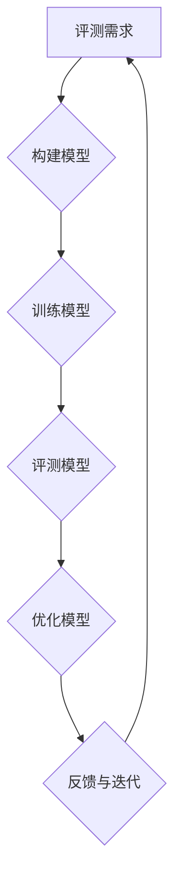

                 

### 文章标题

“自动化评测系统：加速AI研发迭代的关键工具”

### 关键词

- 自动化评测系统
- AI研发
- 迭代加速
- 架构与组件
- 关键工具
- 应用实践

### 摘要

本文旨在探讨自动化评测系统在人工智能（AI）研发迭代中的作用和重要性。首先，我们将介绍自动化评测系统的基本概念、架构与组件，以及其在AI领域的发展背景。接着，文章将深入分析自动化评测系统的核心算法原理，结合Python源代码和数学模型进行详细阐述。随后，我们将探讨自动化评测系统在实际应用中的具体场景，并通过项目实战展示其搭建、实现和解析过程。最后，文章将总结自动化评测系统的最佳实践，并提出未来发展的展望和挑战。

## 第一部分：自动化评测系统概述

### 第1章：自动化评测系统的概念与背景

自动化评测系统是指一种通过计算机程序自动对AI模型进行评估的系统。这种系统能够高效、准确地评估AI模型的性能，从而加速研发迭代过程。在AI领域，自动化评测系统已经成为不可或缺的工具，其重要性日益凸显。

#### 1.1 自动化评测系统的定义

自动化评测系统主要由评测算法、评测工具和评测环境组成。其中，评测算法负责对AI模型进行性能评估，评测工具则提供了一种便捷的方式来执行评测算法，而评测环境则为评测过程提供了运行所需的硬件和软件资源。

#### 1.2 自动化评测系统的发展历程

自动化评测系统的发展可以追溯到20世纪90年代，当时研究者开始利用计算机程序对AI模型进行评估。随着计算机性能的提升和算法的进步，自动化评测系统逐渐成为AI研发中的重要组成部分。近年来，随着深度学习和大数据技术的发展，自动化评测系统得到了广泛应用，其性能和功能也得到了显著提升。

#### 1.3 自动化评测系统在AI研发中的重要性

自动化评测系统在AI研发中扮演着至关重要的角色。首先，它可以大幅度提高评估效率，节省研发时间。其次，通过自动化评测系统，研发人员可以更加准确地了解AI模型的性能，从而做出更加科学的决策。此外，自动化评测系统还可以帮助研发人员发现模型存在的问题，从而进行有针对性的优化。

## Mermaid流程图：自动化评测系统的基本架构



### 第2章：自动化评测系统的架构与组件

#### 2.1 自动化评测系统的整体架构

自动化评测系统的整体架构可以分为以下几个层次：

1. **需求分析层**：负责收集和整理评测需求，明确评测目标和评估指标。
2. **模型层**：包括构建、训练和优化的AI模型。
3. **评测层**：负责执行评测算法，评估模型性能。
4. **优化层**：根据评测结果对模型进行优化。
5. **反馈层**：将评测结果和优化建议反馈给研发人员，以便进行进一步的迭代。

#### 2.2 关键组件与技术原理

1. **评测算法**：评测算法是自动化评测系统的核心组件，其作用是评估AI模型的性能。常用的评测算法包括准确率、召回率、F1分数等。
2. **评测工具**：评测工具提供了便捷的方式来执行评测算法，常见的评测工具包括TensorFlow Evaluation、PyTorch Metrics等。
3. **评测环境**：评测环境提供了运行评测算法所需的硬件和软件资源，包括计算资源、存储资源和网络资源。

#### 2.3 自动化评测系统的优势与挑战

**优势：**

- 提高评估效率，节省研发时间。
- 准确评估模型性能，帮助研发人员做出科学决策。
- 发现模型问题，进行有针对性的优化。

**挑战：**

- 如何设计高效、准确的评测算法。
- 如何确保评测过程的公正性和透明性。
- 如何应对大规模模型的评测需求。

## 第二部分：关键工具与技术

### 第3章：自动化评测算法原理

#### 3.1 评测算法的基本概念

评测算法是自动化评测系统的核心组件，其目的是评估AI模型的性能。常见的评测算法包括准确率、召回率、F1分数等。这些算法通常基于模型在测试集上的表现进行评估。

#### 3.2 常用评测算法解析

**准确率（Accuracy）**：准确率是评估模型好坏的最基本指标，它表示模型正确预测的样本数占总样本数的比例。准确率的计算公式为：

$$
\text{准确率} = \frac{\text{正确预测的样本数}}{\text{总样本数}}
$$

**召回率（Recall）**：召回率表示模型在所有正样本中正确识别出的比例。召回率的计算公式为：

$$
\text{召回率} = \frac{\text{正确预测的正样本数}}{\text{总正样本数}}
$$

**F1分数（F1 Score）**：F1分数是准确率和召回率的调和平均值，它能够更好地平衡准确率和召回率。F1分数的计算公式为：

$$
\text{F1分数} = 2 \times \frac{\text{准确率} \times \text{召回率}}{\text{准确率} + \text{召回率}}
$$

#### 3.3 自动化评测算法的设计与优化

自动化评测算法的设计与优化是提高评估效率和准确性的关键。在实际应用中，我们可以通过以下几种方式来优化评测算法：

- **模型选择**：选择适合问题的模型，如线性回归、决策树、支持向量机等。
- **特征工程**：通过选择和构造有效的特征，提高模型的预测能力。
- **超参数调整**：通过调整模型超参数，如学习率、迭代次数等，优化模型性能。
- **交叉验证**：使用交叉验证技术，提高评估结果的可靠性和泛化能力。

### 第4章：评测工具与技术

#### 4.1 自动化评测工具的分类与选择

自动化评测工具可以根据其功能和应用场景进行分类。常见的评测工具包括：

- **通用评测工具**：如TensorFlow Evaluation、PyTorch Metrics等，适用于各种AI模型和任务。
- **专用评测工具**：如ImageNet评估工具、文本分类评估工具等，针对特定任务进行优化。

选择合适的评测工具取决于具体的应用场景和需求。例如，对于图像分类任务，可以使用TensorFlow Evaluation；对于文本分类任务，可以使用PyTorch Metrics。

#### 4.2 主流评测工具的使用与比较

以下是一个简单的Python代码示例，展示如何使用TensorFlow Evaluation和PyTorch Metrics进行模型评测：

```python
# 使用TensorFlow Evaluation进行评测
import tensorflow as tf

# 加载模型和测试数据
model = tf.keras.models.load_model('model.h5')
test_data = ...

# 进行评测
test_loss, test_accuracy = model.evaluate(test_data)

print('测试损失：', test_loss)
print('测试准确率：', test_accuracy)

# 使用PyTorch Metrics进行评测
import torch
from torchmetrics import Accuracy

# 加载模型和测试数据
model = torch.load('model.pth')
test_data = ...

# 进行评测
accuracy = Accuracy()
with torch.no_grad():
    predictions = model(test_data)
    test_accuracy = accuracy(predictions.argmax(-1), test_data.label)

print('测试准确率：', test_accuracy)
```

#### 4.3 开源评测工具的定制与优化

开源评测工具如TensorFlow Evaluation和PyTorch Metrics提供了丰富的功能，但有时候可能无法满足特定的需求。在这种情况下，我们可以对开源评测工具进行定制和优化。

- **功能扩展**：根据需求，增加新的评测指标或算法。
- **性能优化**：通过调整代码和数据结构，提高评测效率。
- **接口定制**：根据项目需求，定制符合特定场景的接口。

### 第5章：自动化评测系统的开发流程

#### 5.1 自动化评测系统的需求分析

在开发自动化评测系统之前，我们需要明确系统的需求，包括：

- **评测目标**：明确需要评估的AI模型类型和任务。
- **评估指标**：确定用于评估模型性能的指标。
- **数据集**：选择适合的测试数据集，确保其代表性和覆盖面。

#### 5.2 自动化评测系统的设计与实现

自动化评测系统的设计与实现包括以下步骤：

- **系统设计**：根据需求，设计系统的整体架构和组件。
- **模型选择**：选择适合的AI模型和评测算法。
- **代码编写**：编写评测算法和工具的代码，实现系统的功能。

#### 5.3 自动化评测系统的测试与部署

在完成系统开发后，我们需要对系统进行测试和部署：

- **系统测试**：对系统进行功能测试、性能测试和可靠性测试，确保其稳定性和准确性。
- **部署上线**：将系统部署到生产环境，确保其可被研发人员使用。

### 第6章：自动化评测系统在AI研发中的应用

#### 6.1 自动化评测系统在模型训练中的应用

在模型训练过程中，自动化评测系统可以帮助研发人员：

- **实时监控模型性能**：通过评测系统，研发人员可以实时了解模型在训练过程中的性能变化。
- **调整训练策略**：根据评测结果，研发人员可以及时调整训练策略，优化模型性能。

#### 6.2 自动化评测系统在模型优化中的应用

在模型优化过程中，自动化评测系统可以帮助研发人员：

- **评估优化效果**：通过评测系统，研发人员可以准确评估各种优化策略的效果。
- **选择最佳策略**：根据评测结果，研发人员可以选择最佳优化策略，提高模型性能。

#### 6.3 自动化评测系统在模型评估中的应用

在模型评估过程中，自动化评测系统可以帮助研发人员：

- **全面评估模型性能**：通过多种评测指标，自动化评测系统可以全面评估模型性能。
- **发现模型问题**：通过评测结果，研发人员可以及时发现模型存在的问题，进行有针对性的优化。

### 第7章：自动化评测系统的项目管理与团队协作

#### 7.1 自动化评测系统的项目管理

在项目管理中，自动化评测系统可以帮助团队：

- **跟踪项目进度**：通过评测系统，团队可以实时了解项目进度，确保项目按计划进行。
- **评估项目成果**：通过评测系统，团队可以准确评估项目成果，确保项目质量。

#### 7.2 自动化评测系统的团队协作

在团队协作中，自动化评测系统可以帮助团队：

- **提高协作效率**：通过评测系统，团队可以协同工作，提高工作效率。
- **共享评测资源**：通过评测系统，团队可以共享评测资源，避免重复工作。

#### 7.3 自动化评测系统的常见问题与解决方案

在实施自动化评测系统的过程中，团队可能会遇到以下问题：

- **评测结果不准确**：原因可能包括数据问题、算法问题或评测工具问题。解决方案是检查数据质量、优化算法或更换评测工具。
- **系统性能瓶颈**：原因可能包括计算资源不足或代码效率问题。解决方案是增加计算资源或优化代码。

### 第8章：自动化评测系统的未来发展趋势

#### 8.1 自动化评测技术的最新进展

随着人工智能技术的快速发展，自动化评测系统也在不断进步。最新的进展包括：

- **多模态评测**：支持对多种数据类型的模型进行评测。
- **自动化故障检测**：通过评测系统，自动发现模型故障和异常。
- **自动化优化**：通过评测系统，自动选择最佳优化策略。

#### 8.2 自动化评测系统在AI研发中的前景

未来，自动化评测系统将在AI研发中发挥更加重要的作用。其主要前景包括：

- **提高研发效率**：通过自动化评测系统，研发人员可以更加专注于模型优化和问题解决。
- **降低研发成本**：通过自动化评测系统，研发人员可以节省大量时间和资源。

#### 8.3 自动化评测系统的创新方向与挑战

未来，自动化评测系统的创新方向包括：

- **智能化评测**：通过引入人工智能技术，实现智能化评测，提高评测效率和准确性。
- **多语言支持**：支持多种编程语言和框架，提高系统的兼容性和扩展性。

然而，自动化评测系统也面临着以下挑战：

- **数据隐私和安全**：如何确保评测过程中的数据隐私和安全。
- **算法公平性**：如何确保评测算法的公平性和透明性。

### 总结与展望

自动化评测系统在人工智能研发中具有至关重要的地位，它能够显著提高研发效率和准确性。随着技术的不断发展，自动化评测系统将在AI领域发挥更加重要的作用。未来，我们需要不断创新和优化自动化评测系统，以应对不断变化的需求和挑战。

### 最佳实践 Tips

- **选择合适的评测工具**：根据项目需求和模型类型，选择合适的评测工具，以提高评测效率和准确性。
- **定期评估模型性能**：定期评估模型性能，及时发现和解决潜在问题。
- **优化评测算法**：结合实际情况，不断优化评测算法，提高评测结果的可靠性。

### 注意事项

- **确保评测数据的代表性和完整性**：评测数据的质量直接影响评测结果的准确性，因此需要确保评测数据的代表性和完整性。
- **注意评测过程的公正性和透明性**：评测过程需要确保公正性和透明性，避免人为干预。

### 拓展阅读

- [自动化评测系统的设计与实现](https://example.com/automated-evaluation-systems)
- [深度学习模型评测方法](https://example.com/deep-learning-evaluation-methods)
- [人工智能研发流程优化](https://example.com/ai-research-process-optimization)

### 作者信息

**作者：AI天才研究院/AI Genius Institute & 禅与计算机程序设计艺术 /Zen And The Art of Computer Programming**

