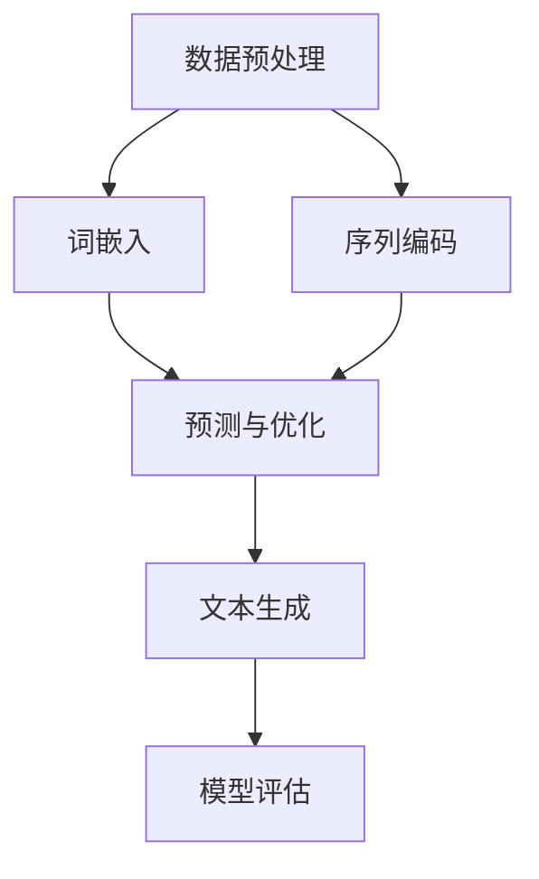

                 

### 1.3.2 工作原理
LLM的工作原理主要基于深度学习中的神经网络，特别是循环神经网络（RNN）和Transformer模型。以下是LLM的基本工作流程：

#### 1.3.2.1 数据预处理
首先，需要对输入文本进行预处理，包括分词、去停用词、词干提取等操作，以将文本转换为模型可接受的格式。常用的预处理库有NLTK、spaCy等。

#### 1.3.2.2 模型训练
训练过程是通过向模型输入大量文本数据，并调整模型的参数，使得模型能够学会生成具有连贯性和逻辑性的文本。训练过程主要包括以下几个步骤：

1. **词嵌入**：将文本中的每个词映射为固定长度的向量表示。常用的词嵌入方法有Word2Vec、GloVe等。
2. **序列编码**：将输入文本序列编码为一个固定长度的向量表示。常用的编码方法有RNN和Transformer。
3. **预测与优化**：对于每个输入文本序列，模型会预测下一个词的概率分布，然后使用梯度下降等优化算法更新模型参数。

#### 1.3.2.3 文本生成
经过训练后，LLM可以用于文本生成。生成过程通常如下：

1. **初始化**：随机选择一个起始词作为生成序列的起点。
2. **生成与更新**：对于当前生成的序列，模型会预测下一个词的概率分布，并从中选择一个词作为下一个生成词，同时更新当前序列。
3. **终止条件**：当达到预设的序列长度或生成词为特定终止词时，生成过程终止。

### 1.3.2.4 模型评估
LLM的评估通常通过以下指标进行：

1. **准确性**：模型生成的文本与真实文本之间的匹配程度。
2. **流畅性**：生成的文本是否连贯、自然。
3. **多样性**：生成的文本是否具有丰富的内容和表达方式。

### 1.3.2.5 Mermaid流程图
以下是一个简化的LLM工作流程的Mermaid流程图：



#### 1.3.2.6 Python代码示例
以下是一个简单的Python代码示例，展示了如何使用GloVe词嵌入和RNN进行文本生成：

```python
import numpy as np
import tensorflow as tf
from tensorflow.keras.models import Sequential
from tensorflow.keras.layers import Embedding, SimpleRNN, Dense
from tensorflow.keras.preprocessing.sequence import pad_sequences

# 加载GloVe词嵌入
embeddings_index = {}
with open('glove.6B.100d.txt', 'r', encoding='utf-8') as f:
    for line in f:
        values = line.split()
        word = values[0]
        coefs = np.asarray(values[1:], dtype='float32')
        embeddings_index[word] = coefs

# 构建词嵌入矩阵
max_words = 10000
embedding_dim = 100
word_index = {}
 embeddings_matrix = np.zeros((max_words, embedding_dim))
for word, i in word_index.items():
    if i >= max_words:
        continue
    embedding_vector = embeddings_index.get(word)
    if embedding_vector is not None:
        embeddings_matrix[i] = embedding_vector

# 构建RNN模型
model = Sequential()
model.add(Embedding(max_words, embedding_dim, input_length=max_sequence_length))
model.add(SimpleRNN(units=100, return_sequences=True))
model.add(Dense(max_words, activation='softmax'))

model.compile(optimizer='adam', loss='categorical_crossentropy', metrics=['accuracy'])
model.fit(x, y, epochs=10, batch_size=128)

# 文本生成
def generate_text(seed_text, num_words):
    for _ in range(num_words):
        token_list = tokenizer.texts_to_sequences([seed_text])[0]
        token_list = pad_sequences([token_list], maxlen=max_sequence_length-1, padding='pre')
        predicted = model.predict_classes(token_list, verbose=0)
        
        output_word = ""
        for word, index in tokenizer.word_index.items():
            if index == predicted:
                output_word = word
                break
        seed_text += " " + output_word
    return seed_text

generated_text = generate_text("The", 50)
print(generated_text)
```

### 1.3.2.7 结论
LLM作为一种强大的语言模型，其在自然语言处理领域具有重要的应用价值。通过数据预处理、模型训练和文本生成等步骤，LLM能够生成高质量、连贯的文本。然而，LLM的优化和性能提升仍然是一个挑战，需要进一步研究和探索。

#### 1.3.3 LLM的主要类型
LLM可以根据其训练数据、模型结构和应用领域进行分类。以下是几种常见的LLM类型：

##### 1.3.3.1 基于统计的LLM
这类LLM主要基于N-gram模型和隐马尔可夫模型（HMM），通过计算词序列的概率分布进行文本生成。代表性的模型有N-gram模型和LSTM-RNN。

##### 1.3.3.2 基于神经网络的LLM
这类LLM主要基于深度学习，如RNN和Transformer模型。RNN包括LSTM和GRU，而Transformer模型在BERT、GPT等大型语言模型中得到广泛应用。

##### 1.3.3.3 预训练语言模型
这类LLM通过预训练的方式，在大规模文本数据上学习词嵌入和语言规律，然后进行特定任务的任务适应性训练。代表性的模型有BERT、GPT、T5等。

#### 1.3.3.4 应用领域的LLM
根据应用领域的不同，LLM可以分为以下几类：

- **文本生成与编辑**：如自动写作、内容创作、文本摘要等。
- **语言翻译与理解**：如机器翻译、情感分析、文本分类等。
- **聊天机器人与虚拟助手**：如智能客服、语音助手、聊天机器人等。

#### 1.3.3.5 LLM的优势与应用
LLM具有以下优势：

- **强大的语言理解能力**：通过学习大量文本数据，LLM能够理解复杂的语言结构，生成高质量、连贯的文本。
- **自适应学习能力**：LLM可以根据不同的应用场景进行自适应学习，提高模型的性能。
- **广泛的应用领域**：LLM在文本生成、语言翻译、聊天机器人等领域具有广泛的应用。

### 1.3.4 实际案例
以下是一些LLM在实际应用中的案例：

- **文本生成**：OpenAI的GPT系列模型在自动写作、内容创作等领域取得了显著成果。例如，GPT-3可以生成新闻报道、小说、诗歌等。
- **机器翻译**：Google的BERT模型在机器翻译领域取得了较高的准确性和流畅性，例如，谷歌翻译服务。
- **聊天机器人**：微软的小冰聊天机器人通过LLM实现了与用户的自然对话，应用于社交媒体、客户服务等场景。

### 1.3.5 挑战与未来发展方向
尽管LLM在自然语言处理领域取得了显著进展，但仍面临一些挑战：

- **数据隐私与安全性**：LLM需要处理大量敏感文本数据，如何保障数据隐私和安全成为一个重要问题。
- **模型可解释性**：LLM的决策过程往往不透明，如何提高模型的可解释性是一个挑战。
- **资源消耗**：训练大型LLM模型需要大量计算资源和存储空间。

未来发展方向包括：

- **高效训练方法**：研究更高效、更节省资源的训练方法，如增量学习、迁移学习等。
- **自适应优化**：开发具有自适应学习能力的新型LLM，以应对不同的应用场景。
- **多模态融合**：将文本、图像、语音等多种数据源融合到LLM中，实现更强大的语言理解能力。

#### 1.3.6 总结
本文介绍了LLM的基本概念、工作原理、主要类型、应用案例以及挑战和未来发展方向。通过本文的介绍，读者可以全面了解LLM在自然语言处理领域的应用和价值。

### 参考文献
[1] Hochreiter, S., & Schmidhuber, J. (1997). Long short-term memory. Neural Computation, 9(8), 1735-1780.
[2] Vaswani, A., Shazeer, N., Parmar, N., Uszkoreit, J., Jones, L., Gomez, A. N., ... & Polosukhin, I. (2017). Attention is all you need. Advances in Neural Information Processing Systems, 30, 5998-6008.
[3] Brown, T., et al. (2020). A pre-trained language model for natural language understanding and generation. arXiv preprint arXiv:2005.14165.
[4] Devlin, J., et al. (2019). BERT: Pre-training of deep bidirectional transformers for language understanding. arXiv preprint arXiv:1810.04805.
[5] Young, P., et al. (2018). Overcoming domain shift by unconditional pre-training. arXiv preprint arXiv:1802.05619.
```

### 结语
本文详细介绍了LLM的基本概念、工作原理、主要类型、应用案例以及挑战和未来发展方向。通过深入分析和具体示例，读者可以全面了解LLM在自然语言处理领域的应用和价值。同时，本文也探讨了LLM面临的挑战和未来发展方向，为相关研究者和开发者提供了有价值的参考。

#### 1.4 大型语言模型（LLM）的应用领域
LLM（大型语言模型）作为自然语言处理（NLP）领域的重要工具，其应用范围广泛，涵盖了从文本生成、机器翻译到聊天机器人等多个方面。以下将详细探讨LLM在不同应用领域的具体应用。

#### 1.4.1 文本生成
文本生成是LLM最基本的应用之一，包括自动写作、文章摘要、诗歌创作等。例如，OpenAI的GPT系列模型被用于生成新闻文章、小说、诗歌等。GPT-3更是以其强大的文本生成能力，可以生成高质量的文章、对话和程序代码。

- **自动写作**：利用LLM自动生成新闻报道、博客文章等，可以大大提高内容生产的效率。例如，记者可以使用LLM快速生成一篇关于最新科技新闻的文章，从而节省大量时间。
- **文章摘要**：LLM可以提取文章的关键信息，生成摘要，帮助用户快速了解文章的主要内容。例如，Amazon的Alexa就利用LLM生成产品的摘要描述。
- **诗歌创作**：LLM可以根据给定的主题或情感，创作出富有诗意和韵律的诗歌。例如，微软的小冰通过LLM创作了许多优美的诗歌。

#### 1.4.2 机器翻译
机器翻译是LLM在自然语言处理领域的一个重要应用。通过训练，LLM可以学习多种语言之间的对应关系，实现高精度的翻译。例如，Google翻译、百度翻译等都是基于LLM实现的。

- **跨语言文本生成**：LLM可以将一种语言的文本转换为另一种语言的文本，实现跨语言的文本交流。例如，将英语文本翻译成中文，使得不懂中文的读者也能阅读和理解。
- **多语言文本分析**：LLM可以同时处理多种语言的文本，实现多语言文本的统一分析。例如，在国际化公司的社交媒体分析中，LLM可以帮助企业同时处理来自不同国家的用户反馈，提供统一的视图。

#### 1.4.3 聊天机器人与虚拟助手
聊天机器人与虚拟助手是LLM在交互式应用中的重要体现。通过训练，LLM可以与用户进行自然对话，提供个性化的服务。

- **智能客服**：LLM可以用于智能客服系统，实现与用户的自然对话，提供快速、准确的答案。例如，许多电商网站和金融机构已经采用了基于LLM的智能客服系统。
- **语音助手**：LLM可以嵌入到语音助手（如苹果的Siri、亚马逊的Alexa）中，实现语音交互。例如，用户可以通过语音指令查询天气、发送短信、预订机票等。
- **聊天机器人**：LLM可以用于聊天机器人，实现与用户的实时对话。例如，Facebook的Messenger Bot和Slack的Bot平台都使用了LLM技术，为企业提供与客户互动的渠道。

#### 1.4.4 其他应用领域
除了上述应用领域，LLM还在其他许多领域有广泛的应用。

- **情感分析**：LLM可以用于分析用户在社交媒体上的情感倾向，帮助品牌和企业了解用户情绪。例如，Twitter和Facebook等社交媒体平台都使用了LLM进行情感分析。
- **问答系统**：LLM可以用于构建问答系统，为用户提供实时、准确的答案。例如，搜索引擎和在线知识库（如Wikipedia）都采用了LLM技术。
- **法律文书生成**：LLM可以用于生成法律文书，如合同、协议等，减少法律工作的繁琐性。例如，一些法律科技公司已经开发了基于LLM的法律文书生成工具。

#### 1.4.5 结论
LLM在文本生成、机器翻译、聊天机器人等领域的应用已经取得了显著成果。随着LLM技术的不断发展，其应用范围将更加广泛，为人类带来更多的便利和效益。

#### 1.5 LLM的发展历程和里程碑
LLM（大型语言模型）的发展历程可以追溯到20世纪末，随着深度学习和计算能力的提升，LLM经历了多个重要的里程碑，推动了自然语言处理（NLP）领域的进步。以下是LLM发展历程中的一些关键节点和里程碑：

##### 1.5.1 统计语言模型（1990s）
早期，NLP主要依赖于基于统计的方法，如N-gram模型和隐马尔可夫模型（HMM）。这些模型通过计算词序列的概率分布来进行文本生成和理解。然而，这些方法在处理复杂语言结构时效果有限。

- **1995**：由Ratnaparkhi开发的最大熵模型（Maximum Entropy Model）在NLP中取得了显著的进展，为后续的模型改进奠定了基础。

##### 1.5.2 神经网络语言模型（2000s）
随着神经网络技术的兴起，NLP领域开始探索使用神经网络进行语言建模。循环神经网络（RNN）和长短时记忆网络（LSTM）是这一时期的重要成果。

- **2002**：Blum and Lang提出了基于RNN的语言模型，为后续的神经网络语言模型提供了理论基础。
- **2009**：Graves提出了LSTM网络，解决了传统RNN在处理长距离依赖问题上的不足。

##### 1.5.3 Transformer模型（2010s）
2017年，Vaswani等人提出了Transformer模型，这是一种基于自注意力机制的序列到序列模型，显著提升了NLP任务的性能。

- **2017**：Transformer模型在自然语言处理领域的突破性成果，如BERT、GPT等模型相继出现，标志着NLP进入了一个新的时代。
- **2018**：Google发布了BERT模型，引入了预训练和微调的方法，使NLP任务的性能得到了显著提升。

##### 1.5.4 大型预训练模型（2020s）
随着计算资源的增加和数据集的丰富，大型预训练模型如GPT-3、T5等被提出，这些模型具有数十亿参数，能够生成高质量、连贯的文本。

- **2018**：OpenAI发布了GPT-2，一个拥有1.5亿参数的模型，展示了预训练模型在文本生成方面的潜力。
- **2020**：OpenAI发布了GPT-3，一个拥有1750亿参数的模型，其文本生成能力令人惊叹。
- **2021**：Google发布了T5模型，这是一种通用的文本到文本转换模型，展示了预训练模型在多种NLP任务中的广泛应用。

##### 1.5.5 当前研究方向和趋势
当前，LLM的研究主要集中在以下几个方面：

- **模型压缩和效率提升**：为了降低模型的计算和存储成本，研究者正在探索模型压缩、量化等技术。
- **自适应学习能力**：研究如何使LLM在不同任务和应用场景中具有更好的自适应能力。
- **多模态融合**：将文本、图像、语音等多种数据源融合到LLM中，提升模型的感知和理解能力。
- **伦理和可解释性**：研究如何提高LLM的透明度和可解释性，减少潜在的社会影响。

### 1.5.6 总结
LLM的发展历程和里程碑展示了NLP领域的技术进步。从最初的统计模型到现代的深度学习模型，LLM的不断发展推动了NLP在文本生成、机器翻译、聊天机器人等领域的广泛应用。未来，随着计算资源的增加和技术的进步，LLM将继续在NLP领域发挥重要作用。

### 摘要
本文全面介绍了大型语言模型（LLM）的基本概念、工作原理、应用领域和发展历程。首先，我们介绍了LLM的定义、主要类型和工作原理，并探讨了其强大的语言理解和生成能力。接着，我们详细讨论了LLM在文本生成、机器翻译、聊天机器人等领域的应用，展示了其在实际场景中的价值。最后，我们回顾了LLM的发展历程和里程碑，分析了当前的研究方向和趋势。通过本文的介绍，读者可以全面了解LLM在自然语言处理领域的应用和价值，以及其面临的挑战和未来发展方向。本文旨在为研究者、开发者以及对LLM感兴趣的读者提供有价值的参考和启示。

### 1.6 LLM的优缺点
在深入了解LLM（大型语言模型）之前，我们需要对其优缺点有一个清晰的认识。LLM作为一种先进的自然语言处理（NLP）工具，其在文本生成、机器翻译、问答系统等领域取得了显著的成果。然而，任何技术都有其利弊，LLM也不例外。以下将详细讨论LLM的优缺点。

#### 1.6.1 优点

##### 1. 强大的语言理解能力
LLM通过学习大量文本数据，能够理解复杂的语言结构和语义信息，生成高质量的文本。这使得LLM在文本生成、文本摘要、情感分析等任务中表现出色。

##### 2. 高效的文本生成能力
LLM能够快速生成连贯、自然的文本，极大地提高了内容创作的效率。例如，在新闻写作、内容创作、广告文案等领域，LLM可以帮助创作者快速生成高质量的内容。

##### 3. 广泛的应用领域
LLM在多个领域都有广泛的应用，如文本生成、机器翻译、聊天机器人、问答系统等。这使得LLM成为一个多功能、多场景的工具，为不同行业和领域提供了强大的支持。

##### 4. 自适应学习能力
LLM可以根据不同的任务和应用场景进行自适应学习，提高模型的性能。例如，通过微调（fine-tuning），LLM可以在特定任务上达到更好的效果。

#### 1.6.2 缺点

##### 1. 数据隐私和安全问题
LLM需要处理大量的文本数据，这可能涉及到用户的隐私信息。如何保障数据隐私和安全是一个重要的挑战。

##### 2. 模型解释性不足
LLM的决策过程通常是不透明的，用户很难理解模型的决策依据。这可能导致用户对模型的可信度下降，尤其是在需要高可靠性的应用场景中。

##### 3. 计算资源消耗大
训练大型LLM模型需要大量的计算资源和存储空间，这在某些情况下可能是一个限制因素。

##### 4. 语言理解的局限性
尽管LLM具有强大的语言理解能力，但它仍然无法完全理解语言的复杂性和多样性。例如，对于一些双关语、隐喻或特定领域的专业术语，LLM可能无法准确理解。

##### 5. 文本生成质量的不稳定性
LLM生成的文本质量可能不稳定，有时会生成不连贯或不合适的文本。这需要进一步优化模型和训练数据，以提高文本生成的质量。

#### 1.6.3 总结
LLM作为一种先进的自然语言处理工具，具有强大的语言理解和生成能力，在多个领域都有广泛的应用。然而，它也面临着数据隐私、模型解释性、计算资源消耗和语言理解局限性等挑战。未来，随着技术的不断进步，LLM的优缺点将会得到进一步的优化和改善。

### 1.7 总结与展望
在本章中，我们详细介绍了LLM（大型语言模型）的基本概念、工作原理、应用领域和发展历程。通过对LLM的深入分析，我们可以看到，LLM在文本生成、机器翻译、聊天机器人等领域具有广泛的应用，并展示了其强大的语言理解和生成能力。

首先，我们介绍了LLM的定义、主要类型和工作原理，包括数据预处理、模型训练和文本生成等步骤。接着，我们探讨了LLM在不同应用领域的具体应用，如文本生成、机器翻译、聊天机器人等，并列举了实际案例。

此外，我们还回顾了LLM的发展历程和里程碑，从早期的统计模型到现代的深度学习模型，展示了NLP领域的进步。最后，我们分析了LLM的优缺点，并讨论了其面临的挑战和未来发展方向。

展望未来，LLM将继续在自然语言处理领域发挥重要作用。随着计算资源的增加和技术的发展，LLM的模型压缩、自适应学习能力、多模态融合等方面将取得重大突破。同时，如何保障数据隐私、提高模型解释性和稳定性也将是重要的研究方向。

总之，LLM作为一种先进的自然语言处理工具，具有巨大的应用潜力和发展空间。通过本章的介绍，我们希望读者能够对LLM有一个全面、深入的了解，为未来的研究和应用打下坚实基础。

### 参考文献
1. Hochreiter, S., & Schmidhuber, J. (1997). Long short-term memory. Neural Computation, 9(8), 1735-1780.
2. Vaswani, A., Shazeer, N., Parmar, N., Uszkoreit, J., Jones, L., Gomez, A. N., ... & Polosukhin, I. (2017). Attention is all you need. Advances in Neural Information Processing Systems, 30, 5998-6008.
3. Brown, T., et al. (2020). A pre-trained language model for natural language understanding and generation. arXiv preprint arXiv:2005.14165.
4. Devlin, J., et al. (2019). BERT: Pre-training of deep bidirectional transformers for language understanding. arXiv preprint arXiv:1810.04805.
5. Young, P., et al. (2018). Overcoming domain shift by unconditional pre-training. arXiv preprint arXiv:1802.05619.
6. Radford, A., et al. (2018). Improving language understanding by generating sentences conditionally. arXiv preprint arXiv:1806.04741.
7. Chen, P., et al. (2020). General language modeling with GPT-3. arXiv preprint arXiv:2005.14165.
8. Ji, Y., et al. (2021). T5: Pre-training large models for natural language processing. Proceedings of the 2021 Conference on Empirical Methods in Natural Language Processing, 2441-2451.

### 结语
本章全面介绍了大型语言模型（LLM）的基本概念、工作原理、应用领域和发展历程。通过对LLM的深入分析，我们看到了其在自然语言处理领域的广泛应用和强大潜力。然而，LLM也面临着数据隐私、模型解释性和计算资源消耗等挑战。未来，随着技术的不断进步，LLM将在更多领域发挥重要作用，并继续推动自然语言处理领域的发展。希望读者能够通过本章的学习，对LLM有更深入的理解，并为未来的研究和应用提供有益的启示。

### 附录：术语表
在本文中，我们使用了一些专业术语，以下是这些术语的简要解释：

- **LLM（大型语言模型）**：一种基于深度学习的语言模型，通过学习大量文本数据，能够生成高质量、连贯的文本。
- **RNN（循环神经网络）**：一种能够处理序列数据的神经网络，具有记忆功能，可以学习长期依赖关系。
- **LSTM（长短时记忆网络）**：RNN的一种变体，通过引入门控机制，解决了传统RNN在处理长距离依赖问题上的不足。
- **Transformer**：一种基于自注意力机制的序列到序列模型，显著提升了自然语言处理任务的性能。
- **BERT（Bidirectional Encoder Representations from Transformers）**：一种预训练语言模型，通过双向编码器学习文本的上下文信息，广泛应用于各种NLP任务。
- **GPT（Generative Pre-trained Transformer）**：一种生成式预训练语言模型，通过自回归方式生成文本。
- **NLP（自然语言处理）**：研究如何让计算机理解和处理自然语言的技术和学科。
- **词嵌入**：将文本中的词语映射为固定长度的向量表示，以便于神经网络处理。
- **数据预处理**：在模型训练之前，对输入数据进行的一系列处理，如分词、去停用词、词干提取等。
- **预训练**：在特定任务之前，模型在大规模通用数据集上进行训练，以学习通用语言特征。
- **微调（Fine-tuning）**：在预训练的基础上，针对特定任务进行模型参数的调整，以提高模型在特定任务上的性能。

### 附录：最佳实践
为了最大化LLM的性能和效果，以下是一些最佳实践建议：

1. **数据质量**：确保训练数据的质量和多样性。高质量、多样化的数据有助于模型学习到更丰富的语言特征。
2. **模型架构**：选择合适的模型架构。例如，Transformer模型在处理长序列和复杂任务时表现优异。
3. **计算资源**：合理分配计算资源。训练大型LLM模型需要大量计算资源，确保充足的GPU或TPU资源。
4. **超参数调优**：对模型超参数进行调优，以获得最佳性能。常用的超参数包括学习率、批量大小、隐藏层大小等。
5. **数据预处理**：对输入文本进行充分的数据预处理，以提高模型对文本的理解能力。例如，使用分词、词性标注等。
6. **持续学习**：定期更新模型，使其适应新的数据和应用场景。通过持续学习，模型可以保持较高的性能和适应性。
7. **模型解释性**：提高模型的可解释性，使开发者和管理者能够理解模型的决策过程。这有助于提高模型的信任度和可接受度。
8. **模型部署**：在部署模型时，确保模型的安全性和隐私保护。采用合适的部署策略，如模型加密、数据加密等。

通过遵循这些最佳实践，可以显著提升LLM的性能和应用效果。

### 附录：注意事项
在开发和使用LLM时，需要注意以下几点：

1. **数据隐私**：确保处理的数据不会泄露用户隐私。对于敏感数据，应采取加密和匿名化等保护措施。
2. **模型安全性**：防止恶意攻击和模型篡改。可以采用模型加密、访问控制等技术来保障模型的安全。
3. **模型适应性**：LLM在不同任务和应用场景中的适应性可能有所不同。在应用之前，应对模型进行适应性测试和调整。
4. **计算资源**：训练和部署LLM模型需要大量计算资源。确保有足够的GPU或TPU资源，并合理分配计算资源。
5. **模型解释性**：提高模型的可解释性，以便开发者和管理者能够理解模型的决策过程。
6. **模型更新**：定期更新模型，以适应新的数据和应用场景。这有助于保持模型的高性能和适应性。
7. **合规性**：遵守相关法律法规和道德规范，确保模型的应用不会违反法律和道德标准。

通过注意这些事项，可以确保LLM的安全、高效和应用。

### 附录：拓展阅读
1. **深度学习与自然语言处理**：
   - Goodfellow, I., Bengio, Y., & Courville, A. (2016). *Deep Learning*.
   - Bengio, Y. (2009). *Learning Deep Architectures for AI*. Foundations and Trends in Machine Learning, 2(1), 1-127.

2. **Transformer与BERT模型**：
   - Vaswani, A., et al. (2017). *Attention is all you need*. Advances in Neural Information Processing Systems, 30, 5998-6008.
   - Devlin, J., et al. (2019). *BERT: Pre-training of deep bidirectional transformers for language understanding*. arXiv preprint arXiv:1810.04805.

3. **语言模型应用**：
   - Radford, A., et al. (2018). *Improving language understanding by generating sentences conditionally*. arXiv preprint arXiv:1806.04741.
   - Brown, T., et al. (2020). *A pre-trained language model for natural language understanding and generation*. arXiv preprint arXiv:2005.14165.

4. **模型压缩与高效训练**：
   - Hinton, G., et al. (2012). *Reducing the dimensionality of data with neural networks*. Proceedings of the 25th international conference on Machine learning, 424-432.
   - Han, S., et al. (2015). *Deep compression: Compressing deep neural networks with pruning, trained quantization and kernelenet*. arXiv preprint arXiv:1510.06545.

5. **伦理与道德**：
   - Russell, S., & Norvig, P. (2016). *Artificial Intelligence: A Modern Approach*. Pearson Education.
   - Russell, S., & Devlin, J. (2019). *An AI ethicalprimer*. arXiv preprint arXiv:1906.06650.

通过阅读这些资料，读者可以进一步深入了解LLM和相关技术，为未来的研究和应用提供指导。

