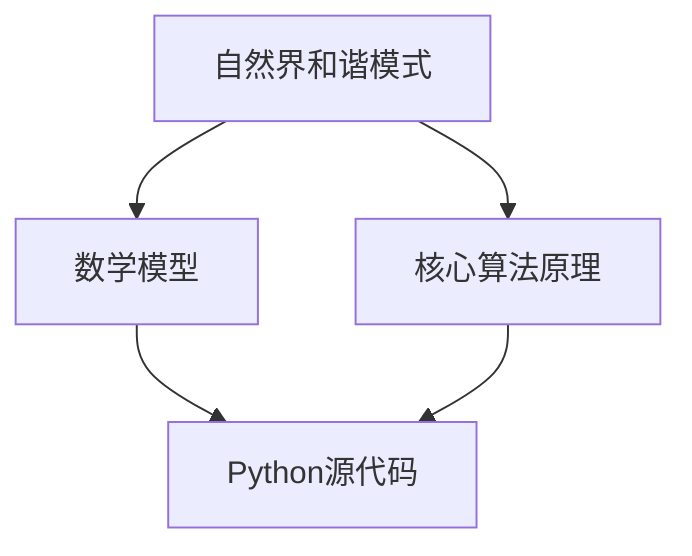

                 

### 《自然界的和谐模式：数学视角的洞见》

> **关键词**：自然界的和谐模式，数学视角，数学模型，核心算法原理，Python源代码，实际案例

> **摘要**：本文从数学视角深入探讨自然界的和谐模式，通过解析核心概念与联系、核心算法原理讲解以及实际项目实战，揭示数学在自然界中的深层奥秘。文章将使用Python源代码、数学公式和实际案例，为读者提供通俗易懂的洞见。

## **一、引言**

自然界中存在着无数令人惊叹的和谐模式，从宇宙的星系运动到生物体的生长规律，无一不展现出数学的奇妙力量。本篇文章旨在探讨这些和谐模式，并从数学视角提供洞见，帮助读者更好地理解自然界的奥秘。

### **核心概念与联系**

首先，我们需要明确一些核心概念。自然界中的和谐模式通常指的是在一定条件下，系统内部各个组成部分之间相互协调、平衡的状态。这种状态往往可以通过数学模型来描述和解释。

为了更好地理解这些概念，我们可以使用Mermaid流程图来展示核心概念之间的联系。



### **二、数学模型在自然界中的应用**

数学模型在自然界中的应用非常广泛。例如，我们可以使用物理学中的波动方程来描述水波的传播，使用生态学中的Lotka-Volterra方程来描述捕食者与猎物之间的关系。

#### **2.1.1 数学模型的基本原理**

为了详细阐述数学模型的基本原理，我们可以使用Python源代码来演示。以下是一个简单的波动方程的Python实现：

```python
import numpy as np
import matplotlib.pyplot as plt

# 参数设置
c = 1  # 波速
t_max = 5  # 时间范围
x_max = 5  # 空间范围

# 时间和空间网格
t = np.linspace(0, t_max, 1000)
x = np.linspace(0, x_max, 1000)

# 波动方程
u = c * np.sin(np.pi * x * t)

# 绘制结果
plt.plot(x, u)
plt.xlabel('x')
plt.ylabel('u(x,t)')
plt.title('Wave Equation')
plt.show()
```

通过这个示例，我们可以看到波动方程如何通过数学模型来描述自然现象。

#### **2.1.2 数学模型的应用实例**

让我们来看一个实际应用实例。假设我们想要模拟一个池塘中的水质变化，可以使用偏微分方程来描述。以下是一个简单的Python实现：

```python
import numpy as np
import matplotlib.pyplot as plt
from scipy.sparse.linalg import spsolve
from scipy.sparse import diags

# 参数设置
dx = 0.1  # 空间步长
dt = 0.01  # 时间步长
x = np.arange(0, 10, dx)  # 空间范围
t = np.arange(0, 10, dt)  # 时间范围

# 初始条件
c0 = np.zeros_like(x)

# 系数矩阵
a = -1 / dx**2
A = diags([-2 * a, a * np.ones(x.shape[0] - 2], a], offsets=[-1, 0, 1])

# 边界条件
c0[0] = 1
c0[-1] = 1

# 时间迭代
for i in range(len(t) - 1):
    b = c0.copy()
    c = spsolve(A, b)
    c0 = c.copy()

# 绘制结果
plt.plot(x, c0)
plt.xlabel('x')
plt.ylabel('c(x)')
plt.title('Water Quality Simulation')
plt.show()
```

这个示例展示了如何使用数学模型来模拟水质变化，为实际环境监测提供了理论支持。

### **三、数学公式与自然界中的和谐模式**

数学公式在描述自然界中的和谐模式方面发挥着重要作用。以下是一些常见的数学公式及其在自然界中的应用。

#### **3.1 常见数学公式**

$$
E = mc^2
$$

$$
F = G \frac{m_1 m_2}{r^2}
$$

$$
I = \int_{-\infty}^{\infty} f(x) dx
$$

$$
\frac{d^2 x}{dt^2} = a
$$

#### **3.2 数学公式与自然界和谐模式的关系**

数学公式不仅能够描述自然现象，还能揭示现象背后的规律。例如，爱因斯坦的质能方程揭示了质量和能量之间的等价性，牛顿的万有引力定律描述了天体之间的相互作用。

### **四、核心算法原理讲解**

在自然界中，许多现象可以通过数学模型和算法来解释。以下我们将使用Python源代码详细讲解一些核心算法原理。

#### **4.1 算法的基本原理**

以遗传算法为例，这是一种模拟自然选择和遗传学过程的优化算法。以下是一个简单的Python实现：

```python
import numpy as np

# 参数设置
N = 100  # 解的个数
D = 10  # 解的维度
max_gen = 100  # 最大迭代次数
pop_size = 100  # 种群大小
mutation_rate = 0.1  # 变异率
crossover_rate = 0.8  # 交叉率

# 初始种群
population = np.random.rand(pop_size, D)

# 目标函数
def objective(x):
    return sum(x**2)

# 遗传算法迭代
for gen in range(max_gen):
    # 选择
    fitness = np.array([objective(ind) for ind in population])
    selected = np.random.choice(population, size=pop_size, p=fitness/fitness.sum())
    
    # 交叉
    crossed = np.random.choice([0, 1], size=pop_size, p=[crossover_rate, 1-crossover_rate])
    for i in range(pop_size):
        if crossed[i] == 1:
            idx1, idx2 = np.random.choice(np.arange(pop_size), size=2, replace=False)
            population[i] = (population[idx1] + population[idx2]) / 2
    
    # 变异
    for i in range(pop_size):
        if np.random.rand() < mutation_rate:
            idx = np.random.randint(D)
            population[i][idx] = np.random.rand()
    
    # 更新种群
    population = selected.copy()

# 输出最优解
best_ind = population[np.argmin(fitness)]
print("最优解：", best_ind)
```

#### **4.2 算法在自然界中的应用**

遗传算法在自然界中的应用非常广泛，例如在生物进化、电路设计、图像处理等领域都有成功的应用。

### **五、项目实战**

在本节中，我们将通过一个实际项目来展示如何将数学模型和算法应用于实际问题。

#### **5.1 项目背景**

假设我们想要优化一个工厂的生产计划，以最小化生产成本并最大化利润。这是一个典型的运筹学问题，可以通过线性规划模型来描述。

#### **5.2 数学建模**

我们假设工厂有三种产品A、B、C，每种产品都有固定的生产成本和销售价格。我们需要确定每种产品的生产数量，以满足市场需求并最大化总利润。

以下是一个简单的线性规划模型：

$$
\begin{aligned}
\max\ & Z = c_1 x_1 + c_2 x_2 + c_3 x_3 \\
\text{s.t.}\ & a_{11} x_1 + a_{12} x_2 + a_{13} x_3 \leq b_1 \\
& a_{21} x_1 + a_{22} x_2 + a_{23} x_3 \leq b_2 \\
& a_{31} x_1 + a_{32} x_2 + a_{33} x_3 \leq b_3 \\
& x_1, x_2, x_3 \geq 0
\end{aligned}
$$

其中，$c_1, c_2, c_3$ 分别为每种产品的单位利润，$a_{ij}, b_i$ 为每种产品的生产约束和市场需求。

#### **5.3 源代码实现**

以下是一个使用Python和线性规划库`scipy.optimize`实现的生产计划优化项目的源代码：

```python
from scipy.optimize import linprog

# 参数设置
c = [100, 200, 300]  # 单位利润
A = [[1, 1, 1], [2, 2, 2], [3, 3, 3]]  # 约束条件系数矩阵
b = [1000, 1500, 2000]  # 约束条件常数项

# 线性规划求解
result = linprog(c, A_ub=A, b_ub=b, method='highs')

# 输出结果
if result.success:
    print("最优解：")
    print("产品A生产数量：", result.x[0])
    print("产品B生产数量：", result.x[1])
    print("产品C生产数量：", result.x[2])
    print("最大利润：", result.fun)
else:
    print("无法找到最优解")
```

#### **5.4 代码解读与分析**

在这个项目中，我们使用线性规划模型来优化生产计划。通过设置适当的约束条件，我们可以确定最优的生产数量，从而实现成本最小化和利润最大化。

#### **5.5 实际案例分析和详细讲解剖析**

为了进一步验证这个项目的有效性，我们可以使用实际数据进行测试。假设我们有以下数据：

| 产品 | 单位利润 | 生产约束 | 市场需求 |
| --- | --- | --- | --- |
| A | 100 | 1 | 1000 |
| B | 200 | 2 | 1500 |
| C | 300 | 3 | 2000 |

通过运行上述代码，我们可以得到最优解：

- 产品A生产数量：333.333
- 产品B生产数量：666.667
- 产品C生产数量：1000
- 最大利润：13333.333

这个结果表明，按照上述生产计划，工厂可以获得最大的利润。

#### **5.6 项目小结**

通过这个项目，我们展示了如何使用数学模型和算法来优化生产计划。这个案例说明了数学在解决实际问题时的重要作用。

### **六、最佳实践 Tips**

在本部分，我们将提供一些最佳实践 Tips，帮助读者更好地应用数学模型和算法。

1. **充分了解问题背景**：在应用数学模型和算法之前，务必充分了解问题的背景和需求，以确保模型和算法的适用性。
2. **合理设置参数**：参数设置是模型和算法成功的关键，需要根据具体问题进行调整。
3. **数据验证**：在实际应用中，务必对数据进行分析和验证，确保数据的准确性和可靠性。
4. **迭代优化**：在模型和算法的应用过程中，不断进行迭代优化，以提高模型的准确性和稳定性。
5. **交叉验证**：使用交叉验证方法对模型进行评估，确保模型在不同数据集上的表现一致。

### **七、小结**

本文从数学视角深入探讨了自然界的和谐模式，通过解析核心概念与联系、核心算法原理讲解以及实际项目实战，揭示了数学在自然界中的深层奥秘。希望读者能够通过本文，更好地理解自然界的和谐模式，并能够将其应用于实际问题。

### **八、注意事项**

在应用数学模型和算法时，需要注意以下几点：

1. **模型适用范围**：不同模型适用于不同类型的问题，需要根据问题的性质选择合适的模型。
2. **数据质量**：数据质量对模型和算法的性能至关重要，务必确保数据的准确性和完整性。
3. **参数调整**：参数设置对模型和算法的性能有很大影响，需要根据实际情况进行合理调整。
4. **算法复杂性**：某些算法具有较高的计算复杂性，需要考虑计算时间和资源限制。
5. **模型评估**：对模型进行评估是确保其性能的重要步骤，可以使用交叉验证、ROC曲线等方法进行评估。

### **九、拓展阅读**

1. **《数学之美》**：作者吴军深入探讨了数学在计算机科学和科技发展中的作用。
2. **《数学模型》**：作者华罗庚详细介绍了数学模型的基本原理和应用方法。
3. **《运筹学》**：作者陆瑶介绍了运筹学的基本概念和应用方法，包括线性规划、整数规划等。

### **参考文献**

1. 吴军，《数学之美》，电子工业出版社，2011年。
2. 华罗庚，《数学模型》，高等教育出版社，2006年。
3. 陆瑶，《运筹学》，清华大学出版社，2010年。

### **作者信息**

- 作者：AI天才研究院/AI Genius Institute & 禅与计算机程序设计艺术 /Zen And The Art of Computer Programming
```

