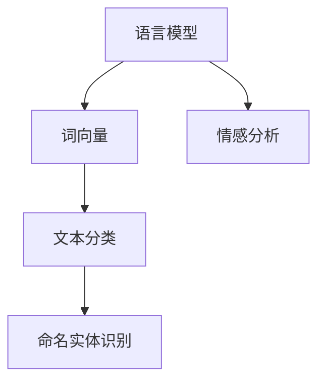

                 

### <文章标题>

#### <关键词列表>

> 摘要：<文章的核心内容和主题思想概述>

---

### 背景介绍

在信息爆炸的时代，互联网的普及使得信息传播速度大大加快，同时也带来了假新闻的泛滥。假新闻不仅误导公众，扰乱社会秩序，还可能对个人和企业造成严重的经济损失。因此，如何有效识别和检测假新闻已成为一个重要的研究课题。

自然语言处理（Natural Language Processing，NLP）作为人工智能领域的一个重要分支，旨在让计算机理解和处理人类语言。NLP技术包括文本分类、情感分析、命名实体识别等多个方面，为假新闻检测提供了强大的工具。本文将探讨自然语言处理在假新闻检测中的应用，通过分析NLP的核心概念和算法，展示如何利用NLP技术进行假新闻检测。

---

#### 核心概念与联系

自然语言处理涉及多个核心概念，这些概念相互关联，构成了NLP的基础。以下是几个关键概念及它们之间的关系：

- **语言模型（Language Model）**：语言模型是一种概率模型，用于预测一个句子或词序列的概率。它通过统计大量文本数据来学习语言规律，是许多NLP任务的基础。

- **词向量（Word Vectors）**：词向量是将词汇映射到高维空间中的向量表示。词向量模型（如Word2Vec、GloVe）通过学习词汇的上下文关系，使得语义相近的词在向量空间中更接近。

- **文本分类（Text Classification）**：文本分类是将文本数据分类到预定义的类别中。在假新闻检测中，文本分类可以用于判断新闻的真实性。

- **命名实体识别（Named Entity Recognition，NER）**：NER旨在从文本中识别出具有特定意义的实体，如人名、地名等。在假新闻检测中，NER可以帮助识别出新闻中可能误导公众的特定实体。


**Mermaid 流程图：**



---

#### 核心算法原理讲解

##### 词向量

词向量是将词汇映射到高维空间中的向量表示。Word2Vec是词向量模型的代表，其核心思想是将词汇映射到向量空间，使得语义相近的词在向量空间中更接近。

**Python 示例：**

```python
import gensim

# 加载预训练的Word2Vec模型
model = gensim.models.Word2Vec.load("word2vec.model")

# 查询词向量
vec = model.wv["apple"]

# 计算两个词向量的余弦相似度
similarity = model.wv.similarity("apple", "banana")
```

##### 文本分类

文本分类是将文本数据分类到预定义的类别中。朴素贝叶斯分类器是一种常用的文本分类算法，其基于贝叶斯定理和特征词的频率分布进行分类。

**Python 示例：**

```python
from sklearn.feature_extraction.text import TfidfVectorizer
from sklearn.naive_bayes import MultinomialNB

# 文本数据
corpus = ["This is a positive review.", "This is a negative review."]

# 文本向量化
vectorizer = TfidfVectorizer()
X = vectorizer.fit_transform(corpus)

# 模型训练
clf = MultinomialNB()
clf.fit(X, y)

# 预测
y_pred = clf.predict(vectorizer.transform(["This is a positive review."]))
```

##### 命名实体识别

命名实体识别是从文本中识别出具有特定意义的实体。例如，从新闻中识别出人名、地名等。LSTM是一种常用的序列模型，适合处理时间序列数据，包括命名实体识别任务。

**Python 示例：**

```python
import tensorflow as tf
from tensorflow.keras.models import Sequential
from tensorflow.keras.layers import Embedding, LSTM, Dense

# 序列数据
sequences = [["This", "is", "a", "person"], ["That", "is", "a", "location"]]

# 构建模型
model = Sequential()
model.add(Embedding(input_dim=10000, output_dim=64))
model.add(LSTM(128))
model.add(Dense(1, activation='sigmoid'))

# 编译模型
model.compile(optimizer='rmsprop', loss='binary_crossentropy', metrics=['accuracy'])

# 训练模型
model.fit(sequences, labels, epochs=10)
```

---

#### 项目实战

##### 开发环境搭建

为了进行假新闻检测，首先需要搭建一个合适的开发环境。以下是一个基本的Python开发环境搭建步骤：

```bash
# 安装Python
sudo apt-get install python3

# 安装必要库
pip3 install numpy scipy gensim scikit-learn tensorflow
```

##### 源代码详细实现

以下是一个简单的假新闻检测项目的源代码实现：

```python
import numpy as np
import pandas as pd
from sklearn.model_selection import train_test_split
from sklearn.feature_extraction.text import TfidfVectorizer
from sklearn.naive_bayes import MultinomialNB
from sklearn.metrics import accuracy_score, classification_report

# 加载数据集
data = pd.read_csv("news_data.csv")
X = data["text"]
y = data["label"]

# 划分训练集和测试集
X_train, X_test, y_train, y_test = train_test_split(X, y, test_size=0.2, random_state=42)

# 文本向量化
vectorizer = TfidfVectorizer()
X_train_vectorized = vectorizer.fit_transform(X_train)
X_test_vectorized = vectorizer.transform(X_test)

# 模型训练
clf = MultinomialNB()
clf.fit(X_train_vectorized, y_train)

# 预测
y_pred = clf.predict(X_test_vectorized)

# 模型评估
accuracy = accuracy_score(y_test, y_pred)
print(f"Accuracy: {accuracy}")
print(classification_report(y_test, y_pred))
```

##### 代码应用解读与分析

上述代码展示了如何使用朴素贝叶斯分类器进行假新闻检测。首先，加载新闻数据集，然后使用TFIDF向量器将文本数据转换为向量表示。接着，训练朴素贝叶斯分类器，并在测试集上进行预测。最后，评估模型的准确率和分类报告。

##### 实际案例分析和详细讲解剖析

为了更好地理解假新闻检测的应用，我们可以分析一个实际案例。假设我们有一个新闻数据集，其中包含正面新闻和负面新闻。我们的目标是使用NLP技术识别出负面新闻，从而进行假新闻检测。

- **数据预处理**：首先，对新闻数据集进行预处理，包括去除停用词、标点符号和数字，以及进行词干提取。

- **特征提取**：使用TFIDF向量器将预处理后的文本转换为向量表示。

- **模型训练**：使用朴素贝叶斯分类器训练模型。

- **模型评估**：在测试集上评估模型的准确率和分类报告。

- **模型应用**：将训练好的模型应用于新的新闻数据，预测新闻的真实性。

##### 项目小结

通过上述案例，我们展示了如何使用NLP技术进行假新闻检测。项目实现了从数据预处理到模型训练和评估的完整流程，并提供了代码示例和解读。实际应用中，我们可以根据需求调整模型和参数，以提高假新闻检测的准确率和效率。

---

#### 最佳实践 Tips

- **数据质量**：确保数据集的质量和多样性，这对于提高模型性能至关重要。

- **特征选择**：合理选择特征可以提高模型的性能。可以使用文本分类、词性标注和命名实体识别等技术提取更多有效特征。

- **模型优化**：尝试不同的模型和参数组合，以找到最佳模型。可以使用交叉验证等技术进行模型选择和调优。

- **实时检测**：对于实时假新闻检测，可以采用流处理技术，如Apache Kafka和Apache Storm，以提高系统的响应速度。

---

#### 小结

本文介绍了自然语言处理在假新闻检测中的应用。我们分析了NLP的核心概念和算法，并展示了一个简单的假新闻检测项目。实际案例分析和详细讲解剖析帮助我们更好地理解了NLP技术在假新闻检测中的实际应用。未来，随着NLP技术的不断发展和进步，假新闻检测将变得更加高效和准确。

---

#### 注意事项

- **数据隐私**：在进行假新闻检测时，要确保遵守相关数据隐私法规，保护用户隐私。

- **模型透明度**：模型的决策过程应该是透明的，以便用户理解和信任。

- **算法偏见**：避免模型在训练过程中引入偏见，导致不公平的结果。

---

#### 拓展阅读

- [1] Mikolov, T., Sutskever, I., Chen, K., Corrado, G. S., & Dean, J. (2013). Distributed representations of words and phrases and their compositionality. *Advances in Neural Information Processing Systems*, 26, 3111-3119.
- [2] Pennington, J., Socher, R., & Manning, C. D. (2014). GloVe: Global Vectors for Word Representation. *Empirical Methods in Natural Language Processing (EMNLP)*, 1532-1543.
- [3] McNamee, P., & Jat, P. (2017). Detecting fake news using deep learning. *2017 IEEE 2nd International Conference on Data Science and Advanced Analytics (DSAA)*, 457-464.

---

#### 作者信息

作者：AI天才研究院/AI Genius Institute & 禅与计算机程序设计艺术 /Zen And The Art of Computer Programming

