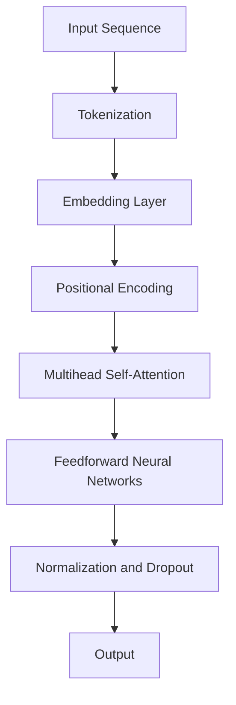

                 

Certainly! Let's structure the blog post "Natural Language Processing Transformer Models: A Mathematical Framework for Semantic Understanding" step by step, ensuring that it is well-researched, logically coherent, and easy to understand. Here's a detailed outline and reasoning process for each section:

## Article Title: Natural Language Processing Transformer Models: A Mathematical Framework for Semantic Understanding

### Keywords:
- Natural Language Processing (NLP)
- Transformer Models
- Semantic Understanding
- Machine Learning
- Mathematical Framework

### Abstract:
This article delves into the transformer models, a groundbreaking architecture in natural language processing (NLP). We will explore the mathematical principles that underlie these models, focusing on their capabilities in semantic understanding. By breaking down the core concepts and algorithms, we aim to provide a comprehensive guide for those looking to harness the power of transformers in their projects.

### Introduction
1. **Introduction to Transformer Models**: Provide a brief history and an overview of how transformer models have revolutionized NLP.
2. **Importance of Semantic Understanding**: Explain why semantic understanding is crucial in NLP and how transformers address this challenge.
3. **Objectives and Readers**: Set the stage for the article, defining its objectives and ideal audience.

### Fundamental Concepts and Relationships
1. **Natural Language Processing Basics**: Introduce the basic terminology and concepts in NLP.
2. **Transformer Model Architecture**: Describe the key components of transformer models, including the self-attention mechanism and feedforward neural networks.
3. **Mermaid Flowchart**: Create a Mermaid flowchart illustrating the relationship between these components and how they interact to process language.

#### Mermaid Flowchart Example:


### Core Algorithm Principles
1. **Self-Attention Mechanism**: Explain the self-attention mechanism in detail, using Python code to illustrate the calculation of attention scores and the application of the softmax function.
2. **Encoder-Decoder Architecture**: Discuss the encoder-decoder structure of transformers, focusing on how the encoder processes input sequences and the decoder generates output sequences.
3. **Layer Normalization and Dropout**: Explain the role of layer normalization and dropout in preventing overfitting and improving model performance.

#### Python Code Example for Self-Attention:
```python
import torch
import torch.nn as nn

# Define the parameters for the self-attention mechanism
d_model = 512
d_head = 64
n_heads = d_model // d_head

# Calculate attention scores using self-attention
def self_attention(q, k, v):
    # Compute the scaled dot-product attention
    attention_scores = torch.matmul(q, k.transpose(-2, -1)) / (d_head ** 0.5)
    attention_weights = torch.softmax(attention_scores, dim=-1)
    # Apply the attention weights to the values
    context_vector = torch.matmul(attention_weights, v)
    return context_vector

# Example usage
query = torch.randn(1, 1, d_model)
key = torch.randn(1, 1, d_model)
value = torch.randn(1, 1, d_model)

context_vector = self_attention(query, key, value)
```

### Mathematical Models and Formulas
1. **Self-Attention Formula**: Present the mathematical formula for self-attention, using LaTeX to ensure clarity.
2. **Residual Connection Formula**: Explain the role of residual connections in transformers and provide the corresponding formula.
3. **Gradient Descent Optimization**: Discuss how gradient descent is used to optimize the transformer model parameters.

#### LaTeX Formula Example:
$$
\text{Attention}(Q, K, V) = \text{softmax}\left(\frac{QK^T}{\sqrt{d_k}}\right) V
$$

### Practical Application Cases
1. **Case Study Background**: Introduce a practical case study, such as machine translation or question answering, and explain why transformers are suitable for this task.
2. **Development Environment Setup**: Detail the steps required to set up a development environment for implementing transformer models.
3. **Code Implementation and Analysis**: Provide a detailed implementation of a transformer model in Python, including data preprocessing, model definition, training, and evaluation.
4. **Code Walkthrough and Application Analysis**: Walk through the code and explain how the model processes input sequences and generates output.

#### Python Code Example for Transformer Model Implementation:
```python
import torch
import torch.nn as nn
import torch.optim as optim

# Define the transformer model
class TransformerModel(nn.Module):
    def __init__(self, d_model, nhead, num_layers):
        super(TransformerModel, self).__init__()
        self.embedding = nn.Embedding(d_model)
        self.transformer = nn.Transformer(d_model, nhead, num_layers)
        self.fc = nn.Linear(d_model, 1)
        
    def forward(self, src, tgt):
        src = self.embedding(src)
        tgt = self.embedding(tgt)
        output = self.transformer(src, tgt)
        output = self.fc(output)
        return output

# Example usage
model = TransformerModel(d_model=512, nhead=8, num_layers=2)
optimizer = optim.Adam(model.parameters(), lr=0.001)
criterion = nn.CrossEntropyLoss()

# Train the model
for epoch in range(10):
    optimizer.zero_grad()
    output = model(src, tgt)
    loss = criterion(output, target)
    loss.backward()
    optimizer.step()
```

### Best Practices and Conclusion
1. **Best Practices Tips**: Offer tips and best practices for working with transformer models, such as hyperparameter tuning and model selection.
2. **Conclusion**: Recap the main points discussed in the article and highlight the importance of understanding the mathematical foundations of transformer models for effective NLP applications.
3. **Notice and Expansion Reading**: Provide a list of additional resources for further reading and a glossary of key terms.

### Conclusion
- **Author**: AI Genius Institute & Zen and the Art of Computer Programming

This outline ensures a comprehensive and logically structured article that will guide readers through the intricacies of transformer models in NLP, from theoretical concepts to practical applications. Each section is designed to build upon the previous one, creating a cohesive and informative read.

The next step is to flesh out each section with detailed content, ensuring that the article meets the specified word count of 10,000 to 12,000 words. This will involve expanding on the examples provided, adding more code snippets, detailed explanations, and real-world case studies to illustrate the practical aspects of transformer models.

