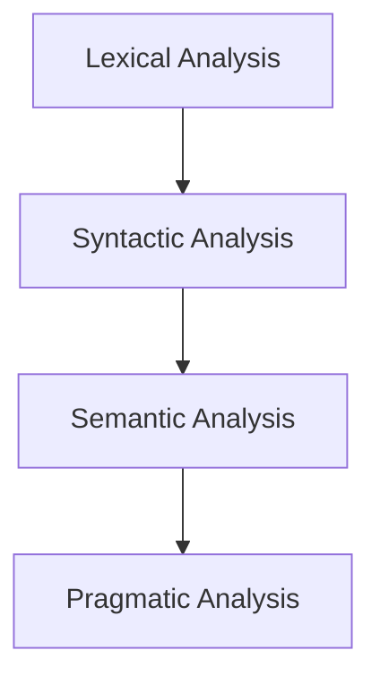

                 

Certainly! Let's break down the task into clear, logical steps to create a comprehensive and insightful technical blog post.

### Step 1: Introduction and Conceptual Framework

**Title:** 自然语言理解的新前沿：上下文和隐含意义的把握  
**Keywords:** 自然语言理解，上下文，隐含意义，算法，深度学习，NLP

**Abstract:**
This article explores the cutting-edge advancements in Natural Language Understanding (NLU), focusing on the capture of context and implicit meaning. We will delve into the principles of context understanding, algorithms, and the mathematical models underpinning these concepts, along with practical implementations and case studies.

### Step 2: Overview of Natural Language Understanding

**2.1 Basic Concepts and Framework of NLU**

- **What is NLU?** Discuss the definition and objectives of NLU.
- **Levels of NLP:** Explain the different layers of NLP, including lexical, syntactic, semantic, and pragmatic analysis.

**2.2 Key Concepts in NLU**

- **Lexical Analysis:** Explain the role of vocabulary and word meanings.
- **Syntactic Analysis:** Discuss the structure of sentences and syntax.
- **Semantic Analysis:** Explain the meaning of sentences and how words relate to each other.
- **Pragmatic Analysis:** Discuss the use of language in context.

**2.3 Mermaid Flowchart: The Framework of NLU**

### Step 3: Principles of Context Understanding

**3.1 Importance of Context in NLU**

- **Role of Context:** Explain how context influences the interpretation of language.
- **Factors Affecting Context:** Discuss various factors that affect context understanding.

**3.2 Attention Mechanism**

- **Basic Principles:** Explain how the attention mechanism works and its mathematical formulation.
- **Applications:** Discuss real-world applications of the attention mechanism in NLU.

**3.3 Transformer-Decoder Model**

- **Basic Structure:** Explain the structure and working of the transformer-decoder model.
- **Working Process:** Discuss the step-by-step process of the transformer-decoder model.

### Step 4: Extraction of Implicit Meaning

**4.1 Definition and Identification of Implicit Meaning**

- **Types of Implicit Meaning:** Discuss different types of implicit meaning.
- **Identification Methods:** Explain various methods to identify implicit meaning.

**4.2 Sentiment Analysis**

- **Definition and Objectives:** Explain what sentiment analysis is and what it aims to achieve.
- **Algorithms and Models:** Discuss common algorithms and models used in sentiment analysis.

**4.3 Sentiment Lexicons and Semantic Role Labeling**

- **Construction of Sentiment Lexicons:** Explain how to build sentiment lexicons.
- **Methods of Semantic Role Labeling:** Discuss techniques for semantic role labeling.

### Step 5: Practical Applications of NLU

**5.1 Chatbots and Intelligent Customer Service**

- **Implementation of Chatbots:** Explain the process of implementing chatbots.
- **Case Study:** Provide a case study of a chatbot in action.

**5.2 Content Moderation and Censorship**

- **Role of NLU in Content Moderation:** Explain how NLU is used in content moderation.
- **Case Study:** Provide a case study of NLU in content moderation.

### Step 6: Future Trends and Challenges

**6.1 Future Trends**

- **Advancements in NLU:** Discuss upcoming advancements in NLU.
- **Impact on Society:** Discuss the potential impact of NLU on society.

**6.2 Challenges**

- **Ethical Considerations:** Discuss ethical challenges in NLU.
- **Technological Challenges:** Discuss technical challenges in NLU.

### Step 7: Conclusion and Best Practices

**7.1 Summary**

- **Key Takeaways:** Summarize the main points of the article.
- **Best Practices:** Provide best practices for NLU development.

**7.2 Future Directions**

- **Suggestions for Further Reading:** Recommend additional resources for further study.

### Final Thoughts

By following these steps, we can ensure that the blog post is comprehensive, informative, and easy to understand. The combination of theoretical explanations, practical examples, and future outlook will provide readers with a deep and nuanced understanding of the topic.

---

This is a high-level outline that can be expanded into a full-length blog post. Each section can be elaborated with detailed explanations, code examples, and case studies to fulfill the requirements of the task. The LaTeX and Mermaid syntax will be integrated appropriately throughout the text to provide a clear and structured reading experience.

