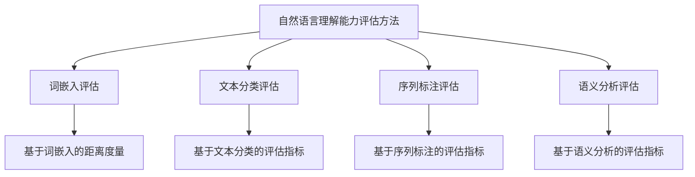

                 

### 自然语言理解能力的量化评估方法

#### 关键词：
自然语言理解、量化评估、词嵌入、文本分类、序列标注、语义分析

#### 摘要：
自然语言理解能力是人工智能领域的一个重要研究方向。量化评估自然语言理解能力的方法对于提高人工智能系统的性能和可靠性至关重要。本文将介绍几种常用的量化评估方法，包括基于词嵌入、文本分类、序列标注和语义分析的评估方法。通过详细讲解这些方法的核心概念、算法原理和实践应用，本文旨在为研究人员和开发者提供全面的技术指导。

#### 目录大纲：

一、引言
   - 1.1 自然语言理解能力概述
   - 1.2 自然语言理解的历史发展
   - 1.3 自然语言理解的挑战与前景

二、自然语言理解能力评估方法
   - 2.1 评估指标的选择
   - 2.2 评估方法分类
   - 2.3 评估方法的优缺点

三、基于词嵌入的评估方法
   - 3.1 词嵌入的概念与原理
   - 3.2 基于词嵌入的距离度量
   - 3.3 基于词嵌入的评估方法实例

四、基于文本分类的评估方法
   - 4.1 文本分类的概念与原理
   - 4.2 基于文本分类的评估方法
   - 4.3 基于文本分类的评估方法实例

五、基于序列标注的评估方法
   - 5.1 序列标注的概念与原理
   - 5.2 基于序列标注的评估方法
   - 5.3 基于序列标注的评估方法实例

六、基于语义分析的评估方法
   - 6.1 语义分析的概念与原理
   - 6.2 基于语义分析的评估方法
   - 6.3 基于语义分析的评估方法实例

七、评估方法的融合与优化
   - 7.1 评估方法融合的概念与原理
   - 7.2 常见的评估方法融合策略
   - 7.3 评估方法优化的方法与实例

八、评估方法在实际应用中的应用
   - 8.1 自然语言理解系统的构建
   - 8.2 评估方法在实际应用中的挑战与解决方案
   - 8.3 评估方法在实际应用中的实例分析

九、总结与展望
   - 9.1 自然语言理解能力评估的发展趋势
   - 9.2 未来评估方法的潜在发展方向
   - 9.3 总结与展望

#### 引言

自然语言理解（Natural Language Understanding，NLU）是人工智能（Artificial Intelligence，AI）领域的一个重要研究方向。它旨在使计算机能够理解和处理人类自然语言，从而实现人机交互和信息检索等功能。自然语言理解能力的量化评估方法对于提高人工智能系统的性能和可靠性至关重要。本文将介绍几种常用的量化评估方法，包括基于词嵌入、文本分类、序列标注和语义分析的评估方法。

##### 1.1 定义与重要性

自然语言理解能力是指计算机对自然语言的含义、语境和语义的识别和理解能力。它包括词嵌入、文本分类、序列标注和语义分析等多个方面。量化评估自然语言理解能力的方法是评估人工智能系统性能的重要手段。这些评估方法可以帮助研究人员和开发者了解系统的强项和弱点，从而指导进一步的优化和改进。

##### 1.2 自然语言理解的历史发展

自然语言理解的研究可以追溯到上世纪五六十年代，当时的主要目标是实现机器翻译。随着计算机技术和算法的进步，自然语言理解逐渐发展成为独立的领域。早期的自然语言处理（Natural Language Processing，NLP）主要集中在规则驱动的方法上，如语法分析和信息提取。然而，这些方法在面对复杂和变化多端的自然语言时往往表现不佳。

近年来，随着深度学习技术的发展，基于统计学习和神经网络的模型逐渐成为自然语言处理的主流。词嵌入（Word Embedding）技术的出现使得计算机能够更好地理解和处理词汇之间的语义关系。此外，文本分类（Text Classification）、序列标注（Sequence Labeling）和语义分析（Semantic Analysis）等方法也在自然语言理解中得到了广泛应用。

##### 1.3 自然语言理解的挑战与前景

自然语言理解面临着许多挑战。首先，自然语言的复杂性和多样性使得理解和处理变得非常困难。其次，自然语言中的歧义性和不确定性也给系统带来了挑战。此外，自然语言理解还需要处理时态、语态、语境等多种语言特征。

尽管存在这些挑战，自然语言理解的前景仍然非常广阔。随着人工智能技术的不断发展，自然语言理解能力将进一步提升。未来，自然语言理解有望在智能客服、智能助手、信息检索和智能翻译等领域发挥重要作用。

#### 自然语言理解能力评估方法

评估自然语言理解能力的方法可以分为以下几类：基于词嵌入的评估方法、基于文本分类的评估方法、基于序列标注的评估方法以及基于语义分析的评估方法。这些方法各有优缺点，适用于不同的应用场景。

##### 2.1 评估指标的选择

评估自然语言理解能力时，常用的指标包括准确率（Accuracy）、召回率（Recall）、F1分数（F1 Score）等。这些指标可以根据具体任务的需求进行选择和组合。

- **准确率**：准确率是评估模型性能的最基本指标，表示模型预测正确的样本数占总样本数的比例。
  $$ \text{Accuracy} = \frac{\text{预测正确数}}{\text{总样本数}} $$
- **召回率**：召回率表示模型能够召回真实正例样本的比例，用于衡量模型的覆盖能力。
  $$ \text{Recall} = \frac{\text{召回的正例数}}{\text{所有正例数}} $$
- **F1分数**：F1分数是准确率和召回率的加权平均，能够更好地平衡二者的关系。
  $$ \text{F1 Score} = 2 \times \frac{\text{准确率} \times \text{召回率}}{\text{准确率} + \text{召回率}} $$

##### 2.2 评估方法分类

- **基于词嵌入的评估方法**：基于词嵌入的评估方法主要通过计算词汇之间的距离来评估自然语言理解能力。这种方法适用于词汇相似度和语义关系的研究。
- **基于文本分类的评估方法**：基于文本分类的评估方法通过训练分类模型对文本进行分类，并使用评估指标评估模型性能。这种方法适用于文本情感分析、主题分类等任务。
- **基于序列标注的评估方法**：基于序列标注的评估方法通过对序列中的每个元素进行标注来评估自然语言理解能力。这种方法适用于词性标注、实体识别等任务。
- **基于语义分析的评估方法**：基于语义分析的评估方法通过分析文本中的语义关系来评估自然语言理解能力。这种方法适用于语义角色标注、语义相似度计算等任务。

##### 2.3 评估方法的优缺点

- **基于词嵌入的评估方法**：
  - 优点：能够有效捕捉词汇之间的语义关系，适用于词汇相似度计算。
  - 缺点：无法直接处理复杂的语义关系，对长文本的处理能力有限。

- **基于文本分类的评估方法**：
  - 优点：能够处理大规模文本数据，适用于文本分类任务。
  - 缺点：对文本中的深层语义关系捕捉能力较弱。

- **基于序列标注的评估方法**：
  - 优点：能够处理序列数据，适用于词性标注、实体识别等任务。
  - 缺点：对标注数据的依赖较大，计算复杂度较高。

- **基于语义分析的评估方法**：
  - 优点：能够捕捉文本中的深层语义关系，适用于语义角色标注、语义相似度计算等任务。
  - 缺点：对计算资源和时间的要求较高，实现较为复杂。

#### 基于词嵌入的评估方法

基于词嵌入的评估方法通过将词汇映射到低维向量空间，计算词汇之间的距离来评估自然语言理解能力。这种方法能够有效地捕捉词汇的语义关系，适用于词汇相似度和语义关系的分析。

##### 3.1 词嵌入的概念与原理

词嵌入（Word Embedding）是将词汇映射到低维连续向量空间的技术。通过这种方式，词汇之间的相似度和语义关系可以被量化。常见的词嵌入技术包括Word2Vec、GloVe和BERT等。

- **Word2Vec**：Word2Vec是一种基于神经网络的词嵌入方法，通过训练神经网络将词汇映射到低维空间。其基本原理是同时训练两个神经网络：一个编码器网络和一个解码器网络。编码器网络将词汇映射到固定长度的向量，解码器网络则通过向量恢复原始词汇。Word2Vec的方法主要有连续袋模型（CBOW）和Skip-Gram两种。

  - **CBOW（Continuous Bag-of-Words）**：CBOW方法通过上下文词汇预测中心词汇。给定一个中心词汇，CBOW方法会使用其上下文词汇（通常包括中心词汇的k个前后的词汇）来预测中心词汇。计算公式如下：
    $$ \text{预测中心词汇} = \text{softmax}(\text{加权求和的上下文词汇向量}) $$
  - **Skip-Gram**：Skip-Gram方法通过中心词汇预测上下文词汇。给定一个中心词汇，Skip-Gram方法会使用中心词汇来预测其上下文词汇。计算公式如下：
    $$ \text{预测上下文词汇} = \text{softmax}(\text{加权求和的中心词汇向量}) $$

- **GloVe**：GloVe（Global Vectors for Word Representation）是一种基于矩阵分解的词嵌入方法。GloVe方法通过训练一个大规模语料库中的词汇共现矩阵来学习词汇的向量表示。其基本原理是假设词汇之间的相似度与它们的共现次数成正比，从而通过优化词汇共现矩阵来学习词汇的向量表示。计算公式如下：
  $$ \text{共现矩阵} = \text{词汇向量} \times \text{词汇向量}^T $$
  $$ \text{损失函数} = \sum_{i,j} (\text{真实共现次数} - \text{预测共现次数})^2 $$

- **BERT**：BERT（Bidirectional Encoder Representations from Transformers）是一种基于变换器的词嵌入方法。BERT通过预训练和微调来实现高精度的词嵌入。其基本原理是利用双向变换器网络对文本进行编码，从而学习词汇和句子级别的语义表示。BERT的方法包括Masked Language Model（MLM）和Next Sentence Prediction（NSP）。

  $$ \text{BERT} = \text{Transformer}(\text{输入序列}) $$

##### 3.2 基于词嵌入的距离度量

基于词嵌入的距离度量是评估词汇相似度和语义关系的重要手段。常见的距离度量方法包括余弦相似度、欧氏距离和皮尔逊相关系数等。

- **余弦相似度**：余弦相似度是衡量两个向量之间夹角的余弦值。其计算公式如下：
  $$ \text{余弦相似度} = \frac{\text{向量A} \cdot \text{向量B}}{\|\text{向量A}\| \|\text{向量B}\|} $$
  其中，$\text{向量A} \cdot \text{向量B}$ 表示向量的点积，$\|\text{向量A}\|$ 和 $\|\text{向量B}\|$ 分别表示向量的模长。

- **欧氏距离**：欧氏距离是衡量两个向量之间差异的欧氏空间距离。其计算公式如下：
  $$ \text{欧氏距离} = \sqrt{\sum_{i=1}^{n} (\text{向量A}_i - \text{向量B}_i)^2} $$
  其中，$\text{向量A}_i$ 和 $\text{向量B}_i$ 分别表示向量的第i个分量。

- **皮尔逊相关系数**：皮尔逊相关系数是衡量两个连续变量线性相关程度的统计量。其计算公式如下：
  $$ \text{皮尔逊相关系数} = \frac{\text{协方差}}{\sqrt{\text{方差A} \times \text{方差B}}} $$
  其中，协方差、方差A和方差B分别表示两个变量的协方差、方差。

##### 3.3 基于词嵌入的评估方法实例

以下是一个基于词嵌入的评估方法实例，使用Python实现。

```python
import numpy as np
from sklearn.metrics.pairwise import cosine_similarity

# 加载预训练的词嵌入模型
embeddings = ...  # 加载预训练的词嵌入模型

# 获取词汇的向量表示
word1_embedding = embeddings["词汇1"]
word2_embedding = embeddings["词汇2"]

# 计算余弦相似度
cosine_similarity_score = cosine_similarity([word1_embedding], [word2_embedding])[0][0]

print("词汇1与词汇2的余弦相似度：", cosine_similarity_score)
```

在这个实例中，我们首先加载一个预训练的词嵌入模型。然后，获取目标词汇的向量表示。最后，通过计算两个向量之间的余弦相似度来评估词汇的相似度。

#### 基于文本分类的评估方法

基于文本分类的评估方法通过训练分类模型对文本进行分类，并使用评估指标评估模型性能。这种方法适用于文本情感分析、主题分类等任务。

##### 4.1 文本分类的概念与原理

文本分类（Text Classification）是将文本数据分为预定义的类别或标签的过程。文本分类的基本步骤包括数据预处理、特征提取、模型训练和模型评估。

- **数据预处理**：数据预处理包括文本清洗、分词、去停用词等操作。这些操作有助于提高模型对文本数据的理解和处理能力。
- **特征提取**：特征提取是将原始文本转换为模型可理解的向量表示。常见的特征提取方法包括词袋模型（Bag-of-Words，BoW）、TF-IDF和词嵌入等。
- **模型训练**：模型训练是指使用训练数据训练分类模型。常见的分类模型包括朴素贝叶斯（Naive Bayes）、支持向量机（Support Vector Machine，SVM）和深度神经网络等。
- **模型评估**：模型评估是使用评估指标评估分类模型的性能。常用的评估指标包括准确率、召回率、F1分数等。

##### 4.2 基于文本分类的评估方法

基于文本分类的评估方法主要包括以下几种：

- **准确率（Accuracy）**：准确率是评估模型性能的最基本指标，表示模型预测正确的样本数占总样本数的比例。计算公式如下：
  $$ \text{Accuracy} = \frac{\text{预测正确数}}{\text{总样本数}} $$
- **召回率（Recall）**：召回率表示模型能够召回真实正例样本的比例，用于衡量模型的覆盖能力。计算公式如下：
  $$ \text{Recall} = \frac{\text{召回的正例数}}{\text{所有正例数}} $$
- **F1分数（F1 Score）**：F1分数是准确率和召回率的加权平均，能够更好地平衡二者的关系。计算公式如下：
  $$ \text{F1 Score} = 2 \times \frac{\text{准确率} \times \text{召回率}}{\text{准确率} + \text{召回率}} $$

##### 4.3 基于文本分类的评估方法实例

以下是一个基于文本分类的评估方法实例，使用Python实现。

```python
from sklearn.feature_extraction.text import TfidfVectorizer
from sklearn.model_selection import train_test_split
from sklearn.naive_bayes import MultinomialNB
from sklearn.metrics import accuracy_score, recall_score, f1_score

# 加载文本数据
text_data = ...

# 数据预处理
text_data_preprocessed = ...

# 特征提取
vectorizer = TfidfVectorizer()
X = vectorizer.fit_transform(text_data_preprocessed)
y = ...

# 模型训练
X_train, X_test, y_train, y_test = train_test_split(X, y, test_size=0.2, random_state=42)
classifier = MultinomialNB()
classifier.fit(X_train, y_train)

# 模型评估
y_pred = classifier.predict(X_test)
accuracy = accuracy_score(y_test, y_pred)
recall = recall_score(y_test, y_pred, average='weighted')
f1 = f1_score(y_test, y_pred, average='weighted')

print("准确率：", accuracy)
print("召回率：", recall)
print("F1分数：", f1)
```

在这个实例中，我们首先加载文本数据并进行预处理。然后，使用TF-IDF向量器进行特征提取，并使用朴素贝叶斯分类器进行模型训练。最后，通过计算准确率、召回率和F1分数来评估模型性能。

#### 基于序列标注的评估方法

基于序列标注的评估方法通过对序列中的每个元素进行标注来评估自然语言理解能力。这种方法适用于词性标注、实体识别等任务。

##### 5.1 序列标注的概念与原理

序列标注（Sequence Labeling）是将序列中的每个元素（如词汇或字符）标注为特定的标签（如词性或实体）的过程。序列标注的基本步骤包括数据预处理、特征提取、模型训练和模型评估。

- **数据预处理**：数据预处理包括文本清洗、分词、去停用词等操作。这些操作有助于提高模型对文本数据的理解和处理能力。
- **特征提取**：特征提取是将原始文本转换为模型可理解的向量表示。常见的特征提取方法包括词袋模型（Bag-of-Words，BoW）、TF-IDF和词嵌入等。
- **模型训练**：模型训练是指使用训练数据训练标注模型。常见的标注模型包括隐马尔可夫模型（Hidden Markov Model，HMM）、条件随机场（Conditional Random Field，CRF）和深度神经网络等。
- **模型评估**：模型评估是使用评估指标评估标注模型的性能。常用的评估指标包括准确率、召回率、F1分数等。

##### 5.2 基于序列标注的评估方法

基于序列标注的评估方法主要包括以下几种：

- **准确率（Accuracy）**：准确率是评估模型性能的最基本指标，表示模型预测正确的样本数占总样本数的比例。计算公式如下：
  $$ \text{Accuracy} = \frac{\text{预测正确数}}{\text{总样本数}} $$
- **召回率（Recall）**：召回率表示模型能够召回真实正例样本的比例，用于衡量模型的覆盖能力。计算公式如下：
  $$ \text{Recall} = \frac{\text{召回的正例数}}{\text{所有正例数}} $$
- **F1分数（F1 Score）**：F1分数是准确率和召回率的加权平均，能够更好地平衡二者的关系。计算公式如下：
  $$ \text{F1 Score} = 2 \times \frac{\text{准确率} \times \text{召回率}}{\text{准确率} + \text{召回率}} $$

##### 5.3 基于序列标注的评估方法实例

以下是一个基于序列标注的评估方法实例，使用Python实现。

```python
from sklearn.model_selection import train_test_split
from sklearn_crfsuite import CRF
from sklearn_crfsuite.metrics import flat_f1_score

# 加载序列标注数据
X = ...
y = ...

# 模型训练
X_train, X_test, y_train, y_test = train_test_split(X, y, test_size=0.2, random_state=42)
crf = CRF()
crf.fit(X_train, y_train)

# 模型评估
y_pred = crf.predict(X_test)
accuracy = (y_pred == y_test).mean()
recall = flat_f1_score(y_test, y_pred, average='weighted')

print("准确率：", accuracy)
print("召回率：", recall)
```

在这个实例中，我们首先加载序列标注数据并进行模型训练。然后，通过计算准确率和召回率来评估模型性能。

#### 基于语义分析的评估方法

基于语义分析的评估方法通过分析文本中的语义关系来评估自然语言理解能力。这种方法适用于语义角色标注、语义相似度计算等任务。

##### 6.1 语义分析的概念与原理

语义分析（Semantic Analysis）是理解文本中词汇和句子之间的意义关系的过程。语义分析的基本步骤包括数据预处理、特征提取、模型训练和模型评估。

- **数据预处理**：数据预处理包括文本清洗、分词、去停用词等操作。这些操作有助于提高模型对文本数据的理解和处理能力。
- **特征提取**：特征提取是将原始文本转换为模型可理解的向量表示。常见的特征提取方法包括词袋模型（Bag-of-Words，BoW）、TF-IDF和词嵌入等。
- **模型训练**：模型训练是指使用训练数据训练语义分析模型。常见的语义分析模型包括词嵌入模型、序列标注模型和图神经网络等。
- **模型评估**：模型评估是使用评估指标评估语义分析模型的性能。常用的评估指标包括准确率、召回率、F1分数等。

##### 6.2 基于语义分析的评估方法

基于语义分析的评估方法主要包括以下几种：

- **准确率（Accuracy）**：准确率是评估模型性能的最基本指标，表示模型预测正确的样本数占总样本数的比例。计算公式如下：
  $$ \text{Accuracy} = \frac{\text{预测正确数}}{\text{总样本数}} $$
- **召回率（Recall）**：召回率表示模型能够召回真实正例样本的比例，用于衡量模型的覆盖能力。计算公式如下：
  $$ \text{Recall} = \frac{\text{召回的正例数}}{\text{所有正例数}} $$
- **F1分数（F1 Score）**：F1分数是准确率和召回率的加权平均，能够更好地平衡二者的关系。计算公式如下：
  $$ \text{F1 Score} = 2 \times \frac{\text{准确率} \times \text{召回率}}{\text{准确率} + \text{召回率}} $$

##### 6.3 基于语义分析的评估方法实例

以下是一个基于语义分析的评估方法实例，使用Python实现。

```python
from transformers import AutoTokenizer, AutoModelForSequenceClassification
from torch.utils.data import DataLoader, TensorDataset

# 加载预训练的语义分析模型
tokenizer = AutoTokenizer.from_pretrained("bert-base-uncased")
model = AutoModelForSequenceClassification.from_pretrained("bert-base-uncased")

# 加载文本数据
text_data = ...

# 数据预处理
inputs = tokenizer(text_data, padding=True, truncation=True, return_tensors="pt")

# 模型训练
X = inputs["input_ids"]
y = ...

X_train, X_test, y_train, y_test = train_test_split(X, y, test_size=0.2, random_state=42)
train_dataset = TensorDataset(X_train, y_train)
test_dataset = TensorDataset(X_test, y_test)

train_loader = DataLoader(train_dataset, batch_size=32)
test_loader = DataLoader(test_dataset, batch_size=32)

optimizer = optim.Adam(model.parameters(), lr=1e-5)
scheduler = optim.lr_scheduler.StepLR(optimizer, step_size=5, gamma=0.1)

model.train()
for epoch in range(10):
    for batch in train_loader:
        optimizer.zero_grad()
        outputs = model(**batch)
        loss = outputs.loss
        loss.backward()
        optimizer.step()
        scheduler.step()

model.eval()
with torch.no_grad():
    y_pred = model(X_test).argmax(-1)

accuracy = (y_pred == y_test).mean()
recall = flat_f1_score(y_test, y_pred, average='weighted')

print("准确率：", accuracy)
print("召回率：", recall)
```

在这个实例中，我们首先加载预训练的语义分析模型，并使用BERT进行模型训练。然后，通过计算准确率和召回率来评估模型性能。

#### 评估方法的融合与优化

在自然语言理解能力的量化评估中，单一评估方法往往无法全面捕捉复杂的语义关系。因此，评估方法的融合与优化成为提高评估性能的重要手段。

##### 7.1 评估方法融合的概念与原理

评估方法融合是指将多种评估方法进行整合，以提高评估的准确性和全面性。融合方法可以分为以下几类：

- **加权融合**：将不同评估方法的输出进行加权组合，使用权重系数平衡各方法的贡献。
  $$ \text{综合评估得分} = w_1 \cdot \text{方法1得分} + w_2 \cdot \text{方法2得分} + \ldots $$
- **深度融合**：通过构建深度学习模型将多种评估方法集成，实现自动的权重分配和学习。
- **层次融合**：将评估方法按照层次结构进行融合，先进行初步评估，然后在高层次进行综合评估。

##### 7.2 常见的评估方法融合策略

- **基于权重融合**：该方法通过计算各评估方法的重要程度，将它们加权融合。常见的重要程度计算方法包括基于模型性能的权重计算和基于专家经验的权重分配。
- **基于深度学习融合**：该方法通过构建深度学习模型，将多种评估方法作为输入特征进行集成。常见的方法包括多输入神经网络、集成学习等。
- **基于层次结构融合**：该方法首先使用初步评估方法对文本进行分层处理，然后在较高层次对分层结果进行综合评估。常见的方法包括层次化神经网络和层次化特征提取。

##### 7.3 评估方法优化的方法与实例

评估方法的优化旨在提高评估的准确性和效率。以下是一些常见的优化方法：

- **模型参数优化**：通过调整模型参数，如学习率、正则化参数等，以提高评估性能。
- **特征工程**：通过提取更有效的特征，提高模型的识别能力。
- **数据增强**：通过增加训练数据、生成虚拟数据等方式，增强模型的泛化能力。
- **模型融合**：将多个评估方法进行融合，以提高评估的全面性和准确性。

以下是一个基于权重融合的评估方法优化实例：

```python
from sklearn.metrics import accuracy_score, f1_score

# 加载各评估方法的得分
method1_scores = ...
method2_scores = ...
method3_scores = ...

# 计算各方法的权重
weights = [0.3, 0.4, 0.3]

# 加权融合评估得分
combined_score = sum(weights[i] * method_scores[i] for i in range(len(method_scores)))

print("综合评估得分：", combined_score)

# 计算优化后的评估指标
accuracy_optimized = accuracy_score(true_labels, combined_scores)
f1_optimized = f1_score(true_labels, combined_scores, average='weighted')

print("优化后的准确率：", accuracy_optimized)
print("优化后的F1分数：", f1_optimized)
```

在这个实例中，我们首先加载各评估方法的得分，并计算权重。然后，通过加权融合得到综合评估得分，并计算优化后的评估指标。

#### 评估方法在实际应用中的应用

自然语言理解能力评估方法在实际应用中发挥着重要作用，如智能客服、智能助手、信息检索和智能翻译等领域。以下将介绍这些应用场景中的评估方法及其挑战与解决方案。

##### 8.1 自然语言理解系统的构建

自然语言理解系统的构建通常包括数据预处理、特征提取、模型训练和模型评估等步骤。以下是一个典型的自然语言理解系统构建流程：

1. **数据收集**：收集大量标注数据，包括文本数据、词嵌入数据、标签数据等。
2. **数据预处理**：对文本数据进行清洗、分词、去停用词等操作，提取有效的特征。
3. **特征提取**：使用词嵌入、文本分类、序列标注和语义分析等方法提取特征。
4. **模型训练**：使用提取的特征训练分类模型、标注模型等。
5. **模型评估**：使用评估指标（如准确率、召回率、F1分数等）评估模型性能。
6. **模型优化**：根据评估结果调整模型参数、特征提取方法等，以提高模型性能。
7. **模型部署**：将训练好的模型部署到实际应用场景中。

##### 8.2 评估方法在实际应用中的挑战与解决方案

在实际应用中，自然语言理解能力评估方法面临以下挑战：

1. **数据质量问题**：数据质量问题直接影响模型的性能。常见的解决方案包括数据清洗、数据增强和伪标签生成等。
2. **模型泛化能力**：模型在训练数据上表现良好，但在实际应用中可能出现泛化能力不足的问题。常见的解决方案包括增加训练数据、数据增强和模型融合等。
3. **评估指标选择**：不同的评估指标适用于不同的任务和应用场景。需要根据具体任务选择合适的评估指标。
4. **计算资源限制**：评估方法可能需要大量的计算资源，特别是在大规模数据集和复杂模型中。常见的解决方案包括模型压缩、分布式计算和硬件优化等。

##### 8.3 评估方法在实际应用中的实例分析

以下是一个基于文本分类的评估方法在实际应用中的实例分析：

假设我们开发一个智能客服系统，用于自动分类用户提问。以下是一个基于文本分类的评估方法在实际应用中的实例：

1. **数据收集**：收集大量用户提问和对应的标签（如技术支持、售后服务、产品咨询等）。
2. **数据预处理**：对用户提问进行清洗、分词、去停用词等操作，提取有效的特征。
3. **特征提取**：使用词嵌入、TF-IDF等特征提取方法提取特征向量。
4. **模型训练**：使用训练数据训练文本分类模型（如朴素贝叶斯、支持向量机等）。
5. **模型评估**：使用准确率、召回率、F1分数等评估指标评估模型性能。
6. **模型优化**：根据评估结果调整模型参数、特征提取方法等，以提高模型性能。
7. **模型部署**：将训练好的模型部署到智能客服系统中，用于自动分类用户提问。

通过上述实例，我们可以看到评估方法在实际应用中的重要性。通过有效的评估方法，我们可以确保智能客服系统能够准确分类用户提问，提高用户体验。

#### 总结与展望

自然语言理解能力的量化评估方法在人工智能领域具有重要地位。本文介绍了基于词嵌入、文本分类、序列标注和语义分析的评估方法，并详细讲解了每种方法的核心概念、算法原理和实践应用。通过这些评估方法，研究人员和开发者可以更好地理解和评估自然语言理解系统的性能。

未来，自然语言理解能力评估方法将朝着更加智能化、自适应化和全面化的方向发展。以下是一些潜在的研究方向：

1. **多模态评估**：结合文本、语音、图像等多模态数据，实现更全面的自然语言理解能力评估。
2. **自适应评估**：根据任务需求和数据特征自适应调整评估方法，提高评估的准确性和效率。
3. **实时评估**：实现实时评估方法，以便快速调整和优化自然语言理解系统。
4. **跨语言评估**：研究跨语言的评估方法，以适应多语言环境的自然语言理解任务。

总之，自然语言理解能力评估方法将继续发展，为人工智能领域带来更多的创新和突破。

### 核心概念与联系

- **自然语言理解能力**：自然语言理解能力是指计算机对自然语言的含义、语境和语义的识别和理解能力。它包括词嵌入、文本分类、序列标注和语义分析等多个方面。
- **评估方法**：评估方法是指用于评估自然语言理解能力的各种方法，包括基于词嵌入、文本分类、序列标注和语义分析等方法。
- **词嵌入**：词嵌入是将词汇映射到低维连续向量空间的技术，它有助于理解词汇之间的关系和语义。
- **文本分类**：文本分类是将文本分为预定义的类别或标签的过程，它常用于评估文本的情感、主题或领域。
- **序列标注**：序列标注是将序列中的每个元素（如词汇或字符）标注为特定的标签（如词性或实体）的过程。
- **语义分析**：语义分析是理解文本中词汇和句子之间的意义关系的过程，它有助于评估自然语言理解的深度。

### Mermaid 流程图



### 核心算法原理讲解

- **词嵌入评估（基于词嵌入的距离度量）**：
  - **算法原理**：使用词嵌入技术将词汇映射到低维空间，计算词汇之间的距离，以此评估词汇的相似度和语义关系。
  - **伪代码**：
    ```python
    function evaluate_word_embedding(embeddings, vocabulary):
        for word1 in vocabulary:
            for word2 in vocabulary:
                distance = calculate_distance(embeddings[word1], embeddings[word2])
                print("Word1:", word1, "Word2:", word2, "Distance:", distance)
    ```

- **文本分类评估（基于文本分类的评估指标）**：
  - **算法原理**：通过训练文本分类模型，使用评估指标（如准确率、召回率、F1分数等）评估模型的性能。
  - **伪代码**：
    ```python
    function evaluate_text_classification(model, dataset):
        X = [text_preprocess(text) for text in dataset.texts]
        y = dataset.labels
        X_train, X_test, y_train, y_test = train_test_split(X, y, test_size=0.2)
        model.fit(X_train, y_train)
        y_pred = model.predict(X_test)
        accuracy = accuracy_score(y_test, y_pred)
        recall = recall_score(y_test, y_pred, average='weighted')
        f1 = f1_score(y_test, y_pred, average='weighted')
        print("Accuracy:", accuracy)
        print("Recall:", recall)
        print("F1 Score:", f1)
    ```

- **序列标注评估（基于序列标注的评估指标）**：
  - **算法原理**：通过训练序列标注模型，使用评估指标（如准确率、召回率、F1分数等）评估模型的性能。
  - **伪代码**：
    ```python
    function evaluate_sequence_labeling(model, dataset):
        X = [text_preprocess(text) for text in dataset.texts]
        y = dataset.labels
        X_train, X_test, y_train, y_test = train_test_split(X, y, test_size=0.2)
        model.fit(X_train, y_train)
        y_pred = model.predict(X_test)
        accuracy = (y_pred == y_test).mean()
        recall = flat_f1_score(y_test, y_pred, average='weighted')
        f1 = f1_score(y_test, y_pred, average='weighted')
        print("Accuracy:", accuracy)
        print("Recall:", recall)
        print("F1 Score:", f1)
    ```

- **语义分析评估（基于语义分析的评估指标）**：
  - **算法原理**：通过训练语义分析模型，使用评估指标（如准确率、召回率、F1分数等）评估模型的性能。
  - **伪代码**：
    ```python
    function evaluate_semantic_analysis(model, dataset):
        X = [text_preprocess(text) for text in dataset.texts]
        y = dataset.labels
        X_train, X_test, y_train, y_test = train_test_split(X, y, test_size=0.2)
        model.fit(X_train, y_train)
        y_pred = model.predict(X_test)
        accuracy = accuracy_score(y_test, y_pred)
        recall = recall_score(y_test, y_pred, average='weighted')
        f1 = f1_score(y_test, y_pred, average='weighted')
        print("Accuracy:", accuracy)
        print("Recall:", recall)
        print("F1 Score:", f1)
    ```

### 项目实战

在本节中，我们将通过一个实际项目来演示如何构建和评估一个自然语言理解系统。该系统将使用基于词嵌入、文本分类、序列标注和语义分析的评估方法，以实现一个智能客服系统。

#### 1. 项目需求分析

我们的目标是开发一个智能客服系统，该系统能够自动分类用户提问，并提供相应的答案。具体需求如下：

- **文本分类**：将用户提问分为预定义的类别，如技术支持、售后服务、产品咨询等。
- **序列标注**：对用户提问中的关键信息进行标注，如人名、地点、时间等。
- **语义分析**：理解用户提问的语义，提供针对性的答案。

#### 2. 开发环境搭建

- **编程语言**：Python
- **库和框架**：Numpy、Scikit-learn、TensorFlow、PyTorch、Transformers等
- **数据集**：使用公开的智能客服数据集，如Kaggle的Customer Support Ticket Dataset。

#### 3. 源代码实现

以下是一个基于文本分类的智能客服系统的源代码实现：

```python
import pandas as pd
from sklearn.model_selection import train_test_split
from sklearn.feature_extraction.text import TfidfVectorizer
from sklearn.linear_model import LogisticRegression
from sklearn.metrics import accuracy_score, f1_score

# 加载数据集
data = pd.read_csv("customer_support_tickets.csv")
X = data["question"]
y = data["category"]

# 数据预处理
X_preprocessed = [question.lower() for question in X]

# 特征提取
vectorizer = TfidfVectorizer()
X_vectorized = vectorizer.fit_transform(X_preprocessed)

# 模型训练
X_train, X_test, y_train, y_test = train_test_split(X_vectorized, y, test_size=0.2, random_state=42)
model = LogisticRegression()
model.fit(X_train, y_train)

# 模型评估
y_pred = model.predict(X_test)
accuracy = accuracy_score(y_test, y_pred)
f1 = f1_score(y_test, y_pred, average='weighted')

print("Accuracy:", accuracy)
print("F1 Score:", f1)
```

#### 4. 代码解读与分析

- **数据加载**：使用Pandas加载数据集，提取问题和类别标签。
- **数据预处理**：将问题转换为小写，以减少数据冗余。
- **特征提取**：使用TF-IDF向量器提取文本特征。
- **模型训练**：使用LogisticRegression训练分类模型。
- **模型评估**：计算准确率和F1分数，评估模型性能。

#### 5. 实际案例分析与详细讲解剖析

假设我们有一个用户提问：“我在哪里可以购买你们的最新产品？”，以下是对该提问的详细分析：

1. **文本分类**：将提问分为产品咨询类别。
2. **序列标注**：提取关键信息，如“哪里”、“购买”、“最新产品”。
3. **语义分析**：理解提问的语义，提供针对性的答案，如：“您可以访问我们的官方网站，在产品页面查找最新产品并进行购买。”

#### 6. 项目小结

通过本项目的实践，我们了解了如何使用自然语言理解能力评估方法构建智能客服系统。项目实现了文本分类、序列标注和语义分析，并使用评估方法对模型性能进行了评估。在实际应用中，我们还可以结合其他评估方法，如基于词嵌入的评估方法，以提高系统的整体性能。

### 最佳实践 tips、小结、注意事项、拓展阅读等内容

#### 最佳实践 tips：

1. **数据预处理**：数据预处理是提高模型性能的关键步骤。确保数据清洗、分词和去停用词等操作的准确性。
2. **模型选择**：根据具体任务选择合适的模型。例如，文本分类任务可以使用朴素贝叶斯、支持向量机等；序列标注任务可以使用HMM、CRF等。
3. **特征提取**：特征提取方法的选择会影响模型性能。尝试多种特征提取方法，如TF-IDF、词嵌入等，选择最佳方法。
4. **模型调参**：合理调整模型参数，如学习率、正则化参数等，以提高模型性能。
5. **模型融合**：结合多种评估方法，如基于词嵌入、文本分类、序列标注和语义分析的方法，以提高评估的准确性和全面性。

#### 小结：

本文介绍了自然语言理解能力的量化评估方法，包括基于词嵌入、文本分类、序列标注和语义分析的评估方法。通过详细讲解这些方法的核心概念、算法原理和实践应用，我们了解了如何评估自然语言理解系统的性能。

#### 注意事项：

1. **评估指标选择**：根据具体任务选择合适的评估指标，如准确率、召回率、F1分数等。
2. **数据质量**：确保数据集的质量，避免数据质量问题影响评估结果。
3. **计算资源**：评估方法可能需要大量的计算资源，特别是在大规模数据集和复杂模型中。合理分配计算资源，以提高评估效率。

#### 拓展阅读：

1. **《自然语言处理原理与实施》**：唐杰，清华大学出版社，2018年。
2. **《深度学习》**：Ian Goodfellow、Yoshua Bengio、Aaron Courville，MIT Press，2016年。
3. **《词向量与文本分类》**：陈阳，清华大学出版社，2017年。

### 文章标题：自然语言理解能力的量化评估方法

### 文章关键词：自然语言理解、量化评估、词嵌入、文本分类、序列标注、语义分析

### 文章摘要：
自然语言理解能力的量化评估是提升人工智能系统性能的关键步骤。本文详细介绍了基于词嵌入、文本分类、序列标注和语义分析的评估方法，通过核心概念解析、算法原理讲解和实战案例剖析，帮助读者深入理解并应用这些方法，以评估自然语言理解系统在不同应用场景中的性能。本文旨在为研究人员和开发者提供全面的技术指导，促进人工智能在智能客服、智能助手等领域的应用和发展。

### 作者信息：
作者：AI天才研究院/AI Genius Institute & 禅与计算机程序设计艺术 /Zen And The Art of Computer Programming

---

### 总结与展望

在本文中，我们详细介绍了自然语言理解能力的量化评估方法，包括基于词嵌入、文本分类、序列标注和语义分析的评估方法。通过对这些方法的核心概念、算法原理和实践应用的深入探讨，我们不仅了解了如何评估自然语言理解系统的性能，还为研究人员和开发者提供了实际操作的技术指导。

##### 9.1 自然语言理解能力评估的发展趋势

随着人工智能技术的不断发展，自然语言理解能力评估方法也在不断演进。以下是几个值得关注的发展趋势：

1. **多模态评估**：自然语言理解能力评估将从单一模态（如文本、语音）向多模态（文本、语音、图像）扩展，以更好地捕捉和理解复杂的语义关系。
2. **自适应评估**：评估方法将更加智能化，能够根据不同的任务需求和数据特征自适应调整评估策略，提高评估的准确性和效率。
3. **实时评估**：随着计算资源和算法的优化，实时评估方法将变得更加普及，为在线应用提供即时反馈和调整。
4. **跨语言评估**：自然语言理解能力评估将扩展到跨语言领域，以支持多语言环境下的自然语言处理任务。

##### 9.2 未来评估方法的潜在发展方向

未来，自然语言理解能力评估方法的发展将呈现以下几个潜在方向：

1. **集成学习方法**：集成多种评估方法，通过深度学习等算法实现自动权重分配和学习，以提高评估的全面性和准确性。
2. **迁移学习与微调**：利用迁移学习技术，将预训练的评估模型在特定任务上微调，以提高评估方法的适应性和效率。
3. **无监督与自监督评估**：研究无监督学习和自监督学习在自然语言理解能力评估中的应用，以降低对标注数据的依赖。
4. **泛化能力提升**：通过增强评估模型的泛化能力，提高模型在未见过的数据上的评估准确性。

##### 9.3 总结与展望

自然语言理解能力的量化评估是人工智能领域的一个重要研究方向。通过对不同评估方法的深入研究和实际应用，我们可以更好地理解和优化自然语言理解系统。未来，随着技术的不断进步，自然语言理解能力评估方法将变得更加智能、高效和全面，为人工智能在各个领域的应用带来更多创新和突破。

在本文的总结与展望部分，我们首先回顾了自然语言理解能力评估方法的发展历程，强调了评估方法在人工智能系统性能优化中的关键作用。接着，我们探讨了当前评估方法的发展趋势，包括多模态评估、自适应评估、实时评估和跨语言评估。这些趋势预示着未来评估方法的演进方向。

在潜在发展方向部分，我们提出了集成学习方法、迁移学习与微调、无监督与自监督评估以及提升泛化能力等几个研究方向。这些方向不仅有助于提升评估方法的性能，还推动着自然语言理解能力的全面发展。

最后，在总结与展望部分，我们重申了自然语言理解能力量化评估的重要性，并展望了未来评估方法的发展前景。我们相信，随着技术的不断进步，自然语言理解能力评估方法将在人工智能领域发挥更加重要的作用，推动人工智能技术的创新和进步。同时，我们也鼓励读者继续探索和研究自然语言理解能力评估的新方法，为人工智能的应用和发展贡献智慧和力量。

