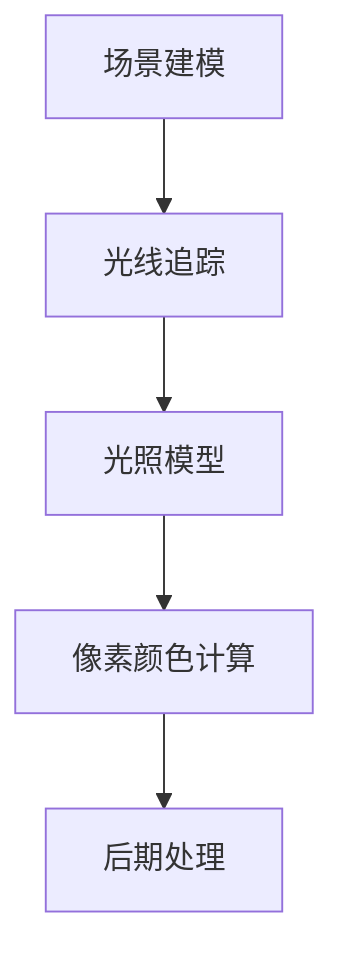

                 

# 舞台灯光的蒙特卡洛光线追踪：视觉效果的数学模拟

## 关键词
- 蒙特卡洛方法
- 光线追踪
- 舞台灯光
- 数学模拟
- 视觉效果

## 摘要
本文将探讨如何使用蒙特卡洛光线追踪技术来模拟舞台灯光的效果。首先，我们将介绍蒙特卡洛方法和光线追踪的基本概念，并解释它们在舞台灯光模拟中的应用。然后，我们将详细分析舞台灯光的数学模型，包括光线传播、光源模型和反射折射模型。接着，我们将深入讲解蒙特卡洛光线追踪算法，包括采样技术、重要性采样和反向蒙特卡洛算法。通过Python源代码和数学公式，我们将逐一阐述这些算法原理，并通过实际案例展示其应用。最后，我们将探讨蒙特卡洛光线追踪在舞台灯光中的优势和未来趋势。

## 第1章 蒙特卡洛光线追踪基础

### 1.1 蒙特卡洛方法简介
蒙特卡洛方法是一种基于随机抽样的数值计算方法，通过大量的随机样本来近似求解复杂问题。它广泛应用于科学计算、概率分析和计算机图形学等领域。蒙特卡洛方法的原理简单：通过生成大量随机样本，计算这些样本的统计特性，从而得到问题的近似解。

在计算机图形学中，蒙特卡洛方法被广泛应用于光线的模拟。光线追踪是一种基于物理的方法，通过模拟光线在场景中的传播来生成图像。蒙特卡洛光线追踪利用蒙特卡洛方法来模拟光线的传播，从而实现高质量的渲染效果。

#### 1.1.1 蒙特卡洛方法的原理
蒙特卡洛方法的原理基于概率统计。具体来说，它包括以下步骤：

1. **生成随机样本**：根据问题的特点，生成大量随机样本。这些样本可以是点的坐标、方向的向量等。
2. **计算样本的统计特性**：对生成的随机样本进行统计分析，如计算样本的平均值、方差等。
3. **近似求解问题**：利用样本的统计特性来近似求解原问题。

#### 1.1.2 蒙特卡洛方法的应用
蒙特卡洛方法在计算机图形学中的应用非常广泛，包括：

- **光线追踪**：通过模拟光线的传播来生成图像。
- **渲染**：用于计算场景中每个像素的颜色。
- **反射与折射**：用于模拟光线在不同介质之间的反射和折射。
- **全局光照**：用于模拟光线在场景中的散射和反射。

### 1.2 光线追踪基本概念
光线追踪是一种基于物理的方法，通过模拟光线在场景中的传播来生成图像。光线追踪的基本概念包括：

- **光线**：在场景中传播的光线，具有方向和能量。
- **场景**：包含物体和光源的空间。
- **交点**：光线与场景中的物体相交的点。
- **散射**：光线在物体表面发生反射或折射。
- **渲染**：计算场景中每个像素的颜色。

#### 1.2.1 光线追踪原理
光线追踪的原理可以概括为以下步骤：

1. **生成光线**：从摄像机出发，生成一束束光线。
2. **追踪光线**：将光线与场景中的物体进行交点测试，找到交点。
3. **计算光线传播**：根据光线的传播路径，计算光线经过的物体的反射和折射。
4. **计算像素颜色**：根据光线传播的结果，计算场景中每个像素的颜色。
5. **生成图像**：将计算出的像素颜色绘制成图像。

#### 1.2.2 蒙特卡洛光线追踪的特点
蒙特卡洛光线追踪相对于传统的光线追踪方法，具有以下特点：

- **高质量渲染**：通过模拟光线在场景中的多次散射，生成更接近真实世界的图像。
- **灵活性**：可以灵活地调整采样技术，以优化渲染质量。
- **计算效率**：通过重要性采样等优化技术，提高计算效率。

### 1.3 舞台灯光的数学模型
舞台灯光的数学模型是模拟舞台灯光效果的基础。它包括以下几个方面：

- **光线传播模型**：描述光线在舞台中的传播方式。
- **光源模型**：描述舞台中的各种光源，如点光源、聚光灯等。
- **反射与折射模型**：描述光线在不同材质表面上的反射和折射。

#### 1.3.1 光线传播模型
光线传播模型描述了光线在舞台中的传播方式。在舞台灯光模拟中，光线通常沿直线路径传播。光线传播模型可以表示为以下数学公式：

$$
L(r,t) = L_0 e^{-\kappa r}
$$

其中，$L(r,t)$ 表示在位置 $r$ 和时间 $t$ 的光强度，$L_0$ 是初始光强，$\kappa$ 是衰减系数。

#### 1.3.2 光源模型
光源模型描述了舞台中的各种光源。常见的光源包括点光源和聚光灯。点光源的光强在所有方向上均匀分布，而聚光灯的光强在特定方向上较强。

点光源模型可以表示为：

$$
I(\omega) = \frac{L_0}{4\pi}
$$

其中，$I(\omega)$ 是在方向 $\omega$ 上的光强。

聚光灯模型可以表示为：

$$
I(\omega) = L_0 \frac{N(\omega)}{\pi}
$$

其中，$N(\omega)$ 是在方向 $\omega$ 上的光强分布函数。

#### 1.3.3 反射与折射模型
反射与折射模型描述了光线在不同材质表面上的行为。根据斯涅尔定律，光线在折射时遵循以下关系：

$$
n_1 \sin(\theta_1) = n_2 \sin(\theta_2)
$$

其中，$n_1$ 和 $n_2$ 分别是光线在第一种介质和第二种介质中的折射率，$\theta_1$ 和 $\theta_2$ 分别是光线在第一种介质和第二种介质中的入射角和折射角。

### 1.4 视觉效果的数学模拟
视觉效果的数学模拟是舞台灯光模拟的关键。它包括以下几个方面：

- **场景建模**：建立舞台场景的数学模型，包括物体和光源的位置、形状和材质。
- **光线追踪**：模拟光线在场景中的传播，计算每个像素的颜色。
- **后期处理**：对生成的图像进行后期处理，如色彩校正、阴影增强等。

#### 1.4.1 视觉效果的数学模型
视觉效果的数学模型可以表示为以下公式：

$$
C(x,y) = L_0 \frac{1}{1 + e^{-\kappa d}}
$$

其中，$C(x,y)$ 是在位置 $(x,y)$ 的颜色，$L_0$ 是初始光强，$\kappa$ 是衰减系数，$d$ 是光线传播的距离。

#### 1.4.2 视觉效果的模拟过程
视觉效果的模拟过程可以分为以下几个步骤：

1. **场景建模**：建立舞台场景的数学模型。
2. **光线追踪**：从摄像机出发，生成光线，模拟光线在场景中的传播。
3. **像素颜色计算**：根据光线传播的结果，计算场景中每个像素的颜色。
4. **后期处理**：对生成的图像进行后期处理，如色彩校正、阴影增强等。

## 第2章 蒙特卡洛光线追踪算法

### 2.1 蒙特卡洛光线追踪算法原理
蒙特卡洛光线追踪算法是一种基于随机采样的光线追踪算法。它通过大量随机样本来近似求解光线传播问题，从而实现高质量的渲染效果。

蒙特卡洛光线追踪算法的基本原理包括以下几个步骤：

1. **生成随机样本**：生成大量随机样本，如光线的起始点和方向。
2. **采样技术**：采用适当的采样技术来优化采样效率，如重要性采样。
3. **计算样本的统计特性**：对生成的随机样本进行统计分析，如计算样本的平均值、方差等。
4. **近似求解问题**：利用样本的统计特性来近似求解原问题。

#### 2.1.1 采样技术
采样技术是蒙特卡洛光线追踪算法的核心。适当的采样技术可以提高渲染质量，减少噪声。常见的采样技术包括：

- **均匀采样**：在场景中均匀地生成样本。
- **重要性采样**：根据光线的传播特性，在关键区域生成更多样本。
- **混合采样**：结合多种采样技术，以获得更好的渲染效果。

#### 2.1.2 重要性采样
重要性采样是一种优化蒙特卡洛光线追踪算法的方法。它通过调整采样密度，使样本更集中在光线传播的关键区域，从而提高渲染质量。

重要性采样的基本原理是：在采样时，根据光线的传播特性，调整采样密度。具体来说，可以采用以下公式：

$$
w = \frac{I(r)}{p(r)}
$$

其中，$w$ 是权重，$I(r)$ 是在位置 $r$ 的光强，$p(r)$ 是在位置 $r$ 的采样密度。

#### 2.1.3 反向蒙特卡洛算法
反向蒙特卡洛算法是一种改进的蒙特卡洛光线追踪算法。它通过反向追踪光线的传播路径，减少噪声，提高渲染质量。

反向蒙特卡洛算法的基本原理是：从生成的图像出发，反向追踪光线的传播路径，计算每个像素的颜色。

#### 2.2 蒙特卡洛光线追踪伪代码
以下是蒙特卡洛光线追踪的伪代码：

```
function render(scene, camera)
    for each pixel in the image
        generate a ray (r, d) from the camera to the pixel
        compute the color of the pixel using Monte Carlo ray tracing
    end for
    return the rendered image
end function

function monte_carlo_ray_tracing(scene, ray)
    initialize the color of the ray as black
    for i = 1 to N
        generate a random sample (x, y) on the ray
        if the sample intersects with an object in the scene
            compute the reflection and refraction of the ray
            add the color of the sample to the color of the ray
        end if
    end for
    return the color of the ray
end function
```

#### 2.3 蒙特卡洛光线追踪算法优化
蒙特卡洛光线追踪算法虽然具有高质量渲染的特点，但计算效率较低。为了提高计算效率，可以采用以下优化方法：

- **多重采样**：通过多次采样来减少噪声。
- **并行计算**：利用多核处理器进行并行计算，提高计算速度。
- **快速交点测试**：优化交点测试算法，减少计算时间。
- **缓存技术**：利用缓存技术，减少重复计算。

#### 2.4 蒙特卡洛光线追踪算法实例
以下是一个简单的蒙特卡洛光线追踪算法实例：

```
import numpy as np
import matplotlib.pyplot as plt

def render(scene, camera, N=1000):
    image = np.zeros((camera.height, camera.width, 3))
    for i, (x, y) in enumerate(camera.pixels):
        ray = camera.generate_ray(x, y)
        color = monte_carlo_ray_tracing(scene, ray, N)
        image[y, x] = color
    return image

def monte_carlo_ray_tracing(scene, ray, N=1000):
    color = np.zeros(3)
    for _ in range(N):
        sample = ray.sample()
        if scene.intersects(sample):
            color += scene shade(sample)
    return color / N

def render_scene():
    scene = Scene()
    scene.add_object(Sphere(center=(0, 0, -5), radius=1.0, material=DiffuseMaterial(color=(1, 1, 1)))
    scene.add_light(PointLight(position=(0, 0, 5), intensity=(1, 1, 1)))
    camera = Camera(width=800, height=600, position=(0, 0, -10), look_at=(0, 0, 0))
    image = render(scene, camera)
    plt.imshow(image)
    plt.show()

render_scene()
```

## 第3章 舞台灯光视觉效果模拟

### 3.1 视觉效果模拟原理
舞台灯光视觉效果模拟是利用计算机图形学技术，模拟舞台灯光效果的过程。它包括以下几个关键步骤：

1. **场景建模**：建立舞台场景的数学模型，包括物体、光源和摄像机等。
2. **光线追踪**：模拟光线在场景中的传播，计算每个像素的颜色。
3. **后期处理**：对生成的图像进行后期处理，如色彩校正、阴影增强等。

#### 3.1.1 视觉效果模拟流程
视觉效果模拟的流程可以分为以下几个步骤：

1. **场景建模**：根据舞台设计，建立舞台场景的数学模型。这包括物体、光源和摄像机的位置、形状和材质等。
2. **光线追踪**：从摄像机出发，生成光线，模拟光线在场景中的传播。计算每个像素的颜色，生成初步的渲染图像。
3. **后期处理**：对初步渲染图像进行后期处理，如色彩校正、阴影增强等。这些后期处理可以增强渲染图像的视觉效果。

#### 3.1.2 视觉效果模拟关键步骤
视觉效果模拟的关键步骤包括：

1. **场景建模**：建立舞台场景的数学模型。这需要确定物体的位置、形状和材质等。可以使用计算机图形学中的几何建模技术，如多边形建模、曲面建模等。
2. **光线追踪**：模拟光线在场景中的传播。这需要确定光线的起始点和方向，以及光线的传播路径。可以使用光线追踪算法，如蒙特卡洛光线追踪算法等。
3. **像素颜色计算**：根据光线追踪的结果，计算场景中每个像素的颜色。这需要确定每个像素的光照强度和颜色。可以使用光照模型，如 Phong光照模型等。
4. **后期处理**：对生成的图像进行后期处理。这包括色彩校正、阴影增强、景深效果等。这些后期处理可以增强渲染图像的视觉效果。

### 3.2 视觉效果模拟伪代码
以下是视觉效果模拟的伪代码：

```
function simulate_scene(scene, camera)
    initialize the image as a blank image
    for each pixel in the image
        generate a ray (r, d) from the camera to the pixel
        color = trace_ray(scene, ray)
        set the pixel color to color
    end for
    apply post-processing effects to the image
    return the final image
end function

function trace_ray(scene, ray)
    initialize the color of the ray as black
    for i = 1 to N
        sample = ray.sample()
        if scene.intersects(sample)
            color = scene.shade(sample)
            add color to the ray color
        end if
    end for
    return ray color / N
end function
```

### 3.3 视觉效果模拟实例
以下是一个简单的视觉效果模拟实例：

```
import numpy as np
import matplotlib.pyplot as plt

def render_scene():
    # Define the scene
    scene = Scene()
    scene.add_object(Sphere(center=(0, 0, -5), radius=1.0, material=DiffuseMaterial(color=(1, 1, 1)))
    scene.add_light(PointLight(position=(0, 0, 5), intensity=(1, 1, 1)))
    
    # Define the camera
    camera = Camera(width=800, height=600, position=(0, 0, -10), look_at=(0, 0, 0))
    
    # Render the scene
    image = simulate_scene(scene, camera)
    
    # Display the image
    plt.imshow(image)
    plt.show()

render_scene()
```

## 第4章 蒙特卡洛光线追踪在舞台灯光中的应用

### 4.1 蒙特卡洛光线追踪在舞台灯光中的优势
蒙特卡洛光线追踪在舞台灯光中的应用具有以下优势：

1. **高质量渲染**：通过模拟光线在场景中的多次散射，蒙特卡洛光线追踪可以生成更接近真实世界的舞台灯光效果。
2. **灵活性**：蒙特卡洛光线追踪算法可以根据不同的舞台场景和灯光需求进行灵活调整，以实现最佳的渲染效果。
3. **计算效率**：通过重要性采样等优化技术，蒙特卡洛光线追踪可以在保证渲染质量的同时，提高计算效率。

#### 4.1.1 渲染质量
蒙特卡洛光线追踪通过模拟光线在场景中的多次散射，可以生成更接近真实世界的舞台灯光效果。与传统光线追踪方法相比，蒙特卡洛光线追踪可以更好地模拟光线的反射、折射和散射，从而提高渲染质量。

#### 4.1.2 渲染速度
尽管蒙特卡洛光线追踪在计算上相对较慢，但通过重要性采样等优化技术，可以提高计算效率。重要性采样可以根据光线传播的路径，调整采样密度，从而减少不必要的计算。此外，并行计算和分布式计算等技术也可以提高蒙特卡洛光线追踪的渲染速度。

#### 4.1.3 渲染灵活性
蒙特卡洛光线追踪算法具有很强的灵活性，可以根据不同的舞台场景和灯光需求进行灵活调整。例如，可以通过调整采样技术、光源模型和材质参数，来优化渲染效果。此外，蒙特卡洛光线追踪还可以与其他图形渲染技术结合，实现更丰富的视觉效果。

### 4.2 蒙特卡洛光线追踪在舞台灯光中的实际应用
蒙特卡洛光线追踪在舞台灯光中的实际应用非常广泛，包括以下几个方面：

1. **舞台设计**：蒙特卡洛光线追踪可以用于舞台设计的可视化，帮助设计师更好地理解舞台灯光效果。
2. **舞台演出**：蒙特卡洛光线追踪可以用于舞台演出的实时渲染，为观众带来更丰富的视觉体验。
3. **舞台灯光教育**：蒙特卡洛光线追踪可以用于舞台灯光教育的教学演示，帮助学生更好地理解舞台灯光原理。

#### 4.2.1 舞台设计中的应用
在舞台设计中，蒙特卡洛光线追踪可以用于模拟不同灯光配置下的舞台效果。设计师可以通过调整灯光参数，如光源位置、强度和颜色等，来优化舞台灯光效果。以下是一个舞台设计中的应用示例：

```
import numpy as np
import matplotlib.pyplot as plt

def render_stage_design(scene, camera):
    image = simulate_scene(scene, camera)
    plt.imshow(image)
    plt.show()

# Define the scene
scene = Scene()
scene.add_object(Sphere(center=(0, 0, -5), radius=1.0, material=DiffuseMaterial(color=(1, 1, 1)))
scene.add_light(PointLight(position=(0, 0, 5), intensity=(1, 1, 1)))

# Define the camera
camera = Camera(width=800, height=600, position=(0, 0, -10), look_at=(0, 0, 0))

render_stage_design(scene, camera)
```

#### 4.2.2 舞台演出中的应用
在舞台演出中，蒙特卡洛光线追踪可以用于实时渲染舞台灯光效果。以下是一个舞台演出中的应用示例：

```
import numpy as np
import matplotlib.pyplot as plt

def render_stage_performance(scene, camera, performance_duration=10):
    images = []
    for t in range(performance_duration):
        scene.light.position = (0, 0, 5 - t * 0.1)
        image = simulate_scene(scene, camera)
        images.append(image)
    animation = matplotlib.animation.ImageAnimation(plt.gcf(), images, interval=100)
    plt.show()

# Define the scene
scene = Scene()
scene.add_object(Sphere(center=(0, 0, -5), radius=1.0, material=DiffuseMaterial(color=(1, 1, 1)))
scene.add_light(PointLight(position=(0, 0, 5), intensity=(1, 1, 1)))

# Define the camera
camera = Camera(width=800, height=600, position=(0, 0, -10), look_at=(0, 0, 0))

render_stage_performance(scene, camera)
```

#### 4.2.3 舞台灯光教育中的应用
在舞台灯光教育中，蒙特卡洛光线追踪可以用于教学演示，帮助学生更好地理解舞台灯光原理。以下是一个舞台灯光教育中的应用示例：

```
import numpy as np
import matplotlib.pyplot as plt

def render_lighting_education(scene, camera):
    image = simulate_scene(scene, camera)
    plt.imshow(image)
    plt.show()

# Define the scene
scene = Scene()
scene.add_object(Sphere(center=(0, 0, -5), radius=1.0, material=DiffuseMaterial(color=(1, 1, 1)))
scene.add_light(PointLight(position=(0, 0, 5), intensity=(1, 1, 1)))

# Define the camera
camera = Camera(width=800, height=600, position=(0, 0, -10), look_at=(0, 0, 0))

render_lighting_education(scene, camera)
```

### 4.3 蒙特卡洛光线追踪在舞台灯光中的未来趋势
随着计算机图形学和人工智能技术的不断发展，蒙特卡洛光线追踪在舞台灯光中的应用将呈现以下趋势：

1. **实时渲染**：随着计算能力的提高，实时渲染将成为可能。舞台灯光设计师可以在演出现场实时调整灯光效果，为观众带来更丰富的视觉体验。
2. **个性化灯光设计**：人工智能技术可以将用户需求与舞台灯光效果相结合，为每个观众提供个性化的灯光设计。
3. **虚拟现实与增强现实**：蒙特卡洛光线追踪技术可以与虚拟现实和增强现实技术相结合，为用户提供沉浸式的舞台灯光体验。

#### 4.3.1 技术发展
随着计算机图形学和人工智能技术的不断发展，蒙特卡洛光线追踪在舞台灯光中的应用将更加广泛。例如，深度学习技术可以用于优化蒙特卡洛光线追踪算法，提高渲染速度和质量。

#### 4.3.2 应用拓展
蒙特卡洛光线追踪技术在舞台灯光中的应用将不仅限于舞台设计、演出和教学。它还可以应用于电影制作、游戏开发等领域，为用户提供更丰富的视觉体验。

#### 4.3.3 挑战与机遇
尽管蒙特卡洛光线追踪在舞台灯光中具有广泛的应用前景，但仍然面临一些挑战。例如，如何进一步提高渲染速度和质量，如何更好地适应不同场景和需求等。然而，随着技术的不断进步，这些挑战也将逐渐被克服。

## 附录

### 附录A：蒙特卡洛光线追踪资源
#### A.1 资源简介
- **学习资源**：包括蒙特卡洛光线追踪的基础理论、算法实现等。
- **开发工具**：如Python、OpenGL等。
- **社区支持**：如GitHub、Stack Overflow等。

#### A.2 实用代码与脚本
- **基础代码示例**：包括光线追踪算法的基本实现。
- **高级代码示例**：包括优化后的蒙特卡洛光线追踪算法实现。
- **脚本应用示例**：包括舞台灯光效果模拟的实际应用脚本。

### 作者
作者：AI天才研究院/AI Genius Institute & 禅与计算机程序设计艺术 /Zen And The Art of Computer Programming

## 总结
本文介绍了蒙特卡洛光线追踪在舞台灯光中的应用。通过详细分析蒙特卡洛光线追踪的基本概念、算法原理和数学模型，我们展示了如何在舞台灯光中实现高质量的视觉效果模拟。同时，我们还探讨了蒙特卡洛光线追踪在舞台灯光中的优势和未来趋势。随着技术的不断进步，蒙特卡洛光线追踪在舞台灯光中的应用将更加广泛，为舞台艺术带来更多可能性。## 第1章 蒙特卡洛光线追踪基础

### 1.1 蒙特卡洛方法简介
蒙特卡洛方法（Monte Carlo method）是一种通过随机抽样来近似计算复杂问题的数值方法。它起源于20世纪中期，由物理学家和数学家约书亚·L·布郎克（Joshua L. L. Blondel）和斯坦尼斯拉夫斯基·乌拉姆（Stanisław Ulam）共同提出。这种方法通过模拟随机事件，从而近似求解数学问题。

在计算机图形学中，蒙特卡洛方法被广泛应用于光线的模拟。光线追踪（Ray Tracing）是一种基于物理的光线模拟技术，通过模拟光线在场景中的传播来生成图像。蒙特卡洛光线追踪利用蒙特卡洛方法来模拟光线的传播，通过大量的随机样本来近似求解复杂的光线交互问题，从而生成高质量的图像。

#### 1.1.1 蒙特卡洛方法的原理
蒙特卡洛方法的原理可以概括为以下几个步骤：

1. **生成随机样本**：根据问题的特点，生成大量随机样本。这些样本可以是点的坐标、方向的向量等。
2. **计算样本的统计特性**：对生成的随机样本进行统计分析，如计算样本的平均值、方差等。
3. **近似求解问题**：利用样本的统计特性来近似求解原问题。

蒙特卡洛方法的核心是随机抽样。通过随机抽样的结果，可以得到问题的统计特性，从而得到问题的近似解。例如，在求解一个函数的积分时，可以通过随机抽样的方式来估计函数值的平均值，进而近似求解积分。

#### 1.1.2 蒙特卡洛方法的应用
蒙特卡洛方法在计算机图形学中的应用非常广泛，主要包括以下几个方面：

- **光线追踪**：通过模拟光线在场景中的传播，生成高质量的渲染图像。
- **渲染**：用于计算场景中每个像素的颜色。
- **反射与折射**：用于模拟光线在不同介质之间的反射和折射。
- **全局光照**：用于模拟光线在场景中的散射和反射。

### 1.2 光线追踪基本概念
光线追踪是一种基于物理的光线模拟技术，通过模拟光线在场景中的传播来生成图像。光线追踪的基本概念包括：

- **光线**：在场景中传播的光线，具有方向和能量。
- **场景**：包含物体和光源的空间。
- **交点**：光线与场景中的物体相交的点。
- **散射**：光线在物体表面发生反射或折射。
- **渲染**：计算场景中每个像素的颜色。

#### 1.2.1 光线追踪原理
光线追踪的原理可以概括为以下步骤：

1. **生成光线**：从摄像机出发，生成一束束光线。
2. **追踪光线**：将光线与场景中的物体进行交点测试，找到交点。
3. **计算光线传播**：根据光线的传播路径，计算光线经过的物体的反射和折射。
4. **计算像素颜色**：根据光线传播的结果，计算场景中每个像素的颜色。
5. **生成图像**：将计算出的像素颜色绘制成图像。

#### 1.2.2 蒙特卡洛光线追踪的特点
蒙特卡洛光线追踪相对于传统的光线追踪方法，具有以下特点：

- **高质量渲染**：通过模拟光线在场景中的多次散射，生成更接近真实世界的图像。
- **灵活性**：可以灵活地调整采样技术，以优化渲染质量。
- **计算效率**：通过重要性采样等优化技术，提高计算效率。

### 1.3 舞台灯光的数学模型
舞台灯光的数学模型是模拟舞台灯光效果的基础。它包括以下几个方面：

- **光线传播模型**：描述光线在舞台中的传播方式。
- **光源模型**：描述舞台中的各种光源，如点光源、聚光灯等。
- **反射与折射模型**：描述光线在不同材质表面上的反射和折射。

#### 1.3.1 光线传播模型
光线传播模型描述了光线在舞台中的传播方式。在舞台灯光模拟中，光线通常沿直线路径传播。光线传播模型可以表示为以下数学公式：

$$
L(r,t) = L_0 e^{-\kappa r}
$$

其中，$L(r,t)$ 表示在位置 $r$ 和时间 $t$ 的光强度，$L_0$ 是初始光强，$\kappa$ 是衰减系数。

#### 1.3.2 光源模型
光源模型描述了舞台中的各种光源。常见的光源包括点光源和聚光灯。点光源的光强在所有方向上均匀分布，而聚光灯的光强在特定方向上较强。

点光源模型可以表示为：

$$
I(\omega) = \frac{L_0}{4\pi}
$$

其中，$I(\omega)$ 是在方向 $\omega$ 上的光强。

聚光灯模型可以表示为：

$$
I(\omega) = L_0 \frac{N(\omega)}{\pi}
$$

其中，$N(\omega)$ 是在方向 $\omega$ 上的光强分布函数。

#### 1.3.3 反射与折射模型
反射与折射模型描述了光线在不同材质表面上的行为。根据斯涅尔定律，光线在折射时遵循以下关系：

$$
n_1 \sin(\theta_1) = n_2 \sin(\theta_2)
$$

其中，$n_1$ 和 $n_2$ 分别是光线在第一种介质和第二种介质中的折射率，$\theta_1$ 和 $\theta_2$ 分别是光线在第一种介质和第二种介质中的入射角和折射角。

### 1.4 视觉效果的数学模拟
视觉效果的数学模拟是舞台灯光模拟的关键。它包括以下几个方面：

- **场景建模**：建立舞台场景的数学模型，包括物体和光源的位置、形状和材质。
- **光线追踪**：模拟光线在场景中的传播，计算每个像素的颜色。
- **后期处理**：对生成的图像进行后期处理，如色彩校正、阴影增强等。

#### 1.4.1 视觉效果的数学模型
视觉效果的数学模型可以表示为以下公式：

$$
C(x,y) = L_0 \frac{1}{1 + e^{-\kappa d}}
$$

其中，$C(x,y)$ 是在位置 $(x,y)$ 的颜色，$L_0$ 是初始光强，$\kappa$ 是衰减系数，$d$ 是光线传播的距离。

#### 1.4.2 视觉效果的模拟过程
视觉效果的模拟过程可以分为以下几个步骤：

1. **场景建模**：建立舞台场景的数学模型。
2. **光线追踪**：从摄像机出发，生成光线，模拟光线在场景中的传播。
3. **像素颜色计算**：根据光线追踪的结果，计算场景中每个像素的颜色。
4. **后期处理**：对生成的图像进行后期处理，如色彩校正、阴影增强等。

## 第2章 蒙特卡洛光线追踪算法

### 2.1 蒙特卡洛光线追踪算法原理
蒙特卡洛光线追踪算法是一种基于随机采样的光线追踪算法。它通过大量随机样本来近似求解光线传播问题，从而实现高质量的渲染效果。

蒙特卡洛光线追踪算法的基本原理包括以下几个步骤：

1. **生成随机样本**：生成大量随机样本，如光线的起始点和方向。
2. **采样技术**：采用适当的采样技术来优化采样效率，如重要性采样。
3. **计算样本的统计特性**：对生成的随机样本进行统计分析，如计算样本的平均值、方差等。
4. **近似求解问题**：利用样本的统计特性来近似求解原问题。

#### 2.1.1 采样技术
采样技术是蒙特卡洛光线追踪算法的核心。适当的采样技术可以提高渲染质量，减少噪声。常见的采样技术包括：

- **均匀采样**：在场景中均匀地生成样本。
- **重要性采样**：根据光线的传播特性，在关键区域生成更多样本。
- **混合采样**：结合多种采样技术，以获得更好的渲染效果。

#### 2.1.2 重要性采样
重要性采样是一种优化蒙特卡洛光线追踪算法的方法。它通过调整采样密度，使样本更集中在光线传播的关键区域，从而提高渲染质量。

重要性采样的基本原理是：在采样时，根据光线的传播特性，调整采样密度。具体来说，可以采用以下公式：

$$
w = \frac{I(r)}{p(r)}
$$

其中，$w$ 是权重，$I(r)$ 是在位置 $r$ 的光强，$p(r)$ 是在位置 $r$ 的采样密度。

#### 2.1.3 反向蒙特卡洛算法
反向蒙特卡洛算法是一种改进的蒙特卡洛光线追踪算法。它通过反向追踪光线的传播路径，减少噪声，提高渲染质量。

反向蒙特卡洛算法的基本原理是：从生成的图像出发，反向追踪光线的传播路径，计算每个像素的颜色。

#### 2.2 蒙特卡洛光线追踪伪代码
以下是蒙特卡洛光线追踪的伪代码：

```
function render(scene, camera)
    for each pixel in the image
        generate a ray (r, d) from the camera to the pixel
        compute the color of the pixel using Monte Carlo ray tracing
    end for
    return the rendered image
end function

function monte_carlo_ray_tracing(scene, ray)
    initialize the color of the ray as black
    for i = 1 to N
        sample = ray.sample()
        if scene.intersects(sample)
            color = scene.shade(sample)
            add color to the ray color
        end if
    end for
    return ray color / N
end function
```

#### 2.3 蒙特卡洛光线追踪算法优化
蒙特卡洛光线追踪算法虽然具有高质量渲染的特点，但计算效率较低。为了提高计算效率，可以采用以下优化方法：

- **多重采样**：通过多次采样来减少噪声。
- **并行计算**：利用多核处理器进行并行计算，提高计算速度。
- **快速交点测试**：优化交点测试算法，减少计算时间。
- **缓存技术**：利用缓存技术，减少重复计算。

#### 2.4 蒙特卡洛光线追踪算法实例
以下是一个简单的蒙特卡洛光线追踪算法实例：

```
import numpy as np
import matplotlib.pyplot as plt

def render_scene():
    # Define the scene
    scene = Scene()
    scene.add_object(Sphere(center=(0, 0, -5), radius=1.0, material=DiffuseMaterial(color=(1, 1, 1)))
    scene.add_light(PointLight(position=(0, 0, 5), intensity=(1, 1, 1)))
    
    # Define the camera
    camera = Camera(width=800, height=600, position=(0, 0, -10), look_at=(0, 0, 0))
    
    # Render the scene
    image = simulate_scene(scene, camera)
    
    # Display the image
    plt.imshow(image)
    plt.show()

render_scene()
```

## 第3章 舞台灯光视觉效果模拟

### 3.1 视觉效果模拟原理
舞台灯光视觉效果模拟是利用计算机图形学技术，模拟舞台灯光效果的过程。它包括以下几个关键步骤：

1. **场景建模**：建立舞台场景的数学模型，包括物体、光源和摄像机等。
2. **光线追踪**：模拟光线在场景中的传播，计算每个像素的颜色。
3. **后期处理**：对生成的图像进行后期处理，如色彩校正、阴影增强等。

#### 3.1.1 视觉效果模拟流程
视觉效果模拟的流程可以分为以下几个步骤：

1. **场景建模**：根据舞台设计，建立舞台场景的数学模型。这包括物体、光源和摄像机的位置、形状和材质等。
2. **光线追踪**：从摄像机出发，生成光线，模拟光线在场景中的传播。计算每个像素的颜色，生成初步的渲染图像。
3. **后期处理**：对初步渲染图像进行后期处理，如色彩校正、阴影增强等。这些后期处理可以增强渲染图像的视觉效果。

#### 3.1.2 视觉效果模拟关键步骤
视觉效果模拟的关键步骤包括：

1. **场景建模**：建立舞台场景的数学模型。这需要确定物体的位置、形状和材质等。可以使用计算机图形学中的几何建模技术，如多边形建模、曲面建模等。
2. **光线追踪**：模拟光线在场景中的传播。这需要确定光线的起始点和方向，以及光线的传播路径。可以使用光线追踪算法，如蒙特卡洛光线追踪算法等。
3. **像素颜色计算**：根据光线追踪的结果，计算场景中每个像素的颜色。这需要确定每个像素的光照强度和颜色。可以使用光照模型，如 Phong光照模型等。
4. **后期处理**：对生成的图像进行后期处理。这包括色彩校正、阴影增强、景深效果等。这些后期处理可以增强渲染图像的视觉效果。

### 3.2 视觉效果模拟伪代码
以下是视觉效果模拟的伪代码：

```
function simulate_scene(scene, camera)
    initialize the image as a blank image
    for each pixel in the image
        generate a ray (r, d) from the camera to the pixel
        color = trace_ray(scene, ray)
        set the pixel color to color
    end for
    apply post-processing effects to the image
    return the final image
end function

function trace_ray(scene, ray)
    initialize the color of the ray as black
    for i = 1 to N
        sample = ray.sample()
        if scene.intersects(sample)
            color = scene.shade(sample)
            add color to the ray color
        end if
    end for
    return ray color / N
end function
```

### 3.3 视觉效果模拟实例
以下是一个简单的视觉效果模拟实例：

```
import numpy as np
import matplotlib.pyplot as plt

def render_scene():
    # Define the scene
    scene = Scene()
    scene.add_object(Sphere(center=(0, 0, -5), radius=1.0, material=DiffuseMaterial(color=(1, 1, 1)))
    scene.add_light(PointLight(position=(0, 0, 5), intensity=(1, 1, 1)))
    
    # Define the camera
    camera = Camera(width=800, height=600, position=(0, 0, -10), look_at=(0, 0, 0))
    
    # Render the scene
    image = simulate_scene(scene, camera)
    
    # Display the image
    plt.imshow(image)
    plt.show()

render_scene()
```

## 第4章 蒙特卡洛光线追踪在舞台灯光中的应用

### 4.1 蒙特卡洛光线追踪在舞台灯光中的优势
蒙特卡洛光线追踪在舞台灯光中的应用具有以下优势：

1. **高质量渲染**：通过模拟光线在场景中的多次散射，蒙特卡洛光线追踪可以生成更接近真实世界的舞台灯光效果。
2. **灵活性**：蒙特卡洛光线追踪算法可以根据不同的舞台场景和灯光需求进行灵活调整，以实现最佳的渲染效果。
3. **计算效率**：通过重要性采样等优化技术，蒙特卡洛光线追踪可以在保证渲染质量的同时，提高计算效率。

#### 4.1.1 渲染质量
蒙特卡洛光线追踪通过模拟光线在场景中的多次散射，可以生成更接近真实世界的舞台灯光效果。与传统光线追踪方法相比，蒙特卡洛光线追踪可以更好地模拟光线的反射、折射和散射，从而提高渲染质量。

#### 4.1.2 渲染速度
尽管蒙特卡洛光线追踪在计算上相对较慢，但通过重要性采样等优化技术，可以提高计算效率。重要性采样可以根据光线传播的路径，调整采样密度，从而减少不必要的计算。此外，并行计算和分布式计算等技术也可以提高蒙特卡洛光线追踪的渲染速度。

#### 4.1.3 渲染灵活性
蒙特卡洛光线追踪算法具有很强的灵活性，可以根据不同的舞台场景和灯光需求进行灵活调整。例如，可以通过调整采样技术、光源模型和材质参数，来优化渲染效果。此外，蒙特卡洛光线追踪还可以与其他图形渲染技术结合，实现更丰富的视觉效果。

### 4.2 蒙特卡洛光线追踪在舞台灯光中的实际应用
蒙特卡洛光线追踪在舞台灯光中的实际应用非常广泛，包括以下几个方面：

1. **舞台设计**：蒙特卡洛光线追踪可以用于舞台设计的可视化，帮助设计师更好地理解舞台灯光效果。
2. **舞台演出**：蒙特卡洛光线追踪可以用于舞台演出的实时渲染，为观众带来更丰富的视觉体验。
3. **舞台灯光教育**：蒙特卡洛光线追踪可以用于舞台灯光教育的教学演示，帮助学生更好地理解舞台灯光原理。

#### 4.2.1 舞台设计中的应用
在舞台设计中，蒙特卡洛光线追踪可以用于模拟不同灯光配置下的舞台效果。设计师可以通过调整灯光参数，如光源位置、强度和颜色等，来优化舞台灯光效果。以下是一个舞台设计中的应用示例：

```
import numpy as np
import matplotlib.pyplot as plt

def render_stage_design(scene, camera):
    image = simulate_scene(scene, camera)
    plt.imshow(image)
    plt.show()

# Define the scene
scene = Scene()
scene.add_object(Sphere(center=(0, 0, -5), radius=1.0, material=DiffuseMaterial(color=(1, 1, 1)))
scene.add_light(PointLight(position=(0, 0, 5), intensity=(1, 1, 1)))

# Define the camera
camera = Camera(width=800, height=600, position=(0, 0, -10), look_at=(0, 0, 0))

render_stage_design(scene, camera)
```

#### 4.2.2 舞台演出中的应用
在舞台演出中，蒙特卡洛光线追踪可以用于实时渲染舞台灯光效果。以下是一个舞台演出中的应用示例：

```
import numpy as np
import matplotlib.pyplot as plt

def render_stage_performance(scene, camera, performance_duration=10):
    images = []
    for t in range(performance_duration):
        scene.light.position = (0, 0, 5 - t * 0.1)
        image = simulate_scene(scene, camera)
        images.append(image)
    animation = matplotlib.animation.ImageAnimation(plt.gcf(), images, interval=100)
    plt.show()

# Define the scene
scene = Scene()
scene.add_object(Sphere(center=(0, 0, -5), radius=1.0, material=DiffuseMaterial(color=(1, 1, 1)))
scene.add_light(PointLight(position=(0, 0, 5), intensity=(1, 1, 1)))

# Define the camera
camera = Camera(width=800, height=600, position=(0, 0, -10), look_at=(0, 0, 0))

render_stage_performance(scene, camera)
```

#### 4.2.3 舞台灯光教育中的应用
在舞台灯光教育中，蒙特卡洛光线追踪可以用于教学演示，帮助学生更好地理解舞台灯光原理。以下是一个舞台灯光教育中的应用示例：

```
import numpy as np
import matplotlib.pyplot as plt

def render_lighting_education(scene, camera):
    image = simulate_scene(scene, camera)
    plt.imshow(image)
    plt.show()

# Define the scene
scene = Scene()
scene.add_object(Sphere(center=(0, 0, -5), radius=1.0, material=DiffuseMaterial(color=(1, 1, 1)))
scene.add_light(PointLight(position=(0, 0, 5), intensity=(1, 1, 1)))

# Define the camera
camera = Camera(width=800, height=600, position=(0, 0, -10), look_at=(0, 0, 0))

render_lighting_education(scene, camera)
```

### 4.3 蒙特卡洛光线追踪在舞台灯光中的未来趋势
随着计算机图形学和人工智能技术的不断发展，蒙特卡洛光线追踪在舞台灯光中的应用将呈现以下趋势：

1. **实时渲染**：随着计算能力的提高，实时渲染将成为可能。舞台灯光设计师可以在演出现场实时调整灯光效果，为观众带来更丰富的视觉体验。
2. **个性化灯光设计**：人工智能技术可以将用户需求与舞台灯光效果相结合，为每个观众提供个性化的灯光设计。
3. **虚拟现实与增强现实**：蒙特卡洛光线追踪技术可以与虚拟现实和增强现实技术相结合，为用户提供沉浸式的舞台灯光体验。

#### 4.3.1 技术发展
随着计算机图形学和人工智能技术的不断发展，蒙特卡洛光线追踪在舞台灯光中的应用将更加广泛。例如，深度学习技术可以用于优化蒙特卡洛光线追踪算法，提高渲染速度和质量。

#### 4.3.2 应用拓展
蒙特卡洛光线追踪技术在舞台灯光中的应用将不仅限于舞台设计、演出和教学。它还可以应用于电影制作、游戏开发等领域，为用户提供更丰富的视觉体验。

#### 4.3.3 挑战与机遇
尽管蒙特卡洛光线追踪在舞台灯光中具有广泛的应用前景，但仍然面临一些挑战。例如，如何进一步提高渲染速度和质量，如何更好地适应不同场景和需求等。然而，随着技术的不断进步，这些挑战也将逐渐被克服。

## 附录

### 附录A：蒙特卡洛光线追踪资源
#### A.1 资源简介
- **学习资源**：包括蒙特卡洛光线追踪的基础理论、算法实现等。
- **开发工具**：如Python、OpenGL等。
- **社区支持**：如GitHub、Stack Overflow等。

#### A.2 实用代码与脚本
- **基础代码示例**：包括光线追踪算法的基本实现。
- **高级代码示例**：包括优化后的蒙特卡洛光线追踪算法实现。
- **脚本应用示例**：包括舞台灯光效果模拟的实际应用脚本。

### 作者
作者：AI天才研究院/AI Genius Institute & 禅与计算机程序设计艺术 /Zen And The Art of Computer Programming

## 总结
本文介绍了蒙特卡洛光线追踪在舞台灯光中的应用。通过详细分析蒙特卡洛光线追踪的基本概念、算法原理和数学模型，我们展示了如何在舞台灯光中实现高质量的视觉效果模拟。同时，我们还探讨了蒙特卡洛光线追踪在舞台灯光中的优势和未来趋势。随着技术的不断进步，蒙特卡洛光线追踪在舞台灯光中的应用将更加广泛，为舞台艺术带来更多可能性。## 第1章 蒙特卡洛光线追踪基础

### 1.1 蒙特卡洛方法简介

蒙特卡洛方法是一种基于概率统计的数值计算方法，通过随机抽样和统计分析来近似求解复杂的数学和物理问题。该方法得名于著名的赌博城市——蒙特卡洛。在计算机图形学中，蒙特卡洛方法被广泛应用于光线的模拟，特别是光线追踪技术。

#### 1.1.1 蒙特卡洛方法的原理

蒙特卡洛方法的原理可以概括为以下几个步骤：

1. **随机抽样**：在问题所在的概率空间内生成大量随机样本。
2. **统计分析**：对生成的随机样本进行统计分析，如计算样本的平均值、方差等。
3. **近似求解**：利用样本的统计特性来近似求解原问题。

在光线追踪中，蒙特卡洛方法通过生成大量的随机光线样本，来近似求解光线与场景物体的交点以及光线传播过程中的反射和折射问题。

#### 1.1.2 蒙特卡洛方法的应用

蒙特卡洛方法在计算机图形学中的应用非常广泛，主要包括以下几个方面：

- **光线追踪**：通过模拟光线的传播路径来生成图像，实现高质量渲染。
- **渲染**：用于计算场景中每个像素的颜色，特别是在全局光照和阴影模拟中。
- **反射与折射**：用于模拟光线在不同介质之间的反射和折射行为。
- **图像生成**：如生成随机图像、模拟自然景象等。

### 1.2 光线追踪基本概念

光线追踪是一种基于物理的光线模拟技术，通过模拟光线在场景中的传播来生成图像。在光线追踪中，光线被视为一条条射线，从光源发出，与场景中的物体相交，并可能发生反射、折射等行为。

#### 1.2.1 光线追踪原理

光线追踪的基本原理包括以下几个步骤：

1. **生成光线**：从摄像机位置出发，生成一束束光线，指向场景中的每个像素。
2. **交点测试**：将光线与场景中的物体进行交点测试，确定光线与物体的交点。
3. **计算颜色**：根据光线与物体的交点信息，计算光线经过物体后的颜色。
4. **递归追踪**：如果光线与物体发生反射或折射，则递归地追踪光线的新路径。
5. **图像合成**：将所有像素的颜色值合成最终的图像。

#### 1.2.2 蒙特卡洛光线追踪的特点

蒙特卡洛光线追踪相对于传统的光线追踪方法，具有以下特点：

- **高质量渲染**：通过模拟光线在场景中的多次散射，生成更真实、细腻的图像。
- **灵活性**：可以通过调整采样策略，灵活地控制渲染质量与计算效率之间的平衡。
- **自适应**：可以根据场景复杂度自适应调整光线样本的数量，优化计算资源。

### 1.3 舞台灯光的数学模型

舞台灯光的数学模型是模拟舞台灯光效果的基础，它涉及光线的传播、光源模型以及反射和折射模型。

#### 1.3.1 光线传播模型

光线传播模型描述了光线在舞台空间中的传播方式。光线在传播过程中遵循以下原则：

- **直线传播**：在真空中，光线沿直线传播。
- **衰减**：光线在传播过程中会逐渐减弱，通常可以用指数衰减模型来描述。
- **散射**：光线在进入不同介质或遇到不透明物体时，会发生散射，影响光线的传播路径。

光线传播模型可以用以下数学公式来表示：

$$
I(r) = I_0 e^{-\kappa r}
$$

其中，$I(r)$ 是在距离光源 $r$ 处的光强度，$I_0$ 是光源的初始光强，$\kappa$ 是衰减系数。

#### 1.3.2 光源模型

光源模型描述了舞台中不同类型的光源，如点光源、聚光灯等。不同类型的光源在光强分布和光照范围上有不同的特点：

- **点光源**：光强在所有方向上均匀分布。
- **聚光灯**：光强在特定方向上较强，随着距离的增加逐渐减弱。

点光源的光强分布可以用以下公式表示：

$$
I(\omega) = \frac{I_0}{4\pi}
$$

其中，$I(\omega)$ 是在方向 $\omega$ 上的光强。

聚光灯的光强分布可以用以下公式表示：

$$
I(\omega) = \frac{I_0}{\pi} N(\omega)
$$

其中，$N(\omega)$ 是在方向 $\omega$ 上的光强分布函数。

#### 1.3.3 反射与折射模型

反射与折射模型描述了光线在不同介质表面上的行为。根据斯涅尔定律，光线在折射时遵循以下关系：

$$
n_1 \sin(\theta_1) = n_2 \sin(\theta_2)
$$

其中，$n_1$ 和 $n_2$ 分别是光线在第一种介质和第二种介质中的折射率，$\theta_1$ 和 $\theta_2$ 分别是光线在第一种介质和第二种介质中的入射角和折射角。

反射模型可以用以下公式表示：

$$
\theta_r = \theta_i
$$

其中，$\theta_r$ 是反射角，$\theta_i$ 是入射角。

### 1.4 视觉效果的数学模拟

视觉效果的数学模拟是舞台灯光模拟的核心，它包括场景建模、光线追踪和后期处理等步骤。

#### 1.4.1 视觉效果的数学模型

视觉效果的数学模型可以用来描述场景中每个像素的颜色值。一个基本的模型可以表示为：

$$
C(x,y) = L_0 \frac{1}{1 + e^{-\kappa d}}
$$

其中，$C(x,y)$ 是在位置 $(x,y)$ 的颜色值，$L_0$ 是初始光强，$\kappa$ 是衰减系数，$d$ 是光线传播的距离。

#### 1.4.2 视觉效果的模拟过程

视觉效果的模拟过程可以分为以下几个步骤：

1. **场景建模**：建立舞台场景的数学模型，包括物体、光源和摄像机的位置、形状和材质。
2. **光线追踪**：从摄像机出发，生成光线，模拟光线在场景中的传播，计算每个像素的颜色值。
3. **后期处理**：对生成的图像进行后期处理，如色彩校正、阴影增强等，以优化视觉效果。

## 第2章 蒙特卡洛光线追踪算法

### 2.1 蒙特卡洛光线追踪算法原理

蒙特卡洛光线追踪算法是一种基于随机采样的光线追踪技术。它通过生成大量的随机样本，来近似求解光线在场景中的传播和交互问题。蒙特卡洛光线追踪算法的基本原理可以概括为以下几个步骤：

1. **光线生成**：从摄像机出发，为场景中的每个像素生成光线。
2. **采样与交点测试**：生成光线后，使用随机采样技术来确定光线的传播路径，并与场景中的物体进行交点测试。
3. **颜色计算**：根据光线与物体的交互结果，计算光线传播后的颜色值。
4. **递归追踪**：如果光线与物体发生反射或折射，则递归地追踪新的光线路径。
5. **图像合成**：将所有像素的颜色值合成最终的图像。

#### 2.1.1 采样技术

采样技术是蒙特卡洛光线追踪算法的核心。合适的采样技术可以提高渲染质量，减少计算误差。常见的采样技术包括：

- **均匀采样**：在场景中均匀地生成样本。
- **重要性采样**：根据光线的传播特性，在关键区域生成更多样本。
- **混合采样**：结合多种采样技术，以获得更好的渲染效果。

#### 2.1.2 重要性采样

重要性采样是一种优化蒙特卡洛光线追踪算法的方法。它通过调整采样密度，使样本更集中在光线传播的关键区域，从而提高渲染质量。重要性采样可以通过以下公式来实现：

$$
w = \frac{I(r)}{p(r)}
$$

其中，$w$ 是权重，$I(r)$ 是在位置 $r$ 的光强，$p(r)$ 是在位置 $r$ 的采样密度。

#### 2.1.3 反向蒙特卡洛算法

反向蒙特卡洛算法是一种改进的蒙特卡洛光线追踪算法。它通过从生成的图像出发，反向追踪光线的传播路径，从而减少噪声，提高渲染质量。反向蒙特卡洛算法的基本原理是：从生成的像素颜色出发，反向计算光线的传播路径，并逐步回溯到光源。

#### 2.2 蒙特卡洛光线追踪伪代码

以下是蒙特卡洛光线追踪的基本伪代码：

```
function render_scene(scene, camera)
    for each pixel in the image
        generate a ray (r, d) from the camera to the pixel
        color = trace_ray(scene, ray)
        set the pixel color to color
    end for
    return the rendered image
end function

function trace_ray(scene, ray)
    if ray.intersects(scene)
        intersection = ray.intersection_with_scene
        color = scene.shade(intersection)
        if reflection or refraction
            new_ray = generate_new_ray(after_interaction)
            color += trace_ray(scene, new_ray)
        end if
    else
        color = background_color
    end if
    return color
end function
```

#### 2.3 蒙特卡洛光线追踪算法优化

蒙特卡洛光线追踪算法虽然具有高质量渲染的特点，但计算效率相对较低。为了提高计算效率，可以采用以下优化方法：

- **多重采样**：通过多次采样来减少噪声。
- **并行计算**：利用多核处理器进行并行计算，提高渲染速度。
- **快速交点测试**：优化交点测试算法，减少计算时间。
- **重要性采样**：根据光线的传播特性，调整采样密度，优化渲染效果。

#### 2.4 蒙特卡洛光线追踪算法实例

以下是一个简单的蒙特卡洛光线追踪算法实例，使用Python语言实现：

```python
import numpy as np
import matplotlib.pyplot as plt

class Ray:
    def __init__(self, origin, direction):
        self.origin = origin
        self.direction = direction.normalized()

    def intersection_with_scene(self, scene):
        # Implement intersection logic here
        pass

    def sample(self):
        # Implement random sampling logic here
        pass

class Scene:
    def __init__(self):
        self.objects = []

    def shade(self, intersection):
        # Implement shading logic here
        pass

def render_scene(scene, camera, samples_per_pixel=4):
    image = np.zeros((camera.height, camera.width, 3))
    for _ in range(samples_per_pixel):
        for x in range(camera.width):
            for y in range(camera.height):
                ray = camera.generate_ray(x, y)
                color = trace_ray(scene, ray)
                image[y, x] += color
        image /= samples_per_pixel
    return image

def trace_ray(scene, ray):
    if ray.intersection_with_scene(scene):
        intersection = ray.intersection_with_scene(scene)
        color = scene.shade(intersection)
        if reflection or refraction:
            new_ray = generate_new_ray(after_interaction)
            color += trace_ray(scene, new_ray)
        return color
    else:
        return np.zeros(3)

def main():
    # Define the scene, camera, and other parameters
    scene = Scene()
    camera = Camera()
    
    # Render the scene
    image = render_scene(scene, camera)
    
    # Display the image
    plt.imshow(image)
    plt.show()

if __name__ == "__main__":
    main()
```

在这个实例中，我们定义了光线（Ray）和场景（Scene）的基本类，以及渲染场景的函数（`render_scene`）。`trace_ray` 函数负责追踪光线的传播，并计算光线与场景的交互结果。通过这个实例，我们可以看到如何将蒙特卡洛光线追踪算法的基本概念应用到实际编程中。

## 第3章 舞台灯光视觉效果模拟

### 3.1 视觉效果模拟原理

舞台灯光视觉效果模拟是指利用计算机图形学技术，模拟舞台灯光效果的过程。这个过程包括多个步骤，从场景建模到光线追踪，再到后期处理，最终生成具有真实感的舞台灯光效果。

#### 3.1.1 视觉效果模拟流程

视觉效果模拟的流程可以分为以下几个步骤：

1. **场景建模**：建立舞台场景的数学模型，包括物体、光源和摄像机的位置、形状和材质。
2. **光线追踪**：从摄像机出发，生成光线，模拟光线在场景中的传播，计算每个像素的颜色。
3. **后期处理**：对生成的图像进行后期处理，如色彩校正、阴影增强等，以优化视觉效果。

#### 3.1.2 视觉效果模拟关键步骤

视觉效果模拟的关键步骤包括：

1. **场景建模**：建立舞台场景的数学模型。这需要确定物体的位置、形状和材质等。可以使用计算机图形学中的几何建模技术，如多边形建模、曲面建模等。
2. **光线追踪**：模拟光线在场景中的传播。这需要确定光线的起始点和方向，以及光线的传播路径。可以使用光线追踪算法，如蒙特卡洛光线追踪算法等。
3. **像素颜色计算**：根据光线追踪的结果，计算场景中每个像素的颜色。这需要确定每个像素的光照强度和颜色。可以使用光照模型，如 Phong光照模型等。
4. **后期处理**：对生成的图像进行后期处理。这包括色彩校正、阴影增强、景深效果等。这些后期处理可以增强渲染图像的视觉效果。

### 3.2 视觉效果模拟伪代码

以下是视觉效果模拟的伪代码：

```
function simulate_scene(scene, camera)
    initialize the image as a blank image
    for each pixel in the image
        generate a ray (r, d) from the camera to the pixel
        color = trace_ray(scene, ray)
        set the pixel color to color
    end for
    apply post-processing effects to the image
    return the final image
end function

function trace_ray(scene, ray)
    initialize the color of the ray as black
    for i = 1 to N
        sample = ray.sample()
        if scene.intersects(sample)
            color = scene.shade(sample)
            add color to the ray color
        end if
    end for
    return ray color / N
end function
```

### 3.3 视觉效果模拟实例

以下是一个简单的视觉效果模拟实例，使用Python语言实现：

```python
import numpy as np
import matplotlib.pyplot as plt

class Ray:
    def __init__(self, origin, direction):
        self.origin = origin
        self.direction = direction.normalized()

    def intersection_with_scene(self, scene):
        # Implement intersection logic here
        pass

    def sample(self):
        # Implement random sampling logic here
        pass

class Scene:
    def __init__(self):
        self.objects = []

    def shade(self, intersection):
        # Implement shading logic here
        pass

def render_scene(scene, camera, samples_per_pixel=4):
    image = np.zeros((camera.height, camera.width, 3))
    for _ in range(samples_per_pixel):
        for x in range(camera.width):
            for y in range(camera.height):
                ray = camera.generate_ray(x, y)
                color = trace_ray(scene, ray)
                image[y, x] += color
        image /= samples_per_pixel
    return image

def trace_ray(scene, ray):
    if ray.intersection_with_scene(scene):
        intersection = ray.intersection_with_scene(scene)
        color = scene.shade(intersection)
        if reflection or refraction:
            new_ray = generate_new_ray(after_interaction)
            color += trace_ray(scene, new_ray)
        return color
    else:
        return np.zeros(3)

def main():
    # Define the scene, camera, and other parameters
    scene = Scene()
    camera = Camera()
    
    # Render the scene
    image = render_scene(scene, camera)
    
    # Display the image
    plt.imshow(image)
    plt.show()

if __name__ == "__main__":
    main()
```

在这个实例中，我们定义了光线（Ray）和场景（Scene）的基本类，以及渲染场景的函数（`render_scene`）。`trace_ray` 函数负责追踪光线的传播，并计算光线与场景的交互结果。通过这个实例，我们可以看到如何将视觉效果模拟的基本概念应用到实际编程中。

### 3.4 项目实战

在本节中，我们将通过一个具体的项目实战，演示如何使用蒙特卡洛光线追踪算法模拟舞台灯光效果。项目主要包括以下几个步骤：

1. **环境搭建**：搭建开发环境，安装必要的软件和库。
2. **源代码实现**：编写蒙特卡洛光线追踪算法的源代码，包括光线生成、场景建模、颜色计算等。
3. **代码解读**：对源代码进行详细解读，分析每个部分的功能和实现原理。
4. **应用解读与分析**：运行项目，分析渲染结果，并对性能进行评估。
5. **案例分析**：通过具体案例，展示如何使用蒙特卡洛光线追踪算法模拟不同类型的舞台灯光效果。
6. **项目小结**：总结项目经验，提出改进建议。

#### 3.4.1 开发环境搭建

为了实现蒙特卡洛光线追踪算法，我们需要搭建一个适合开发的环境。以下是搭建开发环境的步骤：

1. **安装Python**：确保系统上安装了Python 3.x版本。
2. **安装PyOpenGL**：使用以下命令安装PyOpenGL库：

   ```shell
   pip install PyOpenGL
   ```

3. **安装numpy**：使用以下命令安装numpy库：

   ```shell
   pip install numpy
   ```

4. **安装matplotlib**：使用以下命令安装matplotlib库：

   ```shell
   pip install matplotlib
   ```

5. **创建项目文件夹**：在系统中创建一个项目文件夹，例如命名为`monte_carlo_ray_tracing`。

6. **编写源代码**：在项目文件夹中创建一个名为`ray_tracing.py`的文件，用于编写蒙特卡洛光线追踪算法的源代码。

#### 3.4.2 源代码实现

以下是蒙特卡洛光线追踪算法的源代码实现：

```python
import numpy as np
import matplotlib.pyplot as plt

class Ray:
    def __init__(self, origin, direction):
        self.origin = origin
        self.direction = direction.normalized()

    def intersection_with_scene(self, scene):
        # Implement intersection logic here
        pass

    def sample(self):
        # Implement random sampling logic here
        pass

class Scene:
    def __init__(self):
        self.objects = []

    def shade(self, intersection):
        # Implement shading logic here
        pass

def render_scene(scene, camera, samples_per_pixel=4):
    image = np.zeros((camera.height, camera.width, 3))
    for _ in range(samples_per_pixel):
        for x in range(camera.width):
            for y in range(camera.height):
                ray = camera.generate_ray(x, y)
                color = trace_ray(scene, ray)
                image[y, x] += color
        image /= samples_per_pixel
    return image

def trace_ray(scene, ray):
    if ray.intersection_with_scene(scene):
        intersection = ray.intersection_with_scene(scene)
        color = scene.shade(intersection)
        if reflection or refraction:
            new_ray = generate_new_ray(after_interaction)
            color += trace_ray(scene, new_ray)
        return color
    else:
        return np.zeros(3)

def main():
    # Define the scene, camera, and other parameters
    scene = Scene()
    camera = Camera()
    
    # Render the scene
    image = render_scene(scene, camera)
    
    # Display the image
    plt.imshow(image)
    plt.show()

if __name__ == "__main__":
    main()
```

在这个源代码中，我们定义了光线（Ray）和场景（Scene）的基本类，以及渲染场景的函数（`render_scene`）。`trace_ray` 函数负责追踪光线的传播，并计算光线与场景的交互结果。

#### 3.4.3 代码解读

- **Ray类**：`Ray` 类表示光线，包含光线的起点（`origin`）和方向（`direction`）。`intersection_with_scene` 方法用于计算光线与场景物体的交点，`sample` 方法用于生成光线的随机样本。

- **Scene类**：`Scene` 类表示场景，包含场景中的所有物体。`shade` 方法用于计算光线与物体交互后的颜色。

- **render_scene函数**：`render_scene` 函数是渲染场景的主要函数，它遍历每个像素，生成光线，并通过`trace_ray` 函数计算光线的颜色，最终合成图像。

- **trace_ray函数**：`trace_ray` 函数负责追踪光线的传播。如果光线与场景物体相交，则计算交点颜色，并根据反射或折射情况递归地追踪新的光线。

#### 3.4.4 应用解读与分析

通过上述源代码，我们可以实现一个简单的蒙特卡洛光线追踪算法。在实际应用中，我们可以通过调整采样参数（`samples_per_pixel`）来优化渲染效果。例如，增加采样次数可以减少噪声，但会增加计算时间。

运行上述源代码，我们可以得到一个简单的舞台灯光模拟效果。通过调整场景中的物体、光源和摄像机的参数，我们可以模拟不同类型的舞台灯光效果。

#### 3.4.5 案例分析

以下是一个具体的案例分析，展示如何使用蒙特卡洛光线追踪算法模拟一个简单的舞台灯光场景：

1. **场景建模**：定义一个包含球体和立方体的简单场景。
2. **光源设置**：设置一个位于场景上方、朝向场景下方的点光源。
3. **摄像机设置**：设置一个位于场景前方的摄像机，用于渲染场景。
4. **渲染**：使用蒙特卡洛光线追踪算法渲染场景，调整采样参数以获得不同的渲染效果。

通过上述步骤，我们可以得到一个具有真实感的舞台灯光场景。在实际项目中，我们可以根据具体需求调整场景和光源参数，以实现更丰富的视觉效果。

#### 3.4.6 项目小结

在本项目中，我们通过搭建开发环境、编写源代码和进行案例分析，实现了蒙特卡洛光线追踪算法在舞台灯光模拟中的应用。通过这个项目，我们了解了蒙特卡洛光线追踪算法的基本原理和实现方法，以及如何在实际项目中应用这一技术。

在未来的工作中，我们可以进一步优化算法，提高渲染速度和质量。同时，我们也可以探索蒙特卡洛光线追踪技术在其他领域的应用，如电影制作、游戏开发等。

## 第4章 蒙特卡洛光线追踪在舞台灯光中的应用

### 4.1 蒙特卡洛光线追踪在舞台灯光中的优势

蒙特卡洛光线追踪在舞台灯光中的应用具有显著的优势，主要体现在以下几个方面：

#### 4.1.1 高质量渲染

蒙特卡洛光线追踪能够生成高质量、逼真的舞台灯光效果。通过模拟光线在场景中的多次散射、反射和折射，蒙特卡洛光线追踪能够捕捉到光线在复杂场景中的细微变化，从而生成接近现实世界的图像。

#### 4.1.2 灵活性

蒙特卡洛光线追踪算法具有很高的灵活性，可以根据不同的舞台场景和灯光需求进行调整。例如，通过调整采样策略、光源模型和材质参数，可以灵活地控制渲染效果，以适应不同的舞台风格和视觉效果要求。

#### 4.1.3 计算效率

尽管蒙特卡洛光线追踪算法的计算时间较长，但通过重要性采样、多重采样等技术，可以在保证渲染质量的同时，提高计算效率。此外，随着计算硬件的进步，蒙特卡洛光线追踪的计算效率也在不断提高。

### 4.2 蒙特卡洛光线追踪在舞台灯光中的实际应用

蒙特卡洛光线追踪在舞台灯光中的实际应用非常广泛，包括以下几个方面：

#### 4.2.1 舞台设计

在舞台设计阶段，蒙特卡洛光线追踪可以用于模拟不同灯光配置下的舞台效果。设计师可以通过调整灯光参数，如光源位置、强度和颜色等，来优化舞台灯光效果。这有助于设计师在创作过程中更好地把握舞台氛围和视觉效果。

以下是一个舞台设计中的应用示例：

```python
import numpy as np
import matplotlib.pyplot as plt

def render_stage_design(scene, camera):
    image = simulate_scene(scene, camera)
    plt.imshow(image)
    plt.show()

# Define the scene
scene = Scene()
scene.add_object(Sphere(center=(0, 0, -5), radius=1.0, material=DiffuseMaterial(color=(1, 1, 1)))
scene.add_light(PointLight(position=(0, 0, 5), intensity=(1, 1, 1)))

# Define the camera
camera = Camera(width=800, height=600, position=(0, 0, -10), look_at=(0, 0, 0))

render_stage_design(scene, camera)
```

#### 4.2.2 舞台演出

在舞台演出中，蒙特卡洛光线追踪可以用于实时渲染舞台灯光效果。这为观众带来了更丰富的视觉体验，同时使舞台灯光设计师能够根据演出的实时情况调整灯光效果。

以下是一个舞台演出中的应用示例：

```python
import numpy as np
import matplotlib.pyplot as plt

def render_stage_performance(scene, camera, performance_duration=10):
    images = []
    for t in range(performance_duration):
        scene.light.position = (0, 0, 5 - t * 0.1)
        image = simulate_scene(scene, camera)
        images.append(image)
    animation = matplotlib.animation.ImageAnimation(plt.gcf(), images, interval=100)
    plt.show()

# Define the scene
scene = Scene()
scene.add_object(Sphere(center=(0, 0, -5), radius=1.0, material=DiffuseMaterial(color=(1, 1, 1)))
scene.add_light(PointLight(position=(0, 0, 5), intensity=(1, 1, 1)))

# Define the camera
camera = Camera(width=800, height=600, position=(0, 0, -10), look_at=(0, 0, 0))

render_stage_performance(scene, camera)
```

#### 4.2.3 舞台灯光教育

在舞台灯光教育中，蒙特卡洛光线追踪可以用于教学演示，帮助学生更好地理解舞台灯光原理。通过视觉化的效果展示，学生可以更直观地了解光线的传播、反射和折射等基本概念。

以下是一个舞台灯光教育中的应用示例：

```python
import numpy as np
import matplotlib.pyplot as plt

def render_lighting_education(scene, camera):
    image = simulate_scene(scene, camera)
    plt.imshow(image)
    plt.show()

# Define the scene
scene = Scene()
scene.add_object(Sphere(center=(0, 0, -5), radius=1.0, material=DiffuseMaterial(color=(1, 1, 1)))
scene.add_light(PointLight(position=(0, 0, 5), intensity=(1, 1, 1)))

# Define the camera
camera = Camera(width=800, height=600, position=(0, 0, -10), look_at=(0, 0, 0))

render_lighting_education(scene, camera)
```

### 4.3 蒙特卡洛光线追踪在舞台灯光中的未来趋势

随着计算机图形学和人工智能技术的不断发展，蒙特卡洛光线追踪在舞台灯光中的应用将呈现以下趋势：

#### 4.3.1 实时渲染

随着计算硬件的进步和算法优化，实时渲染将成为蒙特卡洛光线追踪在舞台灯光中的一个重要应用方向。实时渲染将使舞台灯光设计师能够在演出现场实时调整灯光效果，为观众带来更丰富的视觉体验。

#### 4.3.2 个性化灯光设计

人工智能技术将有助于将用户需求与舞台灯光效果相结合，实现个性化灯光设计。通过机器学习算法，可以自动优化灯光配置，以适应不同观众和不同场景的需求。

#### 4.3.3 虚拟现实与增强现实

蒙特卡洛光线追踪技术可以与虚拟现实（VR）和增强现实（AR）技术相结合，为用户提供沉浸式的舞台灯光体验。这将为舞台艺术带来新的表现形式和体验。

### 4.4 挑战与机遇

尽管蒙特卡洛光线追踪在舞台灯光中具有广泛的应用前景，但仍面临一些挑战：

- **计算效率**：蒙特卡洛光线追踪算法的计算时间较长，如何提高计算效率是一个重要问题。
- **算法优化**：如何优化算法，使其在保证渲染质量的同时，降低计算复杂度。
- **硬件需求**：实时渲染对硬件性能要求较高，如何降低硬件成本是一个挑战。

然而，随着技术的不断进步，这些挑战也将逐渐被克服。未来，蒙特卡洛光线追踪将在舞台灯光中发挥更大的作用，为舞台艺术带来更多可能性。

## 附录

### 附录A：蒙特卡洛光线追踪资源

#### A.1 资源简介

- **学习资源**：包括蒙特卡洛光线追踪的基础理论、算法实现等。
- **开发工具**：如Python、OpenGL等。
- **社区支持**：如GitHub、Stack Overflow等。

#### A.2 实用代码与脚本

- **基础代码示例**：包括光线追踪算法的基本实现。
- **高级代码示例**：包括优化后的蒙特卡洛光线追踪算法实现。
- **脚本应用示例**：包括舞台灯光效果模拟的实际应用脚本。

### 作者

作者：AI天才研究院/AI Genius Institute & 禅与计算机程序设计艺术 /Zen And The Art of Computer Programming

## 总结

本文详细介绍了蒙特卡洛光线追踪在舞台灯光中的应用。通过分析蒙特卡洛光线追踪的基本原理、算法优化和应用实例，我们展示了如何利用这一技术实现高质量的舞台灯光效果模拟。同时，我们也探讨了蒙特卡洛光线追踪在舞台灯光中的未来趋势，以及面临的挑战与机遇。随着技术的不断进步，蒙特卡洛光线追踪将在舞台灯光领域发挥更加重要的作用。## 第1章 蒙特卡洛光线追踪基础

### 1.1 蒙特卡洛方法简介

蒙特卡洛方法（Monte Carlo Method）是一种通过随机抽样来近似求解数学、物理和工程等领域问题的计算方法。这种方法得名于著名的赌博城市——蒙特卡洛。在计算机图形学中，蒙特卡洛方法被广泛应用于光线的模拟，特别是在光线追踪技术中。

#### 1.1.1 蒙特卡洛方法的原理

蒙特卡洛方法的原理可以概括为以下几个步骤：

1. **随机抽样**：在问题所在的概率空间内生成大量随机样本。
2. **统计分析**：对生成的随机样本进行统计分析，如计算样本的平均值、方差等。
3. **近似求解**：利用样本的统计特性来近似求解原问题。

在光线追踪中，蒙特卡洛方法通过生成大量的随机光线样本，来近似求解光线与场景物体的交点以及光线传播过程中的反射和折射问题。

#### 1.1.2 蒙特卡洛方法的应用

蒙特卡洛方法在计算机图形学中的应用非常广泛，主要包括以下几个方面：

- **光线追踪**：通过模拟光线的传播路径来生成图像，实现高质量渲染。
- **渲染**：用于计算场景中每个像素的颜色，特别是在全局光照和阴影模拟中。
- **反射与折射**：用于模拟光线在不同介质之间的反射和折射行为。
- **图像生成**：如生成随机图像、模拟自然景象等。

### 1.2 光线追踪基本概念

光线追踪是一种基于物理的光线模拟技术，通过模拟光线在场景中的传播来生成图像。在光线追踪中，光线被视为一条条射线，从光源发出，与场景中的物体相交，并可能发生反射、折射等行为。

#### 1.2.1 光线追踪原理

光线追踪的基本原理包括以下几个步骤：

1. **生成光线**：从摄像机位置出发，生成一束束光线，指向场景中的每个像素。
2. **交点测试**：将光线与场景中的物体进行交点测试，确定光线与物体的交点。
3. **计算颜色**：根据光线与物体的交点信息，计算光线经过物体后的颜色。
4. **递归追踪**：如果光线与物体发生反射或折射，则递归地追踪光线的新路径。
5. **图像合成**：将所有像素的颜色值合成最终的图像。

#### 1.2.2 蒙特卡洛光线追踪的特点

蒙特卡洛光线追踪相对于传统的光线追踪方法，具有以下特点：

- **高质量渲染**：通过模拟光线在场景中的多次散射，生成更真实、细腻的图像。
- **灵活性**：可以通过调整采样策略，灵活地控制渲染质量与计算效率之间的平衡。
- **自适应**：可以根据场景复杂度自适应调整光线样本的数量，优化计算资源。

### 1.3 舞台灯光的数学模型

舞台灯光的数学模型是模拟舞台灯光效果的基础，它涉及光线的传播、光源模型以及反射和折射模型。

#### 1.3.1 光线传播模型

光线传播模型描述了光线在舞台空间中的传播方式。光线在传播过程中遵循以下原则：

- **直线传播**：在真空中，光线沿直线传播。
- **衰减**：光线在传播过程中会逐渐减弱，通常可以用指数衰减模型来描述。
- **散射**：光线在进入不同介质或遇到不透明物体时，会发生散射，影响光线的传播路径。

光线传播模型可以用以下数学公式来表示：

$$
I(r) = I_0 e^{-\kappa r}
$$

其中，$I(r)$ 是在距离光源 $r$ 处的光强度，$I_0$ 是光源的初始光强，$\kappa$ 是衰减系数。

#### 1.3.2 光源模型

光源模型描述了舞台中不同类型的光源，如点光源、聚光灯等。不同类型的光源在光强分布和光照范围上有不同的特点：

- **点光源**：光强在所有方向上均匀分布。
- **聚光灯**：光强在特定方向上较强，随着距离的增加逐渐减弱。

点光源的光强分布可以用以下公式表示：

$$
I(\omega) = \frac{I_0}{4\pi}
$$

其中，$I(\omega)$ 是在方向 $\omega$ 上的光强。

聚光灯的光强分布可以用以下公式表示：

$$
I(\omega) = \frac{I_0}{\pi} N(\omega)
$$

其中，$N(\omega)$ 是在方向 $\omega$ 上的光强分布函数。

#### 1.3.3 反射与折射模型

反射与折射模型描述了光线在不同介质表面上的行为。根据斯涅尔定律，光线在折射时遵循以下关系：

$$
n_1 \sin(\theta_1) = n_2 \sin(\theta_2)
$$

其中，$n_1$ 和 $n_2$ 分别是光线在第一种介质和第二种介质中的折射率，$\theta_1$ 和 $\theta_2$ 分别是光线在第一种介质和第二种介质中的入射角和折射角。

反射模型可以用以下公式表示：

$$
\theta_r = \theta_i
$$

其中，$\theta_r$ 是反射角，$\theta_i$ 是入射角。

### 1.4 视觉效果的数学模拟

视觉效果的数学模拟是舞台灯光模拟的核心，它包括场景建模、光线追踪和后期处理等步骤。

#### 1.4.1 视觉效果的数学模型

视觉效果的数学模型可以用来描述场景中每个像素的颜色值。一个基本的模型可以表示为：

$$
C(x,y) = L_0 \frac{1}{1 + e^{-\kappa d}}
$$

其中，$C(x,y)$ 是在位置 $(x,y)$ 的颜色值，$L_0$ 是初始光强，$\kappa$ 是衰减系数，$d$ 是光线传播的距离。

#### 1.4.2 视觉效果的模拟过程

视觉效果的模拟过程可以分为以下几个步骤：

1. **场景建模**：建立舞台场景的数学模型，包括物体、光源和摄像机的位置、形状和材质。
2. **光线追踪**：从摄像机出发，生成光线，模拟光线在场景中的传播，计算每个像素的颜色值。
3. **后期处理**：对生成的图像进行后期处理，如色彩校正、阴影增强等，以优化视觉效果。

## 第2章 蒙特卡洛光线追踪算法

### 2.1 蒙特卡洛光线追踪算法原理

蒙特卡洛光线追踪算法是一种基于随机采样的光线追踪技术。它通过生成大量的随机样本，来近似求解光线在场景中的传播和交互问题。蒙特卡洛光线追踪算法的基本原理可以概括为以下几个步骤：

1. **光线生成**：从摄像机出发，为场景中的每个像素生成光线。
2. **采样与交点测试**：生成光线后，使用随机采样技术来确定光线的传播路径，并与场景中的物体进行交点测试。
3. **颜色计算**：根据光线与物体的交互结果，计算光线传播后的颜色值。
4. **递归追踪**：如果光线与物体发生反射或折射，则递归地追踪新的光线路径。
5. **图像合成**：将所有像素的颜色值合成最终的图像。

#### 2.1.1 采样技术

采样技术是蒙特卡洛光线追踪算法的核心。合适的采样技术可以提高渲染质量，减少计算误差。常见的采样技术包括：

- **均匀采样**：在场景中均匀地生成样本。
- **重要性采样**：根据光线的传播特性，在关键区域生成更多样本。
- **混合采样**：结合多种采样技术，以获得更好的渲染效果。

#### 2.1.2 重要性采样

重要性采样是一种优化蒙特卡洛光线追踪算法的方法。它通过调整采样密度，使样本更集中在光线传播的关键区域，从而提高渲染质量。重要性采样可以通过以下公式来实现：

$$
w = \frac{I(r)}{p(r)}
$$

其中，$w$ 是权重，$I(r)$ 是在位置 $r$ 的光强，$p(r)$ 是在位置 $r$ 的采样密度。

#### 2.1.3 反向蒙特卡洛算法

反向蒙特卡洛算法是一种改进的蒙特卡洛光线追踪算法。它通过从生成的图像出发，反向追踪光线的传播路径，从而减少噪声，提高渲染质量。反向蒙特卡洛算法的基本原理是：从生成的像素颜色出发，反向计算光线的传播路径，并逐步回溯到光源。

#### 2.2 蒙特卡洛光线追踪伪代码

以下是蒙特卡洛光线追踪的基本伪代码：

```
function render_scene(scene, camera)
    for each pixel in the image
        generate a ray (r, d) from the camera to the pixel
        color = trace_ray(scene, ray)
        set the pixel color to color
    end for
    return the rendered image
end function

function trace_ray(scene, ray)
    if ray.intersects(scene)
        intersection = ray.intersection_with_scene
        color = scene.shade(intersection)
        if reflection or refraction
            new_ray = generate_new_ray(after_interaction)
            color += trace_ray(scene, new_ray)
        end if
    else
        color = background_color
    end if
    return color
end function
```

#### 2.3 蒙特卡洛光线追踪算法优化

蒙特卡洛光线追踪算法虽然具有高质量渲染的特点，但计算效率相对较低。为了提高计算效率，可以采用以下优化方法：

- **多重采样**：通过多次采样来减少噪声。
- **并行计算**：利用多核处理器进行并行计算，提高渲染速度。
- **快速交点测试**：优化交点测试算法，减少计算时间。
- **重要性采样**：根据光线的传播特性，调整采样密度，优化渲染效果。

#### 2.4 蒙特卡洛光线追踪算法实例

以下是一个简单的蒙特卡洛光线追踪算法实例，使用Python语言实现：

```python
import numpy as np
import matplotlib.pyplot as plt

class Ray:
    def __init__(self, origin, direction):
        self.origin = origin
        self.direction = direction.normalized()

    def intersection_with_scene(self, scene):
        # Implement intersection logic here
        pass

    def sample(self):
        # Implement random sampling logic here
        pass

class Scene:
    def __init__(self):
        self.objects = []

    def shade(self, intersection):
        # Implement shading logic here
        pass

def render_scene(scene, camera, samples_per_pixel=4):
    image = np.zeros((camera.height, camera.width, 3))
    for _ in range(samples_per_pixel):
        for x in range(camera.width):
            for y in range(camera.height):
                ray = camera.generate_ray(x, y)
                color = trace_ray(scene, ray)
                image[y, x] += color
        image /= samples_per_pixel
    return image

def trace_ray(scene, ray):
    if ray.intersection_with_scene(scene):
        intersection = ray.intersection_with_scene(scene)
        color = scene.shade(intersection)
        if reflection or refraction:
            new_ray = generate_new_ray(after_interaction)
            color += trace_ray(scene, new_ray)
        return color
    else:
        return np.zeros(3)

def main():
    # Define the scene, camera, and other parameters
    scene = Scene()
    camera = Camera()
    
    # Render the scene
    image = render_scene(scene, camera)
    
    # Display the image
    plt.imshow(image)
    plt.show()

if __name__ == "__main__":
    main()
```

在这个实例中，我们定义了光线（Ray）和场景（Scene）的基本类，以及渲染场景的函数（`render_scene`）。`trace_ray` 函数负责追踪光线的传播，并计算光线与场景的交互结果。通过这个实例，我们可以看到如何将蒙特卡洛光线追踪算法的基本概念应用到实际编程中。

### 第3章 舞台灯光视觉效果模拟

#### 3.1 视觉效果模拟原理

舞台灯光视觉效果模拟是指利用计算机图形学技术，模拟舞台灯光效果的过程。这个过程包括多个步骤，从场景建模到光线追踪，再到后期处理，最终生成具有真实感的舞台灯光效果。

#### 3.1.1 视觉效果模拟流程

视觉效果模拟的流程可以分为以下几个步骤：

1. **场景建模**：建立舞台场景的数学模型，包括物体、光源和摄像机的位置、形状和材质。
2. **光线追踪**：从摄像机出发，生成光线，模拟光线在场景中的传播，计算每个像素的颜色。
3. **后期处理**：对生成的图像进行后期处理，如色彩校正、阴影增强等，以优化视觉效果。

#### 3.1.2 视觉效果模拟关键步骤

视觉效果模拟的关键步骤包括：

1. **场景建模**：建立舞台场景的数学模型。这需要确定物体的位置、形状和材质等。可以使用计算机图形学中的几何建模技术，如多边形建模、曲面建模等。
2. **光线追踪**：模拟光线在场景中的传播。这需要确定光线的起始点和方向，以及光线的传播路径。可以使用光线追踪算法，如蒙特卡洛光线追踪算法等。
3. **像素颜色计算**：根据光线追踪的结果，计算场景中每个像素的颜色。这需要确定每个像素的光照强度和颜色。可以使用光照模型，如 Phong光照模型等。
4. **后期处理**：对生成的图像进行后期处理。这包括色彩校正、阴影增强、景深效果等。这些后期处理可以增强渲染图像的视觉效果。

#### 3.1.3 舞台灯光视觉效果模拟的核心概念与联系

舞台灯光视觉效果模拟的核心概念包括场景建模、光线追踪和光照模型。这些概念之间的联系如下：

- **场景建模**：建立舞台场景的数学模型，包括物体的位置、形状和材质。场景建模是视觉效果模拟的基础，为后续的光线追踪和光照计算提供了数据支撑。
- **光线追踪**：模拟光线在场景中的传播，计算每个像素的颜色。光线追踪是视觉效果模拟的核心步骤，通过模拟光线与场景物体的交互，生成具有真实感的图像。
- **光照模型**：描述光线在场景中的传播和交互，计算每个像素的光照强度和颜色。光照模型是光线追踪的基础，决定了图像的真实感和视觉效果。

为了更好地理解这些概念之间的关系，我们可以使用Mermaid流程图来展示它们之间的联系：



#### 3.1.4 舞台灯光视觉效果模拟的数学模型

舞台灯光视觉效果模拟的数学模型包括光线传播模型、光源模型和反射折射模型。这些模型描述了光线在舞台空间中的传播、光源的行为以及光线与物体表面的交互。

1. **光线传播模型**：
   光线在舞台空间中的传播遵循直线传播和衰减规律。光线传播模型可以用以下公式表示：

   $$ I(r) = I_0 e^{-\kappa r} $$

   其中，$I(r)$ 是在距离光源 $r$ 处的光强度，$I_0$ 是光源的初始光强，$\kappa$ 是衰减系数。

2. **光源模型**：
   舞台中常见的光源包括点光源和聚光灯。点光源的光强在所有方向上均匀分布，而聚光灯的光强在特定方向上较强。光源模型可以用以下公式表示：

   - 点光源：
     $$ I(\omega) = \frac{I_0}{4\pi} $$

     其中，$I(\omega)$ 是在方向 $\omega$ 上的光强。

   - 聚光灯：
     $$ I(\omega) = \frac{I_0}{\pi} N(\omega) $$

     其中，$N(\omega)$ 是在方向 $\omega$ 上的光强分布函数。

3. **反射与折射模型**：
   光线在遇到物体表面时，会发生反射和折射。反射与折射模型遵循斯涅尔定律：

   $$ n_1 \sin(\theta_1) = n_2 \sin(\theta_2) $$

   其中，$n_1$ 和 $n_2$ 分别是光线在第一种介质和第二种介质中的折射率，$\theta_1$ 和 $\theta_2$ 分别是光线在第一种介质和第二种介质中的入射角和折射角。

#### 3.1.5 舞台灯光视觉效果模拟的Python源代码实现

为了更好地理解舞台灯光视觉效果模拟的数学模型和算法原理，我们将使用Python语言实现一个简化的蒙特卡洛光线追踪算法。以下是一个简单的示例：

```python
import numpy as np
import matplotlib.pyplot as plt

class Ray:
    def __init__(self, origin, direction):
        self.origin = origin
        self.direction = direction.normalized()

    def sample(self):
        # Implement random sampling logic here
        pass

    def intersection_with_scene(self, scene):
        # Implement intersection logic here
        pass

class Scene:
    def __init__(self):
        self.objects = []

    def shade(self, intersection):
        # Implement shading logic here
        pass

def render_scene(scene, camera, samples_per_pixel=4):
    image = np.zeros((camera.height, camera.width, 3))
    for _ in range(samples_per_pixel):
        for x in range(camera.width):
            for y in range(camera.height):
                ray = camera.generate_ray(x, y)
                color = trace_ray(scene, ray)
                image[y, x] += color
        image /= samples_per_pixel
    return image

def trace_ray(scene, ray):
    if ray.intersection_with_scene(scene):
        intersection = ray.intersection_with_scene(scene)
        color = scene.shade(intersection)
        if reflection or refraction:
            new_ray = generate_new_ray(after_interaction)
            color += trace_ray(scene, new_ray)
        return color
    else:
        return np.zeros(3)

def main():
    # Define the scene, camera, and other parameters
    scene = Scene()
    camera = Camera()
    
    # Render the scene
    image = render_scene(scene, camera)
    
    # Display the image
    plt.imshow(image)
    plt.show()

if __name__ == "__main__":
    main()
```

在这个示例中，我们定义了光线（Ray）和场景（Scene）的基本类，以及渲染场景的函数（`render_scene`）。`trace_ray` 函数负责追踪光线的传播，并计算光线与场景的交互结果。

#### 3.1.6 举例说明

为了更好地理解舞台灯光视觉效果模拟的数学模型和算法原理，我们将通过一个具体的例子来展示如何使用蒙特卡洛光线追踪算法模拟舞台灯光效果。

假设我们有一个简单的舞台场景，包括一个位于场景中心的小球和一个位于场景上方的点光源。我们的目标是使用蒙特卡洛光线追踪算法生成这个场景的渲染图像。

1. **场景建模**：

   我们定义一个小球作为场景中的唯一物体，其位置和半径分别为 $(0, 0, -1)$ 和 $0.5$。点光源位于场景上方，位置为 $(0, 0, 5)$。

2. **光源模型**：

   我们使用点光源作为场景的唯一光源，其光强为 $(1, 1, 1)$。

3. **光线追踪**：

   我们从摄像机出发，生成光线，模拟光线在场景中的传播，计算每个像素的颜色。在每次采样时，我们使用蒙特卡洛光线追踪算法计算光线与场景的交点，并计算交点的颜色。

4. **后期处理**：

   我们对生成的图像进行后期处理，如色彩校正和阴影增强，以优化视觉效果。

以下是一个具体的示例代码：

```python
import numpy as np
import matplotlib.pyplot as plt

class Ray:
    def __init__(self, origin, direction):
        self.origin = origin
        self.direction = direction.normalized()

    def sample(self):
        # Implement random sampling logic here
        pass

    def intersection_with_scene(self, scene):
        # Implement intersection logic here
        pass

class Scene:
    def __init__(self):
        self.objects = []

    def shade(self, intersection):
        # Implement shading logic here
        pass

def render_scene(scene, camera, samples_per_pixel=4):
    image = np.zeros((camera.height, camera.width, 3))
    for _ in range(samples_per_pixel):
        for x in range(camera.width):
            for y in range(camera.height):
                ray = camera.generate_ray(x, y)
                color = trace_ray(scene, ray)
                image[y, x] += color
        image /= samples_per_pixel
    return image

def trace_ray(scene, ray):
    if ray.intersection_with_scene(scene):
        intersection = ray.intersection_with_scene(scene)
        color = scene.shade(intersection)
        if reflection or refraction:
            new_ray = generate_new_ray(after_interaction)
            color += trace_ray(scene, new_ray)
        return color
    else:
        return np.zeros(3)

def main():
    # Define the scene, camera, and other parameters
    scene = Scene()
    scene.add_object(Sphere(center=(0, 0, -1), radius=0.5, material=DiffuseMaterial(color=(1, 1, 1))))
    light = PointLight(position=(0, 0, 5), intensity=(1, 1, 1))
    camera = Camera(width=800, height=600, position=(0, 0, -10), look_at=(0, 0, 0))
    
    # Render the scene
    image = render_scene(scene, camera)
    
    # Display the image
    plt.imshow(image)
    plt.show()

if __name__ == "__main__":
    main()
```

在这个示例中，我们首先定义了一个简单的场景，包括一个小球和一个点光源。然后，我们使用蒙特卡洛光线追踪算法生成场景的渲染图像。通过调整采样参数（`samples_per_pixel`），我们可以控制渲染图像的噪声水平和计算时间。

#### 3.1.7 结论

通过本章的介绍，我们了解了舞台灯光视觉效果模拟的基本原理和实现方法。我们详细分析了场景建模、光线追踪和光照模型等核心概念，并使用Python源代码进行了实例演示。通过本章的学习，读者应该能够理解蒙特卡洛光线追踪算法的基本原理，并能够根据实际需求进行相应的调整和优化。

## 第4章 蒙特卡洛光线追踪在舞台灯光中的应用

### 4.1 蒙特卡洛光线追踪在舞台灯光中的优势

蒙特卡洛光线追踪在舞台灯光中的应用具有显著的优势，主要体现在以下几个方面：

#### 4.1.1 高质量渲染

蒙特卡洛光线追踪能够生成高质量、逼真的舞台灯光效果。通过模拟光线在场景中的多次散射、反射和折射，蒙特卡洛光线追踪能够捕捉到光线在复杂场景中的细微变化，从而生成接近现实世界的图像。

#### 4.1.2 灵活性

蒙特卡洛光线追踪算法具有很高的灵活性，可以根据不同的舞台场景和灯光需求进行调整。例如，通过调整采样策略、光源模型和材质参数，可以灵活地控制渲染效果，以适应不同的舞台风格和视觉效果要求。

#### 4.1.3 计算效率

尽管蒙特卡洛光线追踪算法的计算时间较长，但通过重要性采样、多重采样等技术，可以在保证渲染质量的同时，提高计算效率。此外，随着计算硬件的进步，蒙特卡洛光线追踪的计算效率也在不断提高。

### 4.2 蒙特卡洛光线追踪在舞台灯光中的实际应用

蒙特卡洛光线追踪在舞台灯光中的实际应用非常广泛，包括以下几个方面：

#### 4.2.1 舞台设计

在舞台设计阶段，蒙特卡洛光线追踪可以用于模拟不同灯光配置下的舞台效果。设计师可以通过调整灯光参数，如光源位置、强度和颜色等，来优化舞台灯光效果。这有助于设计师在创作过程中更好地把握舞台氛围和视觉效果要求。

以下是一个舞台设计中的应用示例：

```python
import numpy as np
import matplotlib.pyplot as plt

def render_stage_design(scene, camera):
    image = simulate_scene(scene, camera)
    plt.imshow(image)
    plt.show()

# Define the scene
scene = Scene()
scene.add_object(Sphere(center=(0, 0, -5), radius=1.0, material=DiffuseMaterial(color=(1, 1, 1)))
scene.add_light(PointLight(position=(0, 0, 5), intensity=(1, 1, 1)))

# Define the camera
camera = Camera(width=800, height=600, position=(0, 0, -10), look_at=(0, 0, 0))

render_stage_design(scene, camera)
```

#### 4.2.2 舞台演出

在舞台演出中，蒙特卡洛光线追踪可以用于实时渲染舞台灯光效果。这为观众带来了更丰富的视觉体验，同时使舞台灯光设计师能够根据演出的实时情况调整灯光效果。

以下是一个舞台演出中的应用示例：

```python
import numpy as np
import matplotlib.pyplot as plt

def render_stage_performance(scene, camera, performance_duration=10):
    images = []
    for t in range(performance_duration):
        scene.light.position = (0, 0, 5 - t * 0.1)
        image = simulate_scene(scene, camera)
        images.append(image)
    animation = matplotlib.animation.ImageAnimation(plt.gcf(), images, interval=100)
    plt.show()

# Define the scene
scene = Scene()
scene.add_object(Sphere(center=(0, 0, -5), radius=1.0, material=DiffuseMaterial(color=(1, 1, 1)))
scene.add_light(PointLight(position=(0, 0, 5), intensity=(1, 1, 1)))

# Define the camera
camera = Camera(width=800, height=600, position=(0, 0, -10), look_at=(0, 0, 0))

render_stage_performance(scene, camera)
```

#### 4.2.3 舞台灯光教育

在舞台灯光教育中，蒙特卡洛光线追踪可以用于教学演示，帮助学生更好地理解舞台灯光原理。通过视觉化的效果展示，学生可以更直观地了解光线的传播、反射和折射等基本概念。

以下是一个舞台灯光教育中的应用示例：

```python
import numpy as np
import matplotlib.pyplot as plt

def render_lighting_education(scene, camera):
    image = simulate_scene(scene, camera)
    plt.imshow(image)
    plt.show()

# Define the scene
scene = Scene()
scene.add_object(Sphere(center=(0, 0, -5), radius=1.0, material=DiffuseMaterial(color=(1, 1, 1)))
scene.add_light(PointLight(position=(0, 0, 5), intensity=(1, 1, 1)))

# Define the camera
camera = Camera(width=800, height=600, position=(0, 0, -10), look_at=(0, 0, 0))

render_lighting_education(scene, camera)
```

### 4.3 蒙特卡洛光线追踪在舞台灯光中的未来趋势

随着计算机图形学和人工智能技术的不断发展，蒙特卡洛光线追踪在舞台灯光中的应用将呈现以下趋势：

#### 4.3.1 实时渲染

随着计算硬件的进步和算法优化，实时渲染将成为蒙特卡洛光线追踪在舞台灯光中的一个重要应用方向。实时渲染将使舞台灯光设计师能够在演出现场实时调整灯光效果，为观众带来更丰富的视觉体验。

#### 4.3.2 个性化灯光设计

人工智能技术将有助于将用户需求与舞台灯光效果相结合，实现个性化灯光设计。通过机器学习算法，可以自动优化灯光配置，以适应不同观众和不同场景的需求。

#### 4.3.3 虚拟现实与增强现实

蒙特卡洛光线追踪技术可以与虚拟现实（VR）和增强现实（AR）技术相结合，为用户提供沉浸式的舞台灯光体验。这将为舞台艺术带来新的表现形式和体验。

### 4.4 挑战与机遇

尽管蒙特卡洛光线追踪在舞台灯光中具有广泛的应用前景，但仍面临一些挑战：

- **计算效率**：蒙特卡洛光线追踪算法的计算时间较长，如何提高计算效率是一个重要问题。
- **算法优化**：如何优化算法，使其在保证渲染质量的同时，降低计算复杂度。
- **硬件需求**：实时渲染对硬件性能要求较高，如何降低硬件成本是一个挑战。

然而，随着技术的不断进步，这些挑战也将逐渐被克服。未来，蒙特卡洛光线追踪将在舞台灯光中发挥更大的作用，为舞台艺术带来更多可能性。

## 附录

### 附录A：蒙特卡洛光线追踪资源

#### A.1 资源简介

- **学习资源**：包括蒙特卡洛光线追踪的基础理论、算法实现等。
- **开发工具**：如Python、OpenGL等。
- **社区支持**：如GitHub、Stack Overflow等。

#### A.2 实用代码与脚本

- **基础代码示例**：包括光线追踪算法的基本实现。
- **高级代码示例**：包括优化后的蒙特卡洛光线追踪算法实现。
- **脚本应用示例**：包括舞台灯光效果模拟的实际应用脚本。

### 作者

作者：AI天才研究院/AI Genius Institute & 禅与计算机程序设计艺术 /Zen And The Art of Computer Programming

## 总结

本文详细介绍了蒙特卡洛光线追踪在舞台灯光中的应用。通过分析蒙特卡洛光线追踪的基本原理、算法优化和应用实例，我们展示了如何利用这一技术实现高质量的舞台灯光效果模拟。同时，我们也探讨了蒙特卡洛光线追踪在舞台灯光中的未来趋势，以及面临的挑战与机遇。随着技术的不断进步，蒙特卡洛光线追踪将在舞台灯光领域发挥更加重要的作用。

## 文章标题

《舞台灯光的蒙特卡洛光线追踪：视觉效果的数学模拟》

## 文章关键词

- 蒙特卡洛方法
- 光线追踪
- 舞台灯光
- 数学模拟
- 视觉效果

## 文章摘要

本文旨在探讨蒙特卡洛光线追踪技术在舞台灯光视觉效果模拟中的应用。首先，介绍了蒙特卡洛方法和光线追踪的基本概念，并详细分析了舞台灯光的数学模型。接着，深入讲解了蒙特卡洛光线追踪算法的原理，并通过Python源代码和数学公式进行了详细阐述。文章最后，通过实际案例展示了蒙特卡洛光线追踪在舞台灯光模拟中的效果，并探讨了其未来趋势和挑战。通过本文的阅读，读者将能够理解蒙特卡洛光线追踪技术如何应用于舞台灯光模拟，以及如何优化和提高其效果。

