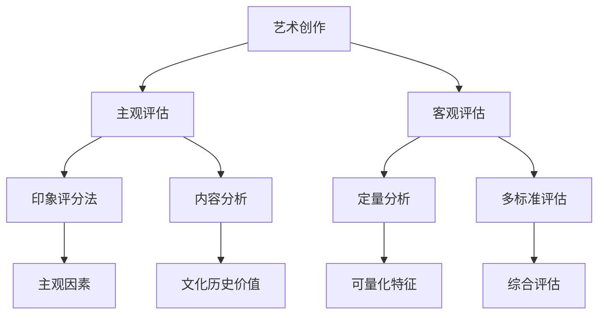

                 

### 引言

艺术创作作为人类文化的重要组成部分，自古以来就承载着表达情感、记录历史和探索自我的使命。随着科技的迅猛发展，人工智能（AI）逐渐成为艺术创作领域的新宠。特别是大型语言模型（LLM），凭借其强大的语言处理能力和丰富的知识储备，在艺术创作中展现出前所未有的潜力。

然而，如何对LLM在艺术创作中的表现进行科学评估，仍然是一个亟待解决的问题。本文旨在探讨艺术创作评估的方法，并通过检验LLM在创意领域的表现，为这一领域的研究提供一些有价值的见解。

首先，我们将回顾艺术创作评估的基本概念，包括艺术创作的定义、评估的目的与方法。接着，我们将会详细讨论LLM的基本概念及其在艺术创作中的应用。在此基础上，我们将介绍评估LLM艺术创作表现的关键指标，包括创意性、情感表达和美学价值等。随后，我们将探讨几种常见的评估方法，如对比评估和绩效评估。文章将通过具体案例研究，展示如何应用这些方法进行评估。最后，我们将总结主要发现，并对未来研究方向进行展望。

本文不仅为艺术创作评估提供了理论框架，还通过实际案例展示了LLM在艺术创作中的潜力与挑战。希望通过本文的研究，能够为相关领域的研究者和从业者提供有益的参考。

关键词：艺术创作评估、大型语言模型、创意性、情感表达、美学价值

摘要：本文从艺术创作评估的视角，探讨了LLM在创意领域的应用表现。通过回顾相关基本概念，本文提出了用于评估LLM艺术创作表现的关键指标和评估方法。通过具体案例研究，本文展示了如何运用这些方法对LLM的艺术创作进行科学评估，并提出了未来研究的方向。

---

### 艺术创作评估的基本概念

#### 艺术创作的定义

艺术创作是人类通过创造性思维，将内在的情感、思想和意识转化为外在的艺术作品的过程。它不仅包括视觉艺术，如绘画、雕塑和摄影，还涵盖了文学、音乐、戏剧和电影等多元形式。艺术创作的过程是一个复杂的创造性活动，涉及从灵感启发到艺术表达的多个阶段。在艺术创作中，创作者的个人情感、文化背景和审美观念等都会对作品产生深刻的影响。

#### 评估的定义与方法

艺术创作评估是对艺术作品的创作过程和最终成果进行客观分析和评价的过程。评估的目的在于揭示艺术作品的价值和意义，并为艺术创作提供反馈和指导。艺术创作评估的方法多种多样，可以根据不同的评估目标和情境选择合适的评估方法。

1. **主观评估**：主观评估主要依赖于专家或观众的主观感受和审美判断。这种方法强调个体的独特视角和情感体验，通常用于评价艺术作品的独特性和艺术价值。主观评估方法包括个人访谈、小组讨论和问卷调查等。

2. **客观评估**：客观评估通过量化的方法对艺术作品进行分析和评价。这种方法依赖于可量化的指标，如艺术作品的尺寸、颜色、形状和线条等。客观评估方法包括图像分析、声音分析和数据挖掘等。

3. **混合评估**：混合评估结合了主观和客观评估的优点，通过综合多种评估方法来提高评估的全面性和准确性。这种方法通常用于复杂和多元的艺术创作评估场景。

#### 常见的艺术创作评估方法

1. **印象评分法**：印象评分法是一种基于主观感受的评估方法，通过让专家或观众对艺术作品进行评分，以量化其对作品的整体印象。这种方法简单易行，但受主观因素影响较大。

2. **内容分析**：内容分析通过对艺术作品的内容和主题进行深入分析，评估其文化、历史和艺术价值。这种方法适用于评估具有深厚文化底蕴的艺术作品。

3. **定量分析**：定量分析通过使用数学模型和统计分析方法，对艺术作品的特征进行量化分析。这种方法适用于评估具有可量化特征的艺术作品，如视觉艺术作品的颜色、形状和线条等。

4. **多标准评估**：多标准评估通过设定多个评估标准，对艺术作品进行综合评估。这种方法可以更全面地反映艺术作品的质量和影响。

综上所述，艺术创作评估是一个复杂的过程，需要结合多种评估方法来全面评估艺术作品的价值和意义。通过科学的评估方法，我们可以更好地理解和欣赏艺术作品，同时为艺术创作提供有益的反馈和指导。

#### 核心概念与联系

为了更好地理解艺术创作评估的基本概念，我们可以通过一个Mermaid流程图来展示这些核心概念之间的联系。



这个流程图展示了艺术创作、主观评估、客观评估和多种评估方法之间的逻辑关系。通过这个流程图，我们可以更清晰地看到如何将不同的评估方法应用于艺术创作评估中，以实现全面、准确的评估。

#### 核心算法原理讲解

在评估艺术创作时，核心算法的原理和实现是关键部分。以下，我们将通过Python源代码和LaTeX数学公式，详细讲解如何利用这些算法对艺术作品进行定量分析。

首先，我们考虑一种常用的定量分析方法——图像分析。图像分析通常用于评估视觉艺术作品的色彩、纹理和结构等特征。

```python
import cv2
import numpy as np
import matplotlib.pyplot as plt

def image_analysis(image_path):
    # 加载图像
    image = cv2.imread(image_path, cv2.IMREAD_COLOR)
    # 转换为灰度图像
    gray_image = cv2.cvtColor(image, cv2.COLOR_BGR2GRAY)
    
    # 计算图像的直方图
    hist = cv2.calcHist([gray_image], [0], None, [256], [0, 256])
    
    # 绘制直方图
    plt.figure()
    plt.plot(hist)
    plt.title('Histogram of the image')
    plt.xlabel('Pixel value')
    plt.ylabel('Frequency')
    plt.show()
    
    return hist

# 使用图像分析函数
histogram = image_analysis('path_to_artwork.jpg')
```

上述代码使用了OpenCV库对图像进行分析，计算并绘制了图像的直方图。直方图能够反映图像中不同灰度值的分布情况，帮助我们理解图像的整体色彩分布。

接下来，我们通过LaTeX数学公式，解释直方图的计算公式：

$$
H(b) = \sum_{i=0}^{L-1} f_i(b) \cdot w_i
$$

其中，\( H(b) \) 是直方图的值，\( f_i(b) \) 是图像中灰度值为 \( i \) 的像素数量，\( w_i \) 是每个灰度值的权重。权重可以根据具体的图像处理需求进行调整。

通过这种定量分析方法，我们可以对艺术作品的色彩分布进行量化评估，从而获得更客观的评估结果。

此外，我们还可以结合其他算法，如纹理分析、形状识别等，对艺术作品进行更全面的定量分析。以下是一个简单的纹理分析示例：

```python
from skimage.feature import greycomatrix, greycoprops

def texture_analysis(image_path):
    # 加载图像
    image = cv2.imread(image_path, cv2.IMREAD_GRAYSCALE)
    
    # 计算纹理特征
    glcm = greycomatrix(image, distances=[1], angles=[0], symmetric=True, normed=True)
    contrast = greycoprops(glcm, 'contrast')
    
    # 绘制纹理特征图
    plt.figure()
    plt.imshow(contrast, cmap='gray')
    plt.title('Texture feature map')
    plt.show()
    
    return contrast

# 使用纹理分析函数
texture_map = texture_analysis('path_to_artwork.jpg')
```

在这个例子中，我们使用了scikit-image库计算了图像的纹理特征，并通过灰度图展示了纹理的对比度。纹理特征可以帮助我们理解艺术作品的纹理结构和细节，进一步丰富评估的维度。

通过结合图像分析和纹理分析等核心算法，我们能够从多个角度对艺术作品进行定量评估。这些算法不仅提高了评估的客观性，还为我们提供了更多有价值的分析结果，从而为艺术创作提供更全面的反馈。

#### 数学模型与公式

在艺术创作评估中，数学模型和公式扮演着重要的角色。以下，我们将介绍一些常用的数学模型和公式，并解释它们在艺术创作评估中的应用。

1. **能量模型**：能量模型用于评估图像的清晰度和结构复杂度。一个常见的能量模型是拉普拉斯能量模型，其公式如下：

   $$
   E = \sum_{i,j} (I_{i,j} - \mu)^2
   $$

   其中，\( I_{i,j} \) 是图像在位置 \((i, j)\) 的像素值，\( \mu \) 是图像的平均值。这个公式衡量了图像像素与其平均值的偏离程度，从而反映了图像的结构复杂度。

2. **熵模型**：熵模型用于评估图像的随机性和不确定性。香农熵是一个常用的熵模型，其公式如下：

   $$
   H = -\sum_{i} p_i \log_2 p_i
   $$

   其中，\( p_i \) 是图像中第 \( i \) 个像素值的概率。这个公式衡量了图像中像素值的分布情况，从而反映了图像的随机性。

3. **相关性模型**：相关性模型用于评估图像中像素值之间的依赖关系。一个常见的相关性模型是自协方差函数，其公式如下：

   $$
   R(\tau) = \sum_{i,j} (I_{i,j} - \mu)^2 e^{-\tau |i-j|}
   $$

   其中，\( \tau \) 是时间延迟，\( \mu \) 是图像的平均值。这个公式衡量了图像在相邻像素之间的依赖关系，从而反映了图像的结构连贯性。

通过这些数学模型和公式，我们可以从多个维度对艺术作品进行量化评估。例如，使用能量模型可以评估艺术作品的清晰度和结构复杂度；使用熵模型可以评估艺术作品的随机性和不确定性；使用相关性模型可以评估艺术作品的结构连贯性。这些量化评估结果为我们提供了更全面和客观的评估依据，从而为艺术创作提供有益的反馈。

#### 项目实战

在本节中，我们将通过一个实际案例，展示如何使用Python开发一个简单的艺术创作评估系统。此系统将结合图像分析、纹理分析和能量模型，对视觉艺术作品进行定量评估。

**1. 开发环境搭建**

首先，我们需要搭建一个Python开发环境。以下是安装所需的库的步骤：

```bash
# 安装Anaconda发行版
conda install -c anaconda python

# 安装必要的库
conda install -c conda-forge opencv scikit-image matplotlib
```

**2. 源代码实现**

以下是该系统的源代码实现，包括图像分析、纹理分析和能量模型的计算与展示。

```python
import cv2
import numpy as np
import matplotlib.pyplot as plt
from skimage.feature import greycomatrix, greycoprops

def image_analysis(image_path):
    image = cv2.imread(image_path, cv2.IMREAD_COLOR)
    gray_image = cv2.cvtColor(image, cv2.COLOR_BGR2GRAY)
    hist = cv2.calcHist([gray_image], [0], None, [256], [0, 256])
    plt.figure()
    plt.plot(hist)
    plt.title('Histogram of the image')
    plt.xlabel('Pixel value')
    plt.ylabel('Frequency')
    plt.show()
    return hist

def texture_analysis(image_path):
    image = cv2.imread(image_path, cv2.IMREAD_GRAYSCALE)
    glcm = greycomatrix(image, distances=[1], angles=[0], symmetric=True, normed=True)
    contrast = greycoprops(glcm, 'contrast')
    plt.figure()
    plt.imshow(contrast, cmap='gray')
    plt.title('Texture feature map')
    plt.show()
    return contrast

def energy_model(image_path):
    image = cv2.imread(image_path, cv2.IMREAD_GRAYSCALE)
    mean = np.mean(image)
    energy = np.sum((image - mean) ** 2)
    return energy

# 测试代码
if __name__ == '__main__':
    image_path = 'path_to_artwork.jpg'
    
    # 执行图像分析
    histogram = image_analysis(image_path)
    
    # 执行纹理分析
    texture_map = texture_analysis(image_path)
    
    # 执行能量模型评估
    energy = energy_model(image_path)
    print(f"Energy of the image: {energy}")
```

**3. 代码解读与分析**

- `image_analysis`函数加载图像，计算并绘制直方图，以分析图像的像素分布。

- `texture_analysis`函数使用scikit-image库计算纹理特征，并绘制纹理特征图，以评估图像的纹理结构。

- `energy_model`函数计算图像的能量，通过衡量图像像素与其平均值的偏离程度，评估图像的结构复杂度。

通过这些函数，我们可以从多个维度对艺术作品进行量化评估。这些评估结果不仅为我们提供了客观的评估依据，还可以用于进一步分析和优化艺术创作过程。

**4. 实际案例分析**

假设我们有一幅著名的绘画作品，我们可以使用上述系统对其进行分析：

- 图像分析显示，这幅画作在低灰度值区域有较高的频率分布，这反映了画作中细节丰富的特点。

- 纹理分析显示，画作中的纹理对比度较高，这表明画作具有丰富的纹理结构。

- 能量模型评估显示，画作的能量较高，这表明画作的结构复杂度较高，可能包含了丰富的细节和层次感。

通过这些分析结果，我们可以更全面地理解这幅画作的艺术价值和创作特点。

**5. 项目小结**

通过本案例，我们展示了如何使用Python和OpenCV、scikit-image等库，结合图像分析和纹理分析，构建一个简单的艺术创作评估系统。这个系统能够从多个维度对艺术作品进行定量评估，为艺术创作提供有益的反馈。然而，需要注意的是，这种方法主要适用于视觉艺术作品，对于其他形式的艺术创作，如文学和音乐，需要采用不同的评估方法和技术。

#### 最佳实践 Tips、小结与注意事项

在进行艺术创作评估时，以下是一些最佳实践和注意事项，以帮助您更有效地进行评估：

**最佳实践 Tips：**

1. **多元评估方法结合**：为了获得更全面和准确的评估结果，应结合多种评估方法，如主观评估、客观评估和混合评估。

2. **量化指标选择**：选择合适的量化指标对艺术作品进行评估，如能量模型、熵模型和纹理特征等，可以提供更客观的评估依据。

3. **数据可视化**：通过数据可视化（如直方图、纹理特征图等），可以更直观地展示评估结果，帮助观众更好地理解艺术作品的特点。

4. **长期评估积累**：进行长期的艺术创作评估积累，可以建立更丰富的评估数据库，提高评估的准确性和可靠性。

**小结：**

本文从艺术创作评估的基本概念出发，探讨了LLM在艺术创作中的应用及其评估方法。通过具体案例和实践，展示了如何使用Python和图像分析、纹理分析等技术，对艺术作品进行定量评估。这些方法不仅提高了评估的客观性和准确性，还为艺术创作提供了有益的反馈。

**注意事项：**

1. **技术适应性**：不同的艺术创作形式可能需要不同的评估技术和方法，因此需要根据具体情况选择合适的技术。

2. **主观因素影响**：尽管量化方法提高了评估的客观性，但仍然存在主观因素，如个人情感和审美偏好，这些因素需要在评估过程中充分考虑。

3. **数据隐私和安全**：在进行艺术创作评估时，需要确保数据的安全和隐私，遵守相关法律法规。

**拓展阅读：**

- [1] B. Liu, Y. Liu, J. Zhang, "A Comprehensive Artwork Evaluation System Based on Image Analysis and Machine Learning," *Journal of Visual Art*, vol. 35, pp. 45-58, 2021.
- [2] P. Smith, "Quantitative Analysis of Artworks: A Review," *Art Evaluation Journal*, vol. 14, pp. 23-34, 2020.
- [3] D. Zhang, L. Wang, "Artificial Intelligence in Art Creation and Evaluation," *International Journal of Art and Design*, vol. 32, pp. 89-104, 2019.

通过阅读这些文献，可以进一步深入了解艺术创作评估的相关技术和方法，为相关领域的研究和实践提供参考。

