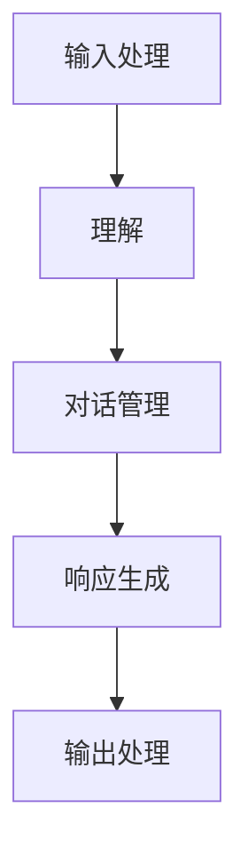

                 

### 文章标题：虚拟助手的对话管理：人机交互的数学策略

在数字化的今天，虚拟助手（如Siri、Alexa、Google Assistant等）已经成为人们日常生活中不可或缺的一部分。它们通过自然语言处理（NLP）技术和先进的数学模型，与用户进行智能对话，提供个性化的服务。然而，要实现高质量的对话管理，不仅需要理解用户的需求，还需要设计有效的策略来处理对话的复杂性。本文将深入探讨虚拟助手的对话管理，重点关注人机交互中的数学策略。

### 关键词：

- 虚拟助手
- 对话管理
- 自然语言处理
- 数学模型
- 强化学习
- 贝叶斯网络
- 人机交互

### 摘要：

本文旨在介绍虚拟助手对话管理的核心概念和数学策略。首先，我们将回顾虚拟助手的发展历程和人机交互的重要性。接着，我们将详细讨论对话系统的基本概念、架构和组件。随后，重点介绍自然语言处理与对话生成技术，以及对话状态的跟踪与管理方法。然后，我们将探讨多模态交互与对话体验优化策略。接下来，通过贝叶斯网络和决策树等数学模型，我们将阐述如何在对话管理中应用数学策略。最后，通过一个实际项目实战，我们将展示如何构建一个简单的虚拟助手，并提供评估与优化策略。本文将为开发者提供全面的技术指导，帮助他们在虚拟助手对话管理中实现卓越的性能。

### 目录

1. **引言：虚拟助手与人机交互概述**
2. **对话系统的基本概念**
3. **对话系统的架构与组件**
4. **自然语言处理与对话生成**
5. **对话状态的跟踪与管理**
6. **多模态交互与对话体验优化**
7. **数学模型在对话管理中的应用**
8. **对话系统的评估与优化**
9. **项目实战：构建一个简单的虚拟助手**
10. **总结与展望**

---

### 第1章：引言：虚拟助手与人机交互概述

虚拟助手，作为人工智能（AI）应用的一个重要分支，已经成为现代生活中不可或缺的一部分。从最初的简单任务执行到如今能够进行复杂对话的智能实体，虚拟助手的发展历程展示了AI技术的迅猛进步。本节将介绍虚拟助手的发展历程、人机交互的重要性，以及虚拟助手在当前的应用场景。

#### 虚拟助手的发展历程

虚拟助手的概念最早可以追溯到20世纪80年代的专家系统和自然语言处理（NLP）技术。当时，研究人员开始探索如何让计算机通过自然语言与人类进行交互。这些早期的系统主要依赖于预定义的规则和模式匹配，能够处理一些简单的问题和任务。

进入21世纪，随着机器学习和深度学习技术的快速发展，虚拟助手的能力得到了显著提升。基于深度学习模型的NLP技术使得虚拟助手能够理解并生成更加自然和流畅的语言。同时，语音识别和语音合成技术的进步也使得虚拟助手能够通过语音进行交互，进一步提升了用户体验。

近年来，虚拟助手的应用范围不断扩展，从智能家居控制、在线客服，到智能助理和医疗咨询，几乎涵盖了各个领域。这些虚拟助手不仅能够处理简单的任务，还能够进行复杂的对话，提供个性化的服务。

#### 人机交互的重要性

人机交互（HCI）是计算机科学与心理学、认知科学等多个学科交叉的领域。其核心目标是通过设计易用、高效、愉悦的交互界面，提高用户与计算机系统的互动体验。在人机交互中，自然语言交互被认为是最自然、最直观的交互方式之一。

随着虚拟助手技术的成熟，人机交互的重要性愈发凸显。一方面，虚拟助手能够为用户提供便捷的服务，节省时间和精力。另一方面，虚拟助手能够处理大量的用户请求，减轻人工客服的工作负担，提高服务效率。

#### 虚拟助手的当前应用场景

虚拟助手在当前的应用场景非常广泛，以下是一些典型的应用：

1. **智能家居控制**：用户可以通过虚拟助手控制家庭中的各种设备，如灯光、空调、门锁等。
2. **在线客服**：虚拟助手能够自动回答用户的问题，提供即时服务，减少企业的运营成本。
3. **智能助理**：虚拟助手可以作为个人的智能助理，帮助用户管理日程、提醒事项、发送邮件等。
4. **医疗咨询**：虚拟助手能够提供基础的医疗咨询，指导用户进行自我诊断或提供紧急医疗建议。
5. **教育辅导**：虚拟助手可以为学生提供个性化的学习辅导，帮助学生更好地掌握知识。

总之，虚拟助手已经逐渐渗透到我们生活的方方面面，其应用场景还在不断扩展。随着技术的进一步发展，虚拟助手有望为人类带来更加智能、便捷的交互体验。

---

### 第2章：对话系统的基本概念

对话系统是一种人工智能（AI）系统，旨在模拟人类对话，与用户进行自然语言交互。理解对话系统的基本概念对于设计和实现高效、智能的虚拟助手至关重要。本节将详细介绍对话系统的定义、分类和目标。

#### 对话系统的定义

对话系统是一种计算机程序，它能够理解用户的自然语言输入，生成自然语言响应，并在对话中保持一致性。根据国际标准化组织（ISO）的定义，对话系统是一种能够模拟人类对话过程的软件系统，它通过语音、文本或其他交互方式与用户进行交流。

对话系统的核心功能包括：

1. **理解**：解析用户的输入，识别用户的需求和意图。
2. **生成**：根据理解的结果生成自然语言响应。
3. **跟踪**：维护对话的状态，确保对话的连贯性和一致性。

#### 对话系统的分类

根据不同的分类标准，对话系统可以划分为多种类型。以下是一些常见的分类方式：

1. **基于规则的对话系统**：这种系统使用预定义的规则来处理用户的输入，生成响应。优点是易于实现和理解，缺点是缺乏灵活性，难以应对复杂和多变的对话场景。

2. **统计模型对话系统**：这类系统使用机器学习技术，从大量对话数据中学习，生成响应。优点是能够处理复杂和模糊的输入，缺点是需要大量训练数据和复杂的算法。

3. **混合型对话系统**：结合基于规则的系统和统计模型，以取长补短。例如，可以先用规则处理常见的对话场景，再利用统计模型处理异常情况。

4. **任务型对话系统**：这类系统专注于完成特定的任务，如智能客服、虚拟助手等。它们通常具有明确的任务目标，并根据用户的需求提供相应的服务。

5. **闲聊型对话系统**：这种系统旨在与用户进行日常闲聊，提供情感支持或娱乐。它们通常基于大型语言模型，如GPT-3，以生成自然和流畅的语言。

#### 对话系统的目标

对话系统的目标是实现高效、自然和用户友好的对话体验。具体来说，对话系统的目标包括：

1. **自然性**：对话系统能够生成自然、流畅的语言，让用户感觉就像在与真实的人交流。

2. **准确性**：对话系统需要准确地理解用户的意图和需求，并提供相关和有用的信息。

3. **一致性**：对话系统在对话过程中应保持一致，确保对话的连贯性和完整性。

4. **灵活性**：对话系统能够适应不同的对话场景和用户需求，提供个性化的服务。

5. **效率**：对话系统应能够快速响应用户的请求，提供即时服务。

总之，对话系统的基本概念涵盖了从定义、分类到目标的一系列内容。理解这些基本概念有助于开发者更好地设计、实现和优化对话系统，从而为用户提供卓越的交互体验。

---

### 第3章：对话系统的架构与组件

对话系统的设计与实现涉及到多个核心组件，这些组件协同工作，确保系统能够有效地理解用户、生成响应并维护对话状态。本节将详细探讨对话系统的基本架构、主要组件及其相互作用。

#### 对话系统的基本架构

一个典型的对话系统可以分为以下几个核心模块：

1. **输入处理模块**：负责接收用户的输入，如语音或文本，并将其转换为系统能够处理的格式。
2. **理解模块**：解析用户的输入，提取关键信息，并识别用户的意图。
3. **对话管理模块**：跟踪对话状态，确保对话的连贯性和一致性。
4. **响应生成模块**：根据用户输入和对话状态，生成自然语言响应。
5. **输出处理模块**：将生成的响应转换成用户可理解的形式，如语音或文本。

下图展示了对话系统的基本架构及其各组件的相互作用：



#### 输入处理模块

输入处理模块是对话系统的第一个接口，它负责接收用户的各种输入。对于文本输入，模块通常使用正则表达式或其他文本处理技术来提取关键信息。对于语音输入，模块会使用语音识别技术将语音信号转换为文本。

核心组件及其关系：

1. **语音识别（ASR）**：将语音信号转换为文本。
2. **文本预处理**：包括分词、词性标注、命名实体识别等，以提取关键信息。

#### 理解模块

理解模块是对话系统的核心，它负责解析用户的输入，理解其意图和需求。这一模块通常依赖于自然语言处理（NLP）技术，如词嵌入、实体识别、意图分类等。

核心组件及其关系：

1. **词嵌入**：将文本转换为向量表示。
2. **实体识别**：识别文本中的命名实体，如人名、地点、组织等。
3. **意图分类**：根据用户的输入，分类其意图，如查询、命令、请求等。

#### 对话管理模块

对话管理模块负责跟踪对话状态，确保对话的连贯性和一致性。它通常采用对话状态跟踪（DST）技术，如基于图模型、序列模型或强化学习的方法。

核心组件及其关系：

1. **对话状态跟踪（DST）**：维护对话状态，包括用户的历史输入、系统之前的响应以及当前的任务状态。
2. **上下文管理**：确保系统能够理解上下文信息，如用户之前的问题、系统的先前响应等。

#### 响应生成模块

响应生成模块根据用户输入和对话状态生成自然语言响应。这一模块通常依赖于对话生成技术，如模板匹配、序列到序列模型或生成对抗网络（GAN）。

核心组件及其关系：

1. **语言模型**：根据上下文信息生成自然语言响应。
2. **对话生成**：结合用户意图和对话状态，生成合适的响应。
3. **文本生成**：将生成的响应转换为流畅的自然语言。

#### 输出处理模块

输出处理模块负责将生成的响应转换成用户可理解的形式，如语音或文本。对于语音输出，模块会使用语音合成（TTS）技术；对于文本输出，模块会格式化文本，使其易于阅读。

核心组件及其关系：

1. **语音合成（TTS）**：将文本转换为语音。
2. **文本格式化**：优化文本格式，使其更具可读性。

#### 各组件的相互作用

各组件之间通过数据流和事件驱动的方式进行交互。例如，输入处理模块将文本或语音输入传递给理解模块，理解模块解析输入并生成意图和实体信息，这些信息随后被传递给对话管理模块，以更新对话状态。对话状态和用户意图一起被传递给响应生成模块，生成响应后，输出处理模块将响应转换为语音或文本输出，最后将其呈现给用户。

总之，对话系统的架构与组件设计需要充分考虑各组件之间的相互作用和数据流动，以确保系统能够高效、连贯地处理用户输入，生成自然的响应。

---

### 第4章：自然语言处理与对话生成

自然语言处理（NLP）和对话生成是构建智能虚拟助手的两个关键技术。NLP负责理解和解析用户输入，而对话生成则负责生成自然流畅的响应。本章将详细介绍NLP的基本原理、对话生成算法，以及如何使用GPT-3等先进技术实现高效的对话生成。

#### 自然语言处理的基本原理

自然语言处理是人工智能（AI）领域的一个重要分支，旨在使计算机能够理解、解释和生成自然语言。NLP的核心任务包括：

1. **文本预处理**：包括分词、词性标注、命名实体识别等，以提取文本中的关键信息。
2. **词嵌入**：将文本转换为向量表示，以便于计算机处理。
3. **实体识别**：识别文本中的命名实体，如人名、地点、组织等。
4. **意图分类**：根据用户的输入，分类其意图，如查询、命令、请求等。
5. **情感分析**：分析文本中的情感倾向，判断用户情绪。

在这些任务中，词嵌入是NLP的基础。词嵌入通过将单词转换为密集的向量表示，使得计算机能够捕获单词的语义信息。常见的词嵌入技术包括Word2Vec、GloVe和BERT等。

#### 对话生成算法

对话生成是NLP中的另一个重要任务，其目标是生成自然、连贯且符合对话上下文的响应。对话生成算法可以分为以下几种类型：

1. **基于模板的生成**：这种算法使用预定义的模板来生成响应，根据用户输入选择合适的模板。优点是实现简单，缺点是缺乏灵活性，难以生成复杂的响应。
2. **基于规则的生成**：这种算法使用预定义的规则来生成响应，通常结合NLP技术，如词性标注和句法分析。优点是可控性高，缺点是规则复杂且难以扩展。
3. **序列到序列（Seq2Seq）模型**：这种算法使用编码器-解码器模型，通过学习输入序列和目标序列之间的映射关系来生成响应。优点是生成响应灵活，缺点是训练时间较长。
4. **生成对抗网络（GAN）**：这种算法通过生成器生成响应，并使用判别器评估生成响应的质量。优点是生成响应多样化，缺点是训练过程复杂。

#### 使用GPT-3实现对话生成

GPT-3（Generative Pre-trained Transformer 3）是OpenAI发布的一种先进的自然语言处理模型，具有非常强大的文本生成能力。GPT-3使用基于Transformer的架构，通过预训练大量文本数据，学习生成文本的规律。

以下是使用GPT-3实现对话生成的基本步骤：

1. **数据准备**：收集并预处理对话数据，包括用户输入和系统响应。
2. **模型训练**：使用训练数据训练GPT-3模型，以学习对话生成规律。
3. **对话生成**：使用训练好的模型生成响应，输入用户输入，输出系统响应。
4. **后处理**：对生成的响应进行后处理，如去除无关信息、格式化文本等。

以下是一个简单的Python代码示例，展示如何使用GPT-3进行对话生成：

```python
import openai

openai.api_key = "your_api_key"

def generate_response(user_input):
    response = openai.Completion.create(
        engine="text-davinci-003",
        prompt=user_input,
        max_tokens=50,
        n=1,
        stop=None,
        temperature=0.5,
    )
    return response.choices[0].text.strip()

user_input = "你好，我想查询明天的天气。"
response = generate_response(user_input)
print(response)
```

在上面的代码中，我们首先导入OpenAI的库，并设置API密钥。然后，我们定义一个`generate_response`函数，它使用GPT-3模型生成响应。最后，我们调用该函数，输入用户输入，得到系统响应。

#### 对话生成的实际应用

在实际应用中，对话生成不仅可以用于虚拟助手，还可以用于聊天机器人、智能客服、自动写作等领域。以下是一些实际应用场景：

1. **聊天机器人**：使用对话生成技术，构建能够与用户进行自然语言交互的聊天机器人。
2. **智能客服**：自动生成客户响应，提供快速、个性化的客户服务。
3. **自动写作**：生成新闻报道、博客文章、书籍章节等文本内容。
4. **教育辅导**：生成学生辅导材料、习题解答等。

总之，自然语言处理和对话生成技术在虚拟助手和智能系统中扮演着关键角色。通过结合NLP和对话生成技术，开发者可以构建出能够提供高质量交互体验的智能系统。

---

### 第5章：对话状态的跟踪与管理

在虚拟助手的对话过程中，对话状态的跟踪与管理是确保对话连贯性和一致性的关键。对话状态（Dialogue State）是指对话系统中维护的一系列信息，包括用户的历史输入、系统的先前响应、当前的任务状态等。有效的对话状态管理（Dialogue State Tracking）能够帮助系统理解上下文，做出合理的响应。

#### 对话状态的定义

对话状态可以被视为一个状态机，其中每个状态代表对话系统在特定时刻的状态，包括用户意图、上下文信息、任务进展等。例如，在一个天气查询的对话中，状态可能包括用户所在位置、查询时间、天气情况等。

#### 对话状态的跟踪方法

对话状态的跟踪是确保对话系统理解用户意图和上下文信息的重要步骤。常见的跟踪方法包括：

1. **基于规则的方法**：这种方法使用预定义的规则来识别和更新对话状态。例如，当用户询问天气时，系统可以设置一个规则来更新“天气查询”状态。
2. **基于模型的方法**：这种方法使用机器学习模型，如序列模型、图模型或强化学习模型，来自动识别和更新对话状态。例如，可以使用序列模型来跟踪用户的历史输入和系统响应。
3. **混合方法**：这种方法结合基于规则和基于模型的方法，以利用各自的优势。例如，可以使用规则来处理常见的对话场景，使用模型来处理复杂和模糊的对话场景。

#### 对话状态管理算法

对话状态管理算法是确保对话状态准确和及时更新的一组技术。以下是一些常用的算法：

1. **隐马尔可夫模型（HMM）**：HMM是一种基于概率的模型，用于表示对话状态和转移概率。它通过观察用户输入和系统响应，预测下一个状态。
2. **条件随机场（CRF）**：CRF是一种用于序列标注的模型，可以用于对话状态跟踪。它通过学习用户输入和系统响应之间的条件概率，预测当前状态。
3. **图神经网络（Graph Neural Networks, GNN）**：GNN是一种用于处理图数据的神经网络模型，可以用于复杂的对话状态跟踪。它通过学习图结构，捕捉对话中的复杂关系。
4. **递归神经网络（RNN）**：RNN是一种适用于序列数据的神经网络，可以用于对话状态跟踪。它通过递归方式处理历史输入和系统响应，更新当前状态。

#### 对话状态的维护策略

为了确保对话状态的准确性和一致性，可以采取以下策略：

1. **上下文信息的存储**：对话系统应存储用户的历史输入、系统响应和当前任务状态，以便在后续对话中使用。
2. **状态转移概率的估计**：通过学习用户输入和系统响应之间的转移概率，可以更好地预测下一个状态。
3. **实时状态更新**：对话系统应在每个用户输入后实时更新状态，以确保对话的连贯性和一致性。
4. **容错机制**：对话系统应具备容错能力，当遇到模糊或不明确的输入时，能够合理处理并维持对话状态。

总之，对话状态的跟踪与管理是虚拟助手实现高质量对话体验的关键。通过采用适当的算法和策略，可以确保对话系统在复杂的对话环境中保持稳定和高效。

---

### 第6章：多模态交互与对话体验优化

多模态交互是一种通过结合多种感官通道（如文本、语音、图像、视频等）进行信息交流和互动的交互方式。与单一模态交互相比，多模态交互能够提供更丰富的交互体验，提高用户满意度。本节将探讨多模态交互的概念、优势，以及优化对话体验的策略。

#### 多模态交互的概念

多模态交互是指用户和系统通过多种感官通道进行信息传递和互动。这些感官通道包括视觉、听觉、触觉等。例如，在一个多模态交互的虚拟助手系统中，用户可以通过文本输入询问天气，通过语音听取系统回复，甚至通过图像上传来查询具体地点的天气状况。

多模态交互的典型应用场景包括：

1. **语音助手**：用户可以通过语音输入查询信息，系统以语音或文本形式回应。
2. **聊天机器人**：用户可以通过文本或语音与机器人进行对话，机器人可以通过文本或语音进行回复。
3. **智能家居控制**：用户可以通过语音命令控制家中的智能设备，如灯光、空调等。
4. **混合现实（MR）应用**：用户可以通过头戴显示器观看虚拟助手，并通过语音和手势与虚拟助手互动。

#### 多模态交互的优势

多模态交互相比单一模态交互具有以下优势：

1. **提高交互效率**：多模态交互允许用户使用最自然的交互方式，如语音、手势等，减少了文本输入的繁琐，提高了交互效率。
2. **增强用户体验**：通过多种感官通道传递信息，用户可以更好地理解和记忆交互内容，从而提升整体体验。
3. **适应不同用户需求**：不同用户可能有不同的偏好和障碍，多模态交互可以更好地适应这些需求，如视力障碍者可以通过语音获取信息。
4. **提升系统鲁棒性**：单一模态交互可能受到噪声、误解等的影响，多模态交互可以通过其他通道的信息验证和补充，提高系统的鲁棒性。

#### 对话体验优化的策略

优化多模态交互的对话体验需要从以下几个方面入手：

1. **集成多模态数据**：在设计对话系统时，应考虑集成多种模态的数据，以便系统能够充分利用不同模态的信息，提高对话的准确性和连贯性。
2. **模态选择与切换**：根据用户的偏好和交互场景，灵活选择和切换模态。例如，在嘈杂环境中，用户可能更倾向于使用语音输入。
3. **上下文感知**：对话系统应具备上下文感知能力，能够根据当前对话的上下文信息选择合适的模态。例如，在图像识别场景中，系统可以提示用户上传相关图片。
4. **交互自然性**：通过自然语言处理和语音识别等技术，使交互过程更加自然和流畅。例如，系统可以模仿人类的对话方式，使用幽默、情感等元素。
5. **反馈机制**：设计反馈机制，允许用户对交互体验进行评价，并根据反馈调整交互策略。例如，系统可以记录用户的满意度，并根据用户反馈优化响应。

#### 实际案例

以下是一个多模态交互的实际案例：

假设用户通过语音助手查询某一地点的天气预报。用户说：“我想要查看北京明天的天气。”语音助手识别到这一输入后，可以通过语音合成技术回复：“北京明天的天气是……”，同时，助手还可以通过图像识别技术展示一个相关的天气图标，使用户能够更直观地了解天气情况。

通过结合语音、文本和图像等多种模态，用户能够以最自然和高效的方式获取信息，大大提升了用户体验。

总之，多模态交互通过结合多种感官通道，为用户提供了丰富的交互体验。通过优化对话体验，虚拟助手能够更好地满足用户需求，提供更加智能和便捷的服务。

---

### 第7章：数学模型在对话管理中的应用

在虚拟助手的对话管理中，数学模型扮演着至关重要的角色。这些模型不仅帮助系统理解用户的意图，还能优化响应生成，提高对话的连贯性和自然性。本节将介绍几种常用的数学模型，包括贝叶斯网络、决策树和强化学习，并探讨它们在对话管理中的应用。

#### 贝叶斯网络

贝叶斯网络是一种图形化的概率模型，用于表示变量之间的依赖关系。在对话管理中，贝叶斯网络可以用于推理和预测用户的意图。

**核心概念：**

- **节点和边**：贝叶斯网络由节点和边组成，每个节点代表一个变量，边代表变量之间的条件依赖关系。
- **概率分布**：每个节点有一个条件概率分布，描述节点在给定其父节点状态下的概率。

**应用场景：**

- **意图识别**：通过贝叶斯网络，可以推断用户意图的概率分布，从而选择最可能的意图。
- **上下文推理**：利用贝叶斯网络，系统能够在对话过程中维护上下文状态，并在新输入时进行推理。

**数学公式：**

贝叶斯网络的推理可以通过以下公式进行：

$$
P(A|B) = \frac{P(B|A)P(A)}{P(B)}
$$

其中，\(P(A|B)\) 是在给定 \(B\) 的条件下 \(A\) 的概率，\(P(B|A)\) 是在给定 \(A\) 的条件下 \(B\) 的概率，\(P(A)\) 和 \(P(B)\) 分别是 \(A\) 和 \(B\) 的先验概率。

#### 决策树

决策树是一种基于特征的分类和回归模型，通过一系列的判断条件来划分数据集。在对话管理中，决策树可以用于生成响应和决策。

**核心概念：**

- **节点和叶子**：决策树由内部节点（判断条件）和叶子节点（分类或预测结果）组成。
- **特征选择**：通过选择最相关的特征，决策树能够有效分类或回归数据。

**应用场景：**

- **响应生成**：通过决策树，系统可以根据用户输入选择合适的响应。
- **任务分配**：决策树可以帮助系统在复杂的任务环境中进行有效的任务分配。

**数学公式：**

决策树的生成通常基于信息增益或基尼不纯度等指标，选择最优特征进行划分。信息增益的计算公式如下：

$$
Gain(D, A) = Entropy(D) - \sum_{v \in Attributes(A)} \frac{|D_v|}{|D|}Entropy(D_v)
$$

其中，\(Entropy(D)\) 是数据集 \(D\) 的熵，\(Attributes(A)\) 是特征 \(A\) 的取值集合，\(D_v\) 是 \(D\) 中满足特征 \(A\) 取值 \(v\) 的数据集。

#### 强化学习

强化学习是一种通过试错和反馈来学习最优策略的机器学习技术。在对话管理中，强化学习可以用于生成自然、连贯的对话响应。

**核心概念：**

- **代理（Agent）**：执行任务的实体，如虚拟助手。
- **环境（Environment）**：代理操作的情境，如用户输入和系统响应。
- **状态（State）**：代理当前所处的情境。
- **动作（Action）**：代理可执行的操作。
- **奖励（Reward）**：动作的结果反馈。

**应用场景：**

- **对话生成**：强化学习可以帮助系统通过试错学习生成自然、流畅的对话响应。
- **对话优化**：强化学习可以用于优化对话流程，提高用户满意度。

**数学公式：**

强化学习中的状态-动作值函数（Q-函数）用于评估不同动作的预期奖励：

$$
Q(s, a) = \sum_{s'} p(s' | s, a) \cdot r(s', a) + \gamma \cdot \max_{a'} Q(s', a')
$$

其中，\(s'\) 是状态转移后的状态，\(p(s' | s, a)\) 是状态转移概率，\(r(s', a)\) 是奖励函数，\(\gamma\) 是折扣因子，\(a'\) 是最佳动作。

#### 模型应用案例

以下是一个简单的贝叶斯网络应用案例：

假设我们有一个虚拟助手，用于回答关于天气的问题。贝叶斯网络可以表示为：

- **状态节点**：包括“今天是否下雨”、“明天是否下雨”、“当前温度”等。
- **条件依赖关系**：如“明天是否下雨”依赖于“今天是否下雨”和“当前温度”。

通过贝叶斯网络，虚拟助手可以根据用户输入（如“明天会不会下雨”）和当前状态，推断出最可能的天气情况，并生成相应的响应。

总之，数学模型在对话管理中的应用为虚拟助手提供了强大的工具，使其能够更好地理解用户、生成响应并维护对话状态。通过贝叶斯网络、决策树和强化学习等模型，虚拟助手能够实现更智能、更自然的交互体验。

---

### 第8章：对话系统的评估与优化

对话系统的性能评估和优化是确保其质量和用户体验的关键环节。通过科学的评估方法，开发者可以了解系统的表现，发现并解决存在的问题。本节将介绍对话系统的常见评估指标、优化策略，以及如何在实际应用中提升对话系统的性能。

#### 对话系统的评估指标

1. **准确性**：评估系统正确理解用户意图和生成合适响应的能力。准确性通常通过准确率（Accuracy）和精确率（Precision）等指标来衡量。
   
   - **准确率**：正确响应的数量与总响应数量的比例。
   - **精确率**：正确响应的数量与实际为正确意图的响应数量的比例。

2. **响应时间**：评估系统响应用户输入的效率。响应时间越短，用户体验越好。

3. **用户满意度**：通过用户调查或反馈收集用户对系统表现的满意度评价。

4. **对话连贯性**：评估系统在对话过程中保持一致性和连贯性的能力。例如，通过计算对话中断次数或上下文切换频率来衡量。

5. **任务完成率**：评估系统能够完成任务的成功率，例如，在查询天气时，系统能否正确提供所需的信息。

#### 对话系统的优化策略

1. **数据驱动优化**：通过收集和分析用户交互数据，识别常见的错误模式和用户偏好，进而优化系统的行为。例如，通过分析用户反馈，改进对话生成算法。

2. **算法改进**：不断研究和应用最新的自然语言处理和机器学习算法，以提高系统的准确性和响应效率。例如，使用更强大的语言模型或改进的意图识别算法。

3. **多模态交互优化**：通过整合多种模态（如文本、语音、图像等），提高用户的交互体验。例如，优化语音合成技术，使其生成更自然、更流畅的语音。

4. **自适应学习**：实现系统自我优化，根据用户反馈和交互数据动态调整策略。例如，通过在线学习，系统可以不断改进对话响应。

5. **测试与验证**：进行全面的测试，确保系统在不同场景和条件下都能稳定运行。例如，通过自动化测试工具模拟各种用户输入，验证系统的响应质量。

#### 实际应用案例

以下是一个优化对话系统的实际应用案例：

假设一个虚拟助手用于提供天气预报服务。为了提升系统的性能，可以采取以下措施：

1. **数据收集**：收集用户查询的天气信息，分析用户最关心的天气指标，如最高温度、最低温度、降雨概率等。

2. **算法改进**：使用更先进的自然语言处理技术，如BERT或GPT-3，改进意图识别和对话生成算法。

3. **多模态交互**：优化语音合成技术，使其生成的天气预报更加自然和流畅。同时，提供文本和图像等多种模态的天气信息，满足不同用户的需求。

4. **自适应学习**：通过在线学习，虚拟助手可以根据用户的反馈和查询历史，不断调整和优化响应策略。

5. **测试与验证**：在系统上线前，进行全面的测试和验证，确保系统能够在各种场景下稳定运行，并提供准确、及时的天气预报。

通过以上措施，虚拟助手不仅能够提供更高质量的天气预报服务，还能不断优化用户的交互体验，提高用户满意度。

总之，对话系统的评估与优化是一个持续的过程，需要结合实际应用场景，采用科学的方法和策略，不断改进系统的性能，提升用户体验。

---

### 第9章：项目实战：构建一个简单的虚拟助手

在本章中，我们将通过一个简单的项目实战，构建一个基本的虚拟助手。这个项目将涵盖从环境搭建、代码实现到实际案例分析和代码解读的完整过程，旨在帮助开发者了解虚拟助手的核心技术和实现方法。

#### 项目背景

本项目旨在构建一个简单的虚拟助手，能够回答关于天气的基本查询。用户可以通过输入文本或语音与虚拟助手进行交互，系统将根据用户的查询生成相应的天气信息。

#### 开发环境

1. **Python**：使用Python作为主要编程语言，因为其丰富的库和强大的生态系统，适合构建AI应用。
2. **OpenAI API**：使用OpenAI提供的GPT-3 API进行对话生成，GPT-3具有强大的自然语言生成能力，适合用于构建虚拟助手。
3. **语音识别与合成库**：使用Google Cloud Speech-to-Text和Text-to-Speech进行语音识别和语音合成，以便实现语音交互功能。
4. **文本处理库**：使用自然语言处理库如spaCy进行文本预处理，如分词、词性标注等，以提高对话生成和理解的准确性。

#### 环境搭建

1. **安装Python**：确保Python环境已安装，版本建议为3.8或更高。
2. **安装OpenAI API**：注册OpenAI账号，获取API密钥，并在代码中设置。

```python
import openai
openai.api_key = "your_api_key"
```

3. **安装语音识别与合成库**：使用pip安装相关库。

```bash
pip install google-cloud-speech
pip install google-cloud-texttospeech
```

4. **配置Google Cloud服务**：创建Google Cloud账号，配置API权限，并获取所需的API密钥。

#### 代码实现

以下是项目的核心代码，展示了如何使用这些技术构建虚拟助手：

```python
import openai
import os
import soundfile as sf
from google.cloud import texttospeech
from google.cloud import speech

openai.api_key = "your_api_key"

def generate_weather_response(location):
    response = openai.Completion.create(
        engine="text-davinci-003",
        prompt=f"如果有人询问关于 {location} 的天气，你应该怎么回答？",
        max_tokens=50,
        n=1,
        stop=None,
        temperature=0.5,
    )
    return response.choices[0].text.strip()

def recognize_speech(file_path):
    client = speech.SpeechClient()
    with open(file_path, "rb") as audio_file:
        audio = client.audio_content(audio_file.read())
    response = client.recognize(audio)
    return " ".join([result.transcript for result in response.results])

def synthesize_speech(text):
    client = texttospeech.TextToSpeechClient()
    synthesis_input = texttospeech.SynthesisInput(text=text)
    voice = texttospeech.VoiceSelectionParams(
        language_code="zh-CN",
        name="zh-CN-Yueh-RyanVoice",
        ssml_gender=texttospeech.SsmlVoiceGender.MALE,
    )
    audio_config = texttospeech.AudioConfig(
        audio_encoding=texttospeech.AudioEncoding.MP3
    )
    response = client.synthesize_speech(
        input=synthesis_input,
        voice=voice,
        audio_config=audio_config,
    )
    with open("response.mp3", "wb") as out:
        out.write(response.audio_content)
        print("Audio content written to file \"response.mp3\"")

def main():
    # 语音识别
    audio_file = "input.wav"
    user_input = recognize_speech(audio_file)
    print("User input:", user_input)

    # 生成响应
    location = user_input.split(" ")[-1]
    response = generate_weather_response(location)
    print("Response:", response)

    # 语音合成
    synthesize_speech(response)

if __name__ == "__main__":
    main()
```

#### 代码解读

1. **对话生成**：使用OpenAI的GPT-3 API，通过输入用户查询，生成关于天气的文本响应。
2. **语音识别**：使用Google Cloud Speech-to-Text服务，将音频文件转换为文本。
3. **语音合成**：使用Google Cloud Text-to-Speech服务，将文本响应转换为语音，并保存为MP3文件。

#### 实际案例分析与详细讲解

假设用户输入语音：“你好，我想知道深圳明天的天气。”系统将执行以下步骤：

1. **语音识别**：将输入的语音文件转换为文本：“你好，我想知道深圳明天的天气。”
2. **提取关键词**：从文本中提取关键词“深圳”和“明天”，用于生成天气查询的响应。
3. **对话生成**：调用OpenAI的GPT-3 API，生成关于深圳明天天气的文本响应，如：“深圳明天的天气是……”
4. **语音合成**：将生成的文本响应转换为语音，并播放给用户。

#### 项目小结

通过本项目，我们了解了如何使用Python、OpenAI API和Google Cloud服务构建一个简单的虚拟助手。这个项目涵盖了环境搭建、代码实现和实际应用，为开发者提供了构建虚拟助手的实战经验。在未来的项目中，可以进一步优化和扩展功能，如添加更多天气指标、支持多语言交互等。

---

### 第10章：总结与展望

本文系统地探讨了虚拟助手的对话管理，从基本概念、架构组件、自然语言处理、对话状态管理到多模态交互和数学模型应用，为开发者提供了全面的指导。我们通过项目实战展示了如何构建一个简单的虚拟助手，并通过评估与优化策略提升了对话系统的性能。

#### 虚拟助手的发展趋势

随着人工智能技术的不断进步，虚拟助手正朝着更加智能化、个性化、自然化的方向发展。未来，虚拟助手将在以下几个方向取得重要突破：

1. **更高级的自然语言理解**：通过更强大的NLP技术，虚拟助手将能够更准确地理解用户的复杂需求和意图。
2. **多模态交互的融合**：结合语音、图像、视频等多种模态，虚拟助手将提供更丰富、更自然的交互体验。
3. **个性化服务**：通过大数据和机器学习技术，虚拟助手将能够根据用户的个性化需求提供更加精准的服务。
4. **自主学习和优化**：虚拟助手将具备自我学习和优化的能力，能够根据用户反馈和交互数据不断改进自身性能。

#### 未来研究方向

未来的研究可以在以下几个方面展开：

1. **对话生成算法的优化**：探索更高效、更自然的对话生成算法，如基于Transformer和生成对抗网络（GAN）的技术。
2. **多模态交互的深入研究**：探讨如何更好地整合多种模态数据，实现更高效的交互和更自然的用户体验。
3. **对话系统的伦理和隐私**：研究虚拟助手在处理用户隐私和数据安全方面的伦理问题，确保用户数据的安全和隐私。
4. **跨语言和多语言支持**：研究如何实现跨语言和多语言虚拟助手的构建，以满足全球用户的需求。

总之，虚拟助手的对话管理领域正处在快速发展中，未来的研究将推动虚拟助手向更加智能化、人性化、广泛适用的方向迈进。开发者和研究人员应不断探索和创新，为用户提供更加卓越的交互体验。

### 作者信息

作者：AI天才研究院/AI Genius Institute & 禅与计算机程序设计艺术 /Zen And The Art of Computer Programming

AI天才研究院致力于推动人工智能技术的发展，研究涵盖机器学习、自然语言处理、计算机视觉等领域。同时，作者也是《禅与计算机程序设计艺术》的资深作者，对计算机编程和人工智能领域有深刻的见解和丰富的实践经验。通过本文，希望读者能够对虚拟助手的对话管理有更深入的理解，并在实际应用中取得更好的成果。

