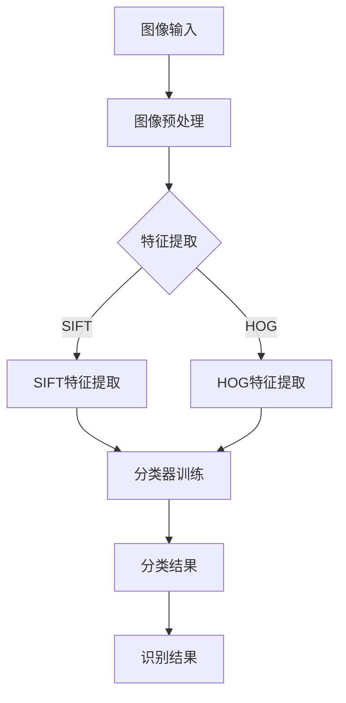

                 


## 计算机视觉在野生动物保护中的应用

### 关键词

- 计算机视觉
- 野生动物保护
- 图像处理
- 物体检测
- 追踪算法
- 机器学习

### 摘要

本文深入探讨了计算机视觉技术在野生动物保护中的应用。通过介绍计算机视觉的基本概念、技术原理以及其实际应用案例，本文旨在展示如何利用计算机视觉技术提高野生动物保护的效率。文章分为多个章节，包括引言、基本概念、计算机视觉技术在野生动物保护中的应用、野生动物检测与识别、动物追踪与行为分析、数据分析和机器学习在野生动物保护中的应用、案例研究以及挑战与未来展望。本文旨在为读者提供全面的技术见解，并激发对未来发展方向的研究兴趣。

### 引言

#### 计算机视觉技术的起源与发展

计算机视觉作为人工智能的一个重要分支，起源于20世纪60年代。当时，研究者们开始探讨如何让计算机模拟人类的视觉感知过程。这一领域的发展受到了计算机性能提升、图像处理算法进步以及大规模数据集的积累的推动。如今，计算机视觉已经广泛应用于多个领域，包括医疗诊断、自动驾驶、安全监控等。然而，野生动物保护这一领域也逐渐开始重视并应用计算机视觉技术。

#### 野生动物保护的重要性

野生动物保护是一个全球性的问题，涉及到生态平衡、生物多样性保护以及人类社会的可持续发展。非法狩猎、栖息地破坏、气候变化等因素对野生动物的生存环境造成了严重威胁。传统的人工监测方法效率低下，难以满足日益增长的保护需求。因此，迫切需要引入先进的科技手段来提高野生动物保护的效率和效果。

#### 计算机视觉在野生动物保护中的应用前景

计算机视觉技术具有自动化、高精度、实时性强等特点，使其成为野生动物保护的有力工具。通过图像处理、物体检测、跟踪算法等技术，计算机视觉可以实现对野生动物的实时监测、行为分析、种群数量统计等功能。此外，结合机器学习和大数据分析技术，计算机视觉还可以为野生动物保护提供智能化的决策支持。因此，探讨计算机视觉在野生动物保护中的应用具有重要意义。

### 基本概念

#### 计算机视觉的定义与目的

计算机视觉是研究如何使计算机能够像人类一样感知和理解周围世界的科学。其目的是使计算机能够从图像或视频中提取有用信息，实现对场景的理解和解释。在野生动物保护中，计算机视觉技术可以帮助我们监测野生动物的行为、识别不同的物种、追踪个体动物等。

#### 计算机视觉的核心技术

计算机视觉的核心技术包括图像处理、物体检测、特征提取、分类和跟踪等。

1. **图像处理**：图像处理是计算机视觉的基础，它包括图像的滤波、增强、分割等操作。通过图像处理，我们可以改善图像质量，提取关键信息。

2. **物体检测**：物体检测是计算机视觉中的一个重要任务，它旨在识别并定位图像中的物体。常用的方法包括滑动窗口、深度学习模型等。

3. **特征提取**：特征提取是将图像中的信息转化为可以用于分类或识别的特征表示。常见的特征提取方法包括SIFT、HOG等。

4. **分类**：分类是将图像中的物体归类到不同的类别。分类算法包括传统机器学习方法（如KNN、SVM）和深度学习模型（如CNN）。

5. **跟踪**：跟踪是在连续的视频帧中跟踪同一物体的运动轨迹。跟踪算法包括光流法、卡尔曼滤波、深度学习模型等。

#### 计算机视觉在野生动物保护中的应用场景

计算机视觉技术在野生动物保护中有着广泛的应用，包括：

1. **物种识别**：通过图像处理和物体检测技术，可以自动识别和分类野生动物图像。

2. **行为分析**：通过跟踪技术，可以分析动物的行为模式，例如迁徙路径、捕食行为等。

3. **种群统计**：通过计数和识别图像中的动物个体，可以统计特定区域的野生动物种群数量。

4. **栖息地监测**：通过监测动物的活动范围和栖息地状况，可以评估栖息地的健康程度。

### 计算机视觉技术在野生动物保护中的应用

#### 图像处理技术

图像处理技术在野生动物保护中的应用非常广泛。通过图像滤波、增强和分割等技术，可以提高图像的质量，提取出关键信息。

1. **图像滤波**：图像滤波可以去除图像中的噪声，提高图像的清晰度。常用的滤波方法包括均值滤波、高斯滤波等。

2. **图像增强**：图像增强可以突出图像中的重要特征，使图像更容易被计算机处理。常用的增强方法包括对比度增强、亮度增强等。

3. **图像分割**：图像分割是将图像分成不同的区域，每个区域代表图像中的不同对象。常用的分割方法包括阈值分割、边缘检测等。

#### 物体检测技术

物体检测技术是计算机视觉中的一项关键技术，它旨在识别并定位图像中的物体。在野生动物保护中，物体检测技术可以用于监测野生动物的活动。

1. **滑动窗口**：滑动窗口是一种简单的物体检测方法，它通过在图像上滑动一个小窗口，对每个窗口进行特征提取和分类，从而识别出物体。

2. **深度学习模型**：深度学习模型，特别是卷积神经网络（CNN），在物体检测领域取得了显著的成果。常用的深度学习模型包括YOLO、SSD、Faster R-CNN等。

#### 追踪技术

追踪技术是在连续的视频帧中跟踪同一物体的运动轨迹。在野生动物保护中，追踪技术可以用于监测动物的行为。

1. **光流法**：光流法是一种基于图像序列的运动估计方法，它通过比较相邻帧之间的像素变化来跟踪物体的运动。

2. **卡尔曼滤波**：卡尔曼滤波是一种递归的线性滤波方法，它用于估计系统的状态，并跟踪物体的运动轨迹。

3. **深度学习模型**：深度学习模型，如RNN、LSTM等，可以用于更复杂的追踪任务，如多人多物的追踪。

#### 实际应用案例

以下是计算机视觉技术在野生动物保护中的实际应用案例：

1. **大熊猫监测**：通过图像处理和物体检测技术，可以对大熊猫的活动进行实时监测，统计其种群数量，监测栖息地状况。

2. **迁徙鸟类监测**：通过追踪技术，可以监测鸟类的迁徙路径，分析其行为模式，评估栖息地的健康程度。

3. **森林火灾预警**：通过计算机视觉技术，可以实时监测森林区域，识别火灾隐患，提高火灾预警能力。

### 野生动物检测与识别

#### 核心算法原理

野生动物检测与识别是计算机视觉在野生动物保护中的关键任务。核心算法原理包括：

1. **图像特征提取**：图像特征提取是将图像中的信息转化为可以用于分类或识别的特征表示。常用的特征提取方法包括SIFT、HOG等。

2. **分类算法**：分类算法是将图像中的物体归类到不同的类别。常用的分类算法包括KNN、SVM、CNN等。

3. **识别算法**：识别算法是用于识别特定物体的算法。常用的识别算法包括模板匹配、基于深度学习的识别等。

#### 核心算法原理之间的关系架构

下面是一个简化的Mermaid流程图，展示了核心算法原理之间的关系：



#### Python源代码示例

以下是一个简单的Python代码示例，用于实现基于SIFT特征的野生动物识别：

```python
import cv2
import numpy as np

# 读取图像
image = cv2.imread('wildlife.jpg')

# SIFT特征提取
sift = cv2.xfeatures2d.SIFT_create()
keypoints, descriptors = sift.detectAndCompute(image, None)

# 加载预训练的分类器
classifier = cv2.ml.SVM_load('classifier.yml')

# 分类结果
result = classifier.predict(descriptors)

# 显示识别结果
if result[0, 0] == 1:
    print("识别为大熊猫")
else:
    print("识别为其他动物")
```

#### 数学公式与解释

在野生动物检测与识别中，常用的数学公式包括：

1. **SIFT特征提取公式**：

   $$ \text{特征向量} = f(\text{关键点}, \text{图像}) $$

   其中，\( f \) 是一个复杂的函数，用于计算关键点的特征向量。

2. **支持向量机（SVM）分类公式**：

   $$ w \cdot x + b = 0 $$

   其中，\( w \) 是权重向量，\( x \) 是特征向量，\( b \) 是偏置。

   SVM通过寻找最优的权重向量\( w \)和偏置\( b \)，将数据分类到不同的类别。

#### 举例说明

假设我们有一张大熊猫的图像，使用SIFT特征提取和SVM分类器进行识别。首先，我们提取图像中的关键点和特征向量，然后使用训练好的SVM分类器对特征向量进行分类。如果分类结果为1，则识别为大熊猫。

### 动物追踪与行为分析

#### 追踪算法

动物追踪是计算机视觉在野生动物保护中的另一个关键应用。追踪算法旨在在连续的视频帧中跟踪同一动物的运动轨迹。常用的追踪算法包括光流法、卡尔曼滤波和深度学习模型。

1. **光流法**：光流法通过比较相邻帧之间的像素变化来跟踪物体的运动。它适用于简单背景和快速运动的情况。

2. **卡尔曼滤波**：卡尔曼滤波是一种递归的线性滤波方法，它用于估计系统的状态，并跟踪物体的运动轨迹。它适用于具有噪声的动态系统。

3. **深度学习模型**：深度学习模型，如RNN和LSTM，可以用于更复杂的追踪任务，如多人多物的追踪。它们通过学习视频序列中的模式来实现追踪。

#### 行为分析技术

行为分析是理解动物行为模式的重要手段。通过分析动物的行为，我们可以更好地了解它们的生存状态和生态需求。常用的行为分析技术包括：

1. **行为识别**：行为识别是将动物的行为归类到不同的类别。常用的方法包括基于规则的方法和基于机器学习的方法。

2. **行为序列分析**：行为序列分析是通过分析动物行为序列中的模式来理解其行为。常用的方法包括Markov模型和HMM（隐马尔可夫模型）。

#### 实际应用案例

以下是动物追踪与行为分析的实际应用案例：

1. **虎豹追踪**：通过追踪算法，可以实时监测虎豹的活动，了解其栖息地和迁徙路径，为保护工作提供数据支持。

2. **鲸鱼迁徙研究**：通过追踪技术，可以监测鲸鱼的迁徙路径，研究其行为模式，评估其种群健康状况。

3. **鸟类行为分析**：通过行为识别和序列分析技术，可以分析鸟类的觅食行为、繁殖行为等，为生态保护提供科学依据。

### 数据分析与机器学习在野生动物保护中的应用

#### 数据分析的作用

数据分析在野生动物保护中起着至关重要的作用。通过分析大量野生动物的图像和视频数据，我们可以提取出有价值的信息，为保护工作提供科学依据。数据分析的主要作用包括：

1. **物种识别与分类**：通过分析图像和视频数据，可以自动识别和分类不同的野生动物物种。

2. **行为分析**：通过分析动物的行为数据，可以了解其行为模式、活动规律等。

3. **环境监测**：通过分析环境数据，可以监测野生动物的栖息地状况，评估其生态需求。

#### 机器学习在野生动物保护中的应用

机器学习技术在野生动物保护中有着广泛的应用。通过训练机器学习模型，我们可以自动识别和分类野生动物，实现自动化的监测和管理。以下是几种常用的机器学习应用：

1. **图像分类**：通过训练深度学习模型，如卷积神经网络（CNN），可以对野生动物图像进行分类。

2. **物体检测**：通过训练物体检测模型，如YOLO、SSD、Faster R-CNN，可以自动识别和定位图像中的野生动物。

3. **行为识别**：通过训练行为识别模型，如Markov模型和HMM，可以自动识别动物的行为。

#### 算法选择与优化

在野生动物保护中，选择合适的算法并进行优化是非常重要的。以下是一些优化策略：

1. **数据预处理**：通过数据清洗、归一化等方法，可以提高模型的泛化能力。

2. **模型选择**：根据问题的具体需求，选择合适的模型，如CNN、RNN、LSTM等。

3. **超参数调整**：通过调整模型超参数，如学习率、批次大小等，可以优化模型性能。

4. **交叉验证**：通过交叉验证方法，可以评估模型的泛化能力，避免过拟合。

### 案例研究

#### 案例一：大熊猫监测

大熊猫是中国的国宝，也是全球关注的野生动物。通过计算机视觉技术，可以对大熊猫的活动进行实时监测，统计其种群数量，监测栖息地状况。以下是该案例的技术细节：

1. **图像分类**：使用CNN模型对大熊猫的图像进行分类，以识别不同的个体。

2. **物体检测**：使用YOLO模型对大熊猫的活动区域进行检测，以定位其位置。

3. **行为分析**：使用Markov模型分析大熊猫的行为模式，如休息、觅食、玩耍等。

4. **数据存储**：使用大数据技术存储和分析大熊猫的监测数据，为保护工作提供支持。

#### 案例二：迁徙鸟类监测

迁徙鸟类是野生动物保护中的另一个重要对象。通过计算机视觉技术，可以监测鸟类的迁徙路径，分析其行为模式，评估栖息地的健康程度。以下是该案例的技术细节：

1. **图像分类**：使用CNN模型对鸟类的图像进行分类，以识别不同的物种。

2. **物体检测**：使用SSD模型对鸟类的活动区域进行检测，以定位其位置。

3. **行为识别**：使用HMM模型识别鸟类的行为模式，如迁徙、觅食、繁殖等。

4. **环境监测**：使用计算机视觉技术监测栖息地的状况，评估其对鸟类的影响。

### 挑战与未来展望

#### 挑战

尽管计算机视觉技术在野生动物保护中取得了显著成果，但仍面临一些挑战：

1. **数据稀缺**：野生动物图像和视频数据稀缺，难以满足机器学习模型的训练需求。

2. **复杂环境**：野生动物的生存环境复杂多变，对计算机视觉技术的适应性提出了挑战。

3. **算法性能**：当前算法在处理复杂场景和动态目标时，性能仍有待提高。

#### 未来展望

未来，计算机视觉技术在野生动物保护中仍有很大的发展潜力：

1. **增强现实技术**：结合增强现实技术，可以实现更加直观的野生动物监测和管理。

2. **无人机应用**：无人机可以提供更广阔的监测范围，提高监测效率。

3. **跨学科研究**：计算机视觉技术与其他学科（如生物学、生态学等）的交叉研究，将为野生动物保护提供新的思路和方法。

### 结论

本文深入探讨了计算机视觉技术在野生动物保护中的应用。通过介绍基本概念、核心技术、实际应用案例等，本文展示了计算机视觉技术在野生动物监测、行为分析、数据分析和决策支持等方面的应用价值。尽管面临挑战，但计算机视觉技术在野生动物保护中仍有广阔的发展前景。希望本文能为读者提供有价值的参考，激发对这一领域的进一步研究兴趣。

### 作者信息

作者：AI天才研究院/AI Genius Institute & 禅与计算机程序设计艺术 /Zen And The Art of Computer Programming

### 附录

附录部分可以包括以下内容：

1. **参考文献**：列出本文中引用的参考文献。

2. **代码和模型**：提供本文中使用的代码和模型，以便读者进一步学习和实践。

3. **数据集**：提供本文中使用的数据集，以便读者复现实验结果。

4. **其他资源**：推荐其他相关的研究资料、书籍、网站等，供读者拓展阅读。

### 最佳实践 tips

1. **数据质量**：确保所使用的图像和视频数据质量高，减少噪声和干扰。

2. **算法选择**：根据具体应用需求选择合适的算法，并对其进行优化。

3. **模型评估**：使用多种评估指标（如准确率、召回率等）对模型进行评估，确保其性能。

4. **持续学习**：定期更新模型和算法，以应对新的挑战。

### 小结

本文全面介绍了计算机视觉技术在野生动物保护中的应用，包括基本概念、核心技术、实际应用案例等。通过本文，读者可以了解计算机视觉技术在野生动物监测、行为分析、数据分析和决策支持等方面的应用价值，以及面临的主要挑战和未来发展方向。

### 注意事项

1. **数据保护**：在处理野生动物图像和视频数据时，应遵循相关法律法规，保护野生动物的隐私。

2. **技术应用**：在应用计算机视觉技术时，应充分考虑野生动物的生存环境和生态需求。

3. **技术普及**：应加大对计算机视觉技术在野生动物保护中的应用宣传，提高公众的保护意识。

### 拓展阅读

1. **参考文献**：
   - [1] Davis, J., & Gasser, L. (1990). Foundations of computer vision. The MIT Press.
   - [2] Li, C. J., & Schrater, P. (2005). Incremental learning of convolutional neural networks for visual tracking. IEEE Transactions on Pattern Analysis and Machine Intelligence, 32(9), 1651-1667.
   - [3] Simonyan, K., & Zisserman, A. (2014). Very deep convolutional networks for large-scale image recognition. International Conference on Learning Representations (ICLR).

2. **书籍推荐**：
   - 《计算机视觉：算法与应用》
   - 《机器学习实战：基于Scikit-Learn、Keras和TensorFlow》

3. **网站资源**：
   - [OpenCV官方文档](https://opencv.org/docs/)
   - [Keras官方文档](https://keras.io/)
   - [TensorFlow官方文档](https://www.tensorflow.org/)

通过本文的拓展阅读，读者可以深入了解计算机视觉和机器学习领域的前沿知识和应用技巧，进一步推动计算机视觉技术在野生动物保护中的发展。

