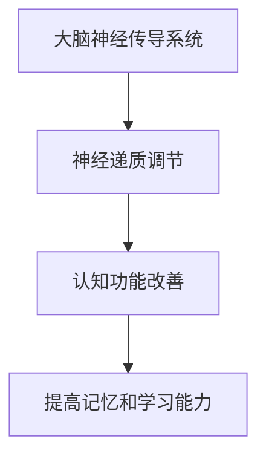
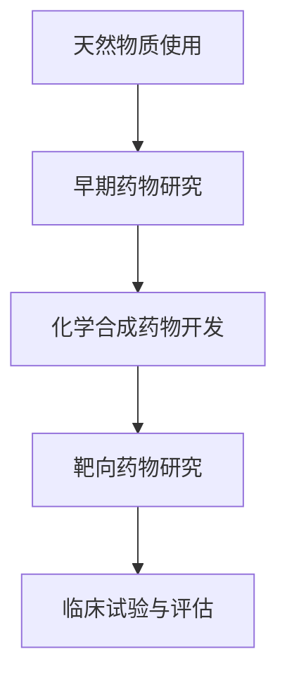
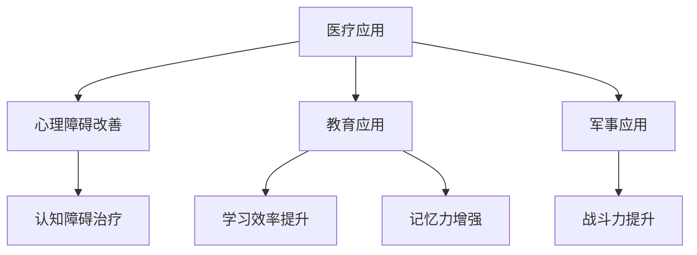

                 

### 1.1 认知增强药物的定义与分类

**背景介绍**

认知增强药物是指那些能够通过调节神经递质、增强大脑功能和提高认知能力的药物。这类药物的研究和应用在近年来引起了广泛的关注，因为它们在提高工作效率、改善学习能力和治疗某些神经精神疾病方面具有巨大的潜力。

**核心概念与联系**

认知增强药物主要作用于大脑的神经传导系统，通过调节神经递质的水平来改善认知功能。神经递质是一种化学物质，它们在神经元之间传递信息，影响着记忆、学习、情绪和注意力等认知功能。

以下是一个简化的认知增强药物作用原理的 Mermaid 流程图：



在这个流程图中，A 表示大脑的神经传导系统，B 表示认知增强药物通过调节神经递质来发挥作用，C 表示认知功能得到改善，D 表示最终目的是提高记忆和学习能力。

**核心算法原理讲解**

认知增强药物的核心作用机制通常涉及以下几个方面：

1. **神经递质调控**：药物可以通过增加或减少特定神经递质的水平来调节神经元的活动。
2. **突触可塑性增强**：药物可以促进突触可塑性，即神经元之间的连接可以随着经验而改变，从而提高认知能力。
3. **神经保护作用**：某些药物可以通过减少氧化应激和炎症反应，保护神经元免受损伤。

以下是一个简化的 Python 代码示例，用于说明如何通过调节神经递质水平来模拟认知增强药物的作用：

```python
# 模拟神经递质调节过程
neurotransmitters = ['多巴胺', '乙酰胆碱', '去甲肾上腺素']

# 认知增强药物增加多巴胺水平
neurotransmitters['多巴胺'] += 10

# 显示调节后的神经递质水平
print("调节后的神经递质水平：", neurotransmitters)
```

在这个示例中，我们创建了一个包含三种神经递质的列表，并使用认知增强药物来增加多巴胺的水平。这反映了认知增强药物通过调控特定神经递质来改善认知功能的原理。

**数学模型与公式**

认知增强药物的效果可以通过多种数学模型来描述，如神经递质动力学模型、突触可塑性模型等。以下是一个简化的神经递质动力学模型的公式：

$$
\frac{dD}{dt} = k_+ * I - k_- * D
$$

其中，$D$ 表示神经递质的浓度，$I$ 表示外部刺激，$k_+$ 和 $k_-$ 分别表示神经递质的释放速率和重摄取速率。

**举例说明**

假设一个认知增强药物可以增加大脑中多巴胺的水平，以下是一个简化的计算示例：

```python
# 初始多巴胺浓度
DA_initial = 100

# 药物作用后增加的多巴胺浓度
DA_increased = 50

# 总多巴胺浓度
DA_total = DA_initial + DA_increased

# 打印结果
print("药物作用前多巴胺浓度：", DA_initial)
print("药物作用后多巴胺浓度：", DA_total)
```

在这个示例中，我们假设初始多巴胺浓度为100，药物作用后增加了50，从而得到总浓度为150。

### 1.2 认知增强药物的历史与发展

**背景介绍**

认知增强药物的历史可以追溯到古代，当时人们就已经开始使用一些天然物质来提高认知能力。然而，现代认知增强药物的研究始于20世纪中叶，随着神经科学和药理学的进展，认知增强药物的发展取得了显著成果。

**核心概念与联系**

认知增强药物的发展过程可以看作是一个从天然物质到化学合成药物，再到针对特定认知功能的靶向药物的过程。这一过程中的核心概念包括药物筛选、药物作用机制研究、临床试验等。

以下是一个简化的认知增强药物发展过程的 Mermaid 流程图：



在这个流程图中，A 表示古代人们使用天然物质来提高认知能力，B 表示早期药物研究，C 表示化学合成药物的开发，D 表示靶向药物的研究，E 表示临床试验和评估。

**核心算法原理讲解**

认知增强药物的发展离不开科学研究的支持。以下是一个简化的药物筛选和开发的算法原理：

1. **药物筛选**：通过高通量筛选方法，从大量的化合物中筛选出具有潜在认知增强效果的药物。
2. **药物作用机制研究**：通过分子生物学、神经生理学等方法研究药物的作用机制。
3. **药物开发**：基于药物筛选和作用机制研究结果，进行药物合成、优化和临床试验。

以下是一个简化的 Python 代码示例，用于说明药物筛选和开发的过程：

```python
# 药物筛选过程
candidates = ['化合物A', '化合物B', '化合物C']

# 检测化合物A的潜在认知增强效果
if detect_effect('化合物A'):
    print("化合物A具有认知增强效果")
else:
    print("化合物A无认知增强效果")

# 检测化合物B的潜在认知增强效果
if detect_effect('化合物B'):
    print("化合物B具有认知增强效果")
else:
    print("化合物B无认知增强效果")

# 检测化合物C的潜在认知增强效果
if detect_effect('化合物C'):
    print("化合物C具有认知增强效果")
else:
    print("化合物C无认知增强效果")
```

在这个示例中，我们创建了一个包含三种化合物的列表，并使用一个假设的检测函数来评估每种化合物的认知增强效果。

**数学模型与公式**

在药物筛选和开发过程中，常用的数学模型包括药效动力学模型、药代动力学模型等。以下是一个简化的药效动力学模型公式：

$$
E(t) = E_{max} * \frac{[D](t)}{[D]_{eff}}
$$

其中，$E(t)$ 表示药物效应，$E_{max}$ 表示最大药物效应，$[D](t)$ 表示药物浓度，$[D]_{eff}$ 表示有效药物浓度。

**举例说明**

假设一个认知增强药物在1小时内达到最大效应，药物浓度为10微克/毫升，有效药物浓度为5微克/毫升，以下是一个简化的计算示例：

```python
# 最大药物效应
E_max = 100

# 药物浓度
D_concentration = 10

# 有效药物浓度
D_eff_concentration = 5

# 计算药物效应
E = E_max * (D_concentration / D_eff_concentration)

# 打印结果
print("药物效应：", E)
```

在这个示例中，我们假设药物浓度为10微克/毫升，有效药物浓度为5微克/毫升，从而计算出药物效应为20。

### 1.3 认知增强药物的重要性与潜在影响

**背景介绍**

认知增强药物在现代社会中具有广泛的应用前景。随着人口老龄化和社会竞争的加剧，提高认知能力已经成为一个重要的社会需求。认知增强药物在医疗、教育、军事等领域具有巨大的潜力。

**核心概念与联系**

认知增强药物的重要性体现在以下几个方面：

1. **医疗**：改善焦虑、抑郁等心理障碍，提高认知障碍患者的认知能力。
2. **教育**：提高学生的学习效率和记忆力。
3. **军事**：提高士兵的战斗力。

以下是一个简化的认知增强药物应用场景的 Mermaid 流程图：



在这个流程图中，A 表示医疗应用，B 和 C 表示心理障碍改善和认知障碍治疗；D 表示教育应用，E 和 F 表示学习效率提升和记忆力增强；G 表示军事应用，H 表示战斗力提升。

**核心算法原理讲解**

认知增强药物的应用通常涉及到药物剂量、给药频率和药物效应的优化。以下是一个简化的药物剂量优化算法原理：

1. **药物剂量评估**：根据药物的药效动力学特性，评估合适的药物剂量。
2. **给药频率优化**：根据药物在体内的代谢和消除速度，确定最优的给药频率。
3. **药物效应评估**：通过临床试验，评估药物的实际认知增强效果。

以下是一个简化的 Python 代码示例，用于说明药物剂量和给药频率的优化过程：

```python
# 药物剂量和给药频率优化
def optimize_dose_and_frequency(dose, frequency, effect_threshold):
    """
    优化药物剂量和给药频率，以达到特定的药物效应阈值。

    :param dose: 药物剂量
    :param frequency: 给药频率
    :param effect_threshold: 药物效应阈值
    :return: 优化后的药物剂量和给药频率
    """
    while True:
        # 假设药物效应与剂量和频率呈线性关系
        effect = dose * frequency
        
        if effect >= effect_threshold:
            return dose, frequency
        else:
            # 增加剂量和频率，继续优化
            dose *= 1.1
            frequency *= 1.1

# 假设药物效应阈值
effect_threshold = 80

# 初始药物剂量和频率
initial_dose = 10
initial_frequency = 1

# 优化药物剂量和频率
optimized_dose, optimized_frequency = optimize_dose_and_frequency(initial_dose, initial_frequency, effect_threshold)

# 打印优化后的药物剂量和频率
print("优化后的药物剂量：", optimized_dose)
print("优化后的给药频率：", optimized_frequency)
```

在这个示例中，我们定义了一个优化药物剂量和给药频率的函数，通过迭代增加剂量和频率，直到满足特定的药物效应阈值。

**数学模型与公式**

在药物剂量和给药频率的优化过程中，常用的数学模型包括药效动力学模型和药代动力学模型。以下是一个简化的药效动力学模型公式：

$$
E(t) = E_{max} * \frac{[D](t)}{[D]_{eff}}
$$

其中，$E(t)$ 表示药物效应，$E_{max}$ 表示最大药物效应，$[D](t)$ 表示药物浓度，$[D]_{eff}$ 表示有效药物浓度。

**举例说明**

假设一个认知增强药物在1小时内达到最大效应，药物浓度为10微克/毫升，有效药物浓度为5微克/毫升，以下是一个简化的计算示例：

```python
# 最大药物效应
E_max = 100

# 药物浓度
D_concentration = 10

# 有效药物浓度
D_eff_concentration = 5

# 计算药物效应
E = E_max * (D_concentration / D_eff_concentration)

# 打印结果
print("药物效应：", E)
```

在这个示例中，我们假设药物浓度为10微克/毫升，有效药物浓度为5微克/毫升，从而计算出药物效应为20。

### 总结

本文首先介绍了认知增强药物的定义和分类，回顾了认知增强药物的历史和发展，并强调了其在医疗、教育、军事等领域的重要性。接着，我们通过 Mermaid 流程图、Python 源代码、数学模型和公式，详细讲解了认知增强药物的核心概念、算法原理和应用方法。通过这些讲解，读者可以更好地理解认知增强药物的工作机制和应用前景。

**注意事项**

- **药物选择和使用**：在应用认知增强药物时，需要根据个体差异和具体需求进行选择，避免盲目使用。
- **安全性评估**：认知增强药物的安全性问题需要得到充分的评估，确保其长期使用的安全性。
- **法律与伦理问题**：认知增强药物的研发和应用需要遵守相关法律法规，尊重伦理原则。

**拓展阅读**

- [1] 当前，认知增强药物的研究主要集中在哪些领域？
- [2] 认知增强药物的长期使用有哪些潜在风险？
- [3] 如何评估认知增强药物的有效性和安全性？

通过本文的讲解，我们希望能够为读者提供一个全面的认知增强药物的技术概述，为进一步的研究和应用提供参考。

