                 

### 1. 引言与概述

#### 认知神经科学的重要性

认知神经科学是研究大脑如何处理信息、如何产生认知功能的跨学科领域，它结合了神经科学、心理学、计算机科学和哲学等多个学科的研究成果。近年来，随着影像技术的快速发展，认知神经科学在研究大脑功能机制方面取得了重大突破。影像技术为我们提供了直接观察大脑活动的方式，使我们能够深入了解大脑在不同认知任务中的动态变化。

#### 影像技术在认知神经科学中的应用

影像技术是认知神经科学研究中不可或缺的工具，其中最常用的包括功能磁共振成像（fMRI）、正电子发射断层扫描（PET）和单光子发射计算机断层扫描（SPECT）。这些技术通过不同的原理和方式，能够无创地获取大脑活动的三维图像，为研究大脑功能提供了重要的数据支持。

#### 可视化技术在认知神经科学中的应用

可视化技术则将这些影像数据转化为直观的图像，帮助我们更好地理解和分析大脑活动。通过可视化，研究者可以观察到大脑不同区域在特定任务中的激活模式，进而揭示认知过程的神经基础。

#### 本书的结构安排

本书将从以下几个方面展开讨论：

1. **认知神经科学的基础**：介绍认知神经科学的定义、研究对象、研究方法以及影像技术的概述和应用。
2. **影像技术原理与应用**：详细讲解fMRI、PET和SPECT等影像技术的基本原理、数据采集与处理方法以及其在认知神经科学中的应用。
3. **可视化技术**：探讨可视化技术在认知神经科学中的重要性、方法和工具。
4. **案例分析**：通过实际案例，展示影像技术和可视化技术在认知神经科学研究中的应用，并进行深入剖析。
5. **未来展望**：展望认知神经科学、影像技术和可视化技术的研究趋势和应用前景。

通过这些内容的深入讨论，本书旨在帮助读者全面了解认知神经科学的影像技术和可视化技术的原理、方法及应用，为认知科学研究提供理论基础和实践指导。

#### 关键词

- 认知神经科学
- 影像技术
- 可视化技术
- 大脑功能成像
- fMRI
- PET
- SPECT

#### 摘要

本书将全面探讨认知神经科学的影像技术和可视化技术的原理、方法及应用。首先，我们将介绍认知神经科学的基本概念和影像技术的基本原理。接着，我们将详细讲解功能磁共振成像（fMRI）、正电子发射断层扫描（PET）和单光子发射计算机断层扫描（SPECT）等影像技术的应用，并探讨如何通过可视化技术更好地理解和分析这些影像数据。最后，本书将通过实际案例展示影像技术和可视化技术在认知神经科学研究中的具体应用，并展望未来研究方向。通过本书的学习，读者将能够掌握认知神经科学的影像技术和可视化技术，为认知科学研究提供有力支持。

---

# 第1章：认知神经科学的基础

## 1.1 认知神经科学的定义与历史

### 1.1.1 认知神经科学的定义

认知神经科学（Cognitive Neuroscience）是研究大脑如何实现认知功能的科学。它结合了神经科学、心理学、认知科学和计算机科学等多个学科，通过实验和理论分析，探讨大脑的结构与功能、认知过程和神经机制。

认知神经科学的核心目标是理解认知活动在大脑中的神经基础。它关注的问题包括记忆、感知、注意力、语言、决策、意识等。认知神经科学家通过多种实验方法，如神经影像、电生理记录、行为实验和计算建模，来研究这些认知功能的神经机制。

### 1.1.2 认知神经科学的历史发展

认知神经科学的发展历程可以追溯到20世纪50年代和60年代，当时行为主义心理学占据主导地位，认知科学尚未形成。随着脑成像技术的发展，特别是20世纪80年代功能性磁共振成像（fMRI）的出现，认知神经科学得到了快速发展。以下是一些重要的历史里程碑：

1. **神经心理学的发展**：20世纪初，神经心理学通过对脑损伤患者的行为研究，揭示了大脑不同区域与特定认知功能之间的联系。
2. **脑成像技术的出现**：20世纪60年代，脑电图（EEG）和正电子发射断层扫描（PET）的发明，使得研究者能够无创地记录大脑活动的时空信息。
3. **认知科学的兴起**：20世纪70年代，人工智能和认知心理学的发展推动了认知科学的研究，提出了许多关于认知过程的假设和模型。
4. **功能磁共振成像（fMRI）**：20世纪90年代，fMRI的出现使得研究者能够更加精确地定位大脑活动的区域，极大地推动了认知神经科学的发展。
5. **跨学科合作**：近年来，认知神经科学与其他领域，如计算机科学、语言学、哲学等的合作日益紧密，形成了多元化的研究方法和理论框架。

## 1.2 认知神经科学的研究对象

认知神经科学的研究对象主要包括以下几个方面：

### 1.2.1 神经元与神经网络

神经元是大脑的基本单位，通过电信号传递信息。神经网络则是由大量神经元组成的复杂网络，负责处理和传递信息。认知神经科学家通过研究神经元的活动模式，试图揭示大脑如何实现复杂的认知功能。

### 1.2.2 大脑功能区域

大脑可以分为多个功能区域，每个区域负责特定的认知任务。例如，前额叶皮质与决策和规划相关，颞叶与记忆和语言处理相关。通过研究这些区域的活动模式，认知神经科学家能够理解大脑如何处理和整合信息。

### 1.2.3 认知过程

认知过程包括感知、注意、记忆、决策、语言等多个方面。认知神经科学家通过行为实验和脑成像技术，研究这些过程在大脑中的神经基础。

## 1.3 认知神经科学的研究方法

认知神经科学采用多种研究方法，以从不同角度探讨大脑与认知功能之间的关系。以下是一些主要的研究方法：

### 1.3.1 实验心理学方法

实验心理学方法是认知神经科学的基础，通过控制变量的实验设计，研究者能够直接观察大脑在不同认知任务中的活动模式。例如，通过行为实验，研究者可以测量个体的记忆能力、注意力水平等。

### 1.3.2 影像技术

影像技术是认知神经科学的重要工具，通过无创的方式获取大脑活动的三维图像。常用的影像技术包括功能性磁共振成像（fMRI）、正电子发射断层扫描（PET）和单光子发射计算机断层扫描（SPECT）。这些技术能够帮助研究者定位大脑活动的区域，并分析大脑功能网络。

### 1.3.3 电生理记录

电生理记录方法通过记录大脑电活动的变化，研究神经元的活动模式。常用的技术包括脑电图（EEG）和局部场电位记录（LFP）。这些技术能够提供高时间分辨率的信息，帮助研究者理解大脑活动的动态变化。

### 1.3.4 计算机建模

计算机建模是一种重要的理论工具，通过构建数学模型，研究者能够模拟大脑的功能和行为。计算机模型可以帮助揭示认知过程的内在机制，并为实验研究提供理论依据。

### 1.3.5 计算机辅助分析

计算机辅助分析是认知神经科学研究中的重要方法，通过数据挖掘、机器学习和统计分析等技术，研究者能够从大量的脑影像数据中提取有价值的信息。这些方法能够提高研究的效率和准确性。

## 1.4 影像技术概述

影像技术是认知神经科学研究中的重要工具，它通过无创的方式获取大脑活动的三维图像，帮助我们深入了解大脑的结构和功能。以下是一些常用的影像技术及其基本原理：

### 1.4.1 功能磁共振成像（fMRI）

fMRI是一种基于血氧水平依赖（BOLD）效应的脑成像技术。在fMRI中，当神经元活动增加时，会消耗更多的氧气，导致血液中的脱氧血红蛋白（deoxyhemoglobin）浓度升高，进而引起磁场的变化。通过检测这些磁场变化，fMRI能够定位大脑活动区域。

### 1.4.2 正电子发射断层扫描（PET）

PET是一种基于放射性同位素的脑成像技术。在PET中，放射性同位素标记的化合物（如葡萄糖）会被引入体内，并集中在脑部活跃的区域。通过检测这些放射性同位素的发射，PET能够显示大脑活动的分布。

### 1.4.3 单光子发射计算机断层扫描（SPECT）

SPECT与PET类似，也是一种基于放射性同位素的脑成像技术。与PET相比，SPECT的分辨率较低，但具有更高的灵敏度。SPECT通过检测放射性同位素的发射，能够提供大脑活动的三维图像。

### 1.4.4 脑电图（EEG）

脑电图是一种通过电极记录大脑电活动的技术。EEG能够提供高时间分辨率的脑活动信息，帮助研究者理解大脑活动的动态变化。

### 1.4.5 静态结构成像（SRI）

静态结构成像（如X射线计算机断层扫描（CT）和磁共振成像（MRI））通过获取大脑的静态结构图像，帮助研究者了解大脑的形态和结构变化。

## 1.5 影像技术在认知神经科学中的应用

影像技术在认知神经科学中有着广泛的应用，以下是一些典型的应用场景：

### 1.5.1 大脑功能定位

通过影像技术，研究者能够定位大脑在不同认知任务中的活动区域。例如，fMRI技术被广泛用于研究记忆、注意力、决策等认知功能的大脑基础。

### 1.5.2 神经环路研究

影像技术可以帮助研究者研究大脑神经网络的结构和功能。例如，PET和fMRI技术被用于研究大脑神经网络在记忆和学习过程中的活动模式。

### 1.5.3 疾病诊断

影像技术在神经系统疾病诊断中具有重要应用。例如，PET和SPECT技术被用于诊断帕金森病、阿尔茨海默病等神经退行性疾病。

### 1.5.4 认知训练和康复

影像技术还可以用于认知训练和康复研究。通过影像技术，研究者能够监测训练和康复过程中的大脑活动变化，评估治疗效果。

## 1.6 可视化技术在认知神经科学中的应用

可视化技术是认知神经科学研究中的重要工具，它通过将复杂的影像数据转化为直观的图像，帮助研究者更好地理解和分析大脑活动。以下是一些可视化技术在认知神经科学中的应用：

### 1.6.1 数据可视化

数据可视化是将影像数据以图形化的方式呈现的技术。通过数据可视化，研究者能够直观地观察大脑活动的分布和变化。

### 1.6.2 网络可视化

网络可视化是一种用于显示大脑神经网络结构的技术。通过网络可视化，研究者能够理解大脑不同区域之间的连接方式和功能关系。

### 1.6.3 动态可视化

动态可视化是一种用于显示大脑活动随时间变化的技术。通过动态可视化，研究者能够观察大脑活动在不同认知任务中的动态变化。

### 1.6.4 空间可视化

空间可视化是一种用于显示大脑空间结构的技术。通过空间可视化，研究者能够了解大脑不同区域的形态和位置关系。

## 1.7 本书结构安排与内容概述

本书将从以下几个方面展开讨论：

### 1.7.1 认知神经科学的基础

介绍认知神经科学的定义、历史发展、研究对象和研究方法。

### 1.7.2 影像技术原理与应用

详细讲解fMRI、PET和SPECT等影像技术的基本原理、数据采集与处理方法以及其在认知神经科学中的应用。

### 1.7.3 可视化技术在认知神经科学中的应用

探讨可视化技术在认知神经科学中的重要性、方法和工具。

### 1.7.4 案例分析

通过实际案例，展示影像技术和可视化技术在认知神经科学研究中的具体应用，并进行深入剖析。

### 1.7.5 未来展望

展望认知神经科学、影像技术和可视化技术的研究趋势和应用前景。

## 1.8 认知神经科学在现实生活中的应用

### 1.8.1 认知神经科学与心理健康

认知神经科学在心理健康领域有着重要的应用，通过影像技术，研究者能够揭示抑郁症、焦虑症等心理疾病的大脑机制，为心理疾病的诊断和治疗提供新的途径。

### 1.8.2 认知神经科学与教育

认知神经科学在教育领域也有着广泛的应用，通过研究大脑如何学习、记忆和注意力等认知过程，教育工作者可以设计更有效的教学方法和策略，提高学生的学习效果。

### 1.8.3 认知神经科学与人工智能

认知神经科学为人工智能领域提供了重要的理论基础，通过研究大脑的智能机制，研究者能够设计更接近人类智能的人工智能系统，推动人工智能技术的发展。

### 1.9 未来展望

未来，随着影像技术和计算能力的不断提升，认知神经科学将会在揭示大脑功能机制、推动心理健康、教育和人工智能等领域取得更多突破。同时，认知神经科学与其他学科的交叉融合也将进一步拓展其研究领域和应用前景。

## 1.10 小结

本章介绍了认知神经科学的基础知识，包括其定义、历史发展、研究对象和研究方法。通过本章的学习，读者将初步了解认知神经科学的基本概念和影像技术的应用，为后续章节的深入学习打下基础。

### 1.11 拓展阅读

- (1) "Cognitive Neuroscience: A Comprehensive Introduction" by John D. E. Gabrieli and III Michael S. Gazzaniga
- (2) "The Human Brain: A Guided Tour" by Michael S. Gazzaniga
- (3) "Brain and Behavior: An Introduction to Behavioral Neuroscience" by John P.J. Pinel

## Mermaid 流程图：认知神经科学的研究方法

```mermaid
graph TD
    A[认知神经科学] --> B[神经科学]
    A --> C[心理学]
    A --> D[认知科学]
    A --> E[计算机科学]
    A --> F[哲学]
    B --> G[神经元与神经网络]
    B --> H[大脑功能区域]
    B --> I[神经环路]
    C --> J[行为实验]
    C --> K[心理测量]
    C --> L[认知模型]
    D --> M[感知]
    D --> N[注意]
    D --> O[记忆]
    D --> P[语言]
    D --> Q[决策]
    D --> R[意识]
    E --> S[计算建模]
    E --> T[机器学习]
    E --> U[人工智能]
    F --> V[神经哲学]
    F --> W[认知伦理]
    G --> X[神经元活动]
    G --> Y[突触传递]
    G --> Z[神经网络模型]
    H --> AA[前额叶皮质]
    H --> BB[颞叶]
    H --> CC[海马体]
    H --> DD[纹状体]
    I --> EE[神经连接]
    I --> FF[神经回路]
    I --> GG[神经网络]
    J --> HH[实验设计]
    J --> II[数据收集]
    J --> JJ[统计分析]
    K --> KK[心理测量工具]
    K --> LL[标准量表]
    K --> MM[行为指标]
    L --> NN[认知任务]
    L --> OO[认知任务分析]
    L --> PP[认知过程模型]
    M --> QQ[视觉感知]
    M --> RR[听觉感知]
    M --> SS[触觉感知]
    N --> TT[选择性注意力]
    N --> UU[分配性注意力]
    N --> VW[维持性注意力]
    O --> WW[短期记忆]
    O --> XX[长期记忆]
    O --> YY[工作记忆]
    P --> ZZ[语言理解]
    P --> AA[语言产生]
    P --> BB[语言记忆]
    Q --> CC[决策制定]
    Q --> DD[风险评估]
    Q --> EE[决策模型]
    R --> FF[意识水平]
    R --> GG[意识状态]
    R --> HH[意识理论]
    S --> II[神经网络模型]
    S --> JJ[计算神经科学]
    S --> KK[机器学习算法]
    T --> LL[监督学习]
    T --> MM[无监督学习]
    T --> NN[强化学习]
    U --> OO[自然语言处理]
    U --> PP[计算机视觉]
    U --> QQ[机器人学]
    V --> WW[神经伦理]
    V --> XX[神经立法]
    V --> YY[神经技术伦理]
    W --> ZZ[神经哲学问题]
    W --> AA[认知伦理学]
    W --> BB[伦理决策模型]
```



### 1.12 核心算法原理讲解

在本节中，我们将详细讲解一些认知神经科学研究中常用的核心算法原理，包括神经网络算法、机器学习算法和图像处理算法。这些算法在认知神经科学的数据分析和模型构建中起着至关重要的作用。

#### 1.12.1 神经网络算法

神经网络（Neural Networks）是一种模仿生物神经元结构的计算模型，它通过模拟生物神经系统的工作原理来进行数据处理和识别。以下是一个简单的神经网络算法的Python实现：

```python
import numpy as np

# 初始化权重和偏置
weights = np.random.rand(3, 1)
biases = np.random.rand(1)

# 前向传播
def forward(x):
    return np.dot(x, weights) + biases

# 反向传播
def backward(d_error):
    d_weights = x.T.dot(d_error)
    d_biases = d_error
    return d_weights, d_biases

# 训练模型
x = np.array([1, 0, 1])  # 输入
y = np.array([1])        # 标签

# 前向传播计算输出
output = forward(x)

# 计算误差
error = y - output

# 反向传播计算权重和偏置的梯度
d_weights, d_biases = backward(error)

# 更新权重和偏置
weights += d_weights
biases += d_biases
```

在这个例子中，我们使用了一个简单的单层神经网络，它通过计算输入和权重之间的点积，加上偏置，产生输出。然后，我们计算输出和真实标签之间的误差，并通过反向传播算法更新权重和偏置。

#### 1.12.2 机器学习算法

机器学习（Machine Learning）是一种通过算法从数据中学习规律和模式的方法。以下是一个简单的线性回归算法的Python实现：

```python
import numpy as np

# 初始化权重和偏置
weights = np.random.rand(1)
biases = np.random.rand(1)

# 前向传播
def forward(x):
    return np.dot(x, weights) + biases

# 反向传播
def backward(d_error):
    d_weights = x
    d_biases = 1
    return d_weights, d_biases

# 训练模型
x = np.array([1, 2, 3])
y = np.array([2, 4, 6])

# 前向传播计算输出
output = forward(x)

# 计算误差
error = y - output

# 反向传播计算权重和偏置的梯度
d_weights, d_biases = backward(error)

# 更新权重和偏置
weights += d_weights
biases += d_biases
```

在这个例子中，我们使用了一个简单的线性回归模型，它通过计算输入和权重之间的点积，加上偏置，产生输出。然后，我们计算输出和真实标签之间的误差，并通过反向传播算法更新权重和偏置。

#### 1.12.3 图像处理算法

图像处理（Image Processing）是认知神经科学研究中常用的技术，它通过算法对图像进行操作和处理。以下是一个简单的图像滤波算法的Python实现：

```python
import numpy as np
import cv2

# 加载图像
image = cv2.imread('image.jpg', cv2.IMREAD_GRAYSCALE)

# 高斯滤波
def gaussian_filter(image, kernel_size=5):
    sigma = kernel_size // 6
    kernel = np.zeros((kernel_size, kernel_size))
    for i in range(kernel_size):
        for j in range(kernel_size):
            distance = np.sqrt(i**2 + j**2)
            kernel[i, j] = np.exp(-distance**2 / (2 * sigma**2))
    return cv2.filter2D(image, -1, kernel)

# 中值滤波
def median_filter(image, kernel_size=3):
    return cv2.medianBlur(image, kernel_size)

# 应用滤波器
filtered_image = gaussian_filter(image)
```

在这个例子中，我们使用高斯滤波和中值滤波两种常见的图像滤波算法。高斯滤波通过计算图像的局部平均来平滑图像，而中值滤波通过取局部区域的中间值来去除噪声。

#### 1.12.4 数学模型和公式讲解

在认知神经科学的研究中，数学模型和公式是理解和分析大脑活动的重要工具。以下是一些常用的数学模型和公式：

1. **线性回归模型**：

$$
y = wx + b
$$

其中，$y$是输出，$w$是权重，$x$是输入，$b$是偏置。

2. **神经网络激活函数**：

$$
a = \sigma(z)
$$

其中，$a$是激活值，$\sigma$是激活函数，$z$是输入值。常用的激活函数包括Sigmoid函数和ReLU函数。

3. **高斯滤波**：

$$
G(x, y) = \sum_{i} \sum_{j} K(i, j) \cdot I(x-i, y-j)
$$

其中，$G(x, y)$是滤波后的图像，$K(i, j)$是滤波器系数，$I(x-i, y-j)$是原始图像上的像素值。

4. **中值滤波**：

$$
M(x, y) = \text{median} \{ I(x-i, y-j) \}_{i, j}
$$

其中，$M(x, y)$是滤波后的图像，$I(x-i, y-j)$是原始图像上的像素值，$\text{median}$是取中间值。

#### 1.12.5 通俗易懂地举例说明

假设我们有一个简单的神经网络，它用于分类任务。输入是三个特征值$(x_1, x_2, x_3)$，权重为$w_1, w_2, w_3$，偏置为$b$。我们希望输出一个二分类结果，即$y=1$或$y=0$。

1. **前向传播**：

$$
z = w_1 \cdot x_1 + w_2 \cdot x_2 + w_3 \cdot x_3 + b
$$

$$
a = \sigma(z)
$$

其中，$\sigma$是Sigmoid函数，其公式为：

$$
\sigma(z) = \frac{1}{1 + e^{-z}}
$$

通过前向传播，我们得到神经网络的输出$a$。

2. **反向传播**：

假设我们得到标签$y=1$，而我们神经网络的输出$a=0.4$。我们需要计算梯度，以更新权重和偏置。

$$
\delta = a(1-a)(y-a)
$$

$$
d_w = x \cdot \delta
$$

$$
d_b = \delta
$$

通过反向传播，我们计算梯度，然后更新权重和偏置。

3. **图像滤波**：

假设我们有一个5x5的高斯滤波器，其中心值为1，其他值为0.25。我们需要对这个图像进行高斯滤波。

$$
G(x, y) = \sum_{i} \sum_{j} K(i, j) \cdot I(x-i, y-j)
$$

通过高斯滤波，我们得到滤波后的图像。

#### 1.12.6 最佳实践 tips、小结、注意事项、拓展阅读等内容

**最佳实践 tips**：

1. 在使用神经网络时，选择合适的激活函数和损失函数是非常重要的。
2. 数据预处理是图像处理中的重要步骤，它可以帮助减少噪声和提高模型的性能。
3. 在进行脑成像数据处理时，注意去除头部运动和噪声对结果的影响。

**小结**：

本章介绍了认知神经科学的基础知识，包括其定义、历史发展、研究对象和研究方法。通过讲解神经网络算法、机器学习算法和图像处理算法，我们了解了这些算法在认知神经科学研究中的应用。同时，我们通过数学模型和公式的讲解，更好地理解了这些算法的工作原理。

**注意事项**：

1. 认知神经科学的研究是一个复杂的跨学科领域，需要多方面的知识和技能。
2. 数据质量和预处理对研究结果有重要影响，必须重视数据的质量和处理过程。

**拓展阅读**：

- (1) "Deep Learning" by Ian Goodfellow, Yoshua Bengio, and Aaron Courville
- (2) "Computer Vision: Algorithms and Applications" by Richard Szeliski
- (3) "Theoretical Neuroscience: Computational and Mathematical Modeling of Neural Systems" by Peter Dayan and L. F. Abbott

### 1.13 项目实战

在本节中，我们将通过一个实际项目，展示影像技术和可视化技术在认知神经科学研究中的应用。本项目将使用Python编程语言和相关的库，包括Numpy、Matplotlib和Scikit-learn，来实现一个简单的脑成像数据处理和可视化工具。

#### 项目背景

假设我们有一组大脑功能磁共振成像（fMRI）数据，这些数据记录了大脑在不同认知任务中的活动。我们的目标是使用这些数据来识别大脑活动模式，并可视化这些模式。

#### 开发环境搭建

1. 安装Python
2. 安装Numpy、Matplotlib和Scikit-learn库

```bash
pip install numpy matplotlib scikit-learn
```

#### 源代码实现

以下是一个简单的示例，用于加载数据、预处理数据并进行可视化。

```python
import numpy as np
import matplotlib.pyplot as plt
from sklearn import manifold

# 加载数据
data = np.load('fMRI_data.npy')

# 预处理数据
# 数据标准化
data = (data - np.mean(data)) / np.std(data)

# 使用t-SNE进行降维
tsne = manifold.TSNE(n_components=2)
data_tsne = tsne.fit_transform(data)

# 可视化
plt.figure(figsize=(8, 6))
plt.scatter(data_tsne[:, 0], data_tsne[:, 1])
plt.xlabel('t-SNE Component 1')
plt.ylabel('t-SNE Component 2')
plt.title('t-SNE Visualization of fMRI Data')
plt.show()
```

#### 代码解读与分析

1. **数据加载**：我们使用Numpy的`np.load`函数加载数据。
2. **数据预处理**：数据标准化是数据预处理的重要步骤，它通过减去均值并除以标准差，使得数据具有零均值和单位方差。
3. **降维**：我们使用t-SNE算法进行数据降维，t-SNE是一种流行的非线性降维技术，它能够保持数据点的局部结构。
4. **可视化**：我们使用Matplotlib的`scatter`函数绘制数据点的降维结果，从而可视化大脑活动模式。

#### 项目小结

通过这个项目，我们展示了如何使用Python和相关的库进行脑成像数据处理和可视化。t-SNE算法使我们能够将高维数据投影到二维空间，从而直观地观察大脑活动模式。这个项目不仅展示了影像技术和可视化技术的应用，也为读者提供了一个实践操作的范例。

### 1.14 拓展内容

在本节中，我们将探讨一些与认知神经科学、影像技术和可视化技术相关的最新研究进展和实际案例。

#### 最新研究进展

1. **深度学习在认知神经科学中的应用**：深度学习算法在图像处理和模式识别方面取得了显著进展，研究者开始尝试将深度学习应用于认知神经科学研究。例如，使用卷积神经网络（CNN）来分析脑成像数据，提高大脑活动区域的定位精度。
2. **多模态脑成像技术**：多模态脑成像技术结合了多种影像技术，如fMRI、PET和EEG，提供更全面的大脑活动信息。研究者通过整合这些多模态数据，可以更深入地理解认知过程的神经基础。
3. **脑-机接口（BCI）技术**：脑-机接口技术通过解码大脑活动，帮助瘫痪患者与外部设备进行交互。最新的研究进展包括使用深度学习算法来提高BCI系统的准确性和鲁棒性。

#### 实际案例

1. **抑郁症的诊断与治疗**：通过fMRI技术，研究者发现抑郁症患者的大脑活动模式与正常人群有显著差异。这些发现有助于开发基于影像技术的抑郁症诊断工具，并为个性化治疗方案提供支持。
2. **阿尔茨海默病的早期诊断**：PET技术通过检测大脑中的淀粉样蛋白沉积，可以帮助早期诊断阿尔茨海默病。结合深度学习算法，研究者提高了诊断的准确性和效率。
3. **认知功能训练**：通过脑成像和认知训练技术，研究者发现特定的认知训练可以增强大脑某些区域的活动，改善认知功能。例如，使用fMRI和认知任务进行脑训练，提高老年人的记忆力和注意力。

### 1.15 拓展阅读

1. **"Deep Learning in Cognitive Neuroscience" by Christian Beierholm and Adam J. Madisen**
2. **"Multimodal Imaging in Neuroscience" by Dietmar Ploner and others**
3. **"Brain-Computer Interfaces" by Justin J. Wilson and Donal O'Leary**

### 1.16 小结

本章介绍了认知神经科学的基础知识，包括其定义、历史发展、研究对象和研究方法。我们详细讲解了影像技术和可视化技术的原理及其在认知神经科学中的应用。通过核心算法原理讲解和项目实战，我们展示了如何使用Python和相关库进行脑成像数据处理和可视化。本章还探讨了认知神经科学的最新研究进展和实际案例，为读者提供了丰富的知识储备和实践指导。通过本章的学习，读者将能够全面了解认知神经科学、影像技术和可视化技术的原理和应用，为后续章节的深入学习打下坚实基础。

### 1.17 注意事项

在认知神经科学的研究中，确保数据质量和处理过程的准确性至关重要。以下是一些注意事项：

1. **数据预处理**：在进行分析之前，必须对数据进行适当的预处理，包括数据清洗、标准化和归一化。这些步骤有助于提高数据的可靠性和分析结果的准确性。
2. **去除噪声**：脑成像数据通常含有噪声，需要使用滤波技术来去除噪声。常用的滤波方法包括高斯滤波和中值滤波。
3. **多重比较修正**：在进行统计检验时，需要考虑多重比较的问题，以避免错误的显著性结果。可以使用Bonferroni校正或其他统计方法来控制错误发现率。
4. **数据可视化**：正确使用可视化技术可以帮助研究者更好地理解和解释数据。应选择合适的可视化方法，如t-SNE、热图和网络图，以展示数据的结构和模式。
5. **交叉验证**：在进行模型训练和验证时，应使用交叉验证方法来评估模型的性能。交叉验证可以减少过拟合风险，提高模型的泛化能力。
6. **伦理问题**：在进行脑成像研究时，必须遵守伦理准则，保护研究参与者的隐私和权益。确保数据的安全和保密，遵守相关法律法规。

### 1.18 拓展阅读

1. **"Principles of Neural Science" by Eric R. Kandel, James H. Schwartz, and Thomas M. Jessel**
2. **"Theoretical Neuroscience: Computational and Mathematical Modeling of Neural Systems" by Peter Dayan and L. F. Abbott**
3. **"Visualizing Cognition: Insights from Cognitive Neuroscience" by Lars M. Olsson and Ulf G. Skagerstrom**

通过拓展阅读，读者可以深入了解认知神经科学的理论基础、影像技术和数据分析方法，以及可视化技术在认知科学研究中的应用。这些资源将帮助读者在认知神经科学的领域中取得更深入的见解和实践经验。

## 第2章：影像技术原理与应用

### 2.1 功能磁共振成像（fMRI）

#### fMRI技术概述

功能磁共振成像（fMRI）是一种非侵入性的脑成像技术，通过检测脑部血氧水平依赖（BOLD）信号的变化，来研究大脑功能。BOLD信号是指当神经元活动增加时，脑部血液中的脱氧血红蛋白浓度升高，导致磁场的变化。这种变化可以通过磁共振成像技术检测出来，从而推断大脑活动的区域。

#### fMRI原理

fMRI技术的基本原理是基于血氧水平依赖效应。在fMRI扫描过程中，当神经元活动增加时，脑部血液中的脱氧血红蛋白浓度升高，导致局部磁场的变化。这种变化可以通过对比成像序列（如梯度回波序列）来检测。具体来说，fMRI扫描包括以下几个步骤：

1. **静息态成像**：在扫描开始时，先进行一次静息态成像，记录大脑在无特定任务状态下的BOLD信号。
2. **任务态成像**：然后，受试者会执行一些认知任务，如视觉任务、听觉任务或记忆任务。在这些任务执行过程中，大脑不同区域的神经元活动会增加，导致BOLD信号的变化。
3. **对比成像**：通过对比静息态成像和任务态成像，可以检测出大脑活动区域和活动水平的变化。

#### fMRI的优势和局限性

fMRI技术具有以下优势：

1. **非侵入性**：fMRI是一种无创的成像技术，不会对大脑造成物理损伤。
2. **高空间分辨率**：fMRI具有较高的空间分辨率，能够精确地定位大脑活动区域。
3. **长时间监测**：fMRI可以在较长时间内监测大脑活动，适合研究动态变化的认知过程。

然而，fMRI也存在一些局限性：

1. **时间分辨率较低**：与电生理记录技术相比，fMRI的时间分辨率较低，无法捕捉大脑活动的瞬时变化。
2. **噪声干扰**：脑成像过程中可能会受到运动、呼吸和心跳等噪声的干扰，影响成像质量。

#### fMRI的应用

fMRI技术在认知神经科学研究中有着广泛的应用：

1. **大脑功能定位**：通过fMRI技术，研究者可以定位大脑在不同认知任务中的活动区域。例如，研究视觉加工、听觉加工、记忆和语言处理等功能。
2. **神经环路研究**：fMRI技术可以帮助研究者研究大脑神经网络的结构和功能。例如，通过功能连接性分析（FCM），可以揭示大脑不同区域之间的功能连接模式。
3. **疾病诊断**：fMRI技术在神经疾病诊断中具有重要应用。例如，通过检测大脑活动模式的变化，可以诊断抑郁症、焦虑症、阿尔茨海默病等神经疾病。
4. **认知训练**：fMRI技术可以用于认知训练研究，通过监测训练过程中的大脑活动变化，评估训练效果。

#### fMRI数据分析方法

fMRI数据分析主要包括信号处理、统计分析和可视化等步骤：

1. **信号处理**：信号处理包括去除头动校正、运动校正、空间标准化和平滑等步骤。这些步骤有助于提高数据的可靠性和分析精度。
2. **统计分析**：统计分析包括参数估计、假设检验和模型拟合等。常用的统计方法包括独立成分分析（ICA）、功能连接性分析（FCM）和回归分析等。
3. **可视化**：可视化是将分析结果以图形化的方式呈现。常用的可视化方法包括热图、网络图和动态图等。

#### fMRI与认知神经科学的结合

fMRI技术为认知神经科学研究提供了有力的工具，通过结合行为实验和神经影像技术，研究者可以深入探讨大脑与认知功能之间的关系。例如，通过行为实验收集认知任务的表现数据，结合fMRI成像结果，可以揭示认知过程的神经机制。

### 2.2 正电子发射断层扫描（PET）

#### PET技术概述

正电子发射断层扫描（PET）是一种核医学成像技术，通过检测正电子发射放射性同位素在脑部分布，来研究大脑功能和代谢。PET技术使用放射性示踪剂，这些示踪剂在体内会发射正电子，与电子相遇后发生湮灭，产生两个反方向的伽马光子。通过检测这些伽马光子，PET成像系统能够重建出脑部放射性分布的三维图像。

#### PET原理

PET技术的基本原理包括以下几个步骤：

1. **示踪剂注射**：在PET扫描前，受试者会注射放射性示踪剂，如¹⁸F-FDG（氟代脱氧葡萄糖）。¹⁸F-FDG是一种葡萄糖类似物，能够通过葡萄糖代谢途径被脑部细胞摄取。
2. **正电子发射**：脑部细胞摄取¹⁸F-FDG后，其代谢产生正电子。
3. **湮灭辐射**：正电子与电子相遇后发生湮灭，产生两个反方向的伽马光子。
4. **图像重建**：PET成像系统检测到这些伽马光子后，通过图像重建算法重建出脑部放射性分布的三维图像。

#### PET的优势和局限性

PET技术具有以下优势：

1. **高时间分辨率**：PET具有较高的时间分辨率，能够捕捉大脑活动的瞬时变化。
2. **高空间分辨率**：PET具有高空间分辨率，能够精确地定位放射性分布区域。
3. **多模态成像**：PET可以与其他影像技术（如CT）结合，进行多模态成像，提供更全面的大脑信息。

然而，PET也存在一些局限性：

1. **放射性风险**：PET使用放射性同位素，存在一定的放射性风险。
2. **扫描时间较长**：PET扫描时间较长，通常需要几十分钟，受试者的运动和呼吸可能会影响成像质量。
3. **成本较高**：PET设备昂贵，运行成本较高。

#### PET的应用

PET技术在认知神经科学研究中有着广泛的应用：

1. **大脑功能与代谢研究**：通过PET技术，研究者可以研究大脑功能和代谢之间的关系。例如，通过检测¹⁸F-FDG的摄取，可以揭示大脑不同区域的功能活动。
2. **疾病诊断**：PET技术在神经疾病诊断中具有重要应用。例如，通过检测脑部代谢变化，可以诊断抑郁症、焦虑症、阿尔茨海默病等神经疾病。
3. **药物研发**：PET技术可以用于药物研发，通过检测药物在脑部的分布和代谢，评估药物的安全性和有效性。
4. **认知训练**：PET技术可以用于认知训练研究，通过监测训练过程中的大脑活动变化，评估训练效果。

#### PET数据分析方法

PET数据分析主要包括信号处理、统计分析和可视化等步骤：

1. **信号处理**：信号处理包括图像重建、滤波和去噪等步骤。这些步骤有助于提高数据的可靠性和分析精度。
2. **统计分析**：统计分析包括参数估计、假设检验和模型拟合等。常用的统计方法包括回归分析、独立成分分析和功能连接性分析等。
3. **可视化**：可视化是将分析结果以图形化的方式呈现。常用的可视化方法包括热图、网络图和动态图等。

#### PET与认知神经科学的结合

PET技术为认知神经科学研究提供了有力的工具，通过结合行为实验和神经影像技术，研究者可以深入探讨大脑与认知功能之间的关系。例如，通过行为实验收集认知任务的表现数据，结合PET成像结果，可以揭示认知过程的神经机制和代谢变化。

### 2.3 单光子发射计算机断层扫描（SPECT）

#### SPECT技术概述

单光子发射计算机断层扫描（SPECT）是一种核医学成像技术，通过检测放射性同位素发射的单光子，来研究大脑功能和代谢。SPECT使用与PET相同的放射性同位素，如¹⁸F-FDG。但是，与PET不同，SPECT使用旋转的探测器环，通过多角度采集数据，然后使用计算机重建出三维图像。

#### SPECT原理

SPECT技术的基本原理包括以下几个步骤：

1. **示踪剂注射**：在SPECT扫描前，受试者会注射放射性示踪剂，如¹⁸F-FDG。
2. **放射性同位素分布**：放射性同位素在体内分布后，通过多角度采集数据。
3. **数据重建**：通过计算机处理多角度采集的数据，重建出脑部放射性分布的三维图像。

#### SPECT的优势和局限性

SPECT技术具有以下优势：

1. **成本较低**：与PET相比，SPECT设备成本较低，运行成本也较低。
2. **扫描时间较短**：SPECT扫描时间较短，通常只需要几分钟，受试者的运动和呼吸对成像质量的影响较小。
3. **适用性较广**：SPECT适用于多种类型的受试者，包括幼儿和孕妇。

然而，SPECT也存在一些局限性：

1. **空间分辨率较低**：与PET相比，SPECT的空间分辨率较低，定位精度较差。
2. **时间分辨率较低**：SPECT的时间分辨率较低，无法捕捉大脑活动的瞬时变化。

#### SPECT的应用

SPECT技术在认知神经科学研究中有着广泛的应用：

1. **大脑功能与代谢研究**：通过SPECT技术，研究者可以研究大脑功能和代谢之间的关系。例如，通过检测¹⁸F-FDG的摄取，可以揭示大脑不同区域的功能活动。
2. **疾病诊断**：SPECT技术在神经疾病诊断中具有重要应用。例如，通过检测脑部代谢变化，可以诊断抑郁症、焦虑症、阿尔茨海默病等神经疾病。
3. **药物研发**：SPECT技术可以用于药物研发，通过检测药物在脑部的分布和代谢，评估药物的安全性和有效性。
4. **认知训练**：SPECT技术可以用于认知训练研究，通过监测训练过程中的大脑活动变化，评估训练效果。

#### SPECT数据分析方法

SPECT数据分析主要包括信号处理、统计分析和可视化等步骤：

1. **信号处理**：信号处理包括图像重建、滤波和去噪等步骤。这些步骤有助于提高数据的可靠性和分析精度。
2. **统计分析**：统计分析包括参数估计、假设检验和模型拟合等。常用的统计方法包括回归分析、独立成分分析和功能连接性分析等。
3. **可视化**：可视化是将分析结果以图形化的方式呈现。常用的可视化方法包括热图、网络图和动态图等。

#### SPECT与认知神经科学的结合

SPECT技术为认知神经科学研究提供了有力的工具，通过结合行为实验和神经影像技术，研究者可以深入探讨大脑与认知功能之间的关系。例如，通过行为实验收集认知任务的表现数据，结合SPECT成像结果，可以揭示认知过程的神经机制和代谢变化。

### 2.4 影像技术在认知神经科学中的应用

#### 大脑功能定位

影像技术在认知神经科学中最重要的应用之一是大脑功能定位。通过fMRI、PET和SPECT等影像技术，研究者可以定位大脑在不同认知任务中的活动区域。例如，通过fMRI技术，研究者发现视觉加工主要涉及枕叶和颞叶，听觉加工主要涉及颞叶和顶叶，记忆加工主要涉及前额叶和颞叶。这些发现有助于我们理解不同认知功能在大脑中的分布和协同作用。

#### 神经环路研究

影像技术还可以用于神经环路研究，揭示大脑神经网络的结构和功能。通过功能连接性分析（FCM），研究者可以分析大脑不同区域之间的功能连接模式。例如，使用fMRI数据，研究者发现前额叶与顶叶、颞叶等区域之间存在较强的功能连接，这表明这些区域在执行认知任务时具有协同作用。

#### 疾病诊断

影像技术在神经疾病诊断中具有重要应用。通过PET和SPECT等技术，研究者可以检测脑部代谢变化，诊断抑郁症、焦虑症、阿尔茨海默病等神经疾病。例如，通过PET技术，研究者发现抑郁症患者的脑部代谢异常，特别是前额叶和颞叶区域的代谢水平降低。

#### 认知训练和康复

影像技术还可以用于认知训练和康复研究。通过监测训练过程中的大脑活动变化，研究者可以评估训练效果。例如，通过fMRI技术，研究者发现特定的认知训练可以增强大脑某些区域的活动，提高认知功能。这为认知训练和康复提供了重要的理论依据。

### 2.5 可视化技术在认知神经科学中的应用

#### 数据可视化

可视化技术是将复杂的影像数据转化为直观的图像，帮助研究者更好地理解和分析数据。在认知神经科学中，常用的数据可视化方法包括热图、网络图和动态图等。热图可以显示大脑活动区域的分布和强度，网络图可以显示大脑不同区域之间的连接模式，动态图可以显示大脑活动随时间的变化。

#### 网络可视化

网络可视化是一种用于显示大脑神经网络结构的技术。通过网络可视化，研究者可以理解大脑不同区域之间的连接方式和功能关系。例如，使用fMRI数据，研究者可以构建大脑功能网络的网络图，揭示不同认知任务中的大脑功能连接模式。

#### 动态可视化

动态可视化是一种用于显示大脑活动随时间变化的技术。通过动态可视化，研究者可以观察大脑活动在不同认知任务中的动态变化。例如，使用fMRI数据，研究者可以创建动态热图，显示大脑活动在执行特定任务时的变化过程。

#### 空间可视化

空间可视化是一种用于显示大脑空间结构的技术。通过空间可视化，研究者可以了解大脑不同区域的形态和位置关系。例如，使用MRI数据，研究者可以创建大脑的三维结构图，显示大脑各个区域的位置和形态。

### 2.6 影像技术与可视化技术的结合

影像技术与可视化技术的结合，为认知神经科学研究提供了强大的工具。通过影像技术获取大脑活动的三维图像，结合可视化技术，研究者可以更直观地理解大脑的功能和结构。例如，使用fMRI数据，研究者可以通过三维可视化技术，显示大脑在不同认知任务中的活动区域和模式，从而深入探讨认知过程的神经基础。

### 2.7 未来发展趋势

随着影像技术和计算能力的不断提升，认知神经科学将在以下几个方面取得重要进展：

1. **高分辨率成像技术**：未来，高分辨率成像技术将进一步提高大脑成像的精度，揭示更细微的大脑活动区域和连接模式。
2. **多模态成像技术**：多模态成像技术将整合多种影像技术，提供更全面的大脑信息，帮助研究者更深入地理解大脑功能。
3. **人工智能与机器学习**：人工智能与机器学习算法将用于大数据分析，提高影像数据的处理效率和准确性。
4. **个性化认知神经科学**：通过个性化成像技术，研究者可以研究个体差异，开发个性化的认知训练和康复方案。

### 2.8 小结

本章介绍了影像技术在认知神经科学中的应用，包括fMRI、PET和SPECT等技术的原理、优势和局限性，以及可视化技术在数据分析和解释中的应用。通过本章的学习，读者将了解影像技术和可视化技术在认知神经科学研究中的重要性和具体应用，为后续章节的学习打下基础。

### 2.9 拓展阅读

1. **"Functional MRI in Cognitive Neuroscience: A Comprehensive Handbook" by Richard J. Davidson and others**
2. **"Positron Emission Tomography and Computed Tomography: Principles, Technology, and Applications" by J. Alex Kukuk**
3. **"SPECT in Neurology and Neurosurgery" by Markus Niessing and others**

通过拓展阅读，读者可以深入了解影像技术在认知神经科学中的应用原理和实践，以及可视化技术在这些研究中的具体应用。

### 2.10 最佳实践 tips

1. **数据预处理**：在进行分析之前，确保对影像数据进行充分的预处理，包括去除头动、运动校正和空间标准化等步骤，以提高数据的可靠性和分析精度。
2. **选择合适的成像技术**：根据研究目标和需求，选择合适的影像技术。例如，对于需要高时间分辨率的研究，可以选择PET；对于需要高空间分辨率的研究，可以选择fMRI。
3. **使用可靠的统计分析方法**：选择合适的统计分析方法，以避免错误的显著性结果。例如，使用独立成分分析（ICA）和功能连接性分析（FCM）来识别大脑活动模式。
4. **可视化技术的选择**：根据数据类型和研究目标，选择合适的可视化技术。例如，使用热图来显示大脑活动分布，使用网络图来显示大脑功能连接。

### 2.11 项目实战

在本节中，我们将通过一个实际项目，展示影像技术和可视化技术在认知神经科学研究中的应用。本项目将使用Python编程语言和相关的库，包括Numpy、Matplotlib和Scikit-learn，来实现一个简单的脑成像数据处理和可视化工具。

#### 项目背景

假设我们有一组大脑功能磁共振成像（fMRI）数据，这些数据记录了大脑在不同认知任务中的活动。我们的目标是使用这些数据来识别大脑活动模式，并可视化这些模式。

#### 开发环境搭建

1. 安装Python
2. 安装Numpy、Matplotlib和Scikit-learn库

```bash
pip install numpy matplotlib scikit-learn
```

#### 源代码实现

以下是一个简单的示例，用于加载数据、预处理数据并进行可视化。

```python
import numpy as np
import matplotlib.pyplot as plt
from sklearn import manifold

# 加载数据
data = np.load('fMRI_data.npy')

# 预处理数据
# 数据标准化
data = (data - np.mean(data)) / np.std(data)

# 使用t-SNE进行降维
tsne = manifold.TSNE(n_components=2)
data_tsne = tsne.fit_transform(data)

# 可视化
plt.figure(figsize=(8, 6))
plt.scatter(data_tsne[:, 0], data_tsne[:, 1])
plt.xlabel('t-SNE Component 1')
plt.ylabel('t-SNE Component 2')
plt.title('t-SNE Visualization of fMRI Data')
plt.show()
```

#### 代码解读与分析

1. **数据加载**：我们使用Numpy的`np.load`函数加载数据。
2. **数据预处理**：数据标准化是数据预处理的重要步骤，它通过减去均值并除以标准差，使得数据具有零均值和单位方差。
3. **降维**：我们使用t-SNE算法进行数据降维，t-SNE是一种流行的非

