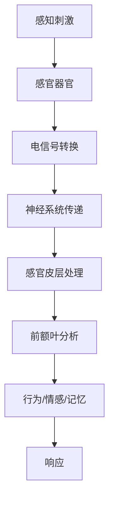
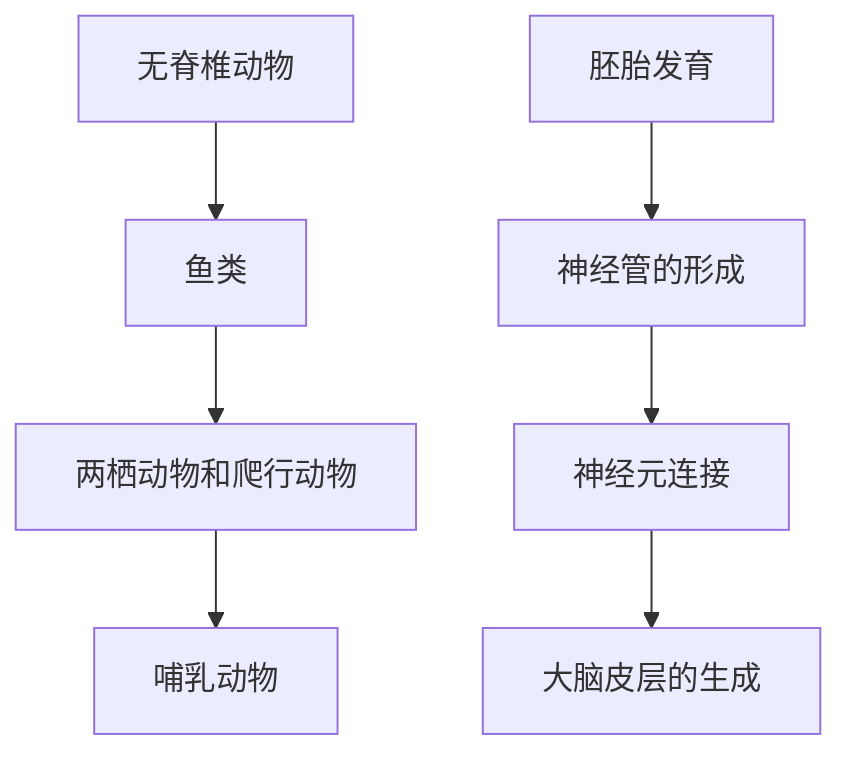
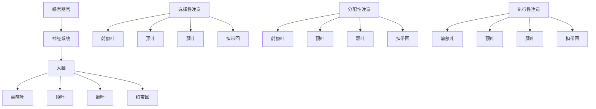
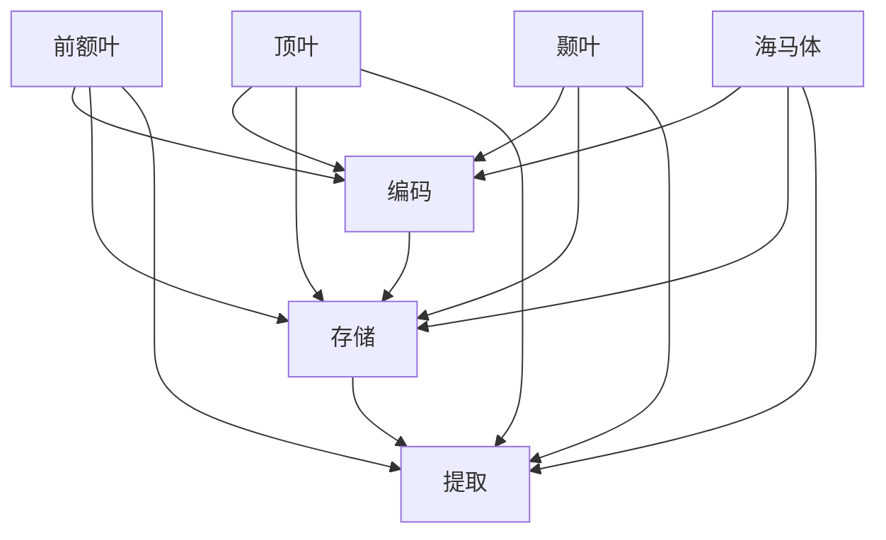
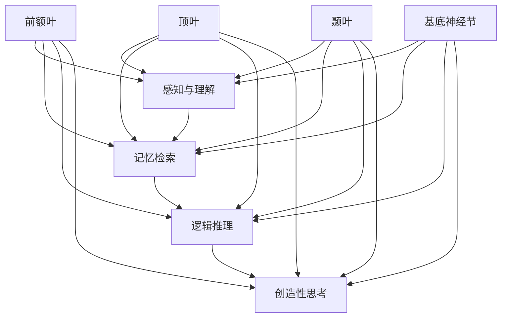
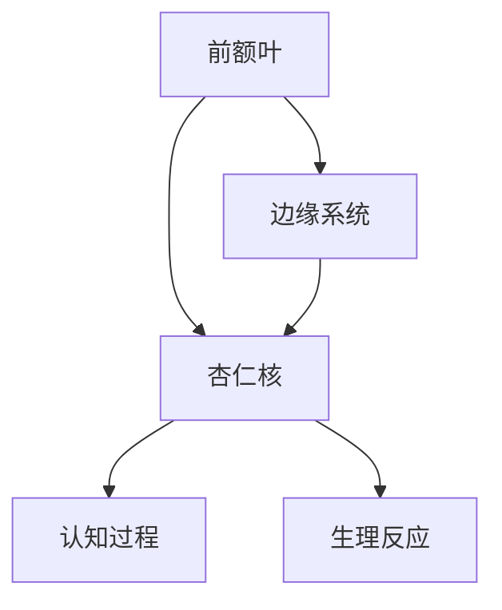
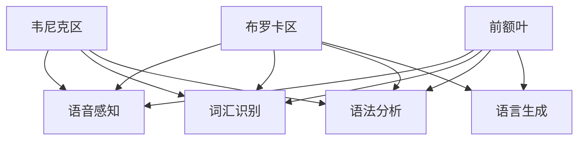
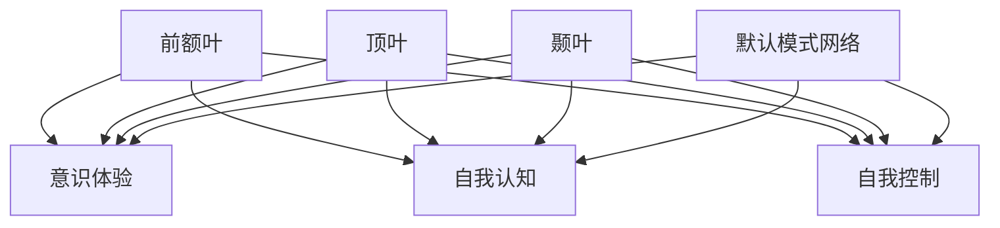
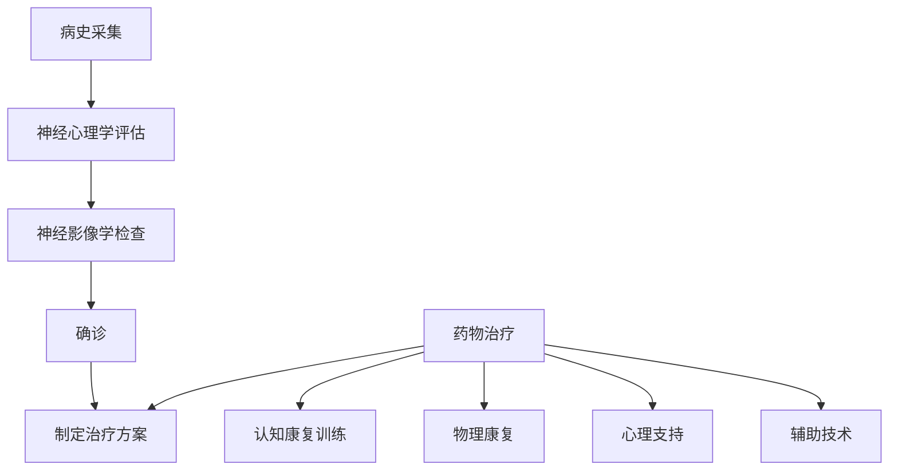

                 

### 摘要

本文旨在探讨认知神经科学，这是一个研究大脑如何感知、处理和理解的跨学科领域。本文将深入解析大脑的结构与功能，介绍感知、记忆、思维和情感等核心概念，并探讨这些概念在现实生活中的应用。文章首先介绍了大脑的解剖与生理学基础，随后详细探讨了感知与注意、记忆与认知、思维与决策等认知神经科学的核心概念，并展示了这些概念之间的关系。接着，文章讨论了大脑的高级功能，如情感、语言和自我意识，并阐述了它们如何影响我们的日常生活。最后，本文探讨了认知神经科学的实际应用，包括大脑疾病与认知障碍、教育、人工智能等领域。通过本文的阅读，读者将能够对大脑及其运作方式有一个全面且深入的理解。

### 文章关键词

- 认知神经科学
- 大脑结构
- 感知与注意
- 记忆与认知
- 思维与决策
- 情感与情绪
- 语言与沟通
- 意识与自我
- 大脑疾病与认知障碍
- 教育与人工智能

### 大脑的解剖与生理学基础

要理解认知神经科学，我们首先需要了解大脑的基本结构及其功能。大脑是神经系统的核心，负责处理和解释来自身体各部分的信息，并指导我们的行为和思考。大脑的结构复杂，由多个不同的区域组成，每个区域都有其特定的功能。

#### 大脑的结构与分区

大脑可以分为两个主要部分：大脑半球和脑干。大脑半球包括两个对称的部分，分别是大脑皮层、基底神经节和丘脑。大脑皮层是大脑最外层的部分，也是功能最为复杂的部分。它由多个层次组成，每一层都有其特定的功能。

- **大脑皮层**：大脑皮层是大脑中最发达的部分，负责高级认知功能，如思考、感知、记忆和运动。大脑皮层可以根据功能进一步分为前额叶、顶叶、颞叶和枕叶。
  
- **基底神经节**：基底神经节是一个深部结构，主要负责调节运动和情绪。

- **丘脑**：丘脑是大脑的一个中继站，负责传递感觉和运动信息到大脑皮层。

脑干是连接大脑和脊髓的结构，包括中脑、桥脑和延髓。脑干的主要功能是控制基本的生命活动，如心跳、呼吸和消化。

#### 神经元与神经传递

神经元是大脑的基本构建单元，负责接收和传递信息。神经元由细胞体、树突和轴突组成。细胞体包含细胞核和大部分细胞器，是神经元的代谢中心。树突负责接收来自其他神经元的信号，并将其传递到细胞体。轴突是神经元的输出部分，负责将信号传递到其他神经元或肌肉细胞。

神经传递是通过神经递质来实现的。神经递质是一种化学物质，存在于神经元之间的突触间隙中。当神经元被激活时，它会释放神经递质，这些神经递质可以与突触后神经元的受体结合，从而传递信号。

#### 大脑的信息处理机制

大脑的信息处理机制是一个复杂的过程，包括感知、加工和响应。当外界刺激（如声音、光线或触觉）到达感官器官时，这些信息会被转化为电信号，并通过神经系统传递到大脑。

在大脑中，这些信号会经过多个层次的处理。首先，信息会在感官皮层中被初步处理，然后被传递到更高层次的大脑区域，如前额叶和顶叶，进行更复杂的分析和处理。最终，处理后的信息会被转化为行为、情感或记忆。

#### Mermaid 流程图

为了更好地理解大脑的信息处理机制，我们可以使用 Mermaid 流程图来表示这个过程。以下是一个简化的流程图示例：

通过这个流程图，我们可以看到，从感知刺激到响应，大脑的信息处理过程是一个多层次的、复杂的过程，涉及多个脑区和神经传递机制的协调工作。

### 大脑的进化与发育

大脑的进化与发育是认知神经科学的重要组成部分，它不仅揭示了大脑如何适应环境变化，还为我们理解大脑的功能和结构提供了重要的线索。下面，我们将探讨大脑的进化历程、发育过程以及神经可塑性与学习。

#### 大脑的进化历程

大脑的进化历程可以追溯到数亿年前的单细胞生物。在进化过程中，大脑逐渐变得更加复杂，形成了现代哺乳动物的大脑结构。这个过程中，大脑的尺寸和复杂性都经历了显著的变化。

- **无脊椎动物**：无脊椎动物的大脑相对简单，通常只有一个简单的脑部结构，负责基本的生理功能。

- **鱼类**：鱼类的大脑相对较大，已经出现了初步的神经分区和神经纤维。

- **两栖动物和爬行动物**：这些动物的大脑更加复杂，具有多个脑区，可以进行更复杂的认知活动。

- **哺乳动物**：哺乳动物的大脑进一步发展，特别是大脑皮层，变得更加发达，负责高级认知功能。

#### 大脑的发育过程

大脑的发育过程是一个复杂且高度有序的过程。它从受精卵开始，经过一系列的细胞分裂、迁移和分化，最终形成具有复杂功能的成熟大脑。

- **胚胎发育**：在大脑的早期发育阶段，神经细胞开始分裂和增殖。随后，神经细胞开始迁移到其最终位置，并开始分化为不同的神经元类型。

- **神经管的形成**：神经管的形成是大脑发育的关键步骤，它将形成大脑和脊髓的基本结构。

- **神经元的连接**：在神经元迁移和分化的过程中，神经元开始形成连接，这些连接被称为突触。突触的建立和功能是大脑发育的关键。

- **大脑皮层的生成**：大脑皮层的生成是大脑发育的一个显著特征。大脑皮层通过一个称为神经折叠的过程，形成了多个脑回和沟回，从而增加了表面积和功能复杂性。

#### 神经可塑性与学习

神经可塑性是指大脑在结构和功能上的改变能力。它是一个高度动态的过程，受到多种因素的影响，包括经验、环境和基因。

- **经验依赖性可塑**：经验可以显著影响大脑的结构和功能。例如，语言学习会导致大脑特定区域的激活和连接变化。

- **突触可塑性**：突触可塑性是指突触在结构和功能上的变化，包括突触的增强和抑制。它是学习和新记忆形成的基础。

- **长时程增强（LTP）**：长时程增强是一种突触可塑性形式，它涉及突触强度的持久增强，通常与学习和记忆的形成相关。

#### Mermaid 流程图

为了更好地理解大脑的进化与发育，我们可以使用 Mermaid 流程图来表示这个过程。以下是一个简化的流程图示例：

通过这个流程图，我们可以看到，从无脊椎动物到哺乳动物，大脑的进化是一个逐步增加复杂性的过程。同时，大脑的发育过程也是一个多步骤、高度有序的过程，涉及神经细胞的分裂、迁移、分化和突触的建立。

### 感知与注意

感知与注意是认知神经科学中的核心概念，它们共同构成了大脑对环境的处理方式。感知是指大脑如何接收和处理外部信息，而注意则是指大脑如何选择关注某些信息而忽略其他信息。

#### 感知的基本原理

感知是一个多层次的过程，它涉及感官器官、神经系统以及大脑的多个区域。当外界刺激（如声音、光线、气味等）到达感官器官时，这些刺激会被转化为电信号，并通过神经系统传递到大脑。

- **感官器官**：感官器官是感知的起点，包括眼睛、耳朵、鼻子、舌头和皮肤。每种感官器官都有其特定的感受器，可以接收和检测外部刺激。

- **神经系统**：电信号会通过神经系统传递到大脑。神经系统由神经元组成，这些神经元通过树突和轴突进行信号传递。

- **大脑**：大脑是感知的终点，负责接收、处理和解释来自感官器官的信息。大脑的不同区域负责处理不同类型的信息。例如，视觉信息主要由视觉皮层处理，听觉信息主要由听觉皮层处理。

#### 注意力的机制

注意力是感知过程中的关键因素，它决定了大脑如何处理信息。注意力分为多个类型，包括选择性注意、分配性注意和执行性注意。

- **选择性注意**：选择性注意是指大脑如何从多个输入源中选择一个或几个进行关注。例如，在嘈杂的环境中，我们能够选择听到朋友的谈话而忽略其他声音。

- **分配性注意**：分配性注意是指大脑如何在多个任务或输入源之间分配注意力。例如，驾驶员在驾驶时需要同时注意路况、交通信号和周围环境。

- **执行性注意**：执行性注意是指大脑如何控制和调节注意力，以确保正确执行任务。例如，当我们学习新技能时，需要集中注意力并持续练习，以加强记忆和技能的掌握。

#### 感知与注意的神经基础

感知与注意的神经基础涉及大脑的多个区域，包括前额叶、顶叶、颞叶和扣带回等。

- **前额叶**：前额叶是大脑中的一个关键区域，负责执行性注意和高级认知功能。它可以帮助我们控制注意力，调节情绪和决策。

- **顶叶**：顶叶是大脑中的另一个关键区域，负责处理空间信息和触觉信息。它也参与了注意力的分配和调节。

- **颞叶**：颞叶主要负责处理听觉信息。它参与了选择性注意和记忆的形成。

- **扣带回**：扣带回是一个位于大脑中心的结构，它参与了多种认知功能，包括感知、注意和记忆。

#### Mermaid 流程图

为了更好地理解感知与注意的神经基础，我们可以使用 Mermaid 流程图来表示这个过程。以下是一个简化的流程图示例：

通过这个流程图，我们可以看到，感知与注意的神经基础涉及多个大脑区域，每个区域都有其特定的功能。这些区域之间的相互作用和协调，使得我们能够有效地感知和应对外部环境。

### 记忆与认知

记忆与认知是认知神经科学中的核心概念，它们共同构成了大脑如何处理、存储和利用信息的过程。记忆不仅是我们过去的记录，也是我们学习、思考和行动的基础。而认知则是一个更为广泛的概念，它涵盖了从感知到决策的整个过程。

#### 记忆的类型与功能

记忆可以分为短期记忆和长期记忆两种类型。

- **短期记忆**：短期记忆也称为工作记忆，它主要负责暂时存储和处理信息。例如，当我们进行电话通话时，我们需要记住通话者的姓名和对话内容。短期记忆的容量有限，通常只能维持几秒钟到几分钟。

- **长期记忆**：长期记忆是指能够持久存储和回忆的信息。它包括陈述性记忆（如事实和事件）和程序性记忆（如技能和运动）。长期记忆的存储和提取过程更为复杂，它通常涉及大脑多个区域的协同工作。

记忆的功能包括信息存储、信息检索和信息利用。存储是将信息编码并存储在大脑中，检索是将存储的信息从大脑中提取出来，而利用则是将信息用于决策和行为。

#### 认知过程的神经基础

认知过程的神经基础涉及多个大脑区域，包括前额叶、顶叶、颞叶和海马体等。

- **前额叶**：前额叶是大脑中的一个关键区域，负责执行功能，包括决策、计划和注意力控制。它在记忆的编码、存储和检索中起着重要作用。

- **顶叶**：顶叶主要负责空间处理和感知。它也参与了记忆的编码和存储。

- **颞叶**：颞叶主要负责处理听觉和语言信息。它在陈述性记忆中起着关键作用。

- **海马体**：海马体是大脑中的一个重要结构，它在记忆的编码、存储和检索中起着核心作用。海马体受损会导致严重的记忆障碍。

#### 记忆的编码、存储与提取

记忆的编码、存储和提取是一个复杂的过程，它涉及多个神经机制和脑区。

- **编码**：编码是将信息转化为大脑可以处理的形式。这个过程通常涉及神经元的活动模式和神经递质的释放。

- **存储**：存储是将编码后的信息持久地存储在大脑中。这个过程涉及神经元之间的突触连接和脑结构的改变。

- **提取**：提取是将存储的信息从大脑中检索出来。这个过程通常涉及大脑多个区域的协同工作，包括前额叶、顶叶和海马体。

#### Mermaid 流程图

为了更好地理解记忆与认知的神经基础，我们可以使用 Mermaid 流程图来表示这个过程。以下是一个简化的流程图示例：

通过这个流程图，我们可以看到，记忆与认知的神经基础涉及多个大脑区域，每个区域都有其特定的功能。这些区域之间的相互作用和协调，使得我们能够有效地编码、存储和提取信息。

### 思维与决策

思维与决策是认知神经科学中的两个关键概念，它们共同构成了大脑如何处理复杂问题和做出决策的过程。思维是指大脑如何处理信息、解决问题和形成概念，而决策则是指在大脑的指导下，如何选择最佳行动方案。

#### 思维的本质与过程

思维的本质是一个复杂的问题，它涉及多个层面的处理，包括感知、记忆、逻辑推理和创造性思考。思维的过程可以分为几个阶段：

1. **感知与理解**：思维从感知外界信息开始，通过感官器官接收外部刺激，并将其转化为内部信息。

2. **记忆检索**：在感知和理解的基础上，思维会检索相关的记忆，以便对当前情况进行评估。

3. **逻辑推理**：通过逻辑推理，思维可以推导出可能的结论和解决方案。

4. **创造性思考**：在逻辑推理的基础上，创造性思考可以帮助我们发现新的解决方案。

#### 决策的神经机制

决策的神经机制涉及多个大脑区域，包括前额叶、顶叶、颞叶和基底神经节等。

1. **前额叶**：前额叶是大脑中的一个关键区域，负责执行功能，包括决策、计划和注意力控制。它在决策过程中负责评估不同行动方案的风险和收益，并选择最佳方案。

2. **顶叶**：顶叶主要负责空间处理和感知，它在决策过程中帮助评估不同方案的空间和感知特征。

3. **颞叶**：颞叶主要负责处理听觉和语言信息，它在决策过程中帮助评估不同方案的可能后果。

4. **基底神经节**：基底神经节是一个深部结构，它在决策过程中负责调节运动和情绪。

#### 神经可塑性与思维训练

神经可塑性是指大脑在结构和功能上的改变能力，它受到多种因素的影响，包括经验、环境和基因。通过思维训练，我们可以增强大脑的可塑性，从而提高思维和决策能力。

1. **认知训练**：认知训练是指通过特定的认知任务来锻炼大脑。例如，记忆训练、推理训练和注意力训练等。

2. **冥想与放松**：冥想和放松可以帮助减少压力，提高大脑的可塑性，从而提高思维和决策能力。

3. **睡眠与休息**：睡眠和休息是大脑恢复和整合信息的重要过程，它有助于提高思维和决策能力。

#### Mermaid 流�程图

为了更好地理解思维与决策的神经机制，我们可以使用 Mermaid 流程图来表示这个过程。以下是一个简化的流程图示例：

通过这个流程图，我们可以看到，思维与决策的神经机制涉及多个大脑区域，每个区域都有其特定的功能。这些区域之间的相互作用和协调，使得我们能够有效地处理信息、解决问题和做出决策。

### 情感与情绪

情感与情绪是大脑的高级功能之一，它们不仅影响我们的行为和思考，还与认知和生理反应密切相关。理解情感与情绪的神经基础，有助于我们更好地理解人类的行为和心理过程。

#### 情感的基本概念

情感是指个体在特定情境下产生的复杂心理体验，它通常涉及认知、生理和行为反应。情感可以分为基本情感和复合情感。

- **基本情感**：基本情感包括快乐、悲伤、愤怒、恐惧、惊讶和厌恶等，它们是人类情感体验的基础。

- **复合情感**：复合情感是由基本情感组合而成的，如爱、厌恶、羞耻和自豪等。

#### 情绪的神经基础

情绪的神经基础涉及多个大脑区域，包括前额叶、边缘系统和杏仁核等。

- **前额叶**：前额叶负责高级认知功能，如决策、规划和社交行为。它在情感处理中起着调节作用，帮助我们将情感与行为联系起来。

- **边缘系统**：边缘系统包括杏仁核、海马体和扣带回等，它是情绪处理的核心区域。杏仁核负责情感的评价和分类，海马体参与情感的记忆和存储，扣带回参与情绪的调节。

- **杏仁核**：杏仁核是一个位于大脑中心的杏仁形状的结构，它在情感处理中起着核心作用。它主要负责情绪的评价和反应，如恐惧反应。

#### 情感与认知的关系

情感与认知之间存在密切的关系，它们相互作用，共同影响个体的行为和心理过程。

- **情感对认知的影响**：情感可以影响个体的认知过程，如注意、记忆和决策。积极的情感可以提高认知功能，而消极的情感可能导致认知障碍。

- **认知对情感的影响**：认知过程也可以影响情感，如期待和信念可以改变个体的情感体验。认知重构技术，如认知行为疗法，通过改变个体的认知模式，帮助改善情感状态。

#### Mermaid 流程图

为了更好地理解情感与情绪的神经基础，我们可以使用 Mermaid 流程图来表示这个过程。以下是一个简化的流程图示例：

通过这个流程图，我们可以看到，情感与情绪的神经基础涉及多个大脑区域，这些区域之间的相互作用和协调，使得我们能够有效地处理情感信息，并将其与认知和行为联系起来。

### 语言与沟通

语言与沟通是人类认知的高级功能，它们在社交互动和文化传承中起着至关重要的作用。理解语言与沟通的神经基础，有助于我们更好地理解人类的社会行为和智力发展。

#### 语言的神经基础

语言的神经基础涉及多个大脑区域，包括布罗卡区、韦尼克区和前额叶等。

- **布罗卡区**：布罗卡区位于大脑的左半球前部，是语言处理的核心区域。它负责语法和语音的处理，以及语言的生成。

- **韦尼克区**：韦尼克区位于大脑的左半球后部，是语言理解的核心区域。它负责语义和语音的处理，以及语言的接收。

- **前额叶**：前额叶在语言功能中起着调节作用，它负责语言的表达和社交互动。

#### 语言处理的心理过程

语言处理是一个复杂的过程，包括语音感知、词汇识别、语法分析和语义理解等。

1. **语音感知**：语音感知是指个体如何识别和理解语音。它涉及听觉皮层的处理，包括声音的频率、时长和强度等特征。

2. **词汇识别**：词汇识别是指个体如何识别和理解词汇。它涉及视觉皮层的处理，包括词汇的形态和语义信息。

3. **语法分析**：语法分析是指个体如何理解和生成符合语法规则的句子。它涉及布罗卡区和韦尼克区的协同工作。

4. **语义理解**：语义理解是指个体如何理解和应用词汇和句子的语义。它涉及前额叶和语义网络的协同工作。

#### 语言障碍与治疗

语言障碍是一组影响语言能力的障碍，包括失语症、言语障碍和阅读障碍等。语言障碍的治疗通常涉及康复训练、语言疗法和辅助技术。

1. **失语症**：失语症是指由于大脑损伤导致的语言能力丧失。治疗通常包括语言训练、认知训练和言语治疗。

2. **言语障碍**：言语障碍是指由于语音、语调或流利度的问题导致的语言障碍。治疗通常包括语音训练、语调训练和流利度训练。

3. **阅读障碍**：阅读障碍是指由于语言处理问题导致的阅读障碍。治疗通常包括词汇训练、语法训练和阅读理解训练。

#### Mermaid 流程图

为了更好地理解语言与沟通的神经基础，我们可以使用 Mermaid 流程图来表示这个过程。以下是一个简化的流程图示例：

通过这个流程图，我们可以看到，语言与沟通的神经基础涉及多个大脑区域，这些区域之间的相互作用和协调，使得我们能够有效地处理语言信息，实现沟通和交流。

### 意识与自我

意识与自我是认知神经科学中的两个重要概念，它们共同构成了人类对自身和外部世界的感知和理解。意识是指个体对自身和环境的感知状态，而自我则是意识的核心，它代表了个体对自身存在的认识。

#### 意识的哲学与科学探讨

意识是一个古老的哲学问题，许多哲学家和科学家都对其进行了深入的探讨。在哲学上，意识通常被视为一个主观的、内在的体验，它涉及感觉、思想和情感。在科学上，意识研究主要集中在理解大脑如何产生意识体验。

1. **哲学探讨**：哲学家们对意识进行了多种探讨，包括意识的本质、起源和作用。一些哲学家认为意识是人类的本质特征，而另一些哲学家则认为意识是一种错觉。

2. **科学探讨**：科学家们通过神经科学、心理学和计算机科学等方法，试图揭示意识的神经基础。目前，关于意识的研究主要集中在理解大脑的活动模式，以及这些模式如何产生主观体验。

#### 意识的神经机制

意识的神经机制是一个复杂的问题，目前还没有完全解决。然而，一些研究表明，大脑多个区域的活动与意识体验密切相关。

1. **前额叶**：前额叶是大脑中的一个关键区域，它在意识体验中起着重要作用。前额叶参与决策、计划和社交行为，这些功能都与意识体验有关。

2. **顶叶**：顶叶是大脑中的另一个重要区域，它参与空间感知和注意力控制，这些功能也与意识体验密切相关。

3. **颞叶**：颞叶参与语言处理和听觉感知，这些功能也对意识体验有重要影响。

4. **默认模式网络**：默认模式网络是一个涉及多个大脑区域的神经网络，它在休息状态时活动增强。默认模式网络与意识体验和自我感知密切相关。

#### 自我与意识的互动

自我与意识的互动是一个复杂的过程，它涉及到自我认知、自我意识和自我控制等多个方面。

1. **自我认知**：自我认知是指个体对自身存在的认识。自我认知不仅涉及身体和情感，还涉及心理和社交方面。

2. **自我意识**：自我意识是指个体对自己存在的内在感知。自我意识与意识体验密切相关，它帮助个体理解自身和环境。

3. **自我控制**：自我控制是指个体通过自我调节来控制行为和情感。自我控制不仅有助于实现个人目标，还能提高生活质量。

#### Mermaid 流程图

为了更好地理解意识与自我，我们可以使用 Mermaid 流程图来表示这个过程。以下是一个简化的流程图示例：

通过这个流程图，我们可以看到，意识与自我涉及多个大脑区域，这些区域之间的相互作用和协调，使得我们能够有效地体验意识、认识自我和控制行为。

### 大脑疾病与认知障碍

大脑疾病与认知障碍是认知神经科学中的重要研究领域，它们涉及到多种神经系统疾病和认知功能的损害。理解这些疾病的类型、诊断方法、治疗与康复策略，对于提高患者生活质量具有重要意义。

#### 大脑疾病的类型

大脑疾病种类繁多，常见的包括以下几种：

1. **阿尔茨海默病（Alzheimer's Disease）**：阿尔茨海默病是一种进行性的神经退行性疾病，主要影响老年人的记忆、思维和社交能力。

2. **脑卒中（Stroke）**：脑卒中是指大脑中的血管破裂或阻塞，导致脑组织损伤。脑卒中后可能会出现认知障碍，如记忆减退、语言障碍和注意力不集中。

3. **帕金森病（Parkinson's Disease）**：帕金森病是一种慢性神经系统疾病，主要影响运动功能，但也会导致认知障碍，如注意力减退和记忆力下降。

4. **癫痫（Epilepsy）**：癫痫是一种反复发作的脑部疾病，可能影响认知功能，如注意力、记忆和执行功能。

#### 认知障碍的类型与诊断

认知障碍可以分为多种类型，根据影响的功能不同，可分为以下几类：

1. **记忆障碍**：记忆障碍是指记忆能力受损，表现为遗忘、回忆困难或时间空间定位障碍。

2. **执行功能障碍**：执行功能障碍包括计划、组织、解决问题和任务切换等方面的困难。

3. **注意力障碍**：注意力障碍是指无法集中注意力或保持注意力，导致工作记忆受损。

4. **语言障碍**：语言障碍包括表达和理解语言的能力受损，如失语症和语言流畅性障碍。

诊断认知障碍通常需要通过详细的病史采集、神经心理学评估和神经影像学检查（如MRI、CT）等多种方法。以下是一个简化的诊断流程：

1. **病史采集**：了解患者的病史、生活方式、家族史等，以确定可能的危险因素。

2. **神经心理学评估**：通过标准化的评估工具，如记忆测试、认知功能测试和语言测试等，评估患者的认知能力。

3. **神经影像学检查**：通过MRI、CT等影像学检查，确定脑部结构是否出现异常，如脑萎缩或肿瘤等。

#### 治疗与康复策略

治疗与康复策略因疾病类型和患者个体差异而异，以下是一些常见的治疗和康复策略：

1. **药物治疗**：药物治疗是许多大脑疾病的基本治疗方法。例如，抗抑郁药、抗癫痫药和抗精神病药等。

2. **认知康复训练**：认知康复训练旨在提高患者的认知功能，包括记忆训练、注意力训练和执行功能训练等。

3. **物理康复**：对于脑卒中等导致运动功能障碍的患者，物理康复可以帮助恢复运动功能，如步行、平衡和手部运动。

4. **心理支持**：心理支持对于患者及其家庭都是重要的，包括心理治疗、心理咨询和家庭护理等。

5. **辅助技术**：辅助技术如记忆辅助工具、语音合成器和认知训练软件等，可以帮助患者更好地应对认知障碍。

#### Mermaid 流程图

为了更好地理解大脑疾病与认知障碍的诊断和治疗过程，我们可以使用 Mermaid 流程图来表示。以下是一个简化的流程图示例：

通过这个流程图，我们可以看到，诊断和治疗大脑疾病与认知障碍是一个多步骤、综合性的过程，涉及多种方法和策略。

### 认知神经科学与教育

认知神经科学与教育相结合，为我们提供了新的视角和方法，以优化学习过程、提高教育效果。理解认知神经科学的基本原理，可以帮助教育工作者设计更有效的教学策略，同时也能够为有特殊需求的学生提供更加个性化的教育方案。

#### 教育中的认知科学原理

认知科学是研究认知过程的跨学科领域，包括心理学、神经科学、计算机科学和哲学等。以下是一些认知科学的基本原理，它们在教育中的应用：

1. **注意力原理**：注意力是学习的关键，教育工作者需要设计能够吸引学生注意力的教学活动。例如，使用多媒体、互动式教学和游戏化学习等，可以提高学生的参与度和注意力。

2. **记忆原理**：记忆是学习的基础，教育工作者需要利用记忆原理来帮助学生更好地编码、存储和提取信息。例如，通过重复、联想记忆和分组学习等策略，可以提高记忆效果。

3. **认知负载原理**：认知负载是指大脑在处理信息时所需的认知资源。教育工作者应尽量减少学生的认知负载，以便他们能够专注于学习任务。例如，简化课程内容、提供清晰的指导和支持等。

4. **神经可塑性原理**：神经可塑性是指大脑在结构和功能上的改变能力。教育工作者可以利用这一原理来设计具有挑战性的学习任务，以促进学生的认知发展和技能提升。

#### 教育干预与认知发展

认知神经科学原理的应用可以帮助设计有效的教育干预，以促进学生的认知发展。以下是一些具体的教育干预措施：

1. **早期干预**：对于有认知障碍或学习困难的学生，早期干预至关重要。通过早期识别和干预，可以有效地改善学生的认知功能和学习能力。

2. **个性化学习**：利用认知神经科学原理，教育工作者可以为学生提供个性化的学习计划，以满足他们的个体需求。例如，通过适应性学习系统和个性化的反馈，可以提高学生的学习效果。

3. **认知训练**：认知训练是一种基于认知科学原理的训练方法，旨在提高学生的认知能力。例如，通过记忆训练、注意力训练和执行功能训练，可以提升学生的认知技能。

4. **跨学科学习**：跨学科学习可以促进学生的综合认知能力发展。通过将不同学科的知识和技能结合起来，学生可以更好地理解和应用所学内容。

#### 教育中的认知神经科学应用案例

以下是一些认知神经科学在教育中应用的具体案例：

1. **翻转课堂**：翻转课堂是一种基于认知神经科学的教学模式，它将传统教学中的教师讲解和学生练习进行颠倒。在课堂上，学生通过观看视频学习新知识，而在家庭作业中，学生通过实践和练习来巩固所学知识。

2. **认知行为疗法**：认知行为疗法是一种心理治疗方法，它结合了认知科学和行为科学的原理。在教育中，认知行为疗法可以帮助学生识别和改变不良的认知模式，从而提高学习效果。

3. **游戏化学习**：游戏化学习是一种通过游戏机制来增强学习体验的方法。通过设计有趣的游戏和学习任务，学生可以在轻松愉快的氛围中学习新知识。

4. **虚拟现实（VR）教育**：虚拟现实技术可以提供沉浸式的学习体验，使学生能够身临其境地学习复杂的概念。例如，医学专业学生可以通过VR技术进行虚拟手术训练。

#### 结论

认知神经科学为教育领域提供了丰富的理论基础和应用方法。通过理解认知神经科学的原理，教育工作者可以设计更有效的教学策略，提高学生的学习效果和认知能力。未来，随着认知神经科学技术的不断发展，教育领域将迎来更多创新和变革。

### 认知神经科学与人工智能

认知神经科学与人工智能（AI）的交叉融合，为理解人类思维和开发智能化系统提供了新的视角和工具。这一领域的研究不仅有助于提高人工智能的智能水平，还可能揭示人类认知的深层次机制。

#### 认知神经科学与人工智能的交叉

认知神经科学与人工智能的交叉研究主要集中在以下几个方面：

1. **机器学习与神经可塑性**：机器学习模型，尤其是深度学习，与神经可塑性机制有诸多相似之处。神经网络通过调整权重和连接来适应新的数据，这与大脑中的突触可塑性非常相似。因此，认知神经科学原理可以启发更有效的机器学习算法。

2. **感知与注意力机制**：人工智能系统中的感知模块，如计算机视觉和语音识别，可以借鉴认知神经科学中的感知和注意力机制。例如，通过模仿大脑的视觉处理路径，可以设计出更高效的图像识别算法。

3. **记忆与推理**：记忆和推理是人工智能系统的重要功能。认知神经科学中的记忆编码和存储机制，以及推理过程的神经基础，为人工智能在记忆和推理方面的建模提供了理论基础。

#### 人工智能在认知神经科学中的应用

人工智能技术在认知神经科学研究中有着广泛的应用，以下是一些具体实例：

1. **脑影像分析**：人工智能技术，如深度学习，可以用于分析功能性磁共振成像（fMRI）和电生理数据。通过自动化识别和分类，人工智能可以大大提高脑影像分析的准确性和效率。

2. **疾病诊断**：人工智能系统可以用于诊断神经退行性疾病，如阿尔茨海默病和帕金森病。通过分析患者的大脑影像和生物标志物，人工智能可以提供早期诊断和个性化治疗方案。

3. **认知功能评估**：人工智能可以开发出用于评估个体认知功能的工具，如认知测试软件和游戏。这些工具可以实时监测和评估个体的认知状态，为认知康复提供数据支持。

4. **个性化教育**：基于人工智能的学习分析系统可以跟踪学生的学习过程，并提供个性化的学习建议。通过分析学生的学习行为和成绩，人工智能可以设计出适应学生个体差异的教学策略。

#### 未来趋势与挑战

认知神经科学与人工智能的未来发展面临着诸多挑战和机遇：

1. **数据隐私与伦理**：随着人工智能在认知神经科学中的应用越来越广泛，数据隐私和伦理问题日益突出。如何在保护个人隐私的同时，充分利用大规模脑影像和生物数据，是一个亟待解决的问题。

2. **算法解释性**：目前，许多人工智能系统，尤其是深度学习模型，被认为是“黑箱”系统，其决策过程缺乏透明性。提高算法的可解释性，使其能够解释为何做出特定决策，是认知神经科学与人工智能领域的重要研究方向。

3. **跨学科合作**：认知神经科学与人工智能的交叉融合需要跨学科的合作。心理学、神经科学、计算机科学和认知科学等领域的专家需要共同努力，以推动这一领域的进步。

4. **个性化医疗**：基于人工智能的个性化医疗方案，如个性化药物开发和个性化康复训练，有望显著提高治疗效果和患者生活质量。

总之，认知神经科学与人工智能的交叉融合为理解人类认知和开发智能化系统提供了新的途径。随着技术的不断进步，这一领域有望带来更多创新和突破。

### 总结与展望

本文系统性地介绍了认知神经科学的基本概念、核心原理及其在多个领域的应用。从大脑的解剖与生理学基础，到感知、记忆、思维与决策，再到情感、语言与意识，认知神经科学为我们揭示了一个复杂的认知世界。通过理解大脑的结构与功能，我们能够更好地认识自身，并优化学习和行为。此外，认知神经科学在治疗大脑疾病、提高教育质量、推动人工智能发展等方面也展现了巨大的潜力。

展望未来，认知神经科学将继续在跨学科研究中扮演关键角色。随着神经影像技术、人工智能和大数据分析等新兴技术的发展，我们有望更深入地揭示大脑的奥秘，推动认知科学的进步。同时，这一领域的应用也将为医学、教育、人工智能等领域带来革命性的变化，为人类创造更加美好的未来。

### 最佳实践 Tips、小结、注意事项、拓展阅读等内容

**最佳实践 Tips**：

1. **持续学习**：认知神经科学是一个不断发展的领域，持续学习和更新知识至关重要。定期阅读最新的研究论文和书籍，参加相关的学术会议和研讨会，以保持对最新研究动态的了解。

2. **跨学科合作**：认知神经科学研究需要跨学科的知识和技能，因此，与心理学、计算机科学、医学等领域的专家合作，有助于推动该领域的研究进展。

3. **实践应用**：将认知神经科学的原理应用于实际生活，如通过认知训练提高记忆力、注意力，通过正念冥想调节情绪等，可以提升个人的认知功能和生活质量。

**小结**：

本文通过详细探讨认知神经科学的基本概念、核心原理和应用，展示了这一领域的广泛影响。理解大脑的运作机制，不仅有助于我们更好地认识自身，还能推动医学、教育、人工智能等领域的创新与发展。

**注意事项**：

1. **数据隐私与伦理**：在研究和应用认知神经科学时，应严格遵守数据隐私和伦理规范，确保个人数据的保护和合理使用。

2. **个体差异**：认知神经科学的研究和应用应考虑到个体差异，设计个性化的解决方案，以满足不同人群的需求。

**拓展阅读**：

1. **《认知神经科学：大脑如何工作》（The Cognitive Neurosciences）**：这本书是认知神经科学的经典著作，涵盖了该领域的广泛主题和最新研究成果。

2. **《大脑如何学习》（How We Learn）**：这本书详细介绍了认知神经科学原理在学习和教育中的应用，提供了实用的学习策略和建议。

3. **《人工智能：一种现代方法》（Artificial Intelligence: A Modern Approach）**：这本书介绍了人工智能的基础知识，包括认知神经科学在人工智能中的应用。

通过这些拓展阅读资源，读者可以进一步深入理解认知神经科学的原理和应用。作者：AI天才研究院/AI Genius Institute & 禅与计算机程序设计艺术 /Zen And The Art of Computer Programming。

