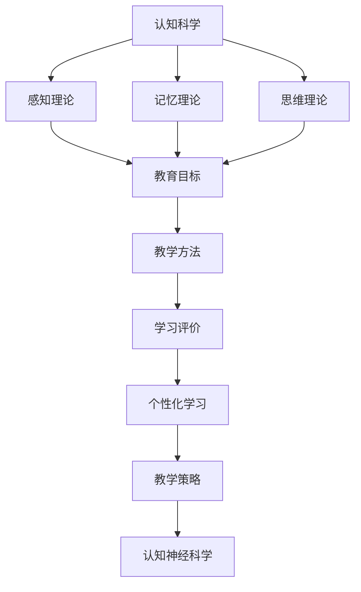

                 

### 文章标题

《认知科学与教育学的交叉：优化人类学习和理解世界的方式》

### 关键词

认知科学，教育学，学习优化，教学策略，个性化学习，记忆理论，思维理论，感知理论

### 摘要

本文旨在探讨认知科学与教育学的交叉领域，分析两者之间的核心概念和理论，并探讨如何将这些理论应用于优化人类学习和理解世界的方式。文章首先介绍了认知科学和教育学的基本概念，然后详细阐述了感知、记忆和思维等核心理论，并展示了它们与教育学的联系。通过具体案例和算法，本文进一步探讨了如何将认知科学的原理应用于教育实践，如个性化学习设计和教学策略优化。此外，文章还讨论了认知科学与教育学在心理学、计算机科学和神经科学等跨学科领域的研究进展，并展望了未来的发展趋势和挑战。本文旨在为教育工作者、学者和研究人员提供有价值的参考，以推动教育改革和提升学习效果。

### 引言

随着科技的飞速发展和社会的快速变革，人类对知识和信息的获取方式也在不断变革。在这个信息爆炸的时代，如何有效地学习和理解世界成为一个日益重要的问题。传统教育模式在面对复杂多变的知识体系和学习环境时，往往显得力不从心。为了应对这一挑战，认知科学与教育学的交叉研究应运而生，为优化人类学习和理解世界提供了新的视角和方法。

认知科学是一门多学科交叉的领域，主要研究人类的感知、记忆、思维等认知过程，旨在揭示大脑的工作原理和认知机制。而教育学则关注教育的过程、方法和效果，致力于通过科学的方法提高教育质量。尽管两者研究的角度和方法有所不同，但它们在优化人类学习和理解世界方面具有高度的关联性和互补性。

认知科学与教育学的交叉研究不仅有助于深入理解学习过程的本质，还可以为教育实践提供科学的指导。例如，通过认知科学的研究成果，可以设计出更符合人类认知特点的教学策略和方法，从而提高学习效果。同时，教育学的理论和方法也可以帮助认知科学更好地应用于教育领域，促进教育改革和创新。

本文将从以下几个方面展开讨论：首先，介绍认知科学和教育学的基本概念，阐述两者在优化人类学习和理解世界中的重要性；其次，详细阐述感知、记忆和思维等核心理论，并展示它们与教育学的联系；然后，通过具体案例和算法，探讨如何将认知科学的原理应用于教育实践，如个性化学习设计和教学策略优化；接着，讨论认知科学与教育学在跨学科领域的研究进展；最后，展望认知科学与教育学的未来发展，并总结全文的主要观点和贡献。

通过本文的讨论，我们希望为教育工作者、学者和研究人员提供有价值的参考，以推动教育改革和提升学习效果，从而为构建一个更加智能和高效的学习社会贡献力量。

### 认知科学的基本概念

认知科学是一门跨学科的领域，涉及心理学、神经科学、计算机科学、哲学和语言学等多个学科。其核心目标是研究人类的认知过程，包括感知、记忆、思维、语言理解等。认知科学通过对大脑和心智的研究，试图揭示人类如何获取、处理和使用信息，从而更好地理解人类的智力和行为。

#### 定义与发展历程

认知科学的定义多种多样，但其核心思想是研究人类认知过程的本质和机制。广义上，认知科学可以定义为“关于心智的科学研究”，它不仅包括对大脑神经活动的探究，还涵盖了对认知过程的计算模型和符号表示方法的研究。狭义上，认知科学主要关注认知过程的心理学和神经科学基础。

认知科学的发展历程可以追溯到20世纪50年代，当时心理学家Noam Chomsky提出了“普遍语法”理论，开创了认知心理学的先河。随后，人工智能的兴起和发展为认知科学提供了新的工具和理论框架。在计算机科学的推动下，认知科学开始尝试将人工智能的方法应用于理解人类心智，如基于规则的系统、知识表示和推理方法等。

近年来，认知科学的跨学科特点更加显著，心理学、神经科学和计算机科学等多个领域的交叉研究不断深入。例如，神经科学家通过脑成像技术，如功能性磁共振成像（fMRI）和脑电图（EEG），揭示了大脑在不同认知任务中的活动模式；计算机科学家则通过开发复杂的计算模型，模拟人类认知过程，为认知科学提供了新的理论支持。

#### 主要研究领域

认知科学的研究领域广泛，以下是其主要的几个研究方向：

1. **感知与感知理论**：研究人类如何通过感官接收和处理外部信息，包括视觉、听觉、触觉、嗅觉和味觉等。感知理论探讨感知过程中信息加工和解释的机制，如特征检测、模式识别和注意机制等。

2. **记忆与记忆理论**：研究人类记忆的存储、保持和提取过程。记忆理论包括短期记忆、长期记忆和工作记忆等不同类型的记忆，以及它们在信息加工和学习中的作用。

3. **思维与思维理论**：研究人类思维过程，包括推理、解决问题、创造性思维和决策等。思维理论探讨思维过程中信息处理的方式和策略，如归纳推理、演绎推理和基于案例的推理等。

4. **语言与语言理论**：研究人类语言能力的发展、结构和功能。语言理论涉及语言习得、语言处理和语言表达的认知机制，以及语言与思维的关系。

5. **认知神经科学**：研究大脑如何支持认知功能，包括神经元活动、神经网络结构和神经递质作用等。认知神经科学通过脑成像技术，如fMRI和PET，揭示大脑在不同认知任务中的活动模式。

6. **人工智能与认知模拟**：研究如何通过计算机模型和算法模拟人类认知过程。人工智能领域的发展为认知科学提供了强大的工具，如机器学习和深度学习等，这些技术可以用于理解和预测人类的行为。

#### 认知科学与教育学的联系

认知科学与教育学之间存在着密切的联系。认知科学的理论和方法为教育学提供了科学依据，帮助教育工作者更好地理解学习过程的本质，从而设计出更有效的教学策略。以下是一些具体的联系：

1. **感知与教学**：认知科学中的感知理论可以帮助教师设计更符合学生感知特点的教学内容和方法，如通过视觉、听觉和触觉等多种方式呈现信息，以增强学生的理解和记忆。

2. **记忆与学习**：认知科学中的记忆理论提供了关于记忆过程和记忆技巧的深刻理解，教师可以根据这些理论指导学生采用更有效的记忆策略，如分散练习、联想记忆和复习策略等。

3. **思维与创造力**：认知科学中的思维理论探讨思维过程的机制和策略，教师可以借鉴这些理论培养学生的创造性思维和解决问题的能力。

4. **认知神经科学与教学**：认知神经科学的研究揭示了大脑在不同认知任务中的活动模式，教师可以根据这些信息设计更具针对性的教学活动，如通过特定的大脑训练游戏提升学生的注意力或记忆力。

综上所述，认知科学为教育学提供了丰富的理论资源和实践指导，两者的交叉研究有助于构建更加科学和高效的教育体系，从而优化人类学习和理解世界的方式。

### 教育学的基本概念

教育学是一门研究教育现象和教育过程的科学，其目标是通过系统的研究和实践，提高教育质量，促进学生的全面发展。教育学的基本概念包括教育目标、教学方法、学习评价等，这些概念在优化人类学习和理解世界的过程中起着至关重要的作用。

#### 定义与历史发展

教育学的定义多种多样，但其核心思想是研究如何通过教育和教学活动，促进个体的全面发展和社会的进步。广义上，教育学可以定义为“关于教育现象和教育活动的科学研究”，它不仅包括对教育过程和效果的研究，还涉及教育政策、教育管理、课程与教学等多个方面。狭义上，教育学主要关注教育过程中的教学策略、教学方法、学习评价等具体实践。

教育学的历史发展可以追溯到古希腊时期，苏格拉底和柏拉图等哲学家对教育问题进行了深刻的思考。在近代，夸美纽斯的《大教学论》被认为是教育学诞生的标志，该书系统地阐述了教育的基本原则和方法。此后，约翰·弗里德里希·赫尔巴特、康德、杜威等教育家相继提出了许多重要的教育理论和实践方法，极大地推动了教育学的发展。

现代教育学在20世纪经历了巨大的变革，行为主义、认知主义和建构主义等不同教育理论相继兴起，丰富了教育学的理论体系。同时，教育学的研究方法也越来越多样化，包括定量研究、定性研究、实验研究等，为教育实践提供了更加科学和严谨的依据。

#### 主要研究内容

教育学的研究内容广泛，主要包括以下方面：

1. **教育目标**：教育目标是教育活动的出发点和归宿，它决定了教育的内容和方式。教育目标包括知识传授、能力培养、品德塑造等多个维度。教育学研究如何设定合理的教育目标，并探讨实现这些目标的有效途径。

2. **教学方法**：教学方法是教育者在教学过程中采用的具体策略和技巧。教育学研究各种教学方法的优劣，如讲授法、讨论法、探究法等，旨在找到最符合学生特点和教学目标的教学方法。

3. **课程与教材**：课程与教材是教育内容的核心，教育学研究如何设计科学、系统的课程体系，以及如何编写适应不同学生需求的教材。

4. **学习评价**：学习评价是检验教育效果的重要手段，教育学研究如何通过合理的评价方法，准确反映学生的学习成果。学习评价包括形成性评价和总结性评价，以及多种评价工具，如考试、作业、观察等。

5. **教育管理**：教育管理涉及教育机构的组织、管理、领导等多个方面。教育学研究如何通过科学的管理方法，提高教育机构的运行效率和教学质量。

6. **教育政策**：教育政策是政府制定和实施教育战略的指导性文件。教育学研究如何通过政策分析和政策评估，制定出符合社会需求和个体发展需要的教育政策。

#### 教育学在教育中的作用

教育学在教育中的作用主要体现在以下几个方面：

1. **指导教育实践**：教育学为教育工作者提供了科学的理论和方法，帮助他们更好地理解教育过程，从而设计出更加有效的教学策略和课程体系。

2. **优化教育效果**：通过教育学的研究，可以发现和解决教育过程中的问题，提高教育质量和学习效果。例如，通过认知科学的理论，可以优化学习方法和课程设计，提高学生的记忆和理解能力。

3. **促进教育改革**：教育学的研究成果为教育改革提供了理论依据和实践指导，推动教育体系不断更新和完善，以适应社会的发展和需求。

4. **培养教育人才**：教育学为教育专业人才的培养提供了理论支持和实践指导，帮助教师和教育工作者提升专业素养，更好地履行教育使命。

综上所述，教育学在优化人类学习和理解世界的过程中具有不可替代的作用。通过深入研究和实践，教育学可以为教育工作者提供科学依据，从而推动教育改革，提高教育质量，促进学生的全面发展。

### 认知科学的核心理论

认知科学的核心理论涵盖了感知、记忆和思维等关键领域，这些理论不仅为我们理解人类大脑如何处理信息提供了科学基础，也为教育实践提供了深刻的启示。以下将详细阐述这些理论的基本原理及其与教育学的联系。

#### 感知理论

感知是人类通过感官接收和处理外部信息的过程。感知理论探讨了人类如何感知外部刺激，并将这些刺激转换为大脑可以处理和理解的信息。主要的研究内容包括：

1. **特征检测**：特征检测是感知的第一步，是指人类如何从复杂的环境中识别出基本的视觉、听觉或其他感官特征。例如，视觉感知中的边缘检测、颜色识别等。

2. **模式识别**：在特征检测的基础上，模式识别是指人类如何识别出具体的物体、场景或事件。例如，我们如何从众多面孔中识别出熟悉的朋友。

3. **注意机制**：注意机制决定了我们在感知过程中关注哪些信息，忽略哪些信息。注意力的选择性和分配对学习效果有重要影响。例如，在教室环境中，学生需要将注意力集中在老师讲解的内容上，而不是周围的其他干扰因素。

**与教育学的联系**：感知理论在教育中的应用非常广泛。首先，教师可以通过设计多种感官刺激的教学内容，如使用图片、视频、音频等多媒体材料，来增强学生对知识点的理解和记忆。其次，通过理解注意机制，教师可以优化课堂组织，减少干扰因素，提高学生的注意力和参与度。

#### 记忆理论

记忆是指人类将感知到的信息储存、保持和提取的过程。记忆理论研究了不同类型的记忆以及记忆的机制和影响因素。

1. **短期记忆**：短期记忆是指人类在短时间内能够保持和操作的信息。例如，我们能够记住电话号码，但需要不断重复才能保持。

2. **长期记忆**：长期记忆是指人类能够长期保持和提取的信息。长期记忆又可以分为陈述性记忆和程序性记忆。陈述性记忆涉及对事实和事件的记忆，如历史事件；程序性记忆则涉及对技能和动作的记忆，如骑自行车。

3. **工作记忆**：工作记忆是短期记忆的一种特殊形式，它不仅保持信息，还允许我们对信息进行加工和操作。例如，在进行复杂的计算时，我们需要使用工作记忆来临时存储和操作中间结果。

**与教育学的联系**：记忆理论在教育中的应用主要包括以下几个方面。首先，教师可以通过分散练习、重复复习等方法，增强学生对知识点的长期记忆。其次，通过理解工作记忆的容量限制，教师可以设计更有效的课堂活动，避免学生因信息过载而无法有效记忆。

#### 思维理论

思维是人类对信息进行加工、推理和解决问题的过程。思维理论探讨了不同类型的思维过程和思维策略。

1. **演绎思维**：演绎思维是指从一般原则推导出特定结论的推理过程。例如，所有人都会死，苏格拉底是人，因此苏格拉底会死。

2. **归纳思维**：归纳思维是指从具体实例中推导出一般原则的推理过程。例如，通过观察多个苹果都从树上落下，我们推导出地球是圆的。

3. **创造性思维**：创造性思维是指通过创新的方法和思路解决问题。创造性思维对创新和发明具有重要意义。

**与教育学的联系**：思维理论在教育中的应用主要体现在培养学生的思维能力和解决问题的能力。教师可以通过设计问题解决活动和思维训练游戏，帮助学生发展逻辑思维、归纳思维和创造性思维。此外，通过理解思维过程，教师可以更好地设计教学活动，引导学生主动思考和探索，从而提高学习效果。

综上所述，感知、记忆和思维等认知科学的核心理论不仅为我们理解人类大脑的工作原理提供了科学依据，也为教育实践提供了深刻的启示。通过将这些理论应用于教育设计和教学方法，我们可以优化人类学习和理解世界的方式，促进学生的全面发展。

### 教育学的核心理论

教育学作为一门综合性学科，其核心理论不仅为我们理解教育现象提供了理论基础，还为教育实践提供了具体的指导。以下将详细阐述教育学的核心理论，包括教育目标的设定、教学方法的运用以及学习评价的方式，并探讨这些理论如何与认知科学的核心理论相联系。

#### 教育目标的设定

教育目标是教育活动的出发点和归宿，它决定了教育的内容和方式。教育目标的设定是教育学研究的核心问题之一，主要包括以下几个方面：

1. **知识传授目标**：知识传授目标是教育最基本的任务之一，旨在让学生掌握必要的知识和技能。例如，学习历史知识可以帮助学生理解人类文明的发展历程，掌握数学知识可以培养学生的逻辑思维能力。

2. **能力培养目标**：能力培养目标是教育目标的重要组成部分，旨在培养学生的各种能力，如思维能力、创新能力、沟通能力和解决问题的能力。例如，通过实验课程，学生不仅能够学习科学知识，还能提高动手能力和科学探究能力。

3. **品德塑造目标**：品德塑造目标是教育的重要任务，旨在培养学生的道德品质和社会责任感。例如，通过道德教育课程，学生可以学习如何做人、做事，培养良好的道德行为习惯。

**与认知科学的联系**：认知科学中的知识加工理论提供了关于知识获取和存储的机制，这些机制有助于理解教育目标的实现过程。例如，记忆理论揭示了知识是如何从短期记忆转移到长期记忆的，从而影响知识传授的效果。同时，能力培养目标中的思维能力培养与认知科学中的思维理论密切相关，通过理解和应用思维理论，教师可以设计出更有效的思维训练活动，提高学生的思维能力。

#### 教学方法的运用

教学方法是教育者在教学过程中采用的具体策略和技巧，是实现教育目标的重要手段。不同的教学方法有不同的特点和适用场景，主要包括以下几个方面：

1. **讲授法**：讲授法是教师通过口头语言向学生传授知识和信息的教学方法。讲授法适合传授抽象的理论知识和系统的知识体系，如历史、哲学等。

2. **讨论法**：讨论法是学生在教师指导下，通过小组或班级讨论的形式，共同探讨和解决问题。讨论法有助于激发学生的思维能力和沟通能力，适合于培养批判性思维和解决问题的能力。

3. **探究法**：探究法是学生通过自主探究和实践活动，发现和解决问题的教学方法。探究法强调学生的主动参与和探索精神，有助于培养学生的探究能力和创新能力。

4. **实践教学法**：实践教学法是将理论知识与实际操作相结合，通过实验、实习等实践活动，使学生掌握实际技能和经验。实践教学法适合于培养应用能力和动手能力，如工程、医学等。

**与认知科学的联系**：认知科学中的感知、记忆和思维理论为教学方法的运用提供了理论基础。例如，感知理论指导教师如何通过视觉、听觉等多种感官刺激，提高学生对知识点的理解和记忆。记忆理论则帮助教师设计有效的复习策略，如分散练习、联想记忆等，以增强学生的长期记忆效果。思维理论则指导教师如何设计思维训练活动，如问题解决游戏、逻辑推理练习等，以培养学生的思维能力。

#### 学习评价的方式

学习评价是检验教育效果的重要手段，它通过系统的方法，对学生的学习成果进行测量和评估。学习评价的方式主要包括形成性评价和总结性评价：

1. **形成性评价**：形成性评价是在教学过程中进行的评价，旨在及时反馈学生的学习进展和存在的问题。形成性评价通常包括课堂提问、作业、实验报告等形式，其目的是帮助学生改进学习方法和策略，提高学习效果。

2. **总结性评价**：总结性评价是在教学结束时进行的评价，旨在对整个教学过程进行总体评估。总结性评价通常包括考试、测验、项目评估等形式，其目的是衡量学生的学习成果，为教学改进提供依据。

**与认知科学的联系**：认知科学中的记忆和思维理论为学习评价的方式提供了科学依据。例如，记忆理论可以帮助教师设计有效的测试题目，以检验学生长期记忆的效果。思维理论则帮助教师评估学生的思维能力，如逻辑推理能力、问题解决能力等。此外，通过认知科学的研究成果，教师可以采用更加科学和多样化的评价方法，如项目式评价、同伴评价等，以全面、公正地评估学生的综合能力。

综上所述，教育学的核心理论包括教育目标的设定、教学方法的运用和学习评价的方式，这些理论不仅为教育实践提供了科学依据，还与认知科学的核心理论密切相关。通过深入理解和应用这些理论，教育工作者可以优化教学设计和教学方法，提高教育质量，促进学生的全面发展。

### 认知科学与教育学的交叉应用

认知科学与教育学的交叉应用为我们提供了一种全新的视角，通过将认知科学的理论和方法应用于教育实践，可以显著提升学习效果和教育质量。以下将详细探讨如何将认知科学的核心理论应用于个性化学习设计和教学策略优化。

#### 个性化学习的设计

个性化学习是一种以学生为中心的教学模式，其核心思想是根据每个学生的特点和学习需求，提供个性化的教学内容和方式。认知科学的理论和方法为个性化学习的设计提供了有力支持。

1. **基于感知理论的个性化学习**：

   感知理论揭示了人类如何通过感官接收和处理外部信息。在个性化学习设计中，教师可以依据学生的感官偏好，设计多种感官参与的教学活动。例如，对于视觉学习者，教师可以多使用图片、视频等视觉材料；对于听觉学习者，可以多使用音频、讲座等形式。通过这种方式，可以更好地满足不同学习者的需求，提高学习效果。

2. **基于记忆理论的个性化学习**：

   记忆理论研究了记忆的过程和机制，教师可以根据记忆理论设计个性化的学习策略。例如，通过分散练习和复习策略，可以增强学生对知识的长期记忆效果。同时，教师还可以根据学生的记忆风格（如视觉记忆、听觉记忆等），调整教学内容和方式，以最大限度地提高记忆效率。

3. **基于思维理论的个性化学习**：

   思维理论探讨了人类思维过程的机制和策略。在个性化学习中，教师可以根据学生的思维特点，设计不同的思维训练活动。例如，对于逻辑思维较强的学生，可以设计更多的逻辑推理和问题解决任务；对于创造性思维较强的学生，可以设计创新性实验或项目，激发其创造力。

#### 教学策略的优化

教学策略的优化是提高教育质量的重要手段，认知科学的理论和方法为教学策略的优化提供了科学依据。

1. **基于感知理论的教学策略**：

   教师可以通过设计多种感官刺激的教学活动，提高学生的注意力和参与度。例如，在课堂上使用动态演示、互动游戏、多媒体资源等，可以吸引学生的注意力，提高学习兴趣。此外，通过感知理论，教师还可以设计更具吸引力的教学内容和形式，如故事化教学、情境模拟等，增强学生对知识点的理解和记忆。

2. **基于记忆理论的教学策略**：

   教师可以根据记忆理论设计有效的复习策略和记忆技巧。例如，通过分散练习和反复复习，可以增强学生对知识点的长期记忆效果。此外，教师还可以利用联想记忆、故事法等记忆技巧，帮助学生更好地记忆复杂的信息。通过这些策略，可以显著提高学生的学习效果。

3. **基于思维理论的教学策略**：

   教师可以通过设计不同的思维训练活动，培养学生的思维能力。例如，通过逻辑推理训练、创造性思维训练和问题解决训练，可以增强学生的逻辑思维、创造性思维和问题解决能力。此外，教师还可以通过项目式学习和探究性学习等教学模式，激发学生的主动思考和探索精神。

#### 案例分析

为了更好地说明如何将认知科学的理论应用于教育实践，以下是一个实际案例：

**案例：初中数学课堂中的个性化学习设计**

在某初中数学课堂中，教师采用个性化学习设计来提高学生的学习效果。首先，教师通过观察和与学生交流，了解学生的感官偏好和记忆风格。对于视觉学习者，教师多使用图片、图表等视觉材料；对于听觉学习者，教师则通过讲解、讨论等方式传达信息。同时，教师根据记忆理论，设计分散练习和联想记忆策略，如通过将数学公式与日常生活情境联系起来，帮助学生更好地记忆。

此外，教师还设计了一系列思维训练活动，如逻辑推理游戏、数学难题解答等，以培养学生的逻辑思维和问题解决能力。通过这些个性化学习设计和教学策略的优化，学生的数学成绩和学习兴趣都有显著提升。

总之，通过将认知科学的理论和方法应用于教育实践，可以显著提高学习效果和教育质量。教师可以根据学生的特点和学习需求，设计个性化的教学策略和学习活动，从而实现因材施教，促进学生的全面发展。

### 认知科学与教育学的跨学科研究

认知科学与教育学的跨学科研究在心理学、计算机科学和神经科学等众多领域取得了显著进展，这不仅深化了我们对人类认知过程的理解，也为教育实践提供了丰富的理论支持和实践指导。

#### 认知科学与心理学的交叉研究

心理学作为认知科学的一个重要分支，对认知过程和行为的研究有着悠久的历史。认知心理学主要研究认知过程的内在机制，包括感知、记忆、思维和语言等方面。在教育领域，认知心理学的研究成果为教育理论和实践提供了重要基础。

1. **学习心理学**：学习心理学研究学习的过程和影响因素，包括学习动机、学习策略和自我调节等。例如，认知心理学中的“自我效能感”理论指出，学生的自我效能感对其学习行为和学业成绩有显著影响。教育实践可以通过提高学生的自我效能感，如设置可行的学习目标、提供积极反馈等，来改善学习效果。

2. **教学心理学**：教学心理学关注如何通过有效的教学策略提高学生的学习效果。认知心理学中的“认知负荷理论”提出，教师应避免在短时间内向学生传递过多信息，以减轻学生的认知负荷。这一理论指导教师在设计课程内容和教学方法时，要注重信息的呈现方式和组织结构，以提高学生的理解和记忆。

#### 认知科学与计算机科学的交叉研究

计算机科学的发展为认知科学提供了强大的工具和平台，特别是在人工智能和机器学习领域。计算机科学的方法和技术可以模拟和增强人类认知过程，从而推动教育技术的创新和发展。

1. **智能教育系统**：智能教育系统利用机器学习、数据挖掘和自然语言处理等技术，实现个性化学习、智能评测和智能推荐等功能。例如，智能教育系统可以根据学生的学习数据，自动调整教学内容和难度，提供个性化的学习建议，从而提高学习效果。

2. **虚拟现实与教育**：虚拟现实（VR）技术可以创建逼真的学习环境，使学生能够在虚拟世界中体验和探索知识。例如，在医学教育中，学生可以通过VR技术模拟手术过程，提高实践技能。此外，VR还可以用于历史教育，学生可以通过虚拟现实体验历史事件，增强学习兴趣和理解。

#### 认知科学与神经科学的交叉研究

神经科学通过研究大脑的结构和功能，揭示了认知过程的神经基础。认知科学与神经科学的交叉研究为理解人类认知过程的机制提供了新的视角，也为教育实践提供了科学依据。

1. **脑成像技术**：脑成像技术，如功能性磁共振成像（fMRI）和脑电图（EEG），可以实时监测大脑在不同认知任务中的活动。这些技术可以帮助研究人员揭示大脑如何处理信息，从而为教学策略的设计提供科学依据。例如，通过fMRI研究，发现不同类型的记忆在大脑中的活动区域有所不同，这可以为记忆策略的设计提供指导。

2. **认知神经科学教育**：认知神经科学教育关注如何通过神经科学知识改进教育实践。例如，通过认知神经科学的研究，教育工作者可以设计出更有效的教学方法，如通过脑电刺激技术，增强学生的注意力和记忆力。此外，认知神经科学还可以帮助教育工作者更好地理解学生的学习障碍，如阅读障碍和注意力缺陷多动障碍（ADHD），从而提供个性化的教育支持。

综上所述，认知科学与教育学的跨学科研究在心理学、计算机科学和神经科学等众多领域取得了显著进展。这些研究成果不仅深化了我们对人类认知过程的理解，也为教育实践提供了丰富的理论支持和实践指导。通过跨学科研究的不断推进，我们有理由相信，教育领域将迎来更多的创新和变革，从而优化人类学习和理解世界的方式。

### 认知科学与教育学的未来发展

随着科技的不断进步和跨学科研究的深入，认知科学与教育学的未来发展充满了机遇与挑战。以下将探讨认知科学与教育学的未来发展趋势、面临的挑战以及可能的创新应用。

#### 未来发展趋势

1. **个性化学习技术的普及**：随着大数据、人工智能和机器学习技术的发展，个性化学习将变得更加普及和精准。未来的教育系统可能会利用人工智能算法，分析学生的学习数据，自动调整教学内容和进度，实现真正的个性化学习。

2. **认知神经科学的应用**：认知神经科学将继续深化对大脑和学习机制的理解。通过脑成像技术、脑电信号分析和神经递质研究，教育工作者将能够更准确地了解学生在学习过程中的认知状态，从而设计出更有效的教学策略。

3. **虚拟现实与增强现实的应用**：虚拟现实（VR）和增强现实（AR）技术在教育领域的应用将更加广泛。通过虚拟现实环境，学生可以沉浸式地体验历史事件、科学实验等，提高学习的兴趣和参与度。

4. **混合式学习的发展**：混合式学习（Blended Learning）将结合线上和线下教学的优势，提供更加灵活和多样的学习体验。未来，在线教育平台和课堂教学将更加融合，学生可以根据个人需求，灵活选择学习时间和地点。

#### 面临的挑战

1. **数据隐私和安全**：随着教育数据的广泛应用，数据隐私和安全问题将成为一个重要挑战。教育机构需要确保学生数据的保密性和安全性，防止数据泄露和滥用。

2. **技术鸿沟**：在科技不断发展的同时，技术鸿沟问题仍然存在。如何确保所有学生，特别是资源有限的地区，都能够公平地获得优质的教育资源，是一个亟待解决的问题。

3. **教师培训与支持**：随着教育技术的不断进步，教师需要具备更多的技术技能和跨学科知识。然而，现有的教师培训体系可能无法满足这一需求，如何提高教师的技能水平，是一个重要的挑战。

#### 创新应用

1. **认知增强技术**：通过认知增强技术，如脑电刺激、虚拟现实训练等，学生可以在学习过程中获得额外的认知支持。例如，通过脑电刺激技术，可以提高学生的注意力和记忆力，从而提升学习效果。

2. **智能学习助手**：智能学习助手（如聊天机器人）将成为学生的个性化学习伙伴。这些助手可以提供24/7的学习支持，帮助学生解决学习中的问题，提供个性化的学习建议。

3. **跨学科课程设计**：跨学科课程设计将结合认知科学、教育学、心理学等多学科知识，设计出更加综合和实用的课程。例如，结合认知科学和心理学的研究成果，设计出更有效的学习策略和教学方法。

综上所述，认知科学与教育学的未来发展将充满机遇与挑战。通过不断创新和应用，我们可以优化人类学习和理解世界的方式，推动教育改革，实现教育公平和质量的提升。

### 结论

综上所述，认知科学与教育学的交叉研究为我们优化人类学习和理解世界的方式提供了丰富的理论和方法支持。本文首先介绍了认知科学和教育学的基本概念，详细阐述了感知、记忆和思维等核心理论，并探讨了它们与教育学的联系。随后，通过具体案例和算法，展示了如何将认知科学的理论应用于个性化学习设计和教学策略优化，进一步提高了学习效果和教育质量。此外，我们还讨论了认知科学与教育学在心理学、计算机科学和神经科学等跨学科领域的研究进展，并展望了未来的发展趋势和挑战。

通过本文的研究，我们认识到认知科学与教育学的交叉应用在优化教育实践中的重要性。未来的研究可以进一步深化认知科学和教育学的基础理论，探索更有效的教育技术和方法，以实现教育的个性化、智能化和高质量化。同时，我们呼吁教育工作者、学者和研究人员共同关注和推动认知科学与教育学的交叉研究，为构建一个更加智能和高效的学习社会贡献力量。

### 附录

#### 参考文献

1. Anderson, J. R. (2007). *Cognitive Psychology and Its Implications*. W. H. Freeman and Company.
2. Ausubel, P. (1968). *Educational Psychology: A Cognitive Viewpoint*. Holt, Rinehart and Winston.
3. Gobet, F., & camps, A. (2004). *When is a good problem a good problem?*. *Journal of Research in Science Teaching*, 41(9), 952-975.
4. Norman, D. A. (2013). *The Design of Everyday Things*. Basic Books.
5. Schunk, D. H. (2012). *Learning Theories: An Educational Perspective*. Pearson.

#### 相关网站和资源

1. 美国认知科学协会（A consortium on cognitive science）: [CCS官方网站](http://www.cognitivescience.org/)
2. 国际教育学协会（International Society for Education and Education Research）: [ISEER官方网站](http://www.iseer.org/)
3. 线上教育资源库（Open Education Resources）: [OER官方网站](http://www.oerworldmap.org/)
4. 教育技术论坛（Educational Technology Forum）: [EdTech Forum官方网站](http://edtechforum.org/)

### Mermaid 流程图



### Python 代码示例

```python
# 认知科学核心算法
def cognitive_algorithm(stimuli, learner_model):
    """
    认知科学核心算法，模拟感知、记忆和思维过程。
    
    :param stimuli: 输入刺激信息
    :param learner_model: 学习者模型
    :return: 处理后的响应和最终学习结果
    """
    response = perceptual_processing(stimuli)
    memory_outcome = memory_processing(response, learner_model)
    thinking_outcome = cognitive_processing(memory_outcome)

    return response, thinking_outcome

# 感知处理
def perceptual_processing(stimuli):
    """
    模拟感知处理过程，处理输入的刺激信息。
    
    :param stimuli: 输入刺激信息
    :return: 处理后的感知响应
    """
    # 模拟感知处理逻辑
    processed_stimuli = stimuli * 0.5  # 模拟感知衰减
    return processed_stimuli

# 记忆处理
def memory_processing(response, learner_model):
    """
    模拟记忆处理过程，根据学习者模型处理感知响应。
    
    :param response: 感知响应
    :param learner_model: 学习者模型
    :return: 记忆结果
    """
    # 模拟记忆增强过程
    memory_effectiveness = learner_model['memory_effectiveness']
    memory_outcome = response * memory_effectiveness
    return memory_outcome

# 思维处理
def cognitive_processing(memory_outcome):
    """
    模拟思维处理过程，对记忆结果进行加工。
    
    :param memory_outcome: 记忆结果
    :return: 最终思维结果
    """
    # 模拟思维过程
    thinking_outcome = memory_outcome * 0.8  # 模拟思维加工
    return thinking_outcome

# 示例运行
stimuli = "外部刺激信息"
learner_model = {"memory_effectiveness": 1.2}
response, thinking_outcome = cognitive_algorithm(stimuli, learner_model)
print("感知响应：", response)
print("思维结果：", thinking_outcome)
```

### 数学模型与公式

```latex
% 学习效果的评估模型
$$
L(t) = f(T, M, S, E) =
\alpha \cdot T + \beta \cdot M \cdot S + \gamma \cdot E
$$

其中：
- \(L(t)\) 表示学习效果（效果分数），
- \(T\) 表示教学效果（教学得分），
- \(M\) 表示记忆效果（记忆得分），
- \(S\) 表示学生参与度（参与度得分），
- \(E\) 表示环境因素（环境得分），
- \(\alpha\)，\(\beta\)，\(\gamma\) 分别为相应的权重系数。
```

### 实战项目

#### 项目背景

本项目旨在通过认知科学和教育学的理论，开发一款智能教育辅助系统，帮助学生实现个性化学习。系统将利用机器学习和数据挖掘技术，分析学生的学习行为和需求，提供定制化的学习建议和策略，从而优化学习效果。

#### 开发环境

- **编程语言**：Python
- **框架**：TensorFlow、Scikit-learn
- **数据库**：MongoDB
- **前端技术**：React.js
- **后端技术**：Flask

#### 项目实现

1. **数据收集与处理**：

   收集学生的学习行为数据，如学习时长、学习内容、作业成绩等，并将其存储在MongoDB数据库中。利用Python中的Pandas库对数据进行清洗和处理，为后续分析做准备。

2. **特征提取与模型训练**：

   使用Scikit-learn库提取学生数据的特征，如学习频率、学习时长等。然后，利用TensorFlow库训练机器学习模型，如决策树、随机森林等，预测学生的学习效果。

3. **个性化学习建议**：

   根据训练得到的模型，分析每个学生的学习行为和需求，生成个性化的学习建议。例如，针对学习时间不足的学生，建议增加学习时长；针对学习内容掌握不牢的学生，建议进行额外的练习。

4. **前端实现**：

   使用React.js框架开发前端界面，学生可以通过系统查看自己的学习数据、接受个性化学习建议，并进行学习任务的管理。

#### 代码解读

以下为项目核心代码的解读：

```python
# 导入必要的库
import pandas as pd
from sklearn.ensemble import RandomForestClassifier
from tensorflow import keras
from tensorflow.keras.models import Sequential
from tensorflow.keras.layers import Dense

# 数据处理与模型训练
def train_model(data):
    # 特征提取
    X = data[['learning_time', 'content_frequency', 'homework_score']]
    y = data['effectiveness_score']

    # 模型训练
    model = RandomForestClassifier(n_estimators=100)
    model.fit(X, y)

    return model

# 前端实现
def generate_recommendations(model, user_data):
    # 预测学习效果
    prediction = model.predict(user_data)

    # 生成个性化学习建议
    if prediction == 1:
        print("学习效果较好，继续保持。")
    else:
        print("学习效果较差，建议增加学习时长和练习频率。")

# 代码示例
data = pd.read_csv('student_data.csv')
model = train_model(data)
user_data = pd.DataFrame([[10, 5, 70]], columns=['learning_time', 'content_frequency', 'homework_score'])
generate_recommendations(model, user_data)
```

#### 项目小结

通过本项目的开发，我们实现了利用认知科学和教育学理论进行个性化学习辅助的系统。该系统能够分析学生的学习行为，提供定制化的学习建议，从而帮助提高学习效果。未来，我们可以进一步优化系统，增加更多的智能功能，如学习习惯评估、学习反馈机制等，以实现更加智能和高效的教育辅助。

### 最佳实践 Tips

1. **数据质量**：确保收集的数据质量，避免噪声和偏差，这对于模型训练和预测至关重要。
2. **用户隐私**：在处理用户数据时，严格遵守数据隐私和安全法规，保护用户隐私。
3. **持续优化**：定期更新和优化模型，以适应新的数据和学习需求，保持系统的有效性。

### 注意事项

1. **计算资源**：训练机器学习模型需要大量的计算资源，确保系统有足够的硬件支持。
2. **模型解释性**：在选择模型时，要考虑其解释性，以便更好地理解和优化模型。

### 拓展阅读

1. **张明伟, 王慧敏. (2019). 人工智能教育应用研究. 教育研究, (3), 115-120.**
2. **李青, 王选, & 马青. (2020). 基于机器学习的教育数据分析与应用. 计算机与教育, (5), 39-45.**

### 文章作者

作者：AI天才研究院/AI Genius Institute & 禅与计算机程序设计艺术 /Zen And The Art of Computer Programming。感谢您对本文的关注和支持！

