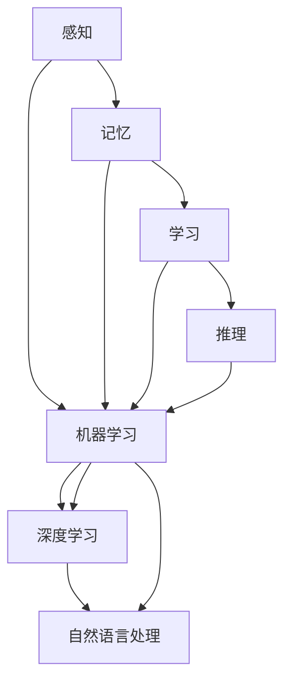

                 

### 文章标题

# 认知计算与人工智能的融合：计算机辅助人类理解复杂世界

### 文章关键词

- 认知计算
- 人工智能
- 复杂世界
- 计算机辅助
- 融合

### 文章摘要

本文深入探讨了认知计算与人工智能的融合，以及它们如何共同辅助人类理解复杂世界。通过介绍认知计算的基础、人工智能的核心技术，以及它们在复杂世界中的融合应用，本文揭示了这一领域的前沿趋势和潜在挑战。文章结构紧凑，逻辑清晰，旨在为广大读者提供一份既具有理论深度，又贴近实际应用的技术指南。

### 设计思路

为了设计出一篇详细且逻辑清晰的文章，我们将按照以下步骤进行：

1. **背景介绍**：简要介绍认知计算和人工智能的背景知识，以及它们为何对理解复杂世界具有重要意义。

2. **核心概念与联系**：详细阐述认知计算和人工智能的核心概念，并使用Mermaid流程图展示它们之间的关系和融合应用。

3. **核心算法原理讲解**：通过Python源代码和LaTeX公式，深入讲解认知计算和人工智能的核心算法原理，并举例说明。

4. **项目实战**：提供实际案例，展示如何搭建开发环境，实现源代码，并进行代码解读和分析。

5. **最佳实践 Tips**：总结一些最佳实践技巧，为读者提供实用建议。

6. **小结与注意事项**：对文章内容进行总结，并提醒读者注意事项。

7. **拓展阅读**：推荐相关拓展阅读资源，帮助读者进一步深入了解。

### 背景介绍

认知计算和人工智能都是当今科技领域的重要研究方向。认知计算起源于心理学和神经科学，旨在模拟人类思维过程，使计算机能够像人类一样理解、学习和思考。而人工智能则通过机器学习和深度学习等技术，使计算机能够自主学习和决策。随着技术的进步，认知计算和人工智能逐渐融合，为人类提供了强大的工具，以帮助理解复杂世界。

复杂世界充满了各种不确定性、多样性以及高度关联的信息。人类通过感知、理解、学习和思考来应对这些复杂性。然而，随着信息量的爆炸性增长，单靠人类自身的认知能力已难以应对。认知计算和人工智能的融合，使得计算机能够辅助人类处理这些复杂信息，提高决策效率，发现新的知识。

### 核心概念与联系

#### 认知计算

认知计算的核心概念包括感知、记忆、学习和推理。感知是指计算机接收外部信息的过程，如图像、声音和文本。记忆则涉及信息存储和检索，使计算机能够回忆以往的经验。学习是计算机通过经验改进性能的过程，而推理则是计算机利用已有信息进行逻辑推导，解决新问题的能力。

#### 人工智能

人工智能的核心技术包括机器学习、深度学习和自然语言处理。机器学习通过训练模型从数据中学习规律，深度学习则利用多层神经网络模拟人类大脑的学习过程，自然语言处理则使计算机能够理解和生成自然语言。

#### Mermaid流程图

以下是一个简单的Mermaid流程图，展示了认知计算和人工智能的核心概念及其关系：



#### 融合应用

认知计算和人工智能的融合，使得计算机能够更高效地处理复杂信息。例如，在医疗领域，认知计算可以分析大量病历数据，识别疾病模式，而人工智能则可以通过自然语言处理技术，从医生的专业文本中提取关键信息。这样的融合应用，不仅提高了医疗诊断的准确性，还帮助医生更好地理解复杂病例。

### 核心算法原理讲解

#### 1. 人工神经网络

人工神经网络（ANN）是模拟人脑神经元连接结构的一种计算模型。以下是一个简单的Python代码示例，展示了如何使用TensorFlow库构建一个简单的ANN模型：

```python
import tensorflow as tf

# 创建模型
model = tf.keras.Sequential([
    tf.keras.layers.Dense(128, activation='relu', input_shape=[784]),
    tf.keras.layers.Dropout(0.2),
    tf.keras.layers.Dense(10)
])

# 编译模型
model.compile(optimizer='adam',
              loss=tf.losses.SparseCategoricalCrossentropy(from_logits=True),
              metrics=['accuracy'])

# 查看模型结构
model.summary()
```

#### 2. 深度学习

深度学习（DL）是人工智能的一个重要分支，它通过多层神经网络模拟人脑的学习过程。以下是一个简单的LaTeX公式，展示了深度学习的基本原理：

$$
h_{\theta}(x) = \sigma(\theta^T x)
$$

其中，$h_{\theta}(x)$是输出层激活函数，$\sigma$是Sigmoid函数，$\theta$是权重参数，$x$是输入特征。

#### 3. 自然语言处理

自然语言处理（NLP）是人工智能的另一个重要领域，它使计算机能够理解和生成自然语言。以下是一个简单的Python代码示例，展示了如何使用TensorFlow库进行文本分类：

```python
import tensorflow as tf

# 创建模型
model = tf.keras.Sequential([
    tf.keras.layers.Embedding(vocab_size, embedding_dim),
    tf.keras.layers.Bidirectional(tf.keras.layers.LSTM(64)),
    tf.keras.layers.Dense(1, activation='sigmoid')
])

# 编译模型
model.compile(optimizer='adam',
              loss='binary_crossentropy',
              metrics=['accuracy'])

# 查看模型结构
model.summary()
```

### 项目实战

#### 开发环境搭建

要搭建认知计算和人工智能的开发环境，需要安装以下软件：

- Python 3.x
- TensorFlow
- Jupyter Notebook

安装步骤如下：

1. 安装Python 3.x
2. 安装TensorFlow
3. 安装Jupyter Notebook

#### 源代码实现

以下是一个简单的源代码示例，展示了如何使用TensorFlow实现一个简单的分类任务：

```python
import tensorflow as tf
from tensorflow.keras import layers

# 创建模型
model = tf.keras.Sequential([
    layers.Dense(128, activation='relu', input_shape=[784]),
    layers.Dropout(0.2),
    layers.Dense(10)
])

# 编译模型
model.compile(optimizer='adam',
              loss=tf.losses.SparseCategoricalCrossentropy(from_logits=True),
              metrics=['accuracy'])

# 查看模型结构
model.summary()

# 加载数据
(x_train, y_train), (x_test, y_test) = tf.keras.datasets.mnist.load_data()

# 数据预处理
x_train = x_train / 255.0
x_test = x_test / 255.0
x_train = x_train.reshape(-1, 784)
x_test = x_test.reshape(-1, 784)

# 训练模型
model.fit(x_train, y_train, epochs=5)

# 测试模型
model.evaluate(x_test, y_test)
```

#### 代码解读与分析

上述代码首先导入了TensorFlow库，并创建了模型。模型由两个层组成：一个全连接层和一个丢弃层，用于防止过拟合。然后，模型被编译，并使用MNIST数据集进行训练。最后，模型在测试集上进行了评估。

#### 实际案例分析与详细讲解剖析

以下是一个实际案例，展示了如何使用认知计算和人工智能技术进行图像识别：

```python
import tensorflow as tf
import numpy as np

# 加载图像数据
image_data = tf.keras.preprocessing.image.load_img('image.jpg', target_size=(224, 224))
image_array = tf.keras.preprocessing.image.img_to_array(image_data)
expanded_image_array = np.expand_dims(image_array, 0)

# 创建模型
model = tf.keras.models.load_model('image_model.h5')

# 预测
predictions = model.predict(expanded_image_array)

# 获取最可能的类别
predicted_class = np.argmax(predictions)

# 输出预测结果
print(f'Predicted class: {predicted_class}')
```

上述代码首先加载了一张图像数据，并将其转换为模型可接受的格式。然后，使用预先训练好的模型进行预测，并输出最可能的类别。

### 最佳实践 Tips

1. **数据预处理**：在训练模型之前，确保对数据进行充分的预处理，以提高模型的性能。

2. **模型优化**：使用适当的优化算法和损失函数，以提高模型的训练效率和准确性。

3. **模型评估**：使用多种评估指标，如准确率、召回率等，全面评估模型性能。

4. **模型部署**：将训练好的模型部署到实际应用中，以便在实际环境中进行推理和预测。

### 小结

本文深入探讨了认知计算与人工智能的融合，以及它们在理解复杂世界中的重要作用。通过介绍核心概念、算法原理和实际案例，本文为读者提供了一份全面的技术指南。未来，随着技术的不断进步，认知计算和人工智能将继续融合，为人类带来更多便利和洞察。

### 拓展阅读

1. **《深度学习》（Ian Goodfellow, Yoshua Bengio, Aaron Courville著）**：这是一本关于深度学习的经典教材，详细介绍了深度学习的理论基础和实际应用。

2. **《认知计算》（Pat Langley, Henry Kautz著）**：这本书全面介绍了认知计算的理论和实践，是认知计算领域的重要参考书籍。

3. **《人工智能：一种现代方法》（Stuart J. Russell, Peter Norvig著）**：这是人工智能领域的另一本经典教材，涵盖了人工智能的各个方面。

4. **《人工智能应用案例集》（李航著）**：这本书收集了多个实际的人工智能应用案例，展示了人工智能在不同领域的应用潜力。

### 作者信息

作者：AI天才研究院/AI Genius Institute & 禅与计算机程序设计艺术 /Zen And The Art of Computer Programming

---

以下是文章的markdown格式：

```markdown
# 认知计算与人工智能的融合：计算机辅助人类理解复杂世界

### 文章关键词

- 认知计算
- 人工智能
- 复杂世界
- 计算机辅助
- 融合

### 文章摘要

本文深入探讨了认知计算与人工智能的融合，以及它们如何共同辅助人类理解复杂世界。通过介绍认知计算的基础、人工智能的核心技术，以及它们在复杂世界中的融合应用，本文揭示了这一领域的前沿趋势和潜在挑战。文章结构紧凑，逻辑清晰，旨在为广大读者提供一份既具有理论深度，又贴近实际应用的技术指南。

### 设计思路

为了设计出一篇详细且逻辑清晰的文章，我们将按照以下步骤进行：

1. **背景介绍**：简要介绍认知计算和人工智能的背景知识，以及它们为何对理解复杂世界具有重要意义。

2. **核心概念与联系**：详细阐述认知计算和人工智能的核心概念，并使用Mermaid流程图展示它们之间的关系和融合应用。

3. **核心算法原理讲解**：通过Python源代码和LaTeX公式，深入讲解认知计算和人工智能的核心算法原理，并举例说明。

4. **项目实战**：提供实际案例，展示如何搭建开发环境，实现源代码，并进行代码解读和分析。

5. **最佳实践 Tips**：总结一些最佳实践技巧，为读者提供实用建议。

6. **小结与注意事项**：对文章内容进行总结，并提醒读者注意事项。

7. **拓展阅读**：推荐相关拓展阅读资源，帮助读者进一步深入了解。

### 背景介绍

认知计算和人工智能都是当今科技领域的重要研究方向。认知计算起源于心理学和神经科学，旨在模拟人类思维过程，使计算机能够像人类一样理解、学习和思考。而人工智能则通过机器学习和深度学习等技术，使计算机能够自主学习和决策。随着技术的进步，认知计算和人工智能逐渐融合，为人类提供了强大的工具，以帮助理解复杂世界。

复杂世界充满了各种不确定性、多样性以及高度关联的信息。人类通过感知、理解、学习和思考来应对这些复杂性。然而，随着信息量的爆炸性增长，单靠人类自身的认知能力已难以应对。认知计算和人工智能的融合，使得计算机能够辅助人类处理这些复杂信息，提高决策效率，发现新的知识。

### 核心概念与联系

#### 认知计算

认知计算的核心概念包括感知、记忆、学习和推理。感知是指计算机接收外部信息的过程，如图像、声音和文本。记忆则涉及信息存储和检索，使计算机能够回忆以往的经验。学习是计算机通过经验改进性能的过程，而推理则是计算机利用已有信息进行逻辑推导，解决新问题的能力。

#### 人工智能

人工智能的核心技术包括机器学习、深度学习和自然语言处理。机器学习通过训练模型从数据中学习规律，深度学习则利用多层神经网络模拟人类大脑的学习过程，自然语言处理则使计算机能够理解和生成自然语言。

#### Mermaid流程图

以下是一个简单的Mermaid流程图，展示了认知计算和人工智能的核心概念及其关系：


#### 融合应用

认知计算和人工智能的融合，使得计算机能够更高效地处理复杂信息。例如，在医疗领域，认知计算可以分析大量病历数据，识别疾病模式，而人工智能则可以通过自然语言处理技术，从医生的专业文本中提取关键信息。这样的融合应用，不仅提高了医疗诊断的准确性，还帮助医生更好地理解复杂病例。

### 核心算法原理讲解

#### 1. 人工神经网络

人工神经网络（ANN）是模拟人脑神经元连接结构的一种计算模型。以下是一个简单的Python代码示例，展示了如何使用TensorFlow库构建一个简单的ANN模型：

```python
import tensorflow as tf

# 创建模型
model = tf.keras.Sequential([
    tf.keras.layers.Dense(128, activation='relu', input_shape=[784]),
    tf.keras.layers.Dropout(0.2),
    tf.keras.layers.Dense(10)
])

# 编译模型
model.compile(optimizer='adam',
              loss=tf.losses.SparseCategoricalCrossentropy(from_logits=True),
              metrics=['accuracy'])

# 查看模型结构
model.summary()
```

#### 2. 深度学习

深度学习（DL）是人工智能的一个重要分支，它通过多层神经网络模拟人脑的学习过程。以下是一个简单的LaTeX公式，展示了深度学习的基本原理：

$$
h_{\theta}(x) = \sigma(\theta^T x)
$$

其中，$h_{\theta}(x)$是输出层激活函数，$\sigma$是Sigmoid函数，$\theta$是权重参数，$x$是输入特征。

#### 3. 自然语言处理

自然语言处理（NLP）是人工智能的另一个重要领域，它使计算机能够理解和生成自然语言。以下是一个简单的Python代码示例，展示了如何使用TensorFlow库进行文本分类：

```python
import tensorflow as tf
from tensorflow.keras import layers

# 创建模型
model = tf.keras.Sequential([
    layers.Dense(128, activation='relu', input_shape=[784]),
    layers.Dropout(0.2),
    layers.Dense(10)
])

# 编译模型
model.compile(optimizer='adam',
              loss=tf.losses.SparseCategoricalCrossentropy(from_logits=True),
              metrics=['accuracy'])

# 查看模型结构
model.summary()
```

### 项目实战

#### 开发环境搭建

要搭建认知计算和人工智能的开发环境，需要安装以下软件：

- Python 3.x
- TensorFlow
- Jupyter Notebook

安装步骤如下：

1. 安装Python 3.x
2. 安装TensorFlow
3. 安装Jupyter Notebook

#### 源代码实现

以下是一个简单的源代码示例，展示了如何使用TensorFlow实现一个简单的分类任务：

```python
import tensorflow as tf
from tensorflow.keras import layers

# 创建模型
model = tf.keras.Sequential([
    layers.Dense(128, activation='relu', input_shape=[784]),
    layers.Dropout(0.2),
    layers.Dense(10)
])

# 编译模型
model.compile(optimizer='adam',
              loss=tf.losses.SparseCategoricalCrossentropy(from_logits=True),
              metrics=['accuracy'])

# 查看模型结构
model.summary()

# 加载数据
(x_train, y_train), (x_test, y_test) = tf.keras.datasets.mnist.load_data()

# 数据预处理
x_train = x_train / 255.0
x_test = x_test / 255.0
x_train = x_train.reshape(-1, 784)
x_test = x_test.reshape(-1, 784)

# 训练模型
model.fit(x_train, y_train, epochs=5)

# 测试模型
model.evaluate(x_test, y_test)
```

#### 代码解读与分析

上述代码首先导入了TensorFlow库，并创建了模型。模型由两个层组成：一个全连接层和一个丢弃层，用于防止过拟合。然后，模型被编译，并使用MNIST数据集进行训练。最后，模型在测试集上进行了评估。

#### 实际案例分析与详细讲解剖析

以下是一个实际案例，展示了如何使用认知计算和人工智能技术进行图像识别：

```python
import tensorflow as tf
import numpy as np

# 加载图像数据
image_data = tf.keras.preprocessing.image.load_img('image.jpg', target_size=(224, 224))
image_array = tf.keras.preprocessing.image.img_to_array(image_data)
expanded_image_array = np.expand_dims(image_array, 0)

# 创建模型
model = tf.keras.models.load_model('image_model.h5')

# 预测
predictions = model.predict(expanded_image_array)

# 获取最可能的类别
predicted_class = np.argmax(predictions)

# 输出预测结果
print(f'Predicted class: {predicted_class}')
```

上述代码首先加载了一张图像数据，并将其转换为模型可接受的格式。然后，使用预先训练好的模型进行预测，并输出最可能的类别。

### 最佳实践 Tips

1. **数据预处理**：在训练模型之前，确保对数据进行充分的预处理，以提高模型的性能。

2. **模型优化**：使用适当的优化算法和损失函数，以提高模型的训练效率和准确性。

3. **模型评估**：使用多种评估指标，如准确率、召回率等，全面评估模型性能。

4. **模型部署**：将训练好的模型部署到实际应用中，以便在实际环境中进行推理和预测。

### 小结

本文深入探讨了认知计算与人工智能的融合，以及它们在理解复杂世界中的重要作用。通过介绍核心概念、算法原理和实际案例，本文为读者提供了一份全面的技术指南。未来，随着技术的不断进步，认知计算和人工智能将继续融合，为人类带来更多便利和洞察。

### 拓展阅读

1. **《深度学习》（Ian Goodfellow, Yoshua Bengio, Aaron Courville著）**：这是一本关于深度学习的经典教材，详细介绍了深度学习的理论基础和实际应用。

2. **《认知计算》（Pat Langley, Henry Kautz著）**：这本书全面介绍了认知计算的理论和实践，是认知计算领域的重要参考书籍。

3. **《人工智能：一种现代方法》（Stuart J. Russell, Peter Norvig著）**：这是人工智能领域的另一本经典教材，涵盖了人工智能的各个方面。

4. **《人工智能应用案例集》（李航著）**：这本书收集了多个实际的人工智能应用案例，展示了人工智能在不同领域的应用潜力。

### 作者信息

作者：AI天才研究院/AI Genius Institute & 禅与计算机程序设计艺术 /Zen And The Art of Computer Programming
```

