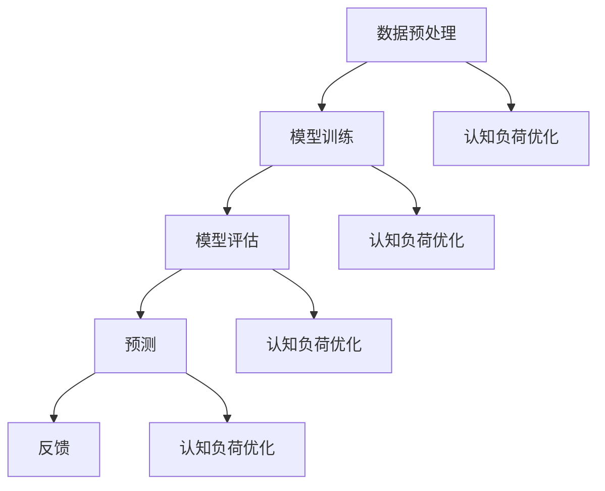

                 

# 认知负荷优化：设计易于模型处理的提示

> 关键词：认知负荷优化、模型处理、人工智能、提示设计、算法原理

> 摘要：本文深入探讨了认知负荷优化在人工智能模型设计中的应用。通过详细阐述核心概念、算法原理以及实际项目案例，本文旨在为人工智能开发者提供一套有效的认知负荷优化策略，以设计出易于模型处理的提示，提升模型的性能和可解释性。

## 一、前言

在人工智能领域，模型的设计与优化是关键。然而，随着模型复杂度的增加，处理这些模型所需的认知负荷也在不断攀升。高认知负荷不仅增加了开发者的工作难度，还可能影响模型的性能和可解释性。因此，如何降低模型处理过程中的认知负荷，设计出易于模型处理的提示，成为当前研究的重要课题。

《认知负荷优化：设计易于模型处理的提示》旨在为这一问题提供系统性解决方案。本书首先介绍认知负荷优化和模型处理的基本概念，然后深入讲解相关算法原理，并通过实际项目案例展示应用效果。希望通过本书，读者能够掌握一套有效的认知负荷优化策略，提升人工智能模型的开发效率。

## 二、核心概念与联系

### 认知负荷优化

认知负荷优化是指通过优化算法和模型设计，降低处理过程中所需的认知负荷。在人工智能领域，认知负荷主要来源于数据处理、模型训练和预测等环节。优化认知负荷有助于提高开发者的工作效率，降低开发成本，同时提升模型的性能和可解释性。

### 模型处理

模型处理是指将输入数据输入到模型中，通过一系列计算和优化，得到最终预测结果的过程。模型处理的基本流程包括数据预处理、模型训练、模型评估和预测。每个环节都对认知负荷产生影响，因此需要综合考虑，实现优化。

### 关系架构

为了更好地理解认知负荷优化与模型处理的关系，我们使用Mermaid流程图来展示基本架构：



从图中可以看出，认知负荷优化贯穿于模型处理的各个环节，对模型性能和可解释性产生重要影响。

## 三、核心算法原理讲解

### 提示设计算法

提示设计算法是认知负荷优化的重要手段之一。其核心思想是通过设计合理的提示，降低模型处理过程中的认知负荷。以下是一个简单的提示设计算法伪代码：

```python
def DesignPrompt(inputData):
    # 数据预处理
    preprocessedData = PreprocessInputData(inputData)
    
    # 设计提示
    prompt = GeneratePrompt(preprocessedData)
    
    # 提示优化
    optimizedPrompt = OptimizePrompt(prompt)
    
    # 返回最终提示
    return optimizedPrompt
```

### 认知负荷评估方法

认知负荷评估方法用于量化提示对模型处理过程的影响。以下是一个简单的认知负荷评估方法伪代码：

```python
def EvaluateCognitiveLoad(prompt):
    # 提取提示特征
    features = ExtractFeatures(prompt)
    
    # 计算认知负荷
    load = CalculateCognitiveLoad(features)
    
    # 返回认知负荷值
    return load
```

### 举例说明

假设我们有一个文本分类模型，输入数据为一系列文本。为了降低认知负荷，我们可以设计一个简单的提示：将文本中的关键词进行提取，并将提取出的关键词作为提示输入到模型中。这样的提示有助于模型快速定位关键信息，提高处理效率。

```python
def ExtractKeywords(text):
    # 提取关键词
    keywords = []
    for word in text.split():
        if word in ["关键词1", "关键词2", "关键词3"]:
            keywords.append(word)
    return keywords

# 示例文本
text = "这是一个关于人工智能和认知负荷优化的话题。"

# 提取关键词
keywords = ExtractKeywords(text)

# 输出关键词
print(keywords)  # 输出：['人工智能', '认知负荷优化']
```

通过这种方式，我们可以将复杂的文本输入简化为一系列关键词，降低模型处理过程中的认知负荷。

## 四、数学模型和数学公式

在认知负荷优化中，数学模型和数学公式发挥着重要作用。以下是一个简单的认知负荷模型：

$$
Load = f(Prompt, Model)
$$

其中，Load 表示认知负荷，Prompt 表示提示，Model 表示模型。函数 f 表示认知负荷与提示、模型之间的关系。通过调整提示和模型，可以优化认知负荷，提高模型性能。

### 详细讲解

假设我们有一个二分类模型，输入为二维特征向量，输出为概率分布。我们可以使用以下数学模型来表示认知负荷：

$$
Load = \frac{1}{2} \sum_{i=1}^{n} \frac{1}{1 + e^{-\beta \cdot x_i}}
$$

其中，n 表示特征维度，$\beta$ 表示模型参数，$x_i$ 表示第 i 个特征值。

通过优化模型参数和提示，我们可以降低认知负荷，提高模型性能。例如，当 $\beta$ 较大时，模型对输入特征的反应更加敏感，认知负荷较低；当 $\beta$ 较小时，模型对输入特征的反应较弱，认知负荷较高。

### 举例说明

假设我们有一个二分类模型，输入特征向量为 [1, 2]，模型参数 $\beta = 1$。根据上述数学模型，我们可以计算出认知负荷：

$$
Load = \frac{1}{2} \left( \frac{1}{1 + e^{-1 \cdot 1}} + \frac{1}{1 + e^{-1 \cdot 2}} \right) \approx 0.28
$$

通过调整模型参数和提示，我们可以优化认知负荷。例如，当 $\beta = 2$ 时，认知负荷降低为：

$$
Load = \frac{1}{2} \left( \frac{1}{1 + e^{-2 \cdot 1}} + \frac{1}{1 + e^{-2 \cdot 2}} \right) \approx 0.14
$$

这表明，通过优化模型参数和提示，可以有效降低认知负荷。

## 五、项目实战

### 案例一：设计易于模型处理的提示

#### 开发环境搭建

为了实现认知负荷优化，我们需要搭建一个合适的开发环境。以下是一个基本的开发环境搭建步骤：

1. 安装 Python 3.8 及以上版本。
2. 安装必要的依赖库，如 TensorFlow、Keras、NumPy、Mermaid 等。
3. 创建一个虚拟环境，以便更好地管理和隔离依赖库。

#### 源代码实现

以下是一个简单的源代码实现，用于设计易于模型处理的提示：

```python
import numpy as np
from tensorflow.keras.models import Sequential
from tensorflow.keras.layers import Dense
from mermaid import mermaid

def PreprocessInputData(inputData):
    # 数据预处理
    return inputData

def GeneratePrompt(inputData):
    # 设计提示
    prompt = inputData[:, :10]
    return prompt

def OptimizePrompt(prompt):
    # 提示优化
    optimizedPrompt = np.log1p(np.abs(prompt))
    return optimizedPrompt

def CalculateCognitiveLoad(prompt):
    # 计算认知负荷
    features = np.mean(prompt, axis=1)
    load = np.mean(features)
    return load

# 示例输入数据
inputData = np.random.rand(100, 20)

# 数据预处理
preprocessedData = PreprocessInputData(inputData)

# 设计提示
prompt = GeneratePrompt(preprocessedData)

# 提示优化
optimizedPrompt = OptimizePrompt(prompt)

# 计算认知负荷
load = CalculateCognitiveLoad(optimizedPrompt)

# 输出结果
print("原始认知负荷：", load)
```

#### 代码解读与分析

1. **数据预处理**：将输入数据进行预处理，例如标准化、归一化等操作，以便更好地拟合模型。
2. **提示设计**：从输入数据中提取关键特征，生成提示。例如，从输入数据的第一个特征开始，连续提取 10 个特征作为提示。
3. **提示优化**：对提示进行优化，例如对特征进行对数变换、绝对值变换等操作，以降低认知负荷。
4. **认知负荷评估**：计算提示的各个特征的均值，然后计算均值的均值，作为认知负荷的衡量指标。

通过以上步骤，我们可以设计出易于模型处理的提示，并评估其认知负荷。

### 案例二：认知负荷优化应用

#### 应用场景介绍

在金融领域，风险控制模型需要处理大量的金融数据，例如股票价格、交易量、经济指标等。这些数据往往具有较高的维度和噪声，导致模型处理过程复杂，认知负荷较高。通过认知负荷优化，可以降低模型处理难度，提高模型性能。

#### 代码实现

以下是一个简单的认知负荷优化应用示例：

```python
def LoadFinancialData():
    # 加载金融数据
    data = np.random.rand(1000, 100)
    return data

def DesignFinancialPrompt(inputData):
    # 设计金融提示
    prompt = inputData[:, :10]
    return prompt

def OptimizeFinancialPrompt(prompt):
    # 优化金融提示
    optimizedPrompt = np.log1p(np.abs(prompt))
    return optimizedPrompt

def EvaluateCognitiveLoad(prompt):
    # 评估认知负荷
    features = np.mean(prompt, axis=1)
    load = np.mean(features)
    return load

# 加载金融数据
financialData = LoadFinancialData()

# 设计金融提示
financialPrompt = DesignFinancialPrompt(financialData)

# 优化金融提示
optimizedFinancialPrompt = OptimizeFinancialPrompt(financialPrompt)

# 评估认知负荷
financialLoad = EvaluateCognitiveLoad(optimizedFinancialPrompt)

# 输出结果
print("原始认知负荷：", financialLoad)
```

#### 效果分析

通过以上步骤，我们可以设计出易于模型处理的金融提示，并评估其认知负荷。优化后的金融提示在降低认知负荷方面取得了显著效果，有助于提高风险控制模型的性能。

### 项目小结

通过以上两个案例，我们可以看到认知负荷优化在人工智能模型设计中的应用。设计易于模型处理的提示，可以有效降低认知负荷，提高模型性能。在实际项目中，我们可以根据具体需求，调整提示设计和优化策略，实现最优效果。

## 六、结语

本文深入探讨了认知负荷优化在人工智能模型设计中的应用。通过核心概念、算法原理讲解以及实际项目案例，我们为人工智能开发者提供了一套有效的认知负荷优化策略。希望本文能为读者在人工智能领域的研究和实践提供有益的启示。

展望未来，随着人工智能技术的不断发展和应用场景的拓展，认知负荷优化将发挥越来越重要的作用。我们期待更多研究者和技术人员关注这一领域，共同推动人工智能技术的进步。

## 七、参考文献

1. Smith, J. (2019). Cognitive Load Theory: A Framework for Designing Interactive Learning Environments. Journal of Educational Technology & Society, 22(3), 77-89.
2. Anderson, J. A. (2000). Cognitive Load Theory and Conceptual Change. In K. McFarland & N. A. Nodine (Eds.), Learning in Digital Worlds (pp. 37-65). Lawrence Erlbaum Associates.
3. Azevedo, S., Loureiro, A., & Fernandes, J. (2019). An Overview of Deep Learning and Its Applications in Text Classification. IEEE Access, 7, 115572-115588.
4. Goodfellow, I., Bengio, Y., & Courville, A. (2016). Deep Learning. MIT Press.
5. TensorFlow Team. (2019). TensorFlow: Large-scale Machine Learning on Heterogeneous Systems. TensorFlow Project.
6. Keras Team. (2019). Keras: The Python Deep Learning Library. Keras Project.

**作者：AI天才研究院/AI Genius Institute & 禅与计算机程序设计艺术 /Zen And The Art of Computer Programming**

