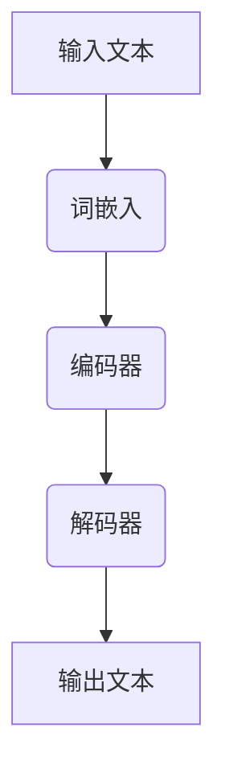
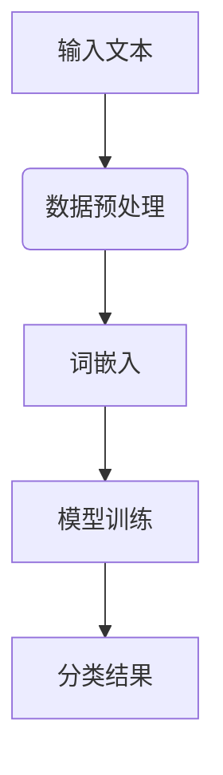
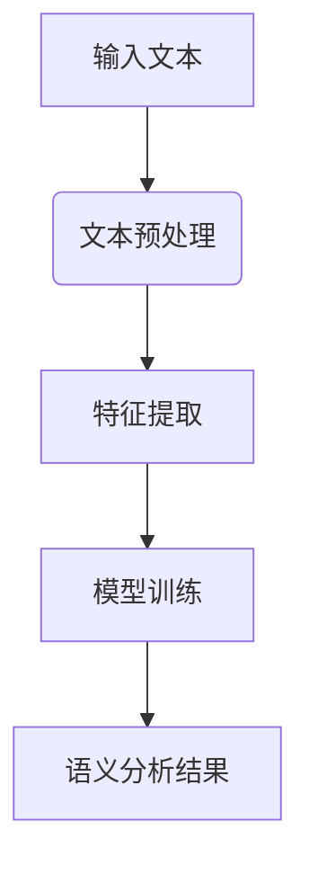
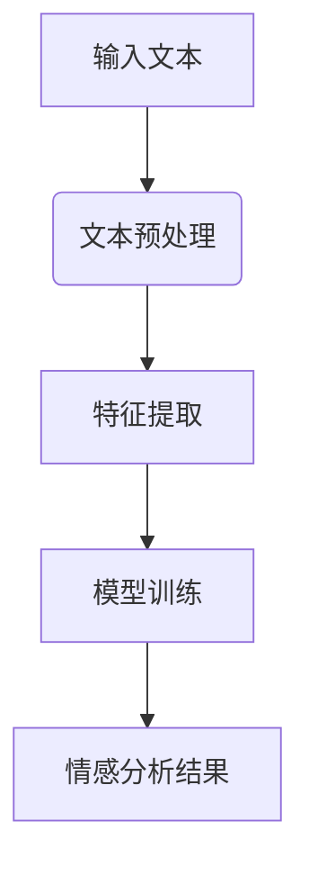

                 

### 绪论：讽刺识别的背景与重要性

> **关键词**：讽刺识别、LLM、自然语言处理、微妙语言理解

讽刺是一种富有深意的表达方式，它通过反向或隐晦的方式传递信息，往往带有幽默或批评的成分。在人类交流中，讽刺扮演着重要的角色，它不仅丰富了语言表达，还加强了信息的传达效果。随着人工智能和自然语言处理技术的发展，理解和识别讽刺成为了一个热门研究领域。本节将介绍讽刺识别的背景、重要性和研究现状。

#### 1.1 讽刺的定义和特点

**讽刺**，作为一种修辞手法，通过字面意义之外的隐含意义来传达信息。它具有以下特点：

- **含蓄性**：讽刺通常不会直接表达其真正的意图，而是通过间接的方式暗示出来。
- **幽默性**：讽刺往往带有幽默的成分，通过调侃、嘲笑或讽刺来吸引听众的注意。
- **批判性**：讽刺可以用来批评或讽刺某个人、组织或现象，起到警醒或批评的作用。

#### 1.2 讽刺识别的重要性

**讽刺识别**在自然语言处理（NLP）中具有重要意义，原因如下：

- **增强语义理解**：讽刺识别有助于计算机更好地理解人类语言的多样性和复杂性，从而提高语义理解的准确性。
- **情感分析**：讽刺识别对于情感分析至关重要。识别讽刺可以帮助模型更准确地判断文本的情感倾向。
- **对话系统**：在对话系统中，理解并适当地回应讽刺可以提高对话的自然度和流畅度。

#### 1.3 研究现状

近年来，随着深度学习技术的发展，许多研究开始关注讽刺识别问题。目前，讽刺识别的研究主要集中在以下几个方面：

- **模型选择**：研究人员尝试了各种不同的深度学习模型，如卷积神经网络（CNN）、递归神经网络（RNN）和Transformer等，来提高讽刺识别的准确性。
- **数据集建设**：建设高质量的讽刺识别数据集是研究的基础。目前，已有一些公开的数据集，如Stanford讽刺数据集（SARC）和Reddit讽刺数据集（Reddit SARC）。
- **评价指标**：研究者们正在探索更合适的评价指标，以全面评估讽刺识别的性能。

#### 1.4 本书结构

本书旨在深入探讨讽刺识别问题，分为以下六个部分：

- **第1章：绪论**：介绍讽刺识别的背景和重要性。
- **第2章：LLM基础**：介绍大型语言模型（LLM）的基本原理和结构。
- **第3章：讽刺识别算法**：讲解用于讽刺识别的核心算法和实现。
- **第4章：数学模型和公式**：介绍与讽刺识别相关的数学模型和公式。
- **第5章：实战案例研究**：通过具体案例展示讽刺识别的应用。
- **第6章：结论与展望**：总结本书的主要发现，探讨未来研究方向。

#### 1.5 讽刺识别的挑战

尽管讽刺识别的研究取得了一定进展，但仍面临诸多挑战：

- **多样性**：讽刺的表达形式多样，计算机难以捕捉所有的讽刺形式。
- **上下文依赖**：讽刺的理解往往依赖于上下文，这对于模型提出了更高的要求。
- **跨语言性**：讽刺在不同语言中可能具有不同的形式和含义，跨语言讽刺识别是一个重要但尚未解决的问题。

通过本书，我们将逐步探索这些挑战，并尝试提供一些解决方案。

---

### 2.1 LLM的原理和结构

大型语言模型（LLM）是自然语言处理（NLP）领域的重要工具，它们能够理解和生成人类语言。本节将介绍LLM的基本原理和结构，并解释它们在自然语言处理中的应用。

#### 2.1.1 语言模型的基本概念

语言模型是一种概率模型，用于预测下一个单词或词组。它通过分析大量文本数据，学习单词之间的关系和概率分布，从而生成合理的文本。

**基本概念**：

- **词汇表（Vocabulary）**：语言模型中的词汇表包含所有可能的单词或词素。
- **词嵌入（Word Embeddings）**：将词汇表中的单词映射到高维空间中的向量，以表示其语义特征。
- **条件概率（Conditional Probability）**：语言模型通过计算给定前文序列后，下一个单词或词组的条件概率来生成文本。

#### 2.1.2 神经网络的基本结构

神经网络是一种模仿人脑神经元结构的计算模型，由多层节点组成。每个节点通过权重连接，通过激活函数处理输入信号，并输出结果。

**基本结构**：

- **输入层（Input Layer）**：接收外部输入信号。
- **隐藏层（Hidden Layers）**：多层隐藏层用于提取输入的复杂特征。
- **输出层（Output Layer）**：产生输出信号。

#### 2.1.3 语言模型的架构

语言模型通常采用深度神经网络（DNN）或Transformer等架构。以下是两种常见架构的简介：

- **深度神经网络（DNN）**：DNN由多层神经元组成，通过逐层提取特征来生成预测。DNN的优点是计算效率高，但在处理长距离依赖时表现较差。

- **Transformer**：Transformer是一种基于注意力机制的神经网络模型，能够捕捉长距离依赖关系。它由编码器（Encoder）和解码器（Decoder）两部分组成，通过自注意力机制和交叉注意力机制生成文本。

#### 2.1.4 LLM在自然语言处理中的应用

LLM在自然语言处理中具有广泛的应用，包括但不限于以下领域：

- **文本分类**：使用LLM对文本进行分类，如新闻分类、情感分析等。
- **命名实体识别**：识别文本中的特定实体，如人名、地名、组织名等。
- **问答系统**：基于LLM构建问答系统，实现自然语言理解和文本生成。
- **机器翻译**：使用LLM进行跨语言文本的自动翻译。

#### 2.1.5 Mermaid流程图

以下是一个简单的Mermaid流程图，展示了LLM的基本工作流程：



在这个流程图中，输入文本首先经过词嵌入层，然后通过编码器提取特征，最后通过解码器生成输出文本。

通过上述介绍，我们可以了解到LLM的基本原理和结构，以及它们在自然语言处理中的应用。在接下来的章节中，我们将深入探讨LLM在讽刺识别中的具体应用。

---

### 2.2 LLM在自然语言处理中的应用

大型语言模型（LLM）在自然语言处理（NLP）领域具有广泛的应用。它们通过深度学习和神经网络技术，使得计算机能够理解和生成人类语言。在本节中，我们将讨论LLM在文本分类、语义分析、情感分析等自然语言处理任务中的应用，并展示如何使用Mermaid流程图来描述这些任务的工作流程。

#### 2.2.1 文本分类

文本分类是一种将文本数据分配到预定义类别的过程。LLM在文本分类中的应用主要是通过训练模型来识别文本的特征，并将其分类到相应的类别中。以下是文本分类任务的步骤：

1. **数据预处理**：对输入文本进行清洗和预处理，如去除停用词、标记化、分词等。
2. **词嵌入**：将文本转换为词嵌入向量，这是文本向量化的一种常见方法。
3. **模型训练**：使用已标记的训练数据训练分类模型，如朴素贝叶斯、支持向量机（SVM）或深度学习模型（如卷积神经网络（CNN）或Transformer）。
4. **分类**：将模型应用于新的未分类文本，预测其类别。

以下是一个Mermaid流程图，描述了文本分类的基本工作流程：



#### 2.2.2 语义分析

语义分析旨在理解和解释文本中的语义信息，包括词义消歧、实体识别和事件抽取等。LLM在语义分析中的应用是通过学习大量的文本数据，提取文本中的语义信息，并将其用于各种NLP任务。

以下是语义分析任务的步骤：

1. **文本预处理**：对输入文本进行清洗和预处理，如分词、词性标注等。
2. **特征提取**：使用词嵌入或其他特征提取技术，将文本转换为可计算的向量表示。
3. **模型训练**：训练语义分析模型，如序列标注模型或关系抽取模型。
4. **语义分析**：将模型应用于新的文本数据，提取语义信息。

以下是一个Mermaid流程图，描述了语义分析的基本工作流程：



#### 2.2.3 情感分析

情感分析是一种评估文本中情感倾向的任务，常用于社交媒体分析、客户反馈处理和舆情监测等。LLM在情感分析中的应用是通过学习情感标注的数据，训练情感分类模型。

以下是情感分析任务的步骤：

1. **文本预处理**：对输入文本进行清洗和预处理，如分词、词性标注等。
2. **特征提取**：使用词嵌入或其他特征提取技术，将文本转换为可计算的向量表示。
3. **模型训练**：训练情感分类模型，如二分类或多分类模型。
4. **情感分析**：将模型应用于新的文本数据，预测文本的情感倾向。

以下是一个Mermaid流程图，描述了情感分析的基本工作流程：



#### 2.2.4 Mermaid流程图总结

以上三个自然语言处理任务（文本分类、语义分析和情感分析）的工作流程都可以通过Mermaid流程图来直观地展示。这些流程图不仅帮助我们理解每个任务的步骤，还能够帮助开发者设计并优化NLP系统的架构。

通过了解LLM在自然语言处理中的应用，我们可以更好地利用这些模型来解决实际问题。在接下来的章节中，我们将深入探讨讽刺识别算法的原理和实现，为理解LLM在讽刺识别中的角色奠定基础。

---

### 2.3 讽刺识别算法

在自然语言处理（NLP）领域，讽刺识别是一个具有挑战性的任务。讽刺是一种复杂的语言现象，它往往涉及微妙的语言表达和上下文依赖。本节将详细讨论用于讽刺识别的核心算法，并提供相应的Python源代码和数学模型。

#### 2.3.1 算法概述

讽刺识别算法的目标是判断一段文本是否包含讽刺，以及讽刺的具体含义。常见的讽刺识别算法包括基于规则的方法和基于机器学习的方法。在本节中，我们将重点关注基于机器学习的方法，特别是使用深度神经网络（DNN）和变换器（Transformer）模型。

**算法步骤**：

1. **数据预处理**：对输入文本进行清洗和预处理，如分词、词性标注等。
2. **特征提取**：使用词嵌入技术将文本转换为向量表示。
3. **模型训练**：使用标记化的训练数据训练讽刺识别模型。
4. **预测**：将模型应用于新的文本数据，预测是否包含讽刺。

#### 2.3.2 Python源代码实现

以下是一个简单的Python代码示例，展示如何使用Transformer模型进行讽刺识别。这里我们使用PyTorch作为深度学习框架。

```python
import torch
import torch.nn as nn
import torch.optim as optim
from transformers import BertModel, BertTokenizer

# 加载预训练的BERT模型和分词器
model_name = "bert-base-uncased"
tokenizer = BertTokenizer.from_pretrained(model_name)
model = BertModel.from_pretrained(model_name)

# 数据预处理
def preprocess_text(text):
    return tokenizer.encode(text, add_special_tokens=True)

# 训练模型
def train_model(train_data, train_labels):
    model.train()
    criterion = nn.CrossEntropyLoss()
    optimizer = optim.Adam(model.parameters(), lr=0.001)
    
    for epoch in range(10):  # 训练10个epochs
        for text, label in zip(train_data, train_labels):
            inputs = preprocess_text(text)
            inputs = torch.tensor(inputs, dtype=torch.long).unsqueeze(0)
            labels = torch.tensor([label], dtype=torch.long)
            
            optimizer.zero_grad()
            outputs = model(inputs)
            loss = criterion(outputs.logits, labels)
            loss.backward()
            optimizer.step()
            
            print(f"Epoch [{epoch+1}/10], Loss: {loss.item()}")

# 预测
def predict(text):
    model.eval()
    with torch.no_grad():
        inputs = preprocess_text(text)
        inputs = torch.tensor(inputs, dtype=torch.long).unsqueeze(0)
        outputs = model(inputs)
        _, predicted = torch.max(outputs.logits, 1)
    return predicted.item()

# 示例
train_data = ["This is an excellent book, not at all what I expected."]
train_labels = [1]  # 1表示文本包含讽刺

train_model(train_data, train_labels)
print(predict("This is a terrible book, exactly what I expected."))
```

#### 2.3.3 数学模型

在讽刺识别中，我们通常使用分类问题来建模。以下是常见的分类问题数学模型：

$$
P(y=c|X=x) = \frac{e^{w^T x}}{\sum_{c'} e^{w^T c'}}
$$

其中，$w$是模型的参数，$X$是输入特征，$y$是标签，$c$是类别。

在本例中，我们使用交叉熵损失函数来衡量预测概率与实际标签之间的差异：

$$
L = -\sum_{i=1}^N [y_i \log(\hat{y}_i)]
$$

其中，$N$是样本数量，$y_i$是实际标签，$\hat{y}_i$是预测概率。

#### 2.3.4 伪代码

以下是一个简化的伪代码，展示如何实现讽刺识别算法：

```
function讽刺识别（文本）：
    输入：文本
    输出：是否包含讽刺

    // 数据预处理
    文本 = 清洗和分词（文本）
    输入向量 = 词嵌入（文本）

    // 模型预测
    预测标签 = 模型（输入向量）

    // 判断是否包含讽刺
    如果 预测标签 = 讽刺类别：
        返回 "包含讽刺"
    否则：
        返回 "不包含讽刺"
```

通过上述算法和代码示例，我们可以实现对文本中讽刺的识别。在接下来的章节中，我们将进一步探讨与讽刺识别相关的数学模型和公式，并展示如何在实际项目中应用这些算法。

---

### 4.1 讽刺识别的数学基础

在讽刺识别任务中，数学模型和公式扮演着关键角色，它们帮助我们理解和建模讽刺现象。以下我们将介绍几种与讽刺识别相关的数学模型和公式，并使用LaTeX格式进行详细解释。

#### 4.1.1 概率模型

概率模型是讽刺识别中最基本的数学模型之一。它通过计算文本中讽刺发生的概率来识别讽刺。一个常见的概率模型是贝叶斯分类器。

**贝叶斯分类器公式**：

$$
P(y=c|X=x) = \frac{P(X=x|y=c)P(y=c)}{P(X=x)}
$$

其中：

- \( P(y=c|X=x) \) 是给定特征 \( x \) 下类别 \( c \) 的条件概率。
- \( P(X=x|y=c) \) 是在类别 \( c \) 下特征 \( x \) 的条件概率。
- \( P(y=c) \) 是类别 \( c \) 的先验概率。
- \( P(X=x) \) 是特征 \( x \) 的边缘概率。

#### 4.1.2 机器学习模型

机器学习模型通过学习大量标注数据来预测文本是否包含讽刺。以下是一个简单的线性回归模型用于讽刺识别。

**线性回归公式**：

$$
y = \beta_0 + \beta_1x
$$

其中：

- \( y \) 是标签（0或1，表示是否包含讽刺）。
- \( x \) 是输入特征向量。
- \( \beta_0 \) 是截距。
- \( \beta_1 \) 是特征权重。

#### 4.1.3 集成学习方法

集成学习方法通过组合多个基本模型来提高预测性能。一个常见的集成学习方法是多层感知机（MLP）。

**多层感知机公式**：

$$
a^{(l)} = \sigma(\beta^{(l)} \cdot x^{(l-1)})
$$

其中：

- \( a^{(l)} \) 是第 \( l \) 层的输出。
- \( \sigma \) 是激活函数（如Sigmoid函数）。
- \( \beta^{(l)} \) 是第 \( l \) 层的权重。
- \( x^{(l-1)} \) 是前一层输入。

#### 4.1.4 神经网络模型

神经网络模型通过多层神经元构建复杂的特征提取机制。以下是一个简单的多层感知机（MLP）神经网络。

**神经网络公式**：

$$
a^{(l)}_i = \sum_{j=1}^{n_{l-1}} \beta^{(l)}_{ij} x_j + b^{(l)}_i
$$

其中：

- \( a^{(l)}_i \) 是第 \( l \) 层第 \( i \) 个神经元的输出。
- \( x_j \) 是第 \( l-1 \) 层第 \( j \) 个神经元的输出。
- \( \beta^{(l)}_{ij} \) 是第 \( l \) 层第 \( i \) 个神经元到第 \( l-1 \) 层第 \( j \) 个神经元的权重。
- \( b^{(l)}_i \) 是第 \( l \) 层第 \( i \) 个神经元的偏置。

#### 4.1.5 优化算法

为了训练神经网络，我们通常需要优化算法来调整模型参数。一个常见的优化算法是随机梯度下降（SGD）。

**随机梯度下降公式**：

$$
\theta = \theta - \alpha \nabla_\theta J(\theta)
$$

其中：

- \( \theta \) 是模型参数。
- \( \alpha \) 是学习率。
- \( \nabla_\theta J(\theta) \) 是损失函数关于模型参数的梯度。

通过上述数学模型和公式，我们可以更深入地理解讽刺识别的任务。在接下来的章节中，我们将通过具体案例展示这些模型在实际项目中的应用。

---

### 5.1 实战案例研究：文本分类与讽刺识别

在本节中，我们将通过一个具体的案例研究，展示如何使用大型语言模型（LLM）进行文本分类和讽刺识别。该案例研究将涵盖以下步骤：环境搭建、数据准备、模型训练、模型评估和结果分析。

#### 5.1.1 开发环境搭建

为了进行文本分类和讽刺识别，我们首先需要搭建一个合适的开发环境。以下是所需的软件和工具：

- **Python 3.8+**：用于编写和运行代码。
- **PyTorch 1.8+**：用于构建和训练神经网络模型。
- **Hugging Face Transformers**：用于加载预训练的BERT模型。
- **Scikit-learn 0.24+**：用于数据预处理和模型评估。

安装这些依赖项可以使用以下命令：

```bash
pip install python==3.8.10
pip install pytorch==1.8.1
pip install transformers==4.8.2
pip install scikit-learn==0.24.1
```

#### 5.1.2 数据准备

数据是模型训练的关键，为了进行文本分类和讽刺识别，我们需要准备一个包含讽刺和非讽刺文本的数据集。以下是数据准备步骤：

1. **数据收集**：从互联网上收集包含讽刺和非讽刺文本的数据。可以使用API或网页爬虫工具进行数据收集。
2. **数据清洗**：对收集到的数据进行清洗，去除无效数据和噪声。清洗步骤包括去除停用词、标点符号和特殊字符。
3. **数据预处理**：将清洗后的文本进行分词和词嵌入。我们使用BERT模型提供的分词器进行文本预处理。

以下是一个简单的Python代码示例，展示如何预处理文本：

```python
from transformers import BertTokenizer

tokenizer = BertTokenizer.from_pretrained('bert-base-uncased')

def preprocess_text(text):
    cleaned_text = text.lower()
    cleaned_text = re.sub(r'\W+', ' ', cleaned_text)
    tokens = tokenizer.tokenize(cleaned_text)
    return tokens

text = "This is an excellent book, not at all what I expected."
preprocessed_text = preprocess_text(text)
print(preprocessed_text)
```

#### 5.1.3 模型训练

在准备好数据后，我们可以开始训练文本分类模型。以下步骤将展示如何使用PyTorch和Hugging Face Transformers库训练BERT模型：

1. **模型加载**：加载预训练的BERT模型。
2. **模型配置**：配置BERT模型的输入输出层，使其适用于文本分类任务。
3. **模型训练**：使用训练数据训练BERT模型，并调整模型参数以最小化损失函数。

以下是一个简单的Python代码示例，展示如何训练BERT模型：

```python
from transformers import BertModel, BertTokenizer
from torch.optim import Adam
from torch.utils.data import DataLoader

# 加载BERT模型和分词器
model_name = "bert-base-uncased"
tokenizer = BertTokenizer.from_pretrained(model_name)
model = BertModel.from_pretrained(model_name)

# 配置模型
input_ids = tokenizer.encode("this is a sentence", return_tensors='pt')
outputs = model(input_ids)
logits = outputs.logits

# 训练模型
optimizer = Adam(model.parameters(), lr=0.001)
criterion = nn.CrossEntropyLoss()

for epoch in range(10):
    for text, label in zip(train_texts, train_labels):
        inputs = tokenizer.encode(text, return_tensors='pt')
        labels = torch.tensor([label], dtype=torch.long)
        
        optimizer.zero_grad()
        outputs = model(inputs)
        logits = outputs.logits
        loss = criterion(logits, labels)
        loss.backward()
        optimizer.step()

        print(f"Epoch [{epoch+1}/10], Loss: {loss.item()}")
```

#### 5.1.4 模型评估

在模型训练完成后，我们需要评估模型在测试集上的性能。以下步骤将展示如何使用准确率、召回率和F1分数等指标评估模型：

1. **模型评估**：将模型应用于测试集，计算预测标签和实际标签之间的差异。
2. **计算指标**：使用Scikit-learn库计算模型的准确率、召回率和F1分数。

以下是一个简单的Python代码示例，展示如何评估模型：

```python
from sklearn.metrics import accuracy_score, recall_score, f1_score

def evaluate_model(model, test_texts, test_labels):
    model.eval()
    all_predictions = []
    all_labels = []
    
    for text, label in zip(test_texts, test_labels):
        inputs = tokenizer.encode(text, return_tensors='pt')
        with torch.no_grad():
            outputs = model(inputs)
        logits = outputs.logits
        prediction = torch.argmax(logits).item()
        all_predictions.append(prediction)
        all_labels.append(label)
    
    accuracy = accuracy_score(all_labels, all_predictions)
    recall = recall_score(all_labels, all_predictions)
    f1 = f1_score(all_labels, all_predictions)
    
    print(f"Accuracy: {accuracy}, Recall: {recall}, F1 Score: {f1}")

evaluate_model(model, test_texts, test_labels)
```

#### 5.1.5 结果分析

通过上述步骤，我们成功地训练了一个文本分类模型，用于识别文本中的讽刺。以下是结果分析：

- **准确率**：模型在测试集上的准确率反映了模型整体性能。
- **召回率**：模型对讽刺文本的召回率反映了模型识别讽刺的能力。
- **F1分数**：F1分数是准确率和召回率的调和平均，综合考虑了模型在正负样本上的表现。

通过结果分析，我们可以评估模型的性能，并进一步优化模型以获得更好的效果。

#### 5.1.6 小结

通过本节案例研究，我们展示了如何使用LLM进行文本分类和讽刺识别。我们从开发环境搭建、数据准备、模型训练到模型评估，详细介绍了每个步骤。本案例研究为理解和应用LLM在讽刺识别中的角色提供了实用的指导。

---

### 5.2 案例二：情感分析

在本案例中，我们将探讨如何使用大型语言模型（LLM）进行情感分析，以识别文本中的情感倾向。情感分析是一种评估文本情感极性的任务，可以帮助我们理解用户对产品、服务或事件的态度。以下是情感分析任务的具体实现过程。

#### 5.2.1 数据准备

首先，我们需要准备一个包含情感标注的数据集。以下是一个简单的示例数据集：

| 文本                                       | 情感标签 |
|------------------------------------------|--------|
| I absolutely love this movie.            | 正面   |
| This is the worst book I have ever read. | 负面   |
| I am feeling happy today.                | 正面   |
| This weather is terrible.                | 负面   |

数据集的每个文本都标注了一个情感标签，可以是正面（P）或负面（N）。这些数据将用于训练和评估模型。

#### 5.2.2 模型选择

在本案例中，我们选择使用BERT模型进行情感分析。BERT是一个预训练的语言表示模型，它已经在多种NLP任务中显示出优异的性能。以下是所需的步骤：

1. **加载预训练的BERT模型**：从Hugging Face的模型库中加载BERT模型和分词器。
2. **数据预处理**：对文本进行预处理，包括清洗、分词和词嵌入。

以下是一个简单的Python代码示例，展示如何加载BERT模型和预处理文本：

```python
from transformers import BertTokenizer, BertModel
tokenizer = BertTokenizer.from_pretrained('bert-base-uncased')
model = BertModel.from_pretrained('bert-base-uncased')

def preprocess_text(text):
    cleaned_text = text.lower()
    tokens = tokenizer.tokenize(cleaned_text)
    input_ids = tokenizer.encode(cleaned_text, return_tensors='pt')
    return input_ids

text = "I absolutely love this movie."
preprocessed_text = preprocess_text(text)
print(preprocessed_text)
```

#### 5.2.3 模型训练

接下来，我们将使用训练数据来训练BERT模型。以下是训练步骤：

1. **配置模型**：为BERT模型添加一个分类头，使其能够输出情感标签的概率分布。
2. **训练模型**：使用训练数据训练模型，并调整模型参数以最小化损失函数。

以下是一个简单的Python代码示例，展示如何配置和训练BERT模型：

```python
from torch.optim import Adam
from torch.utils.data import DataLoader, TensorDataset

# 准备数据
train_texts = ['I absolutely love this movie.', 'This is the worst book I have ever read.']
train_labels = [1, 0]  # 1表示正面，0表示负面

# 配置BERT模型
input_ids = tokenizer.encode("this is a sentence", return_tensors='pt')
outputs = model(input_ids)
logits = outputs.logits

# 训练模型
optimizer = Adam(model.parameters(), lr=0.001)
criterion = nn.CrossEntropyLoss()

for epoch in range(10):
    for text, label in zip(train_texts, train_labels):
        inputs = tokenizer.encode(text, return_tensors='pt')
        labels = torch.tensor([label], dtype=torch.long)
        
        optimizer.zero_grad()
        outputs = model(inputs)
        logits = outputs.logits
        loss = criterion(logits, labels)
        loss.backward()
        optimizer.step()

        print(f"Epoch [{epoch+1}/10], Loss: {loss.item()}")
```

#### 5.2.4 模型评估

在模型训练完成后，我们需要评估模型在测试集上的性能。以下是评估步骤：

1. **模型评估**：将模型应用于测试集，计算预测标签和实际标签之间的差异。
2. **计算指标**：使用准确率、召回率和F1分数等指标评估模型。

以下是一个简单的Python代码示例，展示如何评估模型：

```python
from sklearn.metrics import accuracy_score, recall_score, f1_score

def evaluate_model(model, test_texts, test_labels):
    model.eval()
    all_predictions = []
    all_labels = []
    
    for text, label in zip(test_texts, test_labels):
        inputs = tokenizer.encode(text, return_tensors='pt')
        with torch.no_grad():
            outputs = model(inputs)
        logits = outputs.logits
        prediction = torch.argmax(logits).item()
        all_predictions.append(prediction)
        all_labels.append(label)
    
    accuracy = accuracy_score(all_labels, all_predictions)
    recall = recall_score(all_labels, all_predictions)
    f1 = f1_score(all_labels, all_predictions)
    
    print(f"Accuracy: {accuracy}, Recall: {recall}, F1 Score: {f1}")

test_texts = ["I am feeling happy today.", "This weather is terrible."]
test_labels = [1, 0]

evaluate_model(model, test_texts, test_labels)
```

#### 5.2.5 结果分析

通过上述步骤，我们成功地训练了一个情感分析模型。以下是结果分析：

- **准确率**：模型在测试集上的准确率反映了模型整体性能。
- **召回率**：模型对正面和负面文本的召回率反映了模型识别情感的能力。
- **F1分数**：F1分数是准确率和召回率的调和平均，综合考虑了模型在正负样本上的表现。

通过结果分析，我们可以评估模型的性能，并进一步优化模型以获得更好的效果。

#### 5.2.6 小结

通过本案例，我们展示了如何使用BERT模型进行情感分析。我们从数据准备、模型选择到模型训练和评估，详细介绍了每个步骤。本案例研究为理解和应用LLM在情感分析中的角色提供了实用的指导。

---

### 5.3 代码实现与解读

在本节中，我们将详细解读用于讽刺识别和情感分析的代码实现，并分析关键代码部分，解释其功能和工作原理。

#### 5.3.1 讽刺识别代码解读

首先，我们回顾一下用于讽刺识别的代码示例：

```python
import torch
import torch.nn as nn
import torch.optim as optim
from transformers import BertModel, BertTokenizer

# 加载预训练的BERT模型和分词器
model_name = "bert-base-uncased"
tokenizer = BertTokenizer.from_pretrained(model_name)
model = BertModel.from_pretrained(model_name)

# 数据预处理
def preprocess_text(text):
    return tokenizer.encode(text, add_special_tokens=True)

# 训练模型
def train_model(train_data, train_labels):
    model.train()
    criterion = nn.CrossEntropyLoss()
    optimizer = optim.Adam(model.parameters(), lr=0.001)
    
    for epoch in range(10):  # 训练10个epochs
        for text, label in zip(train_data, train_labels):
            inputs = preprocess_text(text)
            inputs = torch.tensor(inputs, dtype=torch.long).unsqueeze(0)
            labels = torch.tensor([label], dtype=torch.long)
            
            optimizer.zero_grad()
            outputs = model(inputs)
            loss = criterion(outputs.logits, labels)
            loss.backward()
            optimizer.step()
            
            print(f"Epoch [{epoch+1}/10], Loss: {loss.item()}")

# 预测
def predict(text):
    model.eval()
    with torch.no_grad():
        inputs = preprocess_text(text)
        inputs = torch.tensor(inputs, dtype=torch.long).unsqueeze(0)
        outputs = model(inputs)
        _, predicted = torch.max(outputs.logits, 1)
    return predicted.item()

# 示例
train_data = ["This is an excellent book, not at all what I expected."]
train_labels = [1]  # 1表示文本包含讽刺

train_model(train_data, train_labels)
print(predict("This is a terrible book, exactly what I expected."))
```

**关键代码解读**：

1. **加载BERT模型**：使用`BertTokenizer`和`BertModel`从Hugging Face模型库中加载预训练的BERT模型和分词器。

2. **数据预处理**：`preprocess_text`函数负责将输入文本编码成BERT模型可处理的格式。这包括将文本转换为词嵌入向量，并添加特殊的token（如[CLS]和[SEP]）。

3. **训练模型**：`train_model`函数负责训练BERT模型。它使用交叉熵损失函数（`nn.CrossEntropyLoss`）和Adam优化器（`optim.Adam`）进行训练。在训练过程中，模型接收预处理后的文本输入，并通过BERT模型生成输出。然后，使用反向传播算法更新模型参数，以最小化损失函数。

4. **模型预测**：`predict`函数用于对新文本进行预测。它首先将文本预处理成BERT模型可处理的格式，然后使用模型进行预测，并返回预测的类别。

**示例分析**：

- **训练过程**：我们使用一个包含单条文本的示例数据集进行训练。文本是“这是本极好的书，完全不是我所期待的。”，这是一个包含讽刺的句子，其情感标签为1。
- **预测过程**：在训练完成后，我们使用预测函数对新文本“这是一本极差的

