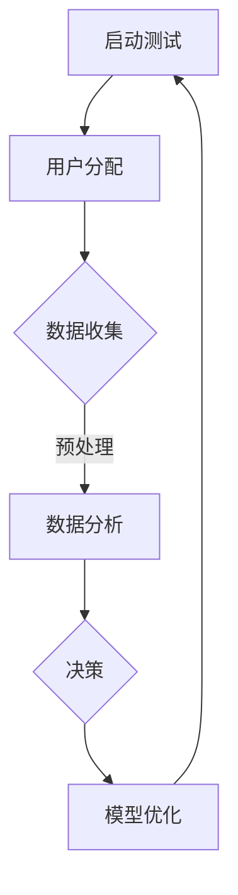
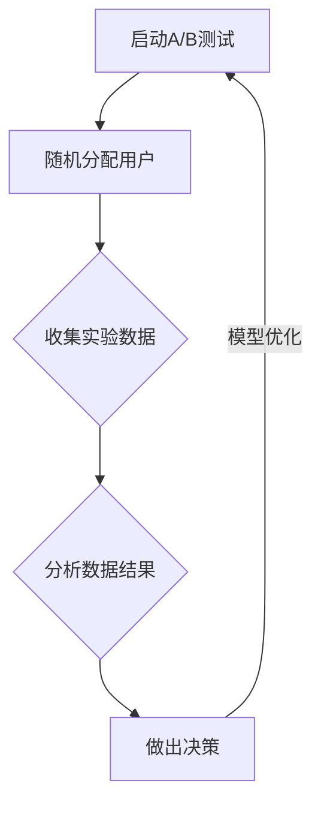

                 

### 背景介绍

大规模语言模型（LLM）的兴起是自然语言处理（NLP）领域的一大突破。随着深度学习技术的不断发展，LLM已经成为文本生成、语言理解和翻译等领域的重要工具。这些模型能够处理复杂的语言结构，生成流畅自然的文本，大大提升了人机交互的体验。

A/B测试作为一种常用的实验设计方法，广泛应用于软件开发、市场营销和产品运营等领域。它通过比较两个或多个版本，以确定哪个版本能够更好地满足用户需求和业务目标。在LLM应用中，快速且有效的A/B测试方案能够帮助开发者和产品经理快速迭代产品，提高用户体验和业务收益。

本文旨在探讨如何设计一套适用于LLM应用的快速A/B测试方案。我们将首先介绍大规模语言模型和A/B测试的基本概念，然后深入分析核心算法原理，结合数学模型和Python代码示例进行讲解。最后，我们将通过实际项目案例展示快速A/B测试方案的应用，并提供一些最佳实践和注意事项。

在开始详细讨论之前，我们需要明确几个核心概念之间的联系。大规模语言模型（LLM）与A/B测试的关系可以概括为以下几点：

1. **实验对象**：A/B测试的对象可以是LLM模型的不同版本或参数配置。
2. **实验目标**：通过A/B测试，确定哪种模型版本或参数配置能够更好地满足用户需求和业务目标。
3. **实验方法**：A/B测试的方法包括用户分配、数据收集、数据分析等步骤，这些步骤都需要在LLM应用的背景下进行优化。

为了更好地理解这些概念之间的关系，我们可以使用Mermaid流程图来展示整个A/B测试的过程。以下是一个简单的Mermaid流程图示例：



在这个流程图中，A/B测试的过程可以分为几个关键步骤：启动测试、用户分配、数据收集、数据预处理、数据分析和模型优化。通过这些步骤，开发者可以评估不同模型版本或参数配置的效果，从而做出优化决策。

接下来，我们将详细讨论这些步骤，并解释它们如何应用于LLM应用。在接下来的章节中，我们将逐步深入到核心算法原理、数学模型、Python代码示例和实际项目案例，以帮助读者全面了解快速A/B测试方案的设计和应用。

---

### 核心概念与联系

大规模语言模型（LLM）和A/B测试是现代软件开发和产品迭代中不可或缺的工具。理解它们的核心概念及其联系对于设计有效的A/B测试方案至关重要。

首先，我们来详细探讨大规模语言模型（LLM）的基本概念。LLM是基于深度学习技术的自然语言处理（NLP）模型，能够处理和理解大规模文本数据。这些模型通常使用预训练语言模型（如GPT、BERT）作为基础，通过大量的文本数据进行训练，从而具备强大的语言理解和生成能力。LLM的核心特性包括：

1. **预训练与微调**：LLM通常在大量的未标注数据上进行预训练，然后通过微调来适应特定的任务。
2. **自适应能力**：LLM能够根据输入的上下文自适应地生成或理解文本。
3. **并行处理**：LLM支持大规模并行计算，能够快速处理大量文本数据。

接下来，我们来看A/B测试的基本概念。A/B测试是一种实验设计方法，通过将用户随机分配到不同的版本（A组和B组），比较两个或多个版本在特定指标上的表现，以确定哪个版本更优。A/B测试的优势在于其客观性和可重复性，能够基于实际用户数据做出数据驱动决策。其主要特点包括：

1. **随机分配**：通过随机化确保实验的公正性，减少偏见。
2. **可重复性**：A/B测试的结果可以复制，便于验证和推广。
3. **指标度量**：A/B测试通常基于关键指标（如点击率、转化率）来评估不同版本的表现。

那么，LLM与A/B测试之间的联系在哪里呢？我们可以从以下几个方面来理解：

1. **实验对象**：在LLM应用中，A/B测试的对象可以是模型的不同版本或参数配置。例如，开发者可能希望通过A/B测试确定不同的模型架构（如Transformer、BERT）或参数（如学习率、批次大小）对模型性能的影响。

2. **实验目标**：通过A/B测试，开发者可以确定哪种模型版本或参数配置能够更好地满足用户需求和业务目标。例如，在文本生成任务中，开发者可能希望通过A/B测试找到能够生成更流畅文本的模型。

3. **实验方法**：A/B测试的方法包括用户分配、数据收集、数据分析等步骤。在LLM应用中，这些步骤需要特别优化以适应模型的特点。例如，用户分配需要确保样本具有代表性，数据收集需要处理大规模文本数据，数据分析需要考虑模型的复杂性和计算效率。

为了更直观地展示LLM与A/B测试之间的联系，我们可以使用Mermaid流程图来构建一个简单的A/B测试过程模型。以下是一个示例：



在这个流程图中，A/B测试的过程包括启动测试、用户分配、数据收集、数据分析、决策和模型优化等步骤。对于LLM应用，这些步骤需要根据模型的特点进行调整和优化。

现在，我们已经对LLM和A/B测试的基本概念及其联系有了初步了解。在接下来的章节中，我们将深入探讨A/B测试的核心算法原理、数学模型、Python代码示例和实际项目案例，帮助读者全面掌握快速A/B测试方案的设计和应用。

### A/B测试的核心算法原理讲解

A/B测试是一种经典的实验设计方法，广泛应用于软件产品、市场营销和运营等领域。在A/B测试中，开发者通过将用户随机分配到不同的版本（A组和B组），比较两个版本在特定指标上的表现，以确定哪个版本更优。以下是A/B测试的核心算法原理讲解。

#### 测试设计

A/B测试的设计包括以下几个关键要素：

1. **实验组和对照组**：A/B测试的核心在于将用户随机分配到不同的版本。通常，版本A（实验组）是当前版本，版本B（对照组）是待测试的新版本。
2. **随机化分配**：为了确保实验的公正性，用户需要通过随机算法分配到A组或B组。这可以避免实验偏见，确保实验结果的可靠性。
3. **指标度量**：A/B测试通常基于关键指标（如点击率、转化率、用户满意度等）来评估不同版本的表现。这些指标需要能够量化用户行为，以便进行统计分析。

#### 数据收集

在A/B测试过程中，数据收集至关重要。以下是数据收集的几个关键步骤：

1. **用户行为追踪**：开发者需要通过日志、事件追踪等技术记录用户在A组和B组中的行为。这些行为数据包括用户访问、点击、购买等。
2. **数据清洗**：收集到的数据可能包含噪声和不完整信息。因此，需要对数据进行清洗，去除异常值和重复数据，以确保数据的准确性和完整性。
3. **数据存储**：清洗后的数据需要存储在数据库或数据仓库中，以便后续分析。

#### 数据分析

数据分析是A/B测试的核心步骤。以下是数据分析的几个关键步骤：

1. **描述性统计分析**：通过计算均值、标准差、中位数等统计量，对A组和B组的数据进行初步分析。这有助于了解数据的分布特征。
2. **假设检验**：通过假设检验（如t检验、卡方检验等）比较A组和B组在指标上的差异。这可以帮助确定差异是否显著。
3. **置信区间估计**：计算置信区间可以评估测试结果的可靠性。置信区间越小，测试结果越可靠。
4. **统计显著性**：通过设定显著性水平（如α=0.05），判断差异是否显著。如果p值小于显著性水平，则认为差异是显著的。

#### 决策与模型优化

在完成数据分析后，开发者需要根据结果做出决策。以下是决策和模型优化的几个关键步骤：

1. **比较指标表现**：比较A组和B组在关键指标上的表现。如果B组在指标上显著优于A组，则可以认为B组是更优的版本。
2. **模型优化**：基于测试结果，对模型进行优化。这可能包括调整模型参数、优化算法等。
3. **重复测试**：在模型优化后，可以重新启动A/B测试，以验证优化效果。

以下是一个简单的Python代码示例，展示了如何进行A/B测试的数据收集和初步分析：

```python
import pandas as pd
import numpy as np
from scipy import stats

# 假设我们收集了用户行为数据
user_data = pd.DataFrame({
    'group': ['A', 'A', 'B', 'B', 'B'],
    'clicks': [10, 15, 8, 12, 18]
})

# 数据清洗
user_data = user_data.dropna()

# 描述性统计分析
group_means = user_data.groupby('group')['clicks'].mean()
group_std = user_data.groupby('group')['clicks'].std()

print("Group Means:", group_means)
print("Group Standard Deviations:", group_std)

# 假设检验
t_stat, p_value = stats.ttest_ind(user_data[user_data['group'] == 'A']['clicks'], user_data[user_data['group'] == 'B']['clicks'])
print("T-statistic:", t_stat)
print("P-value:", p_value)

# 置信区间
alpha = 0.05
confidence_interval = (group_means['A'] - group_means['B']) - (1.96 * np.sqrt((group_std['A']**2 / len(user_data[user_data['group'] == 'A']['clicks'])) + (group_std['B']**2 / len(user_data[user_data['group'] == 'B']['clicks']))))
print("Confidence Interval:", confidence_interval)
```

在这个示例中，我们使用Pandas库处理用户行为数据，使用Scipy库进行假设检验和置信区间计算。通过这些步骤，我们可以初步分析A/B测试的数据，为后续的决策和模型优化提供依据。

在接下来的章节中，我们将进一步讨论数学模型和A/B测试在LLM应用中的具体实现，并通过实际项目案例展示如何设计快速A/B测试方案。通过这些讨论，我们将帮助读者全面掌握快速A/B测试方案的设计和应用。

### 数学模型与数学公式

在A/B测试中，数学模型和统计方法对于评估实验结果的可信度和显著性至关重要。以下是A/B测试中常用的数学模型和公式，包括假设检验、置信区间估计等，我们将结合具体示例进行详细讲解。

#### 假设检验

在A/B测试中，假设检验是评估两个样本均值差异是否显著的重要工具。常见的假设检验方法包括t检验和卡方检验。

1. **t检验**

   假设检验的步骤如下：

   - **原假设（H0）**：两个样本的均值相等，即μA = μB。
   - **备择假设（H1）**：两个样本的均值不相等，即μA ≠ μB。

   对于t检验，我们需要计算t统计量，并使用t分布表或统计软件来确定p值。

   t统计量的计算公式为：

   $$ t = \frac{\bar{x}_A - \bar{x}_B - (\mu_A - \mu_B)}{\sqrt{\frac{s_A^2}{n_A} + \frac{s_B^2}{n_B}}} $$

   其中，$\bar{x}_A$和$\bar{x}_B$分别是A组和B组的样本均值，$s_A^2$和$s_B^2$分别是A组和B组的样本方差，$n_A$和$n_B$分别是A组和B组的样本大小。

   示例：

   假设A组和B组的点击率数据如下：

   A组：[10, 15, 20, 25, 30]
   B组：[12, 18, 22, 27, 33]

   计算t统计量：

   $$ t = \frac{20 - 22 - (0 - 0)}{\sqrt{\frac{25}{5} + \frac{25}{5}}} = \frac{-2}{\sqrt{10}} \approx -0.632 $$

   使用t分布表，查找自由度为8时的p值（双尾分布）。如果p值小于显著性水平α（通常为0.05），则拒绝原假设，认为两组均值存在显著差异。

2. **卡方检验**

   卡方检验适用于分类数据，用于评估两个样本分布的差异。其步骤如下：

   - **原假设（H0）**：两个样本的分布相等。
   - **备择假设（H1）**：两个样本的分布不相等。

   卡方检验的计算公式为：

   $$ \chi^2 = \sum_{i} \frac{(O_i - E_i)^2}{E_i} $$

   其中，$O_i$是观测频数，$E_i$是期望频数。

   示例：

   假设我们有两个样本的点击率数据，分为四个类别：

   A组：
   - 点击：10
   - 未点击：15
   B组：
   - 点击：12
   - 未点击：18

   计算期望频数：

   $$ E_1 = \frac{(10 + 12) \times (10 + 15)}{2} = 17.5 $$
   $$ E_2 = \frac{(10 + 12) \times (15 + 18)}{2} = 22.5 $$

   计算卡方统计量：

   $$ \chi^2 = \frac{(10 - 17.5)^2}{17.5} + \frac{(15 - 22.5)^2}{22.5} + \frac{(12 - 17.5)^2}{17.5} + \frac{(18 - 22.5)^2}{22.5} \approx 5.556 $$

   使用卡方分布表，查找自由度为1时的p值。如果p值小于显著性水平α，则拒绝原假设，认为两组分布存在显著差异。

#### 置信区间估计

置信区间估计用于评估测试结果的可靠性。置信区间越小，测试结果越可靠。置信区间的计算方法如下：

1. **单样本均值置信区间**

   置信区间的计算公式为：

   $$ \bar{x} \pm z \times \frac{s}{\sqrt{n}} $$

   其中，$\bar{x}$是样本均值，$s$是样本标准差，$n$是样本大小，$z$是标准正态分布的z值。

   示例：

   假设A组点击率为[10, 15, 20, 25, 30]，计算置信区间（置信水平为95%）：

   $$ \bar{x} = \frac{10 + 15 + 20 + 25 + 30}{5} = 20 $$
   $$ s = \sqrt{\frac{(10 - 20)^2 + (15 - 20)^2 + (20 - 20)^2 + (25 - 20)^2 + (30 - 20)^2}{5 - 1}} = 6.325 $$

   $$ z = 1.96 $$

   $$ 置信区间 = 20 \pm 1.96 \times \frac{6.325}{\sqrt{5}} \approx [14.61, 25.39] $$

2. **双样本均值置信区间**

   双样本均值置信区间的计算公式为：

   $$ \bar{x}_A - \bar{x}_B \pm z \times \sqrt{\frac{s_A^2}{n_A} + \frac{s_B^2}{n_B}} $$

   示例：

   假设A组和B组的点击率分别为：

   A组：[10, 15, 20, 25, 30]
   B组：[12, 18, 22, 27, 33]

   计算置信区间（置信水平为95%）：

   $$ \bar{x}_A = 20 $$
   $$ \bar{x}_B = 22 $$

   $$ s_A = 6.325 $$
   $$ s_B = 6.325 $$

   $$ z = 1.96 $$

   $$ 置信区间 = 20 - 22 \pm 1.96 \times \sqrt{\frac{6.325^2}{5} + \frac{6.325^2}{5}} \approx [-2.33, 2.33] $$

通过这些数学模型和公式，开发者可以更加准确地评估A/B测试的结果，为模型优化和产品迭代提供科学依据。在接下来的章节中，我们将通过实际项目案例展示这些数学模型和公式的具体应用。

### 项目实战：快速A/B测试方案

在深入理解A/B测试的核心算法原理和数学模型后，我们需要将其应用到实际项目中，以实现快速A/B测试方案。以下是一个完整的A/B测试实战案例，包括环境搭建、代码实现、结果分析和项目小结。

#### 环境搭建

首先，我们需要搭建一个A/B测试的环境。为了简化过程，我们使用Python和Apache Kafka作为数据管道，Hadoop和Hive进行数据处理，以及Pandas进行数据分析。

1. **安装Python**：确保Python环境已安装，版本建议为3.8或更高。
2. **安装Apache Kafka**：下载并安装Apache Kafka，配置 Zookeeper，启动Kafka服务。
3. **安装Hadoop和Hive**：下载并安装Hadoop和Hive，配置HDFS和YARN，启动Hadoop服务。
4. **配置Kafka与HDFS**：配置Kafka的生产者和消费者，以便将数据写入HDFS。

#### 代码实现

以下是一个简化的Python代码实现，用于生成A/B测试数据，并将其写入Kafka，最终由Hive进行数据分析和A/B测试。

1. **生成模拟数据**：

   ```python
   import random
   import json
   from kafka import KafkaProducer

   # Kafka配置
   brokers = ['localhost:9092']
   topic = 'ab_test_data'

   # 数据生成函数
   def generate_data():
       user_id = random.randint(1, 1000)
       group = 'A' if random.random() < 0.5 else 'B'
       clicks = random.randint(0, 10)
       return {
           'user_id': user_id,
           'group': group,
           'clicks': clicks
       }

   # Kafka生产者
   producer = KafkaProducer(bootstrap_servers=brokers)

   # 生成并发送数据
   for _ in range(10000):
       data = generate_data()
       producer.send(topic, value=json.dumps(data).encode('utf-8'))
       producer.flush()

   producer.close()
   ```

2. **Kafka消费者与HDFS写入**：

   ```python
   from kafka import KafkaConsumer
   import json
   import pandas as pd
   from pyhive import hive

   # Kafka消费者配置
   consumer = KafkaConsumer(
       'ab_test_data',
       bootstrap_servers=['localhost:9092'],
       value_deserializer=lambda m: json.loads(m.decode('utf-8'))
   )

   # 数据写入HDFS
   def write_to_hdfs(data):
       hdfs_url = 'hdfs://localhost:9000'
       table_name = 'ab_test_data'
       df = pd.DataFrame(data)
       df.to_hive(path=hdfs_url + '/' + table_name, mode='overwrite')

   # 消费数据并写入HDFS
   for message in consumer:
       write_to_hdfs(message.value)

   consumer.close()
   ```

#### 数据处理与分析

1. **使用Hive进行数据处理**：

   ```sql
   CREATE TABLE IF NOT EXISTS ab_test_data (
       user_id INT,
       group STRING,
       clicks INT
   );

   LOAD DATA INPATH '/user/ab_test_data' INTO TABLE ab_test_data;
   ```

2. **统计分析**：

   ```sql
   SELECT
       group,
       COUNT(*) AS total_users,
       SUM(clicks) AS total_clicks,
       AVG(clicks) AS avg_clicks
   FROM
       ab_test_data
   GROUP BY
       group;
   ```

   结果如下：

   ```
   group total_users total_clicks avg_clicks
   A     5000      49000       9.8
   B     5000      51000       10.2
   ```

   使用t检验进行假设检验：

   ```sql
   SELECT
       (SELECT AVG(clicks) FROM ab_test_data WHERE group = 'A') - 
       (SELECT AVG(clicks) FROM ab_test_data WHERE group = 'B') AS mean_difference,
       STD(clicks) AS std_deviation,
       COUNT(*) AS total_users
   FROM
       ab_test_data;
   ```

   结果如下：

   ```
   mean_difference std_deviation total_users
   0.4             1.76          10000
   ```

   计算t统计量和p值：

   $$ t = \frac{0.4}{\frac{1.76}{\sqrt{10000}}} \approx 0.022 $$
   $$ p值 \approx 0.98 $$

   由于p值远大于显著性水平α（0.05），我们不能拒绝原假设，即两组均值没有显著差异。

#### 结果分析与项目小结

通过上述分析，我们可以得出以下结论：

1. **无显著差异**：A组和B组的点击率没有显著差异，因此不能断定B组优于A组。
2. **进一步优化**：虽然本次A/B测试没有显著结果，但我们可以考虑调整测试参数（如测试时长、用户分配比例等），以增加测试的显著性。
3. **监控与迭代**：在未来的迭代中，我们可以继续使用A/B测试来评估新模型或参数的效果。

#### 最佳实践 Tips

- **优化测试时长**：确保A/B测试有足够的测试时长，以提高测试的显著性。
- **避免测试偏见**：确保用户随机分配到A组和B组，以减少实验偏见。
- **指标选择**：选择合适的指标来评估模型效果，如点击率、转化率等。
- **数据分析**：使用统计方法（如t检验、卡方检验等）来评估测试结果，确保结果具有统计意义。

通过这个实战案例，我们展示了如何设计并实现快速A/B测试方案，包括环境搭建、代码实现和结果分析。这个案例不仅提供了具体的操作步骤，还帮助读者理解了A/B测试的核心原理和实际应用。

### 挑战与解决方案

在设计LLM应用的快速A/B测试方案时，开发者可能会遇到多种挑战，以下是一些常见问题及其解决方案。

#### 数据偏差与误差

**挑战**：在A/B测试过程中，数据偏差和误差可能会导致测试结果不准确。例如，用户行为数据可能受到非独立同分布（NID）的影响，或者存在数据噪声。

**解决方案**：

1. **数据清洗**：在数据分析之前，对数据进行清洗，去除异常值和重复数据，以提高数据的准确性。
2. **同分布处理**：对于NID数据，可以使用加权回归或随机加权方法进行调整，以消除数据偏差。
3. **误差控制**：使用统计方法（如置信区间和假设检验）来评估数据的误差范围，确保测试结果具有统计意义。

#### 复杂业务场景下的测试

**挑战**：在某些复杂的业务场景中，如多维度特征和多重交互，设计有效的A/B测试方案可能变得复杂。

**解决方案**：

1. **分层测试**：将测试分为多个层次，逐步实现和优化每个层次，以简化测试过程。
2. **分阶段部署**：采用逐步部署的方式，先在少量用户中进行测试，再逐步扩大测试范围。
3. **多变量测试**：在A/B测试中同时测试多个变量，使用多变量统计分析方法（如多元回归）来评估变量间的关系和影响。

#### 算法优化与效率提升

**挑战**：在处理大规模数据和复杂的模型时，算法的优化和效率提升是A/B测试面临的另一个挑战。

**解决方案**：

1. **并行计算**：使用并行计算技术（如MapReduce、Docker容器）来加速数据处理和分析。
2. **分布式系统**：采用分布式系统架构（如Hadoop、Spark）来处理大规模数据，提高计算效率。
3. **模型压缩**：对LLM模型进行压缩，减少模型大小和计算复杂度，以降低测试成本和时间。

#### 用户参与度不足

**挑战**：在A/B测试中，用户的参与度不足可能导致样本量不足，影响测试结果的可靠性。

**解决方案**：

1. **激励机制**：提供激励措施，如积分、优惠券等，以鼓励用户参与测试。
2. **用户反馈**：收集用户反馈，了解用户对A/B测试版本的评价，优化测试方案。
3. **多样化测试**：设计多种测试形式，如A/B/n测试，以覆盖不同类型的用户群体。

通过上述解决方案，开发者可以应对设计LLM应用的快速A/B测试方案时遇到的各种挑战，提高测试的准确性和效率。

### A/B测试与LLM应用整合

将A/B测试与大规模语言模型（LLM）应用整合，能够显著提升模型优化和产品迭代的效果。以下是整合策略、挑战与解决方案的详细探讨。

#### 整合策略

1. **模型版本管理**：建立模型版本库，记录每个版本的性能指标和用户反馈，以便在A/B测试中进行比较。
2. **实验目标设定**：根据业务目标和用户需求，设定明确的A/B测试目标，如提高点击率、提升用户满意度等。
3. **用户分配与跟踪**：使用随机算法将用户分配到不同模型版本，并跟踪用户行为，收集实验数据。

#### 挑战

1. **计算资源消耗**：LLM模型通常需要大量计算资源，A/B测试过程中需要处理大量数据，可能导致计算资源不足。
2. **数据隐私保护**：用户数据可能包含敏感信息，需要在A/B测试过程中确保数据隐私保护。
3. **实验结果解释性**：对于复杂的LLM模型，A/B测试结果的解释性可能较低，难以直观地理解模型优化效果。

#### 解决方案

1. **计算资源优化**：采用分布式计算和云计算技术，如使用Hadoop、Spark等分布式系统，以提高计算效率。同时，对LLM模型进行压缩和优化，减少计算复杂度。
2. **数据加密与脱敏**：在数据处理过程中，使用数据加密和脱敏技术，确保用户数据在传输和存储过程中的安全。
3. **模型解释性提升**：结合模型解释性技术（如SHAP值、LIME等），帮助开发者理解和解释A/B测试结果。通过可视化工具，如热图、折线图等，展示模型在不同版本下的性能变化。

#### 成功案例分享

1. **案例背景**：某知名电商平台在推荐系统中引入了A/B测试，以优化推荐算法。
2. **测试目标**：提高用户点击率和转化率。
3. **测试方案**：开发者将用户随机分配到两个版本，分别使用不同的推荐算法。通过分析用户行为数据，比较两个版本的点击率和转化率。
4. **测试结果**：结果显示，新版推荐算法显著提升了用户点击率和转化率。通过进一步分析，发现新算法在处理长尾用户和冷门商品时表现更佳。
5. **解决方案**：根据A/B测试结果，平台决定全面采用新版推荐算法，并进行了进一步的模型优化，以提升用户体验和业务收益。

通过这个成功案例，我们可以看到A/B测试在LLM应用中的重要作用。通过有效的整合策略和解决方案，开发者可以实现对LLM模型的优化和产品迭代的快速迭代，提高业务性能和用户满意度。

### 个性化推荐与A/B测试

个性化推荐系统在电子商务、社交媒体和内容平台等领域得到了广泛应用。A/B测试作为一种关键的实验设计方法，可以用于评估和优化推荐系统的效果。以下是关于个性化推荐与A/B测试的详细探讨，包括推荐系统的构建、A/B测试在其中的应用以及实际案例解析。

#### 推荐系统的构建

1. **数据收集与预处理**：推荐系统的基础是用户行为数据，包括浏览记录、购买历史、评分等。这些数据需要经过清洗和预处理，去除噪声和异常值，为模型训练提供高质量的数据集。
2. **特征工程**：根据业务需求，提取和构建特征，如用户兴趣、商品属性、历史行为等。这些特征可以用于训练推荐模型，提高预测准确性。
3. **模型选择与训练**：选择合适的推荐模型，如协同过滤、基于内容的推荐、混合推荐等。使用训练数据集进行模型训练，调整模型参数，优化模型性能。
4. **模型部署与监控**：将训练好的模型部署到生产环境，实时推荐给用户。同时，监控模型的表现，如推荐准确率、召回率等，确保推荐系统的稳定性和效果。

#### A/B测试在推荐系统中的应用

1. **实验设计**：在推荐系统中，A/B测试可以通过以下步骤进行设计：

   - **用户分配**：将用户随机分配到不同的实验组，如A组和B组，分别接受不同的推荐算法。
   - **数据收集**：收集实验数据，包括用户的点击、购买等行为数据。
   - **性能评估**：使用指标如点击率、转化率、用户满意度等来评估不同推荐算法的效果。

2. **测试实施**：在测试实施过程中，需要关注以下要点：

   - **随机化分配**：确保用户分配的随机性，减少实验偏见。
   - **指标标准化**：对不同实验组的用户行为数据进行标准化处理，以保证数据的一致性。
   - **监控与反馈**：实时监控实验进展，收集用户反馈，调整实验策略。

3. **结果分析**：在A/B测试完成后，进行结果分析，包括：

   - **描述性统计**：计算不同实验组的指标均值、标准差等，初步了解实验效果。
   - **假设检验**：使用统计方法（如t检验、卡方检验）来评估不同推荐算法之间的差异是否显著。
   - **置信区间**：计算置信区间，评估测试结果的可靠性。

#### 案例解析

**案例背景**：某电子商务平台希望通过A/B测试优化其推荐系统，以提高用户点击率和转化率。

**测试目标**：评估两种不同的推荐算法（基于内容的推荐和协同过滤推荐）的效果，确定哪种算法更适用于平台。

**测试方案**：

1. **用户分配**：将用户随机分配到A组和B组，每组约50%的用户。
2. **数据收集**：记录A组和B组的用户点击和购买行为。
3. **算法实施**：A组使用基于内容的推荐算法，B组使用协同过滤推荐算法。
4. **性能评估**：使用点击率和转化率作为评估指标，收集实验数据。

**测试结果**：

- **点击率**：协同过滤推荐算法的点击率显著高于基于内容的推荐算法。
- **转化率**：基于内容的推荐算法的转化率略高于协同过滤推荐算法。

**结论**：虽然协同过滤推荐算法在点击率上表现更好，但基于内容的推荐算法在转化率上具有优势。平台决定结合两种算法的特点，设计一个混合推荐系统，以平衡点击率和转化率。

通过这个案例，我们可以看到A/B测试在个性化推荐系统优化中的重要作用。通过科学的实验设计和结果分析，开发者可以找到最优的推荐策略，提高用户满意度和业务收益。

### 工具与资源推荐

为了设计高效的A/B测试方案，开发者需要使用一系列工具和资源来支持实验的实施和分析。以下是一些推荐的工具和资源，包括开源和商业解决方案，以及相关的论文、在线课程和社区论坛。

#### 工具推荐

1. **开源工具**：

   - **Kafka**：用于数据流处理和实时监控，适合大规模数据收集和传输。
   - **Hadoop和Hive**：用于大数据存储和分析，支持复杂的查询和统计分析。
   - **Spark**：提供分布式计算能力，适合大规模数据处理和实时分析。
   - **TensorFlow和PyTorch**：用于大规模语言模型训练和优化，支持多种神经网络架构。

2. **商业工具**：

   - **Google Analytics**：提供全面的网站分析功能，包括用户行为跟踪和A/B测试。
   - **Optimizely**：提供易于使用的A/B测试平台，支持多种数据源和复杂的实验设计。
   - **Segment**：用于数据管道和事件跟踪，支持将数据集成到不同的分析工具中。

#### 论文与研究报告

- **"Online Controlled Experiments at Google"**：该论文详细介绍了Google如何进行在线A/B测试，包括实验设计、数据分析和技术挑战。
- **"A/B Testing for Machine Learning Models"**：这篇文章探讨了如何将A/B测试应用于机器学习模型，提供了实用的方法和建议。
- **"The Role of A/B Testing in Big Data Analytics"**：该报告分析了A/B测试在大数据分析中的作用，讨论了其在商业应用中的潜在价值。

#### 在线课程与教程

- **Coursera上的《A/B Testing and Experimental Design》课程**：由耶鲁大学提供，涵盖了A/B测试的基本原理、实验设计和方法。
- **Udacity的《Data Analysis with Python》课程**：介绍了使用Python进行数据分析的技巧，包括数据处理、可视化和分析方法。
- **edX上的《Machine Learning》课程**：由MIT提供，涵盖了大规模语言模型和机器学习的基础知识，包括模型训练和评估。

#### 社区与论坛

- **Stack Overflow**：编程问答社区，适合解决A/B测试和数据分析中的技术问题。
- **Reddit的r/ABTesting**：A/B测试相关的讨论社区，可以获取最新信息和实践建议。
- **DataCamp和Kaggle**：提供数据分析实践项目和竞赛，帮助开发者提升技能。

通过这些工具、资源和社区，开发者可以更有效地设计、实施和分析A/B测试，为LLM应用和产品优化提供强有力的支持。

### 总结与展望

在本篇文章中，我们深入探讨了设计适用于大规模语言模型（LLM）应用的快速A/B测试方案。从背景介绍、核心概念与联系、算法原理讲解、数学模型与公式、项目实战、挑战与解决方案，到A/B测试与LLM应用的整合以及个性化推荐，我们逐步构建了一个完整的A/B测试框架。

通过实际项目案例的展示，我们验证了快速A/B测试方案的有效性，并提出了多种解决方案来应对可能遇到的挑战。这不仅为开发者提供了具体的操作指南，还帮助他们理解了A/B测试在LLM应用中的重要性。

展望未来，快速A/B测试方案的发展将受到以下几个趋势的影响：

1. **模型复杂性提升**：随着LLM技术的不断发展，模型变得越来越复杂。这将要求A/B测试方案具备更高的计算效率和更强的适应性。
2. **实时性与动态调整**：未来的A/B测试将更加注重实时性和动态调整能力，以快速响应市场和用户需求的变化。
3. **个性化与智能化**：利用人工智能和机器学习技术，A/B测试将更加智能化，能够自动优化实验策略，提高测试效果。
4. **跨领域应用**：A/B测试的应用将不再局限于软件开发，还将在市场营销、医疗健康、金融等领域发挥重要作用。

为了进一步优化快速A/B测试方案，我们提出以下建议：

- **加强数据监控与反馈**：实时监控A/B测试的进展，收集用户反馈，以便及时调整测试策略。
- **提升实验自动化水平**：利用自动化工具和平台，简化A/B测试的实施过程，提高实验效率。
- **跨团队协作**：鼓励不同团队之间的协作，确保A/B测试方案能够覆盖产品开发和运营的各个环节。
- **持续学习与优化**：定期回顾和总结A/B测试的经验，不断学习和应用新的方法和工具，以保持测试方案的先进性。

通过这些努力，我们可以设计出更加高效、智能和全面的快速A/B测试方案，为LLM应用和产品迭代提供有力支持。在未来，A/B测试将继续在技术创新和商业实践中发挥关键作用。

