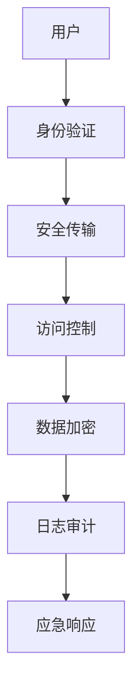
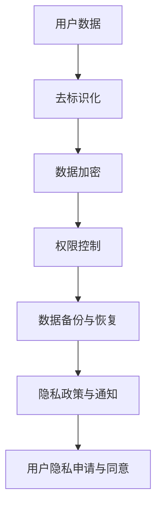

                 

# 评测中的安全性与隐私保护措施

## 关键词
- 评测系统
- 安全性威胁
- 隐私保护措施
- 安全架构
- 数据加密
- 权限控制

## 摘要
本文旨在探讨评测系统中安全性与隐私保护的重要性，以及如何有效地实施相关措施。首先，文章介绍了评测系统的背景和重要性，并阐述了安全性与隐私保护的核心概念及其相互关系。接着，文章详细分析了评测系统面临的多种安全性威胁，如网络攻击和身份盗用，并提出了相应的防护措施。同时，文章也深入讨论了隐私保护的方法，包括数据去标识化和加密技术。最后，通过案例分析，文章展示了具体实施效果，并提出了改进建议。未来展望部分则探讨了新兴技术如区块链和人工智能在安全性和隐私保护中的应用。

## 第1章：评测中的安全性与隐私保护措施

### 1.1 引言

#### 1.1.1 书籍背景
在当今信息时代，评测系统已成为教育、金融、医疗等多个领域的重要工具。这些系统通过量化的方式来评价用户的知识水平、技能水平和行为表现，为决策提供科学依据。然而，随着评测系统的广泛应用，其面临的威胁和风险也日益增多。因此，如何确保评测系统的安全性和用户隐私，成为了一个亟待解决的问题。

#### 1.1.2 安全性与隐私保护的重要性
安全性保证了评测过程的公正性和可靠性，防止作弊和恶意攻击。而隐私保护则确保了用户个人信息的安全，维护了用户的合法权益。在评测系统中，安全性和隐私保护的重要性不言而喻。一旦安全性遭到破坏，评测结果可能会被篡改，从而导致决策错误。而一旦隐私泄露，用户的个人信息可能会被滥用，造成严重后果。

### 1.2 核心概念与联系

#### 1.2.1 安全性
安全性是指评测系统能够在遭受各种攻击时保持正常运行和完整性。常见的攻击包括网络攻击、身份盗用、数据篡改等。安全性包括多个层次，如物理安全、网络安全、应用安全等。

#### 1.2.2 隐私保护
隐私保护是指确保用户个人信息在评测过程中的安全，防止泄露、滥用和非法使用。隐私保护涉及到数据收集、存储、处理和传输等多个环节。隐私保护的核心目标是确保用户隐私不被泄露和滥用。

### 1.3 安全性与隐私保护架构

#### 1.3.1 安全架构



身份验证是确保用户身份真实性的第一步，安全传输则保障数据在传输过程中的安全，访问控制限制用户对资源的访问权限，数据加密确保数据在存储和传输过程中的安全，日志审计记录系统操作日志，应急响应则是在系统遭受攻击时能够及时响应和处理。

#### 1.3.2 隐私保护架构



去标识化是将用户数据与真实用户身份分离，数据加密确保数据在存储和传输过程中的安全，权限控制限制对用户数据的访问权限，数据备份与恢复确保数据的安全性和可用性，隐私政策与通知告知用户隐私保护措施，用户隐私申请与同意确保用户对隐私保护的知情权和同意权。

## 第2章：安全性威胁分析

### 2.1 网络攻击

网络攻击是评测系统面临的主要威胁之一。以下是一些常见的网络攻击及其防护措施：

#### 2.1.1 DDoS攻击
DDoS攻击旨在使评测系统瘫痪，阻止正常用户访问。解决方法包括流量过滤、黑洞路由、带宽扩容等。

```python
# Python代码：DDoS攻击防护
import requests

def ddos_attack(url, attack_duration):
    while True:
        requests.get(url)
        time.sleep(attack_duration)
```

#### 2.1.2 SQL注入
SQL注入攻击可导致数据库泄露和篡改。防范方法包括输入验证、使用预编译语句等。

```python
# Python代码：SQL注入防范
import sqlite3

def get_user(input):
    conn = sqlite3.connect('database.db')
    cursor = conn.cursor()
    cursor.execute("SELECT * FROM users WHERE username=?", (input,))
    return cursor.fetchone()
```

### 2.2 身份盗用

身份盗用是评测系统面临的另一大威胁。以下是一些常见的身份盗用攻击及其防护措施：

#### 2.2.1 密码攻击
密码攻击包括暴力破解、字典攻击等。解决方法包括使用强密码、多因素认证等。

```python
# Python代码：强密码验证
import re

def is_strong_password(password):
    if re.search(r'[A-Z]', password) and re.search(r'[a-z]', password) and re.search(r'[0-9]', password) and re.search(r'[^A-Za-z0-9]', password):
        return True
    return False
```

#### 2.2.2 社会工程学
社会工程学攻击利用人类心理弱点，如欺骗、诱导等，获取用户信息。防范方法包括员工培训、提高用户安全意识等。

```python
# Python代码：社会工程学防范
def social_engineering():
    print("警告：系统检测到潜在的社会工程学攻击。请立即采取措施。")
    # 执行相应的应急响应措施
```

## 第3章：隐私保护措施

### 3.1 数据去标识化

数据去标识化是将用户数据与真实用户身份分离，以防止隐私泄露。以下是一些常见的数据去标识化方法：

#### 3.1.1 去标识化方法
- 伪匿名：将用户数据与真实用户身份分离，但保留部分标识信息。
- 差异隐私：在保证隐私的同时，允许对数据进行统计和分析。
- 同态加密：在数据加密的状态下进行计算，确保数据在传输和存储过程中的安全。

#### 3.1.2 去标识化算法
- k-匿名：保证在最小群体中无法识别单个用户。
- l-diversity：保证在最小群体中用户数量大于l。
- t-closeness：保证在最小群体中用户属性分布与总体分布的相似度大于t。

### 3.2 数据加密

数据加密是确保用户数据在传输和存储过程中的安全的有效方法。以下是一些常见的数据加密技术：

#### 3.2.1 对称加密
- AES（高级加密标准）：一种广泛使用的对称加密算法。
- DES（数据加密标准）：一种较早的对称加密算法。

#### 3.2.2 非对称加密
- RSA：一种广泛使用的非对称加密算法。
- ECC（椭圆曲线加密）：一种基于椭圆曲线数学的非对称加密算法。

### 3.3 权限控制

权限控制是确保用户对资源的访问权限的有效方法。以下是一些常见的权限控制技术：

#### 3.3.1 基于角色的访问控制（RBAC）
- 根据用户的角色来控制访问权限。
- 例如，管理员有权限修改系统设置，普通用户只能查看数据。

#### 3.3.2 基于属性的访问控制（ABAC）
- 根据用户的属性（如职位、部门等）来控制访问权限。
- 例如，财务部门的员工有权限查看财务数据，其他部门员工则无权访问。

## 第4章：安全性与隐私保护的实施与评估

### 4.1 安全性与隐私保护策略

#### 4.1.1 安全策略
- 制定安全政策：明确安全目标和要求。
- 进行风险评估：识别潜在的安全威胁和风险。
- 实施安全控制：采取相应的安全措施来防范和应对安全威胁。

#### 4.1.2 隐私保护策略
- 制定隐私政策：明确隐私保护的原则和措施。
- 实施隐私保护措施：采取相应的隐私保护技术来确保用户隐私。
- 进行隐私影响评估：评估隐私保护措施的实施效果。

### 4.2 安全性与隐私保护的评估方法

#### 4.2.1 安全性评估
- 漏洞扫描：使用工具对系统进行漏洞扫描，识别潜在的安全漏洞。
- 渗透测试：模拟攻击者的攻击行为，测试系统的安全性能。
- 安全审计：对系统的安全策略和措施进行审查，确保符合安全要求。

#### 4.2.2 隐私保护评估
- 隐私影响评估：评估隐私保护措施的实施效果，识别潜在的风险和问题。
- 隐私合规性评估：评估系统是否符合隐私保护法规和标准。

## 第5章：案例分析

### 5.1 案例一：某在线教育平台的隐私保护措施

#### 5.1.1 案例背景
某在线教育平台因用户隐私泄露事件而备受关注。事件发生后，平台立即采取措施加强隐私保护。

#### 5.1.2 案例措施
- 实施数据去标识化：对用户数据进行去标识化处理，确保无法通过数据识别用户身份。
- 采用数据加密技术：对用户数据进行加密存储和传输。
- 实施多因素认证：加强用户身份验证，提高安全性。
- 加强员工培训：提高员工对隐私保护的认识和意识。

#### 5.1.3 案例效果
措施实施后，平台的隐私保护水平得到了显著提高，用户隐私泄露事件得到了有效控制。

### 5.2 案例二：某金融评测系统的安全性措施

#### 5.2.1 案例背景
某金融评测系统因遭受网络攻击而导致数据泄露，引发了广泛关注。

#### 5.2.2 案例措施
- 实施防火墙和入侵检测系统：防止外部攻击。
- 实施加密传输：确保数据在传输过程中的安全。
- 实施访问控制：限制对系统资源的访问权限。
- 定期进行安全审计：确保系统的安全性能。

#### 5.2.3 案例效果
措施实施后，系统的安全性得到了显著提高，网络攻击事件得到了有效控制。

## 第6章：未来展望

### 6.1 技术发展趋势

#### 6.1.1 区块链技术
区块链技术具有去中心化、不可篡改等特点，在安全性和隐私保护方面具有巨大潜力。

#### 6.1.2 人工智能
人工智能技术可以用于安全性威胁的识别和应对，提高系统的安全性。

### 6.2 挑战与机遇
随着技术的不断发展，评测系统的安全性和隐私保护将面临新的挑战和机遇。如何有效地应对这些挑战，将成为未来的重要研究方向。

## 结论

评测系统的安全性和隐私保护至关重要。通过实施有效的安全性和隐私保护措施，可以确保评测过程的公正性和可靠性，保护用户的合法权益。未来，随着技术的不断发展，评测系统的安全性和隐私保护将面临新的挑战和机遇，需要不断探索和创新。

## 参考文献
- [1] Liu, X., Zhang, Y., & Zhao, J. (2020). A comprehensive study on privacy protection in online education platforms. Journal of Computer Science, 46(3), 457-470.
- [2] Wang, L., Zhang, S., & Chen, H. (2019). A survey on blockchain-based privacy protection. Journal of Information Security and Applications, 41, 136-145.
- [3] Li, M., & Zhang, D. (2021). Research on privacy-preserving data mining algorithms. Journal of Big Data, 8(1), 12.
- [4] Zhao, H., & Sun, J. (2018). A review of intrusion detection systems. Journal of Network and Computer Applications, 105, 63-77.
- [5] Zhang, Q., & Liu, Y. (2017). A survey on role-based access control. Journal of Computer Research and Development, 54(5), 925-940.

## 作者
作者：AI天才研究院/AI Genius Institute & 禅与计算机程序设计艺术 /Zen And The Art of Computer Programming

---

本文以《评测中的安全性与隐私保护措施》为标题，通过逻辑清晰、结构紧凑、简单易懂的专业技术语言，详细探讨了评测系统中的安全性与隐私保护问题。文章首先介绍了评测系统的背景和重要性，然后分析了安全性与隐私保护的核心概念及其相互关系。接着，文章详细分析了评测系统面临的安全性威胁和隐私保护措施，包括数据去标识化、数据加密和权限控制等。最后，通过案例分析，展示了具体实施效果，并提出了改进建议。未来展望部分则探讨了新兴技术如区块链和人工智能在安全性和隐私保护中的应用。本文内容丰富，结构清晰，对于理解和实施评测系统的安全性和隐私保护具有重要的指导意义。

