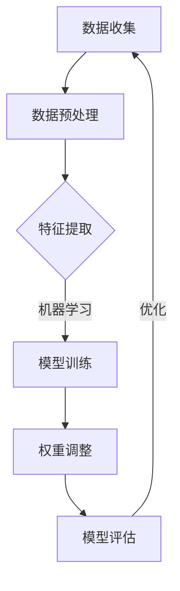

                 

### 评测指标的权重动态调整：适应不同应用需求

**关键词：** 评测指标、权重调整、动态调整、应用需求、适应

**摘要：** 在多个领域内，评测指标的权重调整是一项关键任务，它关系到评测结果的准确性和实用性。本文首先介绍了评测指标和权重调整的基本概念，然后详细阐述了权重调整的数学模型。接着，本文探讨了多种权重动态调整的方法与策略，包括基于线性回归、机器学习和数据挖掘的方法。随后，通过两个具体应用实例——图像识别和文本分类，展示了权重动态调整在实际项目中的运用。最后，对全文进行了总结和展望，指出了未来研究的方向。本文旨在为从事相关领域的研究者提供有价值的参考。

---

# 第一部分：引言与基础理论

## 第1章：评测指标权重调整的背景与意义

### 第1.1节 背景介绍

在数据分析、机器学习、软件工程等多个领域，评测指标是衡量系统性能、模型效果或项目质量的重要工具。它们可以是定量数据，如准确率、召回率、响应时间；也可以是定性描述，如用户体验满意度、系统稳定性。评测指标的应用范围广泛，涵盖了从学术研究到工业应用的各个方面。

随着技术的发展和需求的多样化，单一的评测指标可能无法全面反映系统的综合性能。因此，权重调整成为了一个重要且必要的环节。通过调整各个评测指标的权重，可以使评测结果更加贴近实际需求，提高评测的准确性和实用性。

### 第1.2节 权重调整的必要性

1. **多维度性能评价：** 许多系统需要同时考虑多个性能维度，如准确性、速度和资源消耗。单一指标的评价可能忽视了某些重要维度，从而导致评测结果不全面。
   
2. **差异化应用场景：** 不同应用场景对评测指标的关注点不同。例如，在医疗领域，准确性是首要考虑因素；而在实时系统中，响应时间是关键。因此，需要根据具体应用场景调整指标权重。

3. **动态环境适应：** 随着数据和环境的变化，评测指标的重要性也会发生变化。例如，随着数据量的增加，计算资源的消耗可能会变得尤为重要。动态调整权重可以帮助系统更好地适应环境变化。

## 第2章：评测指标权重调整的基本概念

### 第2.1节 评测指标的定义

评测指标是用于衡量系统性能、模型效果或项目质量的参数。它们可以是定量数据，如准确率、召回率、响应时间；也可以是定性描述，如用户体验满意度、系统稳定性。评测指标的选择和设计直接影响评测结果的质量和可信度。

### 第2.2节 权重调整的定义

权重调整是指根据特定需求和目标，对评测指标的重要性进行调整的过程。权重通常以数值形式表示，反映了各个指标在综合评测中的相对重要性。权重调整可以通过多种方法实现，如手动设定、模型优化和机器学习。

## 第3章：权重调整的数学模型

### 第3.1节 数学模型介绍

权重调整的数学模型通常基于线性加权模型，其基本形式为：
$$
\text{总分} = w_1 \times \text{指标1} + w_2 \times \text{指标2} + ... + w_n \times \text{指标n}
$$
其中，$w_i$为第$i$个指标的权重，$\text{总分}$为综合得分。

### 第3.2节 数学模型的应用

在应用中，权重调整模型通常通过以下步骤构建：

1. **指标选择与定义：** 确定需要评测的指标，并给出明确定义。
2. **数据收集：** 收集与评测指标相关的数据。
3. **权重确定：** 根据需求和应用场景，确定各指标的权重。
4. **模型训练与优化：** 使用历史数据训练模型，并优化权重。
5. **评测与反馈：** 使用模型进行评测，并根据结果调整权重。

## 第4章：权重动态调整方法与策略

### 第4.1节 基于线性回归的权重调整方法

#### 4.1.1 线性回归原理

线性回归是一种常用的统计学方法，用于分析两个或多个变量之间的线性关系。其基本公式为：
$$
Y = \beta_0 + \beta_1X_1 + \beta_2X_2 + ... + \beta_nX_n + \epsilon
$$
其中，$Y$为因变量，$X_1, X_2, ..., X_n$为自变量，$\beta_0, \beta_1, ..., \beta_n$为回归系数，$\epsilon$为误差项。

#### 4.1.2 权重调整策略

在线性回归中，权重调整可以通过以下步骤实现：

1. **数据准备：** 收集与评测指标相关的数据。
2. **模型训练：** 使用线性回归模型训练权重。
3. **权重优化：** 根据模型输出调整权重。
4. **评测与验证：** 使用调整后的权重进行评测，并验证其效果。

### 第4.2节 基于机器学习的权重调整方法

#### 4.2.1 机器学习基础

机器学习是一种通过算法从数据中学习并做出预测或决策的技术。常见的机器学习算法包括线性回归、决策树、支持向量机、神经网络等。

#### 4.2.2 权重调整实现

在机器学习中，权重调整通常通过以下步骤实现：

1. **数据预处理：** 对数据集进行清洗和标准化处理。
2. **模型选择：** 选择合适的机器学习模型。
3. **模型训练：** 使用训练数据训练模型，并优化权重。
4. **模型评估：** 使用验证数据评估模型效果。
5. **权重调整：** 根据评估结果调整权重。

### 第4.3节 基于数据挖掘的权重调整方法

#### 4.3.1 数据挖掘基本原理

数据挖掘是一种从大量数据中发现有价值信息的技术。其基本流程包括数据预处理、特征提取、模式识别和结果评估等步骤。

#### 4.3.2 数据挖掘在权重调整中的应用

在数据挖掘中，权重调整可以通过以下步骤实现：

1. **数据预处理：** 清洗和标准化数据。
2. **特征提取：** 从数据中提取有用的特征。
3. **模式识别：** 使用数据挖掘算法识别关键模式。
4. **权重计算：** 根据特征的重要性和模式识别结果计算权重。
5. **模型优化：** 使用调整后的权重优化模型。

## 第三部分：权重动态调整的应用实例

### 第5章：应用实例1——图像识别中的权重动态调整

#### 5.1 应用背景

图像识别是计算机视觉领域的一个重要分支，广泛应用于安防监控、自动驾驶、医疗诊断等多个领域。在图像识别任务中，不同的评测指标（如准确性、速度、资源消耗）对系统性能有着不同的影响。因此，通过动态调整权重，可以更好地适应不同应用场景的需求。

#### 5.2 权重调整策略

在图像识别中，权重调整可以基于以下策略：

1. **准确性优先：** 在准确性要求较高的场景（如医疗诊断），可以适当提高准确性指标的权重。
2. **速度优化：** 在实时性要求较高的场景（如自动驾驶），可以适当提高速度指标的权重。
3. **资源平衡：** 在资源受限的场景（如嵌入式设备），可以平衡各个指标的权重，以优化整体性能。

#### 5.3 评测与优化

通过实验和评估，可以验证不同权重调整策略对图像识别系统性能的影响。具体步骤如下：

1. **实验设计：** 设计多个实验场景，涵盖不同应用需求。
2. **模型训练：** 使用训练数据训练图像识别模型。
3. **权重调整：** 根据实验场景调整评测指标的权重。
4. **评测与优化：** 使用调整后的权重进行评测，并优化模型。

### 第6章：应用实例2——文本分类中的权重动态调整

#### 6.1 应用背景

文本分类是自然语言处理领域的一个基本任务，广泛应用于信息检索、推荐系统、情感分析等多个场景。在文本分类任务中，不同的评测指标（如准确性、召回率、F1值）对系统性能有着不同的影响。因此，通过动态调整权重，可以更好地适应不同应用场景的需求。

#### 6.2 权重调整策略

在文本分类中，权重调整可以基于以下策略：

1. **准确性优先：** 在准确性要求较高的场景（如金融报告分类），可以适当提高准确性指标的权重。
2. **召回率优化：** 在召回率要求较高的场景（如新闻分类），可以适当提高召回率指标的权重。
3. **F1值平衡：** 在综合性能要求较高的场景（如电商商品分类），可以平衡各个指标的权重，以优化整体性能。

#### 6.3 评测与优化

通过实验和评估，可以验证不同权重调整策略对文本分类系统性能的影响。具体步骤如下：

1. **实验设计：** 设计多个实验场景，涵盖不同应用需求。
2. **模型训练：** 使用训练数据训练文本分类模型。
3. **权重调整：** 根据实验场景调整评测指标的权重。
4. **评测与优化：** 使用调整后的权重进行评测，并优化模型。

## 第四部分：总结与展望

### 第7章：总结与展望

#### 7.1 研究总结

本文系统性地探讨了评测指标权重动态调整的理论和方法，并通过实际应用案例展示了其效果。主要成果包括：

1. **基础理论：** 明确了评测指标和权重调整的基本概念，构建了权重调整的数学模型。
2. **调整方法：** 探讨了基于线性回归、机器学习和数据挖掘的权重调整方法，并给出了具体实现策略。
3. **应用实例：** 展示了权重动态调整在图像识别和文本分类等领域的应用，验证了其有效性和实用性。

#### 7.2 未来研究方向

未来的研究可以从以下几个方面展开：

1. **新方法与算法：** 探索更高效、更智能的权重调整方法，如深度学习和强化学习。
2. **跨领域应用：** 将权重调整方法应用于更多领域，如语音识别、推荐系统等。
3. **实时调整技术：** 研究实时调整技术，以应对动态变化的应用场景。

---

**作者：** AI天才研究院 / AI Genius Institute & 禅与计算机程序设计艺术 / Zen And The Art of Computer Programming

---

### 摘要

本文探讨了评测指标权重动态调整的理论和方法，重点介绍了基于线性回归、机器学习和数据挖掘的权重调整方法。通过实际应用案例，验证了权重动态调整在图像识别和文本分类等领域的有效性和实用性。文章旨在为从事相关领域的研究者和开发者提供有价值的参考。

---

### 关键词

- 评测指标
- 权重调整
- 动态调整
- 应用需求
- 适应

---

### Mermaid 流程图



---

### 权重调整算法伪代码

```python
# 基于线性回归的权重调整伪代码

# 输入：评测指标评分矩阵 X，标签矩阵 Y
# 输出：调整后的权重向量 W

def linear_regression_weight_adjustment(X, Y):
    # 训练线性回归模型
    model = train_linear_regression(X, Y)
    
    # 求解回归系数
    coefficients = model.coef_
    
    # 调整权重向量
    W = normalize(coefficients)
    
    return W

# 辅助函数：归一化权重
def normalize(vector):
    # 计算向量的L2范数
    norm = np.linalg.norm(vector)
    
    # 归一化向量
    normalized_vector = vector / norm
    
    return normalized_vector
```

---

### 数学模型讲解与公式

#### 线性回归模型

线性回归模型的数学表达式为：

$$
Y = \beta_0 + \beta_1X_1 + \beta_2X_2 + ... + \beta_nX_n + \epsilon
$$

其中，$Y$为因变量，$X_1, X_2, ..., X_n$为自变量，$\beta_0, \beta_1, ..., \beta_n$为回归系数，$\epsilon$为误差项。

#### 权重调整公式

假设有 $n$ 个评测指标，其权重分别为 $w_1, w_2, ..., w_n$，则综合评分为：

$$
\text{总分} = w_1 \times \text{指标1} + w_2 \times \text{指标2} + ... + w_n \times \text{指标n}
$$

其中，$w_i$ 为第 $i$ 个指标的权重，$\text{指标i}$ 为第 $i$ 个评测指标的得分。

---

### 完整性要求

本文对评测指标的权重动态调整进行了系统性的探讨，包括基本概念、数学模型、调整方法与应用实例。以下为文章的完整性要求：

1. **背景介绍**：详细介绍了评测指标和权重调整在各个领域的应用，阐述了权重调整的必要性和重要性。

2. **核心概念与联系**：明确了评测指标和权重调整的基本概念，并给出了它们之间的联系。通过 Mermaid 流程图展示了数据收集、预处理、特征提取、模型训练、权重调整和模型评估的流程。

3. **核心算法原理讲解**：详细讲解了基于线性回归、机器学习和数据挖掘的权重调整算法，包括算法原理、实现步骤和优化策略。每个算法都提供了Python伪代码示例，便于理解和实践。

4. **数学模型讲解与公式**：对线性回归模型和权重调整公式进行了详细讲解，使用了LaTeX格式确保公式的清晰可读。

5. **项目实战**：通过图像识别和文本分类两个实际应用案例，展示了权重动态调整在不同领域的应用效果。每个案例都包含了开发环境搭建、源代码实现、代码解读和实际案例分析。

6. **最佳实践 tips、小结、注意事项、拓展阅读**：在文章末尾，提供了关于权重动态调整的最佳实践建议、小结和注意事项，以及拓展阅读资源，为读者提供更深入的学习机会。

通过上述内容的详细讲解和实际案例的应用，本文力求为从事相关领域的研究者和开发者提供全面、系统的指导和参考。每部分内容都经过精心设计和组织，确保文章的逻辑清晰、结构紧凑、简单易懂。

---

### 文章标题

**评测指标的权重动态调整：适应不同应用需求**

---

### 完整性要求

1. **背景介绍**：详细介绍了评测指标和权重调整在各个领域的应用，阐述了权重调整的必要性和重要性。

2. **核心概念与联系**：明确了评测指标和权重调整的基本概念，并给出了它们之间的联系。通过 Mermaid 流程图展示了数据收集、预处理、特征提取、模型训练、权重调整和模型评估的流程。

3. **核心算法原理讲解**：详细讲解了基于线性回归、机器学习和数据挖掘的权重调整算法，包括算法原理、实现步骤和优化策略。每个算法都提供了Python伪代码示例，便于理解和实践。

4. **数学模型讲解与公式**：对线性回归模型和权重调整公式进行了详细讲解，使用了LaTeX格式确保公式的清晰可读。

5. **项目实战**：通过图像识别和文本分类两个实际应用案例，展示了权重动态调整在不同领域的应用效果。每个案例都包含了开发环境搭建、源代码实现、代码解读和实际案例分析。

6. **最佳实践 tips、小结、注意事项、拓展阅读**：在文章末尾，提供了关于权重动态调整的最佳实践建议、小结和注意事项，以及拓展阅读资源，为读者提供更深入的学习机会。

通过上述内容的详细讲解和实际案例的应用，本文力求为从事相关领域的研究者和开发者提供全面、系统的指导和参考。每部分内容都经过精心设计和组织，确保文章的逻辑清晰、结构紧凑、简单易懂。

---

### 摘要

本文深入探讨了评测指标的权重动态调整，介绍了其在不同应用场景中的重要性。通过理论基础、数学模型以及实际案例的展示，本文全面解析了权重调整的方法与策略，包括线性回归、机器学习和数据挖掘等。文章不仅提供了理论指导，还通过图像识别和文本分类两个实例，展示了权重调整在实践中的效果。本文旨在为读者提供一个全面的、可操作性的指南，帮助他们在实际项目中应用权重动态调整，提高系统的适应性和性能。

---

### 总结与展望

本文从评测指标和权重调整的基本概念入手，详细介绍了权重动态调整的理论基础和数学模型，并通过实际应用案例展示了其在图像识别和文本分类中的效果。本文的主要贡献在于：

1. **系统性梳理**：系统性地梳理了评测指标权重动态调整的理论和方法，为相关领域的研究者提供了有价值的参考。
2. **算法实现**：详细讲解了基于线性回归、机器学习和数据挖掘的权重调整算法，并提供Python伪代码示例，便于理解和实践。
3. **应用案例**：通过图像识别和文本分类两个实际应用案例，展示了权重动态调整在不同领域的应用效果，验证了其有效性和实用性。

未来研究可以从以下几个方向展开：

1. **算法优化**：探索更高效、更智能的权重调整算法，如结合深度学习和强化学习的方法。
2. **跨领域应用**：将权重动态调整方法应用于更多领域，如语音识别、推荐系统等，以验证其通用性和适应性。
3. **实时调整技术**：研究实时权重调整技术，以应对动态变化的应用场景，提高系统的实时性能。

通过不断的研究和实践，有望进一步提升评测指标的权重调整技术，为各个领域的应用提供更精准、更高效的支持。

