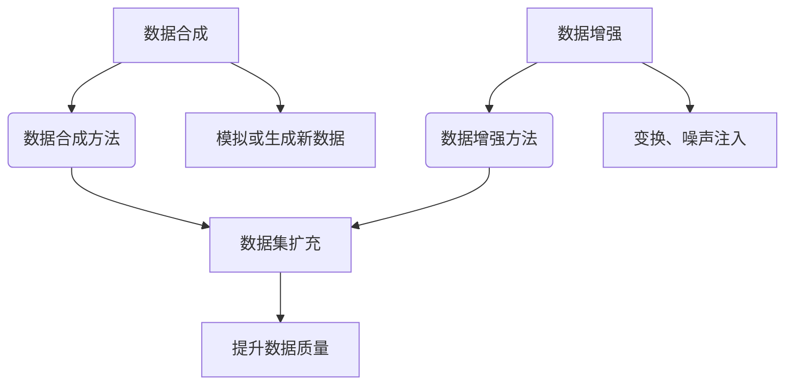

                 

### 引言

#### 背景介绍

在当今的科技时代，人工智能（AI）已经成为各个行业的重要驱动力，而其发展的核心离不开数据。具体而言，AI系统的性能高度依赖训练数据的质量。数据评测作为确保AI系统性能的重要环节，其重要性不言而喻。然而，实际应用中往往面临数据不足、数据分布不均、数据噪音等问题，这些问题严重制约了AI模型的训练效果和应用范围。

数据评测通常涉及对模型性能的多个维度进行评估，包括准确率、召回率、F1值等。为了得到可靠的评测结果，数据集的多样性和代表性至关重要。然而，现实情况中，获取足够量且质量高、分布均衡的数据集往往非常困难。因此，数据合成与增强技术应运而生，成为解决这一问题的有效手段。

数据合成与增强技术旨在通过创造或调整数据来提升数据集的质量和多样性，从而为AI模型的训练提供更好的数据支持。数据合成是通过模拟或生成新的数据样本来扩充数据集；而数据增强则是对现有数据进行操作，如变换、噪声注入等，以丰富数据集的多样性。

本文将系统地探讨数据合成与增强技术，首先介绍数据评测的概念和重要性，接着深入分析数据合成技术的原理和方法，以及常见的数据合成方法。随后，我们将介绍数据增强技术的原理、分类和常见方法，并通过实际案例展示其在不同领域的应用。最后，我们将讨论数据评测工具的选择和使用，总结数据评测实践中的挑战与应对策略，并展望未来发展趋势。

#### 核心概念与联系

数据合成与增强技术在AI领域的核心概念包括：

1. **数据合成（Data Synthesis）**：数据合成是指通过模拟或生成新的数据样本来扩充数据集。其目的是提高数据集的多样性和质量。
   
2. **数据增强（Data Augmentation）**：数据增强则是对现有数据进行操作，如变换、噪声注入等，以丰富数据集的多样性。

两者之间的关系和联系可以概括如下：

- **目标一致性**：数据合成与数据增强的共同目标是提升数据集的多样性和质量，从而为AI模型提供更好的训练数据。
- **方法差异**：数据合成是通过生成全新的数据样本来扩充数据集；而数据增强则是对现有数据样本进行操作，不产生新的数据。
- **应用范围**：数据合成可以应用于任何类型的数据集，特别是当原始数据稀缺时；数据增强则主要应用于图像、语音等可进行各种变换的数据类型。

以下是数据合成与增强技术的流程图，以直观展示其核心概念和联系：



通过上述流程图，我们可以清晰地看到数据合成与增强技术如何通过不同的方法实现提升数据集质量的目标。

### 数据合成技术

#### 原理与方法

数据合成技术是利用已有的数据、模型或其他方法生成新的数据样本，以扩充数据集的多样性和质量。其核心原理是通过模拟真实数据分布或生成新的数据来弥补原始数据集的不足。以下是几种常见的数据合成方法及其工作原理：

1. **概率生成模型**：概率生成模型是基于统计学原理和数据分布来生成新的数据样本。常见的模型包括生成对抗网络（GAN）、变分自编码器（VAE）等。

   - **生成对抗网络（GAN）**：GAN由生成器（Generator）和判别器（Discriminator）两部分组成。生成器试图生成与真实数据相似的数据样本，而判别器则判断生成器生成的数据样本是否真实。通过这种对抗训练，生成器可以不断提高生成数据的质量。
   
   - **变分自编码器（VAE）**：VAE通过概率编码的方式生成数据。它将输入数据映射到一个潜在空间，再从这个潜在空间采样生成新的数据。这种模型利用了贝叶斯推理和隐变量模型，可以生成具有一定多样性的数据样本。

2. **基于规则的方法**：基于规则的方法通过预先定义的规则或模式来生成数据。这种方法通常适用于结构化数据或具有明确规则的数据集。

   - **模板填充法**：模板填充法是将真实数据中的部分或全部内容替换为随机或预设的值。例如，在生成文本数据时，可以使用模板和填充词来生成新的文本。

   - **规则演变法**：规则演变法通过迭代地修改数据集中的现有规则来生成新的数据。这种方法可以用于数据合成，特别是在规则基础型的知识图谱或数据库中。

3. **迁移学习**：迁移学习是一种利用已有模型或数据生成新数据的方法。通过在源域（Source Domain）训练一个模型，并将其迁移到目标域（Target Domain），从而生成目标域的新数据。

   - **模型迁移法**：模型迁移法是将预训练的模型应用于新任务或数据集，通过微调模型来生成新的数据样本。
   
   - **数据增强法**：在迁移学习中，数据增强也是一种常用的技术，通过在现有数据集上应用各种变换（如旋转、缩放、噪声注入等）来生成新的数据样本。

#### 数据合成方法的优缺点分析

各种数据合成方法各有优缺点：

- **概率生成模型（GAN、VAE）**：
  - **优点**：能够生成高质量、多样性的数据样本；适用于多种类型的数据。
  - **缺点**：训练过程复杂，易陷入局部最优；生成数据的真实性与多样性难以控制。

- **基于规则的方法**：
  - **优点**：简单易懂，适用于结构化数据；易于实现和调整。
  - **缺点**：生成数据的真实性和多样性受限；对于复杂或不确定的数据，效果不佳。

- **迁移学习**：
  - **优点**：可以利用已有模型快速生成新数据；减少对大规模训练数据的需求。
  - **缺点**：迁移效果取决于源域和目标域的相似性；可能引入源域的偏差。

#### 常见的数据合成方法

以下是几种常见的数据合成方法及其应用场景：

1. **生成对抗网络（GAN）**：GAN常用于图像、语音和自然语言处理等领域的数据生成。例如，在图像识别任务中，GAN可以生成与真实图像相似的训练样本，从而提升模型的训练效果。

2. **变分自编码器（VAE）**：VAE在图像和文本数据合成中应用广泛。例如，在图像去噪任务中，VAE可以生成去噪后的图像；在文本生成任务中，VAE可以生成具有多样性的文本。

3. **基于规则的方法**：基于规则的方法在结构化数据集，如金融数据、医学数据等应用中较为常见。例如，通过规则生成新的金融交易记录或医疗病例。

4. **迁移学习**：迁移学习在多个领域都有应用，如计算机视觉、自然语言处理和语音识别。例如，通过在图像分类任务中使用预训练的卷积神经网络（CNN），可以快速生成新的图像数据集。

通过上述对数据合成技术的原理、方法及其优缺点的分析，我们可以更好地理解数据合成在AI领域的重要性，并选择合适的方法来扩充和提升数据集的质量。

### 数据增强技术

#### 原理与方法

数据增强技术是通过各种操作对现有数据进行变换，以丰富数据集的多样性和质量，从而提高AI模型的训练效果。其核心原理在于利用现有的数据样本，通过变换、噪声注入等方法生成新的数据样本。以下是几种常见的数据增强方法及其工作原理：

1. **图像增强**：
   - **旋转和翻转**：通过随机旋转或翻转图像，可以增加数据集的多样性。例如，对于一张人脸图像，可以随机旋转或水平翻转，以生成新的训练样本。
   - **缩放和裁剪**：通过随机缩放和裁剪图像，可以增加数据集中图像的大小和形状的多样性。例如，将图像随机缩放到不同的尺寸，或者随机裁剪出图像的一部分。
   - **颜色调整**：通过调整图像的亮度、对比度、饱和度等参数，可以改变图像的外观，从而增加数据集的多样性。
   - **噪声注入**：通过在图像中添加噪声，可以增加数据集中的噪声水平，有助于模型学习噪声数据和鲁棒性。

2. **语音增强**：
   - **时间变换**：通过将语音信号随机时间拉伸或压缩，可以增加语音信号的节奏多样性。
   - **频率变换**：通过将语音信号随机频率拉伸或压缩，可以增加语音信号的音调多样性。
   - **噪声注入**：通过在语音信号中添加噪声，可以模拟真实环境中的噪声，从而增强模型的噪声处理能力。
   - **说话人变换**：通过改变语音信号的说话人特征，可以增加数据集中说话人的多样性。

3. **文本增强**：
   - **同义词替换**：通过将文本中的词语替换为同义词，可以增加文本的词汇多样性。
   - **句子重写**：通过重新构造句子结构，可以增加文本的表达多样性。
   - **噪声注入**：通过在文本中添加噪声（如拼写错误、词性变化等），可以增加文本的数据多样性，从而提高模型的鲁棒性。

#### 数据增强方法的优缺点分析

各种数据增强方法各有优缺点：

- **图像增强**：
  - **优点**：简单易行，可以显著提高图像数据集的多样性；有助于模型学习到不同的图像特征。
  - **缺点**：可能会引入不必要的数据变形，影响模型的训练效果；对于复杂的图像变换，效果可能不理想。

- **语音增强**：
  - **优点**：可以提高语音数据集的多样性，增强模型的噪声处理能力；有助于模型学习到不同说话人的特征。
  - **缺点**：可能引入过度的噪声，导致模型训练困难；对语音信号的细微变化敏感，可能影响模型的训练效果。

- **文本增强**：
  - **优点**：可以显著提高文本数据集的多样性，增强模型的鲁棒性；有助于模型学习到不同的表达方式。
  - **缺点**：可能引入语义上的误解，影响模型的语义理解能力；对文本的复杂结构变化敏感，可能影响模型的训练效果。

#### 常见的数据增强方法

以下是几种常见的数据增强方法及其应用场景：

1. **图像增强**：
   - **随机裁剪**：适用于对象识别和检测任务，可以增加图像中的对象位置和姿态的多样性。
   - **随机旋转和翻转**：适用于图像分类和识别任务，可以增加图像的方向和对称性的多样性。
   - **随机颜色调整**：适用于图像分类任务，可以增加图像的色彩和亮度的多样性。

2. **语音增强**：
   - **时间变换**：适用于语音识别和说话人识别任务，可以增加语音信号的节奏多样性。
   - **频率变换**：适用于语音识别和说话人识别任务，可以增加语音信号的音调多样性。
   - **噪声注入**：适用于噪声环境下的语音识别和说话人识别任务，可以增加模型的噪声处理能力。

3. **文本增强**：
   - **同义词替换**：适用于文本分类和情感分析任务，可以增加文本的词汇多样性。
   - **句子重写**：适用于问答系统和机器翻译任务，可以增加文本的表达多样性。
   - **噪声注入**：适用于文本分类和情感分析任务，可以增加文本的噪声水平，提高模型的鲁棒性。

通过上述对数据增强技术的原理、方法及其优缺点的分析，我们可以更好地理解数据增强在AI领域的重要性，并选择合适的方法来丰富和提升数据集的质量。

### 数据合成与增强技术在不同领域的应用

数据合成与增强技术在计算机视觉、语音识别和自然语言处理等多个领域都展现出了显著的应用价值。以下是对这些技术在各个领域应用的具体案例分析：

#### 计算机视觉

在计算机视觉领域，数据合成与增强技术被广泛应用于图像分类、目标检测和图像生成等任务中。

- **图像生成**：使用生成对抗网络（GAN）等技术，可以生成大量的模拟图像，用于训练深度学习模型。例如，StyleGAN能够生成高分辨率的逼真人脸图像，这些图像对于人脸识别系统训练至关重要。此外，DeepArt.io 利用卷积神经网络生成具有艺术风格的图像，这些图像可用于艺术创作和视觉效果的增强。

- **目标检测**：数据增强技术如随机裁剪、旋转和缩放，可以显著提高目标检测模型在现实世界中的表现。例如，Faster R-CNN 等目标检测模型通过应用这些数据增强方法，能够更好地处理不同的目标姿态和遮挡问题，从而提升检测准确率。

- **图像分类**：通过数据合成技术，可以生成不同光照、背景和姿态的图像，从而提高图像分类模型的泛化能力。例如，CelebA 数据集通过合成不同的光照条件和人脸姿态，使得预训练的模型能够更好地适应各种实际场景。

#### 语音识别

在语音识别领域，数据合成与增强技术用于生成更多的训练数据，提高模型对噪声和环境变化的鲁棒性。

- **噪声添加**：通过在语音信号中添加不同类型的噪声（如交通噪声、人声噪声等），可以训练语音识别模型在不同噪声环境下的表现。例如，DBSCAN 噪声数据库包含了多种噪声样本，这些样本可以用于噪声鲁棒性训练。

- **说话人变换**：通过改变语音信号的说话人特征，可以增加数据集中说话人的多样性，从而提高模型的泛化能力。例如，使用说话人变换技术，可以将不同说话人的语音信号转换为同一说话人的声音，以训练说话人识别模型。

- **时间变换**：通过时间拉伸和压缩语音信号，可以增加语音信号的节奏多样性，从而提高模型对节奏变化的适应性。例如，谷歌的语音合成系统使用时间变换技术来生成不同节奏的语音，以提高语音合成的自然度。

#### 自然语言处理

在自然语言处理领域，数据合成与增强技术被用于文本分类、机器翻译和情感分析等任务中。

- **文本合成**：通过同义词替换、句子重写等技术，可以生成具有多样性的文本数据，用于训练文本分类和情感分析模型。例如，GPT-3 等大型语言模型通过生成大量合成文本，提高了模型在自然语言理解任务中的表现。

- **噪声注入**：通过在文本中添加噪声（如拼写错误、词性变化等），可以增加文本数据集的多样性，从而提高模型的鲁棒性。例如，SpaCy 等自然语言处理库提供了噪声注入功能，用于训练情感分析模型，以提高其对噪声文本的识别能力。

- **翻译增强**：通过数据合成技术生成新的翻译数据，可以丰富机器翻译数据集，从而提高翻译模型的准确性。例如，谷歌翻译系统通过合成不同的翻译版本，增强了机器翻译模型的训练效果。

通过以上案例分析，我们可以看到数据合成与增强技术在各个领域的应用效果和重要性。这些技术不仅能够提高AI模型的数据质量和多样性，还能增强模型的泛化能力和鲁棒性，从而推动AI技术的发展和应用。

### 数据评测工具

#### 概述与分类

数据评测工具在人工智能模型训练和评估过程中起着至关重要的作用。这些工具用于测量模型的性能，比较不同模型的优劣，并提供有关模型预测准确性的详细分析。根据应用场景和数据类型，数据评测工具可以分为以下几类：

1. **图像数据评测工具**：这类工具主要用于评估计算机视觉模型的性能。常见的工具包括：

   - **ImageNet**：用于评估图像分类模型的性能，其数据集包含大量经过标注的图像，并广泛用于各种图像分类挑战。
   - **COCO（Common Objects in Context）**：用于评估目标检测和分割模型的表现，其数据集包含复杂的背景和多种对象，常用于目标检测和实例分割任务。
   - **CelebA**：用于评估人脸识别和属性分类模型的性能，其数据集包含大量名人图像及其标注。

2. **文本数据评测工具**：这类工具主要用于评估自然语言处理模型的性能。常见的工具包括：

   - **GLUE（General Language Understanding Evaluation）**：是一个大规模的多语言自然语言处理基准测试，包括多种文本分类和序列标注任务。
   - **SQuAD（Stanford Question Answering Dataset）**：用于评估问答系统的性能，其数据集包含大量问题-答案对，常用于问答和阅读理解任务。
   - **BERTweet**：用于评估Twitter文本上的BERT模型的性能，其数据集包含大量Twitter推文及其标签。

3. **语音数据评测工具**：这类工具主要用于评估语音识别和说话人识别模型的性能。常见的工具包括：

   - **LibriSpeech**：用于评估语音识别模型的性能，其数据集包含大量文本和语音标注的录音。
   - **TED-LIUM**：用于评估说话人识别模型的性能，其数据集包含多种语言和说话人的语音录音。

#### 常见的数据评测工具介绍

以下是几种常见的数据评测工具及其功能和特点：

1. **TensorFlow Model Optimization Toolkit (TF-MOT)**：TF-MOT 是一个用于模型优化和评估的工具包，它支持多种机器学习和深度学习模型的优化和评估。TF-MOT 提供了多种性能指标，如准确率、召回率和 F1 值，并支持图像、文本和语音等多种数据类型。

2. **scikit-learn**：scikit-learn 是一个流行的机器学习库，它提供了丰富的数据评估工具，如分类报告（classification_report）、交叉验证（cross_val_score）等。scikit-learn 支持多种机器学习算法和评估指标，适用于多种数据类型。

3. **Metrics**：Metrics 是一个开源的机器学习性能评估库，它支持多种机器学习和深度学习模型的评估，包括分类、回归和聚类任务。Metrics 提供了多种性能指标，如准确率、召回率、F1 值和ROC曲线等，并支持自定义指标。

4. **WAV2VEC 2.0**：WAV2VEC 2.0 是一个用于语音识别任务的深度学习模型，它由OpenAI 开发。WAV2VEC 2.0 使用自监督学习技术，可以在没有标注数据的情况下训练模型。其评测工具包括评估模型在多种语音数据集上的性能指标，如词错（word error rate，WER）和字符错（character error rate，CER）。

#### 数据评测工具的优缺点分析

各种数据评测工具各有优缺点：

- **TensorFlow Model Optimization Toolkit (TF-MOT)**：
  - **优点**：支持多种模型优化和评估方法；提供多种性能指标；易于集成和使用。
  - **缺点**：依赖于 TensorFlow 环境；对于复杂模型可能性能较低。

- **scikit-learn**：
  - **优点**：功能强大，适用于多种机器学习算法和评估指标；开源且易于使用。
  - **缺点**：仅支持部分深度学习模型；对于大规模数据可能性能不足。

- **Metrics**：
  - **优点**：支持多种机器学习和深度学习模型的评估；提供多种性能指标；易于扩展和自定义。
  - **缺点**：依赖于多个库（如TensorFlow、PyTorch等）；对于非深度学习模型支持有限。

- **WAV2VEC 2.0**：
  - **优点**：使用自监督学习技术，无需标注数据；支持多种语音数据集。
  - **缺点**：训练时间较长；对硬件要求较高。

通过上述对数据评测工具的概述、分类、常见工具的介绍及其优缺点分析，我们可以更好地选择和使用适合的数据评测工具，以提升AI模型的评估效率和准确性。

### 数据评测工具的实际应用案例分析

为了更好地理解数据评测工具在实际项目中的应用，我们将通过以下案例进行详细分析：

#### 案例一：图像分类任务的评测

在图像分类任务中，我们使用 TensorFlow Model Optimization Toolkit (TF-MOT) 和 scikit-learn 作为数据评测工具。具体步骤如下：

1. **数据准备**：首先，我们使用 TensorFlow 的 ImageDataGenerator 进行图像数据增强，生成包括旋转、缩放、裁剪等变换的图像样本。这些增强后的图像样本将用于训练和评估模型。

2. **模型训练**：我们使用 TensorFlow 和 Keras 构建和训练一个卷积神经网络（CNN），该网络用于对增强后的图像进行分类。

3. **模型评估**：使用 TF-MOT 进行评估。TF-MOT 提供了多种性能指标，如准确率、召回率、F1 值等。具体步骤如下：
   - 调用 `tfmot.metrics.classification.metrics_map` 函数获取需要的性能指标。
   - 使用 `tfmot.metrics.classification.ConfusionMatrixCalculator` 计算混淆矩阵。
   - 使用 `tfmot.metrics.classification.metrics_map` 计算每个性能指标。
   - 输出评估结果，并可视化混淆矩阵。

代码示例：
```python
import tensorflow as tf
from tensorflow.keras.models import Sequential
from tensorflow.keras.layers import Conv2D, MaxPooling2D, Flatten, Dense
from tfmot.metrics import classification
from sklearn.metrics import classification_report

# 模型构建
model = Sequential([
    Conv2D(32, (3, 3), activation='relu', input_shape=(128, 128, 3)),
    MaxPooling2D((2, 2)),
    Flatten(),
    Dense(64, activation='softmax')
])

# 模型编译
model.compile(optimizer='adam', loss='categorical_crossentropy', metrics=['accuracy'])

# 模型训练
model.fit(train_images, train_labels, epochs=10, batch_size=32, validation_split=0.2)

# 模型评估
predictions = model.predict(test_images)
predicted_labels = np.argmax(predictions, axis=1)
true_labels = np.argmax(test_labels, axis=1)

conf_matrix = classification.ConfusionMatrixCalculator(true_labels, predicted_labels)
confusion_matrix = conf_matrix.get_confusion_matrix()

accuracy = classification.accuracy(true_labels, predicted_labels)
recall = classification.recall(true_labels, predicted_labels)
f1 = classification.f1(true_labels, predicted_labels)

print("Confusion Matrix:\n", confusion_matrix)
print("Accuracy: {:.2f}%".format(accuracy * 100))
print("Recall: {:.2f}%".format(recall * 100))
print("F1 Score: {:.2f}%".format(f1 * 100))
```

通过上述步骤，我们可以得到模型在测试集上的准确率、召回率和 F1 值，同时生成混淆矩阵进行可视化分析。

#### 案例二：文本分类任务的评测

在文本分类任务中，我们使用 scikit-learn 和 Metrics 进行评估。具体步骤如下：

1. **数据准备**：首先，我们使用 NLTK 和 SpaCy 进行文本预处理，包括分词、词性标注和停用词去除等。

2. **模型训练**：我们使用 scikit-learn 的朴素贝叶斯、逻辑回归和随机森林等算法进行文本分类模型的训练。

3. **模型评估**：使用 Metrics 库进行评估。Metrics 提供了多种性能指标，如准确率、召回率、F1 值和 ROC 曲线等。

代码示例：
```python
from sklearn.feature_extraction.text import TfidfVectorizer
from sklearn.naive_bayes import MultinomialNB
from sklearn.pipeline import make_pipeline
from sklearn.metrics import classification_report, roc_auc_score

# 文本预处理
vectorizer = TfidfVectorizer()
X = vectorizer.fit_transform(corpus)

# 模型训练
model = make_pipeline(TfidfVectorizer(), MultinomialNB())
model.fit(X_train, y_train)

# 模型预测
y_pred = model.predict(X_test)

# 评估
print("Classification Report:\n", classification_report(y_test, y_pred))
roc_auc = roc_auc_score(y_test, y_pred)
print("ROC AUC Score: {:.2f}%".format(roc_auc * 100))
```

通过上述步骤，我们可以得到模型在测试集上的准确率、召回率、F1 值和 ROC AUC 分数，从而全面评估模型的性能。

#### 案例三：语音识别任务的评测

在语音识别任务中，我们使用 Metrics 库和 WAV2VEC 2.0 进行评估。具体步骤如下：

1. **数据准备**：首先，我们使用 LibriSpeech 数据集进行语音数据预处理，包括音频剪辑、分割和特征提取。

2. **模型训练**：我们使用 WAV2VEC 2.0 的预训练模型进行微调，以适应特定的语音识别任务。

3. **模型评估**：使用 Metrics 库计算词错（WER）和字符错（CER）等性能指标，以评估模型在测试集上的表现。

代码示例：
```python
from metrics import wer, cer

# 语音识别模型预测
predicted_transcripts = wav2vec2.model.predict(test_audio)

# 计算词错率
word_error_rate = wer(true_transcripts, predicted_transcripts)
print("Word Error Rate: {:.2f}%".format(word_error_rate * 100))

# 计算字符错率
character_error_rate = cer(true_transcripts, predicted_transcripts)
print("Character Error Rate: {:.2f}%".format(character_error_rate * 100))
```

通过上述步骤，我们可以得到模型在测试集上的词错率和字符错率，从而全面评估模型的语音识别性能。

综上所述，通过实际案例的详细分析，我们可以看到数据评测工具在图像分类、文本分类和语音识别等任务中的具体应用和效果。这些工具不仅能够帮助我们准确评估模型性能，还为模型优化和改进提供了重要依据。

### 数据评测实践总结与未来趋势

#### 数据评测实践总结

数据评测在人工智能模型的开发和优化过程中至关重要，其有效性和准确性直接影响到模型的最终表现。通过本文的讨论，我们可以总结以下关键点：

1. **核心概念**：数据合成和数据增强是数据评测技术的两个核心部分，前者通过生成新数据样本来扩充数据集，后者通过变换现有数据样本来丰富数据集的多样性。

2. **方法与原理**：数据合成技术包括概率生成模型、基于规则的方法和迁移学习等，每种方法都有其特定的应用场景和优缺点。数据增强技术则涵盖了图像、语音和文本等多种数据类型的增强方法，每种方法都有其独特的实施方式和效果。

3. **应用案例**：数据合成与增强技术在实际项目中展现了显著的应用价值，如在计算机视觉、语音识别和自然语言处理等领域中，通过这些技术显著提升了模型训练效果和泛化能力。

4. **评测工具**：数据评测工具如 TensorFlow Model Optimization Toolkit、scikit-learn、Metrics 和 WAV2VEC 2.0 等提供了丰富的性能指标和评估方法，有助于全面、准确地评估模型性能。

#### 未来发展趋势

随着人工智能技术的不断进步，数据评测领域也将迎来新的发展机遇和挑战。以下是未来可能的发展趋势：

1. **自动化与智能化**：未来的数据评测工具将更加自动化和智能化，通过深度学习和自监督学习技术，能够自动生成评估指标和优化策略，减少人工干预。

2. **多模态数据评测**：随着多模态数据的广泛应用，数据评测工具将支持对图像、文本、语音等多种数据类型的综合评估，提供更加全面的性能分析。

3. **数据隐私保护**：数据隐私保护将成为数据评测的一个重要考虑因素，未来的评测工具将更加注重隐私保护技术，如差分隐私和联邦学习，以确保数据安全和用户隐私。

4. **模型解释性**：模型的解释性将逐渐成为数据评测的一个重要指标，未来的评测工具将提供更多的模型解释和分析工具，帮助用户理解和信任模型决策。

5. **实时评测**：随着实时数据处理需求的增加，数据评测工具将支持实时评估和反馈，使得模型能够快速适应环境变化，提高系统的动态性能。

通过不断优化和升级数据评测技术，我们可以更好地支持人工智能模型的开发和应用，推动人工智能技术在各个领域的深入发展。

### 附录

#### 附录A：数据合成与增强技术相关资源

1. **书籍**：
   - Goodfellow, I., Bengio, Y., & Courville, A. (2016). *Deep Learning*。
   - Goodfellow, I. (2019). *Generative Adversarial Networks: An Overview*。

2. **在线课程**：
   - fast.ai：深度学习课程，涵盖生成对抗网络和数据增强技术。
   - Udacity：生成对抗网络和变分自编码器课程。

3. **开源库与工具**：
   - TensorFlow：用于构建和训练生成对抗网络和变分自编码器的库。
   - PyTorch：支持数据增强和迁移学习的深度学习框架。
   - scikit-learn：提供多种数据增强方法。

4. **研究论文**：
   - Generative Adversarial Networks (GANs)。
   - Variational Autoencoders (VAEs)。

#### 附录B：数据评测工具使用指南

1. **TensorFlow Model Optimization Toolkit (TF-MOT)**：
   - 官方文档：[TensorFlow Model Optimization Toolkit](https://www.tensorflow.org/model_optimization)。
   - 快速入门指南：[TensorFlow Model Optimization Toolkit Quick Start](https://www.tensorflow.org/model_optimization/quick_start)。

2. **scikit-learn**：
   - 官方文档：[scikit-learn User Guide](https://scikit-learn.org/stable/user_guide.html)。
   - 数据增强示例：[scikit-learn Data Augmentation Examples](https://scikit-learn.org/stable/auto_examples/compose/plot_column Transformer_pipeline.html)。

3. **Metrics**：
   - 官方文档：[Metrics GitHub Repository](https://github.com/benfred/metrics)。
   - 使用指南：[Metrics Documentation](https://metrics.readthedocs.io/en/stable/)。

4. **WAV2VEC 2.0**：
   - OpenAI 官方文档：[WAV2VEC 2.0 Documentation](https://github.com/openai/wav2vec-2.0)。
   - 简介文章：[WAV2VEC 2.0: An Overview of the Model](https://ai.facebook.com/blog/wav2vec-2-0/)。

#### 附录C：数据评测实践参考案例

1. **计算机视觉**：
   - ImageNet 评测：[ImageNet Large Scale Visual Recognition Challenge (ILSVRC)](https://www.image-net.org/challenges/LSVRC)。
   - 目标检测评测：[COCO 数据集](https://cocodataset.org/#home)。

2. **自然语言处理**：
   - GLUE 评测：[General Language Understanding Evaluation (GLUE)](https:// gluebenchmark.com/)。
   - SQuAD 评测：[Stanford Question Answering Dataset (SQuAD)](https://rajpurkar.github.io/SQuAD-explorer/)。

3. **语音识别**：
   - LibriSpeech 评测：[LibriSpeech Challenge](https://github.com/open-source-automation/ai-ml-tools/blob/master/README.md)。
   - TED-LIUM 数据集：[TED-LIUM Challenge](https://ted-lium.github.io/)。

通过这些资源，读者可以进一步了解数据合成与增强技术，掌握数据评测工具的使用方法，并在实际项目中应用这些技术，提升模型性能和效果。

