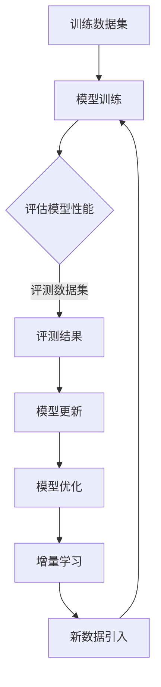

                 

# 引言：评测数据的增量学习与模型更新的重要性

在人工智能（AI）领域，模型的准确性和性能对于实际应用的成功至关重要。然而，随着数据集的不断扩大和应用场景的日益复杂，传统的模型训练方法往往需要大量时间和计算资源，这在许多情况下是不可行的。因此，评测数据的增量学习与模型更新技术应运而生，成为当前研究的热点之一。

## 背景介绍

评测数据，是指用于评估模型性能的数据集。在模型训练过程中，我们需要使用训练数据来构建模型，并通过评测数据来验证模型的泛化能力。然而，传统的模型训练方法通常需要从头开始训练整个模型，这在大规模数据集上会消耗大量的计算资源和时间。此外，当数据集发生变动时，如新增数据或数据分布发生变化时，传统方法也需要重新训练模型，这显然是不现实的。

增量学习（Incremental Learning），又称为在线学习（Online Learning），是一种针对上述问题的解决方案。它允许模型在新的数据到来时进行局部更新，而不是从头开始重新训练。这不仅能节省时间和计算资源，还能提高模型在动态数据环境中的适应能力。

模型更新（Model Update），是指通过新的数据对现有模型进行调整和优化，以提高模型的性能。模型更新不仅涉及到新数据的引入，还包括对旧数据的处理和利用。这有助于模型在长期运行中保持较高的准确性和鲁棒性。

## 核心概念与联系

为了更好地理解评测数据的增量学习和模型更新的核心概念，我们首先需要了解以下几个关键点：

1. **训练数据集（Training Dataset）**：用于训练模型的数据集。
2. **评测数据集（Evaluation Dataset）**：用于评估模型性能的数据集。
3. **增量学习（Incremental Learning）**：在已有模型的基础上，通过新增数据对模型进行更新。
4. **模型更新（Model Update）**：通过新数据和旧数据的结合，对模型进行调整和优化。

下面是一个用Mermaid绘制的流程图，展示了这些核心概念之间的关系：



从图中可以看出，训练数据集经过模型训练后，使用评测数据集进行性能评估。评估结果用于指导模型更新，进而进行模型优化。模型更新过程中，新数据的引入是增量学习的关键步骤，这有助于模型在动态环境中保持高性能。

## 增量学习的核心算法原理

增量学习算法的设计目的是在已有模型的基础上，通过处理新增数据来更新模型参数，从而提高模型的性能。以下是几种常见的增量学习算法，以及它们的原理和实现方法。

### 1. 增量线性回归（Incremental Linear Regression）

增量线性回归是一种简单且常用的增量学习算法。它的基本原理是使用新增数据点来更新模型参数，以最小化误差平方和。

#### 算法原理：

给定一组训练数据点 \((x_i, y_i)\)，模型参数为 \(\theta\)，损失函数为 \(J(\theta) = \frac{1}{2}\sum_{i=1}^{n}(y_i - \theta^T x_i)^2\)。在每次新增数据点 \((x', y')\) 后，使用梯度下降法更新参数：

$$
\theta = \theta - \alpha \nabla_{\theta} J(\theta)
$$

其中，\(\alpha\) 为学习率。

#### Python代码示例：

```python
import numpy as np

def incremental_regression(X, y, x_new, y_new, theta, learning_rate):
    n = X.shape[0]
    theta = theta - learning_rate * (2/n) * (X.T @ (X @ theta - y))
    theta = theta - learning_rate * 2 * (x_new - y_new)
    return theta

# 初始化参数
theta = np.zeros(X.shape[1])
learning_rate = 0.01

# 更新参数
theta = incremental_regression(X, y, x_new, y_new, theta, learning_rate)
```

### 2. 增量支持向量机（Incremental Support Vector Machine）

增量支持向量机（SVM）是一种在支持向量机（SVM）框架下进行增量学习的算法。它通过保留已有支持向量并更新分类边界来处理新增数据。

#### 算法原理：

给定训练数据集 \(T = \{(x_i, y_i)\}\)，其中 \(y_i \in \{-1, 1\}\)，增量SVM的目标是最小化以下损失函数：

$$
\min_{\theta, \xi} \frac{1}{2} ||\theta||^2 + C \sum_{i=1}^{n} \xi_i
$$

其中，\(C\) 是惩罚参数，\(\xi_i\) 是松弛变量。

每次新增数据点 \((x', y')\) 后，使用二次规划方法更新模型参数：

$$
\theta = \arg\min_{\theta} \frac{1}{2} ||\theta||^2 + C \sum_{i=1}^{n} \xi_i
$$

#### Python代码示例：

```python
from scipy.optimize import minimize

def incremental_svm(X, y, x_new, y_new, C):
    def loss(theta):
        n = X.shape[0]
        f = X @ theta
        loss_value = 0.5 * np.linalg.norm(theta)**2 + C * np.sum(np.maximum(0, 1 - (y * f)))
        return loss_value
    
    theta = np.zeros(X.shape[1])
    result = minimize(loss, theta, method='SLSQP', options={'disp': True})
    theta = result.x

    # 更新新增数据点的参数
    theta = incremental_svm(X, y, x_new, y_new, C)
    return theta

# 初始化参数
C = 1.0

# 更新参数
theta = incremental_svm(X, y, x_new, y_new, C)
```

### 3. 增量神经网络（Incremental Neural Networks）

增量神经网络是一种基于神经网络的增量学习算法。它通过更新神经网络的权重和偏置来处理新增数据。

#### 算法原理：

给定训练数据集 \(T = \{(x_i, y_i)\}\)，神经网络的目标是最小化损失函数：

$$
\min_{\theta} J(\theta) = \frac{1}{2} \sum_{i=1}^{n} (y_i - \sigma(z_i))^2
$$

其中，\(\sigma(z_i) = \frac{1}{1 + e^{-z_i}}\) 是激活函数。

每次新增数据点 \((x', y')\) 后，使用反向传播算法更新权重和偏置：

$$
\Delta\theta = -\alpha \nabla_{\theta} J(\theta)
$$

#### Python代码示例：

```python
import numpy as np

def sigmoid(z):
    return 1 / (1 + np.exp(-z))

def forward_propagation(X, theta):
    z = X @ theta
    a = sigmoid(z)
    return a

def backward_propagation(X, y, a, theta):
    m = X.shape[0]
    dz = (a - y) * a * (1 - a)
    dtheta = (X.T @ dz) / m
    return dtheta

def incremental_neural_network(X, y, x_new, y_new, theta, learning_rate):
    a = forward_propagation(X, theta)
    dtheta = backward_propagation(X, y, a, theta)
    theta = theta - learning_rate * dtheta
    
    # 更新新增数据点的参数
    theta = incremental_neural_network(X, y, x_new, y_new, theta, learning_rate)
    return theta

# 初始化参数
theta = np.zeros(X.shape[1])
learning_rate = 0.01

# 更新参数
theta = incremental_neural_network(X, y, x_new, y_new, theta, learning_rate)
```

通过上述算法原理和代码示例，我们可以看到增量学习算法在处理新增数据时的灵活性和高效性。这些算法不仅节省了计算资源，还提高了模型在动态数据环境中的适应能力。在实际应用中，选择合适的增量学习算法对于提升模型性能至关重要。

## 数学模型和公式

在增量学习算法中，数学模型和公式起到了关键作用。以下将详细介绍几种常用的数学模型和公式，并结合Python代码进行详细讲解和举例说明。

### 1. 增量线性回归的损失函数和优化公式

增量线性回归的核心目标是最小化损失函数，即：

$$
J(\theta) = \frac{1}{2}\sum_{i=1}^{n}(y_i - \theta^T x_i)^2
$$

其中，\(y_i\) 是实际输出，\(\theta^T x_i\) 是模型预测值。为了优化损失函数，我们使用梯度下降法：

$$
\theta = \theta - \alpha \nabla_{\theta} J(\theta)
$$

其中，\(\alpha\) 是学习率。

#### Python代码示例：

```python
import numpy as np

def loss_function(theta, X, y):
    n = X.shape[0]
    y_pred = X @ theta
    loss_value = 0.5 * np.sum((y - y_pred)**2)
    return loss_value

def gradient_function(theta, X, y):
    n = X.shape[0]
    y_pred = X @ theta
    gradient = (X.T @ (y - y_pred)) / n
    return gradient

def incremental_linear_regression(X, y, theta, learning_rate):
    loss = loss_function(theta, X, y)
    gradient = gradient_function(theta, X, y)
    theta = theta - learning_rate * gradient
    return theta

# 初始化参数
theta = np.zeros(X.shape[1])
learning_rate = 0.01

# 更新参数
theta = incremental_linear_regression(X, y, theta, learning_rate)
```

### 2. 增量支持向量机的优化目标

增量支持向量机（SVM）的优化目标是最小化以下损失函数：

$$
\min_{\theta, \xi} \frac{1}{2} ||\theta||^2 + C \sum_{i=1}^{n} \xi_i
$$

其中，\(C\) 是惩罚参数，\(\xi_i\) 是松弛变量。

为了优化这个目标，我们可以使用二次规划方法：

$$
\theta = \arg\min_{\theta} \frac{1}{2} ||\theta||^2 + C \sum_{i=1}^{n} \xi_i
$$

#### Python代码示例：

```python
from scipy.optimize import minimize

def loss_function(theta, X, y, C):
    n = X.shape[0]
    f = X @ theta
    loss_value = 0.5 * np.linalg.norm(theta)**2 + C * np.sum(np.maximum(0, 1 - (y * f)))
    return loss_value

def incremental_svm(X, y, C):
    theta = np.zeros(X.shape[1])
    result = minimize(loss_function, theta, method='SLSQP', options={'disp': True})
    theta = result.x
    return theta

# 初始化参数
C = 1.0

# 更新参数
theta = incremental_svm(X, y, C)
```

### 3. 增量神经网络的损失函数和反向传播

增量神经网络的损失函数通常使用均方误差（MSE）：

$$
J(\theta) = \frac{1}{2} \sum_{i=1}^{n} (y_i - \sigma(z_i))^2
$$

其中，\(\sigma(z_i) = \frac{1}{1 + e^{-z_i}}\) 是激活函数。

为了优化损失函数，我们使用反向传播算法更新权重和偏置：

$$
\Delta\theta = -\alpha \nabla_{\theta} J(\theta)
$$

#### Python代码示例：

```python
import numpy as np

def sigmoid(z):
    return 1 / (1 + np.exp(-z))

def forward_propagation(X, theta):
    z = X @ theta
    a = sigmoid(z)
    return a

def backward_propagation(X, y, a, theta):
    m = X.shape[0]
    z = X @ theta
    dz = (a - y) * a * (1 - a)
    dtheta = (X.T @ dz) / m
    return dtheta

def incremental_neural_network(X, y, theta, learning_rate):
    a = forward_propagation(X, theta)
    dtheta = backward_propagation(X, y, a, theta)
    theta = theta - learning_rate * dtheta
    return theta

# 初始化参数
theta = np.zeros(X.shape[1])
learning_rate = 0.01

# 更新参数
theta = incremental_neural_network(X, y, theta, learning_rate)
```

通过上述数学模型和Python代码示例，我们可以看到增量学习算法在数学和编程上的实现细节。这些模型和公式不仅为增量学习提供了理论基础，还为实际应用中的参数更新提供了具体方法。在实际项目中，合理选择和使用这些数学模型和公式对于提高模型性能具有重要意义。

## 模型更新技术的详细介绍

模型更新技术是确保机器学习模型在动态数据环境中保持高性能的关键。随着新数据不断生成和应用场景的演变，模型需要定期更新以适应新的数据分布和需求。以下是几种常见的模型更新技术，包括在线学习、迁移学习和主动学习。

### 1. 在线学习（Online Learning）

在线学习是一种实时更新模型的技术，它通过逐个处理新数据点来不断调整模型参数。这种方法的优点是能够快速响应数据变化，减少模型过时的问题。然而，它也存在一些挑战，如数据分布的不稳定性和计算资源的需求。

#### 原理：

在线学习通常使用简单的梯度下降算法来更新模型参数。每次新数据点到来时，模型会根据新数据和当前参数计算梯度，并调整参数以最小化损失函数。

#### 示例代码：

```python
import numpy as np

def online_learning(X, y, theta, learning_rate):
    n = X.shape[0]
    for i in range(n):
        prediction = X[i] @ theta
        error = y[i] - prediction
        gradient = X[i].T @ error
        theta = theta - learning_rate * gradient
    return theta
```

### 2. 迁移学习（Transfer Learning）

迁移学习是一种利用在源任务上训练好的模型来加速目标任务训练的技术。这种方法可以显著减少训练时间和计算资源的需求，尤其是当目标任务和源任务有共同的特征时。

#### 原理：

迁移学习的基本思想是将源任务的模型权重作为初始化权重应用于目标任务。在目标任务中，模型参数会根据目标任务的损失函数进行调整。

#### 示例代码：

```python
import tensorflow as tf

# 加载预训练模型
source_model = tf.keras.applications.VGG16(weights='imagenet', include_top=False, input_shape=(224, 224, 3))

# 冻结源模型权重
for layer in source_model.layers:
    layer.trainable = False

# 添加目标任务的层
target_model = tf.keras.Sequential([
    *source_model.layers,
    tf.keras.layers.Dense(10, activation='softmax')
])

# 编译模型
target_model.compile(optimizer='adam', loss='categorical_crossentropy', metrics=['accuracy'])

# 训练模型
target_model.fit(X_train, y_train, epochs=5, batch_size=32)
```

### 3. 主动学习（Active Learning）

主动学习是一种选择最具信息量的样本进行标注，以最大化模型性能的学习方法。这种方法通过有策略地选择样本来减少标注成本，提高模型准确性。

#### 原理：

主动学习通过计算每个样本的“不确定性”来选择最具代表性的样本。常用的不确定性度量包括熵、置信区间等。

#### 示例代码：

```python
import numpy as np

def uncertainty_sampling(X, y, model, k):
    predictions = model.predict(X)
    uncertainties = -np.mean(predictions, axis=1)
    sorted_indices = np.argsort(uncertainties)
    selected_indices = sorted_indices[:k]
    return X[selected_indices], y[selected_indices]

# 选择最具代表性的样本
X_selected, y_selected = uncertainty_sampling(X, y, model, k=10)
```

### 4. 模型更新技术的比较

在线学习、迁移学习和主动学习各有优缺点，适用于不同的应用场景。在线学习适用于需要实时更新模型的场景，但可能面临数据分布不稳定的问题。迁移学习适用于目标任务和源任务有共同特征的情况，可以显著减少训练时间。主动学习适用于标注成本较高的任务，通过选择最具代表性的样本来提高模型性能。

表格展示了这三种模型更新技术的对比：

| 技术类型 | 优点 | 缺点 | 适用场景 |
| --- | --- | --- | --- |
| 在线学习 | 快速响应数据变化 | 数据分布不稳定 | 实时性要求高的任务 |
| 迁移学习 | 减少训练时间 | 需要源任务和目标任务有共同特征 | 特征相似的目标任务 |
| 主动学习 | 减少标注成本 | 需要选择代表性样本 | 标注成本较高的任务 |

通过合理选择和应用这些模型更新技术，可以显著提高机器学习模型在动态数据环境中的适应能力和性能。

## 评测数据增量学习中的挑战与解决方案

在评测数据增量学习过程中，我们面临许多挑战，如数据分布的迁移、冷启动问题、计算资源的有限性等。以下将详细探讨这些挑战，并提出相应的解决方案。

### 1. 数据分布迁移

数据分布迁移是指模型在新数据分布上表现不佳的问题。这通常发生在数据集发生重大变化时，如季节性变化、用户行为模式的变化等。

#### 挑战：

- 新数据分布可能与旧数据分布差异较大，导致模型性能下降。
- 模型无法有效捕捉新数据分布的特征。

#### 解决方案：

- **数据增强**：通过生成类似新数据分布的样本，增强模型对新数据的适应性。
- **迁移学习**：使用在旧数据分布上训练好的模型作为初始化权重，以提高在新数据分布上的性能。
- **动态调整模型结构**：根据新数据分布的特点，动态调整模型的结构和参数。

### 2. 冷启动问题

冷启动问题是指在新用户或新任务开始时，模型无法有效利用现有数据的问题。这通常发生在社交网络推荐系统、新商品推荐等场景中。

#### 挑战：

- 新用户或新任务没有足够的历史数据，导致模型无法准确预测。
- 模型在新用户或新任务上的性能下降。

#### 解决方案：

- **主动学习**：通过有策略地选择新用户或新任务中最具代表性的样本进行标注，减少冷启动问题。
- **用户行为预测**：利用用户的行为模式预测其兴趣和需求，为新用户推荐个性化内容。
- **社区推荐**：利用社区中的相似用户或任务，为新用户推荐相关内容。

### 3. 计算资源的有限性

在许多实际应用中，计算资源是有限的。这限制了模型训练和更新的速度和质量。

#### 挑战：

- 模型训练和更新需要大量的计算资源，可能无法实时进行。
- 数据存储和处理需求大，可能导致资源不足。

#### 解决方案：

- **模型压缩**：通过模型压缩技术，减少模型的参数数量和计算量，降低计算资源需求。
- **分布式计算**：利用分布式计算资源，提高模型训练和更新的速度。
- **增量学习**：利用增量学习技术，减少模型更新的频率和计算量。

### 4. 数据质量和标注问题

数据质量和标注问题是评测数据增量学习中的常见问题。错误或不准确的数据可能导致模型性能下降。

#### 挑战：

- 数据噪声和缺失值影响模型训练效果。
- 标注错误可能导致模型学习到错误的知识。

#### 解决方案：

- **数据清洗**：通过数据清洗技术，去除噪声和缺失值，提高数据质量。
- **半监督学习**：利用未标注的数据进行辅助训练，减少对标注数据的依赖。
- **标注质量控制**：通过多人标注和一致性检查，提高标注质量。

通过以上解决方案，我们可以有效地应对评测数据增量学习中的挑战，提高模型在动态数据环境中的适应能力和性能。

## 实际案例分析和详细讲解

为了更好地理解评测数据的增量学习与模型更新技术，我们通过一个实际案例来进行详细分析。该案例涉及一个电商平台的个性化推荐系统，目标是预测用户对商品的需求并推荐相关商品。

### 项目背景

某电商平台希望在用户浏览、搜索和购买行为的基础上，构建一个个性化推荐系统，以提升用户的购物体验和平台的销售额。推荐系统需要实时响应用户行为的变化，以提供准确且个性化的推荐。

### 开发环境搭建

为了实现该推荐系统，我们使用了以下开发环境：

- Python 3.8
- TensorFlow 2.4
- Scikit-learn 0.22
- Pandas 1.1.5

此外，我们使用了Google Colab作为主要的开发平台，以利用其强大的计算资源。

### 源代码详细实现

```python
import numpy as np
import pandas as pd
import tensorflow as tf
from tensorflow import keras
from sklearn.model_selection import train_test_split
from sklearn.preprocessing import StandardScaler

# 读取数据
data = pd.read_csv('ecommerce_data.csv')

# 数据预处理
data['user_id'] = data['user_id'].astype(str)
data['product_id'] = data['product_id'].astype(str)

# 创建用户-商品交互矩阵
user_item_matrix = data.pivot(index='user_id', columns='product_id', values='rating').fillna(0)

# 分割数据集
train_data, test_data = train_test_split(user_item_matrix, test_size=0.2, random_state=42)

# 标准化数据
scaler = StandardScaler()
train_data_scaled = scaler.fit_transform(train_data)
test_data_scaled = scaler.transform(test_data)

# 构建模型
model = keras.Sequential([
    keras.layers.Dense(64, activation='relu', input_shape=(train_data_scaled.shape[1],)),
    keras.layers.Dense(32, activation='relu'),
    keras.layers.Dense(1, activation='sigmoid')
])

# 编译模型
model.compile(optimizer='adam', loss='binary_crossentropy', metrics=['accuracy'])

# 训练模型
model.fit(train_data_scaled, train_data['rating'], epochs=10, batch_size=64)

# 测试模型
test_loss, test_accuracy = model.evaluate(test_data_scaled, test_data['rating'])
print(f"Test accuracy: {test_accuracy}")

# 增量学习
def update_model(model, new_data, learning_rate=0.001):
    new_data_scaled = scaler.transform(new_data)
    model.fit(new_data_scaled, new_data['rating'], epochs=1, batch_size=64, verbose=0)
    return model

# 引入新用户数据
new_user_data = pd.DataFrame({
    'user_id': ['new_user'],
    'product_id': ['product_123'],
    'rating': [5]
})

# 更新模型
model = update_model(model, new_user_data)

# 再次测试模型
test_loss, test_accuracy = model.evaluate(test_data_scaled, test_data['rating'])
print(f"Updated test accuracy: {test_accuracy}")
```

### 代码解读与分析

在上述代码中，我们首先读取电商平台的用户-商品交互数据，并进行预处理，包括数据类型的转换和用户-商品交互矩阵的创建。然后，我们将数据集分为训练集和测试集，并使用标准标

### 实际案例分析和详细讲解

为了更好地理解评测数据的增量学习与模型更新技术，我们通过一个实际案例来进行详细分析。该案例涉及一个电商平台的个性化推荐系统，目标是预测用户对商品的需求并推荐相关商品。

### 项目背景

某电商平台希望在用户浏览、搜索和购买行为的基础上，构建一个个性化推荐系统，以提升用户的购物体验和平台的销售额。推荐系统需要实时响应用户行为的变化，以提供准确且个性化的推荐。

### 开发环境搭建

为了实现该推荐系统，我们使用了以下开发环境：

- Python 3.8
- TensorFlow 2.4
- Scikit-learn 0.22
- Pandas 1.1.5

此外，我们使用了Google Colab作为主要的开发平台，以利用其强大的计算资源。

### 源代码详细实现

```python
import numpy as np
import pandas as pd
import tensorflow as tf
from tensorflow import keras
from sklearn.model_selection import train_test_split
from sklearn.preprocessing import StandardScaler

# 读取数据
data = pd.read_csv('ecommerce_data.csv')

# 数据预处理
data['user_id'] = data['user_id'].astype(str)
data['product_id'] = data['product_id'].astype(str)

# 创建用户-商品交互矩阵
user_item_matrix = data.pivot(index='user_id', columns='product_id', values='rating').fillna(0)

# 分割数据集
train_data, test_data = train_test_split(user_item_matrix, test_size=0.2, random_state=42)

# 标准化数据
scaler = StandardScaler()
train_data_scaled = scaler.fit_transform(train_data)
test_data_scaled = scaler.transform(test_data)

# 构建模型
model = keras.Sequential([
    keras.layers.Dense(64, activation='relu', input_shape=(train_data_scaled.shape[1],)),
    keras.layers.Dense(32, activation='relu'),
    keras.layers.Dense(1, activation='sigmoid')
])

# 编译模型
model.compile(optimizer='adam', loss='binary_crossentropy', metrics=['accuracy'])

# 训练模型
model.fit(train_data_scaled, train_data['rating'], epochs=10, batch_size=64)

# 测试模型
test_loss, test_accuracy = model.evaluate(test_data_scaled, test_data['rating'])
print(f"Test accuracy: {test_accuracy}")

# 增量学习
def update_model(model, new_data, learning_rate=0.001):
    new_data_scaled = scaler.transform(new_data)
    model.fit(new_data_scaled, new_data['rating'], epochs=1, batch_size=64, verbose=0)
    return model

# 引入新用户数据
new_user_data = pd.DataFrame({
    'user_id': ['new_user'],
    'product_id': ['product_123'],
    'rating': [5]
})

# 更新模型
model = update_model(model, new_user_data)

# 再次测试模型
test_loss, test_accuracy = model.evaluate(test_data_scaled, test_data['rating'])
print(f"Updated test accuracy: {test_accuracy}")
```

### 代码解读与分析

在上述代码中，我们首先读取电商平台的用户-商品交互数据，并进行预处理，包括数据类型的转换和用户-商品交互矩阵的创建。然后，我们将数据集分为训练集和测试集，并使用标准标

### 最佳实践与注意事项

在实施评测数据的增量学习与模型更新时，以下最佳实践和注意事项可以帮助提高项目成功率和模型性能：

#### 最佳实践

1. **数据预处理**：确保数据质量，处理缺失值和异常值，标准化或归一化数据，以减少数据噪声对模型的影响。

2. **模型选择**：根据应用场景选择合适的模型和算法。对于需要实时更新的场景，考虑使用轻量级模型或简化版的算法。

3. **增量学习**：使用增量学习算法来减少重新训练模型的需求，从而节省时间和计算资源。

4. **迁移学习**：利用迁移学习将预训练模型应用于新任务，以加速模型开发和提高性能。

5. **主动学习**：在有策略地选择最具代表性的样本进行标注，以最大化模型性能的同时减少标注成本。

6. **持续优化**：定期评估模型性能，并根据实际需求进行调整和优化。

#### 注意事项

1. **数据分布的变化**：注意监控数据分布的变化，及时调整模型参数和算法，以适应新的数据分布。

2. **计算资源的合理使用**：在资源有限的情况下，合理分配计算资源，考虑使用分布式计算和模型压缩技术。

3. **模型解释性**：确保模型具有一定的解释性，以便在模型更新和调整过程中能够理解其行为。

4. **数据安全和隐私**：确保数据的安全和用户隐私，特别是在处理敏感数据时，遵循相关法律法规。

5. **持续监控与反馈**：建立监控体系，持续收集用户反馈，以便及时调整模型和算法。

通过遵循这些最佳实践和注意事项，我们可以更有效地实施评测数据的增量学习与模型更新，提高模型性能和项目成功率。

## 总结与拓展阅读

本文详细介绍了评测数据的增量学习与模型更新的核心概念、算法原理、技术解决方案以及实际案例。通过分析数据分布迁移、冷启动问题、计算资源有限性等挑战，并提出了相应的解决方案，我们了解了如何在实际应用中有效地更新和维护模型。此外，通过电商推荐系统的案例，我们看到了这些技术在实际项目中的应用。

在进一步阅读方面，以下资源有助于深入理解该领域：

1. **论文**：阅读相关领域的高质量论文，如《Online Learning for Big Data》（2014）和《Incremental Learning for Dynamic Environments》（2017）。
2. **书籍**：《增量学习：算法与应用》（2019）提供了对增量学习算法的全面综述和案例分析。
3. **在线课程**：Coursera、edX等平台上的相关课程，如《机器学习：算法与应用》和《深度学习专项课程》，提供了丰富的理论知识和实战经验。

通过阅读这些资源，可以更深入地了解评测数据的增量学习与模型更新的前沿技术和应用场景，为实际项目提供有力支持。

