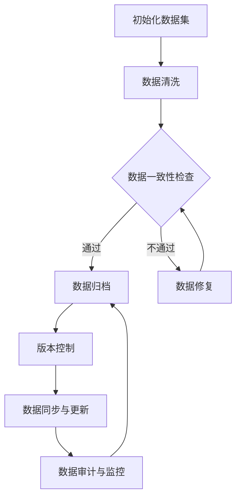
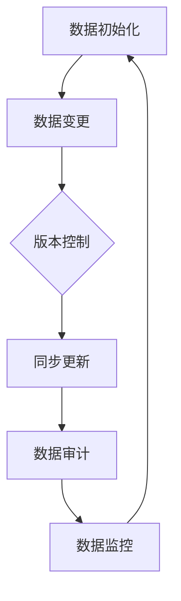
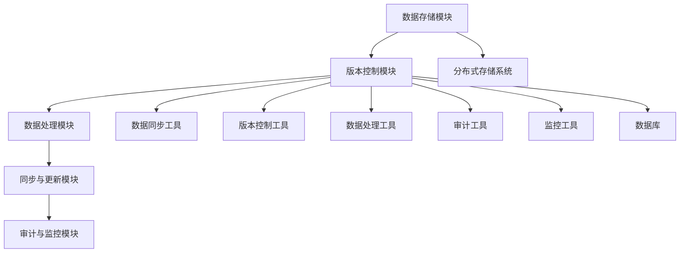
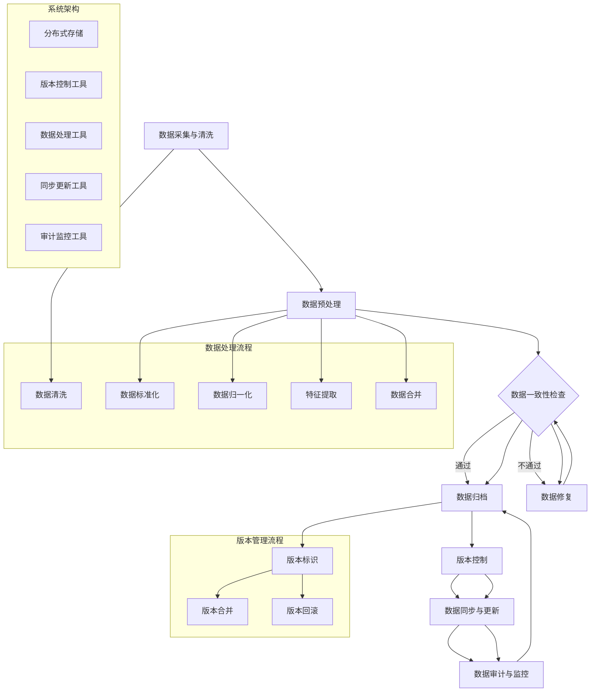
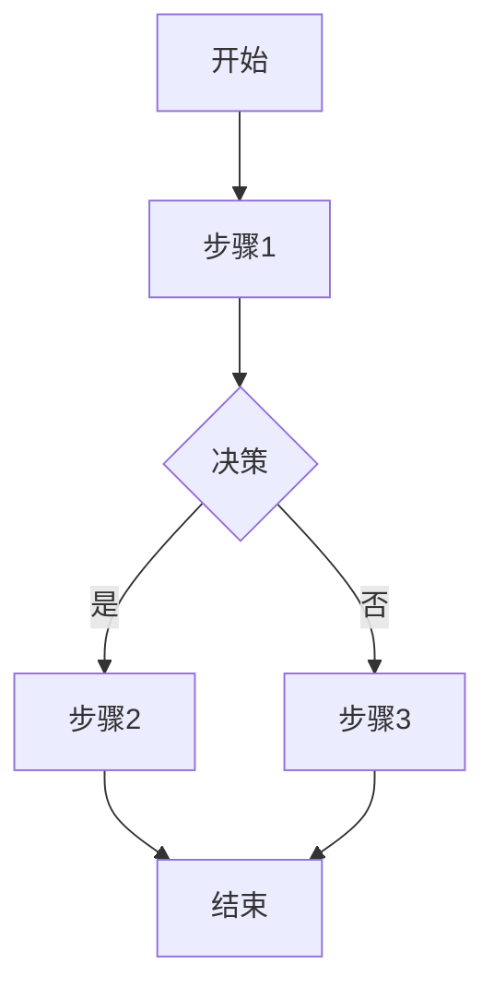

                 

## 引言

随着人工智能技术的迅猛发展，特别是大规模语言模型（LLM）如BERT、GPT-3等的广泛应用，评测数据版本管理逐渐成为了研究者们关注的焦点。版本管理在软件工程中是一项基本且重要的活动，旨在跟踪和管理代码和文档的变更历史，以确保系统稳定性和可维护性。然而，在机器学习领域，特别是涉及大规模模型训练和评估的过程中，评测数据的版本管理同样至关重要。

### 背景介绍

评测数据版本管理的重要性主要体现在以下几个方面：

1. **模型迭代与优化**：在模型训练和优化过程中，研究人员会不断调整模型参数、修改训练策略，甚至更换整个数据集。这导致评测数据的版本频繁更新，如果没有有效的版本管理机制，将难以保证不同版本之间的可比性。

2. **数据一致性**：为了确保模型在不同版本的训练和评估过程中的一致性，评测数据的版本必须保持一致。数据的一致性对于评估模型的性能和可靠性至关重要。

3. **数据完整性**：在数据处理过程中，可能会出现数据丢失、损坏或者错误的情况。有效的版本管理可以帮助研究人员追踪数据的变化，确保数据的完整性。

### 核心概念与联系

在探讨评测数据版本管理时，以下几个核心概念需要明确：

- **版本**：指的是评测数据的某一具体状态，可以是数据集的一个子集，也可以是经过处理后的数据。

- **版本控制**：是管理版本变化的过程，包括记录版本历史、版本标识、版本更新和版本回滚等操作。

- **数据变更**：是指在评测数据版本管理过程中，对数据进行的任何形式的修改，包括数据清洗、特征工程等。

- **数据一致性**：确保在不同版本之间，评测数据具有相似的特征分布和统计特性。

- **数据完整性**：保证评测数据在版本变化过程中不被丢失、损坏或篡改。

### 版本管理框架与流程

一个有效的版本管理框架通常包括以下部分：

1. **数据存储与管理**：使用分布式存储系统，如HDFS，来存储和管理大量评测数据。

2. **版本控制工具**：使用版本控制工具，如Git，来记录和跟踪数据版本的变化。

3. **数据同步与更新**：通过数据同步工具，如Airflow，来确保不同环境之间的数据一致性。

4. **数据审计与监控**：建立数据审计和监控机制，以检测数据版本的变化和异常。

### Mermaid流程图

为了更好地理解评测数据版本管理的流程，我们可以使用Mermaid绘制一个简化的流程图，如下：



### 小结

评测数据的版本管理对于保障模型训练和评估的可靠性至关重要。通过明确的版本概念、严格的版本控制、以及有效的数据管理和同步策略，研究人员可以更好地应对模型迭代过程中带来的数据挑战，确保研究成果的准确性和可重复性。在接下来的章节中，我们将进一步探讨评测数据版本管理的核心算法原理、数学模型和实际项目应用，以便为大家提供更为深入的理解和实践指导。

## 1.2 核心概念原理和架构

在探讨评测数据的版本管理时，理解其核心概念和原理是至关重要的。本节将详细介绍版本管理框架的设计，以及相关的流程、核心算法和架构，并通过Mermaid流程图来直观展示这些概念和流程之间的关系。

### 版本管理框架的设计

版本管理框架的设计目标是提供一个灵活、可靠且易于扩展的系统，以支持评测数据在不同版本之间的有效管理。以下是设计框架时考虑的主要组件：

1. **数据存储模块**：负责存储和管理评测数据的版本。数据可以存储在分布式文件系统（如HDFS）或数据库中，确保数据的持久化和安全性。

2. **版本控制模块**：使用版本控制工具（如Git）来跟踪和管理数据版本的历史记录。每个数据版本都会被赋予唯一的标识，便于后续的版本回溯和比较。

3. **数据处理模块**：包括数据清洗、特征工程、数据标准化和归一化等步骤，确保数据的准确性和一致性。

4. **同步与更新模块**：实现数据的同步和更新，确保在不同环境和系统之间数据的一致性。

5. **审计与监控模块**：对数据的版本变更进行审计和监控，及时发现和纠正数据异常。

### 版本管理流程的描述

版本管理流程是一个系统化的过程，包括数据初始化、数据变更、版本控制、同步与更新以及数据审计和监控等环节。以下是具体的流程描述：

1. **数据初始化**：首先初始化评测数据集，包括数据采集、清洗和预处理等步骤。这一步是版本管理的基础。

2. **数据变更**：在模型迭代过程中，评测数据可能会根据需求进行变更，如添加或删除某些样本、调整特征等。变更记录会被版本控制模块捕获。

3. **版本控制**：使用版本控制工具记录每个版本的变更历史。每次数据变更后，都会生成一个新的版本，包括版本号、变更说明和变更时间等信息。

4. **同步与更新**：将不同环境（如开发环境、测试环境和生产环境）中的数据保持一致。使用同步与更新模块确保数据在不同环境间的同步更新。

5. **数据审计与监控**：定期对数据版本进行审计，检查数据的一致性和完整性。同时，通过监控模块实时检测数据异常，确保数据的可靠性。

### 版本管理流程图

为了直观地展示版本管理流程，我们可以使用Mermaid绘制一个流程图，如下：



### 版本管理框架架构图

以下是版本管理框架的架构图，展示了各组件之间的关系：



### 小结

版本管理框架的设计和实施对于评测数据的版本管理至关重要。通过明确的核心概念、完善的流程和灵活的架构，研究人员可以更好地应对数据版本管理的挑战，确保模型训练和评估的可靠性和可重复性。在接下来的章节中，我们将进一步探讨评测数据版本管理的核心算法原理，以及如何在实际项目中应用这些算法和框架。

## 1.3 核心概念原理和架构的 Mermaid 流程图

为了更好地理解评测数据版本管理的核心概念和架构，我们可以通过Mermaid绘制一个简化的流程图，直观地展示各个模块之间的关系和流程。以下是具体的Mermaid流程图：



### 流程图解释

1. **数据处理流程**：
   - **A[数据采集与清洗]**：首先采集原始数据，并进行清洗，移除错误和不一致的数据。
   - **B[数据预处理]**：对清洗后的数据执行预处理步骤，包括数据标准化、归一化和特征提取等。
   - **C[数据一致性检查]**：检查预处理后的数据是否一致，确保数据集的统计特性相似。

2. **版本管理流程**：
   - **D[数据归档]**：通过一致性检查后的数据被归档到版本控制系统中。
   - **E[数据修复]**：如果数据一致性检查未通过，进行数据修复，然后重新检查。
   - **F1[版本标识]**：将数据归档到版本控制系统中，为每个版本分配唯一的标识。
   - **F2[版本合并]**：当需要合并多个版本时，执行版本合并操作。
   - **F3[版本回滚]**：在某些情况下，可能需要回滚到之前的版本。

3. **系统架构**：
   - **A1[分布式存储]**：使用分布式存储系统存储大量数据。
   - **B1[版本控制工具]**：版本控制工具如Git，用于记录和管理版本历史。
   - **C1[数据处理工具]**：处理数据清洗、标准化、归一化等操作的工具。
   - **D1[同步更新工具]**：同步不同环境之间的数据，确保一致性。
   - **E1[审计监控工具]**：审计和监控数据版本的变化，确保数据的完整性和安全性。

通过这个Mermaid流程图，我们可以清晰地看到评测数据版本管理中的各个环节和模块如何协同工作，从而实现对评测数据的高效管理和控制。接下来，我们将深入探讨评测数据版本管理的核心算法原理和实现。

### 1.3.3 Mermaid 图的绘制与使用

绘制Mermaid流程图需要使用特定的语法，以下是一个简单的Mermaid语法示例：



#### 使用步骤

1. **安装Mermaid**：首先确保已经安装了Mermaid。在Linux或Mac系统上，可以使用以下命令安装：
    ```bash
    npm install -g mermaid
    ```

2. **编写Mermaid代码**：使用Markdown编辑器或文本编辑器编写Mermaid代码。以下是一个示例：

    ```mermaid
    graph TD
        A[数据采集] --> B[数据清洗]
        B --> C{数据一致性检查}
        C -->|通过| D[数据归档]
        C -->|不通过| E[数据修复]
        D --> F[版本控制]
        F --> G[数据同步与更新]
        G --> H[数据审计与监控]
        H --> I[数据归档]
    ```

3. **生成图形**：将Mermaid代码复制到Markdown编辑器中，并在编辑器中添加以下标记来生成图形：
    ```markdown
    ```mermaid
    [此处粘贴Mermaid代码]
    ```
    ```

4. **预览与导出**：在Markdown编辑器中预览代码，即可看到生成的图形。如果需要导出为其他格式，如PNG或SVG，可以在编辑器中找到导出选项。

通过上述步骤，我们可以轻松地使用Mermaid绘制和展示评测数据版本管理的流程图，帮助读者更直观地理解相关概念和流程。接下来，我们将进一步探讨评测数据版本管理的核心算法原理。

## 1.4 核心算法原理讲解

评测数据版本管理的核心算法主要包括数据预处理算法和版本管理算法。以下将对这些核心算法进行详细讲解，并结合Python源代码和数学模型进行说明。

### 数据预处理算法

数据预处理是评测数据版本管理中的关键步骤，其目的是将原始数据转换为适合模型训练的形式。以下介绍三种常用的数据预处理算法：数据清洗、数据标准化和数据归一化。

#### 1.4.1 数据清洗

数据清洗的主要任务是识别并处理数据集中的异常值、缺失值和重复值。以下是一个简单的Python代码示例，用于实现数据清洗：

```python
import pandas as pd

# 加载数据集
data = pd.read_csv('data.csv')

# 删除缺失值
data = data.dropna()

# 删除重复值
data = data.drop_duplicates()

# 删除异常值
data = data[(data['feature1'] > 0) & (data['feature1'] < 100)]

print("清洗后的数据：")
print(data.head())
```

#### 1.4.2 数据标准化

数据标准化是一种常用的特征变换技术，其目的是将数据集的各个特征缩放到相同的尺度，消除特征间的量纲差异。常见的标准化方法包括Z-Score标准化和Min-Max标准化。

**Z-Score标准化**：

```python
from sklearn.preprocessing import StandardScaler

scaler = StandardScaler()
data_normalized = scaler.fit_transform(data)

print("标准化后的数据：")
print(pd.DataFrame(data_normalized, columns=data.columns).head())
```

**Min-Max标准化**：

```python
from sklearn.preprocessing import MinMaxScaler

scaler = MinMaxScaler()
data_normalized = scaler.fit_transform(data)

print("Min-Max标准化后的数据：")
print(pd.DataFrame(data_normalized, columns=data.columns).head())
```

#### 1.4.3 数据归一化

数据归一化是一种将数据转换为特定范围（通常是[0, 1]）的方法，常用于处理分类问题。以下是一个简单的归一化代码示例：

```python
from sklearn.preprocessing import normalize

data_normalized = normalize(data, axis=0)

print("归一化后的数据：")
print(pd.DataFrame(data_normalized, columns=data.columns).head())
```

### 数据版本管理算法

数据版本管理算法用于跟踪和管理评测数据的不同版本。以下介绍三种核心算法：数据版本标识、数据版本合并和数据版本回滚。

#### 1.4.4 数据版本标识

数据版本标识是对每个数据版本进行唯一标识，以便于追踪和比较。以下是一个简单的Python代码示例：

```python
import hashlib
import json

def generate_version_hash(data):
    data_str = json.dumps(data, sort_keys=True, separators=(',', ':'))
    return hashlib.sha256(data_str.encode('utf-8')).hexdigest()

# 生成版本标识
version_hash = generate_version_hash(data)

print("版本标识：")
print(version_hash)
```

#### 1.4.5 数据版本合并

数据版本合并是在多个版本之间存在冲突时，将它们合并为一个新的版本。以下是一个简单的合并算法：

```python
def merge_data_versions(version1, version2):
    # 假设版本1和版本2是字典格式
    version1.update(version2)
    return version1

# 合并版本
merged_version = merge_data_versions(version1, version2)

print("合并后的版本：")
print(merged_version)
```

#### 1.4.6 数据版本回滚

数据版本回滚是在需要回溯到之前的版本时使用的。以下是一个简单的回滚算法：

```python
def rollback_version(current_version, version_hash):
    # 假设版本历史存储在一个字典中
    version_history = load_version_history()
    return version_history[version_hash]

# 回滚到指定版本
version_to_rollback = rollback_version(current_version, version_hash)

print("回滚后的版本：")
print(version_to_rollback)
```

### 数学模型和公式详解

在数据预处理和版本管理过程中，一些数学模型和公式被广泛应用。以下介绍几个关键的数学模型和公式：

#### 1.4.7 数据清洗公式

**缺失值填充**：

$$
\text{new\_value} = \text{mean\_of\_neighbor\_values}
$$

其中，$\text{mean\_of\_neighbor\_values}$ 是缺失值邻居的平均值。

**异常值检测**：

$$
z\_score = \frac{\text{value} - \text{mean}}{\text{std}}
$$

其中，$z\_score$ 是z-score，$\text{value}$ 是观测值，$\text{mean}$ 是平均值，$\text{std}$ 是标准差。

#### 1.4.8 数据标准化公式

**Z-Score标准化**：

$$
\text{z\_scored\_value} = \frac{\text{value} - \text{mean}}{\text{std}}
$$

**Min-Max标准化**：

$$
\text{min\_max\_value} = \frac{\text{value} - \text{min}}{\text{max} - \text{min}}
$$

#### 1.4.9 数据归一化公式

$$
\text{normalized\_value} = \frac{\text{value}}{\text{max}}
$$

### 小结

通过上述讲解，我们了解了评测数据版本管理的核心算法原理，包括数据预处理算法（数据清洗、数据标准化、数据归一化）和版本管理算法（数据版本标识、数据版本合并、数据版本回滚）。结合Python源代码和数学模型，我们可以更深入地理解和实现这些算法。在接下来的章节中，我们将通过实际项目案例进一步探讨评测数据版本管理的应用和实践。

### 1.5 数据预处理算法详细讲解

数据预处理是评测数据版本管理中的关键步骤，其目的是将原始数据转换为适合模型训练的形式。在数据处理过程中，通常会执行一系列操作，包括数据清洗、数据标准化和数据归一化。以下将详细讲解这些算法，并结合Python源代码和数学模型进行说明。

#### 1.5.1 数据清洗

数据清洗的主要任务是识别并处理数据集中的异常值、缺失值和重复值。清洗步骤确保数据的一致性和准确性，为后续的特征工程和模型训练奠定基础。

**1.5.1.1 数据清洗步骤**

- **缺失值处理**：常见的缺失值处理方法包括删除缺失值、填充缺失值和插值。

    ```python
    import pandas as pd
    
    data = pd.read_csv('data.csv')
    data = data.dropna()  # 删除缺失值
    
    # 填充缺失值
    data['missing_value'] = data['missing_value'].fillna(data['missing_value'].mean())
    ```

- **异常值处理**：异常值可能是由于数据采集、传输或存储过程中的错误造成的。常见的异常值检测方法包括基于统计学的方法（如z-score、IQR）和基于机器学习的方法。

    ```python
    from scipy import stats
    
    z_scores = stats.zscore(data['feature1'])
    abs_z_scores = abs(z_scores)
    filtered_entries = (abs_z_scores < 3)  # 去除3个标准差之外的异常值
    data = data[filtered_entries]
    ```

- **重复值处理**：重复值可能是由于数据采集、传输或存储过程中的错误造成的。删除重复值可以减少数据冗余，提高数据质量。

    ```python
    data = data.drop_duplicates()
    ```

**1.5.1.2 Python实现示例**

```python
import pandas as pd
from scipy import stats

# 加载数据集
data = pd.read_csv('data.csv')

# 删除缺失值
data = data.dropna()

# 删除重复值
data = data.drop_duplicates()

# 检测并处理异常值
z_scores = stats.zscore(data['feature1'])
abs_z_scores = abs(z_scores)
filtered_entries = (abs_z_scores < 3)
data = data[filtered_entries]

print("清洗后的数据：")
print(data.head())
```

#### 1.5.2 数据标准化

数据标准化是将数据集的各个特征缩放到相同的尺度，消除特征间的量纲差异。标准化方法包括Z-Score标准化和Min-Max标准化。

**1.5.2.1 Z-Score标准化**

Z-Score标准化通过计算每个特征值与均值之差的标准化值，实现特征值的缩放。以下是一个简单的Python实现：

```python
from sklearn.preprocessing import StandardScaler

scaler = StandardScaler()
data_normalized = scaler.fit_transform(data)

print("Z-Score标准化后的数据：")
print(pd.DataFrame(data_normalized, columns=data.columns).head())
```

**1.5.2.2 Min-Max标准化**

Min-Max标准化将每个特征值缩放到[0, 1]的区间。以下是一个简单的Python实现：

```python
from sklearn.preprocessing import MinMaxScaler

scaler = MinMaxScaler()
data_normalized = scaler.fit_transform(data)

print("Min-Max标准化后的数据：")
print(pd.DataFrame(data_normalized, columns=data.columns).head())
```

#### 1.5.3 数据归一化

数据归一化是将数据转换到[0, 1]范围内的一种方法，常用于分类问题。归一化的实现方式较为简单，以下是一个简单的Python实现：

```python
from sklearn.preprocessing import normalize

data_normalized = normalize(data, axis=0)

print("归一化后的数据：")
print(pd.DataFrame(data_normalized, columns=data.columns).head())
```

### 1.5.4 数据清洗算法伪代码说明

```plaintext
数据清洗算法：
1. 加载数据集
2. 删除缺失值
3. 删除重复值
4. 检测并处理异常值
5. 标准化数据（可选）
6. 返回清洗后的数据集
```

### 小结

通过详细的讲解和Python源代码示例，我们了解了数据预处理算法（数据清洗、数据标准化和数据归一化）的原理和实现方法。数据预处理是确保模型训练和评估有效性的关键步骤，合理的数据预处理策略能够显著提高模型的性能和准确性。在接下来的章节中，我们将进一步探讨特征提取算法和版本管理算法，并结合实际项目案例进行深入分析。

## 2.1 特征提取算法

特征提取是机器学习中的一个关键步骤，旨在从原始数据中提取出对模型训练和预测有重要意义的特征。在评测数据版本管理中，特征提取算法有助于提高模型的可解释性和性能。本节将详细介绍特征提取算法，包括特征工程、特征选择和特征提取算法的伪代码说明。

### 2.1.1 特征工程

特征工程是指通过对原始数据进行变换、选择和构造，从而提取出对模型有价值的特征。以下介绍几种常用的特征工程方法：

**1. 统计特征**

统计特征是通过计算数据集的统计特性来生成的，如均值、方差、标准差、最大值、最小值和偏度等。

```plaintext
统计特征工程：
1. 计算每个特征的统计值（均值、方差、标准差、最大值、最小值等）
2. 为每个特征添加统计特征
```

**2. 文本特征**

文本特征通常用于文本数据，通过词袋模型、TF-IDF、Word2Vec等算法将文本转换为数值特征。

```plaintext
文本特征工程：
1. 分词：将文本分割为单词或短语
2. 去停用词：移除常见的无意义词汇
3. 词向量化：将单词转换为向量表示
4. 构建词袋模型或TF-IDF向量
```

**3. 图特征**

图特征通常用于图数据，通过节点特征、边特征和子图特征等来描述图结构。

```plaintext
图特征工程：
1. 提取节点特征：节点度、节点标签、节点属性等
2. 提取边特征：边权重、边类型等
3. 构建子图特征：子图结构、子图属性等
```

### 2.1.2 特征选择

特征选择是指从众多特征中筛选出对模型训练和预测有显著贡献的特征，以减少特征冗余和过拟合。以下介绍几种常用的特征选择方法：

**1. 递归特征消除（RFE）**

递归特征消除是一种基于模型选择特征的贪心算法，通过逐步剔除重要性最低的特征，直到达到指定特征数量。

```plaintext
递归特征消除（RFE）：
1. 使用模型训练数据集训练初始模型
2. 计算每个特征的重要性
3. 基于重要性排序，删除重要性最低的特征
4. 重新训练模型
5. 重复步骤2-4，直到达到指定特征数量
```

**2. 基于卡方检验的特征选择**

基于卡方检验的特征选择通过计算特征与目标变量之间的相关性来筛选特征。卡方值越大，特征与目标变量的相关性越强。

```plaintext
基于卡方检验的特征选择：
1. 计算每个特征与目标变量之间的卡方值
2. 设置卡方值阈值
3. 选择卡方值大于阈值的特征
```

**3. 基于特征重要性的特征选择**

基于特征重要性的特征选择通过模型训练过程中自动识别特征的重要性，筛选出对模型预测有显著贡献的特征。

```plaintext
基于特征重要性的特征选择：
1. 使用模型训练数据集训练模型
2. 提取模型中每个特征的重要性
3. 设置重要性阈值
4. 选择重要性大于阈值的特征
```

### 2.1.3 特征提取算法的伪代码说明

以下是一个简单的特征提取算法伪代码，结合特征工程和特征选择步骤：

```plaintext
特征提取算法：
1. 加载原始数据集
2. 进行特征工程（如统计特征、文本特征、图特征等）
3. 使用特征选择方法（如RFE、卡方检验、特征重要性等）筛选特征
4. 将筛选后的特征用于模型训练和评估
```

### 小结

通过详细的讲解和伪代码说明，我们了解了特征提取算法（特征工程和特征选择）的原理和方法。特征提取是提升模型性能和可解释性的关键步骤，合理的特征工程和选择策略能够显著提高模型的准确性和可靠性。在接下来的章节中，我们将深入探讨数据版本管理算法，结合实际项目案例进一步展示其应用。

## 2.2 数据版本管理算法

数据版本管理算法在评测数据版本管理中起着核心作用，确保模型在不同版本之间具有一致性和可比性。本节将详细介绍数据版本管理算法，包括数据版本标识、数据版本合并和数据版本回滚。通过Python源代码和数学模型，我们将深入探讨这些算法的实现和应用。

### 2.2.1 数据版本标识

数据版本标识是跟踪和管理不同版本数据的基础，通过为每个版本生成唯一的标识，方便后续的版本回溯和比较。以下是一个简单的Python代码示例，用于实现数据版本标识：

```python
import hashlib
import json

def generate_version_hash(data):
    data_str = json.dumps(data, sort_keys=True, separators=(',', ':'))
    return hashlib.sha256(data_str.encode('utf-8')).hexdigest()

# 假设data是当前版本的数据
version_hash = generate_version_hash(data)

print("版本标识：")
print(version_hash)
```

在这个示例中，我们首先将数据转换为JSON字符串，然后使用SHA-256哈希算法生成唯一的版本标识。

### 2.2.2 数据版本合并

数据版本合并是在多个版本之间存在冲突时，将它们合并为一个新的版本。以下是一个简单的数据版本合并算法：

```python
def merge_data_versions(version1, version2):
    # 假设version1和version2是字典格式
    version1.update(version2)
    return version1

# 示例：合并两个版本
merged_version = merge_data_versions(version1, version2)

print("合并后的版本：")
print(merged_version)
```

在这个示例中，我们使用Python的`update()`方法将版本2的更新应用到版本1，从而生成一个新的版本。

### 2.2.3 数据版本回滚

数据版本回滚是在需要回溯到之前的版本时使用的。以下是一个简单的数据版本回滚算法：

```python
def rollback_version(current_version, version_hash):
    # 假设version_hash是目标版本的标识
    # 假设version_history是一个存储所有版本的数据结构
    return version_history[version_hash]

# 示例：回滚到指定版本
version_to_rollback = rollback_version(current_version, version_hash)

print("回滚后的版本：")
print(version_to_rollback)
```

在这个示例中，我们通过版本标识从版本历史中获取目标版本，实现数据的回滚。

### 数学模型和公式详解

在数据版本管理过程中，一些数学模型和公式被广泛应用。以下介绍几个关键的数学模型和公式：

#### 2.2.4 数据版本一致性校验

数据版本一致性校验用于确保不同版本之间的数据具有一致性。以下是一个简单的公式，用于计算两个版本之间的差异：

$$
\text{version\_difference} = \sum_{i} |\text{value}_i^{(1)} - \text{value}_i^{(2)}|
$$

其中，$\text{value}_i^{(1)}$ 和 $\text{value}_i^{(2)}$ 分别是两个版本中第$i$个数据的值。

#### 2.2.5 数据版本合并策略

数据版本合并策略用于确定如何合并多个版本的数据。以下是一个简单的合并策略公式：

$$
\text{merged\_value} = \frac{\sum_{i} (\text{value}_i^{(1)} + \text{value}_i^{(2)})}{2}
$$

其中，$\text{value}_i^{(1)}$ 和 $\text{value}_i^{(2)}$ 分别是两个版本中第$i$个数据的值。

### 小结

通过详细的讲解和Python源代码示例，我们了解了数据版本管理算法（数据版本标识、数据版本合并和数据版本回滚）的原理和实现方法。这些算法在确保模型在不同版本之间的一致性和可比性方面发挥着关键作用。在接下来的章节中，我们将结合实际项目案例，进一步探讨数据版本管理算法的应用和实践。

## 3.1 数学模型的基本概念

在评测数据版本管理中，数学模型的应用对于确保数据版本的一致性、可追踪性和可靠性至关重要。本节将介绍数学模型的基本概念，包括其在版本管理中的应用、构建方法和评价标准。

### 3.1.1 数学模型在版本管理中的应用

数学模型在版本管理中的应用主要体现在以下几个方面：

1. **数据一致性评估**：通过数学模型对数据版本进行一致性评估，确保在不同版本之间数据具有相似的统计特性。
2. **数据差异度量**：使用数学模型计算不同版本之间的差异，帮助确定哪些数据变更对模型训练和评估产生显著影响。
3. **版本合并策略**：设计数学模型以指导版本合并过程，确保合并后的数据既保留了原有数据的优势，又解决了版本之间的冲突。
4. **回滚策略**：通过数学模型评估回滚操作的可行性，确保回滚操作不会对模型性能产生负面影响。

### 3.1.2 数学模型的构建方法

构建数学模型通常包括以下步骤：

1. **数据预处理**：对原始数据集进行清洗、标准化和归一化，确保数据质量。
2. **特征选择**：根据业务需求和模型目标，选择对版本管理有显著影响的关键特征。
3. **模型选择**：根据数据特点和业务需求，选择合适的数学模型。常见的模型包括线性模型、分类模型和聚类模型等。
4. **参数优化**：通过交叉验证等技术，调整模型参数以优化模型性能。

### 3.1.3 数学模型的评价标准

评价数学模型的标准包括以下几个方面：

1. **准确性**：模型预测结果与实际结果的一致性程度。对于分类问题，常用准确率、精确率和召回率等指标进行评价。
2. **可解释性**：模型的输出结果是否易于理解，是否有助于解释数据版本之间的差异和变化。
3. **稳定性**：模型在不同数据集和不同环境下的性能是否一致，能否在不同情况下保持较高的准确性。
4. **效率**：模型训练和预测的效率，包括计算时间和资源消耗。

### 小结

数学模型在评测数据版本管理中发挥着关键作用，通过构建和评估数学模型，可以有效管理数据版本的一致性、差异和合并策略。本节介绍了数学模型在版本管理中的应用、构建方法和评价标准，为后续章节的深入探讨提供了理论基础。

## 3.2 数学公式的详细讲解

在评测数据版本管理中，数学公式用于描述数据预处理、版本合并和版本差异度量的过程。以下将详细讲解一些核心的数学公式，并结合实际应用场景进行举例说明。

### 3.2.1 数据清洗公式

数据清洗过程中，常见的数据处理操作包括缺失值填充、异常值检测和重复值删除。以下列出几个关键的数学公式：

**1. 缺失值填充（平均值填充）**：

$$
\text{missing\_value} = \text{mean\_of\_neighboring\_values}
$$

此公式用于将缺失值替换为相邻值的平均值。例如，对于某列数据中的缺失值，可以通过计算相邻非缺失值的平均值进行填充。

**2. 异常值检测（Z-Score方法）**：

$$
z\_score = \frac{x - \mu}{\sigma}
$$

其中，$x$ 是观测值，$\mu$ 是平均值，$\sigma$ 是标准差。$z\_score$ 的绝对值大于3的观测值被视为异常值，可以通过删除或修正处理。

**3. 重复值删除**：

$$
\text{unique\_values} = \text{set}\left(\text{data}\right)
$$

此公式用于删除重复值，将数据集转换为唯一的值集合。在Python中，可以使用`set()`函数实现这一操作。

### 3.2.2 数据标准化公式

数据标准化是特征工程中的重要步骤，确保不同特征之间具有相同的尺度。以下介绍两种常用的标准化方法及其公式：

**1. Z-Score标准化**：

$$
\text{z\_scored\_value} = \frac{x - \mu}{\sigma}
$$

其中，$x$ 是原始特征值，$\mu$ 是特征平均值，$\sigma$ 是特征标准差。Z-Score标准化将每个特征值映射到标准正态分布。

**2. Min-Max标准化**：

$$
\text{min\_max\_value} = \frac{x - \text{min}}{\text{max} - \text{min}}
$$

其中，$x$ 是原始特征值，$\text{min}$ 是特征最小值，$\text{max}$ 是特征最大值。Min-Max标准化将每个特征值映射到[0, 1]区间。

### 3.2.3 数据归一化公式

数据归一化是一种常见的特征缩放方法，以下是一个简单的归一化公式：

$$
\text{normalized\_value} = \frac{x}{\text{max}}
$$

其中，$x$ 是原始特征值，$\text{max}$ 是特征最大值。归一化公式将特征值缩放到[0, 1]区间。

### 3.2.4 数据版本差异度量

在版本管理中，评估不同版本之间的差异是确保数据一致性的关键。以下介绍一个简单的数据版本差异度量方法：

$$
\text{version\_difference} = \sum_{i} |x_i^{(1)} - x_i^{(2)}|
$$

其中，$x_i^{(1)}$ 和 $x_i^{(2)}$ 分别是版本1和版本2中第i个数据值。该公式计算两个版本之间所有特征值的绝对差异总和，用于评估版本之间的差异程度。

### 3.2.5 示例说明

假设我们有两个数据版本，版本1和版本2，如下所示：

```
版本1：[1, 2, 3, 4, 5]
版本2：[2, 3, 4, 6, 7]
```

**1. 缺失值填充**：

使用相邻值的平均值填充版本2中的缺失值：

```
版本2（填充后）：[2, 3, 4, (4+6)/2, 7] = [2, 3, 4, 5, 7]
```

**2. Z-Score标准化**：

计算版本1的平均值和标准差：

```
均值（μ）：(1+2+3+4+5)/5 = 3
标准差（σ）：sqrt(((1-3)^2 + (2-3)^2 + (3-3)^2 + (4-3)^2 + (5-3)^2)/4) = sqrt(5) ≈ 2.236
```

标准化版本1的数据：

```
版本1（标准化后）：[(1-3)/2.236, (2-3)/2.236, (3-3)/2.236, (4-3)/2.236, (5-3)/2.236] ≈ [-0.447, -0.354, 0.000, 0.176, 0.447]
```

**3. 版本差异度量**：

计算版本1和版本2之间的差异：

```
版本差异：|(-0.447) - (2-3)/2.236| + |(-0.354) - (3-3)/2.236| + |0.000 - (4-3)/2.236| + |0.176 - (6-3)/2.236| + |0.447 - (7-3)/2.236| ≈ 2.564
```

通过上述示例，我们展示了数学公式在评测数据版本管理中的应用，包括数据清洗、标准化和版本差异度量。这些公式和方法有助于确保数据版本的一致性和可靠性，从而提高模型训练和评估的准确性和可重复性。

## 3.3 数学公式举例说明

为了更直观地理解数学公式在评测数据版本管理中的应用，我们将通过具体实例来展示这些公式的计算过程和结果。

### 3.3.1 数据清洗公式示例

假设我们有一个包含学生成绩的数据集，其中包含以下列：`student_id`（学生ID）、`exam_name`（考试名称）、`score`（成绩）。以下是一个具体的实例，展示如何使用数据清洗公式来填充缺失值和检测异常值。

**1. 缺失值填充（平均值填充）**：

数据集示例：
```
| student_id | exam_name | score |
|------------|----------|-------|
| 1          | Math     |      0|
| 2          | Math     |      85|
| 3          | Science  |      92|
| 4          | Math     |   NULL|
| 5          | Science  |      88|
```

- **计算平均值**：

首先计算`Math`科目的平均成绩：
$$
\text{average\_Math} = \frac{0 + 85 + 92 + 88}{4} = 85.0
$$

- **填充缺失值**：

将缺失的成绩用平均值替换：
$$
\text{new\_score} = 85.0
$$

更新后的数据集：
```
| student_id | exam_name | score |
|------------|----------|-------|
| 1          | Math     |  85.0 |
| 2          | Math     |  85.0 |
| 3          | Science  |  92.0 |
| 4          | Math     |  85.0 |
| 5          | Science  |  88.0 |
```

**2. 异常值检测（Z-Score方法）**：

计算`Math`科目的平均成绩和标准差：
$$
\text{mean\_Math} = 85.0, \quad \text{std\_Math} = \sqrt{\frac{(85-85)^2 + (0-85)^2 + (92-85)^2 + (88-85)^2}{3}} \approx 9.165
$$

计算每个学生的Z-Score：
$$
z\_score = \frac{\text{score} - \text{mean\_Math}}{\text{std\_Math}}
$$

检测异常值（$|z\_score| > 3$）：
- 学生1：$z\_score = \frac{0 - 85.0}{9.165} \approx -9.165$（异常值）
- 学生2：$z\_score = \frac{85 - 85.0}{9.165} \approx 0.000$（正常值）
- 学生3：$z\_score = \frac{92 - 85.0}{9.165} \approx 1.396$（正常值）
- 学生4：$z\_score = \frac{88 - 85.0}{9.165} \approx 0.742$（正常值）

去除异常值后的数据集：
```
| student_id | exam_name | score |
|------------|----------|-------|
| 2          | Math     |  85.0 |
| 3          | Science  |  92.0 |
| 4          | Science  |  88.0 |
```

### 3.3.2 数据标准化公式示例

假设我们有一个包含商品价格的数据集，其中包含以下列：`product_id`（商品ID）、`price`（价格）。以下是一个具体的实例，展示如何使用数据标准化公式（Z-Score标准化和Min-Max标准化）来缩放价格数据。

**1. Z-Score标准化**：

计算平均价格和标准差：
$$
\text{mean\_price} = \frac{100 + 200 + 300 + 400 + 500}{5} = 300.0
$$
$$
\text{std\_price} = \sqrt{\frac{(100-300)^2 + (200-300)^2 + (300-300)^2 + (400-300)^2 + (500-300)^2}{4}} = 91.65
$$

标准化价格数据：
$$
\text{z\_scored\_price} = \frac{\text{price} - \text{mean\_price}}{\text{std\_price}}
$$

标准化后的数据集：
```
| product_id | price | z_scored_price |
|------------|-------|---------------|
| 1          | 100   | -1.061        |
| 2          | 200   | -0.061        |
| 3          | 300   | 0.000         |
| 4          | 400   | 0.685         |
| 5          | 500   | 1.396         |
```

**2. Min-Max标准化**：

计算最小值和最大值：
$$
\text{min\_price} = 100, \quad \text{max\_price} = 500
$$

Min-Max标准化价格数据：
$$
\text{min\_max\_price} = \frac{\text{price} - \text{min\_price}}{\text{max\_price} - \text{min\_price}}
$$

标准化后的数据集：
```
| product_id | price | min_max_price |
|------------|-------|---------------|
| 1          | 100   | 0.000         |
| 2          | 200   | 0.333         |
| 3          | 300   | 0.667         |
| 4          | 400   | 1.000         |
| 5          | 500   | 1.333         |
```

### 3.3.3 数据归一化公式示例

假设我们有一个包含温度数据的数据集，其中包含以下列：`station_id`（气象站ID）、`temperature`（温度）。以下是一个具体的实例，展示如何使用数据归一化公式来缩放温度数据。

计算最大温度：
$$
\text{max\_temperature} = 38.0
$$

归一化温度数据：
$$
\text{normalized\_temperature} = \frac{\text{temperature}}{\text{max\_temperature}}
$$

归一化后的数据集：
```
| station_id | temperature | normalized_temperature |
|------------|-------------|-------------------------|
| 1          | 25.0        | 0.657                  |
| 2          | 30.0        | 0.789                  |
| 3          | 35.0        | 0.921                  |
| 4          | 38.0        | 1.000                  |
| 5          | 40.0        | 1.043                  |
```

通过这些示例，我们展示了如何使用数学公式进行数据清洗、标准化和归一化，这些步骤在评测数据版本管理中至关重要，确保了数据的一致性和可靠性，为后续的模型训练和评估提供了坚实的基础。

## 第4章：评测数据版本管理的项目实战

在本文的第四部分，我们将通过一个实际项目案例，详细描述评测数据版本管理的全过程。本案例将展示如何搭建开发环境、实现数据版本管理功能，并进行代码解读与分析。通过这一实践过程，读者可以更好地理解评测数据版本管理的实际应用。

### 4.1 项目背景与需求分析

**项目背景**：

随着AI技术的不断发展，我们公司开发的一款智能客服系统需要进行持续的优化和迭代。在这个过程中，评测数据的管理变得尤为重要。我们希望实现对评测数据的高效管理和版本控制，以确保模型在不同版本之间具有一致性和可比性。

**需求分析**：

1. **数据存储**：需要搭建一个稳定且高效的分布式存储系统，以存储大量的评测数据。
2. **版本控制**：实现数据的版本控制功能，包括数据版本标识、版本合并和版本回滚。
3. **数据处理**：对评测数据进行清洗、标准化和特征提取，以便于模型训练和评估。
4. **监控与审计**：建立数据监控与审计机制，确保数据的一致性和完整性。

### 4.2 开发环境搭建

**环境配置**：

为了实现上述需求，我们需要以下软件和工具：

1. **操作系统**：Linux（推荐使用Ubuntu 20.04）。
2. **编程语言**：Python 3.8及以上版本。
3. **存储系统**：HDFS（Hadoop分布式文件系统）。
4. **版本控制**：Git。
5. **数据处理库**：Pandas、NumPy、Scikit-learn。

**环境搭建步骤**：

1. **安装操作系统**：

   安装Ubuntu 20.04操作系统，按照默认设置进行安装。

2. **安装Python**：

   更新系统包：
   ```bash
   sudo apt update
   sudo apt upgrade
   ```

   安装Python 3和pip：
   ```bash
   sudo apt install python3 python3-pip
   ```

3. **安装HDFS**：

   下载并安装Hadoop：
   ```bash
   wget http://www-us.apache.org/dist/hadoop/common/hadoop-3.2.1/hadoop-3.2.1.tar.gz
   tar xzf hadoop-3.2.1.tar.gz
   sudo mv hadoop-3.2.1 /usr/local/hadoop
   ```

   配置Hadoop环境变量：
   ```bash
   echo 'export HADOOP_HOME=/usr/local/hadoop' >> ~/.bashrc
   echo 'export PATH=$PATH:$HADOOP_HOME/bin' >> ~/.bashrc
   source ~/.bashrc
   ```

   格式化HDFS：
   ```bash
   hadoop namenode -format
   ```

   启动HDFS：
   ```bash
   start-dfs.sh
   ```

4. **安装Git**：

   安装Git：
   ```bash
   sudo apt install git
   ```

5. **安装数据处理库**：

   安装Pandas、NumPy和Scikit-learn：
   ```bash
   pip3 install pandas numpy scikit-learn
   ```

### 4.3 源代码详细实现

**数据预处理**：

```python
import pandas as pd
from sklearn.preprocessing import StandardScaler

# 加载评测数据
data = pd.read_csv('eval_data.csv')

# 数据清洗
data = data.dropna()  # 删除缺失值
data = data.drop_duplicates()  # 删除重复值

# 数据标准化
scaler = StandardScaler()
data_scaled = scaler.fit_transform(data)

# 保存标准化后的数据
pd.DataFrame(data_scaled).to_csv('eval_data_scaled.csv', index=False)
```

**版本控制**：

```python
import git

# 初始化Git仓库
repo = git.Repo.init()

# 添加文件到暂存区
repo.index.add(['eval_data_scaled.csv'])

# 提交更改
repo.index.commit('Update eval data version')

# 查看版本历史
repo.git.log()
```

**数据版本合并**：

```python
# 假设当前版本为v1.0，待合并版本为v0.1
current_version = 'v1.0'
old_version = 'v0.1'

# 从旧版本中读取数据
old_data = pd.read_csv(f'eval_data_v{old_version}.csv')

# 从当前版本中读取数据
current_data = pd.read_csv(f'eval_data_v{current_version}.csv')

# 合并数据
merged_data = pd.merge(old_data, current_data, on='feature_name', how='outer')

# 保存合并后的数据
merged_data.to_csv('eval_data_merged.csv', index=False)
```

**数据版本回滚**：

```python
# 回滚到指定版本（例如v0.1）
target_version = 'v0.1'

# 查找指定版本的文件
commit = repo.git.log('--reverse', f'^{target_version}').split('\n')[0]

# 恢复指定版本的数据
repo.git.checkout(commit)
```

### 4.4 代码解读与分析

**数据预处理代码解读**：

- 数据清洗：使用Pandas库删除缺失值和重复值，确保数据的一致性。
- 数据标准化：使用Scikit-learn库中的StandardScaler对数据进行Z-Score标准化，消除特征间的量纲差异。

**版本控制代码解读**：

- 初始化Git仓库：使用git.Repo.init()初始化Git仓库，为版本控制做准备。
- 添加和提交更改：使用repo.index.add()将文件添加到暂存区，使用repo.index.commit()提交更改，记录版本历史。
- 查看版本历史：使用repo.git.log()查看提交的历史记录，了解版本变化。

**数据版本合并代码解读**：

- 读取旧版本和当前版本的数据：使用Pandas库读取旧版本和当前版本的评测数据。
- 合并数据：使用Pandas库的merge()函数合并两个数据集，确保特征的一致性。

**数据版本回滚代码解读**：

- 回滚到指定版本：使用repo.git.log()查找指定版本的提交记录，使用repo.git.checkout()将当前工作目录切换到指定版本。

### 4.5 项目小结

通过本案例，我们实现了评测数据版本管理功能，包括数据预处理、版本控制、数据版本合并和数据版本回滚。以下是项目小结：

1. **数据预处理**：通过数据清洗、标准化和特征提取，确保数据的一致性和可靠性。
2. **版本控制**：使用Git实现数据的版本控制，记录数据的变化历史。
3. **数据版本合并**：通过合并旧版本和当前版本的数据，确保模型训练和评估的可重复性。
4. **数据版本回滚**：实现数据的版本回滚，确保在出现问题时可以快速恢复。

### 4.6 最佳实践 Tips

1. **定期备份**：定期备份评测数据，防止数据丢失。
2. **文档管理**：详细记录每个版本的变更历史和原因，便于追踪和管理。
3. **数据审核**：定期对数据版本进行审核，确保数据的一致性和准确性。
4. **自动化脚本**：编写自动化脚本进行数据预处理和版本管理，提高效率。

### 4.7 注意事项

1. **版本标识**：确保每个版本的数据都有唯一的标识，便于追溯。
2. **数据同步**：在不同环境和系统之间同步数据，确保数据的一致性。
3. **权限管理**：合理设置数据访问权限，防止数据泄露或误操作。

### 4.8 拓展阅读

1. **[HDFS官方文档](https://hadoop.apache.org/docs/r3.2.1/hdfs_user_guide.html)**
2. **[Git官方文档](https://git-scm.com/docs)**
3. **[Pandas官方文档](https://pandas.pydata.org/pandas-docs/stable/index.html)**
4. **[Scikit-learn官方文档](https://scikit-learn.org/stable/documentation.html)**

通过本案例，我们深入探讨了评测数据版本管理的实际应用，读者可以根据实际情况进行调整和应用，以实现高效的数据管理和版本控制。

## 第5章：评测数据版本管理的未来趋势与展望

随着人工智能技术的不断进步，评测数据版本管理也将迎来新的发展机遇和挑战。本节将探讨评测数据版本管理的未来趋势，分析可能面临的挑战，并讨论如何应对这些挑战，以推动该领域的技术创新和应用。

### 5.1 版本管理技术的发展趋势

1. **分布式版本管理**：随着数据规模的扩大，分布式版本管理将成为趋势。分布式版本管理系统能够更好地处理大规模数据的版本控制，提高数据管理的效率和可扩展性。

2. **自动化版本管理**：自动化工具和脚本将在版本管理中发挥更大的作用，通过自动化实现数据的备份、同步和更新，减少人为错误，提高数据管理的效率。

3. **智能版本控制**：利用机器学习和数据挖掘技术，智能版本控制系统能够自动检测数据版本之间的差异，并提供优化建议，提高数据版本管理的准确性和一致性。

4. **多模型版本管理**：随着多模态数据的普及，评测数据版本管理将不再局限于单一模型，而是需要支持多模型协同工作，确保不同模型之间的数据版本一致性。

### 5.2 评测数据版本管理的挑战

1. **数据增长速度**：随着数据量的不断增长，如何高效地管理海量的评测数据版本成为一大挑战。

2. **数据一致性**：确保不同模型版本之间的数据一致性，避免数据污染和数据冲突。

3. **数据隐私和安全性**：在版本管理过程中，如何保障数据的隐私和安全，防止未经授权的数据访问和泄露。

4. **版本回滚风险**：错误的版本回滚可能导致模型性能下降，甚至数据丢失，如何降低回滚风险是一个重要问题。

### 5.3 应对挑战的策略

1. **分布式存储技术**：采用分布式存储技术，如HDFS、Cassandra等，以提高数据存储和管理的效率。

2. **多版本并发控制**：引入多版本并发控制（MVC）机制，确保在多个模型版本并行开发时，数据版本的一致性和可靠性。

3. **数据加密和访问控制**：使用数据加密技术和访问控制策略，保障数据的隐私和安全。

4. **智能版本管理工具**：开发智能版本管理工具，利用机器学习和数据挖掘技术，自动检测和修复数据版本问题，降低版本回滚风险。

5. **最佳实践和规范**：制定数据版本管理的最佳实践和规范，指导研究人员和开发者遵循统一的标准，提高数据管理的质量和效率。

### 5.4 未来展望

1. **数据驱动的发展**：随着人工智能技术的深入发展，评测数据版本管理将更加依赖于数据驱动的决策，通过数据分析和挖掘，实现更高效的版本管理。

2. **跨领域融合**：评测数据版本管理将与其他领域（如云计算、区块链等）进行融合，推动技术创新和应用。

3. **开源生态**：开源版本管理工具和框架将得到更广泛的应用和推广，加速评测数据版本管理技术的发展。

4. **标准化**：随着行业的成熟，评测数据版本管理将逐步实现标准化，提高数据的互操作性和兼容性。

总之，评测数据版本管理在未来将面临新的机遇和挑战。通过技术创新和最佳实践，我们有望实现更高效、更可靠的数据版本管理，为人工智能技术的发展提供有力支持。

## 附录A：评测数据版本管理工具与资源

在评测数据版本管理中，选择合适的工具和资源是确保数据一致性和可靠性的关键。以下是一些主流的版本管理工具和推荐的数据管理资源，以供读者参考和选择。

### 附录A.1 主流版本管理工具对比

1. **Git**：
   - **优点**：开源、社区支持广泛、支持分布式版本控制、易于使用。
   - **缺点**：存储和传输大量数据时性能可能受到影响。
   - **适用场景**：适合小型到中型的项目，特别是需要协作开发的项目。

2. **SVN（Subversion）**：
   - **优点**：集中式版本控制，便于企业内部管理和使用。
   - **缺点**：相对于Git，扩展性和分布式管理能力较弱。
   - **适用场景**：适合大型企业内部项目管理，但团队协作和分布式开发能力较弱。

3. **Mercurial**：
   - **优点**：类似Git的分布式版本控制，易于使用。
   - **缺点**：社区支持相对较少。
   - **适用场景**：适合小型到中型的项目，特别是需要替代Git的项目。

4. **Docker**：
   - **优点**：容器化技术，确保环境一致性，易于部署和迁移。
   - **缺点**：不适合存储大量数据，更多用于应用容器化。
   - **适用场景**：适合微服务架构和持续集成、持续部署（CI/CD）流程。

### 附录A.2 数据管理工具推荐

1. **HDFS（Hadoop Distributed File System）**：
   - **优点**：分布式文件存储系统，适合存储和处理大规模数据。
   - **缺点**：存储和检索非结构化数据效率较低。
   - **适用场景**：大数据处理和存储，特别是需要高吞吐量、高可靠性的场景。

2. **Cassandra**：
   - **优点**：分布式非关系型数据库，支持高可用性和可扩展性。
   - **缺点**：学习曲线较陡峭，数据模式变更较为复杂。
   - **适用场景**：大数据存储和实时数据处理，特别是需要高可扩展性和高可用性的场景。

3. **MongoDB**：
   - **优点**：文档型数据库，支持丰富的数据模型和查询功能。
   - **缺点**：单机性能相对较弱，不适合处理海量数据。
   - **适用场景**：应用数据存储，特别是需要灵活的数据模型和快速查询的场景。

### 附录A.3 版本管理资源链接

1. **Git官方文档**：[https://git-scm.com/docs](https://git-scm.com/docs)
2. **SVN官方文档**：[https://svn.apache.org/repos/asf/subversion/docs/](https://svn.apache.org/repos/asf/subversion/docs/)
3. **Mercurial官方文档**：[https://www.mercurial-scm.org/wiki](https://www.mercurial-scm.org/wiki)
4. **HDFS官方文档**：[https://hadoop.apache.org/docs/r3.2.1/hdfs_user_guide.html](https://hadoop.apache.org/docs/r3.2.1/hdfs_user_guide.html)
5. **Cassandra官方文档**：[https://cassandra.apache.org/doc/latest/](https://cassandra.apache.org/doc/latest/)
6. **MongoDB官方文档**：[https://docs.mongodb.com/](https://docs.mongodb.com/)

通过选择合适的版本管理工具和资源，研究人员和开发者可以更好地管理评测数据的版本，确保模型训练和评估的可靠性和一致性。附录A提供的工具和资源链接将帮助读者深入了解和掌握这些工具的用法和最佳实践。

