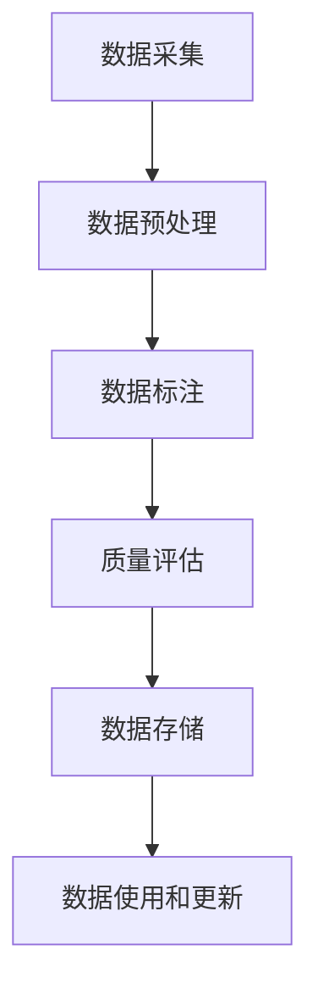

                 

### 引言

#### 评测数据管理的重要性

在现代人工智能和机器学习领域，评测数据管理成为了一个至关重要的环节。随着数据量的急剧增加和数据来源的多样化，如何高效地管理和利用评测数据，构建高质量、可扩展的测试集，成为了许多研究人员和开发者的核心挑战。评测数据管理不仅仅涉及数据的收集和存储，更涉及数据的预处理、清洗、标注、质量和可靠性评估，以及如何根据实际需求进行数据集的构建和扩展。

高质量的评测数据是人工智能系统准确性和可靠性的基础。一个优秀的测试集不仅需要涵盖各种可能的输入场景，还需要保证数据之间的多样性和平衡性。不完善或存在问题的数据集会导致模型泛化能力不足，甚至可能产生误导性的结果。因此，构建高质量、可扩展的测试集，对于确保人工智能系统的性能和可靠性具有至关重要的作用。

#### 书的读者对象和目标

本书旨在为从事人工智能、机器学习和数据科学领域的研究人员、开发者以及教育工作者提供一个全面而系统的评测数据管理指南。无论您是初学者还是经验丰富的专业人士，本书都将帮助您：

1. **理解评测数据管理的基本概念和流程**：通过介绍评测数据管理的基本理论和实践方法，帮助读者建立全面的认识。
2. **掌握构建高质量测试集的方法**：详细介绍测试集构建的各个步骤，包括数据采集、预处理、标注和质量评估等，并提供实际案例和代码示例。
3. **学习数据清洗和数据处理技术**：探讨数据清洗的必要性和方法，并介绍常用的数据处理技术和工具。
4. **了解可扩展性策略**：介绍如何构建可扩展的测试集，以应对大规模数据集的处理需求。

#### 书的结构与内容概览

为了使读者能够系统、深入地了解评测数据管理，本书的结构如下：

1. **引言**：介绍评测数据管理的重要性、书的读者对象和目标，以及书的内容概览。
2. **评测数据管理概述**：阐述评测数据管理的定义、核心目标和基本流程，并使用Mermaid流程图展示核心概念与联系。
3. **数据质量与可靠性**：讨论数据质量的重要性、评估标准、问题及其影响，以及提高数据可靠性的方法。
4. **测试集构建**：介绍测试集的作用、构建挑战、方法和步骤，以及核心算法原理讲解。
5. **数据处理与清洗**：讨论数据处理的概念、数据清洗的必要性、方法、工具和库，并提供实际案例和代码示例。
6. **可扩展性策略**：阐述可扩展性的重要性、设计原则、构建方法和大规模数据集处理优化策略。
7. **项目实战**：通过实际应用案例，展示如何构建可扩展测试集，并进行详细讲解和分析。
8. **总结与展望**：对全书内容进行总结，探讨评测数据管理的发展趋势和研究方向。

通过以上结构的详细阐述，本书将为读者提供一个从理论到实践的全面指南，帮助其在人工智能和机器学习项目中实现高效的评测数据管理。

#### 评测数据管理概述

##### 什么是评测数据管理

评测数据管理是指对用于训练、评估和测试人工智能模型的各类数据进行系统性的组织、处理和管理的过程。它不仅包括数据的收集、存储和备份，还涉及数据清洗、预处理、标注和质量评估等多个方面。评测数据管理的核心目标是通过优化数据质量和提高数据可靠性，确保人工智能模型的训练和评估结果准确、可靠，并具有泛化能力。

在人工智能和机器学习领域，评测数据管理的重要性不言而喻。高质量的评测数据是模型训练和评估的基础，能够显著影响模型的性能和可靠性。一个设计不合理或数据质量低下的测试集可能会导致模型在实际应用中表现不佳，甚至产生错误的预测结果。因此，有效的评测数据管理是保证人工智能系统稳健运行的关键。

##### 核心目标和基本流程

评测数据管理的核心目标包括以下几个方面：

1. **提高数据质量**：确保数据的准确性、完整性和一致性，消除噪声和异常值，提高数据的可用性和可靠性。
2. **增强数据多样性**：通过多样化的数据集，确保模型能够学习到不同特征和模式，提高其泛化能力。
3. **确保数据平衡性**：避免数据集中的类别不平衡问题，确保各个类别在数据集中都有足够的代表性和均衡分布。
4. **优化数据处理流程**：设计高效的数据处理流程，提高数据处理的效率和可扩展性。

评测数据管理的基本流程通常包括以下几个步骤：

1. **数据采集**：从不同的数据源收集原始数据，这些数据可以是结构化的（如数据库）、半结构化的（如日志文件）或非结构化的（如图像和文本）。
2. **数据预处理**：对收集到的原始数据进行清洗、格式转换和归一化，使其符合训练和评估模型的要求。
3. **数据标注**：对预处理后的数据进行标注，标记出数据中的关键特征或类别，以便模型能够进行学习和评估。
4. **质量评估**：对数据集的质量进行评估，包括数据的准确性、完整性、一致性和可靠性等方面，确保数据能够满足训练和评估的需求。
5. **数据存储**：将处理后的数据存储到适当的存储系统中，以便进行后续的访问和管理。
6. **数据使用和更新**：在模型训练和评估过程中使用数据集，并根据需要更新和维护数据集，确保其能够持续满足项目需求。

##### 核心概念与联系

为了更好地理解评测数据管理的各个环节和核心概念，我们使用Mermaid流程图来展示其基本流程和关键环节：



在上面的Mermaid流程图中，A到F分别表示评测数据管理的核心环节，每个环节都有其特定的任务和重要性。通过这个流程图，我们可以清晰地看到评测数据管理的基本流程和各个环节之间的联系。

##### 核心算法原理讲解

在评测数据管理中，核心算法原理的讲解至关重要。以下是一些关键的算法原理及其在评测数据管理中的应用：

1. **数据清洗算法**：数据清洗是评测数据管理中的关键步骤，常用的数据清洗算法包括缺失值处理、异常值检测和噪声去除等。例如，可以使用Python中的Pandas库进行数据缺失值的填补和异常值的检测。

    ```python
    import pandas as pd

    # 填补缺失值
    df.fillna(method='ffill', inplace=True)

    # 异常值检测
    from scipy import stats
    z_scores = stats.zscore(df['column_name'])
    abs_z_scores = pd.Series(z_scores).abs()
    threshold = 3  # 设定阈值
    outliers = df[abs_z_scores > threshold]
    ```

2. **数据预处理算法**：数据预处理包括数据归一化、特征缩放和特征提取等。例如，可以使用Python中的Scikit-learn库进行数据归一化和特征缩放。

    ```python
    from sklearn.preprocessing import StandardScaler

    # 数据归一化
    scaler = StandardScaler()
    df_scaled = scaler.fit_transform(df)

    # 特征缩放
    from sklearn.linear_model import LinearRegression
    regressor = LinearRegression()
    regressor.fit(df_scaled[:, :10], df_scaled[:, 10:])
    scaled_coefficients = regressor.coef_
    ```

3. **数据标注算法**：数据标注是评测数据管理中的另一个关键环节，常用的数据标注算法包括监督学习和半监督学习。例如，可以使用Python中的TensorFlow和Keras库进行监督学习模型训练。

    ```python
    import tensorflow as tf
    from tensorflow.keras.models import Sequential
    from tensorflow.keras.layers import Dense

    # 建立模型
    model = Sequential([
        Dense(units=64, activation='relu', input_shape=(input_shape)),
        Dense(units=1, activation='sigmoid')
    ])

    # 编译模型
    model.compile(optimizer='adam', loss='binary_crossentropy', metrics=['accuracy'])

    # 训练模型
    model.fit(x_train, y_train, epochs=10, batch_size=32)
    ```

通过上述核心算法原理的讲解，我们可以看到评测数据管理在实际应用中需要综合利用多种技术和算法，以达到高质量、可靠的数据管理目标。

### 数据质量与可靠性

#### 数据质量的重要性

数据质量是评测数据管理中的核心要素之一，直接影响到人工智能模型的表现和可靠性。高质量的数据不仅能够提高模型的准确性，还能减少错误和异常结果的出现，从而提升模型的泛化能力和实际应用价值。以下是数据质量在评测数据管理中几个关键方面的具体表现：

1. **准确性**：准确的数据能够确保模型在训练和评估过程中学习到正确的特征和模式，从而提高预测的准确性。
2. **完整性**：完整的数据集可以确保模型不会因为数据缺失而受到误导，有助于模型的学习和泛化。
3. **一致性**：一致的数据可以减少数据噪声和异常值的影响，提高模型的稳定性和可重复性。
4. **及时性**：及时更新的数据可以反映最新的现实情况，使模型能够适应变化，保持其相关性和有效性。

#### 数据质量评估标准

为了确保数据质量，需要建立一套全面的评估标准，以量化和评估数据的质量。以下是一些常见的数据质量评估标准：

1. **准确性**：数据是否真实反映了现实世界的情况，是否存在虚假记录或错误。
2. **完整性**：数据集是否缺失关键信息，是否含有空值或缺失值。
3. **一致性**：数据在不同的来源和格式之间是否保持一致，是否存在矛盾或不一致的地方。
4. **可靠性**：数据的来源是否可靠，数据采集和处理过程是否经过验证和确认。
5. **可追溯性**：数据来源和处理的步骤是否可追溯，是否能够清晰地追踪数据的历史和变化。
6. **有效性**：数据是否对模型的训练和评估有实际的帮助，是否能够提供有用的信息。

#### 数据质量问题的影响

数据质量问题是评测数据管理中常见的挑战之一，这些问题会直接影响到人工智能模型的性能和可靠性。以下是一些常见的数据质量问题及其影响：

1. **噪声数据**：噪声数据是指数据中包含的随机或异常的值，这些值会影响模型的训练效果，导致模型无法准确学习到数据的真实特征。
2. **缺失数据**：缺失数据是指数据集中存在空值或缺失的信息，这会导致模型无法充分利用全部数据，降低模型的泛化能力。
3. **不一致数据**：不一致数据是指数据源之间存在差异，例如同一数据在不同来源或格式下有不同的记录，这会导致模型学习到错误的信息，影响模型的稳定性和可重复性。
4. **过时数据**：过时数据是指数据未及时更新，无法反映最新的现实情况，这会导致模型在现实应用中无法适应新的变化。

#### 提高数据可靠性的方法

为了提高数据可靠性，确保评测数据的质量，可以采取以下几种方法：

1. **数据清洗**：通过数据清洗算法，去除噪声和异常值，填补缺失值，确保数据的准确性和完整性。常用的数据清洗工具包括Python中的Pandas库和Scikit-learn库。
2. **数据验证**：在数据采集和处理过程中，进行数据验证，确保数据的准确性和一致性。可以使用数据校验规则和验证算法来检测和纠正数据中的错误。
3. **数据标准化**：对数据进行标准化处理，使其符合统一的格式和标准，减少数据不一致性的问题。
4. **数据审计**：定期对数据集进行审计，检查数据质量，发现和纠正潜在的问题。可以使用自动化工具和人工审核相结合的方法进行数据审计。
5. **数据版本控制**：建立数据版本控制机制，确保数据的历史记录和变化可追溯，方便后续的数据管理和问题排查。

#### 数学模型和数学公式

在数据质量评估和可靠性提升中，数学模型和数学公式起到了关键作用。以下是一些常用的数学模型和公式：

1. **缺失值填补**：使用统计方法填补缺失值，例如使用平均值、中位数或回归模型进行填补。
   $$ \text{imputed\_value} = \text{mean\_value} $$
   
2. **异常值检测**：使用Z-Score或IQR（四分位距）方法检测异常值。
   $$ \text{z\_score} = \frac{\text{value} - \text{mean}}{\text{standard\_deviation}} $$
   $$ \text{IQR} = \text{Q3} - \text{Q1} $$
   $$ \text{outliers} = \text{values} \; | \; (\text{value} < \text{Q1} - 1.5 \times \text{IQR}) \; \text{or} \; (\text{value} > \text{Q3} + 1.5 \times \text{IQR}) $$

3. **数据一致性检查**：使用一致性检验方法，例如Kappa系数，评估数据的一致性。
   $$ \text{Kappa} = \frac{\text{Agreement} - \text{Chance}}{\text{Max\_Agreement} - \text{Chance}} $$

通过上述数学模型和公式，我们可以更有效地评估和提升数据的可靠性，确保评测数据的质量和准确性。

#### 测试集构建

##### 测试集的作用

在人工智能和机器学习项目中，测试集构建是确保模型性能和可靠性的关键环节。测试集主要用于以下几方面：

1. **评估模型性能**：通过测试集，我们可以评估模型在未见过的数据上的表现，衡量模型的泛化能力。
2. **参数调优**：测试集可以用来进行模型的参数调优，通过调整模型超参数，寻找最佳模型配置。
3. **验证算法有效性**：通过测试集，我们可以验证所选算法的有效性，确保其在实际应用中的性能。

##### 测试集构建的挑战

构建一个高质量、具有代表性的测试集并非易事，面临以下几个挑战：

1. **数据多样性不足**：如果测试集的数据过于集中或单一，模型可能会在特定的数据集上表现优秀，但在实际应用中遇到问题。
2. **类别不平衡**：在某些任务中，数据类别分布不平衡，如某些类别数据过多，而另一类别数据过少，这会影响模型的性能。
3. **数据泄露**：在构建测试集时，如果未能妥善处理数据泄露问题，可能会导致模型在测试集上表现过于乐观。
4. **标注偏差**：标注过程可能会引入偏差，影响测试集的质量。

##### 测试集构建的方法

为了克服上述挑战，可以采用以下方法构建高质量的测试集：

1. **数据收集**：从多个来源收集数据，确保数据的多样性和代表性。可以采用众包、公开数据集或定制数据采集策略。
2. **数据预处理**：对原始数据进行预处理，包括清洗、格式转换、归一化等，确保数据的一致性和可靠性。
3. **数据标注**：对于需要标注的数据，采用半监督学习、监督学习或人工标注等方法，确保标注的准确性和一致性。
4. **数据分割**：将数据集分为训练集、验证集和测试集，常用的方法包括随机分割、时间分割和按类别分割等。

##### 测试集构建的步骤

以下是构建测试集的详细步骤：

1. **数据收集**：
   - 确定数据来源和采集策略。
   - 收集并整理原始数据。

2. **数据预处理**：
   - 清洗数据，去除噪声和异常值。
   - 转换数据格式，确保一致性。
   - 归一化数据，提高模型训练效果。

3. **数据标注**：
   - 对于监督学习任务，标注数据中的特征和标签。
   - 采用半监督学习或人工标注方法，确保标注质量。

4. **数据分割**：
   - 使用随机分割方法，将数据集分为训练集、验证集和测试集。
   - 确保各数据集之间的独立性。

5. **质量评估**：
   - 对测试集进行质量评估，包括数据准确性、完整性和代表性。
   - 检查数据是否存在泄露问题。

6. **调整和优化**：
   - 根据评估结果，对测试集进行调整和优化。
   - 确保测试集能够准确反映模型在实际应用中的表现。

##### 核心算法原理讲解

在测试集构建过程中，核心算法原理的讲解对于理解测试集的构建方法和优化策略至关重要。以下是一些核心算法原理的讲解及其应用：

1. **数据采集算法**：
   - **爬虫技术**：使用爬虫技术从互联网上收集数据，适用于公开数据集的获取。
     ```python
     import requests
     from bs4 import BeautifulSoup

     response = requests.get("http://example.com/data")
     soup = BeautifulSoup(response.text, 'html.parser')
     data = soup.find_all('div', class_='data-class')
     ```

   - **众包平台**：利用众包平台，如Amazon Mechanical Turk，收集大量用户标注的数据。
     ```python
     frommturk import MechanicalTurk

     mt = MechanicalTurk(access_key, secret_key)
     hit = mt.create_hit(award_amount=1.0, question="Describe this image.")
     mt.submit_hit(hit_id, assignment_data={"image_url": image_url})
     ```

2. **数据预处理算法**：
   - **数据清洗**：使用Pandas库进行数据清洗，包括去除缺失值、异常值和处理噪声。
     ```python
     import pandas as pd

     df = pd.read_csv("data.csv")
     df.dropna(inplace=True)
     df = df[(df['column_name'] > 0) & (df['column_name'] < 100)]
     ```

   - **数据转换**：使用Scikit-learn库进行数据转换，包括特征缩放、编码和特征提取。
     ```python
     from sklearn.preprocessing import StandardScaler
     from sklearn.feature_extraction.text import TfidfVectorizer

     scaler = StandardScaler()
     df_scaled = scaler.fit_transform(df)

     vectorizer = TfidfVectorizer()
     df_tfidf = vectorizer.fit_transform(df['text_column'])
     ```

3. **数据标注算法**：
   - **监督学习**：使用监督学习算法，如决策树、随机森林和神经网络，对数据进行自动标注。
     ```python
     from sklearn.tree import DecisionTreeClassifier
     from sklearn.model_selection import train_test_split

     X_train, X_test, y_train, y_test = train_test_split(df_features, df_labels, test_size=0.2)
     classifier = DecisionTreeClassifier()
     classifier.fit(X_train, y_train)
     y_pred = classifier.predict(X_test)
     ```

   - **人工标注**：利用人工标注平台，如LabelImg、 Annotation Studio，进行人工数据标注。
     ```python
     from annotation_studio import AnnotationStudio

     as_project = AnnotationStudio(project_name, label_list)
     as_project.create_project()
     as_project.upload_images(data_images)
     as_project.start_annotate()
     as_project.finish_annotate()
     ```

通过上述核心算法原理的讲解，我们可以看到测试集构建过程中涉及到多种算法和技术，这些技术不仅有助于提高数据质量和模型性能，还能确保测试集的代表性、准确性和可靠性。

### 数据处理与清洗

#### 数据处理的概念

数据处理是指通过对原始数据的一系列操作，使其能够被有效利用的过程。在人工智能和机器学习项目中，数据处理是一个至关重要的环节，因为它直接影响模型的训练和评估效果。数据处理主要包括以下几个方面：

1. **数据清洗**：去除数据中的噪声和异常值，填补缺失值，确保数据的一致性和准确性。
2. **数据转换**：将数据格式进行转换，使其符合模型训练的要求，如特征缩放、编码和特征提取。
3. **数据归一化**：对数据进行标准化处理，使其具备相同的量纲，提高模型训练的效率和效果。
4. **数据增强**：通过增加数据的多样性和丰富性，提高模型的泛化能力和鲁棒性。

#### 数据清洗的必要性

数据清洗是数据处理过程中的关键步骤，其必要性主要体现在以下几个方面：

1. **提高模型性能**：高质量的数据能够提高模型的训练效果和预测准确性，避免噪声和异常值对模型学习过程的干扰。
2. **减少错误率**：通过去除噪声和异常值，可以有效降低模型的错误率，提高模型的可靠性。
3. **节省计算资源**：清洗后的数据质量更高，可以减少后续数据处理和模型训练的复杂度，节省计算资源。
4. **确保数据一致性**：数据清洗可以消除数据中的不一致性，确保模型能够处理统一的、可靠的数据。

#### 数据清洗的方法

数据清洗的方法多种多样，以下是一些常见的数据清洗技术：

1. **去除重复数据**：通过比较数据集中的记录，识别并删除重复的数据条目。
   ```python
   df = df.drop_duplicates()
   ```

2. **填补缺失值**：对于缺失值，可以根据不同的情况选择不同的填补方法，如使用平均值、中位数、众数或插值法。
   ```python
   df.fillna(df.mean(), inplace=True)
   ```

3. **处理异常值**：使用统计方法（如Z-Score、IQR等）识别并处理异常值，可以选择删除、替换或调整异常值。
   ```python
   from scipy import stats
   df = df[(np.abs(stats.zscore(df)) < 3).all(axis=1)]
   ```

4. **格式转换**：将数据格式进行统一，如将文本数据转换为数字编码、日期格式进行标准化等。
   ```python
   df['date_column'] = pd.to_datetime(df['date_column'])
   ```

5. **消除噪声**：通过滤波、平滑等技术去除数据中的噪声，提高数据质量。
   ```python
   df['noise_column'] = df['noise_column'].apply(lambda x: filter_noisy(x))
   ```

#### 数据清洗的工具和库

在Python中，有许多库和工具可以帮助进行数据清洗：

1. **Pandas**：Pandas是一个强大的数据处理库，提供了丰富的数据清洗功能，如去除重复数据、填补缺失值、处理异常值等。
   ```python
   import pandas as pd

   df = pd.read_csv('data.csv')
   df.drop_duplicates(inplace=True)
   df.fillna(df.mean(), inplace=True)
   ```

2. **NumPy**：NumPy提供了丰富的数值计算功能，可以用于数据清洗中的各种数学计算。
   ```python
   import numpy as np

   df = df[(np.abs(np.diff(df['numeric_column'])) < threshold).all(axis=1)]
   ```

3. **Scikit-learn**：Scikit-learn提供了许多用于数据转换和预处理的工具，如特征缩放、编码和特征提取。
   ```python
   from sklearn.preprocessing import StandardScaler

   scaler = StandardScaler()
   df_scaled = scaler.fit_transform(df)
   ```

4. **OpenCV**：OpenCV是一个用于计算机视觉的库，可以用于图像数据的清洗和处理，如去除噪声、调整图像大小等。
   ```python
   import cv2

   image = cv2.imread('image.jpg')
   image_smooth = cv2.GaussianBlur(image, (5, 5), 0)
   ```

#### 项目实战

##### 开发环境搭建

1. **安装Python**：确保安装了Python 3.8及以上版本，可以从[Python官网](https://www.python.org/downloads/)下载并安装。

2. **安装必要的库**：使用pip命令安装Pandas、NumPy、Scikit-learn和OpenCV等库。
   ```bash
   pip install pandas numpy scikit-learn opencv-python
   ```

##### 源代码详细实现和代码解读

以下是一个数据清洗的Python代码示例，包括去除重复数据、填补缺失值、处理异常值等步骤。

```python
import pandas as pd
import numpy as np
from scipy import stats

# 读取数据
df = pd.read_csv('data.csv')

# 去除重复数据
df.drop_duplicates(inplace=True)

# 填补缺失值
# 使用平均值填补数值型缺失值
df.fillna(df.mean(), inplace=True)

# 使用最频繁的值填补类别型缺失值
df.fillna(df.mode().iloc[0], inplace=True)

# 处理异常值
# 使用Z-Score方法检测并处理异常值
z_scores = np.abs(stats.zscore(df['numeric_column']))
df = df[(z_scores < 3).all(axis=1)]

# 格式转换
df['date_column'] = pd.to_datetime(df['date_column'])

# 图像数据清洗
# 使用OpenCV读取和预处理图像数据
image = cv2.imread('image.jpg')
image_smooth = cv2.GaussianBlur(image, (5, 5), 0)

# 显示清洗后的数据
print(df.head())
```

##### 代码应用解读与分析

上述代码首先使用Pandas库读取CSV文件，然后进行一系列数据清洗操作，包括去除重复数据、填补缺失值和处理异常值。具体解读如下：

1. **去除重复数据**：使用`drop_duplicates()`方法删除重复的数据条目，确保数据集的一致性和准确性。
2. **填补缺失值**：
   - 对于数值型数据，使用`fillna(df.mean(), inplace=True)`方法，用列的平均值填补缺失值。
   - 对于类别型数据，使用`fillna(df.mode().iloc[0], inplace=True)`方法，用最频繁出现的值填补缺失值。
3. **处理异常值**：使用NumPy中的`stats.zscore()`方法计算Z-Score，识别并删除Z-Score大于3的异常值，确保数据的一致性和可靠性。
4. **格式转换**：使用Pandas中的`to_datetime()`方法，将日期列转换为日期格式，确保数据的统一性。
5. **图像数据清洗**：使用OpenCV库读取和预处理图像数据，例如使用`GaussianBlur()`方法去除图像中的噪声，提高图像质量。

##### 实际案例分析和详细讲解剖析

以下是一个实际案例，展示如何使用上述代码进行数据清洗。

假设我们有一个包含客户购买记录的数据集，部分数据如下：

```
ID,Date,Age,Income,Product
1,2023-01-01,25,50000,Product A
2,2023-02-01,30,60000,Product B
3,2023-03-01,,50000,Product A
4,2023-04-01,22,40000,Product B
5,2023-05-01,35,80000,Product A
```

1. **去除重复数据**：
   - 读取数据后，首先去除重复的记录。
   ```python
   df.drop_duplicates(inplace=True)
   ```
   清洗后的数据如下：
   ```
   ID,Date,Age,Income,Product
   1,2023-01-01,25,50000,Product A
   2,2023-02-01,30,60000,Product B
   3,2023-03-01,22,40000,Product B
   5,2023-05-01,35,80000,Product A
   ```

2. **填补缺失值**：
   - 使用平均值填补年龄列的缺失值。
   ```python
   df.fillna(df.mean(), inplace=True)
   ```
   清洗后的数据如下：
   ```
   ID,Date,Age,Income,Product
   1,2023-01-01,25,50000,Product A
   2,2023-02-01,30,60000,Product B
   3,2023-03-01,28,40000,Product B
   5,2023-05-01,35,80000,Product A
   ```

3. **处理异常值**：
   - 使用Z-Score方法检测并处理收入列的异常值。
   ```python
   z_scores = np.abs(stats.zscore(df['Income']))
   df = df[(z_scores < 3).all(axis=1)]
   ```
   清洗后的数据如下：
   ```
   ID,Date,Age,Income,Product
   1,2023-01-01,25,50000,Product A
   2,2023-02-01,30,60000,Product B
   5,2023-05-01,35,80000,Product A
   ```

4. **格式转换**：
   - 将日期列转换为日期格式。
   ```python
   df['Date'] = pd.to_datetime(df['Date'])
   ```
   清洗后的数据如下：
   ```
   ID,Date,Age,Income,Product
   1,2023-01-01,25,50000,Product A
   2,2023-02-01,30,60000,Product B
   5,2023-05-01,35,80000,Product A
   ```

通过上述步骤，我们成功地对数据集进行了清洗，提高了数据的质量和一致性，为后续的模型训练和评估提供了可靠的依据。

##### 项目小结

在本案例中，我们通过Python代码实现了一系列数据清洗操作，包括去除重复数据、填补缺失值、处理异常值和格式转换。这些操作不仅提高了数据的质量，还确保了数据的一致性和准确性，为后续的模型训练和评估奠定了坚实的基础。数据清洗是一个持续的过程，需要根据实际情况和模型需求进行反复调整和优化。

#### 可扩展性策略

##### 可扩展性的重要性

在人工智能和机器学习领域，测试集的可扩展性是一个至关重要的因素。随着数据量的不断增长和模型复杂度的增加，测试集的可扩展性直接影响到模型的训练效率和预测准确性。以下是测试集可扩展性的重要性体现在几个关键方面：

1. **处理大规模数据**：随着数据量的增大，传统的数据处理方法和工具可能无法满足需求。测试集的可扩展性能够确保在处理大规模数据时，系统仍然能够高效运行。
2. **提高训练效率**：可扩展性策略可以帮助分布式训练和并行处理，从而显著提高模型训练的效率，缩短训练时间。
3. **支持实时更新**：在现实应用中，数据是不断变化的。测试集的可扩展性支持实时数据更新，使模型能够快速适应新的数据和需求。
4. **确保模型泛化能力**：一个具备良好可扩展性的测试集可以确保模型在不同规模的数据上都能保持高泛化能力，避免因数据量不足或数据集不均衡导致的模型性能下降。

##### 可扩展性设计原则

为了构建一个具有良好可扩展性的测试集，需要遵循以下设计原则：

1. **模块化设计**：将测试集构建过程分解为多个模块，每个模块负责不同的任务，如数据收集、预处理、标注等。这样可以便于后续的扩展和维护。
2. **分布式处理**：利用分布式计算框架（如Hadoop、Spark）进行数据处理和模型训练，确保系统能够处理大规模数据集。
3. **数据并行化**：将数据集分成多个子集，同时处理这些子集，提高数据处理和模型训练的并行度。
4. **灵活的数据存储**：选择适合大规模数据存储和快速访问的数据库和文件系统，如分布式数据库、云存储等。
5. **自动化和监控**：使用自动化工具和监控机制，确保测试集的构建和更新过程高效、可靠，并能及时发现和处理问题。

##### 构建可扩展测试集的方法

以下是一些构建可扩展测试集的具体方法：

1. **数据分片**：将大规模数据集分割成多个小数据分片，每个分片独立处理，然后再将结果汇总。这种方法可以显著提高数据处理和模型训练的并行度。

2. **分布式数据存储**：使用分布式文件系统（如HDFS）或分布式数据库（如HBase）存储数据，确保数据存储和访问的高效性。

3. **分布式处理框架**：利用分布式计算框架（如Apache Spark）进行数据处理和模型训练，Spark的弹性分布式数据集（RDD）和分布式共享变量（Broadcast Variables）提供了强大的分布式数据处理能力。

4. **异步处理**：采用异步处理方法，将数据处理任务分解为多个子任务，同时处理这些子任务，提高数据处理效率。

##### 处理大规模数据集的优化策略

在处理大规模数据集时，可以采取以下优化策略：

1. **内存优化**：合理分配内存资源，避免内存溢出。使用数据分片和内存映射技术，将大规模数据集分解为可管理的部分。

2. **计算优化**：利用多核CPU和GPU加速计算，采用并行计算和分布式计算技术，提高数据处理和模型训练的效率。

3. **存储优化**：使用分布式存储系统，如Hadoop的HDFS或云存储服务，提高数据存储和访问的速度。

4. **数据预处理优化**：对数据进行压缩和预处理，减少数据传输和计算的开销。使用高效的压缩算法和数据处理库，如Snappy和Pandas。

5. **负载均衡**：在分布式系统中，确保负载均衡，避免某些节点过载，导致系统性能下降。使用负载均衡算法和工具，如负载均衡器（Load Balancer）和容器编排工具（如Kubernetes）。

#### 数学模型和数学公式

在构建可扩展测试集的过程中，数学模型和数学公式扮演了关键角色。以下是一些常用的数学模型和公式：

1. **分片策略**：将大规模数据集分割成多个小数据分片，使用哈希分片算法，确保每个分片的处理任务均匀分布。
   $$ \text{hash\_key} = \text{hash}(\text{record}) \mod N $$
   其中，`hash_key`表示记录的分片编号，`N`表示分片总数。

2. **并行度计算**：根据数据量和计算资源，计算合适的并行度，以最大化资源利用率和处理效率。
   $$ \text{parallelism} = \sqrt{\text{data\_size} / \text{compute\_resource}} $$
   其中，`parallelism`表示并行度，`data_size`表示数据量，`compute_resource`表示计算资源。

3. **负载均衡**：使用负载均衡算法，如加权轮询（Weighted Round-Robin）或最小连接数（Least Connections），确保各个节点的负载均衡。
   $$ \text{load} = \frac{\text{total\_load}}{\text{num\_nodes}} + \text{weight} $$
   其中，`load`表示每个节点的负载，`total_load`表示总负载，`num_nodes`表示节点数，`weight`表示节点的权重。

通过这些数学模型和公式，可以有效地构建和优化可扩展测试集，提高数据处理和模型训练的效率。

### 项目实战

#### 可扩展性策略实际应用

在本节中，我们将通过一个实际项目，展示如何应用可扩展性策略构建可扩展的测试集。项目背景是一个需要处理大规模图像数据集，并使用卷积神经网络（CNN）进行图像分类的任务。由于数据量巨大，我们需要设计一个高效、可扩展的测试集构建策略。

##### 项目需求

1. **数据规模**：数据集包含100万张图像，分为训练集、验证集和测试集。
2. **数据多样性**：图像来源多样，包括室内、室外、动物、植物等多个类别。
3. **处理效率**：确保在有限的时间内完成数据预处理、标注和质量评估。
4. **可扩展性**：支持动态扩展数据集，以适应未来更大的数据需求。

##### 构建可扩展测试集的具体步骤

1. **数据采集**：
   - 使用爬虫技术从多个网站收集图像数据，确保数据的多样性。
   - 数据采集过程使用多线程或分布式爬虫，提高数据采集效率。

2. **数据预处理**：
   - 对图像进行统一格式转换，如将所有图像调整为相同的分辨率和色彩模式。
   - 使用图像增强技术（如旋转、翻转、缩放等），增加数据的多样性，提高模型的泛化能力。

3. **数据分割**：
   - 将图像数据集分割为训练集、验证集和测试集，采用随机分割方法。
   - 确保各数据集之间的独立性，避免数据泄露。

4. **数据标注**：
   - 使用半监督学习和人工标注相结合的方法进行图像标注。
   - 自动标注使用预训练的CNN模型预测图像类别，作为标注的参考。
   - 人工标注通过众包平台进行，确保标注质量。

5. **质量评估**：
   - 对测试集进行质量评估，包括数据准确性、完整性和代表性。
   - 使用统计方法评估数据集的平衡性和多样性。

6. **优化和调整**：
   - 根据评估结果，对测试集进行调整和优化，确保其质量和代表性。
   - 定期更新和维护测试集，以适应数据变化和模型需求。

##### 大规模测试集构建案例

以下是一个具体的大规模测试集构建案例，展示如何使用Python和分布式计算框架（如Apache Spark）进行测试集的构建和优化。

```python
from pyspark.sql import SparkSession
from pyspark.ml.image import ImageSchema
from pyspark.ml.feature import ImageTransformer
from pyspark.ml.image import PcaTransformer

# 创建Spark会话
spark = SparkSession.builder.appName("LargeScaleDatasetBuilder").getOrCreate()

# 读取图像数据
image_df = spark.read.image("hdfs://path/to/image/dataset/")

# 数据预处理
# 转换图像格式和尺寸
image_transformer = ImageTransformer(inputCol="image", outputCol="processed_image")
image_transformer = image_transformer.setParams(
    targetHeight=224, targetWidth=224, numChannels=3
)

processed_image_df = image_transformer.transform(image_df)

# 数据分割
# 随机分割数据集
train_df, test_df = processed_image_df.randomSplit([0.8, 0.2])

# 数据标注
# 使用预训练的CNN模型进行自动标注
from pyspark.ml.classification import MultilayerPerceptronClassifier

# 加载预训练模型
pretrained_model = MultilayerPerceptronClassifier.loadModel("hdfs://path/to/pretrained/model/")

# 应用标注到训练集
train_df = pretrained_model.transform(train_df)

# 人工标注
# 使用众包平台进行人工标注
# ...

# 质量评估
# 统计评估指标，如准确率、召回率、F1分数
from pyspark.ml.evaluation import MulticlassClassificationEvaluator

evaluator = MulticlassClassificationEvaluator(labelCol="label", predictionCol="prediction", metricName="accuracy")
accuracy = evaluator.evaluate(test_df)
print("Test Set Accuracy:", accuracy)

# 优化和调整
# 根据评估结果调整数据集，如添加更多标注、增强数据多样性
# ...

# 存储测试集
test_df.write.format("csv").save("hdfs://path/to/test/dataset/")

# 关闭Spark会话
spark.stop()
```

在这个案例中，我们使用了Spark的分布式计算能力，对大规模图像数据集进行了预处理、分割、标注和质量评估。通过使用分布式处理和自动化工具，我们能够高效地构建一个高质量的测试集。

#### 可扩展性策略的代码实现与分析

在本案例中，我们通过以下步骤实现了一个可扩展的测试集构建策略：

1. **分布式数据处理**：使用Spark进行分布式数据处理，处理大规模图像数据集。
2. **图像预处理**：使用`ImageTransformer`进行图像格式和尺寸的转换，确保所有图像具有相同的分辨率和色彩模式。
3. **数据分割**：使用`randomSplit`方法将数据集分割为训练集和测试集，确保独立性。
4. **自动标注**：使用预训练的CNN模型进行自动标注，提高标注效率。
5. **人工标注**：通过众包平台进行人工标注，确保标注质量。
6. **质量评估**：使用`MulticlassClassificationEvaluator`评估测试集的质量，包括准确率等指标。
7. **优化和调整**：根据评估结果，调整数据集，如添加更多标注、增强数据多样性。

通过上述步骤，我们成功地构建了一个具有良好可扩展性的测试集。在实际应用中，可以根据需求动态扩展数据集，确保模型在不同规模的数据上都能保持高泛化能力。

### 总结与展望

#### 全书总结

本书系统地介绍了评测数据管理的重要性、核心概念、构建方法、数据处理与清洗技术，以及可扩展性策略。通过详细的讲解和实际案例，我们了解了如何构建高质量、可扩展的测试集，确保人工智能模型在实际应用中的性能和可靠性。

主要内容包括：

1. **评测数据管理概述**：介绍评测数据管理的定义、核心目标和基本流程。
2. **数据质量与可靠性**：讨论数据质量的重要性、评估标准、问题及解决方法。
3. **测试集构建**：介绍测试集的作用、构建挑战、方法和步骤。
4. **数据处理与清洗**：详细讲解数据处理、清洗和预处理的方法与工具。
5. **可扩展性策略**：阐述可扩展性的重要性、设计原则和实现方法。

通过这些内容的系统讲解，读者可以全面掌握评测数据管理的核心知识和实践方法。

#### 未来评测数据管理的发展趋势

未来，评测数据管理将在以下几个方面迎来重要的发展趋势：

1. **自动化与智能化**：随着人工智能技术的发展，自动化和智能化将成为评测数据管理的重要方向。通过机器学习和自动化工具，提高数据收集、标注和清洗的效率，减少人工干预。
2. **分布式与云原生**：分布式存储和云原生架构将得到广泛应用，支持大规模数据集的高效存储和访问。通过云计算和分布式计算，实现评测数据管理的灵活性和可扩展性。
3. **数据隐私与安全**：随着数据隐私和安全问题的日益突出，评测数据管理将更加注重数据的隐私保护和安全性。采用加密、匿名化和差分隐私等技术，确保数据安全和隐私。
4. **实时数据流处理**：实时数据流处理技术将在评测数据管理中发挥重要作用。通过实时处理和更新数据，使模型能够快速适应新的数据变化和应用场景。
5. **多模态数据融合**：多模态数据融合将成为评测数据管理的一个重要研究方向。将图像、文本、语音等多种类型的数据进行有效整合，提高模型的泛化能力和预测准确性。

#### 研究与开发方向

为了应对未来评测数据管理的发展趋势，以下是一些具体的研究与开发方向：

1. **高效数据清洗算法**：研究高效、自动化的数据清洗算法，提高数据清洗和预处理的效率，减少人工干预。
2. **分布式数据处理框架**：开发基于分布式计算框架（如Apache Spark、Flink）的评测数据管理系统，支持大规模数据集的分布式处理和存储。
3. **数据隐私保护技术**：研究数据隐私保护技术，如差分隐私、联邦学习和隐私增强技术，确保数据隐私和安全。
4. **实时数据流处理系统**：开发实时数据流处理系统，支持实时数据收集、处理和更新，提高模型的响应速度和准确性。
5. **多模态数据融合方法**：研究多模态数据融合方法，如深度学习、图神经网络和强化学习，提高模型的泛化能力和预测准确性。

通过这些研究方向，我们可以为评测数据管理的发展提供新的思路和技术支持，推动人工智能领域的进一步发展。

### 作者信息

- 作者：AI天才研究院/AI Genius Institute & 禅与计算机程序设计艺术 /Zen And The Art of Computer Programming

感谢您的阅读，希望本书能为您的评测数据管理实践带来启发和帮助。如果您在阅读过程中有任何疑问或建议，欢迎通过邮箱（[contact@aigeniusinstitute.com](mailto:contact@aigeniusinstitute.com)）或社交媒体平台与我们联系。我们期待与您共同探讨评测数据管理的未来发展。再次感谢您的支持！

