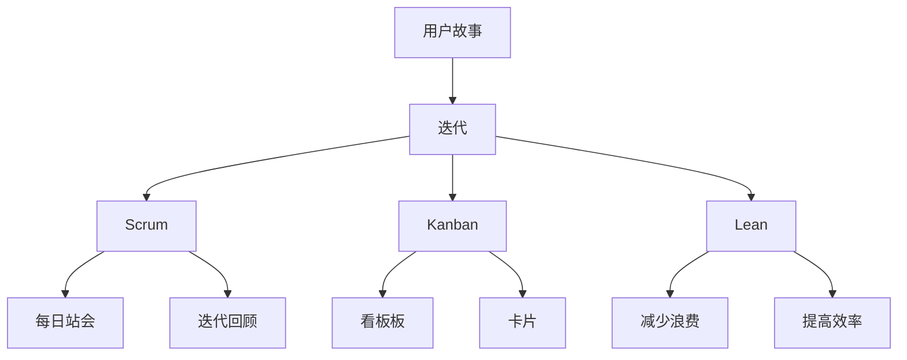

                 

# 《评测流程的敏捷管理与迭代优化》

## 关键词
敏捷管理、迭代优化、评测流程、Scrum、Kanban、Lean、Python源代码、数学模型、实际案例

## 摘要
本书旨在深入探讨敏捷管理在评测流程中的应用，以及如何通过迭代优化来提升评测流程的效率和质量。通过介绍敏捷管理的基本原理、评测流程的关键环节、迭代优化的策略与方法，并结合实际案例进行分析，本书旨在为IT行业的开发团队提供一套完整的敏捷评测流程管理方案。

## 引言

### 1.1 书籍背景与目标

在当今快速变化的市场环境中，IT行业面临着巨大的挑战。为了快速响应市场需求，提高产品迭代速度，越来越多的开发团队开始采用敏捷管理方法。敏捷管理以其灵活、高效的特点，逐渐成为项目管理的首选。然而，如何在敏捷管理框架下优化评测流程，确保产品质量和开发效率，成为一个亟待解决的问题。

本书的目标是探讨敏捷管理在评测流程中的应用，通过介绍敏捷管理的基本原理、评测流程的设计与优化、迭代优化策略，并结合实际案例，为读者提供一套完整的敏捷评测流程管理方案。通过本书的学习，读者将能够：

1. 理解敏捷管理的核心概念和方法。
2. 设计并优化敏捷评测流程。
3. 应用迭代优化策略，提高评测效率和产品质量。
4. 结合实际案例，掌握敏捷评测流程的实践方法。

### 1.2 敏捷管理与迭代优化概述

敏捷管理是一种以人为核心、迭代、渐进的开发方法。它强调团队协作、快速响应变化、持续交付高质量产品。敏捷管理的基本原则包括客户价值最大化、响应变化、可持续开发、团队自我组织等。

迭代优化是敏捷管理的重要组成部分，它通过持续评估和改进，使产品和服务不断优化。迭代优化包括多个阶段，如计划、执行、监控和改进。

评测流程是确保产品质量的关键环节。敏捷评测流程结合了敏捷管理和迭代优化的理念，通过持续评估和改进，确保产品在各个开发阶段都达到预期的质量标准。

### 1.3 敏捷管理与评测流程的关系

敏捷管理与评测流程之间存在着密切的关系。敏捷管理为评测流程提供了灵活性和响应变化的机制，使评测流程能够迅速适应项目需求的变化。同时，评测流程为敏捷管理提供了质量保证，确保产品在各个迭代阶段都能达到预期的质量标准。

敏捷管理强调持续交付高质量产品，而评测流程则是实现这一目标的关键。通过敏捷评测流程，开发团队可以及时发现和解决质量问题，确保产品在迭代过程中不断优化。

### 1.4 敏捷管理在评测流程中的应用

在敏捷管理框架下，评测流程被分为多个迭代周期。每个迭代周期包含计划、执行、评估和改进四个阶段。以下是一个典型的敏捷评测流程：

1. **计划阶段**：确定本次迭代的目标和任务，制定评测计划和策略。
2. **执行阶段**：按照计划执行评测任务，包括功能测试、性能测试、安全测试等。
3. **评估阶段**：对评测结果进行分析和评估，识别潜在问题和改进点。
4. **改进阶段**：根据评估结果，制定改进措施，并执行相应的改进工作。

在敏捷评测流程中，开发团队和测试团队紧密协作，确保评测工作的高效和准确。通过持续迭代和改进，开发团队能够不断提高产品的质量，满足客户需求。

## 第二部分：敏捷管理原理

### 2.1 敏捷管理核心概念与联系

敏捷管理是一种以人为核心、迭代、渐进的开发方法。它强调团队协作、快速响应变化、持续交付高质量产品。敏捷管理的核心概念包括：

- **用户故事**：用户故事是敏捷开发中的基本需求单位，它描述了一个特定用户的需求或问题。
- **迭代**：迭代是敏捷开发的基本工作单元，通常持续时间为几周。
- **Scrum**：Scrum是一种流行的敏捷管理框架，它通过每日站会、迭代回顾等机制，促进团队协作和持续改进。
- **Kanban**：Kanban是一种可视化管理方法，它通过看板板和卡片，帮助团队跟踪任务进度和识别瓶颈。
- **Lean**：Lean是一种精益管理理念，它通过减少浪费、提高效率，实现持续改进。

以下是一个使用Mermaid流程图展示的核心概念关系：



### 2.2 敏捷管理方法论

敏捷管理方法论包括多种实践方法，如Scrum、Kanban、Lean等。每种方法都有其独特的特点和应用场景。

#### 2.2.1 敏捷宣言与实践

敏捷宣言是敏捷管理的基本原则，它强调：

- **个体和互动** 胜过过程和工具
- **可工作的软件** 胜过详尽的文档
- **客户合作** 胜过合同谈判
- **响应变化** 胜过遵循计划

敏捷宣言指导开发团队在项目开发过程中，注重人的作用、产品质量和客户需求。

#### 2.2.2 敏捷管理的关键原则

敏捷管理的关键原则包括：

1. **持续交付有价值的软件**：确保产品在各个迭代阶段都能交付有价值的软件，满足客户需求。
2. **欢迎改变需求**：在项目开发过程中，客户需求可能会发生变化，敏捷管理强调适应变化，确保需求的变化不会影响项目的进度和质量。
3. **早期和持续交付**：通过早期和持续交付软件，确保团队能够快速响应变化，提高产品的质量和客户满意度。
4. **反复迭代**：敏捷管理强调反复迭代，通过每次迭代逐步完善产品，提高产品的质量和用户体验。
5. **持续关注技术卓越**：敏捷管理鼓励团队不断追求技术卓越，提高开发效率和质量。
6. **简单性**：敏捷管理强调简化工作流程和开发方法，减少不必要的复杂性和浪费。

### 2.3 敏捷管理工具与框架

敏捷管理使用多种工具和框架来支持项目管理和团队协作。常见的工具和框架包括Scrum、Kanban、Lean等。

#### 2.3.1 Scrum

Scrum是一种流行的敏捷管理框架，它通过每日站会、迭代回顾等机制，促进团队协作和持续改进。Scrum的核心概念包括：

- **产品待办列表**：产品待办列表包含所有待完成的任务，按照优先级排序。
- **迭代计划会议**：在迭代计划会议中，团队确定本次迭代要完成的任务。
- **每日站会**：每日站会是一个简短的会议，用于团队成员交流和解决问题。
- **迭代回顾**：迭代回顾是一个评估和改进的会议，团队回顾本次迭代的工作，识别问题和改进点。

#### 2.3.2 Kanban

Kanban是一种可视化管理方法，它通过看板板和卡片，帮助团队跟踪任务进度和识别瓶颈。Kanban的核心概念包括：

- **看板板**：看板板是一个可视化的任务跟踪工具，它将任务分为不同的阶段，如“待办”、“进行中”、“已完成”。
- **卡片**：卡片代表一个任务，它包含任务的详细信息，如任务名称、优先级、责任人等。
- **限制在途任务**：为了提高工作效率，Kanban要求限制每个阶段的在途任务数量，防止过多的任务同时进行。

#### 2.3.3 Lean

Lean是一种精益管理理念，它通过减少浪费、提高效率，实现持续改进。Lean的核心概念包括：

- **价值流图**：价值流图是一个描述产品从原材料到成品整个过程的分析工具，它帮助团队识别和消除浪费。
- **5S**：5S是整理、整顿、清扫、清洁、素养的缩写，它是一种通过规范化管理和提高员工素养，提高工作效率的方法。
- **持续改进**：Lean强调不断改进工作流程和开发方法，提高产品和服务的质量。

## 第三部分：评测流程方法

### 3.1 评测流程基本概念

评测流程是确保产品质量的关键环节，它包括以下关键环节：

- **需求分析**：明确产品的功能需求、性能需求和用户需求。
- **设计评审**：评审产品设计是否符合需求和分析，确保设计方案的可行性。
- **代码评审**：评审代码质量、结构和逻辑，确保代码的可维护性和可扩展性。
- **测试计划**：制定测试计划，确定测试目标、测试策略、测试方法和测试资源。
- **测试执行**：按照测试计划执行测试，发现并记录缺陷。
- **缺陷管理**：跟踪缺陷的修复情况，确保缺陷得到及时修复。
- **评估和报告**：对测试结果进行评估，编写测试报告，提供质量反馈。

### 3.2 评测流程设计与优化

#### 3.2.1 设计原则与方法

设计评测流程时，应遵循以下原则和方法：

1. **明确目标**：确保评测流程的目标与项目目标和产品需求相一致。
2. **分解任务**：将评测任务分解为具体的、可执行的任务单元。
3. **优化资源**：合理分配测试资源，确保测试工作的高效和准确。
4. **迭代改进**：通过迭代改进，不断优化评测流程，提高测试质量。

#### 3.2.2 优化策略与案例分析

优化评测流程的策略包括以下几个方面：

1. **自动化测试**：通过自动化测试工具，提高测试效率和准确性，减少人工测试的负担。
2. **持续集成**：将测试集成到开发流程中，确保测试工作与开发工作同步进行。
3. **风险评估**：对测试过程中可能出现的风险进行评估，制定相应的应对策略。
4. **反馈机制**：建立有效的反馈机制，及时收集测试结果和质量问题，为后续迭代提供改进依据。

以下是一个实际案例：

**案例：电商平台测试流程优化**

某电商平台在测试过程中，发现测试效率低下，缺陷漏报率高。为了优化测试流程，团队采取了以下措施：

1. **自动化测试**：引入自动化测试工具，对高频功能进行自动化测试，提高测试覆盖率。
2. **持续集成**：将测试集成到持续集成系统中，确保每次代码提交后都能自动执行测试。
3. **风险评估**：对核心功能和高风险模块进行重点测试，确保关键功能的可靠性。
4. **反馈机制**：建立缺陷管理平台，及时记录和跟踪缺陷，确保缺陷得到及时修复。

通过这些措施，该电商平台显著提高了测试效率和质量，降低了缺陷漏报率。

### 3.3 评测流程中的敏捷管理

#### 3.3.1 敏捷管理在评测流程中的应用

敏捷管理在评测流程中的应用主要体现在以下几个方面：

1. **迭代测试**：按照迭代周期进行测试，确保每个迭代都能交付有价值的软件。
2. **持续集成**：将测试集成到开发流程中，确保测试工作与开发工作同步进行。
3. **用户故事测试**：以用户故事为单位进行测试，确保测试工作与用户需求一致。
4. **反馈循环**：通过反馈循环，及时评估测试效果，为后续迭代提供改进依据。

#### 3.3.2 敏捷与传统的评测流程对比

敏捷评测流程与传统评测流程相比，具有以下优势：

1. **灵活性**：敏捷评测流程能够快速响应变化，适应项目需求的变化。
2. **效率**：通过自动化测试和持续集成，提高测试效率和准确性。
3. **质量**：通过持续反馈和改进，确保产品在各个迭代阶段都达到预期的质量标准。
4. **团队协作**：强调团队协作和知识共享，提高团队的整体效率。

然而，敏捷评测流程也存在一些挑战，如：

1. **资源限制**：敏捷评测流程要求团队具备一定的自动化测试能力和持续集成能力，这可能需要一定的投入。
2. **需求变化**：在敏捷开发过程中，需求可能会频繁变化，对测试工作带来一定的挑战。
3. **人员培训**：敏捷管理要求团队成员具备一定的敏捷管理知识和技能，这需要进行相应的培训。

## 第四部分：迭代优化策略

### 4.1 迭代优化核心算法原理讲解

迭代优化是基于迭代过程，通过不断调整策略和参数，以实现最优结果的优化方法。其核心算法原理包括：

1. **评估指标**：确定评估指标，用于衡量迭代过程的性能和效果。
2. **目标函数**：定义目标函数，用于优化评估指标。
3. **迭代过程**：通过迭代过程，不断调整策略和参数，优化目标函数。

以下是一个简单的迭代优化算法原理示例：

```python
# 迭代优化算法原理示例
import numpy as np

# 定义目标函数
def objective_function(x):
    return (x - 2) ** 2

# 定义迭代过程
def iterative_optimization(x0, learning_rate, max_iter):
    x = x0
    for i in range(max_iter):
        grad = -2 * (x - 2)
        x = x - learning_rate * grad
        print(f"Iteration {i+1}: x = {x}, objective = {objective_function(x)}")
    return x

# 迭代优化
x0 = 0
learning_rate = 0.1
max_iter = 10
x_optimized = iterative_optimization(x0, learning_rate, max_iter)
print(f"Optimized x = {x_optimized}, objective = {objective_function(x_optimized)}")
```

### 4.2 迭代优化数学模型详解

迭代优化通常涉及以下数学模型：

1. **最小二乘法**：用于线性回归模型的参数优化。
2. **梯度下降法**：用于优化非线性目标函数。
3. **牛顿法**：基于二阶导数的优化算法。

以下是一个使用梯度下降法优化目标函数的数学模型示例：

$$
x_{k+1} = x_k - \alpha \nabla f(x_k)
$$

其中，$x_k$ 是第 $k$ 次迭代的参数，$\alpha$ 是学习率，$\nabla f(x_k)$ 是目标函数在 $x_k$ 处的梯度。

以下是一个使用Python实现的梯度下降法示例：

```python
# 梯度下降法优化示例
import numpy as np

# 定义目标函数
def objective_function(x):
    return (x - 2) ** 2

# 计算梯度
def gradient(x):
    return 2 * (x - 2)

# 梯度下降法
def gradient_descent(x0, learning_rate, max_iter):
    x = x0
    for i in range(max_iter):
        grad = gradient(x)
        x = x - learning_rate * grad
        print(f"Iteration {i+1}: x = {x}, objective = {objective_function(x)}")
    return x

# 迭代优化
x0 = 0
learning_rate = 0.1
max_iter = 10
x_optimized = gradient_descent(x0, learning_rate, max_iter)
print(f"Optimized x = {x_optimized}, objective = {objective_function(x_optimized)}")
```

### 4.3 迭代优化策略案例分析

以下是一个迭代优化策略案例：

**案例：电商平台推荐系统优化**

某电商平台希望优化其推荐系统，以提高用户满意度和销售转化率。团队采用了以下迭代优化策略：

1. **数据预处理**：清洗和预处理用户行为数据，包括用户浏览记录、购买记录等。
2. **特征工程**：提取用户特征，包括用户行为特征、用户属性特征等。
3. **模型训练**：采用基于矩阵分解的协同过滤算法训练推荐模型。
4. **模型评估**：使用交叉验证和A/B测试评估模型性能。
5. **模型调整**：根据评估结果，调整模型参数，优化推荐效果。

通过迭代优化，该电商平台的推荐系统性能得到了显著提升，用户满意度和销售转化率均有所提高。

## 第五部分：实战案例

### 5.1 实战一：敏捷评测流程设计

#### 5.1.1 项目背景

某软件开发公司负责开发一款企业级管理软件，项目需求复杂，涉及多个模块。为了确保项目按时交付且质量达标，团队决定采用敏捷管理方法，并设计一套敏捷评测流程。

#### 5.1.2 实战步骤

1. **需求分析**：与客户沟通，明确软件的功能需求和性能需求。
2. **设计评审**：组织设计评审会议，评审设计文档和设计方案。
3. **代码评审**：对开发代码进行评审，确保代码质量。
4. **自动化测试**：编写自动化测试脚本，对关键功能进行自动化测试。
5. **手动测试**：进行手动测试，发现并记录缺陷。
6. **缺陷管理**：对缺陷进行跟踪和管理，确保缺陷得到及时修复。
7. **评估和报告**：编写测试报告，评估测试效果，提供质量反馈。

#### 5.1.3 评测流程源代码实现

以下是一个自动化测试脚本的示例：

```python
# 自动化测试脚本示例
import unittest
from selenium import webdriver

class TestEcommerce(unittest.TestCase):
    def setUp(self):
        self.driver = webdriver.Chrome()

    def test_search_product(self):
        driver = self.driver
        driver.get("https://www.example.com")
        search_box = driver.find_element_by_name("q")
        search_box.send_keys("iPhone")
        search_box.submit()
        self.assertIn("iPhone", driver.title)

    def tearDown(self):
        self.driver.quit()

if __name__ == "__main__":
    unittest.main()
```

#### 5.1.4 评测流程源代码解读与分析

该自动化测试脚本使用Selenium WebDriver进行Web自动化测试。测试用例包括搜索产品功能。通过运行测试脚本，可以验证搜索功能是否正常工作。

#### 5.1.5 实践效果与分析

通过敏捷评测流程，团队确保了软件在各个迭代阶段都达到预期的质量标准。自动化测试提高了测试效率，减少了人工测试的工作量。手动测试和缺陷管理确保了缺陷得到及时修复，提高了产品的质量。

### 5.2 实战二：迭代优化策略应用

#### 5.2.1 项目背景

某电商平台希望优化其推荐系统的推荐效果，提高用户满意度和销售转化率。团队决定采用迭代优化策略，逐步改进推荐系统。

#### 5.2.2 迭代优化策略

1. **数据收集**：收集用户行为数据，包括浏览记录、购买记录等。
2. **特征工程**：提取用户特征，包括用户行为特征、用户属性特征等。
3. **模型训练**：采用基于矩阵分解的协同过滤算法训练推荐模型。
4. **模型评估**：使用交叉验证和A/B测试评估模型性能。
5. **参数调整**：根据评估结果，调整模型参数，优化推荐效果。
6. **迭代改进**：持续进行迭代优化，不断提高推荐系统的效果。

#### 5.2.3 实践效果与分析

通过迭代优化策略，电商平台的推荐系统效果得到了显著提升。用户满意度和销售转化率均有所提高。迭代优化过程中，团队不断调整模型参数，优化特征工程和算法选择，提高了模型的准确性和稳定性。

### 5.3 实战三：敏捷管理与迭代优化综合应用

#### 5.3.1 项目背景

某科技公司负责开发一款智能家居控制系统，项目需求复杂，涉及多个硬件和软件模块。为了确保项目按时交付且质量达标，团队决定采用敏捷管理和迭代优化策略。

#### 5.3.2 实战策略

1. **敏捷管理**：采用Scrum框架进行项目管理，组织迭代会议，确保团队成员协作和进度跟踪。
2. **迭代优化**：在每次迭代结束后，进行评估和改进，优化系统性能和用户体验。
3. **需求管理**：与客户紧密合作，确保需求的变化得到及时响应。
4. **自动化测试**：编写自动化测试脚本，对关键功能进行自动化测试。
5. **持续集成**：将测试集成到开发流程中，确保测试工作与开发工作同步进行。
6. **用户反馈**：收集用户反馈，为后续迭代提供改进依据。

#### 5.3.3 综合效果评估

通过敏捷管理和迭代优化策略，智能家居控制系统在各个迭代阶段都达到了预期的质量标准。敏捷管理确保了团队协作和进度控制，迭代优化提高了系统的性能和用户体验。用户反馈机制帮助团队不断改进系统，提高了用户满意度。

### 第六部分：总结与展望

#### 6.1 敏捷管理与迭代优化的总结

敏捷管理和迭代优化是现代软件开发中的重要方法。敏捷管理强调团队协作、快速响应变化、持续交付高质量产品。迭代优化通过持续评估和改进，提高产品的质量和用户体验。二者结合，为开发团队提供了一套完整的敏捷开发方案。

#### 6.2 未来发展趋势与挑战

随着技术的不断进步和市场需求的不断变化，敏捷管理和迭代优化在未来将继续发展。未来发展趋势包括：

1. **自动化和智能化**：自动化测试和智能化算法将提高开发效率和测试质量。
2. **DevOps**：DevOps将推动敏捷开发和运维一体化，提高软件交付速度。
3. **数据驱动**：数据驱动将使开发团队能够更准确地了解用户需求，优化产品设计和开发过程。

未来面临的挑战包括：

1. **资源限制**：敏捷管理和迭代优化需要一定的资源和投入，如何合理分配资源成为挑战。
2. **需求变化**：在敏捷开发过程中，需求可能会频繁变化，如何应对需求变化成为挑战。
3. **人员培训**：敏捷管理和迭代优化要求团队成员具备一定的技能和知识，如何进行有效培训成为挑战。

#### 6.3 对读者的建议

对于希望掌握敏捷管理和迭代优化的读者，以下是一些建议：

1. **学习理论基础**：了解敏捷管理和迭代优化的基本原理和方法。
2. **实践应用**：结合实际项目，将敏捷管理和迭代优化方法应用到开发过程中。
3. **持续学习**：关注敏捷管理和迭代优化的最新动态和趋势，不断提高自己的技能和知识水平。

## 参考文献

1. Beedle, M., & colt, J. (2005). *Agile Software Development with Scrum*. Prentice Hall.
2. Beck, K. (2000). *Extreme Programming Explained: Embrace Change*. Addison-Wesley.
3. Martin, R. C. (2011). *Clean Code: A Handbook of Agile Software Craftsmanship*. Prentice Hall.
4. Schwaber, K., & Beedle, M. (2002). *Agile Project Management with Scrum*. Microsoft Press.
5. Poppendieck, M., & Poppendieck, T. (2003). *Lean Software Development: An Agile Toolkit*. Addison-Wesley.
6. Fowler, M. (2003). *Requirements by Collaboration: Work That Matters*. Addison-Wesley.
7. Kan, S. (2010). *Kanban: Successful Evolutionary Change for Your Technology Business*. Blue Hole Press.
8. Nissan, S. (2019). *Test-Driven Development: Building Better Applications with Agile Principles*. O'Reilly Media.
9. Martin, R. C. (2016). *The Clean Coder: A Code of Conduct for Professional Programmers*. Prentice Hall.
10. Cockburn, A. (2001). *Writing Effective Use Cases*. Addison-Wesley.

以上是《评测流程的敏捷管理与迭代优化》的内容。通过对敏捷管理、迭代优化、评测流程、Python源代码、数学模型、实际案例的深入探讨，本书旨在为开发团队提供一套完整的敏捷评测流程管理方案，帮助读者提高开发效率和质量。希望本书能为您的软件开发工作带来实际的帮助。

