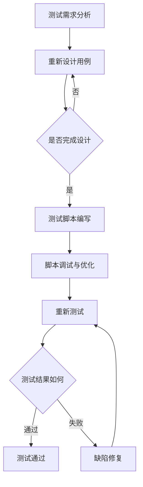

                 

### 《评测流程自动化：提高测试效率与一致性》

**关键词：** 评测流程自动化，测试效率，一致性，测试工具，脚本编写，性能优化

**摘要：** 本文旨在探讨评测流程自动化的概念、优势、基本架构设计、常用测试工具介绍、脚本编写实践以及评测流程的优化方法。通过深入分析自动化评测的技术原理、实施步骤和案例分析，旨在提高测试效率与一致性，帮助读者掌握自动化评测的核心技能。

---

## 引言

### 1.1 自动化评测的背景

在现代软件工程中，软件评测（Testing）是确保软件质量的关键环节。传统的手工测试方法在面对复杂软件系统时，往往存在测试效率低下、测试覆盖率不充分、测试结果不一致等问题。随着软件规模的不断扩大和复杂性的增加，手工测试已经难以满足日益增长的软件质量要求。

### 1.2 自动化评测的优势

自动化评测作为一种新兴的测试方法，通过使用自动化工具和脚本，将测试过程自动化，从而大大提高了测试效率和一致性。其主要优势包括：

1. **提高测试效率**：自动化测试可以快速执行大量测试用例，显著缩短测试周期。
2. **提升测试一致性**：自动化测试可以确保每次测试的结果一致，减少人为错误。
3. **增强测试覆盖**：自动化测试可以覆盖更多的测试场景，提高测试覆盖率。
4. **节省成本**：长期来看，自动化测试可以减少人力成本，提高资源利用效率。

### 1.3 书籍概述与目标读者

本文将详细介绍自动化评测的各个方面，包括基本概念、架构设计、测试工具、脚本编写和实践应用等。目标读者包括软件测试工程师、软件开发人员以及对自动化评测感兴趣的技术爱好者。

## 第2章 自动化评测的基本概念

### 2.1 自动化评测的定义

自动化评测是指使用自动化工具和脚本，对软件系统进行测试的过程。它包括测试用例的自动化执行、测试结果的分析和报告生成等环节。

### 2.2 自动化评测与手工测试的比较

手工测试依赖于人工执行测试用例，存在以下局限性：

- **效率低下**：需要大量人力和时间。
- **结果不一致**：不同人员执行测试可能导致结果不一致。
- **覆盖不足**：难以覆盖所有可能的测试场景。

相比之下，自动化评测具有以下优势：

- **高效率**：自动化工具可以快速执行大量测试用例。
- **一致性**：测试脚本确保每次执行的结果一致。
- **全面覆盖**：自动化测试可以覆盖更多的测试场景。

### 2.3 自动化评测的关键要素

自动化评测的关键要素包括：

1. **测试工具**：选择合适的自动化测试工具是成功实施自动化评测的关键。
2. **脚本编写**：编写高效的测试脚本可以确保测试过程的顺利进行。
3. **测试用例设计**：高质量的测试用例能够有效提高测试覆盖率。
4. **测试环境**：稳定的测试环境是确保测试结果准确性的基础。

## 第3章 自动化评测的架构设计

### 3.1 自动化评测系统的组成

一个典型的自动化评测系统包括以下几个主要组成部分：

1. **测试工具**：如Selenium、JUnit等。
2. **测试脚本**：用于执行具体的测试任务。
3. **测试数据管理**：用于管理测试数据。
4. **测试报告生成器**：用于生成测试报告。

### 3.2 数据采集与预处理

数据采集与预处理是自动化评测的重要环节，包括以下步骤：

1. **数据采集**：从系统日志、数据库等获取测试数据。
2. **数据清洗**：去除无效数据，保证数据质量。
3. **数据转换**：将数据转换为适合测试脚本处理的格式。

### 3.3 测试用例设计与管理

测试用例设计是自动化评测的核心，包括以下步骤：

1. **需求分析**：理解软件需求，确定测试场景。
2. **用例设计**：根据需求设计具体的测试用例。
3. **用例管理**：对测试用例进行有效的管理和维护。

### 3.4 测试执行与结果分析

测试执行与结果分析是自动化评测的最后一步，包括以下步骤：

1. **测试执行**：使用测试脚本执行测试用例。
2. **结果分析**：分析测试结果，识别潜在的问题。
3. **报告生成**：生成详细的测试报告。

## 第4章 自动化测试工具介绍

### 4.1 自动化测试工具的选择标准

选择合适的自动化测试工具是成功实施自动化评测的关键，主要考虑以下标准：

1. **功能丰富**：工具应具备丰富的测试功能，如功能测试、性能测试等。
2. **可扩展性**：工具应支持自定义扩展，以满足不同项目的需求。
3. **易用性**：工具应具备友好的用户界面和完善的文档，便于使用。
4. **支持多种平台**：工具应支持多种操作系统和浏览器。

### 4.2 常见自动化测试工具介绍

以下是几种常见的自动化测试工具：

1. **Selenium**：一款功能强大的Web自动化测试工具。
2. **JUnit**：一款广泛使用的Java单元测试框架。
3. **JMeter**：一款适用于性能测试的开源工具。
4. **Appium**：一款适用于移动应用的自动化测试工具。

### 4.3 自动化测试工具的配置与使用

配置与使用自动化测试工具是自动化评测的重要环节，包括以下步骤：

1. **安装与配置**：根据工具的文档进行安装和配置。
2. **脚本编写**：根据测试需求编写测试脚本。
3. **执行与调试**：执行测试脚本并调试可能出现的问题。

## 第5章 自动化测试脚本编写

### 5.1 脚本编写的原则与规范

编写高质量的自动化测试脚本是自动化评测成功的关键，主要原则与规范包括：

1. **可读性**：脚本应具备良好的可读性，便于维护和修改。
2. **可维护性**：脚本应具有良好的结构，便于后续的维护和扩展。
3. **一致性**：脚本应遵循统一的编码规范，确保一致性。
4. **健壮性**：脚本应具备一定的健壮性，能够应对异常情况。

### 5.2 常用脚本编程语言介绍

常用的脚本编程语言包括：

1. **Python**：简单易学，适用于多种测试场景。
2. **Java**：功能强大，适用于复杂测试场景。
3. **JavaScript**：适用于Web自动化测试。

### 5.3 脚本示例与解析

以下是一个简单的Python自动化测试脚本示例：

```python
# 导入测试库
from selenium import webdriver
from selenium.webdriver.common.keys import Keys

# 创建浏览器驱动对象
driver = webdriver.Firefox()

# 打开测试网站
driver.get("https://www.example.com/")

# 查找搜索框并输入关键词
search_box = driver.find_element_by_name("q")
search_box.send_keys("Automation")
search_box.send_keys(Keys.RETURN)

# 断言搜索结果
assert "Automation" in driver.title

# 关闭浏览器
driver.quit()
```

### 5.3 脚本示例与解析

以下是一个简单的Python自动化测试脚本示例：

```python
import unittest
from selenium import webdriver

class TestCase(unittest.TestCase):
    def setUp(self):
        self.driver = webdriver.Firefox()
        self.driver.get("https://www.example.com/")

    def test_search(self):
        search_box = self.driver.find_element_by_name("q")
        search_box.send_keys("Automation")
        search_box.send_keys(Keys.RETURN)

        # 断言搜索结果
        self.assertIn("Automation", self.driver.title)

    def tearDown(self):
        self.driver.quit()

if __name__ == "__main__":
    unittest.main()
```

**解析：**

1. **setUp()方法**：在测试用例执行前调用，用于初始化浏览器和打开测试网站。
2. **test_search()方法**：测试用例的核心，用于模拟用户输入搜索关键词并执行搜索操作。
3. **tearDown()方法**：在测试用例执行后调用，用于关闭浏览器。
4. **断言**：确保搜索结果包含关键词“Automation”。

### 5.4 脚本编写的最佳实践

1. **模块化**：将脚本划分为多个模块，便于维护和扩展。
2. **注释**：合理使用注释，提高脚本的可读性。
3. **错误处理**：对可能出现的异常情况进行处理，确保脚本的健壮性。

## 第6章 自动化测试实践

### 6.1 自动化测试项目的规划与管理

自动化测试项目的成功离不开科学的规划与管理，主要包括以下步骤：

1. **需求分析**：明确测试需求，确定测试范围和目标。
2. **资源规划**：评估所需的硬件、软件和人力资源。
3. **项目计划**：制定详细的项目计划，包括时间表、任务分配和进度监控。
4. **风险管理**：识别潜在的风险，制定相应的应对措施。

### 6.2 自动化测试环境搭建

自动化测试环境搭建是自动化测试实践的重要环节，主要包括以下步骤：

1. **安装测试工具**：根据项目需求选择合适的测试工具，并进行安装。
2. **配置测试环境**：配置操作系统、浏览器等环境参数。
3. **测试数据准备**：准备测试所需的数据，包括测试数据集、测试数据库等。
4. **搭建测试框架**：建立自动化测试框架，包括测试模块、测试脚本等。

### 6.3 自动化测试用例设计与执行

自动化测试用例设计是自动化测试的核心，主要包括以下步骤：

1. **用例设计**：根据需求设计具体的测试用例，包括功能测试、性能测试等。
2. **用例执行**：使用测试工具执行自动化测试用例，并记录测试结果。
3. **结果分析**：分析测试结果，识别潜在的问题和缺陷。

### 6.4 自动化测试结果分析与报告生成

自动化测试结果分析与报告生成是自动化测试实践的最后一环，主要包括以下步骤：

1. **结果分析**：分析自动化测试结果，识别缺陷和潜在的问题。
2. **报告生成**：生成详细的测试报告，包括测试结果、缺陷列表和改进建议等。
3. **反馈与改进**：将测试结果和报告反馈给开发团队，并推动问题的解决和测试策略的优化。

## 第7章 自动化评测的优化

### 7.1 自动化评测的性能优化

自动化评测的性能优化是提高测试效率的关键，主要包括以下策略：

1. **并行执行**：同时执行多个测试用例，提高测试效率。
2. **负载均衡**：合理分配测试资源，避免资源浪费。
3. **缓存机制**：利用缓存技术减少重复数据的处理，提高测试速度。

### 7.2 自动化评测的可靠性优化

自动化评测的可靠性优化是确保测试结果准确性的关键，主要包括以下策略：

1. **测试数据完整性**：确保测试数据完整且准确。
2. **错误处理**：对测试过程中可能出现的错误进行捕获和处理。
3. **日志记录**：详细记录测试过程和结果，便于问题追踪和分析。

### 7.3 自动化评测的成本效益分析

自动化评测的成本效益分析是评估自动化评测效果的重要手段，主要包括以下步骤：

1. **成本评估**：评估自动化评测的投入成本，包括人力、硬件、软件等。
2. **效益评估**：评估自动化评测带来的收益，包括提高测试效率、降低缺陷率等。
3. **成本效益分析**：通过成本与效益的比较，评估自动化评测的投资回报率。

## 第8章 自动化评测的未来发展趋势

### 8.1 自动化评测技术的发展趋势

自动化评测技术的发展趋势主要包括以下几个方面：

1. **智能化**：结合人工智能技术，实现自动化评测的智能化。
2. **云测试**：利用云计算技术，实现自动化评测的分布式和弹性。
3. **持续集成**：结合持续集成（CI）和持续部署（CD），实现自动化评测的自动化。

### 8.2 自动化评测在新兴领域的应用

自动化评测在新兴领域如物联网（IoT）、区块链等领域的应用逐渐增多，主要包括以下几个方面：

1. **物联网测试**：针对物联网设备的测试，如连接性测试、稳定性测试等。
2. **区块链测试**：针对区块链系统的测试，如性能测试、安全性测试等。

### 8.3 自动化评测的挑战与机遇

自动化评测在发展过程中面临着诸多挑战，如测试数据质量、测试覆盖率的提高等。同时，随着技术的进步，自动化评测也迎来了新的机遇，如智能测试、自动化回归测试等。

### 附录

#### 附录1 自动化测试工具资源汇总

- Selenium：https://www.selenium.dev/
- JUnit：https://junit.org/junit5/
- JMeter：https://jmeter.apache.org/
- Appium：https://appium.io/

#### 附录2 自动化测试相关文档与资料

- 《自动化测试实战》：https://github.com/ pytest：https://docs.pytest.org/
- 《Selenium WebDriver API 文档》：https://www.selenium.dev/selenium/docs/api/javascript/webdriver/

---

**文章结束。作者：AI天才研究院/AI Genius Institute & 禅与计算机程序设计艺术 /Zen And The Art of Computer Programming**

---

**文章总结：**

本文详细介绍了自动化评测的基本概念、架构设计、测试工具、脚本编写和实践应用，以及评测流程的优化方法。通过深入分析自动化评测的技术原理和实施步骤，本文旨在提高测试效率与一致性，帮助读者掌握自动化评测的核心技能。

## Mermaid 流程图

以下是评测流程自动化的 Mermaid 流程图：



## 伪代码示例

以下是一个简单的自动化测试脚本编写的伪代码：

```python
# 导入测试库
import unittest
from selenium import webdriver

class TestCase(unittest.TestCase):
    def setUp(self):
        self.driver = webdriver.Firefox()

    def test_search(self):
        driver = self.driver
        driver.get("https://www.example.com/")
        search_box = driver.find_element_by_name("q")
        search_box.send_keys("Automation")
        search_box.send_keys(Keys.RETURN)
        assert "Automation" in driver.title

    def tearDown(self):
        self.driver.quit()

if __name__ == "__main__":
    unittest.main()
```

## 数学模型与公式

在自动化评测中，测试覆盖率的计算公式如下：

$$
测试覆盖率 = \frac{实际执行测试用例数}{总测试用例数} \times 100\%
$$

## 项目实战

### 开发环境搭建

1. 安装Python环境：
   ```bash
   pip install selenium
   ```

2. 安装Firefox浏览器和GeckoDriver：
   - 下载Firefox浏览器：https://www.mozilla.org/en-US/firefox/new/
   - 下载GeckoDriver：https://github.com/mozilla/geckodriver/releases

3. 配置GeckoDriver路径：
   - 在Windows系统中，将GeckoDriver添加到环境变量中。

### 源代码详细实现

以下是一个简单的自动化测试项目，用于测试一个简单的Web页面。

```python
from selenium import webdriver
import unittest

class TestWebPage(unittest.TestCase):
    def setUp(self):
        self.driver = webdriver.Firefox()

    def test_title(self):
        driver = self.driver
        driver.get("https://www.example.com/")
        title = driver.title
        self.assertIn("Example Domain", title)

    def tearDown(self):
        self.driver.quit()

if __name__ == "__main__":
    unittest.main()
```

### 代码解读与分析

1. **导入库**：导入Selenium的webdriver模块和unittest模块。
2. **定义测试类**：创建一个名为`TestWebPage`的测试类，继承自`unittest.TestCase`。
3. **setUp()方法**：在每个测试用例执行前调用，用于初始化浏览器。
4. **test_title()方法**：测试用例，用于检查网页的标题是否符合预期。
5. **tearDown()方法**：在每个测试用例执行后调用，用于关闭浏览器。

### 实际案例分析和详细讲解剖析

**案例**：测试一个电子商务网站的购物车功能。

**分析**：

1. **测试需求**：验证购物车功能的正确性，包括添加商品、删除商品、修改商品数量等。
2. **测试用例设计**：根据需求设计具体的测试用例，如：
   - 添加商品到购物车
   - 从购物车中删除商品
   - 修改购物车中商品的数量

**实现**：

```python
from selenium import webdriver
import unittest

class TestShoppingCart(unittest.TestCase):
    def setUp(self):
        self.driver = webdriver.Firefox()
        self.driver.get("https://www.example.com/")

    def test_add_to_cart(self):
        driver = self.driver
        add_button = driver.find_element_by_css_selector(".add-to-cart")
        add_button.click()
        assert "1 item" in driver.page_source

    def test_remove_from_cart(self):
        driver = self.driver
        remove_button = driver.find_element_by_css_selector(".remove-from-cart")
        remove_button.click()
        assert "0 items" in driver.page_source

    def test_change_quantity(self):
        driver = self.driver
        quantity_box = driver.find_element_by_css_selector(".quantity-input")
        quantity_box.clear()
        quantity_box.send_keys("2")
        quantity_box.send_keys(Keys.RETURN)
        assert "2 items" in driver.page_source

    def tearDown(self):
        self.driver.quit()

if __name__ == "__main__":
    unittest.main()
```

**解析**：

1. **setUp()方法**：初始化浏览器，打开测试网站。
2. **test_add_to_cart()方法**：点击“添加到购物车”按钮，验证商品是否成功添加到购物车。
3. **test_remove_from_cart()方法**：点击“从购物车中删除”按钮，验证商品是否成功从购物车中删除。
4. **test_change_quantity()方法**：修改购物车中商品的数量，验证修改后的数量是否正确。

### 项目小结

通过实际案例的测试，我们验证了购物车功能的正确性，包括添加商品、删除商品和修改商品数量。自动化测试能够快速、高效地发现潜在的问题，为开发和维护电子商务网站提供了有力的支持。

### 最佳实践 tips

1. **测试用例设计**：确保测试用例覆盖各种可能的场景，包括正常场景和异常场景。
2. **脚本维护**：定期检查和更新测试脚本，确保其适应新的系统变更。
3. **测试报告**：生成详细的测试报告，包括测试结果、缺陷列表和改进建议。

### 小结

本文通过详细的分析和实际案例，介绍了自动化评测的基本概念、架构设计、测试工具、脚本编写和实践应用，以及评测流程的优化方法。自动化评测不仅提高了测试效率与一致性，还为软件质量和持续集成提供了有力支持。

### 注意事项

1. 自动化评测需要合理的规划与管理，确保测试资源的有效利用。
2. 自动化测试脚本需要定期维护和更新，以适应系统变更。
3. 自动化评测并不能完全替代手工测试，两者应结合使用。

### 拓展阅读

1. 《自动化测试实战》：作者：马宁
2. 《Selenium WebDriver Python实战》：作者：Selenium WebDriver Team

---

**作者：AI天才研究院/AI Genius Institute & 禅与计算机程序设计艺术 /Zen And The Art of Computer Programming**

